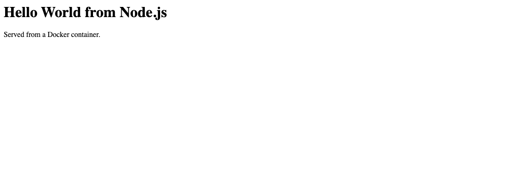
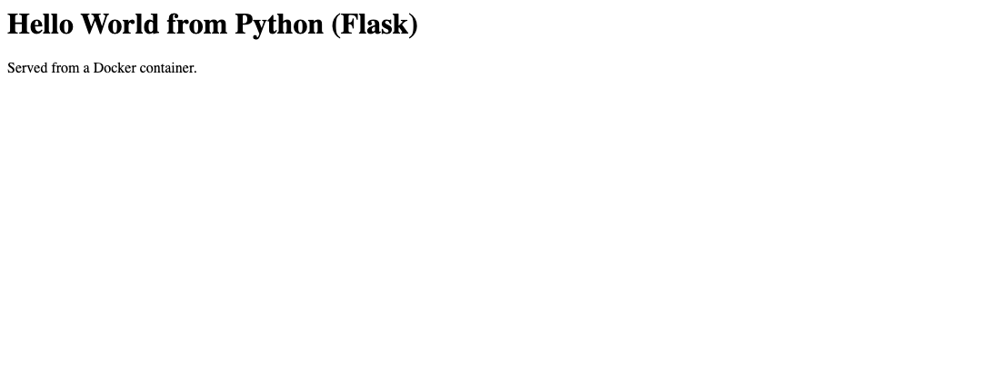
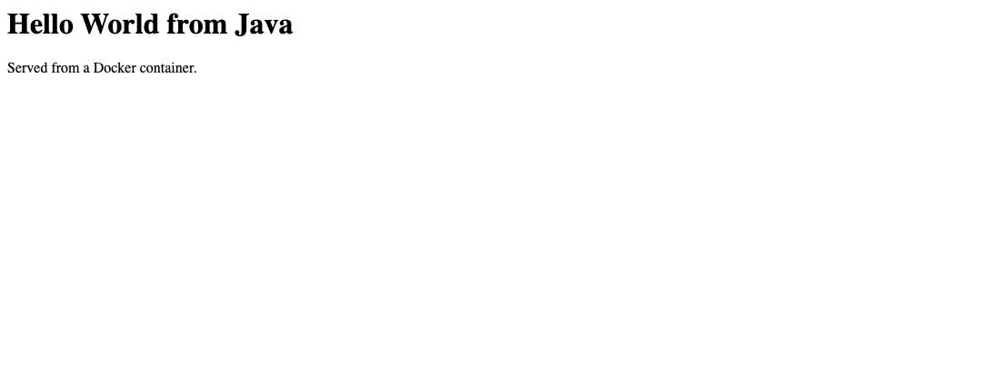
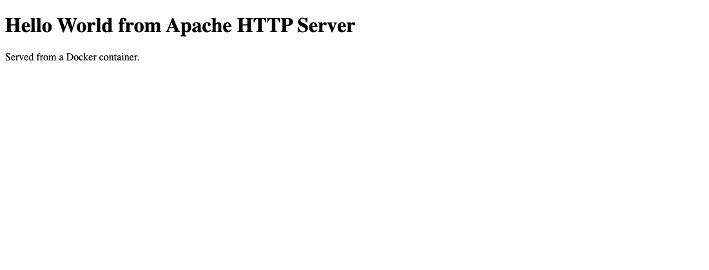
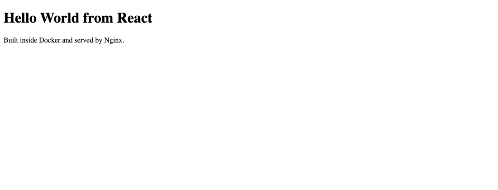
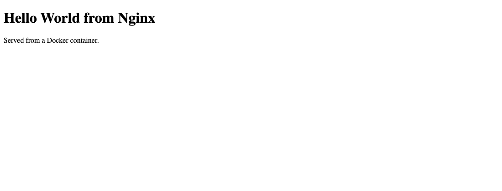

# Docker Fundamentals: Hello World apps

**Name:** Kartavya Panchal
**Roll No.:** 24BCS10343

Six Hello World web apps, each in its own folder with its own Dockerfile, each built, run as a
container and checked in a browser.

```
05-docker-fundamentals/
├── nodejs-app/     app.js, package.json, Dockerfile
├── python-app/     app.py, requirements.txt, Dockerfile
├── java-app/       Main.java, Dockerfile
├── Apache-app/     index.html, Dockerfile
├── React-app/      src/, public/, package.json, Dockerfile  (multi-stage)
├── nginx-app/      index.html, Dockerfile
├── screenshots/
└── README.md
```

| App | Base image | Container port | Host port | Image size |
|---|---|---|---|---|
| Node.js | `node:20-alpine` | 3000 | 3100 | 194 MB |
| Python (Flask) | `python:3.12-slim` | 5000 | 5001 | 234 MB |
| Java | `eclipse-temurin:21-jdk` | 8080 | 8090 | 744 MB |
| Apache httpd | `httpd:2.4` | 80 | 8081 | 205 MB |
| React | `node:20-alpine` then `nginx:alpine` | 80 | 8082 | 102 MB |
| Nginx | `nginx:alpine` | 80 | 8083 | 102 MB |

Ports 3000 and 8080 were already taken on my laptop, so on the host side Node went to 3100 and
Java to 8090. Inside the containers they still listen on 3000 and 8080, which is the whole
point of the left half of `-p 3100:3000`.

## Screenshots

| | |
|---|---|
| Node.js, localhost:3100 | Python / Flask, localhost:5001 |
|  |  |
| Java, localhost:8090 | Apache, localhost:8081 |
|  |  |
| React, localhost:8082 | Nginx, localhost:8083 |
|  |  |

---

## The Dockerfiles

**`nodejs-app/Dockerfile`** is a plain Node HTTP server with no framework, so there is nothing
to install.

```dockerfile
FROM node:20-alpine

WORKDIR /app

# manifest first, so this layer stays cached when only the code changes
COPY package.json ./
COPY app.js ./

EXPOSE 3000

CMD ["node", "app.js"]
```

**`python-app/Dockerfile`** uses Flask, so `requirements.txt` is copied and installed before
the code goes in. That ordering means editing `app.py` doesn't trigger a reinstall.

```dockerfile
FROM python:3.12-slim

WORKDIR /app

# deps before code, so editing app.py doesn't re-run pip install
COPY requirements.txt ./
RUN pip install --no-cache-dir -r requirements.txt

COPY app.py ./

EXPOSE 5000

CMD ["python", "app.py"]
```

**`java-app/Dockerfile`** uses the JDK's own `com.sun.net.httpserver`, so there's no Maven or
Gradle involved. `javac` runs during the build rather than at startup.

```dockerfile
FROM eclipse-temurin:21-jdk

WORKDIR /app

COPY Main.java ./

# compile during the build, so the container starts straight into the app
RUN javac Main.java

EXPOSE 8080

CMD ["java", "Main"]
```

**`Apache-app/Dockerfile`** just drops my HTML into the docroot the official image already
serves.

```dockerfile
FROM httpd:2.4

COPY index.html /usr/local/apache2/htdocs/index.html

EXPOSE 80
```

**`React-app/Dockerfile`** needs two stages. React has to be compiled into static files, and
none of the tooling that does that is needed to serve them. Stage one bundles with Node, stage
two copies just `dist/` into Nginx, so `node_modules` never reaches the final image. That is
the difference between 102 MB and something closer to 400 MB.

```dockerfile
# build stage
FROM node:20-alpine AS build

WORKDIR /app

COPY package.json ./
RUN npm install

COPY public ./public
COPY src ./src

RUN npm run build

# serve stage: only dist/ crosses over, no node_modules
FROM nginx:alpine

COPY --from=build /app/dist /usr/share/nginx/html

EXPOSE 80
```

**`nginx-app/Dockerfile`**, same idea as Apache.

```dockerfile
FROM nginx:alpine

COPY index.html /usr/share/nginx/html/index.html

EXPOSE 80
```

---

## Building and running

The same four steps for each app:

```bash
docker build -t hello-nodejs:1.0 nodejs-app
docker run -d --name hello-node -p 3100:3000 hello-nodejs:1.0
docker logs hello-node
curl http://localhost:3100
```

I've cut the buildkit progress lines out of the session below, they were pages of `#4 DONE 0.0s`.

```console
===================================================================
  hello-node  ->  http://localhost:3100
===================================================================
$ docker build -t hello-nodejs:1.0 nodejs-app
#9 naming to docker.io/library/hello-nodejs:1.0 done

$ docker run -d --name hello-node -p 3100:3000 hello-nodejs:1.0
530f4083cbbe51989d52e8cfd3fe574b3f5dd1fc29ca6773656baaeaea38833c

$ docker ps --filter name=hello-node --format 'table {{.Names}}\t{{.Image}}\t{{.Status}}\t{{.Ports}}'
NAMES        IMAGE              STATUS                  PORTS
hello-node   hello-nodejs:1.0   Up Less than a second   0.0.0.0:3100->3000/tcp, [::]:3100->3000/tcp

$ docker logs hello-node --tail 3
Node.js app listening on port 3000

$ curl -s http://localhost:3100
<h1>Hello World from Node.js</h1><p>Served from a Docker container.</p>

===================================================================
  hello-python  ->  http://localhost:5001
===================================================================
$ docker build -t hello-python:1.0 python-app
#10 naming to docker.io/library/hello-python:1.0 done

$ docker run -d --name hello-python -p 5001:5000 hello-python:1.0
53e2524a8d67563abc25b5cf3cdcda62a61a09f6818e9f4ec5a3236c800e6d4f

$ docker logs hello-python --tail 3
 * Running on http://172.17.0.6:5000
Press CTRL+C to quit
192.168.65.1 - - [03/Sep/2026 15:58:24] "GET / HTTP/1.1" 200 -

$ curl -s http://localhost:5001
<h1>Hello World from Python (Flask)</h1><p>Served from a Docker container.</p>

===================================================================
  hello-java  ->  http://localhost:8090
===================================================================
$ docker build -t hello-java:1.0 java-app
#9 naming to docker.io/library/hello-java:1.0 done

$ docker run -d --name hello-java -p 8090:8080 hello-java:1.0
c9408ba8c3cf6bf071c1057f1d32e6faaf6a43ac664dca0e6a3a7000820ed3da

$ docker logs hello-java --tail 3
Java app listening on port 8080

$ curl -s http://localhost:8090
<h1>Hello World from Java</h1><p>Served from a Docker container.</p>

===================================================================
  hello-apache  ->  http://localhost:8081
===================================================================
$ docker build -t hello-apache:1.0 Apache-app
#7 naming to docker.io/library/hello-apache:1.0 done

$ docker run -d --name hello-apache -p 8081:80 hello-apache:1.0
a8503a61c3838f570656cdb9ca646e505ec5a1625ae1c1ab1c235bb9f8781b1f

$ docker logs hello-apache --tail 3
[Thu Sep 03 15:58:27.719987 2026] [mpm_event:notice] [pid 1:tid 1] AH00489: Apache/2.4.68 (Unix) configured -- resuming normal operations
[Thu Sep 03 15:58:27.720141 2026] [core:notice] [pid 1:tid 1] AH00094: Command line: 'httpd -D FOREGROUND'
192.168.65.1 - - [03/Sep/2026:15:58:27 +0000] "GET / HTTP/1.1" 200 199

$ curl -s http://localhost:8081
<!doctype html>
<html>
  <head>
    <title>Apache Hello World</title>
  </head>
  <body>
    <h1>Hello World from Apache HTTP Server</h1>
    <p>Served from a Docker container.</p>
  </body>
</html>

===================================================================
  hello-react  ->  http://localhost:8082
===================================================================
$ docker build -t hello-react:1.0 React-app
#15 naming to docker.io/library/hello-react:1.0 done

$ docker run -d --name hello-react -p 8082:80 hello-react:1.0
b3fbb0001c4d3f1e1f8dc1ff9d3d3655566cf62c978d17162c85e170ec316eb8

$ docker logs hello-react --tail 3
2026/09/03 15:58:29 [notice] 1#1: start worker process 43
2026/09/03 15:58:29 [notice] 1#1: start worker process 44
192.168.65.1 - - [03/Sep/2026:15:58:29 +0000] "GET / HTTP/1.1" 200 199 "-" "curl/8.7.1" "-"

$ curl -s http://localhost:8082
<!doctype html>
<html>
  <head>
    <meta charset="utf-8" />
    <title>React Hello World</title>
  </head>
  <body>
    <div id="root"></div>
    <script src="bundle.js"></script>
  </body>
</html>

===================================================================
  hello-nginx  ->  http://localhost:8083
===================================================================
$ docker build -t hello-nginx:1.0 nginx-app
#7 naming to docker.io/library/hello-nginx:1.0 done

$ docker run -d --name hello-nginx -p 8083:80 hello-nginx:1.0
a40d9317b16ba24189e260da4e640941e3acb12900e08b3cc07064c3424d680e

$ curl -s http://localhost:8083
<!doctype html>
<html>
  <head>
    <title>Nginx Hello World</title>
  </head>
  <body>
    <h1>Hello World from Nginx</h1>
    <p>Served from a Docker container.</p>
  </body>
</html>

===================================================================
  all six up together
===================================================================
$ docker ps --filter name=hello- --format 'table {{.Names}}\t{{.Image}}\t{{.Status}}\t{{.Ports}}'
NAMES          IMAGE              STATUS                  PORTS
hello-nginx    hello-nginx:1.0    Up Less than a second   0.0.0.0:8083->80/tcp, [::]:8083->80/tcp
hello-react    hello-react:1.0    Up Less than a second   0.0.0.0:8082->80/tcp, [::]:8082->80/tcp
hello-apache   hello-apache:1.0   Up 2 seconds            0.0.0.0:8081->80/tcp, [::]:8081->80/tcp
hello-java     hello-java:1.0     Up 3 seconds            0.0.0.0:8090->8080/tcp, [::]:8090->8080/tcp
hello-python   hello-python:1.0   Up 5 seconds            0.0.0.0:5001->5000/tcp, [::]:5001->5000/tcp
hello-node     hello-nodejs:1.0   Up 7 seconds            0.0.0.0:3100->3000/tcp, [::]:3100->3000/tcp

$ docker images --format 'table {{.Repository}}\t{{.Tag}}\t{{.Size}}' | grep hello-
hello-nginx     1.0    102MB
hello-react     1.0    102MB
hello-apache    1.0    205MB
hello-java      1.0    744MB
hello-python    1.0    234MB
hello-nodejs    1.0    194MB
```

## React needed a different check

The other five return their `<h1>` straight from `curl`, because the server sends finished
HTML. React doesn't. The page it serves is just `<div id="root"></div>` and a script tag, and
the heading gets created by JavaScript once the browser runs the bundle, so curl on the page
can't ever show it. I confirmed it two ways: the string is in the bundle, and the screenshot
is a real browser render.

```console
$ curl -s http://localhost:8082/bundle.js | grep -o 'Hello World from React'
Hello World from React

$ curl -s http://localhost:8082/bundle.js | wc -c
  142194
```

The screenshot came from headless Chrome:

```bash
"/Applications/Google Chrome.app/Contents/MacOS/Google Chrome" --headless=new \
  --screenshot=screenshots/react.png --window-size=1100,420 http://localhost:8082
```

## What I picked up

`EXPOSE` turned out to be documentation only. The thing that actually publishes a port is
`-p host:container` at run time. I only worked that out because 3000 and 8080 were busy and
changing just the host side was enough.

Layer order is worth thinking about. Copying `package.json` or `requirements.txt` and
installing before the source goes in means a one-line code change rebuilds one quick layer
instead of re-downloading every dependency.

The base image decides most of the size. The alpine ones landed at 102 MB, the full JDK at
744 MB. For Java the fix would be a multi-stage build ending on a JRE, or `jlink`, rather than
shipping the whole JDK to run one class.

`-d` detaches, and `docker logs <name>` is then how you read the startup output. Without it
the container holds onto your terminal.

## Cleanup

```bash
docker rm -f hello-node hello-python hello-java hello-apache hello-react hello-nginx
docker rmi hello-nodejs:1.0 hello-python:1.0 hello-java:1.0 \
           hello-apache:1.0 hello-react:1.0 hello-nginx:1.0
```
