# Session 16: CI/CD & GitHub Actions

**Name:** Kartavya Panchal  
**Roll No.:** 24BCS10343

```
CI-CD-&-GitHub-Actions/
├── app/
│   ├── calculator.py          calculator functions (from 10-final-cicd-pipeline) + CLI
│   └── main.py                Flask web API around the calculator (/, /health, /api/calc, /api/version)
├── tests/
│   ├── test_calculator.py     unit tests for the functions
│   └── test_api.py            tests for the HTTP endpoints
├── k8s/
│   ├── namespace.yaml         namespace s16-cicd
│   ├── deployment.yaml        2 replicas, probes, resource limits
│   └── service.yaml           ClusterIP service, port 80 -> 5000
├── .github/workflows/
│   └── s16-cicd.yml           copy of the workflow (GitHub runs the copy at the repository root)
├── evidence/                  full logs of the local pipeline runs with act
├── screenshots/
├── build.sh                   build step (adapted from 10-final-cicd-pipeline/build.sh)
├── Dockerfile
├── requirements.txt           Flask, gunicorn
├── requirements-dev.txt       pytest, pytest-cov, flake8
├── pytest.ini  .flake8  .dockerignore  .gitignore
└── README.md
```

The workflow that GitHub runs is [`../.github/workflows/s16-cicd.yml`](../.github/workflows/s16-cicd.yml) at the repository root. GitHub reads workflows only from `.github/workflows/` at the root of a repository. The file [`.github/workflows/s16-cicd.yml`](.github/workflows/s16-cicd.yml) in this folder is an identical copy for the deliverable.

---

## Task: Demo Project

The demo project is a small calculator web API in Python (Flask). The class project `10-final-cicd-pipeline` was the base: I kept its `calculator.py`, its tests and its `build.sh`. I added a web layer, a Dockerfile, Kubernetes manifests and a CD stage. The pipeline tests, builds and packages the application, and makes a Docker image. Then it pushes the image to GitHub Container Registry (GHCR) and deploys it to a Kubernetes cluster.

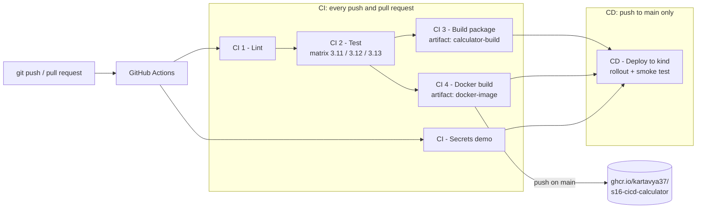

### CI vs CD

| | Continuous Integration (CI) | Continuous Delivery / Deployment (CD) |
|---|---|---|
| Question | "Is this change correct?" | "Can this change go to users?" |
| When | On every push and every pull request | After CI passes, only for `main` |
| Jobs in this pipeline | `lint`, `test`, `build`, `docker-image`, `secrets-demo` | `deploy` |
| Result | Test reports, a build package, a Docker image | The image runs in Kubernetes and answers HTTP requests |

CI merges small changes often and checks each change automatically. CD takes the output of CI and releases it. Continuous Delivery stops before production and waits for a person. Continuous Deployment releases with no manual step. This pipeline does Continuous Deployment to a test cluster.

The workflow shows the difference clearly. A pull request runs only the CI jobs. The `deploy` job has this condition:

```yaml
if: github.event_name != 'pull_request' && github.ref == 'refs/heads/main'
```

The [pull request run](#run-2-pull-request-ci-only) below shows this: the CI jobs run and the CD job does not start.

### CI/CD pipeline

A pipeline is the full automatic path from a commit to a running application. This pipeline has six jobs in four stages:

1. **Lint:** `flake8` checks the code style.
2. **Test:** `pytest` runs 13 tests on Python 3.11, 3.12 and 3.13 at the same time.
3. **Build:** `build.sh` makes a package, and Docker builds the image. These two jobs run in parallel.
4. **Deploy:** the CD job creates a temporary Kubernetes cluster, deploys the image and tests it with `curl`.

If a stage fails, the later stages do not start. The [failure run](#run-3-a-failed-test-stops-the-pipeline) shows this.

### GitHub Actions

GitHub Actions is the CI/CD service of GitHub. It starts a workflow when an event occurs in the repository (push, pull request, manual start, schedule). It runs each job on a runner and shows the logs in the **Actions** tab. Reusable steps come from the Marketplace as "actions", for example `actions/checkout`.

Actions in this workflow:

| Action | Version | Use |
|---|---|---|
| `actions/checkout` | v7 | Get the repository code on the runner |
| `actions/setup-python` | v7 | Install a Python version |
| `actions/upload-artifact` / `download-artifact` | v4 | Save files from one job and use them in another job |
| `docker/setup-buildx-action` | v4 | Install Docker Buildx |
| `docker/build-push-action` | v7 | Build the image |
| `docker/login-action` | v4 | Log in to GHCR with `GITHUB_TOKEN` |
| `helm/kind-action` | v1.15.1 | Create a Kubernetes cluster (kind) on the runner |

The artifact actions stay on v4. The local test tool `act` supports only the v4 artifact protocol. GitHub also supports v4.

### Workflow

The workflow file is [`.github/workflows/s16-cicd.yml`](.github/workflows/s16-cicd.yml). Its main parts:

```yaml
name: "S16 CI/CD Pipeline"
on:
  push:
    branches: [main]
    paths:
      - "CI-CD-&-GitHub-Actions/**"        # only changes in this folder start the workflow
      - ".github/workflows/s16-cicd.yml"
  pull_request:
    branches: [main]
    paths: [ same as above ]
  workflow_dispatch:                       # "Run workflow" button for a manual start
permissions:
  contents: read                           # least privilege for GITHUB_TOKEN
defaults:
  run:
    working-directory: "CI-CD-&-GitHub-Actions"   # quoted, because the name contains "&"
```

- **Triggers:** push to `main`, pull requests to `main`, and a manual start.
- **Path filter:** this repository has many assignment folders. The `paths:` filter makes sure that only a change in this folder (or in the workflow file) starts this pipeline.
- **`defaults.run.working-directory`:** every `run:` step starts in this folder. Steps that use an action (`uses:`) do not read this setting, so their paths start with the folder name.
- **`concurrency`:** a new push cancels the older run on the same branch.

### Jobs

A job is a group of steps that run on one runner. Jobs run in parallel by default. The `needs:` keyword makes a job wait for other jobs and stop if they fail.

| Job | `needs` | What it does |
|---|---|---|
| `lint` | - | `flake8 app tests` |
| `test` | `lint` | pytest on a matrix of 3 Python versions, uploads JUnit + coverage reports |
| `build` | `test` | runs `build.sh`, uploads `calculator-build`, downloads the test reports and writes a summary |
| `docker-image` | `test` | builds the image, runs a container smoke test, uploads `docker-image`, pushes to GHCR on `main` |
| `secrets-demo` | - | uses `GITHUB_TOKEN` and the repository secret `DEMO_API_KEY` without printing them |
| `deploy` | `build`, `docker-image`, `secrets-demo` | CD: kind cluster, `kubectl apply`, rollout, smoke test |

`build` and `docker-image` both need only `test`, so they run at the same time. `deploy` waits for all three of its jobs.

### Steps

A step is one command (`run:`) or one action (`uses:`). The steps of a job run in order on the same runner and share the same files. Example from the `test` job:

```yaml
    steps:
      - name: Checkout source code
        uses: actions/checkout@v7
      - name: Set up Python ${{ matrix.python-version }}
        uses: actions/setup-python@v7
        with:
          python-version: ${{ matrix.python-version }}
      - name: Install dependencies
        run: |
          python -m pip install --upgrade pip
          pip install -r requirements-dev.txt
      - name: Run unit tests with coverage
        run: python -m pytest -v --junitxml=reports/junit.xml --cov=app --cov-report=xml:reports/coverage.xml
      - name: Upload test report and coverage (artifact)
        if: always()                      # upload the report also when a test fails
        uses: actions/upload-artifact@v4
```

Steps can have conditions. `if: always()` runs a step after a failure. `if: failure()` in the `deploy` job prints Pod logs only when the deployment fails.

### Runners

A runner is the machine that runs a job. All jobs use `runs-on: ubuntu-latest`, a fresh virtual machine that GitHub hosts. Each job gets a new, clean runner, so jobs share files only through artifacts. A company can also install a self-hosted runner on its own server and use `runs-on: self-hosted`.

The `test` job uses a **matrix**. GitHub starts one runner for each combination:

```yaml
    runs-on: ${{ matrix.os }}
    strategy:
      fail-fast: false
      matrix:
        os: [ubuntu-latest]
        python-version: ["3.11", "3.12", "3.13"]
```

This gives three parallel test jobs. `fail-fast: false` lets the other versions finish when one version fails. The step "Show runner information" prints `runner.name`, `runner.os` and `runner.arch`.

### Secrets

The pipeline uses two secrets:

- **`GITHUB_TOKEN`:** GitHub creates this token for each run and removes it after the run. The `docker-image` job uses it to log in to GHCR. The job asks for `packages: write`; all other jobs have only `contents: read`.
- **`DEMO_API_KEY`:** a normal repository secret. Add it in **Settings > Secrets and variables > Actions > New repository secret**. The pipeline works also when it is missing.

**WARNING:** Do not put a secret value in the workflow file or in an `echo` command. Git keeps the history of all files, and logs are visible to everyone with read access.

The `secrets-demo` job puts the secrets into environment variables and only checks them:

```yaml
    env:
      GH_TOKEN: ${{ secrets.GITHUB_TOKEN }}
      DEMO_API_KEY: ${{ secrets.DEMO_API_KEY }}
    steps:
      - run: |
          if [ -n "$GH_TOKEN" ]; then
            echo "GITHUB_TOKEN: available (GitHub creates it for each run)."
            repo=$(curl -fsS -H "Authorization: Bearer $GH_TOKEN" \
              "https://api.github.com/repos/${{ github.repository }}" | jq -r .full_name)
            echo "Authenticated GitHub API call returned repository: $repo"
          fi
          if [ -n "$DEMO_API_KEY" ]; then
            echo "DEMO_API_KEY: set (${#DEMO_API_KEY} characters). The value stays hidden."
          fi
```

GitHub also masks a secret value as `***` if a log line contains it.

### Artifacts

An artifact is a file that a job saves after it ends. Other jobs in the same run can download it, and people can download it from the run page.

| Artifact | Made by | Used by | Content |
|---|---|---|---|
| `test-report-py3.11`, `-py3.12`, `-py3.13` | `test` (matrix) | `build` | `junit.xml`, `coverage.xml` |
| `calculator-build` | `build` | download from the run page | package `calculator-app.tar.gz`, `build-info.txt` |
| `docker-image` | `docker-image` | `deploy` | `image.tar` (the image that CD deploys) |

The `build` job downloads all test reports with one pattern and writes a table to the job summary:

```yaml
      - name: Download test reports from the test job (artifact)
        uses: actions/download-artifact@v4
        with:
          pattern: test-report-*
          path: downloaded-reports
```

### Build

The pipeline builds two outputs:

1. [`build.sh`](build.sh) copies the source into `build/`, writes `build-info.txt` (commit, run number, runner) and makes `calculator-app.tar.gz`.
2. The [`Dockerfile`](Dockerfile) builds the runtime image. It installs the dependencies in a separate layer for the cache, runs as user 10001 (not root) and starts gunicorn.

```console
$ flake8 app tests && echo "flake8: no issues"
flake8: no issues

$ ./build.sh
=================================
Starting Application Build
=================================

Build files:
build/app/__init__.py
build/app/calculator.py
build/app/main.py
build/build-info.txt
build/calculator-app.tar.gz
build/requirements.txt

Application: Session 16 Calculator
Build Status: SUCCESS
Commit: local
Run number: local
Runner: Darwin / arm64
Build Date: 2026-10-07T12:12:02Z

Build completed successfully.
```

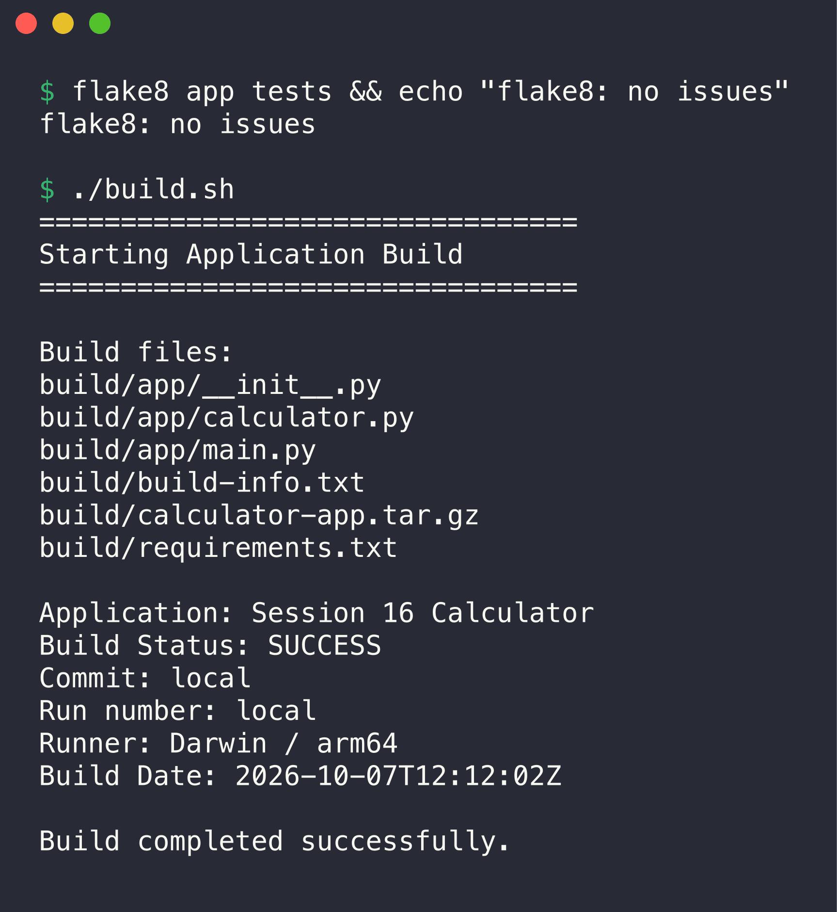

On my laptop `Commit` and `Run number` show `local`. In the pipeline, `build.sh` reads `GITHUB_SHA` and `GITHUB_RUN_NUMBER`.

Docker build and a container test on my laptop:

```console
$ docker build --build-arg APP_VERSION=1.0.0 --build-arg GIT_SHA=$(git rev-parse HEAD) -t ghcr.io/kartavya37/s16-cicd-calculator:1.0.0 . 2>&1 | tail -n 6
#11 exporting manifest list sha256:2385aaf35bffcb0f8f3bce3505ef1ed8911cd18e37153090695429c7a044e4da done
#11 naming to ghcr.io/kartavya37/s16-cicd-calculator:1.0.0 done
#11 unpacking to ghcr.io/kartavya37/s16-cicd-calculator:1.0.0 0.1s done
#11 DONE 0.3s

View build details: docker-desktop://dashboard/build/desktop-linux/desktop-linux/5m7zw9z9oibmjxvnu216r0hig

$ docker image ls ghcr.io/kartavya37/s16-cicd-calculator:1.0.0
IMAGE                                          ID             DISK USAGE   CONTENT SIZE   EXTRA
ghcr.io/kartavya37/s16-cicd-calculator:1.0.0   2385aaf35bff        212MB         45.6MB        

$ docker run -d --rm --name s16-local -p 18401:5000 ghcr.io/kartavya37/s16-cicd-calculator:1.0.0 && sleep 3
26e83991f7ae6bb9aae175c3e2a7e896b2c59ab31f4ba604ee1967556847d640

$ curl -s localhost:18401/health; echo; curl -s "localhost:18401/api/calc?op=divide&a=22&b=7"; echo; curl -s localhost:18401/api/version; echo
{"status":"healthy"}

{"a":22.0,"b":7.0,"operation":"divide","result":3.142857142857143}

{"git_sha":"3ba758e0669b9efc0a1ecd4b57040d1310aa1eef","python":"3.13.16","version":"1.0.0"}


$ docker rm -f s16-local
s16-local
```

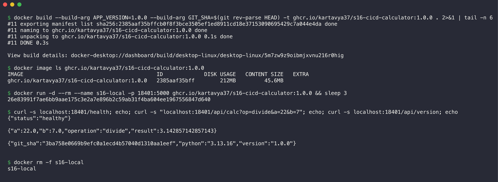

The image contains the version and the commit SHA as build arguments. `/api/version` shows them, so each running Pod tells which commit it came from.

### Test

The tests are in [`tests/`](tests/): 7 tests for the calculator functions and 6 tests for the HTTP API (Flask test client).

```console
$ python -m pytest -v --cov=app --cov-report=term-missing
============================= test session starts ==============================
platform darwin -- Python 3.13.15, pytest-9.1.1, pluggy-1.6.0 -- /tmp/venv-s16s17/bin/python
cachedir: .pytest_cache
rootdir: /Users/kp/SST/3rd Year/Devops/SST-Assignments/DevOps-Assignment/CI-CD-&-GitHub-Actions
configfile: pytest.ini
testpaths: tests
plugins: cov-7.1.0, platformdirs-4.12.3
collecting ... collected 13 items

tests/test_api.py::test_home_page PASSED                                 [  7%]
tests/test_api.py::test_health PASSED                                    [ 15%]
tests/test_api.py::test_calc_add PASSED                                  [ 23%]
tests/test_api.py::test_calc_divide_by_zero PASSED                       [ 30%]
tests/test_api.py::test_calc_bad_number PASSED                           [ 38%]
tests/test_api.py::test_version PASSED                                   [ 46%]
tests/test_calculator.py::test_add PASSED                                [ 53%]
tests/test_calculator.py::test_subtract PASSED                           [ 61%]
tests/test_calculator.py::test_multiply PASSED                           [ 69%]
tests/test_calculator.py::test_divide PASSED                             [ 76%]
tests/test_calculator.py::test_divide_by_zero PASSED                     [ 84%]
tests/test_calculator.py::test_calculate_by_name PASSED                  [ 92%]
tests/test_calculator.py::test_calculate_unknown_operation PASSED        [100%]

================================ tests coverage ================================
______________ coverage: platform darwin, python 3.13.15-final-0 _______________

Name                Stmts   Miss  Cover   Missing
-------------------------------------------------
app/__init__.py         0      0   100%
app/calculator.py      35     17    51%   40-55, 59
app/main.py            29      1    97%   75
-------------------------------------------------
TOTAL                  64     18    72%
============================== 13 passed in 0.12s ==============================
```

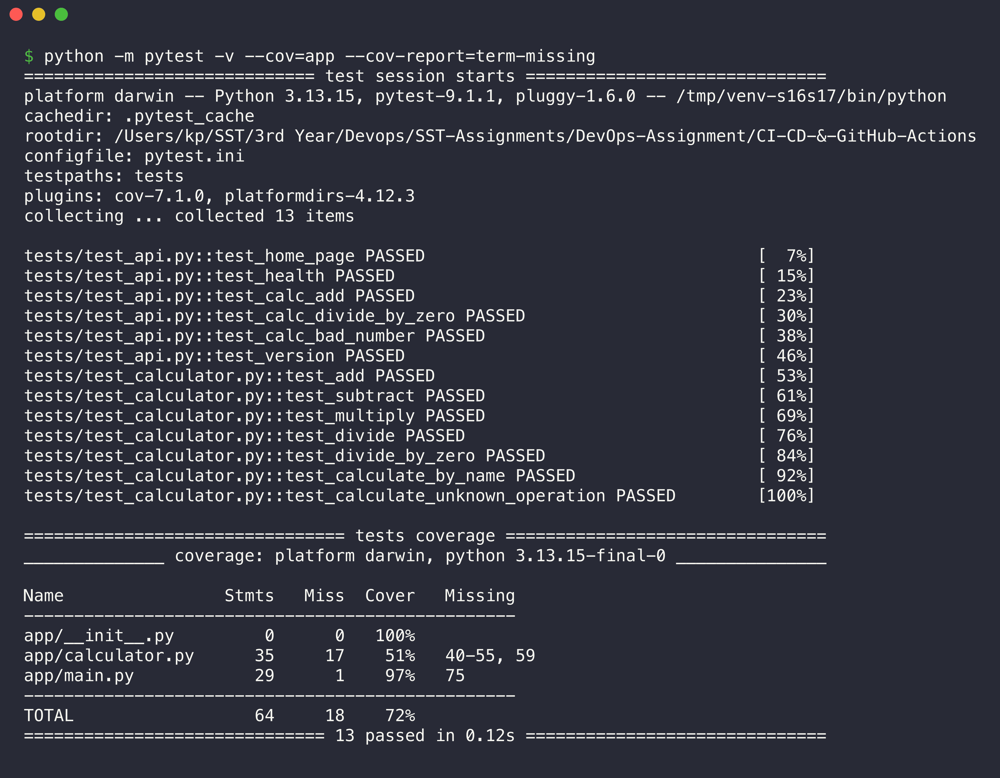

All 13 tests pass. The lines that the tests do not cover are the interactive command-line loop (`main()`), which the web API does not use.

---

## Pipeline execution

### Workflow validation

```console
$ python3 -c "import yaml; yaml.safe_load(open(\".github/workflows/s16-cicd.yml\")); print(\"valid YAML\")"
valid YAML

$ docker run --rm -v "$PWD:/repo" -w /repo rhysd/actionlint:latest -no-color .github/workflows/s16-cicd.yml && echo "actionlint: no problems"
actionlint: no problems

$ diff .github/workflows/s16-cicd.yml "CI-CD-&-GitHub-Actions/.github/workflows/s16-cicd.yml" && echo "root copy and folder copy are identical"
root copy and folder copy are identical
```

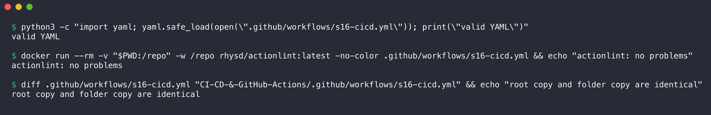

`actionlint` checks the workflow syntax, the expressions and the shell scripts (with shellcheck).

### Local runs with act

Before the push, I ran the workflow on my laptop with [act](https://github.com/nektos/act). act reads the workflow file and runs each job in a Docker container that looks like a GitHub runner. The commands (from the repository root):

```bash
act push -W .github/workflows/s16-cicd.yml \
  -P ubuntu-latest=catthehacker/ubuntu:act-latest --container-architecture linux/arm64 \
  --artifact-server-path /tmp/act-artifacts --artifact-server-addr 0.0.0.0 \
  --secret DEMO_API_KEY=demo-value-123
act pull_request -e pr-event.json -W .github/workflows/s16-cicd.yml ...   # same options
```

Some steps cannot run under act. These steps have `if: ${{ !env.ACT }}` (act sets the variable `ACT`):

- **GHCR login and push:** a local run must not publish an image.
- **kind cluster, `kubectl apply`, rollout and smoke test:** the CD steps. I tested the same manifests on minikube instead ([below](#cd-on-minikube-local-proof)).

Other differences under act:

- Docker Buildx uses the `docker` driver under act (the local Docker engine has the base image). On GitHub it uses `docker-container`. This avoids Docker Hub pull limits on my laptop.
- The build record upload of `docker/build-push-action` is off under act, because the act artifact server does not support it.
- On Docker Desktop for Mac, containers cannot reach the act artifact server on the Mac address. I started a small `alpine/socat` forwarder container on the Docker host network (port 34567) for this.

#### Run 1: push to main (CI + CD)

Full log: [`evidence/act-s16-push.txt`](evidence/act-s16-push.txt).

```console
$ grep -E "Job (succeeded|failed)" evidence/act-s16-push.txt
[S16 CI/CD Pipeline/CI - Secrets demo   ] 🏁  Job succeeded
[S16 CI/CD Pipeline/CI 1 - Lint (flake8)] 🏁  Job succeeded
[S16 CI/CD Pipeline/CI 2 - Test (Python 3.12)-2] 🏁  Job succeeded
[S16 CI/CD Pipeline/CI 2 - Test (Python 3.11)-1] 🏁  Job succeeded
[S16 CI/CD Pipeline/CI 2 - Test (Python 3.13)-3] 🏁  Job succeeded
[S16 CI/CD Pipeline/CI 3 - Build application package          ] 🏁  Job succeeded
[S16 CI/CD Pipeline/CI 4 - Docker build (push to GHCR on main)] 🏁  Job succeeded
[S16 CI/CD Pipeline/CD - Deploy to Kubernetes (kind)          ] 🏁  Job succeeded

$ grep -E "Artifact .* has been successfully uploaded" evidence/act-s16-push.txt | sed -E "s/ Final size is.*//"
[S16 CI/CD Pipeline/CI 2 - Test (Python 3.12)-2]   | Artifact test-report-py3.12 has been successfully uploaded!
[S16 CI/CD Pipeline/CI 2 - Test (Python 3.11)-1]   | Artifact test-report-py3.11 has been successfully uploaded!
[S16 CI/CD Pipeline/CI 2 - Test (Python 3.13)-3]   | Artifact test-report-py3.13 has been successfully uploaded!
[S16 CI/CD Pipeline/CI 3 - Build application package          ]   | Artifact calculator-build has been successfully uploaded!
[S16 CI/CD Pipeline/CI 4 - Docker build (push to GHCR on main)]   | Artifact docker-image has been successfully uploaded!
```

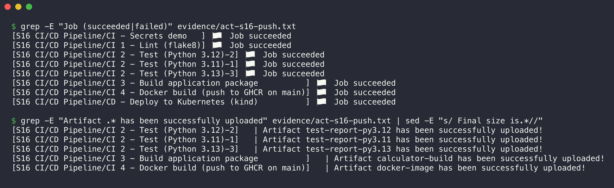

All 8 jobs passed (the matrix gives three test jobs). Each job uploaded its artifact. The important lines of each job:

```console
$ grep "| " evidence/act-s16-push.txt | grep -E "GITHUB_TOKEN:|DEMO_API_KEY:|Authenticated|passed in|line-coverage=|Build Status|Loaded image|\"result\"|image: ghcr|image.tar$" | sed -E "s/^\[S16 CI\/CD Pipeline\/([^]]*[^ ]) *\] +\| /[\1] /"
[CI - Secrets demo] GITHUB_TOKEN: available (GitHub creates it for each run).
[CI - Secrets demo] Authenticated GitHub API call returned repository: kartavya37/DevOps-Assignment
[CI - Secrets demo] DEMO_API_KEY: set (14 characters). The value stays hidden.
[CI 2 - Test (Python 3.11)-1] ============================== 13 passed in 0.14s ==============================
[CI 2 - Test (Python 3.12)-2] ============================== 13 passed in 0.23s ==============================
[CI 2 - Test (Python 3.13)-3] ============================== 13 passed in 0.17s ==============================
[CI 3 - Build application package] Build Status: SUCCESS
[CI 3 - Build application package] test-report-py3.11: tests=13 line-coverage=71.9%
[CI 3 - Build application package] test-report-py3.12: tests=13 line-coverage=71.9%
[CI 3 - Build application package] test-report-py3.13: tests=13 line-coverage=71.9%
[CI 4 - Docker build (push to GHCR on main)] Loaded image: ghcr.io/kartavya37/s16-cicd-calculator:3ba758e0669b9efc0a1ecd4b57040d1310aa1eef
[CI 4 - Docker build (push to GHCR on main)] Loaded image: ghcr.io/kartavya37/s16-cicd-calculator:latest
[CI 4 - Docker build (push to GHCR on main)] {"a":6.0,"b":7.0,"operation":"multiply","result":42.0}
[CD - Deploy to Kubernetes (kind)] 21:          image: ghcr.io/kartavya37/s16-cicd-calculator:3ba758e0669b9efc0a1ecd4b57040d1310aa1eef
[CD - Deploy to Kubernetes (kind)] -rw-r--r-- 1 root root 45566976 Oct  7 12:22 /tmp/image.tar
```

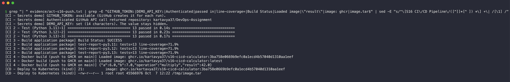

- **Secrets:** act gave the run a `GITHUB_TOKEN` (from my local GitHub CLI login) and the `DEMO_API_KEY` from the command line. The job used both and printed neither value.
- **Test + artifacts:** the `build` job downloaded the three test reports of the matrix jobs and calculated the coverage of each.
- **Docker:** the container smoke test answered `6 * 7 = 42` from inside the image.
- **CD:** the `deploy` job downloaded the image artifact and set the commit SHA as the image tag. The kind steps did not run under act.

#### Run 2: pull request (CI only)

Full log: [`evidence/act-s16-pull-request.txt`](evidence/act-s16-pull-request.txt). The event file sets head `feature/demo` and base `main`.

```console
$ head -n 3 evidence/act-s16-pull-request.txt | cut -c1-120
# Local pipeline run with act (nektos/act 0.2.89), 2026-10-07. ANSI colour codes removed.
# Directory: repository root
# Command:   act pull_request -e pr-event.json -W .github/workflows/s16-cicd.yml --secret DEMO_API_KEY=demo-value-123 -P

$ grep -E "Job (succeeded|failed)" evidence/act-s16-pull-request.txt
[S16 CI/CD Pipeline/CI - Secrets demo   ] 🏁  Job succeeded
[S16 CI/CD Pipeline/CI 1 - Lint (flake8)] 🏁  Job succeeded
[S16 CI/CD Pipeline/CI 2 - Test (Python 3.11)-1] 🏁  Job succeeded
[S16 CI/CD Pipeline/CI 2 - Test (Python 3.13)-3] 🏁  Job succeeded
[S16 CI/CD Pipeline/CI 2 - Test (Python 3.12)-2] 🏁  Job succeeded
[S16 CI/CD Pipeline/CI 3 - Build application package          ] 🏁  Job succeeded
[S16 CI/CD Pipeline/CI 4 - Docker build (push to GHCR on main)] 🏁  Job succeeded

$ grep -c "CD - Deploy" evidence/act-s16-pull-request.txt
0
```

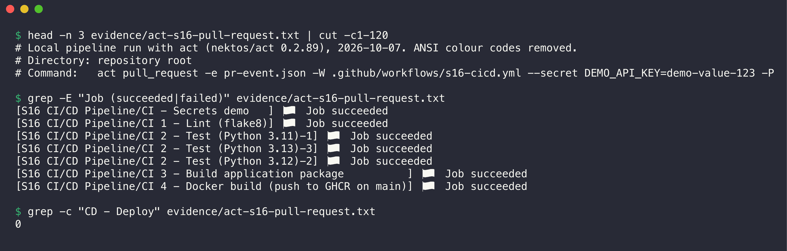

All CI jobs ran. The CD job `CD - Deploy to Kubernetes (kind)` does not appear in the log at all: its `if:` condition is false for a pull request. The GHCR push steps in `docker-image` also did not run. A pull request gets feedback (tests, build, image) but changes nothing outside the run.

#### Run 3: a failed test stops the pipeline

This run is the "Failure Scenario" from `10-final-cicd-pipeline`. I made a throwaway copy outside the repository (`/tmp/s16-failure-demo`) and broke `add()` on purpose. Full log: [`evidence/act-s16-failed-test.txt`](evidence/act-s16-failed-test.txt).

```console
$ grep -n "DEMO" "/tmp/s16-failure-demo/CI-CD-&-GitHub-Actions/app/calculator.py"
6:    return a + b + 1  # DEMO: bug on purpose

$ grep -E "^\[.*Python 3.13.*\| (FAILED|E  |=+ .*failed)" evidence/act-s16-failed-test.txt
[S16 CI/CD Pipeline/CI 2 - Test (Python 3.13)-3]   | E       assert 16.0 == 15
[S16 CI/CD Pipeline/CI 2 - Test (Python 3.13)-3]   | E       assert 16 == 15
[S16 CI/CD Pipeline/CI 2 - Test (Python 3.13)-3]   | E        +  where 16 = add(10, 5)
[S16 CI/CD Pipeline/CI 2 - Test (Python 3.13)-3]   | FAILED tests/test_api.py::test_calc_add - assert 16.0 == 15
[S16 CI/CD Pipeline/CI 2 - Test (Python 3.13)-3]   | FAILED tests/test_calculator.py::test_add - assert 16 == 15
[S16 CI/CD Pipeline/CI 2 - Test (Python 3.13)-3]   | ========================= 2 failed, 11 passed in 0.17s =========================

$ grep -E "Job (succeeded|failed)|^Error" evidence/act-s16-failed-test.txt
[S16 CI/CD Pipeline/CI - Secrets demo   ] 🏁  Job succeeded
[S16 CI/CD Pipeline/CI 1 - Lint (flake8)] 🏁  Job succeeded
[S16 CI/CD Pipeline/CI 2 - Test (Python 3.11)-1] 🏁  Job failed
[S16 CI/CD Pipeline/CI 2 - Test (Python 3.12)-2] 🏁  Job failed
[S16 CI/CD Pipeline/CI 2 - Test (Python 3.13)-3] 🏁  Job failed
Error: Job 'CI 2 - Test (Python ${{ matrix.python-version }})' failed

$ grep -cE "CI 3 - Build|CI 4 - Docker|CD - Deploy" evidence/act-s16-failed-test.txt
0
```

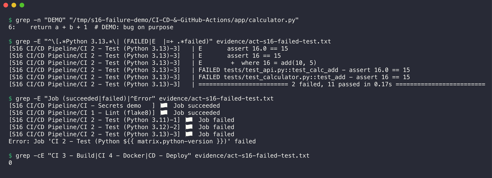

Two tests failed on all three Python versions. `build` and `docker-image` have `needs: test`, and `deploy` needs them, so none of these jobs started (0 lines in the log). A bug cannot reach the image or the cluster.

### CD on minikube (local proof)

The kind cluster exists only on the GitHub runner. To prove the CD part on my laptop, I did the same steps as the `deploy` job on minikube, in namespace `s16-cicd`.

1. Load the image into minikube.
2. Apply the namespace, then the Deployment and the Service.
3. Set the image tag, like the pipeline does with the commit SHA.
4. Wait for the rollout.

```console
$ minikube image load ghcr.io/kartavya37/s16-cicd-calculator:1.0.0 && echo "image loaded into minikube"
image loaded into minikube

$ kubectl apply -f k8s/namespace.yaml
namespace/s16-cicd created

$ kubectl apply -f k8s/deployment.yaml -f k8s/service.yaml
deployment.apps/calculator created
service/calculator created

$ kubectl -n s16-cicd set image deployment/calculator calculator=ghcr.io/kartavya37/s16-cicd-calculator:1.0.0
deployment.apps/calculator image updated

$ kubectl -n s16-cicd rollout status deployment/calculator --timeout=120s
Waiting for deployment "calculator" rollout to finish: 1 out of 2 new replicas have been updated...
Waiting for deployment "calculator" rollout to finish: 1 out of 2 new replicas have been updated...
Waiting for deployment "calculator" rollout to finish: 1 out of 2 new replicas have been updated...
Waiting for deployment "calculator" rollout to finish: 1 old replicas are pending termination...
Waiting for deployment "calculator" rollout to finish: 1 old replicas are pending termination...
Waiting for deployment "calculator" rollout to finish: 1 old replicas are pending termination...
Waiting for deployment "calculator" rollout to finish: 1 old replicas are pending termination...
deployment "calculator" successfully rolled out

$ kubectl -n s16-cicd get deploy,pods,svc -o wide
NAME                         READY   UP-TO-DATE   AVAILABLE   AGE   CONTAINERS   IMAGES                                         SELECTOR
deployment.apps/calculator   2/2     2            2           12s   calculator   ghcr.io/kartavya37/s16-cicd-calculator:1.0.0   app=calculator

NAME                              READY   STATUS        RESTARTS   AGE   IP            NODE       NOMINATED NODE   READINESS GATES
pod/calculator-86d7fbc497-9xv84   0/1     Terminating   0          12s   10.244.0.44   minikube   <none>           <none>
pod/calculator-d8c67d6f-f7nnc     1/1     Running       0          6s    10.244.0.48   minikube   <none>           <none>
pod/calculator-d8c67d6f-skg85     1/1     Running       0          12s   10.244.0.47   minikube   <none>           <none>

NAME                 TYPE        CLUSTER-IP       EXTERNAL-IP   PORT(S)   AGE   SELECTOR
service/calculator   ClusterIP   10.101.154.106   <none>        80/TCP    12s   app=calculator
```

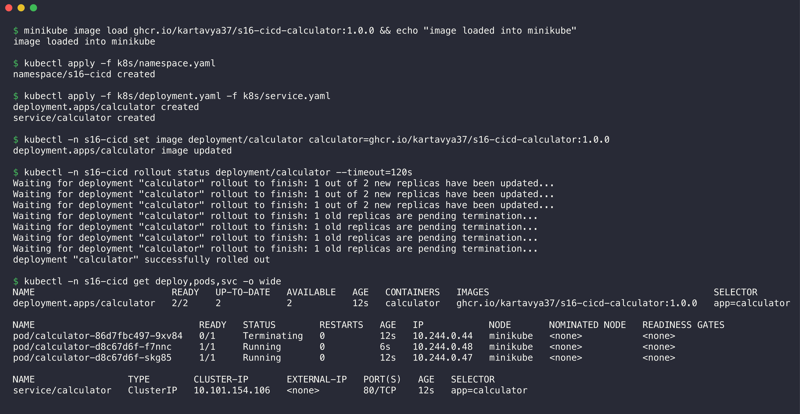

The manifest contains the tag `latest`. That tag is not in minikube yet, so the first Pod could not start. `kubectl set image` changed the tag to `1.0.0`, and Kubernetes replaced the Pods with a rolling update. The `Terminating` Pod is the first Pod. The pipeline does the same with the commit SHA as the tag.

Smoke test through a port-forward (local port 18402):

```console
$ ps -o command= -p $(cat $SP/s16/pf.pid)
kubectl -n s16-cicd port-forward svc/calculator 18402:80

$ curl -s localhost:18402/health
{"status":"healthy"}

$ curl -s "localhost:18402/api/calc?op=add&a=10&b=5"
{"a":10.0,"b":5.0,"operation":"add","result":15.0}

$ curl -s localhost:18402/api/version
{"git_sha":"3ba758e0669b9efc0a1ecd4b57040d1310aa1eef","python":"3.13.16","version":"1.0.0"}

$ kubectl -n s16-cicd get pods
NAME                        READY   STATUS    RESTARTS   AGE
calculator-d8c67d6f-f7nnc   1/1     Running   0          26s
calculator-d8c67d6f-skg85   1/1     Running   0          32s
```

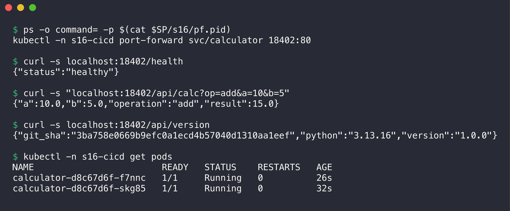

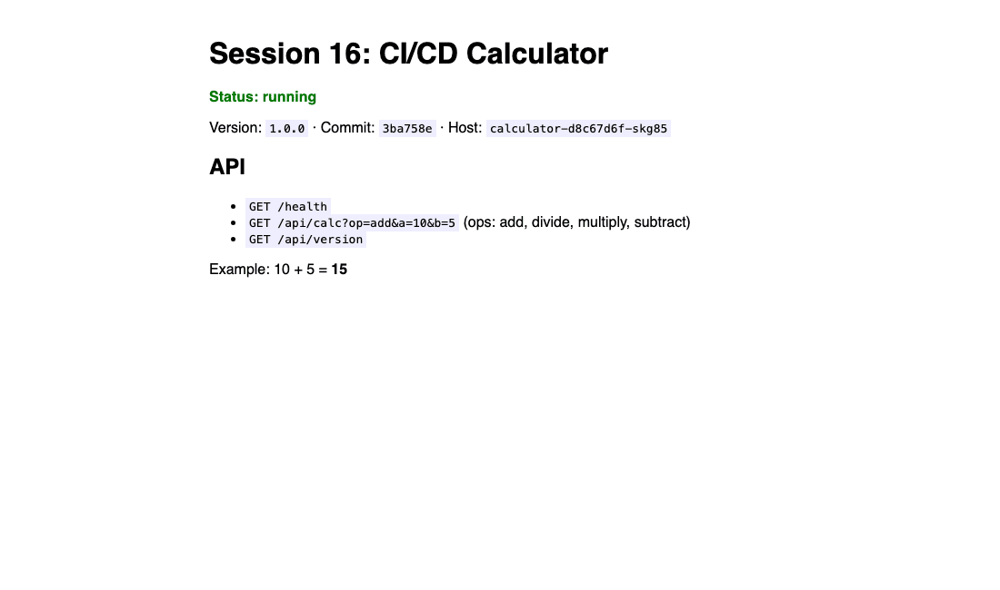

The page shows the version, the commit and the Pod name (`Host`). I removed the namespace after the test.

### Pipeline execution on GitHub

I pushed the repository to GitHub on 7 October 2026 (commit `f0640c2`). The push started the workflow [`s16-cicd.yml`](../.github/workflows/s16-cicd.yml) on GitHub-hosted runners: [run 37637158607](https://github.com/kartavya37/DevOps-Assignment/actions/runs/37637158607). All 8 jobs completed with **success** in about 2.5 minutes.

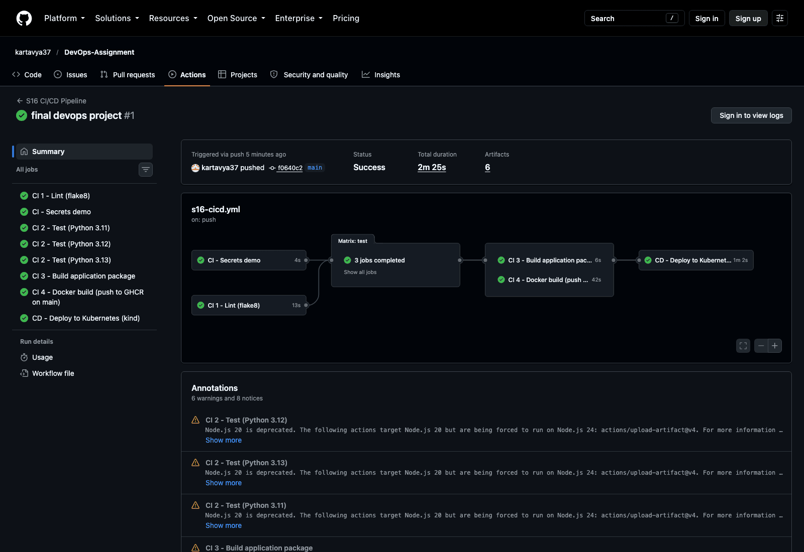

| Job | Result | Duration |
|---|---|---|
| CI 1 - Lint (flake8) | success | 0m 13s |
| CI 2 - Test (Python 3.11) | success | 0m 14s |
| CI 2 - Test (Python 3.12) | success | 0m 12s |
| CI 2 - Test (Python 3.13) | success | 0m 13s |
| CI 3 - Build application package | success | 0m 06s |
| CI 4 - Docker build (push to GHCR on main) | success | 0m 42s |
| CI - Secrets demo | success | 0m 04s |
| CD - Deploy to Kubernetes (kind) | success | 1m 02s |

On GitHub, the steps that act skips also ran:

- The `docker-image` job logged in to GHCR with `GITHUB_TOKEN` and pushed `ghcr.io/kartavya37/s16-cicd-calculator`, with the commit SHA as the tag.
- The `deploy` job created a kind cluster, loaded the image, applied the manifests and tested the app with `curl`.
- The run stored 6 artifacts: `test-report-py3.11`, `test-report-py3.12`, `test-report-py3.13`, `calculator-build`, `docker-image` and the Docker build record.

This is the log of the deploy job. It comes from `gh run view 37637158607 --log`:

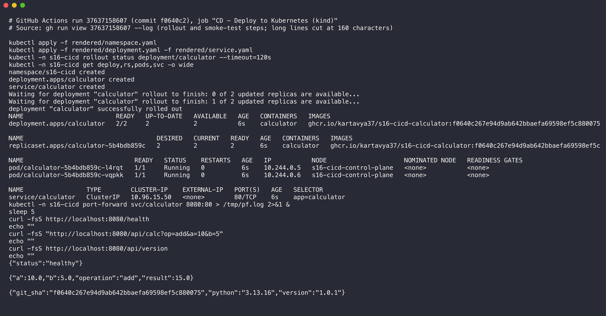

The rollout completed with 2 Pods, and each Pod uses the image with the commit SHA tag. The smoke test got `{"status":"healthy"}`, the result `15.0` for `10 + 5`, and the `git_sha` of the commit. The full excerpt is in [`evidence/github-deploy-log.txt`](evidence/github-deploy-log.txt).

The run title on GitHub is "final devops project". GitHub uses the message of the last commit in a push as the run title. One push sent all the assignments, so the three pipelines have the same title.

**Note:** The run shows warnings that Node.js 20 is deprecated for `actions/upload-artifact@v4` and `actions/download-artifact@v4`. The jobs still pass. I kept v4 because the act artifact server does not work with newer versions.

---

## Deliverables

| Deliverable | Where |
|---|---|
| Application source code | [`app/`](app/), [`tests/`](tests/) |
| Dockerfile | [`Dockerfile`](Dockerfile) |
| GitHub Actions workflow | [`../.github/workflows/s16-cicd.yml`](../.github/workflows/s16-cicd.yml) (copy: [`.github/workflows/s16-cicd.yml`](.github/workflows/s16-cicd.yml)) |
| CI pipeline | jobs `lint`, `test`, `build`, `docker-image`, `secrets-demo` |
| CD pipeline | job `deploy` (GHCR image + kind cluster), local proof on minikube |
| Screenshots of pipeline execution | [`screenshots/`](screenshots/), act logs in [`evidence/`](evidence/), GitHub run screenshots in [Pipeline execution on GitHub](#pipeline-execution-on-github) |
| README.md | this file |

## Run it yourself

1. Create a virtual environment outside the repository and install `requirements-dev.txt`.
2. Run `python -m pytest -v` and `flake8 app tests`.
3. Run `./build.sh`.
4. Build the image with `docker build -t s16-calculator .`.
5. Run it with `docker run -p 5000:5000 s16-calculator` and open `http://localhost:5000`.
6. Push a change in this folder to `main` and open the **Actions** tab.
