# Session 17: Complete CI/CD & DevSecOps

**Name:** Kartavya Panchal  
**Roll No.:** 24BCS10343

```
Complete-CI-CD-&-DevSecOps/
├── app/
│   ├── app.py                 Flask "DevSecOps Dashboard" (adapted from session-17-devsecops/demo)
│   ├── templates/index.html
│   └── static/ (css, js)
├── tests/test_app.py          15 unit tests
├── k8s/
│   ├── namespace.yaml         namespace s17-devsecops, Pod Security "restricted"
│   ├── deployment.yaml        2 replicas, non-root, read-only root filesystem, probes, limits
│   └── service.yaml           ClusterIP, port 80 -> 5001
├── security/                  security tools configuration
│   ├── bandit.yaml            SAST (Bandit) configuration
│   ├── .gitleaks.toml         secret scan (Gitleaks) configuration
│   ├── .trivyignore           accepted risks for Trivy (empty: nothing accepted)
│   └── security_gate.py       the security gate policy (reads all scan reports)
├── .github/workflows/
│   └── s17-devsecops.yml      copy of the workflow (GitHub runs the copy at the repository root)
├── evidence/                  full logs of the local pipeline runs with act
├── screenshots/
├── Dockerfile                 multi-stage, Alpine, no pip at runtime, non-root
├── requirements.txt           Flask, gunicorn (pinned)
├── requirements-dev.txt       pytest, pytest-cov
├── pytest.ini  .dockerignore  .gitignore
└── README.md
```

The workflow that GitHub runs is [`../.github/workflows/s17-devsecops.yml`](../.github/workflows/s17-devsecops.yml) at the repository root. GitHub reads workflows only from `.github/workflows/` at the root of a repository. The file [`.github/workflows/s17-devsecops.yml`](.github/workflows/s17-devsecops.yml) in this folder is an identical copy for the deliverable.

---

## Task: DevSecOps Demo Project

The application is the class demo "DevSecOps Dashboard" (Flask): a status page, a greeting API, a calculator API and a pipeline simulator. I copied it from `session-17-devsecops/demo` and made it secure enough to pass its own pipeline (see [Security changes to the application](#security-changes-to-the-application)).

### Expected Flow

Each stage of the expected flow is one job in the workflow. Each job `needs` the job before it, so the jobs run in this exact order and a failure stops all later jobs.

```mermaid
flowchart TD
    code[Code: push / pull request] --> b[1. Build]
    b --> ut[2. Unit Test]
    ut --> sast[3. SAST<br/>Bandit]
    sast --> sca[4. SCA<br/>pip-audit + Trivy fs]
    sca --> ss[5. Secret Scan<br/>Gitleaks]
    ss --> db[6. Docker Build]
    db --> is[7. Container Image Scan<br/>Trivy]
    is --> gate{8. Security Gate}
    gate -- FAIL --> stop[Stop: no push, no deploy]
    gate -- PASS --> push[9. Push Image<br/>ghcr.io/kartavya37/s17-devsecops-app]
    push --> deploy[10. Deploy to Kubernetes<br/>kind cluster + smoke test]
    sast -. bandit.json .-> gate
    sca -. pip-audit.json, trivy-fs.json .-> gate
    ss -. gitleaks.json .-> gate
    is -. trivy-image.json .-> gate
```

| # | Job | Tool | Output | Runs on pull requests |
|---|---|---|---|---|
| 1 | Build | pip, `compileall` | proves that the app installs and imports | yes |
| 2 | Unit Test | pytest, pytest-cov | `junit.xml`, `coverage.xml`; fails below 80% coverage | yes |
| 3 | SAST | Bandit 1.9.4 | `bandit.json` | yes |
| 4 | SCA | pip-audit 2.10.1, Trivy fs | `pip-audit.json`, `trivy-fs.json` | yes |
| 5 | Secret Scan | Gitleaks 8.30.1 (checksum verified) | `gitleaks.json` | yes |
| 6 | Docker Build | Buildx, build-push-action | `image.tar` artifact | yes |
| 7 | Container Image Scan | Trivy 0.75.0 (trivy-action, pinned to a commit SHA) | `trivy-image.json` | yes |
| 8 | Security Gate | [`security/security_gate.py`](security/security_gate.py) | pass / fail | yes |
| 9 | Push Image | docker/login-action + `GITHUB_TOKEN` | image in GHCR | no (only `main`) |
| 10 | Deploy to Kubernetes | helm/kind-action, kubectl, curl | rollout + smoke test | no (only `main`) |

**Scan, then decide.** The scan jobs (3, 4, 5, 7) always finish and upload a JSON report. They do not fail by themselves. The Security Gate job downloads all reports and applies one policy. With this design, one run shows every problem at the same time, and one place holds the decision.

**Scan what you ship.** The Docker Build job saves the image as an artifact (`image.tar`). The image scan, the push and the deploy all use this same file. So the image in GHCR and in Kubernetes is exactly the image that Trivy scanned.

---

## CI/CD

### Application build

Job 1 installs `requirements.txt`, compiles the code and imports the Flask app. If a dependency is missing or the code has a syntax error, the pipeline stops here.

### Unit testing

Job 2 runs 15 tests ([`tests/test_app.py`](tests/test_app.py)): all endpoints, error cases, the security headers and the pipeline simulator. `--cov-fail-under=80` is a quality gate: the job fails if coverage drops below 80%.

```console
$ python -m compileall -q app && echo "build: app compiled"
build: app compiled

$ python -m pytest --cov=app --cov-report=term-missing --cov-fail-under=80 -q
...............                                                          [100%]
================================ tests coverage ================================
______________ coverage: platform darwin, python 3.13.15-final-0 _______________

Name              Stmts   Miss  Cover   Missing
-----------------------------------------------
app/__init__.py       0      0   100%
app/app.py          101      7    93%   115-116, 132, 176-177, 208, 213
-----------------------------------------------
TOTAL               101      7    93%
Required test coverage of 80% reached. Total coverage: 93.07%
15 passed in 0.12s
```

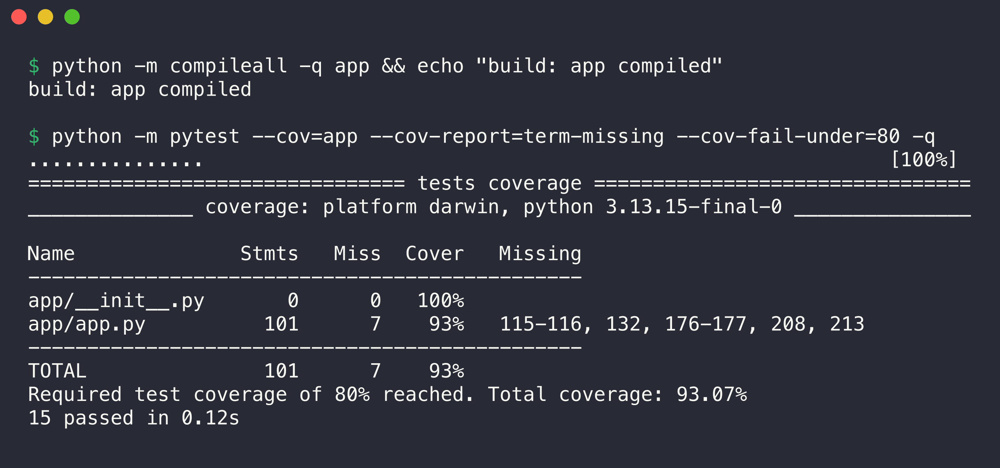

### Docker image build

The [`Dockerfile`](Dockerfile) has two stages:

1. **builder:** creates a virtual environment in `/opt/venv`, installs the pinned dependencies, and removes pip from the venv.
2. **runtime:** a fresh `python:3.13-alpine` image. It installs the OS security updates (`apk upgrade`), removes pip and `ensurepip`, copies only the venv and the `app/` folder, and runs gunicorn as user 10001.

I chose this design after the first image scans. `python:3.13-slim` had 44 HIGH findings (40 without a fix). The pip that comes with every Python image vendors old `urllib3`, `msgpack` and `setuptools` with HIGH CVEs. The app does not need pip at runtime, so the runtime image does not contain it.

```console
$ docker build --build-arg APP_VERSION=2.0.0 --build-arg GIT_SHA=$(git rev-parse HEAD) -t ghcr.io/kartavya37/s17-devsecops-app:2.0.0 . 2>&1 | grep -E "^#[0-9]+ \[|DONE|naming" | tail -n 18
#1 [internal] load build definition from Dockerfile
#1 DONE 0.0s
#2 [internal] load metadata for docker.io/library/python:3.13-alpine
#2 DONE 0.0s
#3 [internal] load .dockerignore
#3 DONE 0.0s
#4 [internal] load build context
#4 DONE 0.0s
#5 [builder 1/3] FROM docker.io/library/python:3.13-alpine@sha256:2d9aefe2fef018a7eb2c13064c89c71929800fd2e5dccdbf52ea5da5bb8d929a
#5 DONE 0.0s
#6 [stage-1 2/5] RUN apk upgrade --no-cache  && python -m pip uninstall -y pip  && rm -rf /usr/local/lib/python3.13/ensurepip  && adduser -D -H -u 10001 appuser
#7 [builder 3/3] RUN python -m venv /opt/venv  && /opt/venv/bin/pip install --no-cache-dir -r /tmp/requirements.txt  && /opt/venv/bin/pip uninstall -y pip
#8 [builder 2/3] COPY requirements.txt /tmp/requirements.txt
#9 [stage-1 3/5] COPY --from=builder /opt/venv /opt/venv
#10 [stage-1 4/5] WORKDIR /app
#11 [stage-1 5/5] COPY app ./app
#12 naming to ghcr.io/kartavya37/s17-devsecops-app:2.0.0 done
#12 DONE 0.0s

$ docker image ls ghcr.io/kartavya37/s17-devsecops-app:2.0.0
IMAGE                                        ID             DISK USAGE   CONTENT SIZE   EXTRA
ghcr.io/kartavya37/s17-devsecops-app:2.0.0   e03cdd942b3e       95.3MB         22.7MB        

$ docker save ghcr.io/kartavya37/s17-devsecops-app:2.0.0 -o /tmp/s17-image.tar && ls -lh /tmp/s17-image.tar | awk "{print \$5, \$9}"
22M /tmp/s17-image.tar
```

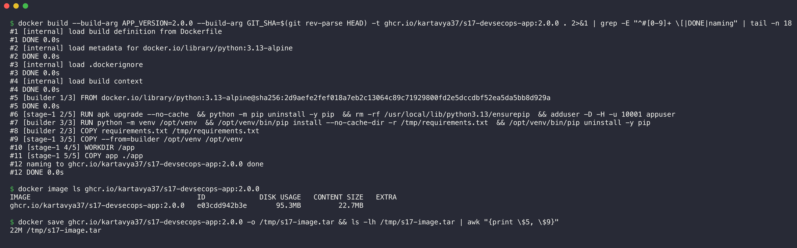

The runtime image is 22.7 MB (compressed).

### Container registry

Job 9 pushes the image to GitHub Container Registry (GHCR) as `ghcr.io/kartavya37/s17-devsecops-app:<commit-sha>` and `:latest`. It logs in with the built-in `GITHUB_TOKEN`; no other secret is necessary:

```yaml
  push-image:
    needs: security-gate
    if: github.event_name != 'pull_request' && github.ref == 'refs/heads/main'
    permissions:
      contents: read
      packages: write          # only this job can write packages
    steps:
      - uses: actions/download-artifact@v4      # the image that Trivy scanned
        with: { name: docker-image, path: "${{ runner.temp }}" }
      - run: docker load --input image.tar
      - uses: docker/login-action@v4
        if: ${{ !env.ACT }}
        with:
          registry: ghcr.io
          username: ${{ github.actor }}
          password: ${{ secrets.GITHUB_TOKEN }}
      - run: docker push "${IMAGE_NAME}:${{ github.sha }}" && docker push "${IMAGE_NAME}:latest"
        if: ${{ !env.ACT }}
```

The image has the label `org.opencontainers.image.source=https://github.com/kartavya37/DevOps-Assignment`. GitHub uses this label to link the package to the repository. Pull requests never push.

### Kubernetes deployment

The manifests are in [`k8s/`](k8s/). They follow the Pod Security "restricted" profile, and the namespace enforces it:

- `runAsNonRoot: true`, `runAsUser: 10001`, `seccompProfile: RuntimeDefault`
- `allowPrivilegeEscalation: false`, `capabilities.drop: ["ALL"]`, `readOnlyRootFilesystem: true` (an `emptyDir` gives a writable `/tmp`)
- `automountServiceAccountToken: false` (the app does not call the Kubernetes API)
- readiness and liveness probes on `/health`, CPU and memory requests and limits

GitHub-hosted runners cannot reach a private cluster such as my minikube. So job 10 creates a temporary [kind](https://kind.sigs.k8s.io/) cluster on the runner and loads the scanned image into it. Then it deploys the manifests, waits for the rollout and tests the app with `curl`:

```yaml
      - uses: helm/kind-action@v1.15.1
        with: { cluster_name: s17-devsecops }
      - run: kind load image-archive "${{ runner.temp }}/image.tar" --name s17-devsecops
      - run: |
          kubectl apply -f k8s/namespace.yaml
          kubectl apply -f k8s/deployment.yaml -f k8s/service.yaml
          kubectl -n s17-devsecops set image deployment/devsecops-app app="${IMAGE_NAME}:${{ github.sha }}"
          kubectl -n s17-devsecops rollout status deployment/devsecops-app --timeout=120s
      - run: |
          kubectl -n s17-devsecops port-forward svc/devsecops-app 8080:80 &
          sleep 5
          curl -fsS http://localhost:8080/health
          curl -fsS http://localhost:8080/api/status
```

In a real company, this job would use a kubeconfig secret for the target cluster and pull the image from GHCR.

#### Local proof on minikube

I did the same deploy steps on minikube in namespace `s17-devsecops`:

```console
$ minikube image load ghcr.io/kartavya37/s17-devsecops-app:2.0.0 && echo "image loaded into minikube"
image loaded into minikube

$ kubectl apply -f k8s/namespace.yaml
namespace/s17-devsecops created

$ kubectl apply -f k8s/deployment.yaml -f k8s/service.yaml
deployment.apps/devsecops-app created
service/devsecops-app created

$ kubectl -n s17-devsecops set image deployment/devsecops-app app=ghcr.io/kartavya37/s17-devsecops-app:2.0.0
deployment.apps/devsecops-app image updated

$ kubectl -n s17-devsecops rollout status deployment/devsecops-app --timeout=120s
Waiting for deployment "devsecops-app" rollout to finish: 1 out of 2 new replicas have been updated...
Waiting for deployment "devsecops-app" rollout to finish: 1 out of 2 new replicas have been updated...
Waiting for deployment "devsecops-app" rollout to finish: 1 out of 2 new replicas have been updated...
Waiting for deployment "devsecops-app" rollout to finish: 1 old replicas are pending termination...
Waiting for deployment "devsecops-app" rollout to finish: 1 old replicas are pending termination...
Waiting for deployment "devsecops-app" rollout to finish: 1 old replicas are pending termination...
Waiting for deployment "devsecops-app" rollout to finish: 1 old replicas are pending termination...
deployment "devsecops-app" successfully rolled out

$ kubectl -n s17-devsecops get deploy,pods,svc
NAME                            READY   UP-TO-DATE   AVAILABLE   AGE
deployment.apps/devsecops-app   2/2     2            2           13s

NAME                                 READY   STATUS        RESTARTS   AGE
pod/devsecops-app-5469b8dbf8-rpcst   0/1     Terminating   0          13s
pod/devsecops-app-768765bbfc-gqfh7   1/1     Running       0          6s
pod/devsecops-app-768765bbfc-ssn4z   1/1     Running       0          13s

NAME                    TYPE        CLUSTER-IP    EXTERNAL-IP   PORT(S)   AGE
service/devsecops-app   ClusterIP   10.98.12.79   <none>        80/TCP    13s
```

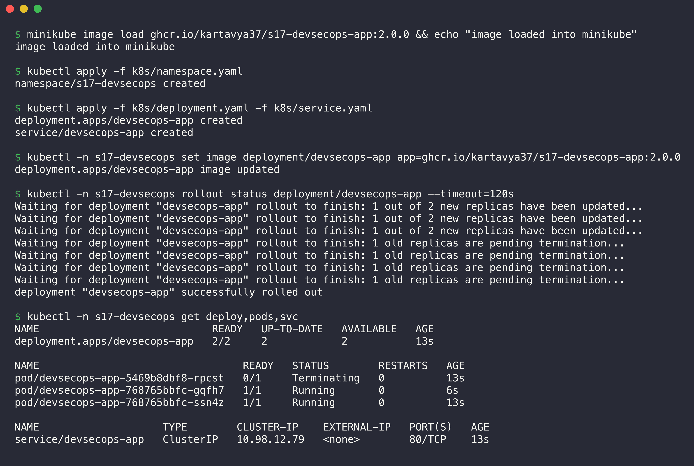

The namespace enforces the "restricted" profile, and the API server accepted the Pods with no warning. The `Terminating` Pod had the tag `latest` from the manifest; `kubectl set image` replaced it with the scanned tag.

Smoke test through a port-forward (local port 18410):

```console
$ ps -o command= -p $(cat $SP/s17/pf.pid)
kubectl -n s17-devsecops port-forward svc/devsecops-app 18410:80

$ curl -s localhost:18410/health
{"status":"healthy","timestamp":"2026-10-07T12:15:16.882437Z","uptime_seconds":19.84}

$ curl -s localhost:18410/api/status
{"app":"DevSecOps Dashboard","git_sha":"3ba758e0669b9efc0a1ecd4b57040d1310aa1eef","platform":"Linux","python_version":"3.13.16","status":"running","timestamp":"2026-10-07T12:15:16.898045Z","total_requests":3,"uptime":"00h 00m 19s","version":"2.0.0"}

$ curl -sI localhost:18410/ | grep -iE "^(HTTP|server|x-content-type-options|x-frame-options|referrer-policy)"
HTTP/1.1 200 OK
Server: gunicorn
X-Content-Type-Options: nosniff
X-Frame-Options: DENY
Referrer-Policy: no-referrer

$ kubectl get ns s17-devsecops --show-labels
NAME            STATUS   AGE   LABELS
s17-devsecops   Active   23s   kubernetes.io/metadata.name=s17-devsecops,pod-security.kubernetes.io/enforce=restricted

$ kubectl -n s17-devsecops exec deploy/devsecops-app -- sh -c "id; touch /app/x 2>&1 || true"
uid=10001(appuser) gid=10001(appuser) groups=10001(appuser)
touch: /app/x: Read-only file system
```

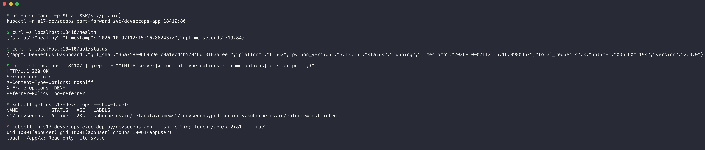

The container runs as `appuser` (uid 10001) and cannot write to its file system. The app sends the security headers.

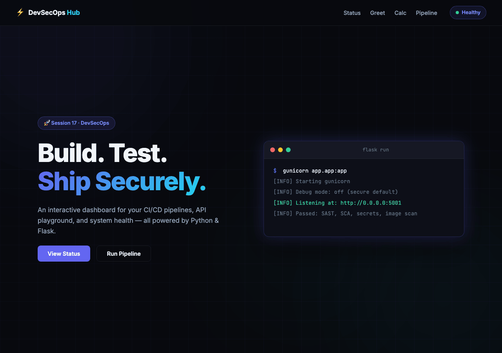

The "Healthy" badge at the top right comes from a live call to `/health`. I removed the namespace after the test.

---

## Security

### SAST

SAST (Static Application Security Testing) reads the source code without a run of the program. Job 3 runs [Bandit](https://bandit.readthedocs.io/) with [`security/bandit.yaml`](security/bandit.yaml). The config excludes `tests/` (tests use `assert`, which Bandit reports as B101) and skips no check.

```console
$ bandit -c security/bandit.yaml -r app -f json -o reports/bandit.json --exit-zero -q; echo "report: reports/bandit.json"
report: reports/bandit.json

$ bandit -c security/bandit.yaml -r app -f screen --exit-zero 2>&1 | sed "s/\x1b\[[0-9;]*m//g" | grep -v "^\s*$"
[main]	INFO	profile include tests: None
[main]	INFO	profile exclude tests: None
[main]	INFO	cli include tests: None
[main]	INFO	cli exclude tests: None
[main]	INFO	using config: security/bandit.yaml
[main]	INFO	running on Python 3.13.15
Run started:2026-10-07 12:13:26.042491+00:00
Test results:
	No issues identified.
Code scanned:
	Total lines of code: 158
	Total lines skipped (#nosec): 0
Run metrics:
	Total issues (by severity):
		Undefined: 0
		Low: 0
		Medium: 0
		High: 0
	Total issues (by confidence):
		Undefined: 0
		Low: 0
		Medium: 0
		High: 0
Files skipped (0):
```

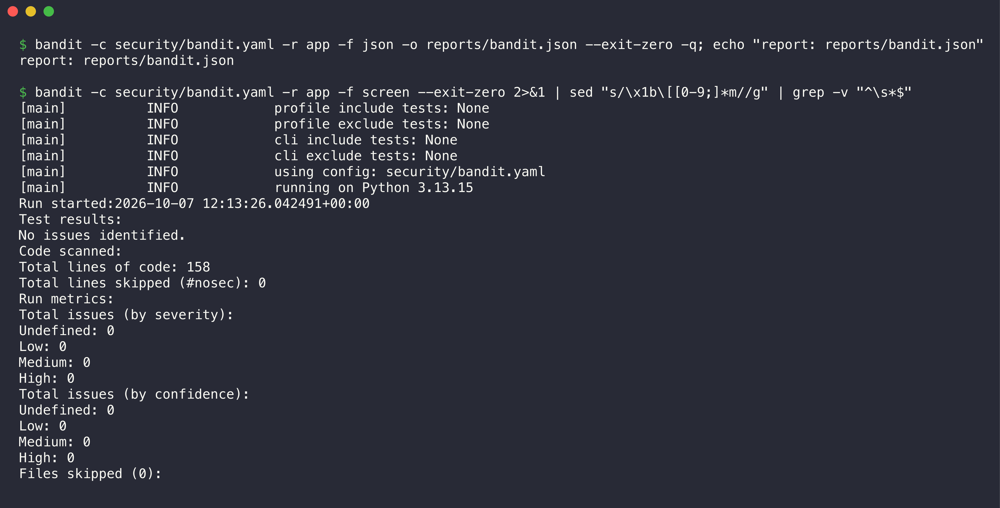

#### Security changes to the application

Bandit found 7 issues of three types in the original class demo:

```console
$ bandit -r ../../devops-heros/session-17-devsecops/demo/app -f custom --msg-template "{test_id} {severity} {line}: {msg}" -q
B311 LOW 79: Standard pseudo-random generators are not suitable for security/cryptographic purposes.
B311 LOW 190: Standard pseudo-random generators are not suitable for security/cryptographic purposes.
B311 LOW 192: Standard pseudo-random generators are not suitable for security/cryptographic purposes.
B311 LOW 196: Standard pseudo-random generators are not suitable for security/cryptographic purposes.
B311 LOW 207: Standard pseudo-random generators are not suitable for security/cryptographic purposes.
B201 HIGH 234: A Flask app appears to be run with debug=True, which exposes the Werkzeug debugger and allows the execution of arbitrary code.
B104 MEDIUM 234: Possible binding to all interfaces.
```

I fixed them in the code. I did not hide them with `# nosec`:

| Finding in the class demo | Severity | Fix |
|---|---|---|
| B201 `app.run(debug=True)`: the Werkzeug debugger allows remote code execution | HIGH | debug mode off; gunicorn runs the app in the container |
| B104 `host="0.0.0.0"` in `app.run` | MEDIUM | `127.0.0.1` for local development; gunicorn binds in the container |
| B311 `random.choice` / `random.random` | LOW | `random.SystemRandom()` |

I also changed these items:

- The JavaScript put the branch name into `innerHTML` without escape (DOM-based XSS). I added `escapeHtml()`.
- The app sends `X-Content-Type-Options`, `X-Frame-Options` and `Referrer-Policy` headers.
- `power` limits the exponent, so `2 ** 10000000` cannot use all CPU.
- `request.get_json(silent=True)` returns HTTP 400 for a body that is not JSON (not 500).
- `datetime.utcnow()` (deprecated) became `datetime.now(timezone.utc)`.

The [failure demo](#security-gates) shows Bandit HIGH B201 again, on a copy with `debug=True`.

### SCA

SCA (Software Composition Analysis) checks the third-party packages for known vulnerabilities. SAST checks our code; SCA checks the code of other people that we use. Job 4 uses two tools:

- **pip-audit** resolves `requirements.txt` with all transitive dependencies and checks them against the PyPI advisory database (OSV).
- **Trivy fs** checks `requirements.txt` against the Trivy database. It gives a severity (HIGH, CRITICAL), which pip-audit does not give.

```console
$ pip-audit -r requirements.txt --format json --output reports/pip-audit.json; pip-audit -r requirements.txt --format columns
No known vulnerabilities found
No known vulnerabilities found

$ trivy fs -q --scanners vuln --ignorefile security/.trivyignore --format json --output reports/trivy-fs.json requirements.txt && echo "report: reports/trivy-fs.json"
report: reports/trivy-fs.json

$ trivy fs -q --scanners vuln --ignorefile security/.trivyignore requirements.txt

Report Summary

┌──────────────────┬──────┬─────────────────┐
│      Target      │ Type │ Vulnerabilities │
├──────────────────┼──────┼─────────────────┤
│ requirements.txt │ pip  │        0        │
└──────────────────┴──────┴─────────────────┘
Legend:
- '-': Not scanned
- '0': Clean (no security findings detected)
```

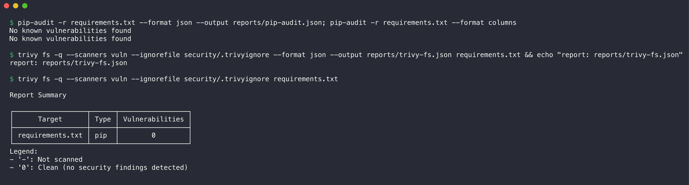

All versions in `requirements.txt` are pinned (`==`). A pinned file gives the same packages in every build, and the scanners can check exact versions.

### Secret scanning

Job 5 runs [Gitleaks](https://github.com/gitleaks/gitleaks) with [`security/.gitleaks.toml`](security/.gitleaks.toml). The config extends the default rules (cloud keys, tokens, private keys, passwords in URLs). It allows only binary screenshots and the scan reports that the pipeline writes.

The job scans **only this assignment folder** (`gitleaks dir .` with the folder as working directory). Other folders in this repository have Kubernetes Secret examples with dummy values; they must not fail this build. The job downloads the Gitleaks binary and checks its SHA-256 checksum before it uses it, because a CI tool is also part of the supply chain.

```console
$ gitleaks version
8.30.1

$ gitleaks dir . --config security/.gitleaks.toml --redact --no-banner --report-format json --report-path reports/gitleaks.json --exit-code 0 --verbose 2>&1 | sed "s/\x1b\[[0-9;]*m//g"
5:43PM INF scanned ~50014 bytes (50.01 KB) in 7.51ms
5:43PM INF no leaks found

$ cat reports/gitleaks.json; echo
[]
```

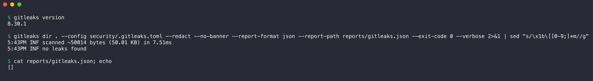

`--redact` hides the secret value in the output, so the log of a failed scan does not leak the secret again. Trivy also does a secret scan on the image (`scanners: vuln,secret`).

**WARNING:** If a real secret goes into Git, delete is not enough. Git keeps the history. Revoke and rotate the secret first, then remove it from the history.

### Container image scanning

Job 7 scans the image tar with Trivy (through `aquasecurity/trivy-action`). The scan finds vulnerable OS packages (Alpine `apk`) and Python packages inside the image, and secrets in the image layers. `ignore-unfixed: true` hides findings that have no fixed version yet, because the team cannot act on them.

The workflow pins `trivy-action` to a full commit SHA, not to a tag. A tag can move to other code, a commit SHA cannot. Attackers moved the tags of popular actions to malicious code before, for example `tj-actions/changed-files` in March 2025.

```console
$ trivy image -q --input /tmp/s17-image.tar --scanners vuln,secret --ignore-unfixed --ignorefile security/.trivyignore --format json --output reports/trivy-image.json && echo "report: reports/trivy-image.json"
report: reports/trivy-image.json

$ trivy image -q --scanners vuln,secret --ignore-unfixed --severity HIGH,CRITICAL ghcr.io/kartavya37/s17-devsecops-app:2.0.0 2>&1 | head -n 22

Report Summary

┌─────────────────────────────────────────────────────────────────────────────┬────────────┬─────────────────┬─────────┐
│                                   Target                                    │    Type    │ Vulnerabilities │ Secrets │
├─────────────────────────────────────────────────────────────────────────────┼────────────┼─────────────────┼─────────┤
│ ghcr.io/kartavya37/s17-devsecops-app:2.0.0 (alpine 3.24.2)                  │   alpine   │        0        │    -    │
├─────────────────────────────────────────────────────────────────────────────┼────────────┼─────────────────┼─────────┤
│ opt/venv/lib/python3.13/site-packages/blinker-1.9.0.dist-info/METADATA      │ python-pkg │        0        │    -    │
├─────────────────────────────────────────────────────────────────────────────┼────────────┼─────────────────┼─────────┤
│ opt/venv/lib/python3.13/site-packages/click-8.5.0.dist-info/METADATA        │ python-pkg │        0        │    -    │
├─────────────────────────────────────────────────────────────────────────────┼────────────┼─────────────────┼─────────┤
│ opt/venv/lib/python3.13/site-packages/flask-3.1.3.dist-info/METADATA        │ python-pkg │        0        │    -    │
├─────────────────────────────────────────────────────────────────────────────┼────────────┼─────────────────┼─────────┤
│ opt/venv/lib/python3.13/site-packages/gunicorn-26.2.0.dist-info/METADATA    │ python-pkg │        0        │    -    │
├─────────────────────────────────────────────────────────────────────────────┼────────────┼─────────────────┼─────────┤
│ opt/venv/lib/python3.13/site-packages/itsdangerous-2.2.0.dist-info/METADATA │ python-pkg │        0        │    -    │
├─────────────────────────────────────────────────────────────────────────────┼────────────┼─────────────────┼─────────┤
│ opt/venv/lib/python3.13/site-packages/jinja2-3.1.6.dist-info/METADATA       │ python-pkg │        0        │    -    │
├─────────────────────────────────────────────────────────────────────────────┼────────────┼─────────────────┼─────────┤
│ opt/venv/lib/python3.13/site-packages/markupsafe-3.0.4.dist-info/METADATA   │ python-pkg │        0        │    -    │
├─────────────────────────────────────────────────────────────────────────────┼────────────┼─────────────────┼─────────┤
```

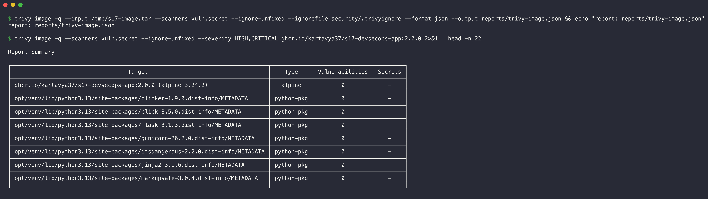

The runtime image has 0 vulnerabilities in the OS packages and in all 8 Python packages.

### Security gates

Job 8 runs [`security/security_gate.py`](security/security_gate.py). It reads the five reports and blocks the release if one rule fails:

| Stage | Tool | Rule that blocks |
|---|---|---|
| SAST | Bandit | an issue with HIGH severity |
| SCA | pip-audit | a known vulnerability that has a fixed version |
| SCA | Trivy fs | a HIGH or CRITICAL vulnerability |
| Secret scan | Gitleaks | any finding |
| Image scan | Trivy image | a HIGH or CRITICAL vulnerability with a fix |
| all | - | a missing or invalid report (fail closed) |

If the gate exits with code 1, GitHub marks the job as failed. Jobs 9 and 10 `need` the gate, so GitHub does not start them: no push, no deploy. To accept a risk, add the CVE to [`security/.trivyignore`](security/.trivyignore) with a reason and an expiry date. Git history then shows who accepted which risk.

#### Gate passes (this project)

```console
$ ls reports/
bandit.json
gitleaks.json
pip-audit.json
trivy-fs.json
trivy-image.json

$ python3 security/security_gate.py reports; echo "exit code: $?"
============================================================
SECURITY GATE (block on HIGH/CRITICAL, any secret, fail closed)
============================================================
Stage        Tool         Findings  Blocking  Result
-----------  -----------  --------  --------  ------
SAST         Bandit       0         0         PASS  
SCA          pip-audit    0         0         PASS  
SCA          Trivy fs     0         0         PASS  
Secret scan  Gitleaks     0         0         PASS  
Image scan   Trivy image  0         0         PASS  

Security gate PASSED: the image can be pushed and deployed.
exit code: 0
```

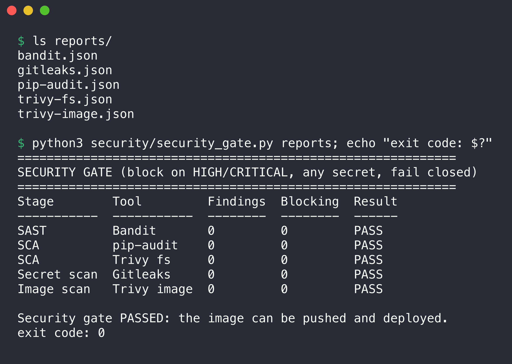

#### Gate fails (vulnerable demo copy)

To prove that the gate blocks, I made a throwaway copy of this folder **outside the repository** (`/tmp/s17-vulnerable-demo`) and added old and insecure parts:

- old dependencies: `Flask==2.2.4`, `Werkzeug==2.2.2`, `gunicorn==21.2.0`
- `app.run(host="0.0.0.0", port=5001, debug=True)`
- a fake GitHub token in `app/settings.py` (random characters, never a real token)
- a naive Dockerfile with the old base image `python:3.11.4-slim-bullseye`

```console
$ pwd   # throwaway copy outside the repository
/tmp/s17-vulnerable-demo/Complete-CI-CD-&-DevSecOps

$ diff "$FIXED/requirements.txt" requirements.txt
1,2c1,3
< Flask==3.1.3
< gunicorn==26.2.0
---
> Flask==2.2.4
> Werkzeug==2.2.2
> gunicorn==21.2.0

$ grep -n "app.run" "$FIXED/app/app.py" app/app.py
/Users/kp/SST/3rd Year/Devops/SST-Assignments/DevOps-Assignment/Complete-CI-CD-&-DevSecOps/app/app.py:213:    app.run(host="127.0.0.1", port=5001)
app/app.py:213:    app.run(host="0.0.0.0", port=5001, debug=True)

$ sed -E "s/(ghp_)[A-Za-z0-9]+/\1************ (fake value, masked here)/" app/settings.py
# DEMO ONLY: a fake token that looks real, to trigger the secret scan.
GITHUB_TOKEN = "ghp_************ (fake value, masked here)"

$ head -n 3 Dockerfile
# DEMO ONLY (vulnerable "before" version): old base image, root user, pip left in the image.
FROM python:3.11.4-slim-bullseye
WORKDIR /app
```

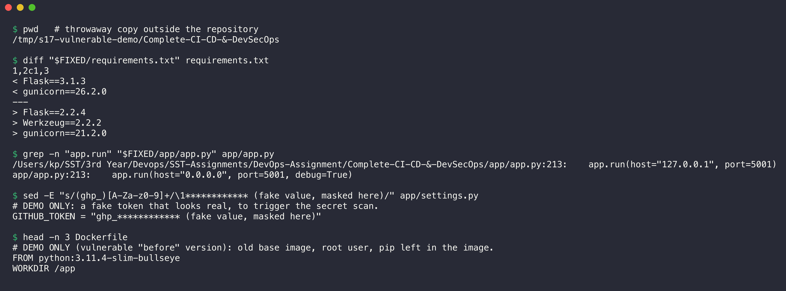

I ran the same scan commands on the copy, then the gate:

```console
$ python3 security/security_gate.py reports; echo "exit code: $?"
============================================================
SECURITY GATE (block on HIGH/CRITICAL, any secret, fail closed)
============================================================
Stage        Tool         Findings  Blocking  Result
-----------  -----------  --------  --------  ------
SAST         Bandit       3         1         FAIL  
SCA          pip-audit    15        15        FAIL  
SCA          Trivy fs     14        5         FAIL  
Secret scan  Gitleaks     1         1         FAIL  
Image scan   Trivy image  226       79        FAIL  

Blocking findings:
  - [Bandit] B201 HIGH: A Flask app appears to be run with debug=True, which exposes the Werkzeug debugger and allows the execution of arbitrary code. (app/app.py:213)
  - [pip-audit] flask 2.2.4: PYSEC-2023-62 (fix: 2.2.5, 2.3.2)
  - [pip-audit] flask 2.2.4: PYSEC-2026-2151 (fix: 3.1.3)
  - [pip-audit] werkzeug 2.2.2: PYSEC-2023-57 (fix: 2.2.3)
  - [pip-audit] werkzeug 2.2.2: PYSEC-2023-58 (fix: 2.2.3)
  - [pip-audit] werkzeug 2.2.2: PYSEC-2023-221 (fix: 2.3.8, 3.0.1)
  - [pip-audit] werkzeug 2.2.2: PYSEC-2026-2043 (fix: 3.0.3)
  - [pip-audit] ... and 9 more (see pip-audit.json)
  - [Trivy fs] Flask 2.2.4: CVE-2023-30861 HIGH (fix: 2.3.2, 2.2.5)
  - [Trivy fs] Werkzeug 2.2.2: CVE-2023-25577 HIGH (fix: 2.2.3)
  - [Trivy fs] Werkzeug 2.2.2: CVE-2024-34069 HIGH (fix: 3.0.3)
  - [Trivy fs] gunicorn 21.2.0: CVE-2024-1135 HIGH (fix: 22.0.0)
  - [Trivy fs] gunicorn 21.2.0: CVE-2024-6827 HIGH (fix: 22.0.0)
  - [Gitleaks] github-pat in app/settings.py:2
  - [Trivy image] e2fsprogs 1.46.2-2: CVE-2022-1304 HIGH (fix: 1.46.2-2+deb11u1)
  - [Trivy image] gpgv 2.2.27-2+deb11u2: CVE-2025-68973 HIGH (fix: 2.2.27-2+deb11u3)
  - [Trivy image] libc-bin 2.31-13+deb11u6: CVE-2023-4911 HIGH (fix: 2.31-13+deb11u7)
  - [Trivy image] libc-bin 2.31-13+deb11u6: CVE-2024-2961 HIGH (fix: 2.31-13+deb11u9)
  - [Trivy image] libc-bin 2.31-13+deb11u6: CVE-2024-33599 HIGH (fix: 2.31-13+deb11u10)
  - [Trivy image] libc6 2.31-13+deb11u6: CVE-2023-4911 HIGH (fix: 2.31-13+deb11u7)
  - [Trivy image] ... and 73 more (see trivy-image.json)

Security gate FAILED: the pipeline stops here. Fix the findings above.
exit code: 1
```

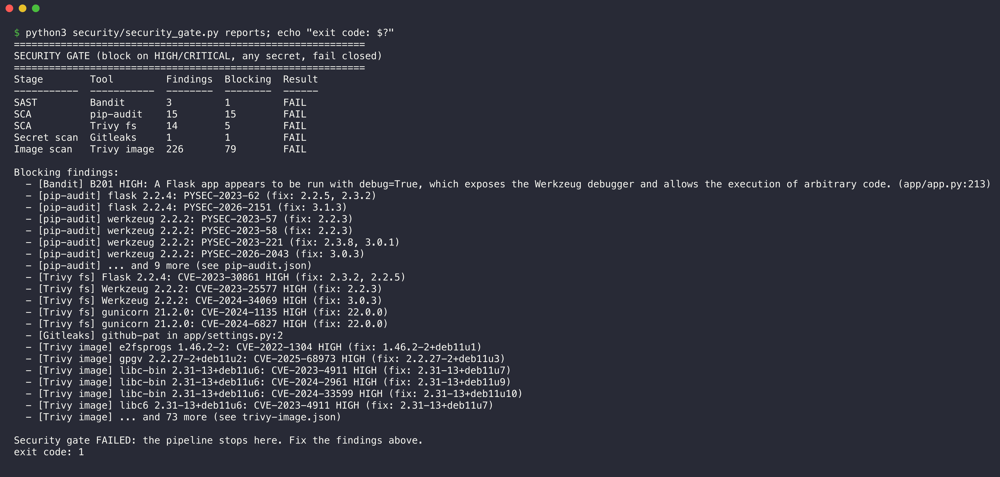

All four scanners found blocking problems, and the gate returned exit code 1. Gitleaks found the fake token and printed `REDACTED` in place of the value:

```console
$ gitleaks dir . --config security/.gitleaks.toml --redact --no-banner --exit-code 1 --verbose 2>&1 | sed "s/\x1b\[[0-9;]*m//g"; echo "exit code: ${PIPESTATUS[0]}"
Finding:     GITHUB_TOKEN = "REDACTED
Secret:      REDACTED
RuleID:      github-pat
Entropy:     5.071928
File:        app/settings.py
Line:        2
Fingerprint: app/settings.py:github-pat:2

5:50PM INF scanned ~49059 bytes (49.06 KB) in 6.96ms
5:50PM WRN leaks found: 1
exit code: 1
```

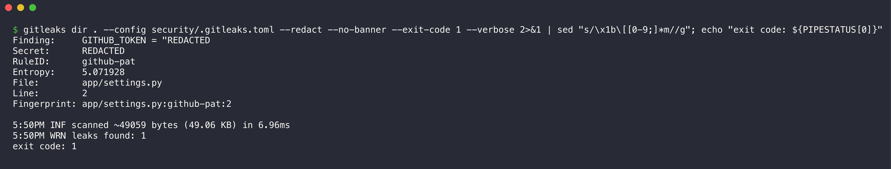

The fixed version is this folder: the current dependencies, no debug mode, no token, and the hardened Dockerfile. The [pipeline runs below](#pipeline-execution) show both cases end to end.

---

## Pipeline execution

### Workflow validation

```console
$ python3 -c "import yaml; yaml.safe_load(open(\".github/workflows/s17-devsecops.yml\")); print(\"valid YAML\")"
valid YAML

$ docker run --rm -v "$PWD:/repo" -w /repo rhysd/actionlint:latest -no-color .github/workflows/s17-devsecops.yml && echo "actionlint: no problems"
actionlint: no problems

$ diff .github/workflows/s17-devsecops.yml "Complete-CI-CD-&-DevSecOps/.github/workflows/s17-devsecops.yml" && echo "root copy and folder copy are identical"
root copy and folder copy are identical
```

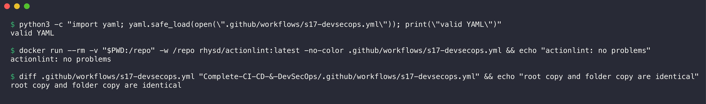

### Local runs with act

Before the push, I ran the workflow on my laptop with [act](https://github.com/nektos/act). act runs each job in a Docker container that looks like a GitHub runner. The command, from the repository root:

```bash
act push -W .github/workflows/s17-devsecops.yml \
  -P ubuntu-latest=catthehacker/ubuntu:act-latest --container-architecture linux/arm64 \
  --artifact-server-path /tmp/act-artifacts --artifact-server-addr 0.0.0.0 \
  --cache-server-addr 0.0.0.0 --cache-server-port 34568
```

Some steps cannot run under act. They have `if: ${{ !env.ACT }}` (act sets the variable `ACT`):

- **GHCR login and push** in job 9: a local run must not publish an image. Job 9 still downloads and loads the scanned image.
- **kind cluster, deploy, rollout and smoke test** in job 10. I tested the same manifests on minikube ([above](#local-proof-on-minikube)).

Other differences under act:

- Docker Buildx uses the `docker` driver under act (the local Docker engine has the base image). On GitHub it uses `docker-container`. This avoids Docker Hub pull limits on my laptop.
- The artifact actions stay on v4: the act artifact server supports only the v4 protocol.
- On Docker Desktop for Mac, containers cannot reach the act artifact and cache servers on the Mac address. I started two small `alpine/socat` forwarder containers on the Docker host network (ports 34567 and 34568).
- The `actions/cache` step inside trivy-action shows a warning under act ("tar failed"), because my local path contains a space. It only means that the Trivy database is not cached between local runs.

#### Run 1: all checks pass

Full log: [`evidence/act-s17-push.txt`](evidence/act-s17-push.txt).

```console
$ grep -E "Job (succeeded|failed)" evidence/act-s17-push.txt
[S17 DevSecOps Pipeline/1. Build] 🏁  Job succeeded
[S17 DevSecOps Pipeline/2. Unit Test] 🏁  Job succeeded
[S17 DevSecOps Pipeline/3. SAST (Bandit)] 🏁  Job succeeded
[S17 DevSecOps Pipeline/4. SCA (pip-audit + Trivy fs)] 🏁  Job succeeded
[S17 DevSecOps Pipeline/5. Secret Scan (Gitleaks)    ] 🏁  Job succeeded
[S17 DevSecOps Pipeline/6. Docker Build              ] 🏁  Job succeeded
[S17 DevSecOps Pipeline/7. Container Image Scan (Trivy)] 🏁  Job succeeded
[S17 DevSecOps Pipeline/8. Security Gate               ] 🏁  Job succeeded
[S17 DevSecOps Pipeline/9. Push Image (GHCR)           ] 🏁  Job succeeded
[S17 DevSecOps Pipeline/10. Deploy to Kubernetes (kind)] 🏁  Job succeeded

$ grep "| " evidence/act-s17-push.txt | grep -E "passed in|Total coverage|No issues identified|No known vulnerabilities|Trivy fs vulnerabilities|no leaks found|sha256sum|gitleaks_.*: OK|Loaded image" | sed -E "s/^\[S17 DevSecOps Pipeline\/([^]]*[^ ]) *\] +\| /[\1] /" | sed -E "s/\x1b\[[0-9;]*m//g"
[2. Unit Test] Required test coverage of 80% reached. Total coverage: 93.07%
[2. Unit Test] ============================== 15 passed in 0.14s ==============================
[3. SAST (Bandit)] 	No issues identified.
[4. SCA (pip-audit + Trivy fs)] No known vulnerabilities found
[4. SCA (pip-audit + Trivy fs)] No known vulnerabilities found
[4. SCA (pip-audit + Trivy fs)] Trivy fs vulnerabilities: 0
[5. Secret Scan (Gitleaks)] gitleaks_8.30.1_linux_arm64.tar.gz: OK
[5. Secret Scan (Gitleaks)] 12:19PM INF no leaks found
[9. Push Image (GHCR)] Loaded image: ghcr.io/kartavya37/s17-devsecops-app:3ba758e0669b9efc0a1ecd4b57040d1310aa1eef
[9. Push Image (GHCR)] Loaded image: ghcr.io/kartavya37/s17-devsecops-app:latest
```



The 10 jobs ran in the order of the expected flow, and all passed. The Gitleaks binary passed the checksum check. The gate and the deploy job:

```console
$ grep "8. Security Gate" evidence/act-s17-push.txt | grep "| " | sed -E "s/^\[[^]]*\] +\| //" | tail -n 12
============================================================
SECURITY GATE (block on HIGH/CRITICAL, any secret, fail closed)
============================================================
Stage        Tool         Findings  Blocking  Result
-----------  -----------  --------  --------  ------
SAST         Bandit       0         0         PASS  
SCA          pip-audit    0         0         PASS  
SCA          Trivy fs     0         0         PASS  
Secret scan  Gitleaks     0         0         PASS  
Image scan   Trivy image  0         0         PASS  

Security gate PASSED: the image can be pushed and deployed.

$ grep "10. Deploy" evidence/act-s17-push.txt | grep "| " | sed -E "s/^\[[^]]*\] +\| //" | grep -vE "DEP0|trace-deprecation|Redirecting"
Downloading single artifact
Preparing to download the following artifacts:
- docker-image (ID: 3572604477, Size: 96, Expected Digest: undefined)
Starting download of artifact to: /tmp
SHA256 digest of downloaded artifact is 3451ac6618b810a179e2c1ca5d4a0d5ea4b5e22e5b038b13439e4731200e17b1
Artifact download completed successfully.
Total of 1 artifact(s) downloaded
Download artifact has finished successfully
27:          image: ghcr.io/kartavya37/s17-devsecops-app:latest
Deploy image: ghcr.io/kartavya37/s17-devsecops-app:3ba758e0669b9efc0a1ecd4b57040d1310aa1eef
-rw-r--r-- 1 root root 22759424 Oct  7 12:20 /tmp/image.tar
```

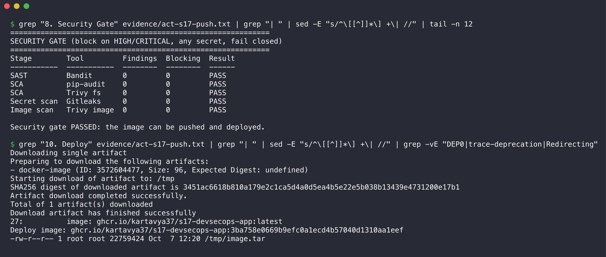

The gate passed, so job 9 loaded the scanned image. The GHCR push itself does not run under act. Job 10 prepared the deploy with the commit SHA as the tag.

#### Run 2: the security gate stops the vulnerable copy

This run uses the vulnerable copy in `/tmp/s17-vulnerable-demo` (a separate Git repository with the same workflow). Full log: [`evidence/act-s17-gate-fail.txt`](evidence/act-s17-gate-fail.txt).

```console
$ grep -E "Job (succeeded|failed)|^Error" evidence/act-s17-gate-fail.txt
[S17 DevSecOps Pipeline/1. Build] 🏁  Job succeeded
[S17 DevSecOps Pipeline/2. Unit Test] 🏁  Job succeeded
[S17 DevSecOps Pipeline/3. SAST (Bandit)] 🏁  Job succeeded
[S17 DevSecOps Pipeline/4. SCA (pip-audit + Trivy fs)] 🏁  Job succeeded
[S17 DevSecOps Pipeline/5. Secret Scan (Gitleaks)    ] 🏁  Job succeeded
[S17 DevSecOps Pipeline/6. Docker Build              ] 🏁  Job succeeded
[S17 DevSecOps Pipeline/7. Container Image Scan (Trivy)] 🏁  Job succeeded
[S17 DevSecOps Pipeline/8. Security Gate               ] 🏁  Job failed
Error: Job '8. Security Gate' failed

$ grep "8. Security Gate" evidence/act-s17-gate-fail.txt | grep "| " | sed -E "s/^\[[^]]*\] +\| //" | grep -E "^(Stage|---|SAST|SCA|Secret|Image|Security gate)"
Stage        Tool         Findings  Blocking  Result
-----------  -----------  --------  --------  ------
SAST         Bandit       3         1         FAIL  
SCA          pip-audit    15        15        FAIL  
SCA          Trivy fs     14        5         FAIL  
Secret scan  Gitleaks     1         1         FAIL  
Image scan   Trivy image  226       79        FAIL  
Security gate FAILED: the pipeline stops here. Fix the findings above.

$ grep -cE "9. Push Image|10. Deploy" evidence/act-s17-gate-fail.txt
0
```

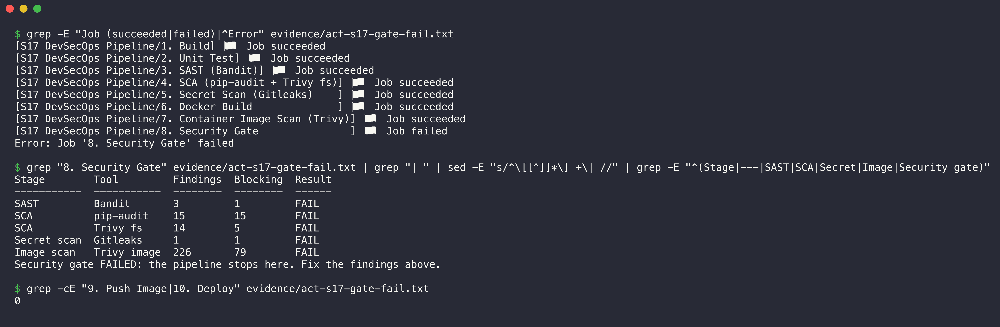

Jobs 1 to 7 passed: the scans ran and wrote their reports. The Security Gate read the reports and failed. Jobs 9 (Push Image) and 10 (Deploy) never started (0 lines in the log). The vulnerable image did not reach the registry or the cluster.

**Note:** Bandit printed the fake demo token in this log (rule B105). I replaced its value with `ghp_****MASKED****` in the saved log, and the file header says so. Otherwise the secret scan of this folder would report the evidence file.

### Pipeline execution on GitHub

I pushed the repository to GitHub on 7 October 2026 (commit `f0640c2`). The push started the workflow [`s17-devsecops.yml`](../.github/workflows/s17-devsecops.yml) on GitHub-hosted runners: [run 37637158546](https://github.com/kartavya37/DevOps-Assignment/actions/runs/37637158546). All 10 jobs completed with **success** in about 5 minutes.

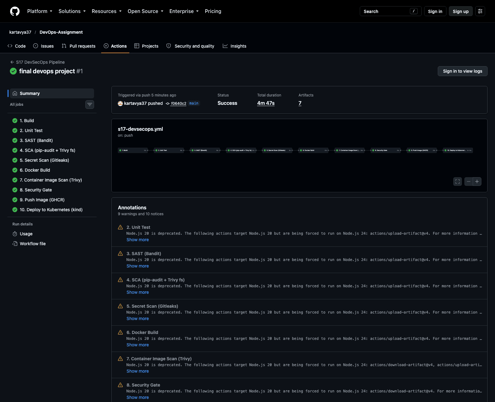

| Job | Result | Duration |
|---|---|---|
| 1. Build | success | 0m 12s |
| 2. Unit Test | success | 0m 18s |
| 3. SAST (Bandit) | success | 0m 16s |
| 4. SCA (pip-audit + Trivy fs) | success | 0m 35s |
| 5. Secret Scan (Gitleaks) | success | 0m 09s |
| 6. Docker Build | success | 0m 31s |
| 7. Container Image Scan (Trivy) | success | 0m 26s |
| 8. Security Gate | success | 0m 13s |
| 9. Push Image (GHCR) | success | 0m 25s |
| 10. Deploy to Kubernetes (kind) | success | 1m 14s |

The jobs run in one chain, in the order of the expected flow. The Security Gate passed, so job 9 pushed `ghcr.io/kartavya37/s17-devsecops-app` with the commit SHA as the tag. Then job 10 deployed that image to a kind cluster. The run stored the reports of all scan jobs as artifacts: `unit-test-report`, `sast-report`, `sca-report`, `secret-scan-report` and `image-scan-report`.

This is the log of the deploy job. It comes from `gh run view 37637158546 --log`:

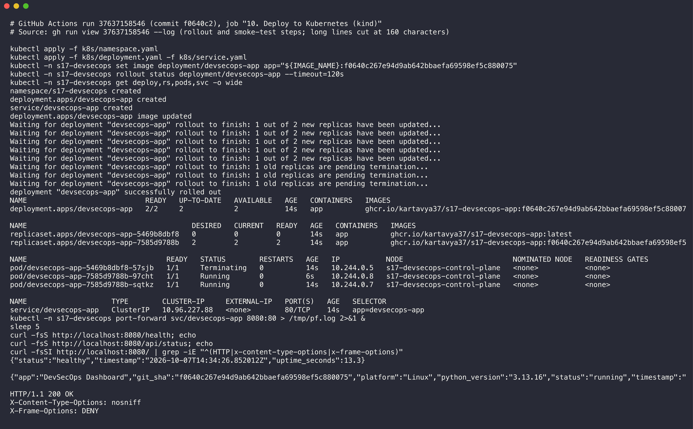

`kubectl set image` started a rolling update to the image with the commit SHA tag. The rollout completed with 2 Pods. The smoke test got `healthy` from `/health`, the app status with the `git_sha`, and the security headers `X-Content-Type-Options: nosniff` and `X-Frame-Options: DENY`. The full excerpt is in [`evidence/github-deploy-log.txt`](evidence/github-deploy-log.txt).

The run title on GitHub is "final devops project". GitHub uses the message of the last commit in a push as the run title. One push sent all the assignments, so the three pipelines have the same title.

**Note:** The run shows warnings that Node.js 20 is deprecated for `actions/upload-artifact@v4` and `actions/download-artifact@v4`. The jobs still pass. I kept v4 because the act artifact server does not work with newer versions.

---

## Deliverables

| Deliverable | Where |
|---|---|
| Application | [`app/`](app/), [`tests/`](tests/) |
| Dockerfile | [`Dockerfile`](Dockerfile) |
| GitHub Actions workflow | [`../.github/workflows/s17-devsecops.yml`](../.github/workflows/s17-devsecops.yml) (copy: [`.github/workflows/s17-devsecops.yml`](.github/workflows/s17-devsecops.yml)) |
| Security tools configuration | [`security/`](security/): `bandit.yaml`, `.gitleaks.toml`, `.trivyignore`, `security_gate.py` |
| Kubernetes manifests | [`k8s/`](k8s/) |
| Successful pipeline output | act runs above, full logs in [`evidence/`](evidence/) |
| Screenshots | [`screenshots/`](screenshots/), GitHub run screenshots in [Pipeline execution on GitHub](#pipeline-execution-on-github) |
| Complete README.md | this file |

## Run the checks yourself

1. Create a virtual environment outside the repository.
2. Install `requirements-dev.txt`, `bandit==1.9.4` and `pip-audit==2.10.1`.
3. Install Trivy and Gitleaks.
4. Run the commands of each section above. They write the reports into `reports/` (Git ignores this folder).
5. Run `python3 security/security_gate.py reports`.
