# Session 21: Final DevOps Project & Troubleshooting

**Name:** Kartavya Panchal  
**Roll No.:** 24BCS10343

This folder is the `final-devops-project/` folder from the brief. It contains one end-to-end DevOps project for **TaskBoard**, a small task tracker (FastAPI + React + PostgreSQL). The project takes the application from source code to a monitored Kubernetes deployment with CI/CD, DevSecOps, Helm, Terraform and GitOps. It also contains the Final Troubleshooting Challenge with eight broken scenarios.

The base of the application is the class project `devops-heros/session21-python`. I changed and extended it (see [Application setup](#4-application-setup)).

```text
Final-DevOps-Project-&-Troubleshooting/      (= final-devops-project/ in the brief)
├── application/
│   ├── backend/              FastAPI API, SQLAlchemy models, Alembic migration, pytest tests
│   └── frontend/             React + Vite UI, Nginx config template
├── docker/                   backend.Dockerfile, frontend.Dockerfile, docker-compose.yml
├── kubernetes/               plain manifests: Namespace, ConfigMap, Secret, PostgreSQL (PVC), Deployments, Services, Ingress, HPA
├── helm/taskboard/           Helm chart with values.yaml, values-dev.yaml, values-prod.yaml, chart test
├── terraform/                VPC, subnets, NAT, security groups, IAM, KMS, EKS + node group, ECR, S3 (Moto emulator)
├── .github/workflows/        s21-final.yml (copy of the root workflow)
├── security/                 security_gate.py, bandit.yaml, .gitleaks.toml, .trivyignore
├── monitoring/               ServiceMonitor, PrometheusRule, Grafana dashboard, platform Helm values
├── gitops/                   Argo CD Applications (Gitea and GitHub), GitOps values, Gitea push script
├── troubleshooting/          base/ + 8 scenarios, each with broken.yaml and fixed.yaml
├── scripts/                  load-test.sh (HPA demo), probe.sh (availability probe)
├── evidence/                 full command logs (Terraform plan/apply, HPA watch, act runs)
├── screenshots/              all PNG screenshots in this README
└── README.md
```

## Contents

1. [Project overview](#1-project-overview)
2. [Architecture diagram](#2-architecture-diagram)
3. [Technologies used](#3-technologies-used)
4. [Application setup](#4-application-setup)
5. [Docker setup](#5-docker-setup)
6. [Kubernetes deployment](#6-kubernetes-deployment)
7. [Helm deployment](#7-helm-deployment)
8. [Terraform infrastructure](#8-terraform-infrastructure)
9. [CI/CD pipeline](#9-cicd-pipeline)
10. [DevSecOps implementation](#10-devsecops-implementation)
11. [Monitoring](#11-monitoring)
12. [GitOps](#12-gitops)
13. [Troubleshooting (Final Troubleshooting Challenge)](#13-troubleshooting-final-troubleshooting-challenge)
14. [Screenshots](#14-screenshots)
15. [Lessons learned](#15-lessons-learned)
16. [Cleanup](#16-cleanup)

---

## 1. Project overview

TaskBoard is a task tracker for a DevOps team. Users create tasks, give them a priority and an assignee, and move them from `TODO` to `IN_PROGRESS` to `DONE`. The dashboard shows counters for each status.

The project includes every stage from the brief:

| Stage in the brief | Where in this project |
|---|---|
| Application | [`application/`](application/): FastAPI backend, React frontend, PostgreSQL |
| Git, GitHub | Repository `kartavya37/DevOps-Assignment`, this folder |
| CI pipeline, Build & Test | [`.github/workflows/s21-final.yml`](.github/workflows/s21-final.yml), job 1 |
| Security scans | jobs 2 to 8: SAST, SCA, IaC scan, secret scan, image scan, security gate |
| Docker image | [`docker/`](docker/), job 6 |
| Container registry | GHCR `ghcr.io/kartavya37/taskboard-backend` and `taskboard-frontend`, job 9 |
| Kubernetes | [`kubernetes/`](kubernetes/), job 10 (kind) and the minikube cluster |
| Helm | [`helm/taskboard/`](helm/taskboard/) |
| Monitoring | [`monitoring/`](monitoring/): Prometheus, Alertmanager, Grafana, Loki |
| GitOps | [`gitops/`](gitops/): Argo CD + Gitea |
| Infrastructure | [`terraform/`](terraform/) (Moto AWS emulator) |
| Troubleshooting | [`troubleshooting/`](troubleshooting/): 8 broken scenarios |

**Class rubric (`GRADING.md` of the class project) and the location of the evidence:**

| Module | Evidence in this README |
|---|---|
| M1 Application | FastAPI with `/health`, 7 REST endpoints under `/api` (GET, POST, PUT, DELETE), PostgreSQL with an Alembic migration, React UI ([section 4](#4-application-setup), [section 5](#5-docker-setup)) |
| M2 Tests | 14 pytest tests on a temporary SQLite database, `pytest.ini` + `conftest.py`, `pytest -v` output ([section 4](#4-application-setup)) |
| M3 Git and GitHub | public repository `kartavya37/DevOps-Assignment`, `.gitignore` excludes `.env`, `__pycache__`, `node_modules`, `.venv` |
| M4 Docker | multi-stage Dockerfiles, non-root users, `docker compose up --build` with 3 services ([section 5](#5-docker-setup)) |
| M5 CI/CD | workflow on push to `main`, pytest gate, frontend build, both images, GHCR push with the commit SHA tag, green run on GitHub ([section 9](#9-cicd-pipeline)) |
| M6 DevSecOps | Trivy on both images, fail on HIGH/CRITICAL, one CVE explained ([section 10](#10-devsecops-implementation)) |
| M7 Terraform | VPC with 2 public subnets, EKS with a node group, `terraform.tfvars.example`, plan/apply/destroy output, **on the Moto emulator** (no AWS Console screenshot, because I have no AWS account) ([section 8](#8-terraform-infrastructure)) |
| M8 Kubernetes + Helm | namespace manifest, Helm chart, 2 replicas, ClusterIP Services, Ingress `/` and `/api`, all Pods `Running` ([sections 6](#6-kubernetes-deployment) and [7](#7-helm-deployment)) |
| M9 Observability | `/metrics`, Prometheus target `UP`, Grafana dashboard with live panels ([section 11](#11-monitoring)) |
| M10 Documentation | this README |

**Test environment.** All Kubernetes work ran on one local minikube cluster (Kubernetes v1.37, docker driver, ingress-nginx, metrics-server, StorageClass `standard`). A shared platform runs in the same cluster: kube-prometheus-stack, Loki and Alloy (namespace `monitoring`), Argo CD (`argocd`) and Gitea (`gitea`). The Session 20 assignment installed this platform. Its Helm values are in [`monitoring/platform-values/`](monitoring/platform-values/) and [`gitops/platform-values/`](gitops/platform-values/). This project did not install it again. The project used only namespaces with the prefix `s21-`.

**CAUTION:** I have no AWS account. The Terraform part ran against the **Moto AWS emulator** on `localhost:4566`, not against real AWS. No output in this README comes from a real AWS account.

---

## 2. Architecture diagram

### Delivery flow (from the brief)

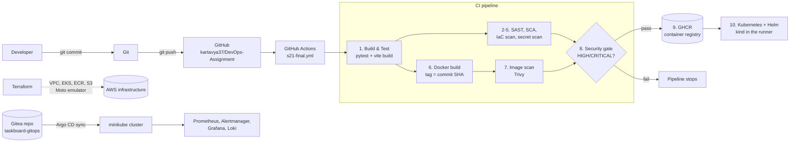
```mermaid
flowchart LR
    DEV[Developer] -->|git commit| GIT[Git]
    GIT -->|git push| GH[GitHub<br/>kartavya37/DevOps-Assignment]
    GH --> CI[GitHub Actions<br/>s21-final.yml]
    subgraph PIPE[CI pipeline]
        BT[1. Build & Test<br/>pytest + vite build]
        SEC[2-5. SAST, SCA,<br/>IaC scan, secret scan]
        DB[6. Docker build<br/>tag = commit SHA]
        IS[7. Image scan<br/>Trivy]
        GATE{8. Security gate<br/>HIGH/CRITICAL?}
        BT --> SEC
        BT --> DB --> IS
        SEC --> GATE
        IS --> GATE
    end
    CI --> BT
    GATE -->|pass| REG[(9. GHCR<br/>container registry)]
    GATE -->|fail| STOP[Pipeline stops]
    REG --> K8S[10. Kubernetes + Helm<br/>kind in the runner]
    TF[Terraform] -.->|VPC, EKS, ECR, S3<br/>Moto emulator| AWS[(AWS infrastructure)]
    GITEA[(Gitea repo<br/>taskboard-gitops)] -->|Argo CD sync| MK[minikube cluster]
    MK --> MON[Prometheus, Alertmanager,<br/>Grafana, Loki]
```

### Runtime architecture (Kubernetes)

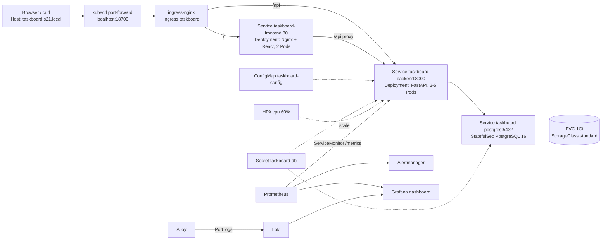
```mermaid
flowchart LR
    U[Browser / curl<br/>Host: taskboard.s21.local] --> PF[kubectl port-forward<br/>localhost:18700]
    PF --> ING[ingress-nginx<br/>Ingress taskboard]
    ING -->|/| FE[Service taskboard-frontend:80<br/>Deployment: Nginx + React, 2 Pods]
    ING -->|/api| BE[Service taskboard-backend:8000<br/>Deployment: FastAPI, 2-5 Pods]
    FE -->|/api proxy| BE
    BE --> PG[Service taskboard-postgres:5432<br/>StatefulSet: PostgreSQL 16]
    PG --- PVC[(PVC 1Gi<br/>StorageClass standard)]
    CM[ConfigMap taskboard-config] -.-> BE
    SECRET[Secret taskboard-db] -.-> BE
    SECRET -.-> PG
    HPA[HPA cpu 60%] -.->|scale| BE
    PROM[Prometheus] -->|ServiceMonitor /metrics| BE
    PROM --> AM[Alertmanager]
    PROM --> GRAF[Grafana dashboard]
    ALLOY[Alloy] -->|Pod logs| LOKI[Loki] --> GRAF
```

---

## 3. Technologies used

| Area | Technology | Version | Purpose |
|---|---|---|---|
| Backend | Python, FastAPI, Uvicorn | 3.13, 0.142, 0.54 | REST API |
| Database | PostgreSQL, SQLAlchemy, Alembic, psycopg | 16, 2.1, 1.20, 3.3 | data, ORM, migrations |
| Metrics | prometheus-fastapi-instrumentator, prometheus-client | 8.1, 0.26 | `/metrics` endpoint |
| Tests | pytest, pytest-cov, httpx2 | 9.1, 7.1 | unit and API tests (SQLite) |
| Frontend | React, Vite, Nginx | 19.3, 8.3, 1.31 | UI and static file server |
| Containers | Docker, Docker Compose | Docker Desktop | images, local stack |
| Kubernetes | minikube, kubectl, ingress-nginx, metrics-server | v1.37 | cluster, Ingress, HPA |
| Package manager | Helm | v4.3.0 | chart `taskboard` |
| IaC | Terraform, hashicorp/aws provider, Moto | 1.16.4, 6.67.0 | AWS infrastructure (emulator) |
| CI/CD | GitHub Actions, act, actionlint, kind | act-latest runner image | pipeline, local pipeline run |
| Registry | GitHub Container Registry (GHCR) | | images with commit SHA tags |
| DevSecOps | Bandit, pip-audit, npm audit, Trivy, Gitleaks | 1.9.4, 2.10.1, npm 11, 0.75.0, 8.30.1 | SAST, SCA, IaC, image and secret scans |
| Monitoring | kube-prometheus-stack, Grafana, Loki, Alloy | chart 92.0.0, 11.6, 3.6, 1.20 | metrics, alerts, dashboards, logs |
| GitOps | Argo CD, Gitea | v3.5.4, 1.27.0 | Git-driven deployment |

---

## 4. Application setup

### What I changed in the class project

- I moved the code to `application/backend` and `application/frontend`, and the Dockerfiles to `docker/` (the deliverables tree).
- **Backend:** settings come from a ConfigMap (`DB_HOST`, `DB_PORT`, `DB_NAME`) and a Secret (`DB_USER`, `DB_PASSWORD`), or from one `DATABASE_URL`. `/ready` now returns HTTP 503 if the database does not answer (the class version returned 500). New business metrics: `taskboard_build_info`, `taskboard_tasks_created_total`, `taskboard_tasks_deleted_total`, `taskboard_task_status_changes_total`. Version 1.1.0 adds `/api/info` and finer latency buckets. The deprecated `on_event` hook became a `lifespan` handler.
- **Migrations:** Alembic uses a PostgreSQL advisory lock, so two Pods that start at the same time do not run the migration twice.
- **Tests:** 14 tests (the class project had 3). A `conftest.py` gives each test a new temporary SQLite database. The tests never use PostgreSQL.
- **Frontend:** pinned dependency versions with a `package-lock.json` (the class project used `latest`), my name in the UI, and a footer that shows the API version and environment.

### Backend API

| Method and path | Purpose |
|---|---|
| `GET /` | service name, version, environment |
| `GET /health` | liveness: the process answers (no database call) |
| `GET /ready` | readiness: `SELECT 1` on the database, HTTP 503 if it fails |
| `GET /metrics` | Prometheus metrics (not exposed through the Ingress) |
| `GET /api/info` | version and environment for the frontend footer |
| `GET /api/tasks`, `GET /api/tasks/{id}` | list tasks, get one task |
| `POST /api/tasks` | create a task (validated with Pydantic) |
| `PUT /api/tasks/{id}` | update a task |
| `DELETE /api/tasks/{id}` | delete a task |
| `GET /api/tasks/stats` | counters for each status |

Code: [`application/backend/app/main.py`](application/backend/app/main.py), [`config.py`](application/backend/app/config.py), [`models.py`](application/backend/app/models.py), migration [`0001_create_tasks.py`](application/backend/alembic/versions/0001_create_tasks.py).

### Run the tests

1. Go to `application/backend`.
2. Install the test dependencies with `pip install -r requirements-dev.txt`.
3. Run pytest with coverage.

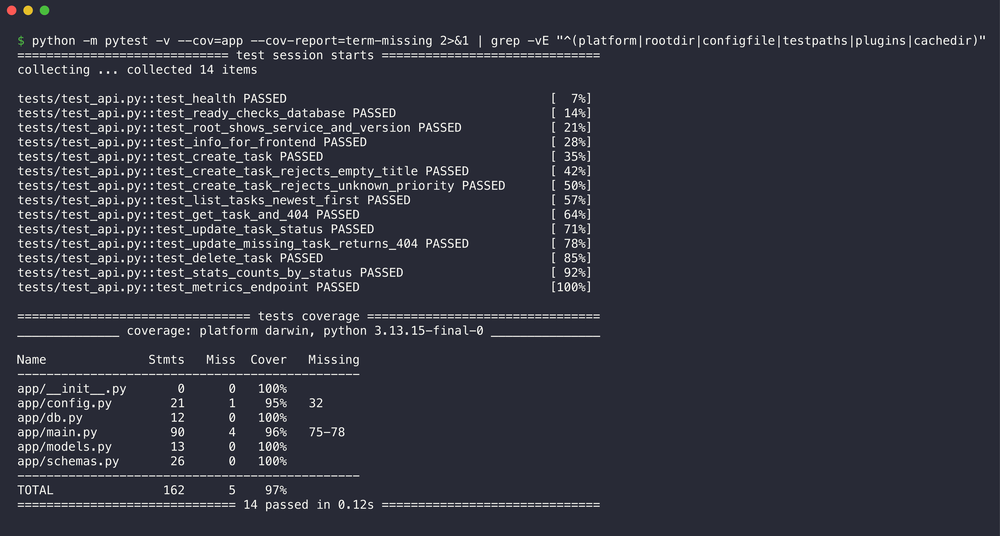

```console
$ python -m pytest -v --cov=app --cov-report=term-missing 2>&1 | grep -vE "^(platform|rootdir|configfile|testpaths|plugins|cachedir)"
============================= test session starts ==============================
collecting ... collected 14 items

tests/test_api.py::test_health PASSED                                    [  7%]
tests/test_api.py::test_ready_checks_database PASSED                     [ 14%]
tests/test_api.py::test_root_shows_service_and_version PASSED            [ 21%]
tests/test_api.py::test_info_for_frontend PASSED                         [ 28%]
tests/test_api.py::test_create_task PASSED                               [ 35%]
tests/test_api.py::test_create_task_rejects_empty_title PASSED           [ 42%]
tests/test_api.py::test_create_task_rejects_unknown_priority PASSED      [ 50%]
tests/test_api.py::test_list_tasks_newest_first PASSED                   [ 57%]
tests/test_api.py::test_get_task_and_404 PASSED                          [ 64%]
tests/test_api.py::test_update_task_status PASSED                        [ 71%]
tests/test_api.py::test_update_missing_task_returns_404 PASSED           [ 78%]
tests/test_api.py::test_delete_task PASSED                               [ 85%]
tests/test_api.py::test_stats_counts_by_status PASSED                    [ 92%]
tests/test_api.py::test_metrics_endpoint PASSED                          [100%]

================================ tests coverage ================================
______________ coverage: platform darwin, python 3.13.15-final-0 _______________

Name              Stmts   Miss  Cover   Missing
-----------------------------------------------
app/__init__.py       0      0   100%
app/config.py        21      1    95%   32
app/db.py            12      0   100%
app/main.py          90      4    96%   75-78
app/models.py        13      0   100%
app/schemas.py       26      0   100%
-----------------------------------------------
TOTAL               162      5    97%
============================== 14 passed in 0.12s ==============================
```

All 14 tests pass and the coverage is 97%. The tests cover all REST endpoints, the validation errors (HTTP 422), the "not found" cases (HTTP 404) and the `/metrics` output. The pipeline stops if the coverage is less than 80%.

### Run the backend directly (optional)

1. Start PostgreSQL (for example with the Compose file in the next section).
2. Set `DATABASE_URL` (see [`.env.example`](application/backend/.env.example)).
3. Run `alembic upgrade head`.
4. Run `uvicorn app.main:app --port 8000`.
5. For the frontend, run `npm ci && npm run dev` in `application/frontend`. Vite sends `/api` to port 8000.

---

## 5. Docker setup

### Dockerfiles

| File | Stages | Base images | User |
|---|---|---|---|
| [`docker/backend.Dockerfile`](docker/backend.Dockerfile) | `build` (venv + pip install) → `runtime` | `python:3.13-slim` | UID 10001 |
| [`docker/frontend.Dockerfile`](docker/frontend.Dockerfile) | `build` (`npm ci` + `vite build`) → `runtime` | `node:22-alpine` → `nginx:1.31-alpine` | UID 101 (`nginx`) |

- Both images are multi-stage. The runtime images have no build tools: no Node.js and npm in the frontend image, no pip in the backend image.
- Both images run as a non-root user with a numeric UID. Kubernetes `runAsNonRoot` can check a numeric UID.
- The frontend Nginx listens on port 8080 (a non-root user cannot open port 80). It writes the PID and temp files to `/tmp`.
- The Nginx config is a template ([`nginx.conf.template`](application/frontend/nginx.conf.template)). At start, the Nginx image replaces `${BACKEND_URL}` with the backend address (Compose: `http://backend:8000`, Kubernetes: the backend Service).
- The backend container runs `alembic upgrade head` and then `uvicorn`. The image has a `HEALTHCHECK` for `/health`.
- `.dockerignore` files keep tests, caches, `node_modules` and `.env` files out of the build context.
- The runtime stage of the frontend runs `apk upgrade`. The security gate blocked the first frontend image because of 43 fixed HIGH CVEs in the old base image (see [section 10](#10-devsecops-implementation)).

### Build the images and load them into minikube

1. Build the backend image with the build argument `APP_VERSION`.
2. Build the frontend image.
3. Load both images into minikube with `minikube image load`.

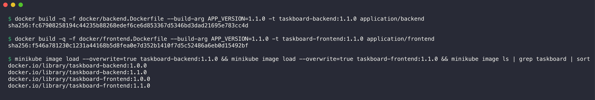

```console
$ docker build -q -f docker/backend.Dockerfile --build-arg APP_VERSION=1.1.0 -t taskboard-backend:1.1.0 application/backend
sha256:fc67908258194c44235b88268edef6ce6d853367d5346bd3dad21695e783cc4d

$ docker build -q -f docker/frontend.Dockerfile --build-arg APP_VERSION=1.1.0 -t taskboard-frontend:1.1.0 application/frontend
sha256:f546a781230c1231a44168b5d8fea0e7d352b1410f7d5c52486a6eb0d15492bf

$ minikube image load --overwrite=true taskboard-backend:1.1.0 && minikube image load --overwrite=true taskboard-frontend:1.1.0 && minikube image ls | grep taskboard | sort
docker.io/library/taskboard-backend:1.0.0
docker.io/library/taskboard-backend:1.1.0
docker.io/library/taskboard-frontend:1.0.0
docker.io/library/taskboard-frontend:1.1.0
```

Version 1.0.0 is the first build (no `/api/info`). The Helm section uses it for the upgrade and rollback demo.

The first load of version 1.0.0, before I added `/api/info`:

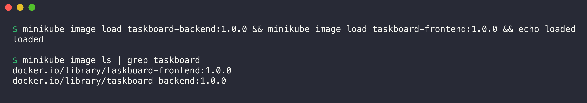

```console
$ minikube image load taskboard-backend:1.0.0 && minikube image load taskboard-frontend:1.0.0 && echo loaded
loaded

$ minikube image ls | grep taskboard
docker.io/library/taskboard-frontend:1.0.0
docker.io/library/taskboard-backend:1.0.0
```

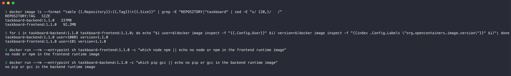

```console
$ docker image ls --format "table {{.Repository}}:{{.Tag}}\t{{.Size}}" | grep -E "REPOSITORY|^taskboard" | sed -E "s/ {20,}/   /"
REPOSITORY:TAG   SIZE
taskboard-backend:1.1.0   337MB
taskboard-frontend:1.1.0   92.2MB

$ for i in taskboard-backend:1.1.0 taskboard-frontend:1.1.0; do echo "$i user=$(docker image inspect -f "{{.Config.User}}" $i) version=$(docker image inspect -f "{{index .Config.Labels \"org.opencontainers.image.version\"}}" $i)"; done
taskboard-backend:1.1.0 user=10001 version=1.1.0
taskboard-frontend:1.1.0 user=101 version=1.1.0

$ docker run --rm --entrypoint sh taskboard-frontend:1.1.0 -c "which node npm || echo no node or npm in the frontend runtime image"
no node or npm in the frontend runtime image

$ docker run --rm --entrypoint sh taskboard-backend:1.1.0 -c "which pip gcc || echo no pip or gcc in the backend runtime image"
no pip or gcc in the backend runtime image
```

### Docker Compose (local stack)

File: [`docker/docker-compose.yml`](docker/docker-compose.yml). It starts PostgreSQL, the backend and the frontend. The backend waits until PostgreSQL is healthy. The frontend waits until the backend is healthy.

1. Go to the `docker` folder.
2. Start the stack with `docker compose up --build -d`.
3. Open `http://localhost:18780` (frontend) and `http://localhost:18781/docs` (API).

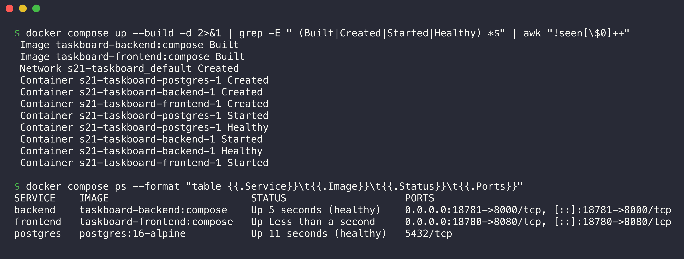

```console
$ docker compose up --build -d 2>&1 | grep -E " (Built|Created|Started|Healthy) *$" | awk "!seen[\$0]++"
 Image taskboard-backend:compose Built 
 Image taskboard-frontend:compose Built 
 Network s21-taskboard_default Created 
 Container s21-taskboard-postgres-1 Created 
 Container s21-taskboard-backend-1 Created 
 Container s21-taskboard-frontend-1 Created 
 Container s21-taskboard-postgres-1 Started 
 Container s21-taskboard-postgres-1 Healthy 
 Container s21-taskboard-backend-1 Started 
 Container s21-taskboard-backend-1 Healthy 
 Container s21-taskboard-frontend-1 Started 

$ docker compose ps --format "table {{.Service}}\t{{.Image}}\t{{.Status}}\t{{.Ports}}"
SERVICE    IMAGE                        STATUS                    PORTS
backend    taskboard-backend:compose    Up 5 seconds (healthy)    0.0.0.0:18781->8000/tcp, [::]:18781->8000/tcp
frontend   taskboard-frontend:compose   Up Less than a second     0.0.0.0:18780->8080/tcp, [::]:18780->8080/tcp
postgres   postgres:16-alpine           Up 11 seconds (healthy)   5432/tcp
```

I created five tasks through the frontend proxy (`POST /api/tasks`, all HTTP 201) and tested the API:

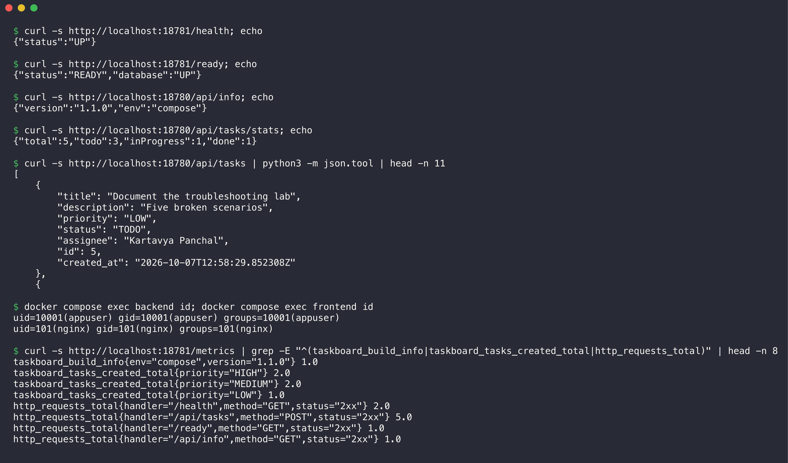

```console
$ curl -s http://localhost:18781/health; echo
{"status":"UP"}

$ curl -s http://localhost:18781/ready; echo
{"status":"READY","database":"UP"}

$ curl -s http://localhost:18780/api/info; echo
{"version":"1.1.0","env":"compose"}

$ curl -s http://localhost:18780/api/tasks/stats; echo
{"total":5,"todo":3,"inProgress":1,"done":1}

$ curl -s http://localhost:18780/api/tasks | python3 -m json.tool | head -n 11
[
    {
        "title": "Document the troubleshooting lab",
        "description": "Five broken scenarios",
        "priority": "LOW",
        "status": "TODO",
        "assignee": "Kartavya Panchal",
        "id": 5,
        "created_at": "2026-10-07T12:58:29.852308Z"
    },
    {

$ docker compose exec backend id; docker compose exec frontend id
uid=10001(appuser) gid=10001(appuser) groups=10001(appuser)
uid=101(nginx) gid=101(nginx) groups=101(nginx)

$ curl -s http://localhost:18781/metrics | grep -E "^(taskboard_build_info|taskboard_tasks_created_total|http_requests_total)" | head -n 8
taskboard_build_info{env="compose",version="1.1.0"} 1.0
taskboard_tasks_created_total{priority="HIGH"} 2.0
taskboard_tasks_created_total{priority="MEDIUM"} 2.0
taskboard_tasks_created_total{priority="LOW"} 1.0
http_requests_total{handler="/health",method="GET",status="2xx"} 2.0
http_requests_total{handler="/api/tasks",method="POST",status="2xx"} 5.0
http_requests_total{handler="/ready",method="GET",status="2xx"} 1.0
http_requests_total{handler="/api/info",method="GET",status="2xx"} 1.0
```

The application in the browser (Docker Compose). The footer shows `API v1.1.0 · compose`:

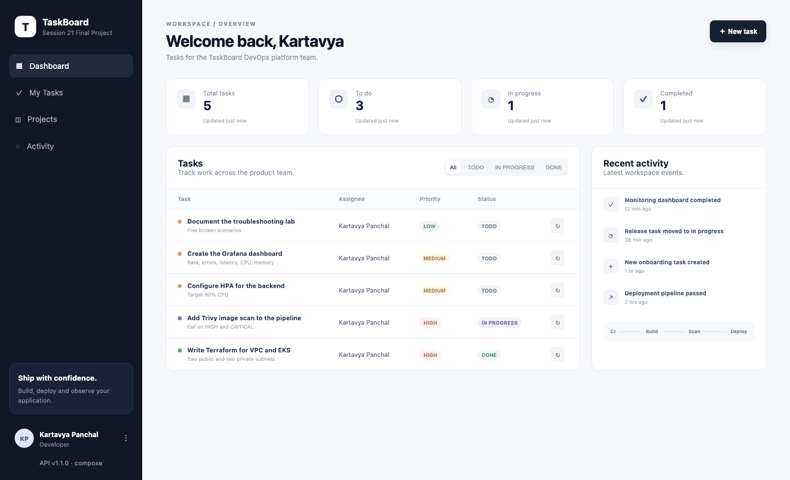

Swagger UI of the API (`/docs`):

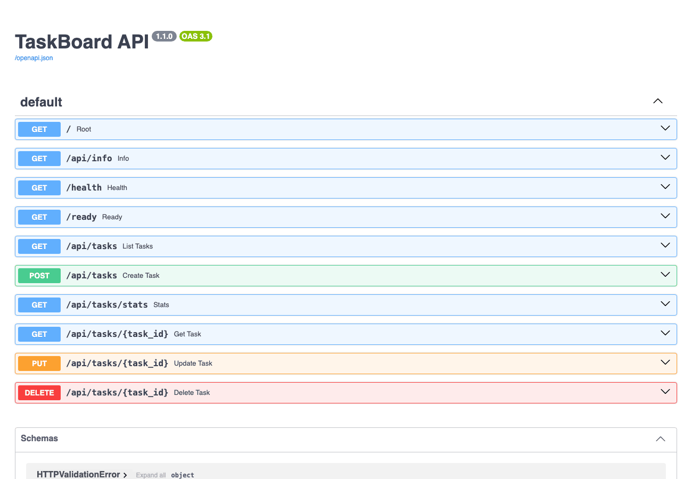

Stop the stack and remove the volume:

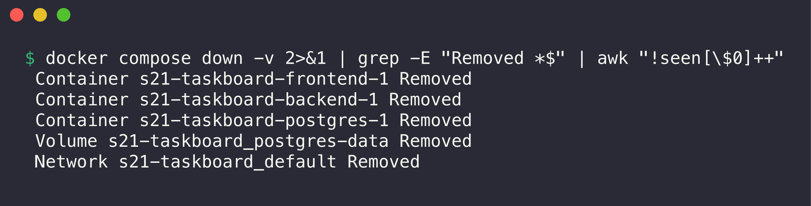

```console
$ docker compose down -v 2>&1 | grep -E "Removed *$" | awk "!seen[\$0]++"
 Container s21-taskboard-frontend-1 Removed 
 Container s21-taskboard-backend-1 Removed 
 Container s21-taskboard-postgres-1 Removed 
 Volume s21-taskboard_postgres-data Removed 
 Network s21-taskboard_default Removed 
```

---

## 6. Kubernetes deployment

The plain manifests are in [`kubernetes/`](kubernetes/). They deploy into namespace `s21-taskboard`.

| File | Objects | Notes |
|---|---|---|
| [`00-namespace.yaml`](kubernetes/00-namespace.yaml) | Namespace | `s21-taskboard` |
| [`01-configmap.yaml`](kubernetes/01-configmap.yaml) | ConfigMap | `APP_ENV`, `LOG_LEVEL`, `DB_HOST`, `DB_PORT`, `DB_NAME`, `BACKEND_URL` |
| [`02-secret.yaml`](kubernetes/02-secret.yaml) | Secret | `DB_USER`, `DB_PASSWORD` (demo values) |
| [`03-postgres.yaml`](kubernetes/03-postgres.yaml) | headless Service, StatefulSet | PVC from `volumeClaimTemplates`, StorageClass `standard`, 1Gi, read-only root file system |
| [`04-backend.yaml`](kubernetes/04-backend.yaml) | Deployment, Service | 2 replicas, init container `wait-for-db`, startup/liveness/readiness probes, `preStop` sleep |
| [`05-frontend.yaml`](kubernetes/05-frontend.yaml) | Deployment, Service | 2 replicas, probes on `/healthz`, read-only root file system with `emptyDir` volumes |
| [`06-ingress.yaml`](kubernetes/06-ingress.yaml) | Ingress | host `taskboard.s21.local`: `/api` → backend, `/` → frontend |
| [`07-hpa.yaml`](kubernetes/07-hpa.yaml) | HorizontalPodAutoscaler | backend, 2 to 5 replicas, CPU 60% |

**WARNING:** Do not put real passwords in a Secret manifest in Git. Git keeps the history of all files. The values in `02-secret.yaml` are demo values. In production, use a secret manager (for example External Secrets or Sealed Secrets).

All containers run as non-root users with `allowPrivilegeEscalation: false`, all capabilities dropped and the `RuntimeDefault` seccomp profile. The backend and the frontend have a read-only root file system.

### Step 1: Apply the manifests

1. Load the images into minikube (see section 5).
2. Apply the folder with `kubectl apply -f kubernetes/`.

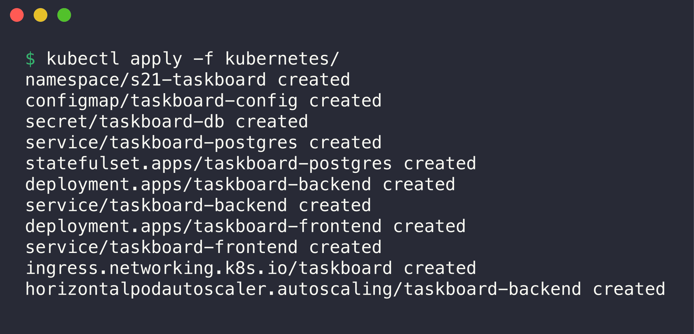

```console
$ kubectl apply -f kubernetes/
namespace/s21-taskboard created
configmap/taskboard-config created
secret/taskboard-db created
service/taskboard-postgres created
statefulset.apps/taskboard-postgres created
deployment.apps/taskboard-backend created
service/taskboard-backend created
deployment.apps/taskboard-frontend created
service/taskboard-frontend created
ingress.networking.k8s.io/taskboard created
horizontalpodautoscaler.autoscaling/taskboard-backend created
```

In my first apply, the backend Pods restarted 3 times, because PostgreSQL was not ready when the migration started. I added the init container `wait-for-db`. It runs `pg_isready` until PostgreSQL accepts connections. `pg_isready` needs `-U` because UID 10001 has no user name in the `postgres` image. After that change, the Pods started with 0 restarts.

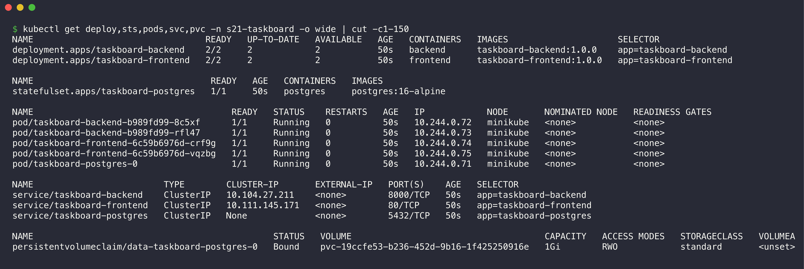

```console
$ kubectl get deploy,sts,pods,svc,pvc -n s21-taskboard -o wide | cut -c1-150
NAME                                 READY   UP-TO-DATE   AVAILABLE   AGE   CONTAINERS   IMAGES                     SELECTOR
deployment.apps/taskboard-backend    2/2     2            2           50s   backend      taskboard-backend:1.0.0    app=taskboard-backend
deployment.apps/taskboard-frontend   2/2     2            2           50s   frontend     taskboard-frontend:1.0.0   app=taskboard-frontend

NAME                                  READY   AGE   CONTAINERS   IMAGES
statefulset.apps/taskboard-postgres   1/1     50s   postgres     postgres:16-alpine

NAME                                      READY   STATUS    RESTARTS   AGE   IP            NODE       NOMINATED NODE   READINESS GATES
pod/taskboard-backend-b989fd99-8c5xf      1/1     Running   0          50s   10.244.0.72   minikube   <none>           <none>
pod/taskboard-backend-b989fd99-rfl47      1/1     Running   0          50s   10.244.0.73   minikube   <none>           <none>
pod/taskboard-frontend-6c59b6976d-crf9g   1/1     Running   0          50s   10.244.0.74   minikube   <none>           <none>
pod/taskboard-frontend-6c59b6976d-vqzbg   1/1     Running   0          50s   10.244.0.75   minikube   <none>           <none>
pod/taskboard-postgres-0                  1/1     Running   0          50s   10.244.0.71   minikube   <none>           <none>

NAME                         TYPE        CLUSTER-IP       EXTERNAL-IP   PORT(S)    AGE   SELECTOR
service/taskboard-backend    ClusterIP   10.104.27.211    <none>        8000/TCP   50s   app=taskboard-backend
service/taskboard-frontend   ClusterIP   10.111.145.171   <none>        80/TCP     50s   app=taskboard-frontend
service/taskboard-postgres   ClusterIP   None             <none>        5432/TCP   50s   app=taskboard-postgres

NAME                                              STATUS   VOLUME                                     CAPACITY   ACCESS MODES   STORAGECLASS   VOLUMEA
persistentvolumeclaim/data-taskboard-postgres-0   Bound    pvc-19ccfe53-b236-452d-9b16-1f425250916e   1Gi        RWO            standard       <unset>
```

All Pods are `Running` with 0 restarts. Both Services are `ClusterIP`. The PVC is `Bound` to a volume of the StorageClass `standard`.

### Step 2: Examine the ConfigMap, the Secret, the Ingress and the HPA

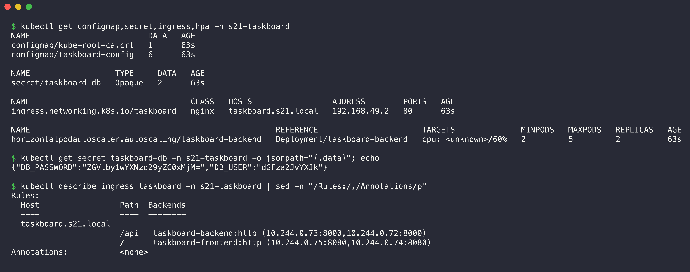

```console
$ kubectl get configmap,secret,ingress,hpa -n s21-taskboard
NAME                         DATA   AGE
configmap/kube-root-ca.crt   1      63s
configmap/taskboard-config   6      63s

NAME                  TYPE     DATA   AGE
secret/taskboard-db   Opaque   2      63s

NAME                                  CLASS   HOSTS                 ADDRESS        PORTS   AGE
ingress.networking.k8s.io/taskboard   nginx   taskboard.s21.local   192.168.49.2   80      63s

NAME                                                    REFERENCE                      TARGETS              MINPODS   MAXPODS   REPLICAS   AGE
horizontalpodautoscaler.autoscaling/taskboard-backend   Deployment/taskboard-backend   cpu: <unknown>/60%   2         5         2          63s

$ kubectl get secret taskboard-db -n s21-taskboard -o jsonpath="{.data}"; echo
{"DB_PASSWORD":"ZGVtby1wYXNzd29yZC0xMjM=","DB_USER":"dGFza2JvYXJk"}

$ kubectl describe ingress taskboard -n s21-taskboard | sed -n "/Rules:/,/Annotations/p"
Rules:
  Host                 Path  Backends
  ----                 ----  --------
  taskboard.s21.local  
                       /api   taskboard-backend:http (10.244.0.73:8000,10.244.0.72:8000)
                       /      taskboard-frontend:http (10.244.0.75:8080,10.244.0.74:8080)
Annotations:           <none>
```

The Secret values are only base64, not encrypted. Everyone with `get secret` permission can decode them. The HPA shows `<unknown>` for the first minute, because metrics-server has no data yet. Later it shows a real value (Step 5).

### Step 3: Open the application through the Ingress

The node IP of minikube is not reachable from my Mac. I used a port-forward to the ingress-nginx controller and the `Host` header.

1. Start `kubectl port-forward -n ingress-nginx svc/ingress-nginx-controller 18700:80` in the background.
2. Send requests with the header `Host: taskboard.s21.local`.

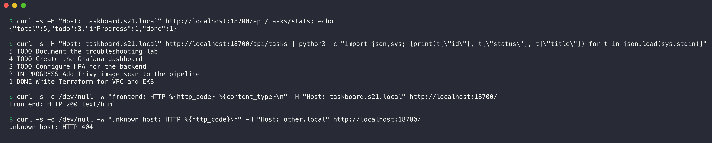

```console
$ curl -s -H "Host: taskboard.s21.local" http://localhost:18700/api/tasks/stats; echo
{"total":5,"todo":3,"inProgress":1,"done":1}

$ curl -s -H "Host: taskboard.s21.local" http://localhost:18700/api/tasks | python3 -c "import json,sys; [print(t[\"id\"], t[\"status\"], t[\"title\"]) for t in json.load(sys.stdin)]"
5 TODO Document the troubleshooting lab
4 TODO Create the Grafana dashboard
3 TODO Configure HPA for the backend
2 IN_PROGRESS Add Trivy image scan to the pipeline
1 DONE Write Terraform for VPC and EKS

$ curl -s -o /dev/null -w "frontend: HTTP %{http_code} %{content_type}\n" -H "Host: taskboard.s21.local" http://localhost:18700/
frontend: HTTP 200 text/html

$ curl -s -o /dev/null -w "unknown host: HTTP %{http_code}\n" -H "Host: other.local" http://localhost:18700/
unknown host: HTTP 404
```

The browser screenshot uses Chrome with a host resolver rule (`taskboard.s21.local` → `127.0.0.1`) and the URL `http://taskboard.s21.local:18700/`. The footer shows `API v1.1.0 · k8s-manifests` (after the rolling update in Step 6):

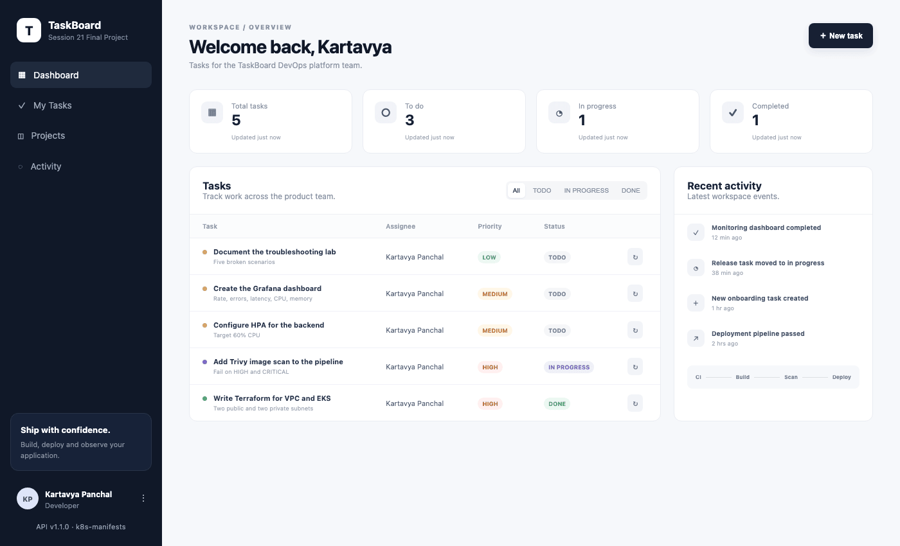

### Step 4: Probes and data persistence

| Container | startupProbe | livenessProbe | readinessProbe |
|---|---|---|---|
| backend | `GET /health`, 2 s × 30 | `GET /health`, every 10 s | `GET /ready` (database check), every 5 s |
| frontend | `GET /healthz`, 2 s × 15 | `GET /healthz`, every 10 s | `GET /healthz`, every 5 s |
| postgres | `pg_isready`, 2 s × 30 | `pg_isready`, every 10 s | `pg_isready`, every 5 s |

The startup probe gives a slow start (migrations) up to 60 seconds. The liveness probe does not call the database. If the database stops, Kubernetes does not restart all backend Pods. Only the readiness probe removes them from the Service.

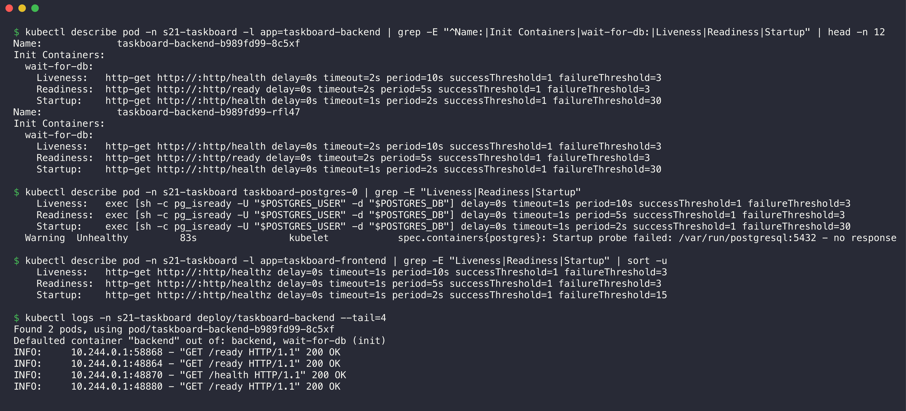

```console
$ kubectl describe pod -n s21-taskboard -l app=taskboard-backend | grep -E "^Name:|Init Containers|wait-for-db:|Liveness|Readiness|Startup" | head -n 12
Name:             taskboard-backend-b989fd99-8c5xf
Init Containers:
  wait-for-db:
    Liveness:   http-get http://:http/health delay=0s timeout=2s period=10s successThreshold=1 failureThreshold=3
    Readiness:  http-get http://:http/ready delay=0s timeout=2s period=5s successThreshold=1 failureThreshold=3
    Startup:    http-get http://:http/health delay=0s timeout=1s period=2s successThreshold=1 failureThreshold=30
Name:             taskboard-backend-b989fd99-rfl47
Init Containers:
  wait-for-db:
    Liveness:   http-get http://:http/health delay=0s timeout=2s period=10s successThreshold=1 failureThreshold=3
    Readiness:  http-get http://:http/ready delay=0s timeout=2s period=5s successThreshold=1 failureThreshold=3
    Startup:    http-get http://:http/health delay=0s timeout=1s period=2s successThreshold=1 failureThreshold=30

$ kubectl describe pod -n s21-taskboard taskboard-postgres-0 | grep -E "Liveness|Readiness|Startup"
    Liveness:   exec [sh -c pg_isready -U "$POSTGRES_USER" -d "$POSTGRES_DB"] delay=0s timeout=1s period=10s successThreshold=1 failureThreshold=3
    Readiness:  exec [sh -c pg_isready -U "$POSTGRES_USER" -d "$POSTGRES_DB"] delay=0s timeout=1s period=5s successThreshold=1 failureThreshold=3
    Startup:    exec [sh -c pg_isready -U "$POSTGRES_USER" -d "$POSTGRES_DB"] delay=0s timeout=1s period=2s successThreshold=1 failureThreshold=30
  Warning  Unhealthy         83s                kubelet            spec.containers{postgres}: Startup probe failed: /var/run/postgresql:5432 - no response

$ kubectl describe pod -n s21-taskboard -l app=taskboard-frontend | grep -E "Liveness|Readiness|Startup" | sort -u
    Liveness:   http-get http://:http/healthz delay=0s timeout=1s period=10s successThreshold=1 failureThreshold=3
    Readiness:  http-get http://:http/healthz delay=0s timeout=1s period=5s successThreshold=1 failureThreshold=3
    Startup:    http-get http://:http/healthz delay=0s timeout=1s period=2s successThreshold=1 failureThreshold=15

$ kubectl logs -n s21-taskboard deploy/taskboard-backend --tail=4
Found 2 pods, using pod/taskboard-backend-b989fd99-8c5xf
Defaulted container "backend" out of: backend, wait-for-db (init)
INFO:     10.244.0.1:58868 - "GET /ready HTTP/1.1" 200 OK
INFO:     10.244.0.1:48864 - "GET /ready HTTP/1.1" 200 OK
INFO:     10.244.0.1:48870 - "GET /health HTTP/1.1" 200 OK
INFO:     10.244.0.1:48880 - "GET /ready HTTP/1.1" 200 OK
```

The `grep` shows the probe lines of the `backend` container under the title of the init container (the init container has no probes). The one `Startup probe failed` event on PostgreSQL is normal: it came during the first initialization of the database, and the next probe passed.

**Data persistence.** I deleted the PostgreSQL Pod. The StatefulSet created a new Pod (new UID) with the same PVC. The 5 tasks are still there.

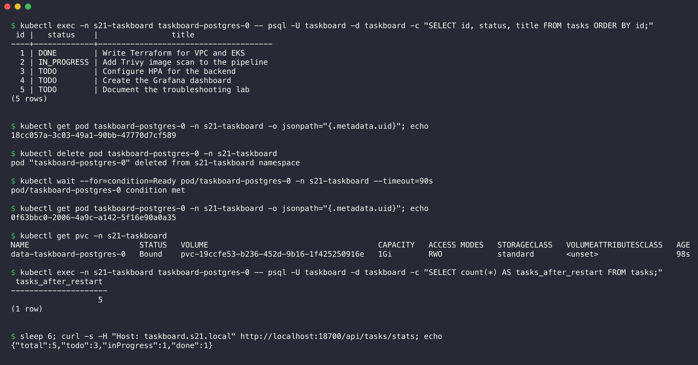

```console
$ kubectl exec -n s21-taskboard taskboard-postgres-0 -- psql -U taskboard -d taskboard -c "SELECT id, status, title FROM tasks ORDER BY id;"
 id |   status    |                title                 
----+-------------+--------------------------------------
  1 | DONE        | Write Terraform for VPC and EKS
  2 | IN_PROGRESS | Add Trivy image scan to the pipeline
  3 | TODO        | Configure HPA for the backend
  4 | TODO        | Create the Grafana dashboard
  5 | TODO        | Document the troubleshooting lab
(5 rows)


$ kubectl get pod taskboard-postgres-0 -n s21-taskboard -o jsonpath="{.metadata.uid}"; echo
18cc057a-3c03-49a1-90bb-47770d7cf589

$ kubectl delete pod taskboard-postgres-0 -n s21-taskboard
pod "taskboard-postgres-0" deleted from s21-taskboard namespace

$ kubectl wait --for=condition=Ready pod/taskboard-postgres-0 -n s21-taskboard --timeout=90s
pod/taskboard-postgres-0 condition met

$ kubectl get pod taskboard-postgres-0 -n s21-taskboard -o jsonpath="{.metadata.uid}"; echo
0f63bbc0-2006-4a9c-a142-5f16e90a0a35

$ kubectl get pvc -n s21-taskboard
NAME                        STATUS   VOLUME                                     CAPACITY   ACCESS MODES   STORAGECLASS   VOLUMEATTRIBUTESCLASS   AGE
data-taskboard-postgres-0   Bound    pvc-19ccfe53-b236-452d-9b16-1f425250916e   1Gi        RWO            standard       <unset>                 98s

$ kubectl exec -n s21-taskboard taskboard-postgres-0 -- psql -U taskboard -d taskboard -c "SELECT count(*) AS tasks_after_restart FROM tasks;"
 tasks_after_restart 
---------------------
                   5
(1 row)


$ sleep 6; curl -s -H "Host: taskboard.s21.local" http://localhost:18700/api/tasks/stats; echo
{"total":5,"todo":3,"inProgress":1,"done":1}
```

### Step 5: HPA scales the backend under load

Script: [`scripts/load-test.sh`](scripts/load-test.sh). It creates a Kubernetes Job with a small number of `curl` workers. Each request uses `Connection: close`, so the Service spreads the requests over all backend Pods (also the new Pods). The Job stops after the given time. The first run used 3 workers for 180 seconds.

**CAUTION:** Keep the load small on a shared cluster. Stop the load test with `scripts/load-test.sh stop` when you finish.

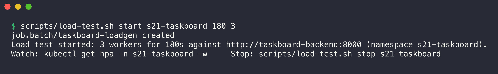

```console
$ scripts/load-test.sh start s21-taskboard 180 3
job.batch/taskboard-loadgen created
Load test started: 3 workers for 180s against http://taskboard-backend:8000 (namespace s21-taskboard).
Watch: kubectl get hpa -n s21-taskboard -w     Stop: scripts/load-test.sh stop s21-taskboard
```


```console
$ kubectl get hpa -n s21-taskboard
NAME                REFERENCE                      TARGETS         MINPODS   MAXPODS   REPLICAS   AGE
taskboard-backend   Deployment/taskboard-backend   cpu: 447%/60%   2         5         5          6m1s

$ kubectl get pods -n s21-taskboard -l app=taskboard-backend
NAME                               READY   STATUS    RESTARTS   AGE
taskboard-backend-b989fd99-6l2xm   1/1     Running   0          24s
taskboard-backend-b989fd99-8c5xf   1/1     Running   0          6m1s
taskboard-backend-b989fd99-ghvvz   1/1     Running   0          24s
taskboard-backend-b989fd99-hrblq   1/1     Running   0          84s
taskboard-backend-b989fd99-rfl47   1/1     Running   0          6m1s

$ kubectl top pods -n s21-taskboard -l app=taskboard-backend
NAME                               CPU(cores)   MEMORY(bytes)   
taskboard-backend-b989fd99-8c5xf   450m         86Mi            
taskboard-backend-b989fd99-hrblq   438m         83Mi            
taskboard-backend-b989fd99-rfl47   445m         81Mi            

$ kubectl describe hpa taskboard-backend -n s21-taskboard | sed -n "/^Events:/,\$p"
Events:
  Type     Reason                        Age                    From                       Message
  ----     ------                        ----                   ----                       -------
  Warning  FailedGetResourceMetric       5m40s (x3 over 6m1s)   horizontal-pod-autoscaler  failed to get cpu utilization: unable to get metrics for resource cpu: no metrics returned from resource metrics API
  Warning  FailedComputeMetricsReplicas  5m40s (x3 over 6m1s)   horizontal-pod-autoscaler  invalid metrics (1 invalid out of 1), first error is: failed to get cpu resource metric value: failed to get cpu utilization: no metrics returned from resource metrics API
  Warning  FailedGetResourceMetric       4m40s (x4 over 5m25s)  horizontal-pod-autoscaler  failed to get cpu utilization: did not receive metrics for targeted pods (pods might be unready)
  Warning  FailedComputeMetricsReplicas  4m40s (x4 over 5m25s)  horizontal-pod-autoscaler  invalid metrics (1 invalid out of 1), first error is: failed to get cpu resource metric value: failed to get cpu utilization: did not receive metrics for targeted pods (pods might be unready)
  Normal   SuccessfulRescale             84s                    horizontal-pod-autoscaler  New size: 3; reason: cpu resource utilization (percentage of request) above target
  Normal   SuccessfulRescale             24s                    horizontal-pod-autoscaler  New size: 5; reason: cpu resource utilization (percentage of request) above target
```

The CPU utilization is relative to the CPU request (100m). 447% means that each Pod used about 450m CPU, near its limit of 500m. The HPA added Pods in two steps (2 → 3 → 5). The warnings at the start came from the first minute, before metrics-server had data for the new Pods.

The full watch log is in [`evidence/hpa-watch.log`](evidence/hpa-watch.log). After the load test, the HPA removed the extra Pods after the 60-second stabilization window:

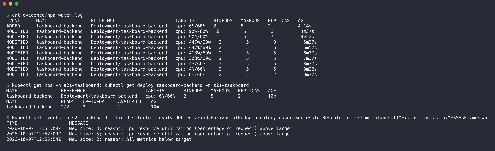

```console
$ cat evidence/hpa-watch.log
EVENT      NAME                REFERENCE                      TARGETS       MINPODS   MAXPODS   REPLICAS   AGE
ADDED      taskboard-backend   Deployment/taskboard-backend   cpu: 6%/60%   2         5         2          4m14s
MODIFIED   taskboard-backend   Deployment/taskboard-backend   cpu: 90%/60%   2         5         2          4m37s
MODIFIED   taskboard-backend   Deployment/taskboard-backend   cpu: 90%/60%   2         5         3          4m52s
MODIFIED   taskboard-backend   Deployment/taskboard-backend   cpu: 447%/60%   2         5         3          5m37s
MODIFIED   taskboard-backend   Deployment/taskboard-backend   cpu: 447%/60%   2         5         5          5m52s
MODIFIED   taskboard-backend   Deployment/taskboard-backend   cpu: 413%/60%   2         5         5          6m37s
MODIFIED   taskboard-backend   Deployment/taskboard-backend   cpu: 303%/60%   2         5         5          7m37s
MODIFIED   taskboard-backend   Deployment/taskboard-backend   cpu: 4%/60%     2         5         5          8m37s
MODIFIED   taskboard-backend   Deployment/taskboard-backend   cpu: 4%/60%     2         5         5          9m22s
MODIFIED   taskboard-backend   Deployment/taskboard-backend   cpu: 6%/60%     2         5         2          9m37s

$ kubectl get hpa -n s21-taskboard; kubectl get deploy taskboard-backend -n s21-taskboard
NAME                REFERENCE                      TARGETS       MINPODS   MAXPODS   REPLICAS   AGE
taskboard-backend   Deployment/taskboard-backend   cpu: 6%/60%   2         5         2          10m
NAME                READY   UP-TO-DATE   AVAILABLE   AGE
taskboard-backend   2/2     2            2           10m

$ kubectl get events -n s21-taskboard --field-selector involvedObject.kind=HorizontalPodAutoscaler,reason=SuccessfulRescale -o custom-columns=TIME:.lastTimestamp,MESSAGE:.message
TIME                   MESSAGE
2026-10-07T12:51:09Z   New size: 3; reason: cpu resource utilization (percentage of request) above target
2026-10-07T12:52:09Z   New size: 5; reason: cpu resource utilization (percentage of request) above target
2026-10-07T12:55:54Z   New size: 2; reason: All metrics below target
```

The first run used more CPU than necessary. I changed the default of the script to 2 workers and used 2 workers for the second run (section 11).

### Step 6: Rolling update to version 1.1.0

I changed the image tags in `04-backend.yaml` and `05-frontend.yaml` to `1.1.0` and applied them. The Deployment strategy is `maxSurge: 1, maxUnavailable: 0`: Kubernetes starts one new Pod before it stops an old Pod.

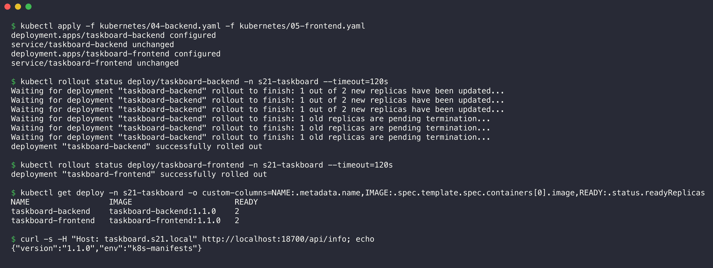

```console
$ kubectl apply -f kubernetes/04-backend.yaml -f kubernetes/05-frontend.yaml
deployment.apps/taskboard-backend configured
service/taskboard-backend unchanged
deployment.apps/taskboard-frontend configured
service/taskboard-frontend unchanged

$ kubectl rollout status deploy/taskboard-backend -n s21-taskboard --timeout=120s
Waiting for deployment "taskboard-backend" rollout to finish: 1 out of 2 new replicas have been updated...
Waiting for deployment "taskboard-backend" rollout to finish: 1 out of 2 new replicas have been updated...
Waiting for deployment "taskboard-backend" rollout to finish: 1 out of 2 new replicas have been updated...
Waiting for deployment "taskboard-backend" rollout to finish: 1 old replicas are pending termination...
Waiting for deployment "taskboard-backend" rollout to finish: 1 old replicas are pending termination...
Waiting for deployment "taskboard-backend" rollout to finish: 1 old replicas are pending termination...
deployment "taskboard-backend" successfully rolled out

$ kubectl rollout status deploy/taskboard-frontend -n s21-taskboard --timeout=120s
deployment "taskboard-frontend" successfully rolled out

$ kubectl get deploy -n s21-taskboard -o custom-columns=NAME:.metadata.name,IMAGE:.spec.template.spec.containers[0].image,READY:.status.readyReplicas
NAME                 IMAGE                      READY
taskboard-backend    taskboard-backend:1.1.0    2
taskboard-frontend   taskboard-frontend:1.1.0   2

$ curl -s -H "Host: taskboard.s21.local" http://localhost:18700/api/info; echo
{"version":"1.1.0","env":"k8s-manifests"}
```

### Step 7: Final check of the hardened manifests

After the Helm and DevSecOps work, I added two changes to the manifests: a `preStop` sleep for the backend and the frontend (see [section 7](#7-helm-deployment)), and a read-only root file system for PostgreSQL (see [section 10](#10-devsecops-implementation)). I applied the final `kubernetes/` folder again in a new namespace to make sure that it works:

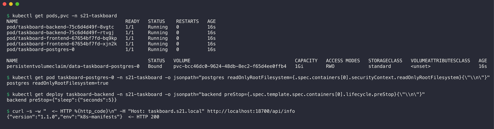

```console
$ kubectl get pods,pvc -n s21-taskboard
NAME                                      READY   STATUS    RESTARTS   AGE
pod/taskboard-backend-75c6d4d49f-8vgtc    1/1     Running   0          16s
pod/taskboard-backend-75c6d4d49f-rtvgj    1/1     Running   0          16s
pod/taskboard-frontend-67654bf7fd-bq9kp   1/1     Running   0          16s
pod/taskboard-frontend-67654bf7fd-xjn2k   1/1     Running   0          16s
pod/taskboard-postgres-0                  1/1     Running   0          16s

NAME                                              STATUS   VOLUME                                     CAPACITY   ACCESS MODES   STORAGECLASS   VOLUMEATTRIBUTESCLASS   AGE
persistentvolumeclaim/data-taskboard-postgres-0   Bound    pvc-bcc46dc0-9624-48db-8ec2-f65d4ee0ffb4   1Gi        RWO            standard       <unset>                 16s

$ kubectl get pod taskboard-postgres-0 -n s21-taskboard -o jsonpath="postgres readOnlyRootFilesystem={.spec.containers[0].securityContext.readOnlyRootFilesystem}{\"\\n\"}"
postgres readOnlyRootFilesystem=true

$ kubectl get deploy taskboard-backend -n s21-taskboard -o jsonpath="backend preStop={.spec.template.spec.containers[0].lifecycle.preStop}{\"\\n\"}"
backend preStop={"sleep":{"seconds":5}}

$ curl -s -w "  <- HTTP %{http_code}\n" -H "Host: taskboard.s21.local" http://localhost:18700/api/info
{"version":"1.1.0","env":"k8s-manifests"}  <- HTTP 200
```

---

## 7. Helm deployment

Chart: [`helm/taskboard/`](helm/taskboard/). It creates the same objects as the plain manifests, plus a ServiceMonitor and a chart test.

| File | Content |
|---|---|
| [`Chart.yaml`](helm/taskboard/Chart.yaml) | chart version 1.1.0, appVersion 1.1.0 |
| [`values.yaml`](helm/taskboard/values.yaml) | defaults: GHCR images, 2 replicas, HPA on, Ingress on, ServiceMonitor on |
| [`values-dev.yaml`](helm/taskboard/values-dev.yaml) | local images, 1 replica, no HPA, `APP_ENV=dev`, `LOG_LEVEL=debug` |
| [`values-prod.yaml`](helm/taskboard/values-prod.yaml) | GHCR images (tag = commit SHA), 2 replicas, HPA 2 to 6, bigger requests, 5Gi volume |
| [`templates/_helpers.tpl`](helm/taskboard/templates/_helpers.tpl) | names, common labels, selector labels, security context |
| [`templates/backend.yaml`](helm/taskboard/templates/backend.yaml) | Deployment + Service. Checksum annotations restart the Pods when the ConfigMap or the Secret changes. |
| [`templates/postgres.yaml`](helm/taskboard/templates/postgres.yaml) | StatefulSet + headless Service |
| [`templates/tests/test-connection.yaml`](helm/taskboard/templates/tests/test-connection.yaml) | `helm test` Pod: calls `/ready`, `/api/tasks/stats` and the frontend |

The chart supports `database.existingSecret`. With it, the chart does not create the Secret, and a secret manager can own it.

### Step 1: Install (revision 1, version 1.0.0)

1. Install the chart with `values-dev.yaml` and the image tag `1.0.0`.
2. Wait until all Pods are ready (`--wait`).

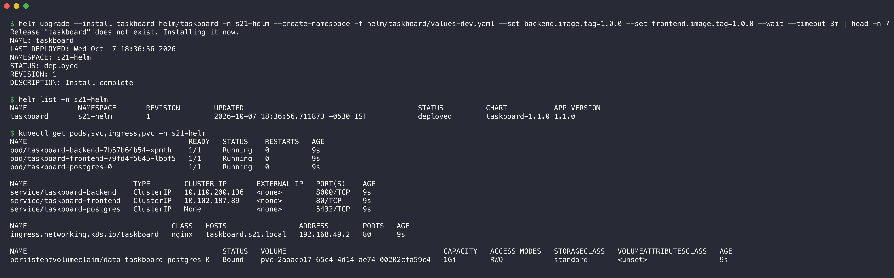

```console
$ helm upgrade --install taskboard helm/taskboard -n s21-helm --create-namespace -f helm/taskboard/values-dev.yaml --set backend.image.tag=1.0.0 --set frontend.image.tag=1.0.0 --wait --timeout 3m | head -n 7
Release "taskboard" does not exist. Installing it now.
NAME: taskboard
LAST DEPLOYED: Wed Oct  7 18:36:56 2026
NAMESPACE: s21-helm
STATUS: deployed
REVISION: 1
DESCRIPTION: Install complete

$ helm list -n s21-helm
NAME     	NAMESPACE	REVISION	UPDATED                             	STATUS  	CHART          	APP VERSION
taskboard	s21-helm 	1       	2026-10-07 18:36:56.711873 +0530 IST	deployed	taskboard-1.1.0	1.1.0      

$ kubectl get pods,svc,ingress,pvc -n s21-helm
NAME                                      READY   STATUS    RESTARTS   AGE
pod/taskboard-backend-7b57b64b54-xpmth    1/1     Running   0          9s
pod/taskboard-frontend-79fd4f5645-lbbf5   1/1     Running   0          9s
pod/taskboard-postgres-0                  1/1     Running   0          9s

NAME                         TYPE        CLUSTER-IP       EXTERNAL-IP   PORT(S)    AGE
service/taskboard-backend    ClusterIP   10.110.200.136   <none>        8000/TCP   9s
service/taskboard-frontend   ClusterIP   10.102.187.89    <none>        80/TCP     9s
service/taskboard-postgres   ClusterIP   None             <none>        5432/TCP   9s

NAME                                  CLASS   HOSTS                 ADDRESS        PORTS   AGE
ingress.networking.k8s.io/taskboard   nginx   taskboard.s21.local   192.168.49.2   80      9s

NAME                                              STATUS   VOLUME                                     CAPACITY   ACCESS MODES   STORAGECLASS   VOLUMEATTRIBUTESCLASS   AGE
persistentvolumeclaim/data-taskboard-postgres-0   Bound    pvc-2aaacb17-65c4-4d14-ae74-00202cfa59c4   1Gi        RWO            standard       <unset>                 9s
```

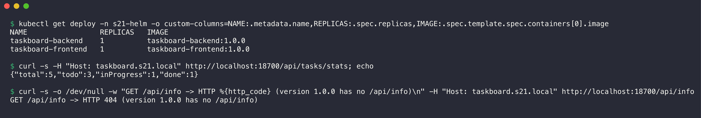

```console
$ kubectl get deploy -n s21-helm -o custom-columns=NAME:.metadata.name,REPLICAS:.spec.replicas,IMAGE:.spec.template.spec.containers[0].image
NAME                 REPLICAS   IMAGE
taskboard-backend    1          taskboard-backend:1.0.0
taskboard-frontend   1          taskboard-frontend:1.0.0

$ curl -s -H "Host: taskboard.s21.local" http://localhost:18700/api/tasks/stats; echo
{"total":5,"todo":3,"inProgress":1,"done":1}

$ curl -s -o /dev/null -w "GET /api/info -> HTTP %{http_code} (version 1.0.0 has no /api/info)\n" -H "Host: taskboard.s21.local" http://localhost:18700/api/info
GET /api/info -> HTTP 404 (version 1.0.0 has no /api/info)
```

### Step 2: Upgrade (revision 2, version 1.1.0 and 2 backend replicas)

During the upgrade, [`scripts/probe.sh`](scripts/probe.sh) sent one request every 0.2 seconds through the Ingress and recorded the HTTP status codes.

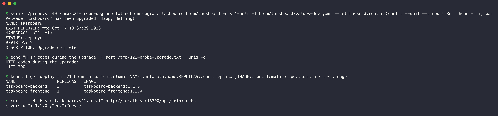

```console
$ scripts/probe.sh 40 /tmp/s21-probe-upgrade.txt & helm upgrade taskboard helm/taskboard -n s21-helm -f helm/taskboard/values-dev.yaml --set backend.replicaCount=2 --wait --timeout 3m | head -n 7; wait
Release "taskboard" has been upgraded. Happy Helming!
NAME: taskboard
LAST DEPLOYED: Wed Oct  7 18:37:29 2026
NAMESPACE: s21-helm
STATUS: deployed
REVISION: 2
DESCRIPTION: Upgrade complete

$ echo "HTTP codes during the upgrade:"; sort /tmp/s21-probe-upgrade.txt | uniq -c
HTTP codes during the upgrade:
 172 200

$ kubectl get deploy -n s21-helm -o custom-columns=NAME:.metadata.name,REPLICAS:.spec.replicas,IMAGE:.spec.template.spec.containers[0].image
NAME                 REPLICAS   IMAGE
taskboard-backend    2          taskboard-backend:1.1.0
taskboard-frontend   1          taskboard-frontend:1.1.0

$ curl -s -H "Host: taskboard.s21.local" http://localhost:18700/api/info; echo
{"version":"1.1.0","env":"dev"}
```

All 172 requests during the upgrade returned HTTP 200 (zero downtime). The application after the upgrade:

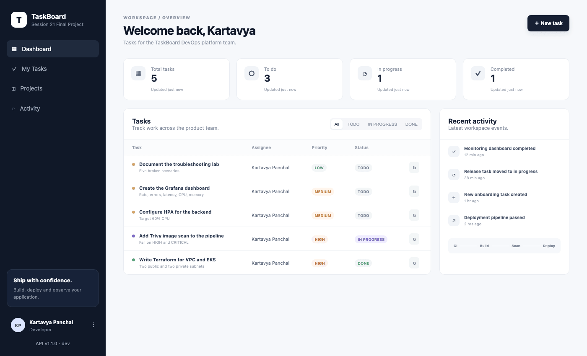

### Step 3: Rollback (revision 3 = revision 1)

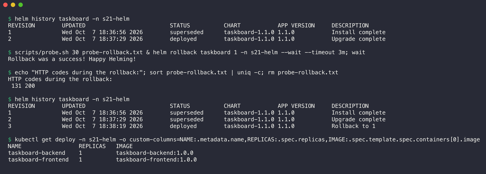

```console
$ helm history taskboard -n s21-helm
REVISION	UPDATED                 	STATUS    	CHART          	APP VERSION	DESCRIPTION     
1       	Wed Oct  7 18:36:56 2026	superseded	taskboard-1.1.0	1.1.0      	Install complete
2       	Wed Oct  7 18:37:29 2026	deployed  	taskboard-1.1.0	1.1.0      	Upgrade complete

$ scripts/probe.sh 30 probe-rollback.txt & helm rollback taskboard 1 -n s21-helm --wait --timeout 3m; wait
Rollback was a success! Happy Helming!

$ echo "HTTP codes during the rollback:"; sort probe-rollback.txt | uniq -c; rm probe-rollback.txt
HTTP codes during the rollback:
 131 200

$ helm history taskboard -n s21-helm
REVISION	UPDATED                 	STATUS    	CHART          	APP VERSION	DESCRIPTION     
1       	Wed Oct  7 18:36:56 2026	superseded	taskboard-1.1.0	1.1.0      	Install complete
2       	Wed Oct  7 18:37:29 2026	superseded	taskboard-1.1.0	1.1.0      	Upgrade complete
3       	Wed Oct  7 18:38:19 2026	deployed  	taskboard-1.1.0	1.1.0      	Rollback to 1   

$ kubectl get deploy -n s21-helm -o custom-columns=NAME:.metadata.name,REPLICAS:.spec.replicas,IMAGE:.spec.template.spec.containers[0].image
NAME                 REPLICAS   IMAGE
taskboard-backend    1          taskboard-backend:1.0.0
taskboard-frontend   1          taskboard-frontend:1.0.0
```

Helm made a new revision 3 with the values of revision 1: image `1.0.0` and 1 replica. The rollback also had zero failed requests.

**A real problem that I found here.** My first rollback (before the `preStop` hook) gave HTTP 502 just after `helm rollback` returned. The ingress-nginx log showed 3 tries to one old Pod IP, all with 502:

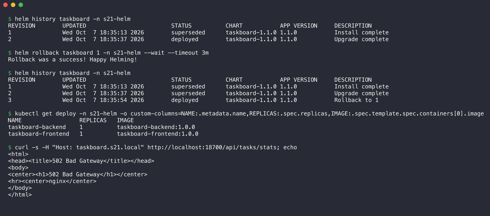

```text
"GET /api/tasks/stats HTTP/1.1" 502 150 ... [s21-helm-taskboard-backend-http] [] 10.244.0.98:8000, 10.244.0.98:8000, 10.244.0.98:8000 0, 0, 0 0.001, 0.000, 0.000 502, 502, 502
```

Root cause: Kubernetes sent SIGTERM to the old Pod at the same time as it removed the Pod from the endpoints. ingress-nginx still had the old Pod in its upstream list for a short time. Fix: a `preStop` hook with `sleep: {seconds: 5}` on the backend and the frontend. The Pod continues to serve for 5 seconds while ingress-nginx updates its list. I uninstalled the release, installed it again and repeated Steps 1 to 3. The probe results above (172 × 200 and 131 × 200) come from the second try with the fix.

### Step 4: Upgrade again (revision 4) and run the chart test

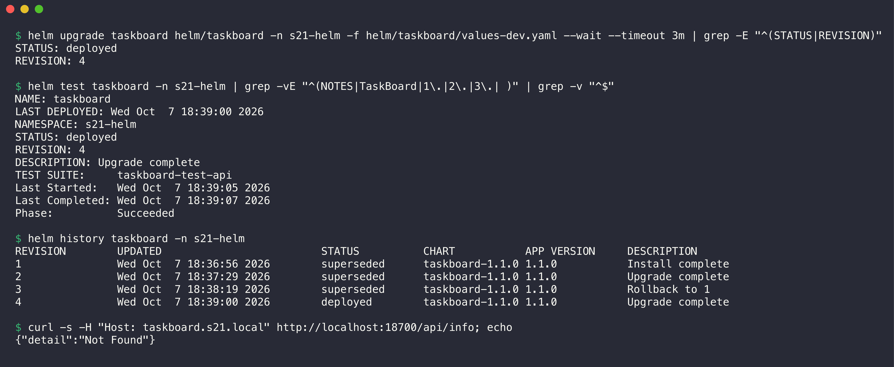

```console
$ helm upgrade taskboard helm/taskboard -n s21-helm -f helm/taskboard/values-dev.yaml --wait --timeout 3m | grep -E "^(STATUS|REVISION)"
STATUS: deployed
REVISION: 4

$ helm test taskboard -n s21-helm | grep -vE "^(NOTES|TaskBoard|1\.|2\.|3\.| )" | grep -v "^$"
NAME: taskboard
LAST DEPLOYED: Wed Oct  7 18:39:00 2026
NAMESPACE: s21-helm
STATUS: deployed
REVISION: 4
DESCRIPTION: Upgrade complete
TEST SUITE:     taskboard-test-api
Last Started:   Wed Oct  7 18:39:05 2026
Last Completed: Wed Oct  7 18:39:07 2026
Phase:          Succeeded

$ helm history taskboard -n s21-helm
REVISION	UPDATED                 	STATUS    	CHART          	APP VERSION	DESCRIPTION     
1       	Wed Oct  7 18:36:56 2026	superseded	taskboard-1.1.0	1.1.0      	Install complete
2       	Wed Oct  7 18:37:29 2026	superseded	taskboard-1.1.0	1.1.0      	Upgrade complete
3       	Wed Oct  7 18:38:19 2026	superseded	taskboard-1.1.0	1.1.0      	Rollback to 1   
4       	Wed Oct  7 18:39:00 2026	deployed  	taskboard-1.1.0	1.1.0      	Upgrade complete

$ curl -s -H "Host: taskboard.s21.local" http://localhost:18700/api/info; echo
{"detail":"Not Found"}
```

The chart test passed. The last `curl` ran 3 seconds after `helm upgrade --wait` returned. It reached an old 1.0.0 Pod in its 5-second `preStop` wait, and version 1.0.0 has no `/api/info`. This is the expected behavior of the `preStop` hook. A new request some seconds later returned `{"version":"1.1.0","env":"dev"}`.

### Step 5: Production values

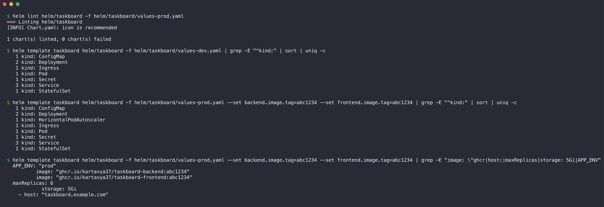

```console
$ helm lint helm/taskboard -f helm/taskboard/values-prod.yaml
==> Linting helm/taskboard
[INFO] Chart.yaml: icon is recommended

1 chart(s) linted, 0 chart(s) failed

$ helm template taskboard helm/taskboard -f helm/taskboard/values-dev.yaml | grep -E "^kind:" | sort | uniq -c
   1 kind: ConfigMap
   2 kind: Deployment
   1 kind: Ingress
   1 kind: Pod
   1 kind: Secret
   3 kind: Service
   1 kind: StatefulSet

$ helm template taskboard helm/taskboard -f helm/taskboard/values-prod.yaml --set backend.image.tag=abc1234 --set frontend.image.tag=abc1234 | grep -E "^kind:" | sort | uniq -c
   1 kind: ConfigMap
   2 kind: Deployment
   1 kind: HorizontalPodAutoscaler
   1 kind: Ingress
   1 kind: Pod
   1 kind: Secret
   3 kind: Service
   1 kind: StatefulSet

$ helm template taskboard helm/taskboard -f helm/taskboard/values-prod.yaml --set backend.image.tag=abc1234 --set frontend.image.tag=abc1234 | grep -E "image: \"ghcr|host:|maxReplicas|storage: 5Gi|APP_ENV"
  APP_ENV: "prod"
          image: "ghcr.io/kartavya37/taskboard-backend:abc1234"
          image: "ghcr.io/kartavya37/taskboard-frontend:abc1234"
  maxReplicas: 6
            storage: 5Gi
    - host: "taskboard.example.com"
```

The prod values add the HPA, use the GHCR images with the commit SHA as tag, and use a 5Gi volume. `helm template` does not render the ServiceMonitor, because the template checks `.Capabilities.APIVersions` for `monitoring.coreos.com/v1`. In the cluster, the API exists and Helm creates the ServiceMonitor. The `Pod` is the `helm test` hook.

---

## 8. Terraform infrastructure

**CAUTION:** I have no AWS account. I ran Terraform against the **Moto AWS emulator** (`motoserver/moto` in Docker, `localhost:4566`). Moto keeps the resources in memory. No VPC, EKS cluster, NAT gateway or EC2 node starts for real, and the IDs are emulator IDs. The account ID `123456789012` is the Moto default.

**WARNING:** My Mac has work AWS credentials in `~/.aws`. To make sure that Terraform and the AWS CLI did not use them, I set dummy values before each command: `AWS_ACCESS_KEY_ID=test`, `AWS_SECRET_ACCESS_KEY=test`, `AWS_PROFILE=` (empty), `AWS_SHARED_CREDENTIALS_FILE=/dev/null`, `AWS_CONFIG_FILE=/dev/null`. The provider block also has the dummy keys and all endpoints point to `http://localhost:4566`.

### What Terraform creates

| File | Resources |
|---|---|
| [`providers.tf`](terraform/providers.tf) | AWS provider. The `# EMULATOR START` / `# EMULATOR END` block has the Moto endpoints, test keys and `skip_*` flags. Remove this block for real AWS. |
| [`network.tf`](terraform/network.tf) | VPC `10.21.0.0/16`, 2 public subnets and 2 private subnets in 2 availability zones, Internet Gateway, 1 NAT gateway with an Elastic IP, 2 route tables + associations. EKS subnet tags (`kubernetes.io/role/elb`). |
| [`security.tf`](terraform/security.tf) | security groups for the EKS control plane and the nodes (443 from the admin CIDR and the nodes, 10250 from the control plane, node-to-node traffic) |
| [`iam.tf`](terraform/iam.tf) | IAM roles for the EKS cluster and the node group with the AWS managed policies |
| [`kms.tf`](terraform/kms.tf) | customer managed KMS key with rotation, and an alias |
| [`eks.tf`](terraform/eks.tf) | EKS cluster 1.33 (private endpoint, Secrets encrypted with KMS, all control plane logs) and a managed node group in the private subnets (t3.medium, min 2, desired 2, max 4) |
| [`ecr.tf`](terraform/ecr.tf) | 2 ECR repositories (immutable tags, scan on push, KMS) + lifecycle policy (keep 20 images) |
| [`storage.tf`](terraform/storage.tf) | S3 bucket for PostgreSQL backups: versioning, KMS encryption, public access block, expiry after 30 days |
| [`variables.tf`](terraform/variables.tf), [`locals.tf`](terraform/locals.tf), [`outputs.tf`](terraform/outputs.tf) | inputs with a validation, names and tags, outputs |
| [`terraform.tfvars.example`](terraform/terraform.tfvars.example) | example values, no credentials |

The first version of the code failed the IaC scan (section 10) with 4 CRITICAL and 4 HIGH findings. I fixed them: a private EKS endpoint, KMS encryption for EKS Secrets, S3 and ECR, all control plane log types, and no automatic public IP addresses in the public subnets. I accepted one CRITICAL finding (all outbound traffic from the security groups) with a reason in [`security/.trivyignore`](security/.trivyignore).

### Step 1: Start Moto and initialize

```bash
docker run -d --name moto-s21 -p 4566:5000 -e MOTO_IAM_LOAD_MANAGED_POLICIES=true motoserver/moto
```

Moto does not load the AWS managed IAM policies by default. My first `terraform apply` failed with `NoSuchEntity: Policy arn:aws:iam::aws:policy/AmazonEKSClusterPolicy does not exist or is not attachable`. The variable `MOTO_IAM_LOAD_MANAGED_POLICIES=true` tells Moto to load them. I destroyed the partial resources and started again with a new Moto container.

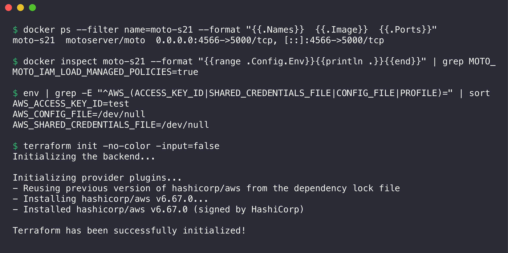

```console
$ docker ps --filter name=moto-s21 --format "{{.Names}}  {{.Image}}  {{.Ports}}"
moto-s21  motoserver/moto  0.0.0.0:4566->5000/tcp, [::]:4566->5000/tcp

$ docker inspect moto-s21 --format "{{range .Config.Env}}{{println .}}{{end}}" | grep MOTO_
MOTO_IAM_LOAD_MANAGED_POLICIES=true

$ env | grep -E "^AWS_(ACCESS_KEY_ID|SHARED_CREDENTIALS_FILE|CONFIG_FILE|PROFILE)=" | sort
AWS_ACCESS_KEY_ID=test
AWS_CONFIG_FILE=/dev/null
AWS_SHARED_CREDENTIALS_FILE=/dev/null

$ terraform init -no-color -input=false
Initializing the backend...

Initializing provider plugins...
- Reusing previous version of hashicorp/aws from the dependency lock file
- Installing hashicorp/aws v6.67.0...
- Installed hashicorp/aws v6.67.0 (signed by HashiCorp)

Terraform has been successfully initialized!
```

`AWS_PROFILE` does not show in the list, because I removed it from the environment with `unset`.

### Step 2: Format and validate

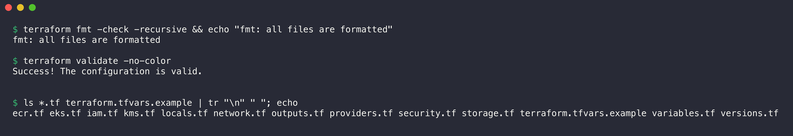

```console
$ terraform fmt -check -recursive && echo "fmt: all files are formatted"
fmt: all files are formatted

$ terraform validate -no-color
Success! The configuration is valid.


$ ls *.tf terraform.tfvars.example | tr "\n" " "; echo
ecr.tf eks.tf iam.tf kms.tf locals.tf network.tf outputs.tf providers.tf security.tf storage.tf terraform.tfvars.example variables.tf versions.tf 
```

### Step 3: Plan

The full plan is in [`evidence/terraform-plan.txt`](evidence/terraform-plan.txt).

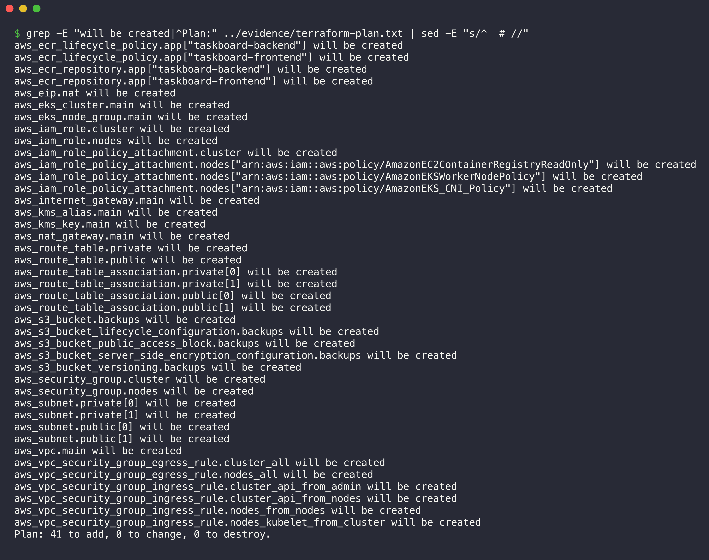

```console
$ grep -E "will be created|^Plan:" ../evidence/terraform-plan.txt | sed -E "s/^  # //"
aws_ecr_lifecycle_policy.app["taskboard-backend"] will be created
aws_ecr_lifecycle_policy.app["taskboard-frontend"] will be created
aws_ecr_repository.app["taskboard-backend"] will be created
aws_ecr_repository.app["taskboard-frontend"] will be created
aws_eip.nat will be created
aws_eks_cluster.main will be created
aws_eks_node_group.main will be created
aws_iam_role.cluster will be created
aws_iam_role.nodes will be created
aws_iam_role_policy_attachment.cluster will be created
aws_iam_role_policy_attachment.nodes["arn:aws:iam::aws:policy/AmazonEC2ContainerRegistryReadOnly"] will be created
aws_iam_role_policy_attachment.nodes["arn:aws:iam::aws:policy/AmazonEKSWorkerNodePolicy"] will be created
aws_iam_role_policy_attachment.nodes["arn:aws:iam::aws:policy/AmazonEKS_CNI_Policy"] will be created
aws_internet_gateway.main will be created
aws_kms_alias.main will be created
aws_kms_key.main will be created
aws_nat_gateway.main will be created
aws_route_table.private will be created
aws_route_table.public will be created
aws_route_table_association.private[0] will be created
aws_route_table_association.private[1] will be created
aws_route_table_association.public[0] will be created
aws_route_table_association.public[1] will be created
aws_s3_bucket.backups will be created
aws_s3_bucket_lifecycle_configuration.backups will be created
aws_s3_bucket_public_access_block.backups will be created
aws_s3_bucket_server_side_encryption_configuration.backups will be created
aws_s3_bucket_versioning.backups will be created
aws_security_group.cluster will be created
aws_security_group.nodes will be created
aws_subnet.private[0] will be created
aws_subnet.private[1] will be created
aws_subnet.public[0] will be created
aws_subnet.public[1] will be created
aws_vpc.main will be created
aws_vpc_security_group_egress_rule.cluster_all will be created
aws_vpc_security_group_egress_rule.nodes_all will be created
aws_vpc_security_group_ingress_rule.cluster_api_from_admin will be created
aws_vpc_security_group_ingress_rule.cluster_api_from_nodes will be created
aws_vpc_security_group_ingress_rule.nodes_from_nodes will be created
aws_vpc_security_group_ingress_rule.nodes_kubelet_from_cluster will be created
Plan: 41 to add, 0 to change, 0 to destroy.
```

Terraform plans 41 resources and no errors. The plan has no change or destroy, because the emulator was empty.

### Step 4: Apply

The full log is in [`evidence/terraform-apply.txt`](evidence/terraform-apply.txt).

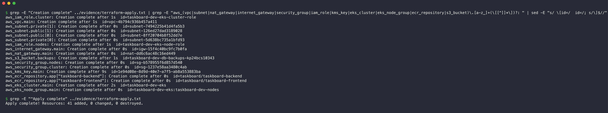

```console
$ grep -E "Creation complete" ../evidence/terraform-apply.txt | grep -E "aws_(vpc|subnet|nat_gateway|internet_gateway|security_group|iam_role|kms_key|eks_cluster|eks_node_group|ecr_repository|s3_bucket)\.[a-z_]+(\[[^]]*\])?: " | sed -E "s/ \[id=/  id=/; s/\]$//"
aws_iam_role.cluster: Creation complete after 1s  id=taskboard-dev-eks-cluster-role
aws_vpc.main: Creation complete after 1s  id=vpc-4b794c936b457a411
aws_subnet.private[1]: Creation complete after 0s  id=subnet-7494225b41d4fa5b3
aws_subnet.public[1]: Creation complete after 0s  id=subnet-126ed27dad3189028
aws_subnet.public[0]: Creation complete after 0s  id=subnet-8ff20704b8f52dd7e
aws_subnet.private[0]: Creation complete after 0s  id=subnet-5d638bc735a1bfd93
aws_iam_role.nodes: Creation complete after 1s  id=taskboard-dev-eks-node-role
aws_internet_gateway.main: Creation complete after 0s  id=igw-15f4c40bc9fc7b0fa
aws_nat_gateway.main: Creation complete after 0s  id=nat-dd6c6ac48c16ed449
aws_s3_bucket.backups: Creation complete after 1s  id=taskboard-dev-db-backups-kp24bcs10343
aws_security_group.nodes: Creation complete after 0s  id=sg-b578955f6d857d540
aws_security_group.cluster: Creation complete after 0s  id=sg-1237e58aa3480c4ab
aws_kms_key.main: Creation complete after 9s  id=1e94d08e-8d9d-40e7-a7f5-ab8a553883ba
aws_ecr_repository.app["taskboard-backend"]: Creation complete after 0s  id=taskboard/taskboard-backend
aws_ecr_repository.app["taskboard-frontend"]: Creation complete after 0s  id=taskboard/taskboard-frontend
aws_eks_cluster.main: Creation complete after 2s  id=taskboard-dev-eks
aws_eks_node_group.main: Creation complete after 0s  id=taskboard-dev-eks:taskboard-dev-nodes

$ grep -E "^Apply complete" ../evidence/terraform-apply.txt
Apply complete! Resources: 41 added, 0 changed, 0 destroyed.
```

The EKS cluster was "complete after 2s". On real AWS, an EKS cluster takes about 10 minutes. This is one more sign that the output comes from an emulator.

### Step 5: Outputs and a check with the AWS CLI (emulator)

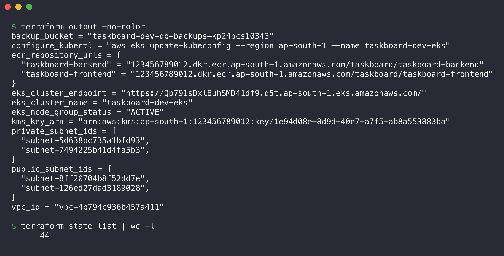

```console
$ terraform output -no-color
backup_bucket = "taskboard-dev-db-backups-kp24bcs10343"
configure_kubectl = "aws eks update-kubeconfig --region ap-south-1 --name taskboard-dev-eks"
ecr_repository_urls = {
  "taskboard-backend" = "123456789012.dkr.ecr.ap-south-1.amazonaws.com/taskboard/taskboard-backend"
  "taskboard-frontend" = "123456789012.dkr.ecr.ap-south-1.amazonaws.com/taskboard/taskboard-frontend"
}
eks_cluster_endpoint = "https://Qp791sDxl6uhSMD41df9.q5t.ap-south-1.eks.amazonaws.com/"
eks_cluster_name = "taskboard-dev-eks"
eks_node_group_status = "ACTIVE"
kms_key_arn = "arn:aws:kms:ap-south-1:123456789012:key/1e94d08e-8d9d-40e7-a7f5-ab8a553883ba"
private_subnet_ids = [
  "subnet-5d638bc735a1bfd93",
  "subnet-7494225b41d4fa5b3",
]
public_subnet_ids = [
  "subnet-8ff20704b8f52dd7e",
  "subnet-126ed27dad3189028",
]
vpc_id = "vpc-4b794c936b457a411"

$ terraform state list | wc -l
      44
```

The state has 44 entries: 41 resources and 3 data sources. I used the AWS CLI with `--endpoint-url http://localhost:4566` to read the resources back from the emulator:


```console
$ aws --endpoint-url http://localhost:4566 --region ap-south-1 ec2 describe-subnets --filters Name=vpc-id,Values=$(terraform output -raw vpc_id) --query "Subnets[].[Tags[?Key==\`Name\`]|[0].Value,CidrBlock,AvailabilityZone,MapPublicIpOnLaunch]" --output text | sort
taskboard-dev-private-ap-south-1a	10.21.10.0/24	ap-south-1a	False
taskboard-dev-private-ap-south-1b	10.21.11.0/24	ap-south-1b	False
taskboard-dev-public-ap-south-1a	10.21.0.0/24	ap-south-1a	False
taskboard-dev-public-ap-south-1b	10.21.1.0/24	ap-south-1b	False

$ aws --endpoint-url http://localhost:4566 --region ap-south-1 eks describe-cluster --name taskboard-dev-eks --query "cluster.{name:name,version:version,status:status,publicEndpoint:resourcesVpcConfig.endpointPublicAccess,secretsEncryption:encryptionConfig[0].resources[0]}" --output table
--------------------------------------------
|              DescribeCluster             |
+--------------------+---------------------+
|  name              |  taskboard-dev-eks  |
|  publicEndpoint    |  False              |
|  secretsEncryption |  secrets            |
|  status            |  ACTIVE             |
|  version           |  1.33               |
+--------------------+---------------------+

$ aws --endpoint-url http://localhost:4566 --region ap-south-1 eks describe-nodegroup --cluster-name taskboard-dev-eks --nodegroup-name taskboard-dev-nodes --query "nodegroup.{status:status,type:instanceTypes[0],min:scalingConfig.minSize,desired:scalingConfig.desiredSize,max:scalingConfig.maxSize}" --output table
--------------------------------------------------
|                DescribeNodegroup               |
+---------+------+------+---------+--------------+
| desired | max  | min  | status  |    type      |
+---------+------+------+---------+--------------+
|  2      |  4   |  2   |  ACTIVE |  t3.medium   |
+---------+------+------+---------+--------------+

$ aws --endpoint-url http://localhost:4566 --region ap-south-1 ecr describe-repositories --query "repositories[].[repositoryName,imageTagMutability,encryptionConfiguration.encryptionType]" --output text
taskboard/taskboard-frontend	IMMUTABLE	KMS
taskboard/taskboard-backend	IMMUTABLE	KMS

$ aws --endpoint-url http://localhost:4566 s3api get-bucket-encryption --bucket taskboard-dev-db-backups-kp24bcs10343 --query "ServerSideEncryptionConfiguration.Rules[0].ApplyServerSideEncryptionByDefault.SSEAlgorithm" --output text
aws:kms
```

A second `terraform plan` on Moto shows changes, although I changed nothing ([`evidence/terraform-replan-on-moto.txt`](evidence/terraform-replan-on-moto.txt)). Moto returns some values in a different format than real AWS: for example, a node group version `1.19`, an empty `remote_access` block, and security group references with an account prefix (`123456789012/sg-...`). These differences are emulator limitations, not changes in my code.

### Step 6: Destroy

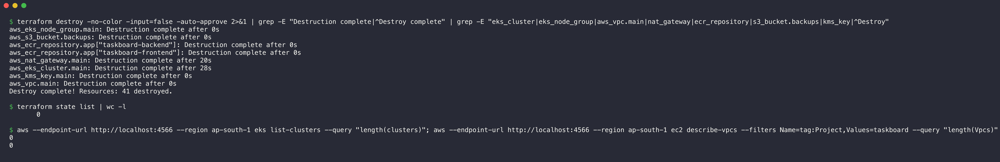

```console
$ terraform destroy -no-color -input=false -auto-approve 2>&1 | grep -E "Destruction complete|^Destroy complete" | grep -E "eks_cluster|eks_node_group|aws_vpc.main|nat_gateway|ecr_repository|s3_bucket.backups|kms_key|^Destroy"
aws_eks_node_group.main: Destruction complete after 0s
aws_s3_bucket.backups: Destruction complete after 0s
aws_ecr_repository.app["taskboard-backend"]: Destruction complete after 0s
aws_ecr_repository.app["taskboard-frontend"]: Destruction complete after 0s
aws_nat_gateway.main: Destruction complete after 20s
aws_eks_cluster.main: Destruction complete after 28s
aws_kms_key.main: Destruction complete after 0s
aws_vpc.main: Destruction complete after 0s
Destroy complete! Resources: 41 destroyed.

$ terraform state list | wc -l
       0

$ aws --endpoint-url http://localhost:4566 --region ap-south-1 eks list-clusters --query "length(clusters)"; aws --endpoint-url http://localhost:4566 --region ap-south-1 ec2 describe-vpcs --filters Name=tag:Project,Values=taskboard --query "length(Vpcs)"
0
0
```

After the destroy, I stopped and removed the Moto container and deleted `.terraform/`, the state files and the plan file. The repository keeps only the `.tf` files, the lock file and `terraform.tfvars.example`.

### How to use real AWS (not done)

1. Remove the block between `# EMULATOR START` and `# EMULATOR END` in `providers.tf`.
2. Configure your own credentials (for example AWS SSO).
3. Copy `terraform.tfvars.example` to `terraform.tfvars` and set `admin_cidr`.
4. Run `terraform plan` and examine the cost: an EKS control plane, a NAT gateway and two t3.medium nodes cost money every hour.
5. Run `terraform destroy` after the evaluation.

---

## 9. CI/CD pipeline

Workflow: [`.github/workflows/s21-final.yml`](.github/workflows/s21-final.yml). GitHub runs only workflows in the `.github/workflows/` folder at the **repository root**, so the same file is at `DevOps-Assignment/.github/workflows/s21-final.yml`. The copy in this folder is identical (the deliverables tree asks for it).

**Triggers.**

- `push` to `main` and `pull_request` to `main`, but only if a file in `Final-DevOps-Project-&-Troubleshooting/**` or the workflow file changes (`paths:` filter). Changes in other assignment folders do not start this pipeline.
- `workflow_dispatch` (manual start in the GitHub UI).
- All `working-directory` values are in quotes, because the folder name has `&`.

**Jobs.**

| # | Job | Needs | What it does |
|---|---|---|---|
| 1 | Build & Test | - | `pip install -r requirements-dev.txt`, `pytest` with coverage (fails under 80%), `npm ci` + `npm run build` |
| 2 | SAST (Bandit) | 1 | Bandit on the backend code → `bandit.json` |
| 3 | SCA | 1 | pip-audit, npm audit, Trivy fs → 3 reports |
| 4 | IaC Scan (Trivy config) | 1 | Kubernetes, Helm, Dockerfiles, Terraform → `trivy-config.json` |
| 5 | Secret Scan (Gitleaks) | 1 | Gitleaks (checksum-verified download) on this folder → `gitleaks.json` |
| 6 | Docker Build | 1 | both images with Buildx, tags `<commit SHA>` and `latest`, exported as tar files (artifact) |
| 7 | Image Scan (Trivy) | 6 | Trivy on both tar files → 2 reports |
| 8 | Security Gate | 2, 3, 4, 5, 7 | `security_gate.py`: block on HIGH/CRITICAL, any secret, or a missing report |
| 9 | Push Images (GHCR) | 8 | only on push to `main`: `docker login` with `GITHUB_TOKEN`, push `ghcr.io/kartavya37/taskboard-backend` and `taskboard-frontend` (SHA + `latest`) |
| 10 | Deploy to Kubernetes (kind + Helm) | 9 | only on push to `main`: `helm lint`, temporary kind cluster, `kind load` of the scanned images, `helm upgrade --install --wait`, `helm test`, smoke test with `curl` |

Jobs 2 to 6 run in parallel after job 1. For a pull request, the pipeline stops after the gate: it does not push and does not deploy. The image tag is the Git commit SHA (`github.sha`), so each image points back to one commit. The deploy job uses a temporary kind cluster, because a GitHub runner cannot reach my local minikube cluster.

### Step 1: Lint the workflow

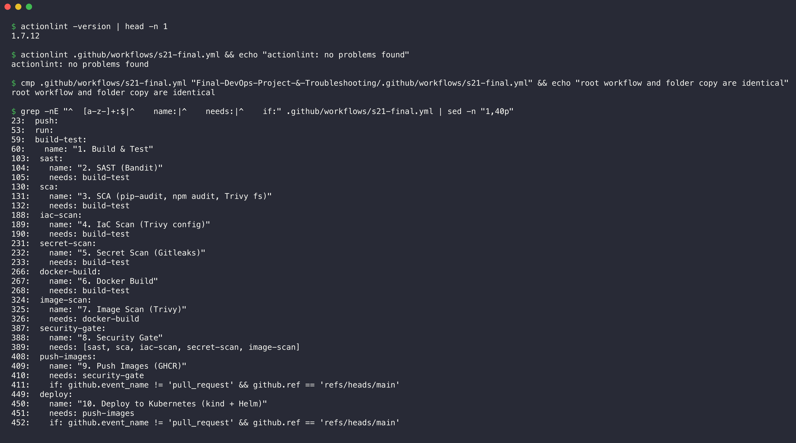

```console
$ actionlint -version | head -n 1
1.7.12

$ actionlint .github/workflows/s21-final.yml && echo "actionlint: no problems found"
actionlint: no problems found

$ cmp .github/workflows/s21-final.yml "Final-DevOps-Project-&-Troubleshooting/.github/workflows/s21-final.yml" && echo "root workflow and folder copy are identical"
root workflow and folder copy are identical

$ grep -nE "^  [a-z-]+:$|^    name:|^    needs:|^    if:" .github/workflows/s21-final.yml | sed -n "1,40p"
23:  push:
53:  run:
59:  build-test:
60:    name: "1. Build & Test"
103:  sast:
104:    name: "2. SAST (Bandit)"
105:    needs: build-test
130:  sca:
131:    name: "3. SCA (pip-audit, npm audit, Trivy fs)"
132:    needs: build-test
188:  iac-scan:
189:    name: "4. IaC Scan (Trivy config)"
190:    needs: build-test
231:  secret-scan:
232:    name: "5. Secret Scan (Gitleaks)"
233:    needs: build-test
266:  docker-build:
267:    name: "6. Docker Build"
268:    needs: build-test
324:  image-scan:
325:    name: "7. Image Scan (Trivy)"
326:    needs: docker-build
387:  security-gate:
388:    name: "8. Security Gate"
389:    needs: [sast, sca, iac-scan, secret-scan, image-scan]
408:  push-images:
409:    name: "9. Push Images (GHCR)"
410:    needs: security-gate
411:    if: github.event_name != 'pull_request' && github.ref == 'refs/heads/main'
449:  deploy:
450:    name: "10. Deploy to Kubernetes (kind + Helm)"
451:    needs: push-images
452:    if: github.event_name != 'pull_request' && github.ref == 'refs/heads/main'
```

### Step 2: Run the pipeline locally with act

I ran the full workflow on my Mac with [act](https://github.com/nektos/act) before the push to GitHub:

```bash
act push -W .github/workflows/s21-final.yml -P ubuntu-latest=catthehacker/ubuntu:act-latest \
  --container-architecture linux/arm64 \
  --artifact-server-addr 0.0.0.0 --artifact-server-port 18791 --artifact-server-path <scratch>/act-art \
  --cache-server-addr 0.0.0.0 --cache-server-port 18792 --pull=false --action-offline-mode
```

Notes about act:

- Steps with `if: ${{ !env.ACT }}` do not run under act: the GHCR login and push (no `GITHUB_TOKEN`), and the kind cluster, the Helm install and the smoke test (no Docker-in-Docker in my setup). act does not print skipped steps. The other steps of jobs 9 and 10 run: the image load, `helm lint` and `helm template`.
- On Docker Desktop for Mac, the job containers cannot reach the act artifact and cache servers on the Mac address. I started two small `alpine/socat` containers on the Docker host network (ports 18791 and 18792) that forward to `host.docker.internal`.
- The artifact actions stay on v4, because the act artifact server supports only the v4 protocol.
- Under act, Buildx uses the `docker` driver (the local engine has the base images). This avoids Docker Hub pull limits.

#### Run 1: push to main, all 10 jobs pass

Full log: [`evidence/act-s21-push.txt`](evidence/act-s21-push.txt).

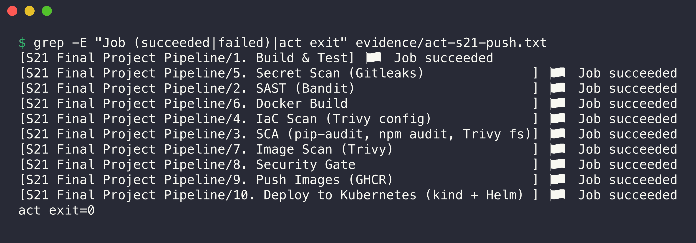

```console
$ grep -E "Job (succeeded|failed)|act exit" evidence/act-s21-push.txt
[S21 Final Project Pipeline/1. Build & Test] 🏁  Job succeeded
[S21 Final Project Pipeline/5. Secret Scan (Gitleaks)              ] 🏁  Job succeeded
[S21 Final Project Pipeline/2. SAST (Bandit)                       ] 🏁  Job succeeded
[S21 Final Project Pipeline/6. Docker Build                        ] 🏁  Job succeeded
[S21 Final Project Pipeline/4. IaC Scan (Trivy config)             ] 🏁  Job succeeded
[S21 Final Project Pipeline/3. SCA (pip-audit, npm audit, Trivy fs)] 🏁  Job succeeded
[S21 Final Project Pipeline/7. Image Scan (Trivy)                  ] 🏁  Job succeeded
[S21 Final Project Pipeline/8. Security Gate                       ] 🏁  Job succeeded
[S21 Final Project Pipeline/9. Push Images (GHCR)                  ] 🏁  Job succeeded
[S21 Final Project Pipeline/10. Deploy to Kubernetes (kind + Helm) ] 🏁  Job succeeded
act exit=0
```

Job 1 (tests and frontend build):

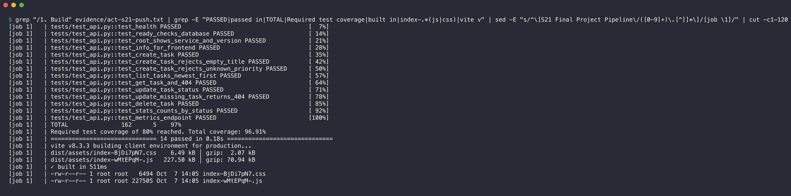

```console
$ grep "/1. Build" evidence/act-s21-push.txt | grep -E "PASSED|passed in|TOTAL|Required test coverage|built in|index-.*(js|css)|vite v" | sed -E "s/^\[S21 Final Project Pipeline\/([0-9]+)\.[^]]*\]/[job \1]/" | cut -c1-120
[job 1]   | tests/test_api.py::test_health PASSED                                    [  7%]
[job 1]   | tests/test_api.py::test_ready_checks_database PASSED                     [ 14%]
[job 1]   | tests/test_api.py::test_root_shows_service_and_version PASSED            [ 21%]
[job 1]   | tests/test_api.py::test_info_for_frontend PASSED                         [ 28%]
[job 1]   | tests/test_api.py::test_create_task PASSED                               [ 35%]
[job 1]   | tests/test_api.py::test_create_task_rejects_empty_title PASSED           [ 42%]
[job 1]   | tests/test_api.py::test_create_task_rejects_unknown_priority PASSED      [ 50%]
[job 1]   | tests/test_api.py::test_list_tasks_newest_first PASSED                   [ 57%]
[job 1]   | tests/test_api.py::test_get_task_and_404 PASSED                          [ 64%]
[job 1]   | tests/test_api.py::test_update_task_status PASSED                        [ 71%]
[job 1]   | tests/test_api.py::test_update_missing_task_returns_404 PASSED           [ 78%]
[job 1]   | tests/test_api.py::test_delete_task PASSED                               [ 85%]
[job 1]   | tests/test_api.py::test_stats_counts_by_status PASSED                    [ 92%]
[job 1]   | tests/test_api.py::test_metrics_endpoint PASSED                          [100%]
[job 1]   | TOTAL               162      5    97%
[job 1]   | Required test coverage of 80% reached. Total coverage: 96.91%
[job 1]   | ============================== 14 passed in 0.18s ==============================
[job 1]   | vite v8.3.3 building client environment for production...
[job 1]   | dist/assets/index-BjDi7pN7.css    6.49 kB │ gzip:  2.07 kB
[job 1]   | dist/assets/index-wMtEPqM-.js   227.50 kB │ gzip: 70.94 kB
[job 1]   | ✓ built in 511ms
[job 1]   | -rw-r--r-- 1 root root   6494 Oct  7 14:05 index-BjDi7pN7.css
[job 1]   | -rw-r--r-- 1 root root 227505 Oct  7 14:05 index-wMtEPqM-.js
```

Jobs 2, 3, 4, 5 and 7 (scans):


```console
$ grep -E "^\[S21 Final Project Pipeline/(2|3|5|7)\." evidence/act-s21-push.txt | grep -E "No issues identified|No known vulnerabilities|found 0 vulnerabilities|no leaks found|== (backend|frontend)|fixed vulnerabilities by severity" | sed -E "s/^\[S21 Final Project Pipeline\/([0-9]+)\.[^]]*\]/[job \1]/" | cut -c1-120
[job 2]   | 	No issues identified.
[job 5]   | 2:05PM INF no leaks found
[job 3]   | No known vulnerabilities found
[job 3]   | No known vulnerabilities found
[job 3]   | found 0 vulnerabilities
[job 7]   | == backend
[job 7]   | /tmp/images/backend.tar | fixed vulnerabilities by severity: none
[job 7]   | == frontend
[job 7]   | /tmp/images/frontend.tar | fixed vulnerabilities by severity: none

$ grep "/4. IaC" evidence/act-s21-push.txt | grep -E "== |terraform │|dockerfile │" | sed -E "s/^\[S21 Final Project Pipeline\/([0-9]+)\.[^]]*\]/[job \1]/" | cut -c1-110
[job 4]   | == kubernetes (HIGH and CRITICAL)
[job 4]   | == helm (HIGH and CRITICAL)
[job 4]   | == docker (HIGH and CRITICAL)
[job 4]   | │ backend.Dockerfile  │ dockerfile │         0         │
[job 4]   | │ frontend.Dockerfile │ dockerfile │         0         │
[job 4]   | == terraform (HIGH and CRITICAL)
[job 4]   | │ .           │ terraform │         0         │
[job 4]   | │ network.tf  │ terraform │         0         │
[job 4]   | │ security.tf │ terraform │         0         │
[job 4]   | │ storage.tf  │ terraform │         0         │
```

pip-audit prints "No known vulnerabilities found" two times (JSON report and table). The Kubernetes and Helm tables also show 0 for each file (in the log file).

Job 8 (security gate):

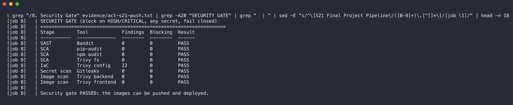

```console
$ grep "/8. Security Gate" evidence/act-s21-push.txt | grep -A20 "SECURITY GATE" | grep "  | " | sed -E "s/^\[S21 Final Project Pipeline\/([0-9]+)\.[^]]*\]/[job \1]/" | head -n 18
[job 8]   | SECURITY GATE (block on HIGH/CRITICAL, any secret, fail closed)
[job 8]   | ==================================================================
[job 8]   | Stage        Tool            Findings  Blocking  Result
[job 8]   | -----------  --------------  --------  --------  ------
[job 8]   | SAST         Bandit          0         0         PASS  
[job 8]   | SCA          pip-audit       0         0         PASS  
[job 8]   | SCA          npm audit       0         0         PASS  
[job 8]   | SCA          Trivy fs        0         0         PASS  
[job 8]   | IaC          Trivy config    22        0         PASS  
[job 8]   | Secret scan  Gitleaks        0         0         PASS  
[job 8]   | Image scan   Trivy backend   0         0         PASS  
[job 8]   | Image scan   Trivy frontend  0         0         PASS  
[job 8]   | 
[job 8]   | Security gate PASSED: the images can be pushed and deployed.
```

Jobs 9 and 10 (the steps that act can run). The images have the commit SHA as tag:

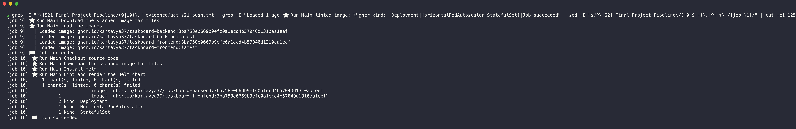

```console
$ grep -E "^\[S21 Final Project Pipeline/(9|10)\." evidence/act-s21-push.txt | grep -E "Loaded image|⭐ Run Main|linted|image: \"ghcr|kind: (Deployment|HorizontalPodAutoscaler|StatefulSet)|Job succeeded" | sed -E "s/^\[S21 Final Project Pipeline\/([0-9]+)\.[^]]*\]/[job \1]/" | cut -c1-125
[job 9] ⭐ Run Main Download the scanned image tar files
[job 9] ⭐ Run Main Load the images
[job 9]   | Loaded image: ghcr.io/kartavya37/taskboard-backend:3ba758e0669b9efc0a1ecd4b57040d1310aa1eef
[job 9]   | Loaded image: ghcr.io/kartavya37/taskboard-backend:latest
[job 9]   | Loaded image: ghcr.io/kartavya37/taskboard-frontend:3ba758e0669b9efc0a1ecd4b57040d1310aa1eef
[job 9]   | Loaded image: ghcr.io/kartavya37/taskboard-frontend:latest
[job 9] 🏁  Job succeeded
[job 10] ⭐ Run Main Checkout source code
[job 10] ⭐ Run Main Download the scanned image tar files
[job 10] ⭐ Run Main Install Helm
[job 10] ⭐ Run Main Lint and render the Helm chart
[job 10]   | 1 chart(s) linted, 0 chart(s) failed
[job 10]   | 1 chart(s) linted, 0 chart(s) failed
[job 10]   |       1           image: "ghcr.io/kartavya37/taskboard-backend:3ba758e0669b9efc0a1ecd4b57040d1310aa1eef"
[job 10]   |       1           image: "ghcr.io/kartavya37/taskboard-frontend:3ba758e0669b9efc0a1ecd4b57040d1310aa1eef"
[job 10]   |       2 kind: Deployment
[job 10]   |       1 kind: HorizontalPodAutoscaler
[job 10]   |       1 kind: StatefulSet
[job 10] 🏁  Job succeeded
```

#### Run 2: the gate stops a vulnerable image

I copied this folder and the workflow into a scratch Git repository and changed only one thing: the frontend Dockerfile used the old `nginx:1.29-alpine` base without `apk upgrade`. Full log: [`evidence/act-s21-gate-fail.txt`](evidence/act-s21-gate-fail.txt). In this log, I replaced the long path of my scratch folder with `<scratch>`. I changed nothing else.

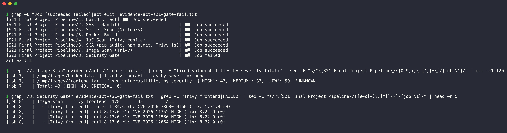

```console
$ grep -E "Job (succeeded|failed)|act exit" evidence/act-s21-gate-fail.txt
[S21 Final Project Pipeline/1. Build & Test] 🏁  Job succeeded
[S21 Final Project Pipeline/2. SAST (Bandit)                       ] 🏁  Job succeeded
[S21 Final Project Pipeline/5. Secret Scan (Gitleaks)              ] 🏁  Job succeeded
[S21 Final Project Pipeline/6. Docker Build                        ] 🏁  Job succeeded
[S21 Final Project Pipeline/4. IaC Scan (Trivy config)             ] 🏁  Job succeeded
[S21 Final Project Pipeline/3. SCA (pip-audit, npm audit, Trivy fs)] 🏁  Job succeeded
[S21 Final Project Pipeline/7. Image Scan (Trivy)                  ] 🏁  Job succeeded
[S21 Final Project Pipeline/8. Security Gate                       ] 🏁  Job failed
act exit=1

$ grep "/7. Image Scan" evidence/act-s21-gate-fail.txt | grep -E "fixed vulnerabilities by severity|Total:" | sed -E "s/^\[S21 Final Project Pipeline\/([0-9]+)\.[^]]*\]/[job \1]/" | cut -c1-120
[job 7]   | /tmp/images/backend.tar | fixed vulnerabilities by severity: none
[job 7]   | /tmp/images/frontend.tar | fixed vulnerabilities by severity: {'HIGH': 43, 'MEDIUM': 83, 'LOW': 50, 'UNKNOWN
[job 7]   | Total: 43 (HIGH: 43, CRITICAL: 0)

$ grep "/8. Security Gate" evidence/act-s21-gate-fail.txt | grep -E "Trivy frontend|FAILED" | sed -E "s/^\[S21 Final Project Pipeline\/([0-9]+)\.[^]]*\]/[job \1]/" | head -n 5
[job 8]   | Image scan   Trivy frontend  178       43        FAIL  
[job 8]   |   - [Trivy frontend] c-ares 1.34.6-r0: CVE-2026-33630 HIGH (fix: 1.34.8-r0)
[job 8]   |   - [Trivy frontend] curl 8.17.0-r1: CVE-2026-11352 HIGH (fix: 8.22.0-r0)
[job 8]   |   - [Trivy frontend] curl 8.17.0-r1: CVE-2026-11586 HIGH (fix: 8.22.0-r0)
[job 8]   |   - [Trivy frontend] curl 8.17.0-r1: CVE-2026-12064 HIGH (fix: 8.22.0-r0)
```

The gate failed, so act did not start job 9 (push) and job 10 (deploy). The vulnerable image never reached the registry.

#### Run 3: the gate stopped my own run (secret in the README)

An earlier run of the real repository failed at the gate. Gitleaks found the base64 form of the demo password in a `kubectl get secret` output in this README (see [section 10](#10-devsecops-implementation)). Full log: [`evidence/act-s21-push-gate-blocked-readme.txt`](evidence/act-s21-push-gate-blocked-readme.txt).

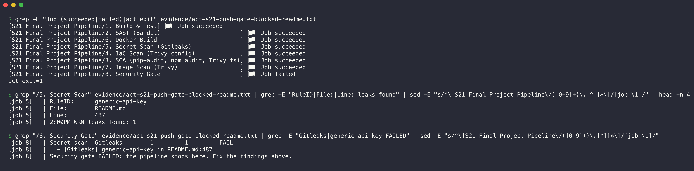

```console
$ grep -E "Job (succeeded|failed)|act exit" evidence/act-s21-push-gate-blocked-readme.txt
[S21 Final Project Pipeline/1. Build & Test] 🏁  Job succeeded
[S21 Final Project Pipeline/2. SAST (Bandit)                       ] 🏁  Job succeeded
[S21 Final Project Pipeline/6. Docker Build                        ] 🏁  Job succeeded
[S21 Final Project Pipeline/5. Secret Scan (Gitleaks)              ] 🏁  Job succeeded
[S21 Final Project Pipeline/4. IaC Scan (Trivy config)             ] 🏁  Job succeeded
[S21 Final Project Pipeline/3. SCA (pip-audit, npm audit, Trivy fs)] 🏁  Job succeeded
[S21 Final Project Pipeline/7. Image Scan (Trivy)                  ] 🏁  Job succeeded
[S21 Final Project Pipeline/8. Security Gate                       ] 🏁  Job failed
act exit=1

$ grep "/5. Secret Scan" evidence/act-s21-push-gate-blocked-readme.txt | grep -E "RuleID|File:|Line:|leaks found" | sed -E "s/^\[S21 Final Project Pipeline\/([0-9]+)\.[^]]*\]/[job \1]/" | head -n 4
[job 5]   | RuleID:      generic-api-key
[job 5]   | File:        README.md
[job 5]   | Line:        487
[job 5]   | 2:00PM WRN leaks found: 1

$ grep "/8. Security Gate" evidence/act-s21-push-gate-blocked-readme.txt | grep -E "Gitleaks|generic-api-key|FAILED" | sed -E "s/^\[S21 Final Project Pipeline\/([0-9]+)\.[^]]*\]/[job \1]/"
[job 8]   | Secret scan  Gitleaks        1         1         FAIL  
[job 8]   |   - [Gitleaks] generic-api-key in README.md:487
[job 8]   | Security gate FAILED: the pipeline stops here. Fix the findings above.
```

Run 1 above is the run after the fix (one exact allowlist entry for this demo value).

**A problem with act and the Trivy setup.** In my first two tries of run 2, the Trivy steps failed with `trivy: command not found`. Both tries used the same act cache server as the real repository, which has a cache entry for the Trivy binary. The likely cause: the setup step found this cache entry, restored it for a different folder path, and did not download Trivy again. With a separate cache folder for the scratch repository (`--cache-server-path`), the third try worked. On GitHub, each repository has its own cache, so I do not expect this problem there.

### Pipeline execution on GitHub

I pushed the repository to GitHub on 7 October 2026 (commit `f0640c2`). The push started the workflow [`s21-final.yml`](../.github/workflows/s21-final.yml) on GitHub-hosted runners: [run 37637158867](https://github.com/kartavya37/DevOps-Assignment/actions/runs/37637158867). All 10 jobs completed with **success** in about 4.5 minutes.

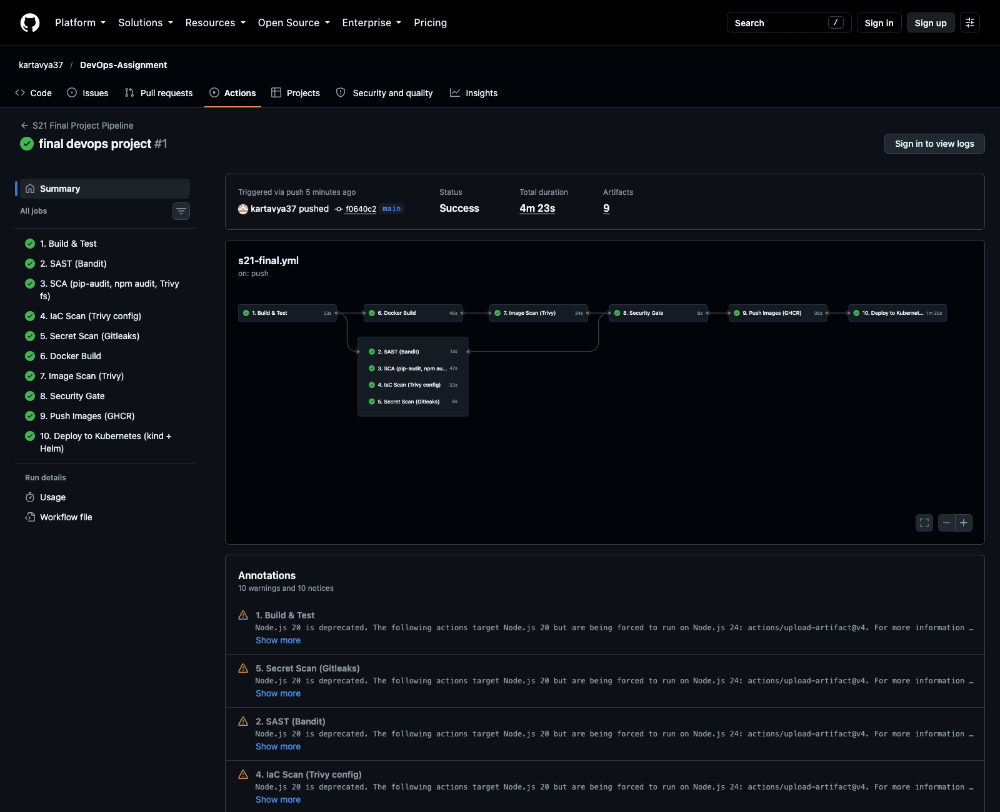

| Job | Result | Duration |
|---|---|---|
| 1. Build & Test | success | 0m 23s |
| 2. SAST (Bandit) | success | 0m 13s |
| 3. SCA (pip-audit, npm audit, Trivy fs) | success | 0m 47s |
| 4. IaC Scan (Trivy config) | success | 0m 33s |
| 5. Secret Scan (Gitleaks) | success | 0m 09s |
| 6. Docker Build | success | 0m 46s |
| 7. Image Scan (Trivy) | success | 0m 34s |
| 8. Security Gate | success | 0m 08s |
| 9. Push Images (GHCR) | success | 0m 36s |
| 10. Deploy to Kubernetes (kind + Helm) | success | 1m 30s |

On GitHub, the steps that act skips also ran:

- Job 9 pushed `ghcr.io/kartavya37/taskboard-backend` and `ghcr.io/kartavya37/taskboard-frontend` with `GITHUB_TOKEN`. The tag is the commit SHA.
- Job 10 created a kind cluster and installed the Helm chart with `values-dev.yaml`. Then it ran `helm test` and the API smoke test.

This is the log of the deploy job. It comes from `gh run view 37637158867 --log`:

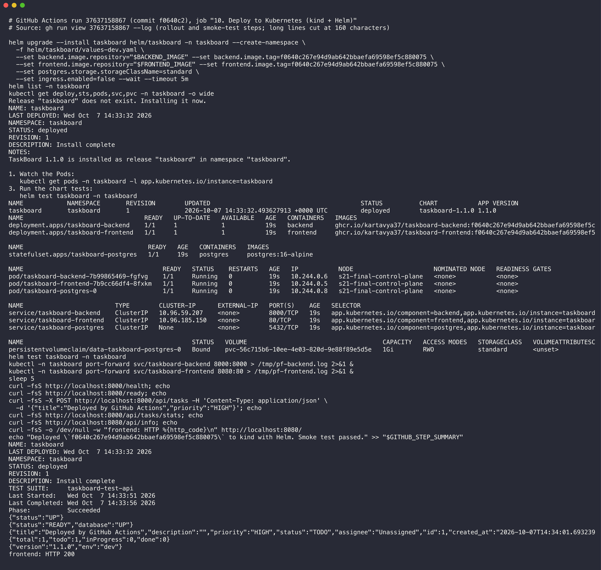

Helm installed revision 1. The backend, the frontend and Postgres became ready, and the Postgres PVC is `Bound` on the StorageClass `standard`. The chart test `taskboard-test-api` completed with `Succeeded`. The smoke test got `{"status":"UP"}` from `/health`, and `/ready` reported that the database is `UP`. It also created a task through the API, and the frontend proxy returned version `1.1.0`. The full excerpt is in [`evidence/github-deploy-log.txt`](evidence/github-deploy-log.txt).

The run title on GitHub is "final devops project". GitHub uses the message of the last commit in a push as the run title. One push sent all the assignments, so the three pipelines have the same title.

**Note:** The run shows warnings that Node.js 20 is deprecated for `actions/upload-artifact@v4` and `actions/download-artifact@v4`. The jobs still pass. I kept v4 because the act artifact server does not work with newer versions.

---

## 10. DevSecOps implementation

The pipeline has one scan job for each security layer. Each scan job writes a JSON report and does **not** fail by itself. The Security Gate job reads all reports and makes one decision. This makes the result of every scanner visible, also when an earlier scanner finds a problem.

| Layer | Tool | What it scans | Gate policy |
|---|---|---|---|
| SAST | Bandit 1.9.4 ([`security/bandit.yaml`](security/bandit.yaml)) | backend Python source code (`application/backend/app`) | block on HIGH severity |
| SCA | pip-audit 2.10.1 | `requirements.txt` against the PyPI advisory database | block on a known vulnerability with a fixed version |
| SCA | npm audit | `package-lock.json` of the frontend | block on HIGH or CRITICAL |
| SCA | Trivy fs 0.75.0 | all dependency files in `application/` | block on HIGH or CRITICAL |
| IaC | Trivy config 0.75.0 | `kubernetes/`, `helm/`, `docker/`, `terraform/` | block on HIGH or CRITICAL (accepted IDs in `.trivyignore`) |
| Secrets | Gitleaks 8.30.1 ([`security/.gitleaks.toml`](security/.gitleaks.toml)) | all files in this folder | block on any secret that it finds |
| Container image | Trivy image 0.75.0 | OS packages, Python packages and secrets in both images | block on HIGH or CRITICAL with a fix (`--ignore-unfixed`) |
| Gate | [`security/security_gate.py`](security/security_gate.py) | the 8 reports | fail closed: if a report is not there or is broken, the gate blocks |

Other controls:

- The GHCR push uses only the short-lived `GITHUB_TOKEN` with `packages: write` in one job. All other jobs have `contents: read`.
- The push and the deploy run only for a push to `main`, never for a pull request.
- The same image tar file goes from "Docker Build" to the scan, the push and the deploy. The pipeline never pushes an image that the gate did not check.
- The Gitleaks binary download is checked with its SHA-256 checksum. The Trivy action is pinned to a commit SHA.
- Containers run as non-root with a read-only root file system and no Linux capabilities.
- Accepted risks are in [`security/.trivyignore`](security/.trivyignore), each with a reason and an expiry date.

### Local run of all scans and the gate

Before I wrote the workflow, I ran all scanners on my Mac with the same options and wrote the reports to a scratch folder (`$R`). The gate passed:

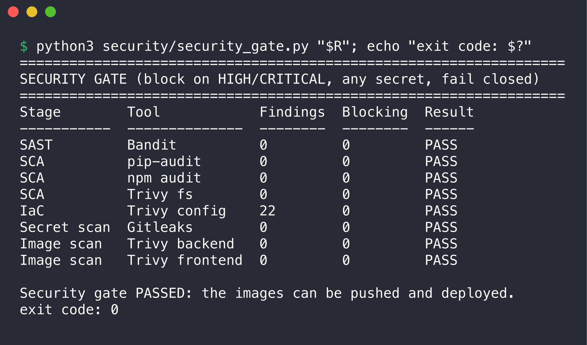

```console
$ python3 security/security_gate.py "$R"; echo "exit code: $?"
==================================================================
SECURITY GATE (block on HIGH/CRITICAL, any secret, fail closed)
==================================================================
Stage        Tool            Findings  Blocking  Result
-----------  --------------  --------  --------  ------
SAST         Bandit          0         0         PASS  
SCA          pip-audit       0         0         PASS  
SCA          npm audit       0         0         PASS  
SCA          Trivy fs        0         0         PASS  
IaC          Trivy config    22        0         PASS  
Secret scan  Gitleaks        0         0         PASS  
Image scan   Trivy backend   0         0         PASS  
Image scan   Trivy frontend  0         0         PASS  

Security gate PASSED: the images can be pushed and deployed.
exit code: 0
```

The 22 IaC findings are LOW and MEDIUM only (for example "Runs with UID <= 10000", "VPC Flow Logs", "S3 Bucket Logging"). The gate reports them, but it does not block them.

### The gate blocked my first frontend image

My first frontend Dockerfile used `nginx:1.29-alpine` without `apk upgrade`. I built that version again as `taskboard-frontend:before-fix` (the same Dockerfile with the old base, file in my scratch folder) and replaced only its image report (`$R2`). The gate failed:

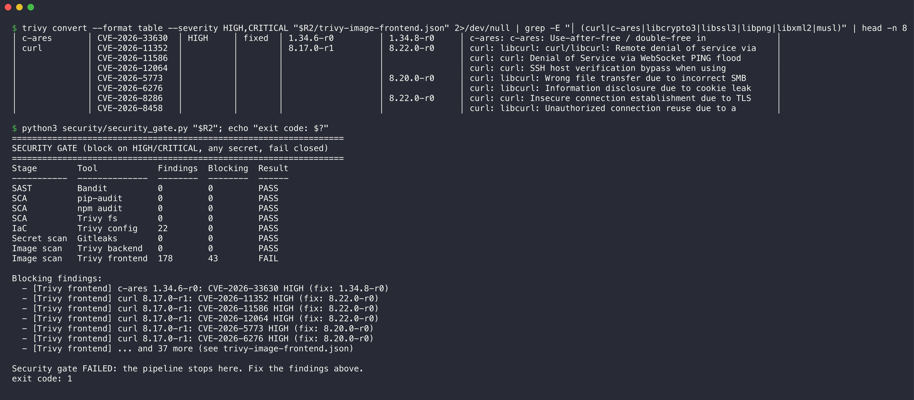

```console
$ trivy convert --format table --severity HIGH,CRITICAL "$R2/trivy-image-frontend.json" 2>/dev/null | grep -E "│ (curl|c-ares|libcrypto3|libssl3|libpng|libxml2|musl)" | head -n 8
│ c-ares       │ CVE-2026-33630  │ HIGH     │ fixed  │ 1.34.6-r0         │ 1.34.8-r0     │ c-ares: c-ares: Use-after-free / double-free in              │
│ curl         │ CVE-2026-11352  │          │        │ 8.17.0-r1         │ 8.22.0-r0     │ curl: libcurl: curl/libcurl: Remote denial of service via    │
│              │ CVE-2026-11586  │          │        │                   │               │ curl: curl: Denial of Service via WebSocket PING flood       │
│              │ CVE-2026-12064  │          │        │                   │               │ curl: curl: SSH host verification bypass when using          │
│              │ CVE-2026-5773   │          │        │                   │ 8.20.0-r0     │ curl: libcurl: Wrong file transfer due to incorrect SMB      │
│              │ CVE-2026-6276   │          │        │                   │               │ curl: libcurl: Information disclosure due to cookie leak     │
│              │ CVE-2026-8286   │          │        │                   │ 8.22.0-r0     │ curl: curl: Insecure connection establishment due to TLS     │
│              │ CVE-2026-8458   │          │        │                   │               │ curl: libcurl: Unauthorized connection reuse due to a        │

$ python3 security/security_gate.py "$R2"; echo "exit code: $?"
==================================================================
SECURITY GATE (block on HIGH/CRITICAL, any secret, fail closed)
==================================================================
Stage        Tool            Findings  Blocking  Result
-----------  --------------  --------  --------  ------
SAST         Bandit          0         0         PASS  
SCA          pip-audit       0         0         PASS  
SCA          npm audit       0         0         PASS  
SCA          Trivy fs        0         0         PASS  
IaC          Trivy config    22        0         PASS  
Secret scan  Gitleaks        0         0         PASS  
Image scan   Trivy backend   0         0         PASS  
Image scan   Trivy frontend  178       43        FAIL  

Blocking findings:
  - [Trivy frontend] c-ares 1.34.6-r0: CVE-2026-33630 HIGH (fix: 1.34.8-r0)
  - [Trivy frontend] curl 8.17.0-r1: CVE-2026-11352 HIGH (fix: 8.22.0-r0)
  - [Trivy frontend] curl 8.17.0-r1: CVE-2026-11586 HIGH (fix: 8.22.0-r0)
  - [Trivy frontend] curl 8.17.0-r1: CVE-2026-12064 HIGH (fix: 8.22.0-r0)
  - [Trivy frontend] curl 8.17.0-r1: CVE-2026-5773 HIGH (fix: 8.20.0-r0)
  - [Trivy frontend] curl 8.17.0-r1: CVE-2026-6276 HIGH (fix: 8.20.0-r0)
  - [Trivy frontend] ... and 37 more (see trivy-image-frontend.json)

Security gate FAILED: the pipeline stops here. Fix the findings above.
exit code: 1
```

**One CVE explained.** `CVE-2026-33630` is a use-after-free / double-free bug in c-ares, the DNS resolver library that `curl` uses in the Alpine base of the Nginx image. A bad DNS answer can make the process free the same memory two times. This can crash the process or, in the worst case, let an attacker run code. Alpine fixed it in `c-ares 1.34.8-r0`, so the finding is "fixed" and the gate blocks it.

**Fix.** I changed the base to `nginx:1.31-alpine` (Alpine 3.24) and added `apk upgrade --no-cache` in the runtime stage. The new image has 0 fixed HIGH/CRITICAL vulnerabilities. The pipeline run in section 9 also shows the gate failure in GitHub Actions form (run 2).

**What the Trivy result means for the backend.** The backend image (Debian 13 slim) has HIGH CVEs that Debian has not fixed yet (no fixed version exists). With `--ignore-unfixed`, the gate does not block them, because no upgrade can remove them today. The gate blocks them automatically as soon as Debian publishes a fix. A clean result does not prove that an image is secure. It only shows that no known and fixable vulnerability is in the scanned packages.

### IaC scan results and what I changed

The first Trivy config scan found these HIGH and CRITICAL problems:

| File | ID | Severity | Problem | Action |
|---|---|---|---|---|
| `terraform/eks.tf` | AWS-0040 | CRITICAL | EKS API endpoint is public | fixed: `endpoint_public_access = var.eks_public_endpoint` (default `false`) |
| `terraform/eks.tf` | AWS-0041 | CRITICAL | public endpoint open to a CIDR | fixed (same change) |
| `terraform/security.tf` | AWS-0104 | CRITICAL | security groups allow all outbound traffic | **accepted** in `.trivyignore` until 2027-03-31: the nodes need egress to GHCR/ECR and the AWS APIs; plan: VPC endpoints + egress proxy |
| `terraform/eks.tf` | AWS-0039 | HIGH | Kubernetes Secrets not encrypted with KMS | fixed: `encryption_config` with the project KMS key |
| `terraform/storage.tf` | AWS-0132 | HIGH | S3 bucket without a customer managed key | fixed: `aws:kms` with the project KMS key |
| `terraform/network.tf` | AWS-0164 | HIGH | public subnets give public IPs automatically | fixed: `map_public_ip_on_launch = false` |
| `kubernetes/03-postgres.yaml`, `helm/.../postgres.yaml` | KSV-0014 | HIGH | PostgreSQL root file system is writable | fixed: `readOnlyRootFilesystem: true` + `emptyDir` for `/var/run/postgresql` and `/tmp` |
| `terraform/eks.tf` | AWS-0038 | MEDIUM | not all control plane logs on | fixed: all 5 log types |

The `troubleshooting/` folder has broken manifests on purpose, so the pipeline does not scan it.

### Secret scan settings

Gitleaks uses all default rules. The allowlist in [`.gitleaks.toml`](security/.gitleaks.toml) has only screenshots, reports, `node_modules/` and AWS resource IDs from the emulator output. Gitleaks reported the Moto security group ID `sg-keigaen1cjhoytpex` in `evidence/terraform-replan-on-moto.txt` as `generic-api-key` (a false positive). I added a regex for AWS resource IDs instead of an allowlist for the whole evidence folder. The demo passwords in the Secret manifests (`demo-password-123`) do not match the default rules.

The secret scan also stopped one of my own pipeline runs. This README shows the output of `kubectl get secret taskboard-db -o jsonpath="{.data}"`, which has the **base64** form of the demo password after the key `DB_PASSWORD`. The rule `generic-api-key` found it, and the gate failed (run 3 in section 9). The value is the known demo password, so I added one allowlist entry for exactly this base64 string, with a comment. I did not remove the README from the scan.

---

## 11. Monitoring

The monitoring platform (kube-prometheus-stack, Loki, Alloy) runs in namespace `monitoring`. This project adds its own objects in [`monitoring/`](monitoring/). The Helm values of the platform are in [`monitoring/platform-values/`](monitoring/platform-values/) for reference.

| File | Object | Purpose |
|---|---|---|
| [`00-namespace.yaml`](monitoring/00-namespace.yaml) | Namespace `s21-monitoring` | home of the monitoring objects |
| [`servicemonitor.yaml`](monitoring/servicemonitor.yaml) | ServiceMonitor | Prometheus scrapes `/metrics` of the backend Service (port name `http`) in `s21-taskboard` every 15 s |
| [`prometheusrule.yaml`](monitoring/prometheusrule.yaml) | PrometheusRule `taskboard-alerts` | 9 alerts in 3 groups: traffic, resources, health |
| [`grafana-dashboard.yaml`](monitoring/grafana-dashboard.yaml) | ConfigMap with label `grafana_dashboard: "1"` | the Grafana sidecar loads the dashboard "TaskBoard - Application Overview" |
| Helm chart [`servicemonitor.yaml`](helm/taskboard/templates/servicemonitor.yaml) | ServiceMonitor | the Helm and GitOps releases bring their own ServiceMonitor |

Alerts in the PrometheusRule:

| Group | Alert | Condition |
|---|---|---|
| traffic | `TaskboardHighRequestRate` | more than 20 API requests/s for 1 minute |
| traffic | `TaskboardHighErrorRate` | more than 5% of the requests return 5xx for 2 minutes |
| traffic | `TaskboardHighLatencyP95` | p95 latency more than 500 ms for 5 minutes |
| resources | `TaskboardBackendHighCpu` | backend CPU more than 80% of the CPU request for 1 minute |
| resources | `TaskboardHpaAtMaxReplicas` | the HPA is at its maximum for 2 minutes |
| health | `TaskboardBackendDown` | Prometheus cannot scrape a backend Pod |
| health | `TaskboardPodNotReady` | a Pod is not ready for 1 minute |
| health | `TaskboardContainerWaiting` | a container waits with `CrashLoopBackOff`, `ImagePullBackOff`, `ErrImagePull` or `CreateContainerConfigError` |
| health | `TaskboardPvcPending` | a PVC is `Pending` for 2 minutes |

### Step 1: Apply the monitoring objects

```console
$ kubectl apply -f monitoring/00-namespace.yaml && kubectl apply -f monitoring/
namespace/s21-monitoring created
namespace/s21-monitoring unchanged
configmap/taskboard-dashboard created
prometheusrule.monitoring.coreos.com/taskboard-alerts created
servicemonitor.monitoring.coreos.com/taskboard-backend created
```

I opened the UIs with port-forwards in my port range: Prometheus `18701`, Grafana `18702`, Alertmanager `18703`, Loki `18704`. Grafana allows anonymous access with the Viewer role, so the screenshots need no login.

### Step 2: Prometheus scrapes the backend

All 5 backend Pods (during the load test) are `UP`. The labels `namespace`, `pod`, `service` and `container` come from the ServiceMonitor:

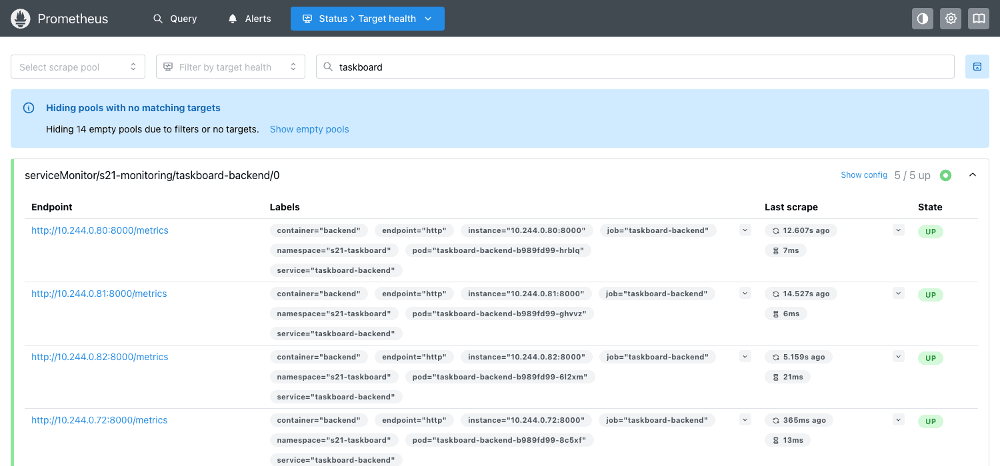

### Step 3: Alerts that fire during the load test

During the HPA load test (section 6, Step 5), two alerts went to `firing`: `TaskboardHighRequestRate` and `TaskboardBackendHighCpu`. `TaskboardHpaAtMaxReplicas` was `pending`.

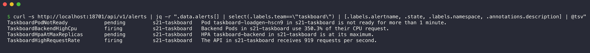

```console
$ curl -s http://localhost:18701/api/v1/alerts | jq -r ".data.alerts[] | select(.labels.team==\"taskboard\") | [.labels.alertname, .state, .labels.namespace, .annotations.description] | @tsv"
TaskboardPodNotReady	pending	s21-taskboard	Pod taskboard-loadgen-hscn9 in s21-taskboard is not ready for more than 1 minute.
TaskboardBackendHighCpu	firing	s21-taskboard	Backend Pods in s21-taskboard use 350.3% of their CPU request.
TaskboardHpaAtMaxReplicas	pending	s21-taskboard	HPA taskboard-backend in s21-taskboard is at its maximum.
TaskboardHighRequestRate	firing	s21-taskboard	The API in s21-taskboard receives 919 requests per second.
```

The `TaskboardPodNotReady` line is for a load generator Pod that had just completed. The rule ignores Pods in phase `Succeeded`, and the `for: 1m` clause stopped this short `pending` state before it became `firing`.

Prometheus UI (Alerts page):

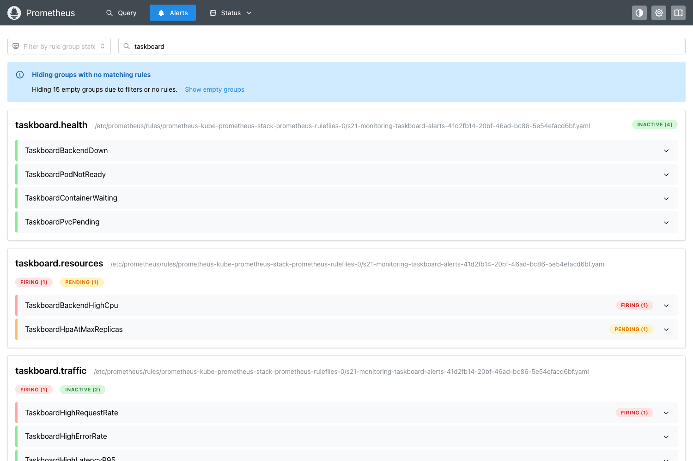

Alertmanager received the alerts in state `firing` (the shared platform has no receiver, so it does not send them anywhere):

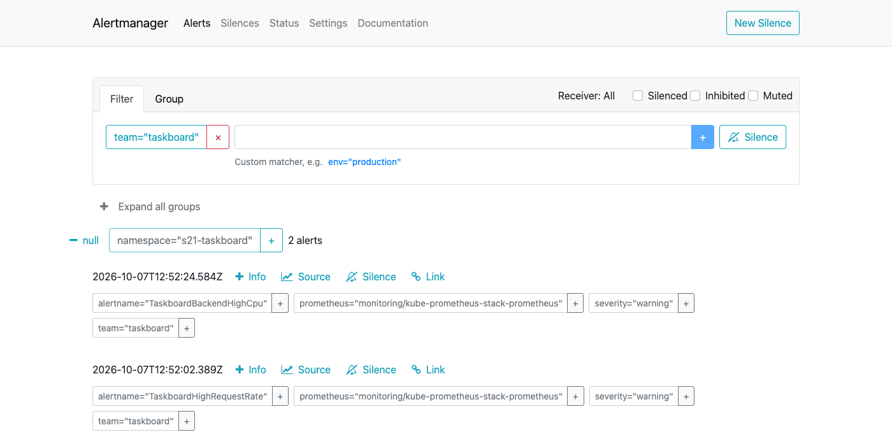

The troubleshooting lab also made alerts fire: `TaskboardPvcPending` (scenario 1), `TaskboardContainerWaiting` (scenario 2) and `TaskboardPodNotReady` (scenario 5). See [section 13](#13-troubleshooting-final-troubleshooting-challenge).

### Step 4: Grafana dashboard

The dashboard has a `namespace` variable (all namespaces `s21-*`). Panels:

- stat panels: ready backend Pods, API requests/s, 5xx error ratio, p95 latency, HPA replicas, number of alerts in state `firing`
- request rate for each endpoint and status code
- error ratio (4xx and 5xx)
- latency p50 / p95 / p99 (version 1.1.0 has finer histogram buckets)
- HPA replicas (current / desired / max)
- CPU usage for each Pod, with the CPU request of the backend
- memory (working set) for each Pod, with the memory limit of the backend
- backend logs from Loki (without probe and `/metrics` lines)

Dashboard during the first load test (version 1.0.0, 3 workers). The panels show the request rate, the HPA steps 2 → 3 → 5 and the CPU of each Pod near its limit:

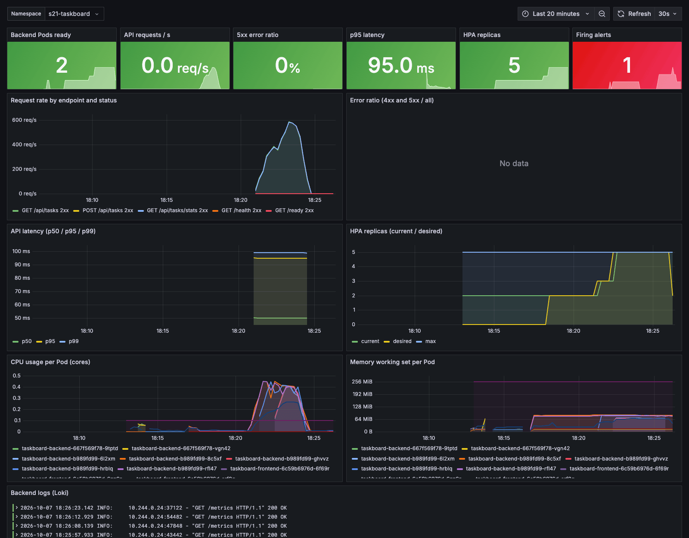

Dashboard during the second load test (version 1.1.0, 2 workers, about 2% of the requests ask for a task that does not exist). The error panel shows the 4xx ratio (about 2.4%), and the latency panel shows a useful p50/p95/p99 because of the finer buckets:

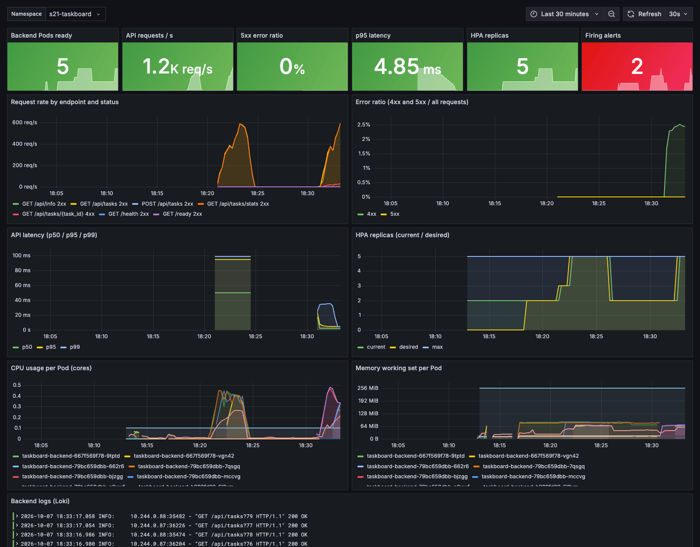

### Step 5: Logs in Loki

Alloy sends the logs of all Pods to Loki. Queries with the Loki API (LogQL):

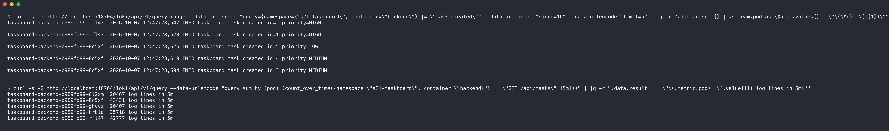

```console
$ curl -s -G http://localhost:18704/loki/api/v1/query_range --data-urlencode "query={namespace=\"s21-taskboard\", container=\"backend\"} |= \"task created\"" --data-urlencode "since=1h" --data-urlencode "limit=5" | jq -r ".data.result[] | .stream.pod as \$p | .values[] | \"\(\$p)  \(.[1])\""
taskboard-backend-b989fd99-rfl47  2026-10-07 12:47:28,547 INFO taskboard task created id=2 priority=HIGH

taskboard-backend-b989fd99-rfl47  2026-10-07 12:47:28,528 INFO taskboard task created id=1 priority=HIGH

taskboard-backend-b989fd99-8c5xf  2026-10-07 12:47:28,625 INFO taskboard task created id=5 priority=LOW

taskboard-backend-b989fd99-8c5xf  2026-10-07 12:47:28,610 INFO taskboard task created id=4 priority=MEDIUM

taskboard-backend-b989fd99-8c5xf  2026-10-07 12:47:28,594 INFO taskboard task created id=3 priority=MEDIUM


$ curl -s -G http://localhost:18704/loki/api/v1/query --data-urlencode "query=sum by (pod) (count_over_time({namespace=\"s21-taskboard\", container=\"backend\"} |= \"GET /api/tasks\" [5m]))" | jq -r ".data.result[] | \"\(.metric.pod)  \(.value[1]) log lines in 5m\""
taskboard-backend-b989fd99-6l2xm  20467 log lines in 5m
taskboard-backend-b989fd99-8c5xf  43431 log lines in 5m
taskboard-backend-b989fd99-ghvvz  20407 log lines in 5m
taskboard-backend-b989fd99-hrblq  35718 log lines in 5m
taskboard-backend-b989fd99-rfl47  42777 log lines in 5m
```

The first query finds the application log line `task created` from the two backend Pods (the requests went to both Pods). The second query counts the access log lines for each Pod during the load test. The dashboard also shows the logs in its last panel.

---

## 12. GitOps

GitOps means: Git holds the desired state, and an agent in the cluster (Argo CD) makes the cluster equal to Git. Nobody runs `kubectl apply` or `helm upgrade` for this environment.

| Part | Value |
|---|---|
| Git server | Gitea in the cluster (namespace `gitea`) |
| Repository | `gitops-admin/taskboard-gitops` (public, branch `main`) |
| Repository content | the Helm chart (`taskboard/`) + [`values-gitops.yaml`](gitops/values-gitops.yaml) |
| Argo CD Application | [`gitops/argocd-application.yaml`](gitops/argocd-application.yaml): `s21-taskboard-gitops` |
| Destination | namespace `s21-gitops`, host `gitops.taskboard.s21.local` |
| Sync policy | automated, `prune: true`, `selfHeal: true`, `CreateNamespace=true` |
| Trigger | Gitea webhook to Argo CD on each push (sync in seconds), and a 60-second poll |

**WARNING:** Do not write the Gitea or Argo CD passwords into files or Git remote URLs. The script [`gitops/push-to-gitea.sh`](gitops/push-to-gitea.sh) reads the Gitea password from the cluster Secret into an environment variable. A Git credential helper gives it to `git push`.

### Step 1: Create the GitOps repository in Gitea

1. Start `kubectl port-forward -n gitea svc/gitea-http 18705:3000`.
2. Read the Gitea user and password from the Secret `gitea/gitea-admin` into `GITEA_USER` and `GITEA_PASS`.
3. Run `gitops/push-to-gitea.sh <work-dir>`. The script creates the repository, pushes the chart and adds the webhook.

Output of the script (I gave it a work folder in my scratch directory; `sed` replaced the long path with `<scratch>`):

```console
create repo: HTTP 201
a18151f Add TaskBoard Helm chart and GitOps values
webhook: HTTP 201
Repository work tree: <scratch>/gitops-repo
```

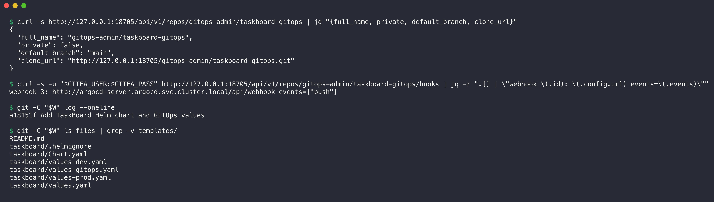

```console
$ curl -s http://127.0.0.1:18705/api/v1/repos/gitops-admin/taskboard-gitops | jq "{full_name, private, default_branch, clone_url}"
{
  "full_name": "gitops-admin/taskboard-gitops",
  "private": false,
  "default_branch": "main",
  "clone_url": "http://127.0.0.1:18705/gitops-admin/taskboard-gitops.git"
}

$ curl -s -u "$GITEA_USER:$GITEA_PASS" http://127.0.0.1:18705/api/v1/repos/gitops-admin/taskboard-gitops/hooks | jq -r ".[] | \"webhook \(.id): \(.config.url) events=\(.events)\""
webhook 3: http://argocd-server.argocd.svc.cluster.local/api/webhook events=["push"]

$ git -C "$W" log --oneline
a18151f Add TaskBoard Helm chart and GitOps values

$ git -C "$W" ls-files | grep -v templates/
README.md
taskboard/.helmignore
taskboard/Chart.yaml
taskboard/values-dev.yaml
taskboard/values-gitops.yaml
taskboard/values-prod.yaml
taskboard/values.yaml
```

### Step 2: Create the Argo CD Application

Apply the Application one time. After that, Git is the only source of change.

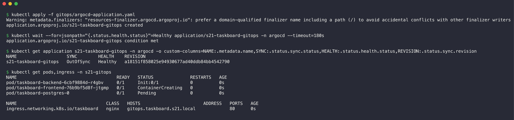

```console
$ kubectl apply -f gitops/argocd-application.yaml
Warning: metadata.finalizers: "resources-finalizer.argocd.argoproj.io": prefer a domain-qualified finalizer name including a path (/) to avoid accidental conflicts with other finalizer writers
application.argoproj.io/s21-taskboard-gitops created

$ kubectl wait --for=jsonpath="{.status.health.status}"=Healthy application/s21-taskboard-gitops -n argocd --timeout=180s
application.argoproj.io/s21-taskboard-gitops condition met

$ kubectl get application s21-taskboard-gitops -n argocd -o custom-columns=NAME:.metadata.name,SYNC:.status.sync.status,HEALTH:.status.health.status,REVISION:.status.sync.revision
NAME                   SYNC        HEALTH    REVISION
s21-taskboard-gitops   OutOfSync   Healthy   a18151f858025e94930677ad40ddb84bb4542790

$ kubectl get pods,ingress -n s21-gitops
NAME                                      READY   STATUS              RESTARTS   AGE
pod/taskboard-backend-6cbf9884d-r4gbv     0/1     Init:0/1            0          0s
pod/taskboard-frontend-76b9bf5d8f-jtgmp   0/1     ContainerCreating   0          0s
pod/taskboard-postgres-0                  0/1     Pending             0          0s

NAME                                  CLASS   HOSTS                        ADDRESS   PORTS   AGE
ingress.networking.k8s.io/taskboard   nginx   gitops.taskboard.s21.local             80      0s
```

The `kubectl wait` returned too early: a new Application is `Healthy` for a moment before Argo CD creates the resources. The Pods had not started yet. The warning about the finalizer name comes from Kubernetes v1.37; the Argo CD finalizer still works. Some seconds later, the Application was `Synced` and `Healthy`:

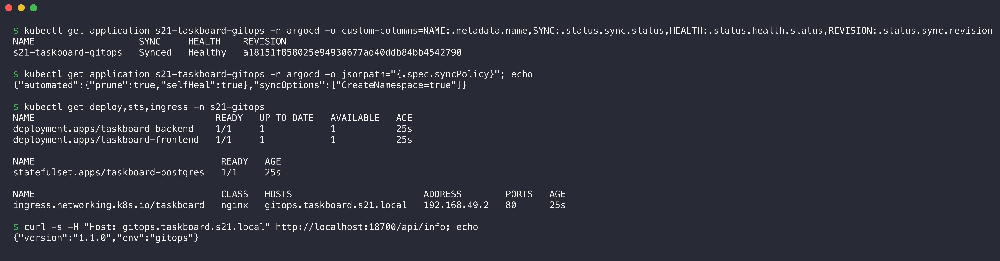

```console
$ kubectl get application s21-taskboard-gitops -n argocd -o custom-columns=NAME:.metadata.name,SYNC:.status.sync.status,HEALTH:.status.health.status,REVISION:.status.sync.revision
NAME                   SYNC     HEALTH    REVISION
s21-taskboard-gitops   Synced   Healthy   a18151f858025e94930677ad40ddb84bb4542790

$ kubectl get application s21-taskboard-gitops -n argocd -o jsonpath="{.spec.syncPolicy}"; echo
{"automated":{"prune":true,"selfHeal":true},"syncOptions":["CreateNamespace=true"]}

$ kubectl get deploy,sts,ingress -n s21-gitops
NAME                                 READY   UP-TO-DATE   AVAILABLE   AGE
deployment.apps/taskboard-backend    1/1     1            1           25s
deployment.apps/taskboard-frontend   1/1     1            1           25s

NAME                                  READY   AGE
statefulset.apps/taskboard-postgres   1/1     25s

NAME                                  CLASS   HOSTS                        ADDRESS        PORTS   AGE
ingress.networking.k8s.io/taskboard   nginx   gitops.taskboard.s21.local   192.168.49.2   80      25s

$ curl -s -H "Host: gitops.taskboard.s21.local" http://localhost:18700/api/info; echo
{"version":"1.1.0","env":"gitops"}
```

Argo CD UI (resource tree of the Application):

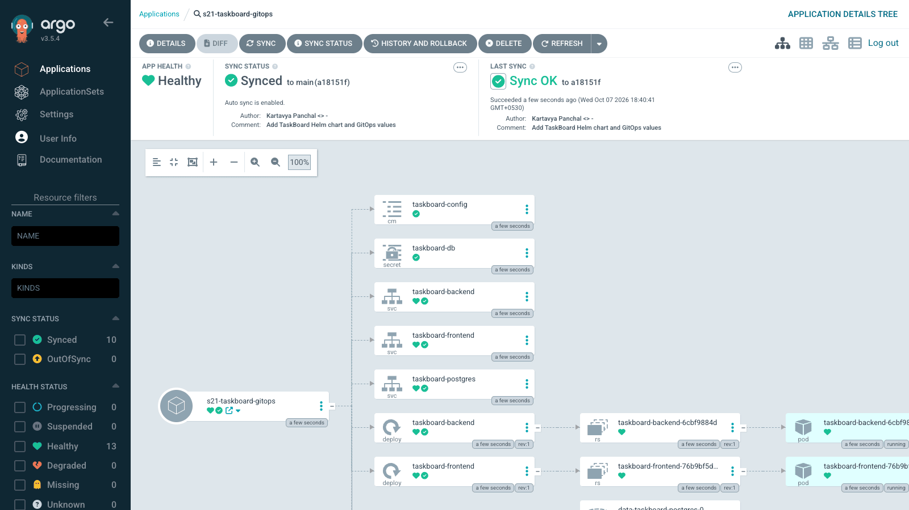

### Step 3: Change the cluster with a Git commit

1. Change `values-gitops.yaml`: 2 backend replicas, 2 frontend replicas, `appEnv: gitops-v2`.
2. Commit and push the change to Gitea.
3. Do not run any `kubectl` or `helm` command.

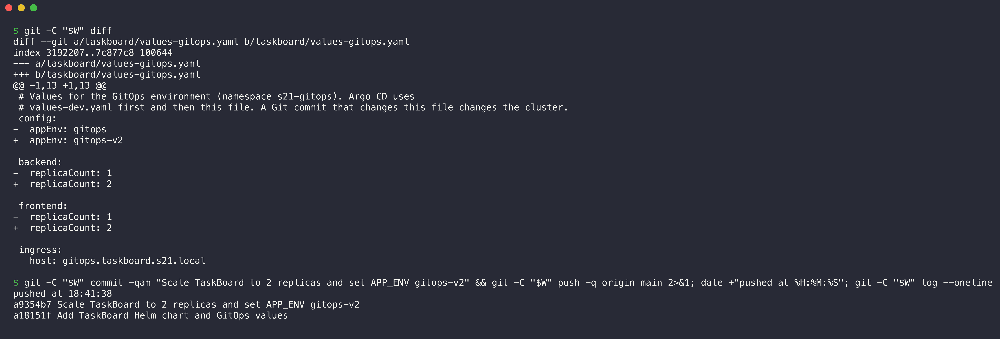

```console
$ git -C "$W" diff
diff --git a/taskboard/values-gitops.yaml b/taskboard/values-gitops.yaml
index 3192207..7c877c8 100644
--- a/taskboard/values-gitops.yaml
+++ b/taskboard/values-gitops.yaml
@@ -1,13 +1,13 @@
 # Values for the GitOps environment (namespace s21-gitops). Argo CD uses
 # values-dev.yaml first and then this file. A Git commit that changes this file changes the cluster.
 config:
-  appEnv: gitops
+  appEnv: gitops-v2
 
 backend:
-  replicaCount: 1
+  replicaCount: 2
 
 frontend:
-  replicaCount: 1
+  replicaCount: 2
 
 ingress:
   host: gitops.taskboard.s21.local

$ git -C "$W" commit -qam "Scale TaskBoard to 2 replicas and set APP_ENV gitops-v2" && git -C "$W" push -q origin main 2>&1; date +"pushed at %H:%M:%S"; git -C "$W" log --oneline
pushed at 18:41:38
a9354b7 Scale TaskBoard to 2 replicas and set APP_ENV gitops-v2
a18151f Add TaskBoard Helm chart and GitOps values
```

The webhook told Argo CD about the push. Argo CD deployed revision `a9354b7` at 18:41:42 (13:11:42 UTC), 4 seconds after the push:

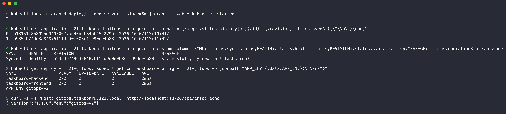

```console
$ kubectl logs -n argocd deploy/argocd-server --since=5m | grep -c "Webhook handler started"
2

$ kubectl get application s21-taskboard-gitops -n argocd -o jsonpath="{range .status.history[*]}{.id}  {.revision}  {.deployedAt}{\"\\n\"}{end}"
0  a18151f858025e94930677ad40ddb84bb4542790  2026-10-07T13:10:41Z
1  a9354b74963a84876f11d9d0e008c1f990de4b88  2026-10-07T13:11:42Z

$ kubectl get application s21-taskboard-gitops -n argocd -o custom-columns=SYNC:.status.sync.status,HEALTH:.status.health.status,REVISION:.status.sync.revision,MESSAGE:.status.operationState.message
SYNC     HEALTH    REVISION                                   MESSAGE
Synced   Healthy   a9354b74963a84876f11d9d0e008c1f990de4b88   successfully synced (all tasks run)

$ kubectl get deploy -n s21-gitops; kubectl get cm taskboard-config -n s21-gitops -o jsonpath="APP_ENV={.data.APP_ENV}{\"\\n\"}"
NAME                 READY   UP-TO-DATE   AVAILABLE   AGE
taskboard-backend    2/2     2            2           2m5s
taskboard-frontend   2/2     2            2           2m5s
APP_ENV=gitops-v2

$ curl -s -H "Host: gitops.taskboard.s21.local" http://localhost:18700/api/info; echo
{"version":"1.1.0","env":"gitops-v2"}
```

The ConfigMap change also restarted the backend Pods, because the chart puts a checksum of the ConfigMap in the Pod template. The Argo CD history shows both commits, the author and "Initiated by: automated sync policy":

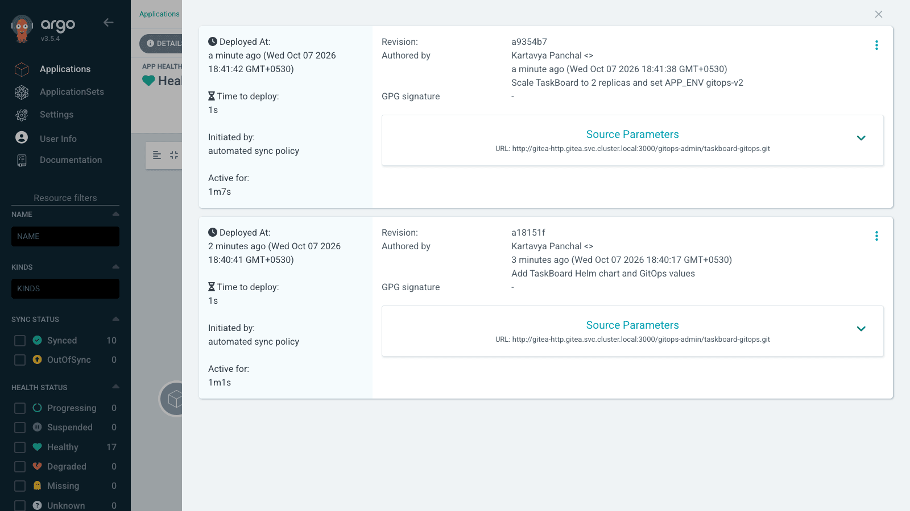

### Step 4: Manual drift is reverted (self-heal)

1. Scale the backend to 4 replicas with `kubectl` (a change that is not in Git).
2. Change `LOG_LEVEL` in the ConfigMap with `kubectl patch`.
3. Watch Argo CD return both objects to the Git state.


```console
$ date +%T; kubectl scale deploy taskboard-backend -n s21-gitops --replicas=4
18:43:05
deployment.apps/taskboard-backend scaled

$ kubectl patch configmap taskboard-config -n s21-gitops --type merge -p "{\"data\":{\"LOG_LEVEL\":\"error\"}}"
configmap/taskboard-config patched

$ sleep 1; kubectl get deploy taskboard-backend -n s21-gitops; kubectl get cm taskboard-config -n s21-gitops -o jsonpath="LOG_LEVEL={.data.LOG_LEVEL}{\"\\n\"}"
NAME                READY   UP-TO-DATE   AVAILABLE   AGE
taskboard-backend   2/2     2            2           2m25s
LOG_LEVEL=debug

$ for i in $(seq 1 30); do r=$(kubectl get deploy taskboard-backend -n s21-gitops -o jsonpath="{.spec.replicas}"); l=$(kubectl get cm taskboard-config -n s21-gitops -o jsonpath="{.data.LOG_LEVEL}"); [ "$r" = 2 ] && [ "$l" = debug ] && break; sleep 1; done; date +%T; echo "spec.replicas=$r LOG_LEVEL=$l"
18:43:06
spec.replicas=2 LOG_LEVEL=debug

$ kubectl get deploy taskboard-backend -n s21-gitops
NAME                READY   UP-TO-DATE   AVAILABLE   AGE
taskboard-backend   2/2     2            2           2m25s

$ kubectl get application s21-taskboard-gitops -n argocd -o custom-columns=SYNC:.status.sync.status,HEALTH:.status.health.status,LAST_OP:.status.operationState.operation.initiatedBy.automated,MESSAGE:.status.operationState.message
SYNC     HEALTH    LAST_OP   MESSAGE
Synced   Healthy   true      successfully synced (all tasks run)
```

The self-heal was faster than my next command: one second later, the replica count was 2 again and `LOG_LEVEL` was `debug` again. The events prove that the drift happened and that Argo CD reverted it:

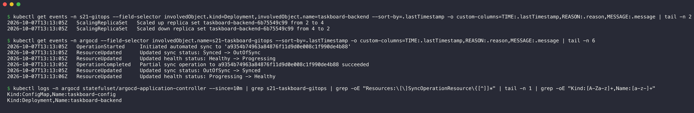

```console
$ kubectl get events -n s21-gitops --field-selector involvedObject.kind=Deployment,involvedObject.name=taskboard-backend --sort-by=.lastTimestamp -o custom-columns=TIME:.lastTimestamp,REASON:.reason,MESSAGE:.message | tail -n 2
2026-10-07T13:13:05Z   ScalingReplicaSet   Scaled up replica set taskboard-backend-6b75549c99 from 2 to 4
2026-10-07T13:13:05Z   ScalingReplicaSet   Scaled down replica set taskboard-backend-6b75549c99 from 4 to 2

$ kubectl get events -n argocd --field-selector involvedObject.name=s21-taskboard-gitops --sort-by=.lastTimestamp -o custom-columns=TIME:.lastTimestamp,REASON:.reason,MESSAGE:.message | tail -n 6
2026-10-07T13:13:05Z   OperationStarted     Initiated automated sync to 'a9354b74963a84876f11d9d0e008c1f990de4b88'
2026-10-07T13:13:05Z   ResourceUpdated      Updated sync status: Synced -> OutOfSync
2026-10-07T13:13:05Z   ResourceUpdated      Updated health status: Healthy -> Progressing
2026-10-07T13:13:05Z   OperationCompleted   Partial sync operation to a9354b74963a84876f11d9d0e008c1f990de4b88 succeeded
2026-10-07T13:13:05Z   ResourceUpdated      Updated sync status: OutOfSync -> Synced
2026-10-07T13:13:05Z   ResourceUpdated      Updated health status: Progressing -> Healthy

$ kubectl logs -n argocd statefulset/argocd-application-controller --since=10m | grep s21-taskboard-gitops | grep -oE "Resources:\[\]SyncOperationResource\{[^]]*" | tail -n 1 | grep -oE "Kind:[A-Za-z]+,Name:[a-z-]+"
Kind:ConfigMap,Name:taskboard-config
Kind:Deployment,Name:taskboard-backend
```

Argo CD made a "partial sync" of only the two changed objects (the ConfigMap and the Deployment), in the same second as the drift.

### Step 5: Point the Application at the public GitHub repository

After the push to GitHub, the same chart is in the public repository `kartavya37/DevOps-Assignment`. File: [`gitops/argocd-application-github.yaml`](gitops/argocd-application-github.yaml).

```yaml
  source:
    repoURL: https://github.com/kartavya37/DevOps-Assignment.git
    targetRevision: main
    path: Final-DevOps-Project-&-Troubleshooting/helm/taskboard
    helm:
      releaseName: taskboard
      valueFiles:
        - values-prod.yaml
```

1. Push the repository to GitHub (the main session does this).
2. Apply `gitops/argocd-application-github.yaml`. A public repository needs no Argo CD credentials.
3. To deploy a new version, change `backend.image.tag` and `frontend.image.tag` in `values-prod.yaml` to the commit SHA that the pipeline pushed to GHCR, and commit the change.

I validated this Application with a server-side dry run (`application.argoproj.io/taskboard-github created (server dry run)`). I did not apply it, because the repository was not on GitHub yet. With a real cluster, a GitHub webhook to Argo CD gives the same fast sync as the Gitea webhook.

At the end, I deleted the Application `s21-taskboard-gitops`. Its finalizer deleted all resources in `s21-gitops`.

---

## 13. Troubleshooting (Final Troubleshooting Challenge)

I introduced **eight** different issues into the project on purpose, one after the other, in namespace `s21-troubleshoot` (host `taskboard-debug.s21.local`). For each issue, I followed the six steps of the brief: identify, investigate, find the root cause, fix, verify, document.

Files: [`troubleshooting/base/`](troubleshooting/base/) is the baseline that works (the `kubernetes/` manifests with one replica). Each scenario folder has a `broken.yaml` with a `BUG:` comment and a `fixed.yaml` with a `FIX:` comment. To see the bug, run `diff broken.yaml fixed.yaml`.

| # | Scenario | Symptom | Root cause | Fix |
|---|---|---|---|---|
| 1 | [PVC with a wrong StorageClass](troubleshooting/01-pvc-storageclass/) | PVC and Pod `Pending`, backend `Init:0/1`, Ingress 503 | `storageClassName: gp3` does not exist in minikube | StorageClass `standard`; delete the StatefulSet and the PVC (immutable) |
| 2 | [Wrong image tag](troubleshooting/02-image-tag/) | `ErrImagePull` / `ImagePullBackOff`, rollout stops | tag `1.2.0` was never built | tag `1.1.0` |
| 3 | [Wrong Secret key](troubleshooting/03-secret-key/) | `CreateContainerConfigError` | `secretKeyRef.key: DB_PASS`, the key is `DB_PASSWORD` | key `DB_PASSWORD` |
| 4 | [Rotated DB password](troubleshooting/04-db-password/) | `CrashLoopBackOff`, "password authentication failed" | new password in the Secret, old password in PostgreSQL | Job runs `ALTER USER` with the old password, then restart |
| 5 | [Wrong readiness probe path](troubleshooting/05-readiness-probe/) | Pod `Running` but `0/1`, rollout stops | probe path `/readyz` returns 404 | path `/ready` |
| 6 | [Service selector mismatch](troubleshooting/06-service-selector/) | Service has no endpoints, `/api` returns 503 | selector `app=taskboard-api`, Pods have `app=taskboard-backend` | selector `app=taskboard-backend` |
| 7 | [Ingress to a wrong Service port](troubleshooting/07-ingress-port/) | `/api` returns 503, endpoints are fine | Ingress uses port 8080, the Service has port 8000 | port name `http` |
| 8 | [HPA without CPU requests](troubleshooting/08-hpa-no-requests/) | HPA `cpu: <unknown>/60%` | no `requests.cpu` on the container | add `requests.cpu: 100m` |

General method that I used for each issue:

1. Identify: `kubectl get pods` (status column), `curl` through the Ingress, Prometheus alerts.
2. Investigate: `kubectl describe` (Events), `kubectl logs` (also `--previous`), `kubectl get endpointslices`, ingress-nginx logs.
3. Find the root cause: compare the object with what it refers to (image store, Secret keys, Pod labels, Service ports, StorageClasses).
4. Fix: apply `fixed.yaml`.
5. Verify: `kubectl rollout status`, `kubectl get`, `curl` returns HTTP 200, alerts are resolved.

### Scenario 1: PVC with a wrong StorageClass (Pending)

**Identify.** I deployed the stack with the broken PostgreSQL StatefulSet. After 45 seconds, PostgreSQL and its PVC were `Pending`, the backend waited in its init container, and the API returned 503.

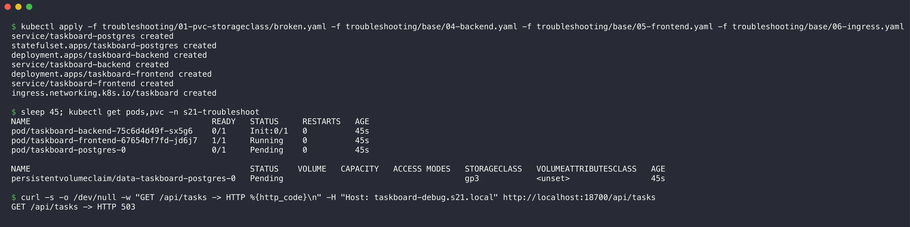

```console
$ kubectl apply -f troubleshooting/01-pvc-storageclass/broken.yaml -f troubleshooting/base/04-backend.yaml -f troubleshooting/base/05-frontend.yaml -f troubleshooting/base/06-ingress.yaml
service/taskboard-postgres created
statefulset.apps/taskboard-postgres created
deployment.apps/taskboard-backend created
service/taskboard-backend created
deployment.apps/taskboard-frontend created
service/taskboard-frontend created
ingress.networking.k8s.io/taskboard created

$ sleep 45; kubectl get pods,pvc -n s21-troubleshoot
NAME                                      READY   STATUS     RESTARTS   AGE
pod/taskboard-backend-75c6d4d49f-sx5g6    0/1     Init:0/1   0          45s
pod/taskboard-frontend-67654bf7fd-jd6j7   1/1     Running    0          45s
pod/taskboard-postgres-0                  0/1     Pending    0          45s

NAME                                              STATUS    VOLUME   CAPACITY   ACCESS MODES   STORAGECLASS   VOLUMEATTRIBUTESCLASS   AGE
persistentvolumeclaim/data-taskboard-postgres-0   Pending                                      gp3            <unset>                 45s

$ curl -s -o /dev/null -w "GET /api/tasks -> HTTP %{http_code}\n" -H "Host: taskboard-debug.s21.local" http://localhost:18700/api/tasks
GET /api/tasks -> HTTP 503
```

**Investigate.**

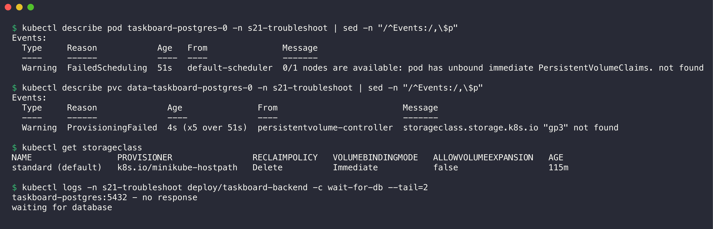

```console
$ kubectl describe pod taskboard-postgres-0 -n s21-troubleshoot | sed -n "/^Events:/,\$p"
Events:
  Type     Reason            Age   From               Message
  ----     ------            ----  ----               -------
  Warning  FailedScheduling  51s   default-scheduler  0/1 nodes are available: pod has unbound immediate PersistentVolumeClaims. not found

$ kubectl describe pvc data-taskboard-postgres-0 -n s21-troubleshoot | sed -n "/^Events:/,\$p"
Events:
  Type     Reason              Age               From                         Message
  ----     ------              ----              ----                         -------
  Warning  ProvisioningFailed  4s (x5 over 51s)  persistentvolume-controller  storageclass.storage.k8s.io "gp3" not found

$ kubectl get storageclass
NAME                 PROVISIONER                RECLAIMPOLICY   VOLUMEBINDINGMODE   ALLOWVOLUMEEXPANSION   AGE
standard (default)   k8s.io/minikube-hostpath   Delete          Immediate           false                  115m

$ kubectl logs -n s21-troubleshoot deploy/taskboard-backend -c wait-for-db --tail=2
taskboard-postgres:5432 - no response
waiting for database
```

After 2 minutes, the alert `TaskboardPvcPending` fired:

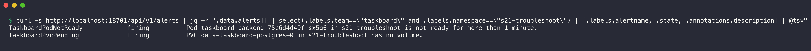

```console
$ curl -s http://localhost:18701/api/v1/alerts | jq -r ".data.alerts[] | select(.labels.team==\"taskboard\" and .labels.namespace==\"s21-troubleshoot\") | [.labels.alertname, .state, .annotations.description] | @tsv"
TaskboardPodNotReady	firing	Pod taskboard-backend-75c6d4d49f-sx5g6 in s21-troubleshoot is not ready for more than 1 minute.
TaskboardPvcPending	firing	PVC data-taskboard-postgres-0 in s21-troubleshoot has no volume.
```

**Root cause.** The manifest came from an EKS setup and asks for the StorageClass `gp3`. minikube has only `standard`. The PVC cannot get a volume, so the scheduler cannot place the PostgreSQL Pod, and the backend init container waits for a database that never starts.

**Fix and verify.** `volumeClaimTemplates` of a StatefulSet cannot change. The first apply of `fixed.yaml` failed with `field is immutable`. I deleted the StatefulSet and the empty Pending PVC, then applied the fixed file.

**CAUTION:** Delete a PVC only if it has no data. A `Pending` PVC never had a volume, so this delete is safe. Do not delete a `Bound` PVC of a database.


```console
$ kubectl apply -f troubleshooting/01-pvc-storageclass/fixed.yaml 2>&1 | tail -n 2
service/taskboard-postgres unchanged
The StatefulSet "taskboard-postgres" is invalid: spec.volumeClaimTemplates: Invalid value: [{"name":"data","labels":{"app":"taskboard-postgres"},"Spec":{"AccessModes":["ReadWriteOnce"],"Selector":null,"Resources":{"Limits":null,"Requests":{"storage":"1Gi"}},"VolumeName":"","StorageClassName":"standard","VolumeMode":"Filesystem","DataSource":null,"DataSourceRef":null,"VolumeAttributesClassName":null},"Status":{"Phase":"Pending","AccessModes":null,"Capacity":null,"Conditions":null,"AllocatedResources":null,"AllocatedResourceStatuses":null,"CurrentVolumeAttributesClassName":null,"ModifyVolumeStatus":null,"HealthStatus":null}}]: field is immutable

$ kubectl delete statefulset taskboard-postgres -n s21-troubleshoot && kubectl delete pvc data-taskboard-postgres-0 -n s21-troubleshoot
statefulset.apps "taskboard-postgres" deleted from s21-troubleshoot namespace
persistentvolumeclaim "data-taskboard-postgres-0" deleted from s21-troubleshoot namespace

$ kubectl apply -f troubleshooting/01-pvc-storageclass/fixed.yaml
service/taskboard-postgres unchanged
statefulset.apps/taskboard-postgres created

$ kubectl wait --for=condition=Ready pod/taskboard-postgres-0 -n s21-troubleshoot --timeout=120s && kubectl rollout status deploy/taskboard-backend -n s21-troubleshoot --timeout=120s
pod/taskboard-postgres-0 condition met
Waiting for deployment "taskboard-backend" rollout to finish: 0 of 1 updated replicas are available...
deployment "taskboard-backend" successfully rolled out

$ kubectl get pods,pvc -n s21-troubleshoot
NAME                                      READY   STATUS    RESTARTS   AGE
pod/taskboard-backend-75c6d4d49f-sx5g6    1/1     Running   0          2m52s
pod/taskboard-frontend-67654bf7fd-jd6j7   1/1     Running   0          2m52s
pod/taskboard-postgres-0                  1/1     Running   0          8s

NAME                                              STATUS   VOLUME                                     CAPACITY   ACCESS MODES   STORAGECLASS   VOLUMEATTRIBUTESCLASS   AGE
persistentvolumeclaim/data-taskboard-postgres-0   Bound    pvc-5c1932eb-071d-4d1b-8a19-f410b9a3ef4e   1Gi        RWO            standard       <unset>                 8s

$ curl -s -w "  <- HTTP %{http_code}\n" -H "Host: taskboard-debug.s21.local" http://localhost:18700/api/tasks/stats
<html>
<head><title>503 Service Temporarily Unavailable</title></head>
<body>
<center><h1>503 Service Temporarily Unavailable</h1></center>
<hr><center>nginx</center>
</body>
</html>
  <- HTTP 503
```

The last `curl` came less than one second after the rollout, before ingress-nginx had the new endpoint. Some seconds later (I also applied the HPA and created 5 tasks), the API answered and the alerts were resolved:

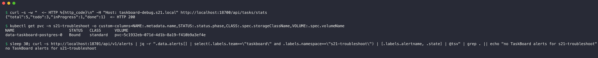

```console
$ curl -s -w "  <- HTTP %{http_code}\n" -H "Host: taskboard-debug.s21.local" http://localhost:18700/api/tasks/stats
{"total":5,"todo":3,"inProgress":1,"done":1}  <- HTTP 200

$ kubectl get pvc -n s21-troubleshoot -o custom-columns=NAME:.metadata.name,STATUS:.status.phase,CLASS:.spec.storageClassName,VOLUME:.spec.volumeName
NAME                        STATUS   CLASS      VOLUME
data-taskboard-postgres-0   Bound    standard   pvc-5c1932eb-071d-4d1b-8a19-f410b9a3ef4e

$ sleep 30; curl -s http://localhost:18701/api/v1/alerts | jq -r ".data.alerts[] | select(.labels.team==\"taskboard\" and .labels.namespace==\"s21-troubleshoot\") | [.labels.alertname, .state] | @tsv" | grep . || echo "no TaskBoard alerts for s21-troubleshoot"
no TaskBoard alerts for s21-troubleshoot
```

### Scenario 2: Wrong image tag (ImagePullBackOff)

**Identify.** I applied a backend Deployment with the tag `1.2.0`. The rollout did not complete. The new Pod showed `ErrImagePull`. The API still answered, because `maxUnavailable: 0` kept the old Pod.

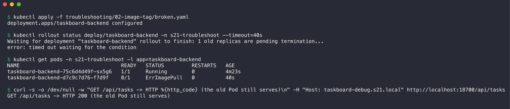

```console
$ kubectl apply -f troubleshooting/02-image-tag/broken.yaml
deployment.apps/taskboard-backend configured

$ kubectl rollout status deploy/taskboard-backend -n s21-troubleshoot --timeout=40s
Waiting for deployment "taskboard-backend" rollout to finish: 1 old replicas are pending termination...
error: timed out waiting for the condition

$ kubectl get pods -n s21-troubleshoot -l app=taskboard-backend
NAME                                 READY   STATUS         RESTARTS   AGE
taskboard-backend-75c6d4d49f-sx5g6   1/1     Running        0          4m23s
taskboard-backend-d7c9c7d76-f7d9f    0/1     ErrImagePull   0          40s

$ curl -s -o /dev/null -w "GET /api/tasks -> HTTP %{http_code} (the old Pod still serves)\n" -H "Host: taskboard-debug.s21.local" http://localhost:18700/api/tasks
GET /api/tasks -> HTTP 200 (the old Pod still serves)
```

**Investigate.**

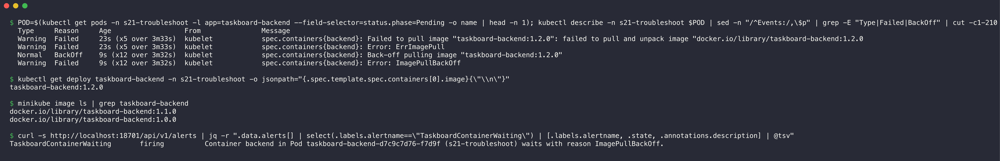

```console
$ POD=$(kubectl get pods -n s21-troubleshoot -l app=taskboard-backend --field-selector=status.phase=Pending -o name | head -n 1); kubectl describe -n s21-troubleshoot $POD | sed -n "/^Events:/,\$p" | grep -E "Type|Failed|BackOff" | cut -c1-210
  Type     Reason     Age                  From               Message
  Warning  Failed     23s (x5 over 3m33s)  kubelet            spec.containers{backend}: Failed to pull image "taskboard-backend:1.2.0": failed to pull and unpack image "docker.io/library/taskboard-backend:1.2.0
  Warning  Failed     23s (x5 over 3m33s)  kubelet            spec.containers{backend}: Error: ErrImagePull
  Normal   BackOff    9s (x12 over 3m32s)  kubelet            spec.containers{backend}: Back-off pulling image "taskboard-backend:1.2.0"
  Warning  Failed     9s (x12 over 3m32s)  kubelet            spec.containers{backend}: Error: ImagePullBackOff

$ kubectl get deploy taskboard-backend -n s21-troubleshoot -o jsonpath="{.spec.template.spec.containers[0].image}{\"\\n\"}"
taskboard-backend:1.2.0

$ minikube image ls | grep taskboard-backend
docker.io/library/taskboard-backend:1.1.0
docker.io/library/taskboard-backend:1.0.0

$ curl -s http://localhost:18701/api/v1/alerts | jq -r ".data.alerts[] | select(.labels.alertname==\"TaskboardContainerWaiting\") | [.labels.alertname, .state, .annotations.description] | @tsv"
TaskboardContainerWaiting	firing	Container backend in Pod taskboard-backend-d7c9c7d76-f7d9f (s21-troubleshoot) waits with reason ImagePullBackOff.
```

**Root cause.** The node has only the tags `1.0.0` and `1.1.0`. With `imagePullPolicy: IfNotPresent`, the kubelet did not find `1.2.0` and tried to pull `docker.io/library/taskboard-backend:1.2.0`. That image does not exist. After some failures, the kubelet waits longer between tries (`ImagePullBackOff`).

**Fix and verify.**

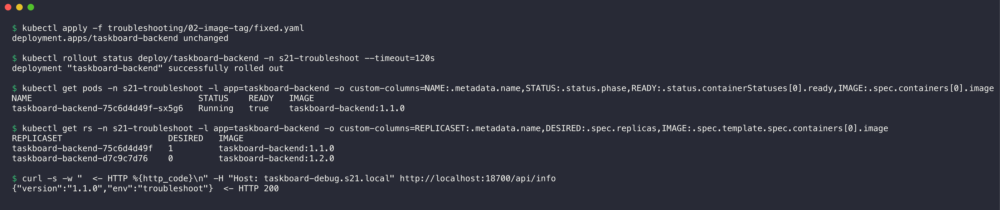

```console
$ kubectl apply -f troubleshooting/02-image-tag/fixed.yaml
deployment.apps/taskboard-backend unchanged

$ kubectl rollout status deploy/taskboard-backend -n s21-troubleshoot --timeout=120s
deployment "taskboard-backend" successfully rolled out

$ kubectl get pods -n s21-troubleshoot -l app=taskboard-backend -o custom-columns=NAME:.metadata.name,STATUS:.status.phase,READY:.status.containerStatuses[0].ready,IMAGE:.spec.containers[0].image
NAME                                 STATUS    READY   IMAGE
taskboard-backend-75c6d4d49f-sx5g6   Running   true    taskboard-backend:1.1.0

$ kubectl get rs -n s21-troubleshoot -l app=taskboard-backend -o custom-columns=REPLICASET:.metadata.name,DESIRED:.spec.replicas,IMAGE:.spec.template.spec.containers[0].image
REPLICASET                     DESIRED   IMAGE
taskboard-backend-75c6d4d49f   1         taskboard-backend:1.1.0
taskboard-backend-d7c9c7d76    0         taskboard-backend:1.2.0

$ curl -s -w "  <- HTTP %{http_code}\n" -H "Host: taskboard-debug.s21.local" http://localhost:18700/api/info
{"version":"1.1.0","env":"troubleshoot"}  <- HTTP 200
```

The screenshot is from my second run of these commands (the first run applied the fix, so this run says `unchanged`). The fixed template is equal to the old one, so Kubernetes scaled the old ReplicaSet `75c6d4d49f` back and scaled the broken ReplicaSet to 0. The same old Pod continued to serve.

### Scenario 3: Wrong Secret key (CreateContainerConfigError)

**Identify.**

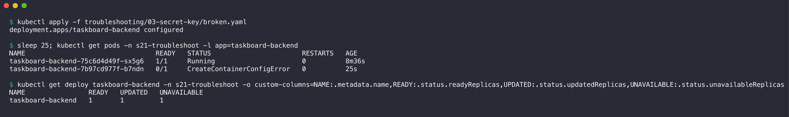

```console
$ kubectl apply -f troubleshooting/03-secret-key/broken.yaml
deployment.apps/taskboard-backend configured

$ sleep 25; kubectl get pods -n s21-troubleshoot -l app=taskboard-backend
NAME                                 READY   STATUS                       RESTARTS   AGE
taskboard-backend-75c6d4d49f-sx5g6   1/1     Running                      0          8m36s
taskboard-backend-7b97cd977f-b7ndn   0/1     CreateContainerConfigError   0          25s

$ kubectl get deploy taskboard-backend -n s21-troubleshoot -o custom-columns=NAME:.metadata.name,READY:.status.readyReplicas,UPDATED:.status.updatedReplicas,UNAVAILABLE:.status.unavailableReplicas
NAME                READY   UPDATED   UNAVAILABLE
taskboard-backend   1       1         1
```

**Investigate.**


```console
$ POD=$(kubectl get pods -n s21-troubleshoot -l app=taskboard-backend -o json | jq -r ".items[] | select(.status.containerStatuses[0].state.waiting.reason==\"CreateContainerConfigError\") | .metadata.name"); echo "pod: $POD"; kubectl describe pod $POD -n s21-troubleshoot | sed -n "/^Events:/,\$p" | grep -E "Type|Failed" | cut -c1-170
pod: taskboard-backend-7b97cd977f-b7ndn
  Type     Reason     Age               From               Message
  Warning  Failed     0s (x3 over 24s)  kubelet            spec.containers{backend}: Error: couldn't find key DB_PASS in Secret s21-troubleshoot/taskboard-db

$ kubectl get secret taskboard-db -n s21-troubleshoot -o jsonpath="{.data}" | jq "keys"
[
  "DB_PASSWORD",
  "DB_USER"
]

$ kubectl get deploy taskboard-backend -n s21-troubleshoot -o json | jq -c ".spec.template.spec.containers[0].env[] | {name, secret: .valueFrom.secretKeyRef.name, key: .valueFrom.secretKeyRef.key}"
{"name":"DB_USER","secret":"taskboard-db","key":"DB_USER"}
{"name":"DB_PASSWORD","secret":"taskboard-db","key":"DB_PASS"}
```

**Root cause.** The environment variable `DB_PASSWORD` refers to the key `DB_PASS`. The Secret has the keys `DB_USER` and `DB_PASSWORD` only. The kubelet cannot build the environment, so it does not create the container. No container log exists, so only `kubectl describe` shows the reason.

**Fix and verify.**

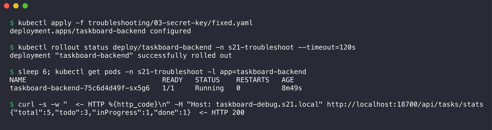

```console
$ kubectl apply -f troubleshooting/03-secret-key/fixed.yaml
deployment.apps/taskboard-backend configured

$ kubectl rollout status deploy/taskboard-backend -n s21-troubleshoot --timeout=120s
deployment "taskboard-backend" successfully rolled out

$ sleep 6; kubectl get pods -n s21-troubleshoot -l app=taskboard-backend
NAME                                 READY   STATUS    RESTARTS   AGE
taskboard-backend-75c6d4d49f-sx5g6   1/1     Running   0          8m49s

$ curl -s -w "  <- HTTP %{http_code}\n" -H "Host: taskboard-debug.s21.local" http://localhost:18700/api/tasks/stats
{"total":5,"todo":3,"inProgress":1,"done":1}  <- HTTP 200
```

### Scenario 4: Rotated database password (CrashLoopBackOff)

**Identify.** I changed the password in the Secret (a "rotation") and restarted the backend, as a normal deploy does. The new Pod went into `CrashLoopBackOff`.

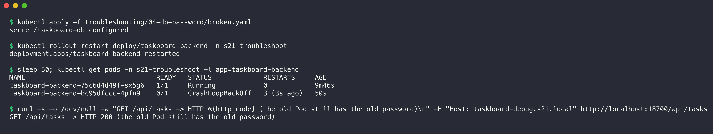

```console
$ kubectl apply -f troubleshooting/04-db-password/broken.yaml
secret/taskboard-db configured

$ kubectl rollout restart deploy/taskboard-backend -n s21-troubleshoot
deployment.apps/taskboard-backend restarted

$ sleep 50; kubectl get pods -n s21-troubleshoot -l app=taskboard-backend
NAME                                 READY   STATUS             RESTARTS     AGE
taskboard-backend-75c6d4d49f-sx5g6   1/1     Running            0            9m46s
taskboard-backend-bc95dfccc-4pfn9    0/1     CrashLoopBackOff   3 (3s ago)   50s

$ curl -s -o /dev/null -w "GET /api/tasks -> HTTP %{http_code} (the old Pod still has the old password)\n" -H "Host: taskboard-debug.s21.local" http://localhost:18700/api/tasks
GET /api/tasks -> HTTP 200 (the old Pod still has the old password)
```

**Investigate.**


```console
$ POD=$(kubectl get pods -n s21-troubleshoot -l app=taskboard-backend -o json | jq -r ".items[] | select(.status.containerStatuses[0].ready==false) | .metadata.name"); echo "pod: $POD"; kubectl logs $POD -n s21-troubleshoot -c backend --previous | tail -n 2 | cut -c1-200
pod: taskboard-backend-bc95dfccc-4pfn9
sqlalchemy.exc.OperationalError: (psycopg.OperationalError) connection failed: connection to server at "10.244.0.128", port 5432 failed: FATAL:  password authentication failed for user "taskboard"
(Background on this error at: https://sqlalche.me/e/21/e3q8)

$ kubectl get pod -n s21-troubleshoot -l app=taskboard-backend -o json | jq -r ".items[] | select(.status.containerStatuses[0].ready==false) | .status.containerStatuses[0] | \"restarts=\(.restartCount) lastExit=\(.lastState.terminated.exitCode) reason=\(.lastState.terminated.reason)\""
restarts=3 lastExit=1 reason=Error

$ kubectl logs taskboard-postgres-0 -n s21-troubleshoot --tail=20 | grep -E "FATAL|DETAIL" | tail -n 2
2026-10-07 13:25:42.200 UTC [962] FATAL:  password authentication failed for user "taskboard"
2026-10-07 13:25:42.200 UTC [962] DETAIL:  Connection matched file "/var/lib/postgresql/data/pgdata/pg_hba.conf" line 128: "host all all all scram-sha-256"

$ echo "Secret now:   $(kubectl get secret taskboard-db -n s21-troubleshoot -o jsonpath="{.data.DB_PASSWORD}" | base64 -d)"; echo "Postgres env: $(kubectl exec taskboard-postgres-0 -n s21-troubleshoot -- printenv POSTGRES_PASSWORD)  (set at first start, data directory created at $(kubectl exec taskboard-postgres-0 -n s21-troubleshoot -- stat -c %y /var/lib/postgresql/data/pgdata/PG_VERSION | cut -c1-19))"
Secret now:   rotated-password-456
Postgres env: demo-password-123  (set at first start, data directory created at 2026-10-07 13:18:44)
```

These are demo passwords. Do not print real passwords in a terminal or a log.

**Root cause.** The `postgres` image uses `POSTGRES_PASSWORD` only when the data directory is empty (first start). The data directory is on the PVC and exists since 13:18:44. A new value in the Secret does not change the password inside the database. The new backend Pod uses the new password, the migration fails, the container exits with code 1, and Kubernetes restarts it with a longer wait each time (`CrashLoopBackOff`).

**Fix and verify.** I kept the rotation (the new password) and changed the password inside PostgreSQL. [`fixed.yaml`](troubleshooting/04-db-password/fixed.yaml) adds the previous password to the Secret (`DB_PASSWORD_PREVIOUS`) and a Job. The Job connects with the previous password and runs `ALTER USER CURRENT_USER WITH PASSWORD :'newpw'` (a psql variable, so the password is not in the SQL text). Then it tests the new password.

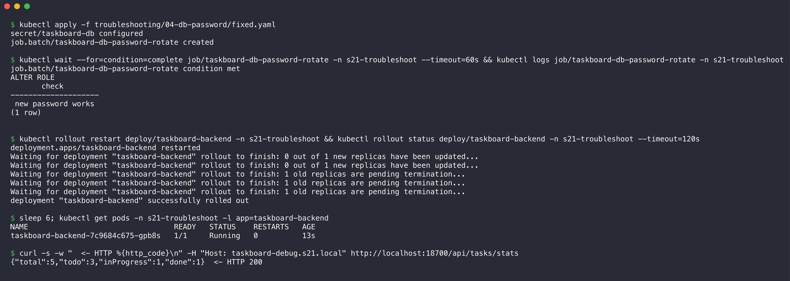

```console
$ kubectl apply -f troubleshooting/04-db-password/fixed.yaml
secret/taskboard-db configured
job.batch/taskboard-db-password-rotate created

$ kubectl wait --for=condition=complete job/taskboard-db-password-rotate -n s21-troubleshoot --timeout=60s && kubectl logs job/taskboard-db-password-rotate -n s21-troubleshoot
job.batch/taskboard-db-password-rotate condition met
ALTER ROLE
       check        
--------------------
 new password works
(1 row)


$ kubectl rollout restart deploy/taskboard-backend -n s21-troubleshoot && kubectl rollout status deploy/taskboard-backend -n s21-troubleshoot --timeout=120s
deployment.apps/taskboard-backend restarted
Waiting for deployment "taskboard-backend" rollout to finish: 0 out of 1 new replicas have been updated...
Waiting for deployment "taskboard-backend" rollout to finish: 0 out of 1 new replicas have been updated...
Waiting for deployment "taskboard-backend" rollout to finish: 1 old replicas are pending termination...
Waiting for deployment "taskboard-backend" rollout to finish: 1 old replicas are pending termination...
Waiting for deployment "taskboard-backend" rollout to finish: 1 old replicas are pending termination...
deployment "taskboard-backend" successfully rolled out

$ sleep 6; kubectl get pods -n s21-troubleshoot -l app=taskboard-backend
NAME                                 READY   STATUS    RESTARTS   AGE
taskboard-backend-7c9684c675-gpb8s   1/1     Running   0          13s

$ curl -s -w "  <- HTTP %{http_code}\n" -H "Host: taskboard-debug.s21.local" http://localhost:18700/api/tasks/stats
{"total":5,"todo":3,"inProgress":1,"done":1}  <- HTTP 200
```

### Scenario 5: Wrong readiness probe path (Pod never Ready)

**Identify.**

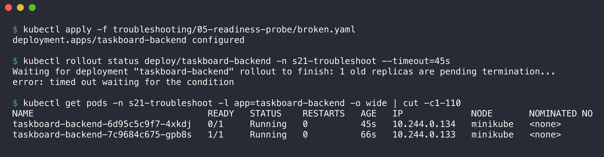

```console
$ kubectl apply -f troubleshooting/05-readiness-probe/broken.yaml
deployment.apps/taskboard-backend configured

$ kubectl rollout status deploy/taskboard-backend -n s21-troubleshoot --timeout=45s
Waiting for deployment "taskboard-backend" rollout to finish: 1 old replicas are pending termination...
error: timed out waiting for the condition

$ kubectl get pods -n s21-troubleshoot -l app=taskboard-backend -o wide | cut -c1-110
NAME                                 READY   STATUS    RESTARTS   AGE   IP             NODE       NOMINATED NO
taskboard-backend-6d95c5c9f7-4xkdj   0/1     Running   0          45s   10.244.0.134   minikube   <none>      
taskboard-backend-7c9684c675-gpb8s   1/1     Running   0          66s   10.244.0.133   minikube   <none>      
```

The new Pod is `Running` with 0 restarts, but `0/1` ready. This is different from a liveness problem: the kubelet does not restart the container, it only keeps it out of the Service.

**Investigate.**

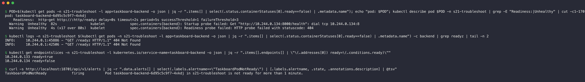

```console
$ POD=$(kubectl get pods -n s21-troubleshoot -l app=taskboard-backend -o json | jq -r ".items[] | select(.status.containerStatuses[0].ready==false) | .metadata.name"); echo "pod: $POD"; kubectl describe pod $POD -n s21-troubleshoot | grep -E "Readiness:|Unhealthy" | cut -c1-170
pod: taskboard-backend-6d95c5c9f7-4xkdj
    Readiness:  http-get http://:http/readyz delay=0s timeout=2s period=5s successThreshold=1 failureThreshold=3
  Warning  Unhealthy  82s                kubelet            spec.containers{backend}: Startup probe failed: Get "http://10.244.0.134:8000/health": dial tcp 10.244.0.134:8
  Warning  Unhealthy  4s (x17 over 80s)  kubelet            spec.containers{backend}: Readiness probe failed: HTTP probe failed with statuscode: 404

$ kubectl logs -n s21-troubleshoot $(kubectl get pods -n s21-troubleshoot -l app=taskboard-backend -o json | jq -r ".items[] | select(.status.containerStatuses[0].ready==false) | .metadata.name") -c backend | grep readyz | tail -n 2
INFO:     10.244.0.1:45886 - "GET /readyz HTTP/1.1" 404 Not Found
INFO:     10.244.0.1:42506 - "GET /readyz HTTP/1.1" 404 Not Found

$ kubectl get endpointslices -n s21-troubleshoot -l kubernetes.io/service-name=taskboard-backend -o json | jq -r ".items[].endpoints[] | \"\(.addresses[0]) ready=\(.conditions.ready)\""
10.244.0.133 ready=true
10.244.0.134 ready=false

$ curl -s http://localhost:18701/api/v1/alerts | jq -r ".data.alerts[] | select(.labels.alertname==\"TaskboardPodNotReady\") | [.labels.alertname, .state, .annotations.description] | @tsv"
TaskboardPodNotReady	firing	Pod taskboard-backend-6d95c5c9f7-4xkdj in s21-troubleshoot is not ready for more than 1 minute.
```

Alertmanager shows the same alert:

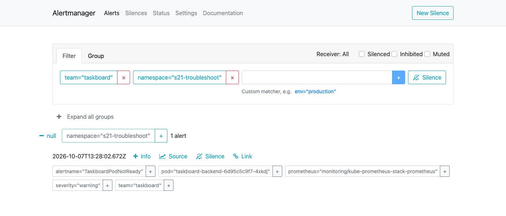

**Root cause.** The readiness probe asks for `/readyz`. The API has `/ready`, so FastAPI returns 404 and the probe fails. The one `Startup probe failed` event is normal (the first probe came before Uvicorn listened).

**Fix and verify.**

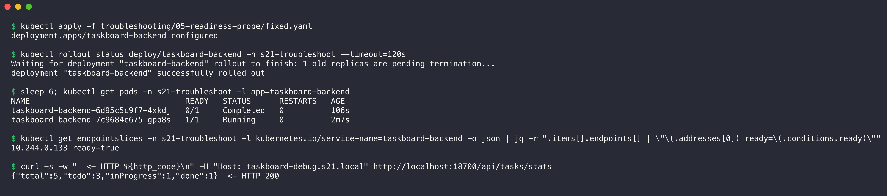

```console
$ kubectl apply -f troubleshooting/05-readiness-probe/fixed.yaml
deployment.apps/taskboard-backend configured

$ kubectl rollout status deploy/taskboard-backend -n s21-troubleshoot --timeout=120s
Waiting for deployment "taskboard-backend" rollout to finish: 1 old replicas are pending termination...
deployment "taskboard-backend" successfully rolled out

$ sleep 6; kubectl get pods -n s21-troubleshoot -l app=taskboard-backend
NAME                                 READY   STATUS      RESTARTS   AGE
taskboard-backend-6d95c5c9f7-4xkdj   0/1     Completed   0          106s
taskboard-backend-7c9684c675-gpb8s   1/1     Running     0          2m7s

$ kubectl get endpointslices -n s21-troubleshoot -l kubernetes.io/service-name=taskboard-backend -o json | jq -r ".items[].endpoints[] | \"\(.addresses[0]) ready=\(.conditions.ready)\""
10.244.0.133 ready=true

$ curl -s -w "  <- HTTP %{http_code}\n" -H "Host: taskboard-debug.s21.local" http://localhost:18700/api/tasks/stats
{"total":5,"todo":3,"inProgress":1,"done":1}  <- HTTP 200
```

The broken Pod is `Completed` and Kubernetes removes it. The good ReplicaSet `7c9684c675` (same template as the fix) keeps the traffic.

### Scenario 6: Service selector mismatch (no endpoints)

**Identify.** The frontend loaded, but the API returned 503 and the UI showed "Backend unavailable".

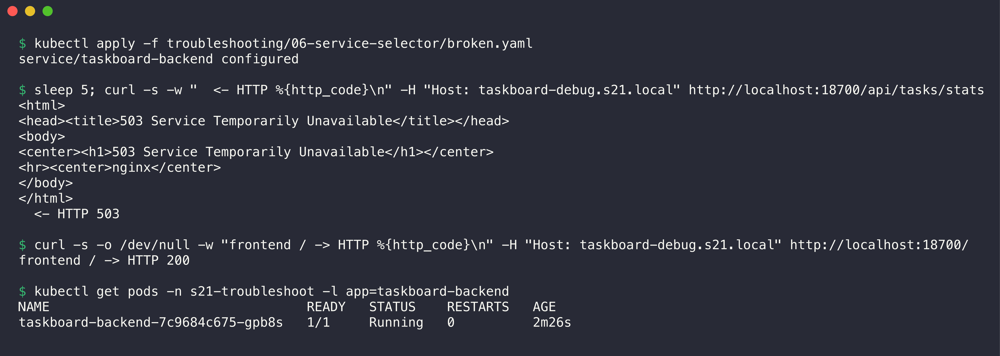

```console
$ kubectl apply -f troubleshooting/06-service-selector/broken.yaml
service/taskboard-backend configured

$ sleep 5; curl -s -w "  <- HTTP %{http_code}\n" -H "Host: taskboard-debug.s21.local" http://localhost:18700/api/tasks/stats
<html>
<head><title>503 Service Temporarily Unavailable</title></head>
<body>
<center><h1>503 Service Temporarily Unavailable</h1></center>
<hr><center>nginx</center>
</body>
</html>
  <- HTTP 503

$ curl -s -o /dev/null -w "frontend / -> HTTP %{http_code}\n" -H "Host: taskboard-debug.s21.local" http://localhost:18700/
frontend / -> HTTP 200

$ kubectl get pods -n s21-troubleshoot -l app=taskboard-backend
NAME                                 READY   STATUS    RESTARTS   AGE
taskboard-backend-7c9684c675-gpb8s   1/1     Running   0          2m26s
```

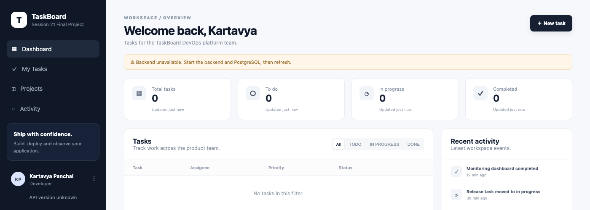

**Investigate.**

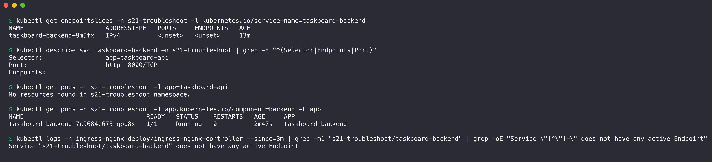

```console
$ kubectl get endpointslices -n s21-troubleshoot -l kubernetes.io/service-name=taskboard-backend
NAME                      ADDRESSTYPE   PORTS     ENDPOINTS   AGE
taskboard-backend-9m5fx   IPv4          <unset>   <unset>     13m

$ kubectl describe svc taskboard-backend -n s21-troubleshoot | grep -E "^(Selector|Endpoints|Port)"
Selector:                 app=taskboard-api
Port:                     http  8000/TCP
Endpoints:                

$ kubectl get pods -n s21-troubleshoot -l app=taskboard-api
No resources found in s21-troubleshoot namespace.

$ kubectl get pods -n s21-troubleshoot -l app.kubernetes.io/component=backend -L app
NAME                                 READY   STATUS    RESTARTS   AGE     APP
taskboard-backend-7c9684c675-gpb8s   1/1     Running   0          2m47s   taskboard-backend

$ kubectl logs -n ingress-nginx deploy/ingress-nginx-controller --since=3m | grep -m1 "s21-troubleshoot/taskboard-backend" | grep -oE "Service \"[^\"]+\" does not have any active Endpoint"
Service "s21-troubleshoot/taskboard-backend" does not have any active Endpoint
```

**Root cause.** The Service selects Pods with `app=taskboard-api`. No Pod has this label (the backend Pod has `app=taskboard-backend`). A Service that matches no Pods has no endpoints, and ingress-nginx returns 503.

**Fix and verify.**

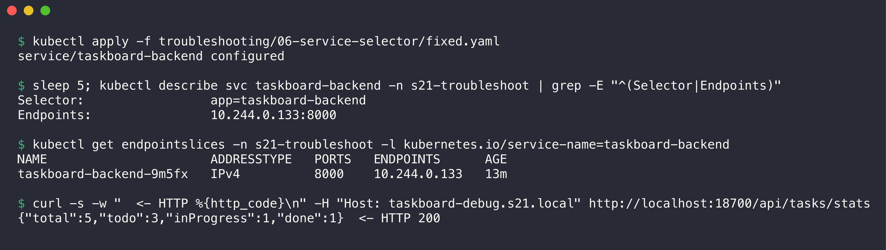

```console
$ kubectl apply -f troubleshooting/06-service-selector/fixed.yaml
service/taskboard-backend configured

$ sleep 5; kubectl describe svc taskboard-backend -n s21-troubleshoot | grep -E "^(Selector|Endpoints)"
Selector:                 app=taskboard-backend
Endpoints:                10.244.0.133:8000

$ kubectl get endpointslices -n s21-troubleshoot -l kubernetes.io/service-name=taskboard-backend
NAME                      ADDRESSTYPE   PORTS   ENDPOINTS      AGE
taskboard-backend-9m5fx   IPv4          8000    10.244.0.133   13m

$ curl -s -w "  <- HTTP %{http_code}\n" -H "Host: taskboard-debug.s21.local" http://localhost:18700/api/tasks/stats
{"total":5,"todo":3,"inProgress":1,"done":1}  <- HTTP 200
```

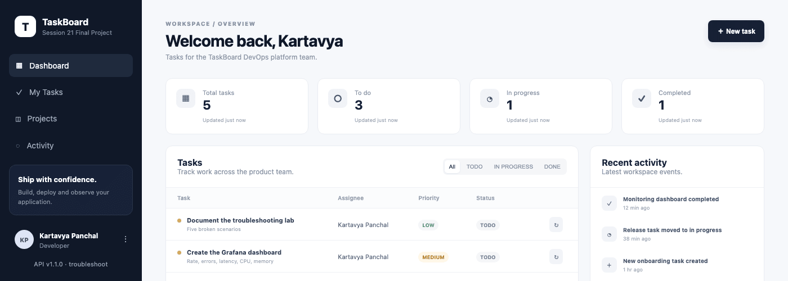

### Scenario 7: Ingress points to a wrong Service port (503)

**Identify.** The API returned 503 again, but this time the Pod and its endpoint were fine.

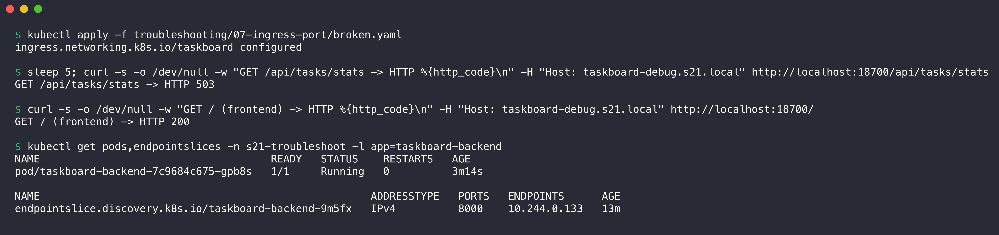

```console
$ kubectl apply -f troubleshooting/07-ingress-port/broken.yaml
ingress.networking.k8s.io/taskboard configured

$ sleep 5; curl -s -o /dev/null -w "GET /api/tasks/stats -> HTTP %{http_code}\n" -H "Host: taskboard-debug.s21.local" http://localhost:18700/api/tasks/stats
GET /api/tasks/stats -> HTTP 503

$ curl -s -o /dev/null -w "GET / (frontend) -> HTTP %{http_code}\n" -H "Host: taskboard-debug.s21.local" http://localhost:18700/
GET / (frontend) -> HTTP 200

$ kubectl get pods,endpointslices -n s21-troubleshoot -l app=taskboard-backend
NAME                                     READY   STATUS    RESTARTS   AGE
pod/taskboard-backend-7c9684c675-gpb8s   1/1     Running   0          3m14s

NAME                                                     ADDRESSTYPE   PORTS   ENDPOINTS      AGE
endpointslice.discovery.k8s.io/taskboard-backend-9m5fx   IPv4          8000    10.244.0.133   13m
```

**Investigate.**

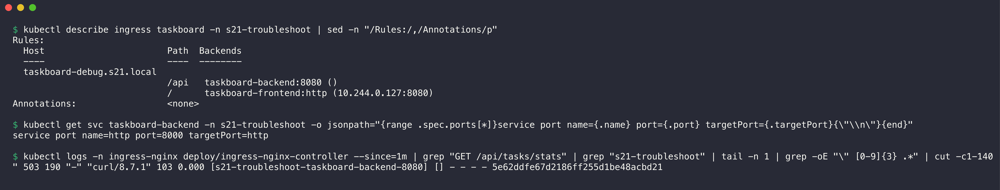

```console
$ kubectl describe ingress taskboard -n s21-troubleshoot | sed -n "/Rules:/,/Annotations/p"
Rules:
  Host                       Path  Backends
  ----                       ----  --------
  taskboard-debug.s21.local  
                             /api   taskboard-backend:8080 ()
                             /      taskboard-frontend:http (10.244.0.127:8080)
Annotations:                 <none>

$ kubectl get svc taskboard-backend -n s21-troubleshoot -o jsonpath="{range .spec.ports[*]}service port name={.name} port={.port} targetPort={.targetPort}{\"\\n\"}{end}"
service port name=http port=8000 targetPort=http

$ kubectl logs -n ingress-nginx deploy/ingress-nginx-controller --since=1m | grep "GET /api/tasks/stats" | grep "s21-troubleshoot" | tail -n 1 | grep -oE "\" [0-9]{3} .*" | cut -c1-140
" 503 190 "-" "curl/8.7.1" 103 0.000 [s21-troubleshoot-taskboard-backend-8080] [] - - - - 5e62ddfe67d2186ff255d1be48acbd21
```

**Root cause.** The Ingress sends `/api` to port 8080 of the Service `taskboard-backend`. The Service has only port 8000. `kubectl describe ingress` shows empty brackets `()` for this backend: no endpoints match. The access log shows the upstream `s21-troubleshoot-taskboard-backend-8080` with no upstream address (`-`). This mistake was also in the class project (the Ingress used port 8080 for the backend). ingress-nginx does not log a clear error for it, so the access log and `describe ingress` are the important clues.

**Fix and verify.** The fixed Ingress uses the port **name** `http`, not a number. A port name stays correct if the port number changes.

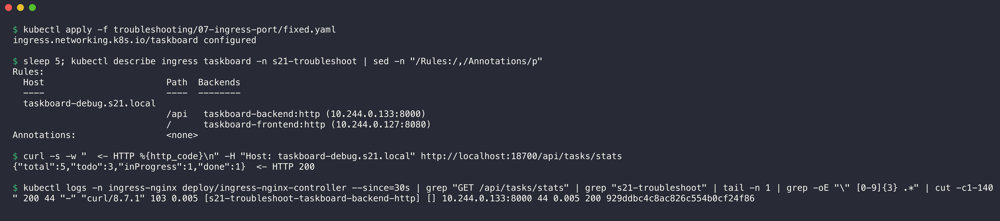

```console
$ kubectl apply -f troubleshooting/07-ingress-port/fixed.yaml
ingress.networking.k8s.io/taskboard configured

$ sleep 5; kubectl describe ingress taskboard -n s21-troubleshoot | sed -n "/Rules:/,/Annotations/p"
Rules:
  Host                       Path  Backends
  ----                       ----  --------
  taskboard-debug.s21.local  
                             /api   taskboard-backend:http (10.244.0.133:8000)
                             /      taskboard-frontend:http (10.244.0.127:8080)
Annotations:                 <none>

$ curl -s -w "  <- HTTP %{http_code}\n" -H "Host: taskboard-debug.s21.local" http://localhost:18700/api/tasks/stats
{"total":5,"todo":3,"inProgress":1,"done":1}  <- HTTP 200

$ kubectl logs -n ingress-nginx deploy/ingress-nginx-controller --since=30s | grep "GET /api/tasks/stats" | grep "s21-troubleshoot" | tail -n 1 | grep -oE "\" [0-9]{3} .*" | cut -c1-140
" 200 44 "-" "curl/8.7.1" 103 0.005 [s21-troubleshoot-taskboard-backend-http] [] 10.244.0.133:8000 44 0.005 200 929ddbc4c8ac826c554b0cf24f86
```

### Scenario 8: HPA without CPU requests (`<unknown>` target)

**Identify.** The HPA worked (`cpu: 5%/60%`) before the change. After I applied a backend Deployment without a CPU request, the target became `<unknown>`.

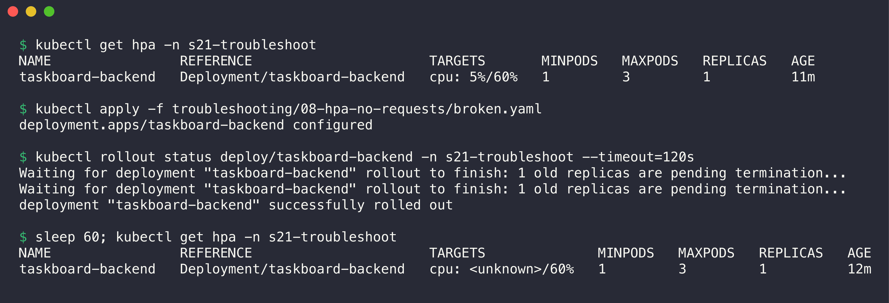

```console
$ kubectl get hpa -n s21-troubleshoot
NAME                REFERENCE                      TARGETS       MINPODS   MAXPODS   REPLICAS   AGE
taskboard-backend   Deployment/taskboard-backend   cpu: 5%/60%   1         3         1          11m

$ kubectl apply -f troubleshooting/08-hpa-no-requests/broken.yaml
deployment.apps/taskboard-backend configured

$ kubectl rollout status deploy/taskboard-backend -n s21-troubleshoot --timeout=120s
Waiting for deployment "taskboard-backend" rollout to finish: 1 old replicas are pending termination...
Waiting for deployment "taskboard-backend" rollout to finish: 1 old replicas are pending termination...
deployment "taskboard-backend" successfully rolled out

$ sleep 60; kubectl get hpa -n s21-troubleshoot
NAME                REFERENCE                      TARGETS              MINPODS   MAXPODS   REPLICAS   AGE
taskboard-backend   Deployment/taskboard-backend   cpu: <unknown>/60%   1         3         1          12m
```

**Investigate.**

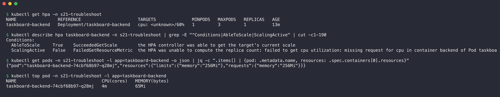

```console
$ kubectl get hpa -n s21-troubleshoot
NAME                REFERENCE                      TARGETS              MINPODS   MAXPODS   REPLICAS   AGE
taskboard-backend   Deployment/taskboard-backend   cpu: <unknown>/60%   1         3         1          13m

$ kubectl describe hpa taskboard-backend -n s21-troubleshoot | grep -E "^Conditions|AbleToScale|ScalingActive" | cut -c1-190
Conditions:
  AbleToScale     True    SucceededGetScale        the HPA controller was able to get the target's current scale
  ScalingActive   False   FailedGetResourceMetric  the HPA was unable to compute the replica count: failed to get cpu utilization: missing request for cpu in container backend of Pod taskboa

$ kubectl get pods -n s21-troubleshoot -l app=taskboard-backend -o json | jq -c ".items[] | {pod: .metadata.name, resources: .spec.containers[0].resources}"
{"pod":"taskboard-backend-74cbf68b97-q28mj","resources":{"limits":{"memory":"256Mi"},"requests":{"memory":"256Mi"}}}

$ kubectl top pod -n s21-troubleshoot -l app=taskboard-backend
NAME                                 CPU(cores)   MEMORY(bytes)   
taskboard-backend-74cbf68b97-q28mj   4m           65Mi            
```

**Root cause.** The HPA computes CPU utilization as usage divided by the CPU request. metrics-server has the usage (`kubectl top` shows 4m), but the container has no CPU request, so the HPA cannot divide (`missing request for cpu`). Kubernetes copied the memory limit to the memory request, but there is no CPU limit to copy. The HPA cannot scale in this state.

**Fix and verify.**

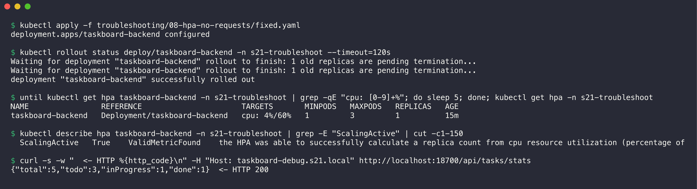

```console
$ kubectl apply -f troubleshooting/08-hpa-no-requests/fixed.yaml
deployment.apps/taskboard-backend configured

$ kubectl rollout status deploy/taskboard-backend -n s21-troubleshoot --timeout=120s
Waiting for deployment "taskboard-backend" rollout to finish: 1 old replicas are pending termination...
Waiting for deployment "taskboard-backend" rollout to finish: 1 old replicas are pending termination...
deployment "taskboard-backend" successfully rolled out

$ until kubectl get hpa taskboard-backend -n s21-troubleshoot | grep -qE "cpu: [0-9]+%"; do sleep 5; done; kubectl get hpa -n s21-troubleshoot
NAME                REFERENCE                      TARGETS       MINPODS   MAXPODS   REPLICAS   AGE
taskboard-backend   Deployment/taskboard-backend   cpu: 4%/60%   1         3         1          15m

$ kubectl describe hpa taskboard-backend -n s21-troubleshoot | grep -E "ScalingActive" | cut -c1-150
  ScalingActive   True    ValidMetricFound    the HPA was able to successfully calculate a replica count from cpu resource utilization (percentage of 

$ curl -s -w "  <- HTTP %{http_code}\n" -H "Host: taskboard-debug.s21.local" http://localhost:18700/api/tasks/stats
{"total":5,"todo":3,"inProgress":1,"done":1}  <- HTTP 200
```

After the last scenario, I deleted the namespace `s21-troubleshoot`.

### Problems that I found and fixed during the project (not planned)

These real problems came up while I built the project. Each one is described in its section:

| Problem | Section |
|---|---|
| Backend Pods restarted 3 times at first start (migration before PostgreSQL was ready) → init container `wait-for-db` | 6, Step 1 |
| `pg_isready` returned "no attempt" in the init container (UID 10001 has no user name) → `-U healthcheck` | 6, Step 1 |
| HTTP 502 during `helm rollback` (old Pod stopped before ingress-nginx removed it) → `preStop` sleep | 7, Step 3 |
| Security gate blocked the frontend image (43 fixed HIGH CVEs in `nginx:1.29-alpine`) → `nginx:1.31-alpine` + `apk upgrade` | 10 |
| IaC scan: 4 CRITICAL and 4 HIGH findings in Terraform, 2 HIGH in Kubernetes/Helm → fixed or accepted with a reason | 10 |
| Moto did not have the AWS managed IAM policies → `MOTO_IAM_LOAD_MANAGED_POLICIES=true` | 8, Step 1 |
| Gitleaks found the base64 demo password in this README and the gate stopped the pipeline → one exact allowlist entry | 9, 10 |
| act runs of a scratch repository failed with `trivy: command not found` (shared act cache) → separate `--cache-server-path` | 9 |

---

## 14. Screenshots

All screenshots are in [`screenshots/`](screenshots/). The terminal screenshots show real commands and their real output. The browser screenshots come from headless Chrome.

**Application and Docker (sections 4, 5)**

| Screenshot | Shows |
|---|---|
| [`backend-pytest.png`](screenshots/backend-pytest.png) | pytest: 14 tests pass, 97% coverage |
| [`docker-build-v110.png`](screenshots/docker-build-v110.png) | build both images and load them into minikube |
| [`docker-images.png`](screenshots/docker-images.png) | image sizes, non-root users, no build tools in the runtime images |
| [`docker-compose-up.png`](screenshots/docker-compose-up.png) | docker compose up --build |
| [`docker-compose-api.png`](screenshots/docker-compose-api.png) | API through Docker Compose, non-root ids, metrics |
| [`app-docker-compose.png`](screenshots/app-docker-compose.png) | UI in the browser (Docker Compose) |
| [`app-swagger-docs.png`](screenshots/app-swagger-docs.png) | Swagger UI |
| [`docker-compose-down.png`](screenshots/docker-compose-down.png) | docker compose down -v |
| [`minikube-image-load.png`](screenshots/minikube-image-load.png) | first image load (version 1.0.0) |

**Kubernetes (section 6)**

| Screenshot | Shows |
|---|---|
| [`k8s-apply.png`](screenshots/k8s-apply.png) | kubectl apply -f kubernetes/ |
| [`k8s-resources.png`](screenshots/k8s-resources.png) | Deployments, StatefulSet, Pods, Services, PVC |
| [`k8s-config-ingress-hpa.png`](screenshots/k8s-config-ingress-hpa.png) | ConfigMap, Secret, Ingress, HPA |
| [`k8s-ingress-curl.png`](screenshots/k8s-ingress-curl.png) | requests through the Ingress |
| [`app-k8s-ingress.png`](screenshots/app-k8s-ingress.png) | UI through the Ingress host |
| [`k8s-probes.png`](screenshots/k8s-probes.png) | startup, liveness and readiness probes |
| [`k8s-postgres-persistence.png`](screenshots/k8s-postgres-persistence.png) | data survives a PostgreSQL Pod restart |
| [`hpa-load-start.png`](screenshots/hpa-load-start.png) | load test start |
| [`hpa-scaled-out.png`](screenshots/hpa-scaled-out.png) | HPA scaled the backend to 5 Pods |
| [`hpa-watch-scale-down.png`](screenshots/hpa-watch-scale-down.png) | HPA watch log and scale down |
| [`k8s-rolling-update.png`](screenshots/k8s-rolling-update.png) | rolling update to 1.1.0 |
| [`k8s-final-verify.png`](screenshots/k8s-final-verify.png) | final check of the hardened manifests |

**Helm (section 7)**

| Screenshot | Shows |
|---|---|
| [`helm-install.png`](screenshots/helm-install.png) | helm install (revision 1) |
| [`helm-rev1-check.png`](screenshots/helm-rev1-check.png) | revision 1 runs version 1.0.0 |
| [`helm-upgrade.png`](screenshots/helm-upgrade.png) | helm upgrade with 0 failed requests |
| [`app-helm-v110.png`](screenshots/app-helm-v110.png) | UI after the upgrade |
| [`helm-rollback.png`](screenshots/helm-rollback.png) | helm rollback with 0 failed requests |
| [`helm-rollback-502-before-prestop.png`](screenshots/helm-rollback-502-before-prestop.png) | first rollback: HTTP 502 before the preStop fix |
| [`helm-upgrade-again-test.png`](screenshots/helm-upgrade-again-test.png) | revision 4 and helm test |
| [`helm-values-prod.png`](screenshots/helm-values-prod.png) | lint and render with values-prod.yaml |

**Terraform on the Moto emulator (section 8)**

| Screenshot | Shows |
|---|---|
| [`tf-init.png`](screenshots/tf-init.png) | Moto container, dummy credentials, terraform init |
| [`tf-fmt-validate.png`](screenshots/tf-fmt-validate.png) | fmt and validate |
| [`tf-plan.png`](screenshots/tf-plan.png) | plan: 41 resources |
| [`tf-apply.png`](screenshots/tf-apply.png) | apply complete |
| [`tf-output.png`](screenshots/tf-output.png) | outputs |
| [`tf-verify-emulator.png`](screenshots/tf-verify-emulator.png) | AWS CLI against the emulator |
| [`tf-destroy.png`](screenshots/tf-destroy.png) | destroy complete |

**CI/CD and DevSecOps (sections 9, 10)**

| Screenshot | Shows |
|---|---|
| [`github-actions-run.png`](screenshots/github-actions-run.png) | GitHub Actions: all 10 jobs succeeded on GitHub-hosted runners |
| [`github-deploy-smoke-test.png`](screenshots/github-deploy-smoke-test.png) | GitHub Actions: Helm deploy to kind, `helm test` and smoke test |
| [`act-jobs.png`](screenshots/act-jobs.png) | act: all 10 jobs succeeded |
| [`act-build-test.png`](screenshots/act-build-test.png) | act: tests and frontend build |
| [`act-scans.png`](screenshots/act-scans.png) | act: SAST, SCA, IaC and image scan output |
| [`act-gate-pass.png`](screenshots/act-gate-pass.png) | act: security gate passed |
| [`act-deploy.png`](screenshots/act-deploy.png) | act: push and deploy jobs (GHCR and kind skipped under act) |
| [`act-gate-fail.png`](screenshots/act-gate-fail.png) | act: security gate stops the vulnerable frontend image |
| [`act-gate-blocked-readme.png`](screenshots/act-gate-blocked-readme.png) | act: security gate stopped a run because of a README line |
| [`security-gate-local-pass.png`](screenshots/security-gate-local-pass.png) | local gate run: pass |
| [`security-gate-local-fail.png`](screenshots/security-gate-local-fail.png) | local gate run: fail with the old frontend base |

**Monitoring (section 11)**

| Screenshot | Shows |
|---|---|
| [`prometheus-targets.png`](screenshots/prometheus-targets.png) | Prometheus targets UP |
| [`alerts-firing-cli.png`](screenshots/alerts-firing-cli.png) | alerts in state `firing` during the load test |
| [`prometheus-alerts-firing.png`](screenshots/prometheus-alerts-firing.png) | Prometheus Alerts page |
| [`alertmanager-alerts.png`](screenshots/alertmanager-alerts.png) | Alertmanager |
| [`grafana-dashboard-after-load.png`](screenshots/grafana-dashboard-after-load.png) | Grafana dashboard, first load test |
| [`grafana-dashboard-load.png`](screenshots/grafana-dashboard-load.png) | Grafana dashboard, second load test |
| [`loki-logs-cli.png`](screenshots/loki-logs-cli.png) | Loki LogQL queries |

**GitOps (section 12)**

| Screenshot | Shows |
|---|---|
| [`gitops-push-gitea.png`](screenshots/gitops-push-gitea.png) | Gitea repository and webhook |
| [`gitops-app-create.png`](screenshots/gitops-app-create.png) | Argo CD Application created |
| [`gitops-app-synced.png`](screenshots/gitops-app-synced.png) | Application Synced and Healthy |
| [`argocd-ui-app-tree.png`](screenshots/argocd-ui-app-tree.png) | Argo CD UI resource tree |
| [`gitops-git-commit.png`](screenshots/gitops-git-commit.png) | Git commit that changes the cluster |
| [`gitops-synced-commit.png`](screenshots/gitops-synced-commit.png) | Argo CD synced the commit |
| [`argocd-ui-history.png`](screenshots/argocd-ui-history.png) | Argo CD history |
| [`gitops-drift-selfheal.png`](screenshots/gitops-drift-selfheal.png) | manual drift reverted |
| [`gitops-drift-events.png`](screenshots/gitops-drift-events.png) | self-heal events |

**Troubleshooting (section 13)**

| Screenshot | Shows |
|---|---|
| [`ts01-before.png`](screenshots/ts01-before.png) | 1: PVC Pending (before) |
| [`ts01-investigate.png`](screenshots/ts01-investigate.png) | 1: investigate |
| [`ts01-alert.png`](screenshots/ts01-alert.png) | 1: alert TaskboardPvcPending |
| [`ts01-after.png`](screenshots/ts01-after.png) | 1: fix |
| [`ts01-verify.png`](screenshots/ts01-verify.png) | 1: verify (after) |
| [`ts02-before.png`](screenshots/ts02-before.png) | 2: ImagePullBackOff (before) |
| [`ts02-investigate.png`](screenshots/ts02-investigate.png) | 2: investigate |
| [`ts02-after.png`](screenshots/ts02-after.png) | 2: fix and verify (after) |
| [`ts03-before.png`](screenshots/ts03-before.png) | 3: CreateContainerConfigError (before) |
| [`ts03-investigate.png`](screenshots/ts03-investigate.png) | 3: investigate |
| [`ts03-after.png`](screenshots/ts03-after.png) | 3: fix and verify (after) |
| [`ts04-before.png`](screenshots/ts04-before.png) | 4: CrashLoopBackOff (before) |
| [`ts04-investigate.png`](screenshots/ts04-investigate.png) | 4: investigate |
| [`ts04-after.png`](screenshots/ts04-after.png) | 4: fix and verify (after) |
| [`ts05-before.png`](screenshots/ts05-before.png) | 5: Pod not Ready (before) |
| [`ts05-investigate.png`](screenshots/ts05-investigate.png) | 5: investigate |
| [`ts05-alertmanager.png`](screenshots/ts05-alertmanager.png) | 5: alert in Alertmanager |
| [`ts05-after.png`](screenshots/ts05-after.png) | 5: fix and verify (after) |
| [`ts06-before.png`](screenshots/ts06-before.png) | 6: no endpoints, 503 (before) |
| [`ts06-browser-broken.png`](screenshots/ts06-browser-broken.png) | 6: UI shows Backend unavailable |
| [`ts06-investigate.png`](screenshots/ts06-investigate.png) | 6: investigate |
| [`ts06-after.png`](screenshots/ts06-after.png) | 6: fix and verify (after) |
| [`ts06-browser-fixed.png`](screenshots/ts06-browser-fixed.png) | 6: UI works again |
| [`ts07-before.png`](screenshots/ts07-before.png) | 7: Ingress 503 (before) |
| [`ts07-investigate.png`](screenshots/ts07-investigate.png) | 7: investigate |
| [`ts07-after.png`](screenshots/ts07-after.png) | 7: fix and verify (after) |
| [`ts08-before.png`](screenshots/ts08-before.png) | 8: HPA unknown (before) |
| [`ts08-investigate.png`](screenshots/ts08-investigate.png) | 8: investigate |
| [`ts08-after.png`](screenshots/ts08-after.png) | 8: fix and verify (after) |

---

## 15. Lessons learned

1. **Probes need a clear job each.** The liveness probe must not call the database. If it does, a database problem restarts all API Pods and makes the problem bigger. The readiness probe is the correct place for the database check. A startup probe protects slow starts (migrations).
2. **Start order is not guaranteed.** Kubernetes starts all Pods at the same time. An init container that waits for PostgreSQL removed the restarts at first start. An advisory lock makes two Alembic migrations at the same time safe.
3. **Zero downtime needs a `preStop` wait.** `maxUnavailable: 0` alone did not prevent 502 errors during a rollback. The ingress controller needs some seconds to remove a Pod that stops. A 5-second `preStop` sleep gave 0 failed requests in 303 probe requests.
4. **Immutable fields change the fix.** A StatefulSet `volumeClaimTemplate` cannot change. A wrong StorageClass needs a delete of the StatefulSet and the Pending PVC. Never delete a `Bound` PVC of a database without a backup.
5. **A Secret value is not the database state.** `POSTGRES_PASSWORD` works only for an empty data directory. A password rotation must change the password in the database too, and the Secret should keep the previous value until all Pods use the new one.
6. **Use names, not numbers, for ports.** The Ingress and the ServiceMonitor refer to the Service port name `http`. A change of the port number does not break them. Scenario 7 (and the class project) shows the number problem.
7. **The HPA needs CPU requests.** Without `requests.cpu`, the HPA shows `<unknown>` and does not scale. A load test must use `Connection: close`, or one keep-alive connection sends all requests to one Pod.
8. **A security gate is useful only if it can fail.** The gate blocked my first frontend image because of 43 fixed CVEs in an old base image. One `apk upgrade` and a newer base fixed all of them. Scan reports as artifacts plus one gate job make the decision easy to read.
9. **IaC scans find real design gaps.** Trivy config found a public EKS endpoint and no KMS encryption in my Terraform. I fixed most findings and wrote a reason and an expiry date for the one that I accepted.
10. **GitOps makes manual changes temporary.** With `selfHeal`, Argo CD reverted my `kubectl scale` and `kubectl patch` in about one second. All changes must go through Git, which also gives an audit trail (commit, author, time).
11. **Emulators have limits.** Moto accepted the full EKS design and made a demo of `init`, `plan`, `apply` and `destroy` possible without an AWS account. But it needs extra settings (managed policies), finishes in seconds, and shows phantom changes in a second plan. It does not prove that the code works on real AWS.
12. **Local pipeline runs save time.** `act` ran all 10 jobs on my laptop before the push. I found and fixed output problems (empty Trivy tables), a cache problem of act, and a secret in my own README before GitHub ran the workflow.

---

## 16. Cleanup

At the end of the work, I removed everything that I created in the shared cluster and on my Mac:

1. Deleted the namespaces `s21-taskboard`, `s21-helm` (after `helm uninstall`), `s21-gitops` (through the Argo CD Application finalizer), `s21-troubleshoot` and `s21-monitoring`.
2. Deleted the Argo CD Application `s21-taskboard-gitops`. The Gitea repository `taskboard-gitops` stays in Gitea as a record of the GitOps history.
3. Stopped all `kubectl port-forward` processes (ports 18700 to 18706).
4. Stopped and removed the Moto container `moto-s21`, the two `socat` forwarder containers and the `act` job containers.
5. Removed the TaskBoard images from the minikube node (`minikube image rm`) and the act-built `ghcr.io/kartavya37/*` images from Docker.
6. Deleted `.terraform/`, all `*.tfstate*` files and the plan file, `node_modules/`, `dist/`, `__pycache__/` and `.coverage`.

The shared platform (`monitoring`, `argocd`, `gitea`, `ingress-nginx`) continues to run.
