# Task 1: Helm Commands

This folder contains the hands-on practice for all important Helm commands. Each section gives the command, what it does, the real output, and a screenshot.

- Chart: [`myapp/`](myapp/) (made with `helm create`)
- Namespace: `s15-commands`
- Release name: `web`

## Environment

The demo used Helm v4.3.0 on a minikube cluster (Kubernetes v1.37, arm64).

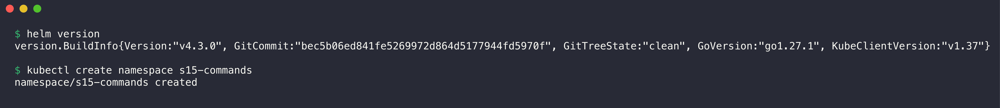

```console
$ helm version
version.BuildInfo{Version:"v4.3.0", GitCommit:"bec5b06ed841fe5269972d864d5177944fd5970f", GitTreeState:"clean", GoVersion:"go1.27.1", KubeClientVersion:"v1.37"}

$ kubectl create namespace s15-commands
namespace/s15-commands created
```

Helm 4 has some small differences from Helm 3, which the class notes use:

- `helm list` has no `--all` flag. Use the `--deployed`, `--failed`, `--superseded` or `--uninstalled` flags.
- `helm status` always shows the resources of the release. The `--show-resources` flag does not exist.
- `--atomic` has the new name `--rollback-on-failure`. [Task 2](../02-helm-rollback/README.md#extra-automatic-rollback-with---rollback-on-failure) shows it.
- Helm 4 applies manifests with server-side apply (`APPLY_METHOD: server-side apply` in `helm get metadata`).

## Command summary

| Command | What it does |
|---------|--------------|
| `helm create` | Makes a new chart directory with example templates. |
| `helm lint` | Examines a chart for errors and best-practice problems. |
| `helm template` | Renders the templates locally. It does not connect to the cluster. |
| `helm install --dry-run` | Renders the release and simulates the install. It does not create objects. |
| `helm install` | Installs a chart as a new release (revision 1). |
| `helm list` | Shows the releases in a namespace. |
| `helm status` | Shows the state, revision, resources and notes of one release. |
| `helm get` | Shows the stored data of a release: `values`, `manifest`, `notes`, `metadata`, `all`. |
| `helm upgrade` | Changes a release to a new chart version or new values. It makes a new revision. |
| `helm history` | Shows all revisions of a release. |
| `helm rollback` | Deploys the configuration of an earlier revision again, as a new revision. |
| `helm uninstall` | Removes the release and all its Kubernetes objects. |
| `helm repo` | Adds, updates, lists and removes chart repositories. |
| `helm search` | Finds charts in the added repositories (`repo`) or on Artifact Hub (`hub`). |

## 1. helm create

`helm create` makes a chart skeleton. The skeleton has a Deployment, a Service, a ServiceAccount, an optional Ingress, HTTPRoute and HPA, a test Pod, and `NOTES.txt`.

1. Run `helm create myapp`.
2. Examine the files.

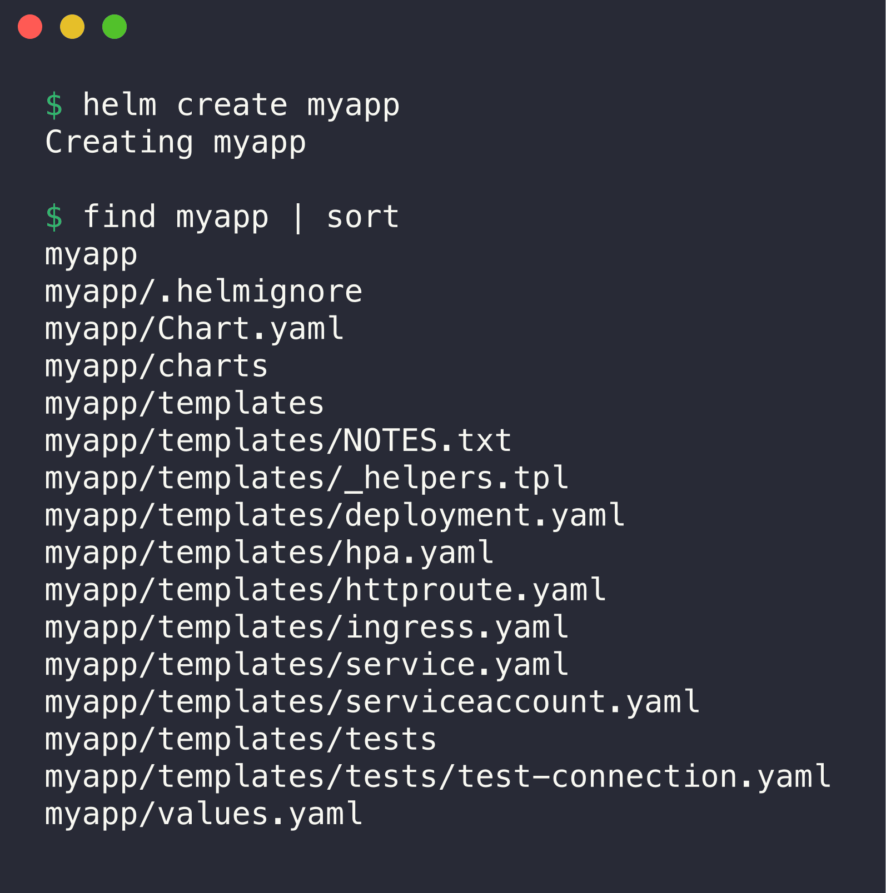

```console
$ helm create myapp
Creating myapp

$ find myapp | sort
myapp
myapp/.helmignore
myapp/Chart.yaml
myapp/charts
myapp/templates
myapp/templates/NOTES.txt
myapp/templates/_helpers.tpl
myapp/templates/deployment.yaml
myapp/templates/hpa.yaml
myapp/templates/httproute.yaml
myapp/templates/ingress.yaml
myapp/templates/service.yaml
myapp/templates/serviceaccount.yaml
myapp/templates/tests
myapp/templates/tests/test-connection.yaml
myapp/values.yaml
```

| File | Purpose |
|------|---------|
| `Chart.yaml` | Name, chart `version` and `appVersion` of the chart. |
| `values.yaml` | Default values for the templates. |
| `templates/` | Kubernetes YAML with Go template placeholders, for example `{{ .Values.replicaCount }}`. |
| `templates/_helpers.tpl` | Named templates (names and labels) that other templates include. |
| `templates/NOTES.txt` | Text that Helm shows after `install` and `upgrade`. |
| `charts/` | Dependency charts (empty here). |
| `.helmignore` | Files that `helm package` does not put in the package. |

After `helm create`, I made one change in [`myapp/Chart.yaml`](myapp/Chart.yaml): `appVersion: "1.27"`. The template uses `appVersion` as the image tag if `image.tag` is empty. Thus the default image is `nginx:1.27`, which has an arm64 build.

## 2. helm lint

`helm lint` examines the chart structure and the rendered YAML. It shows errors, warnings and information messages.

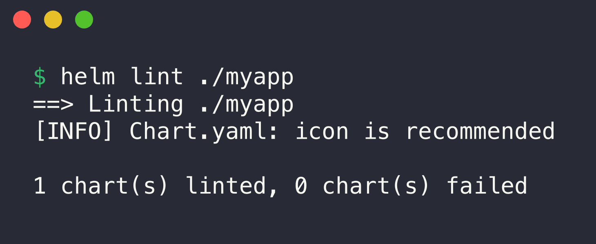

```console
$ helm lint ./myapp
==> Linting ./myapp
[INFO] Chart.yaml: icon is recommended

1 chart(s) linted, 0 chart(s) failed
```

The chart has no errors. The `[INFO]` line is only a recommendation.

## 3. helm template

`helm template` renders the templates on the local machine. Use it to examine the final YAML before an install. The `--show-only` flag shows one template.

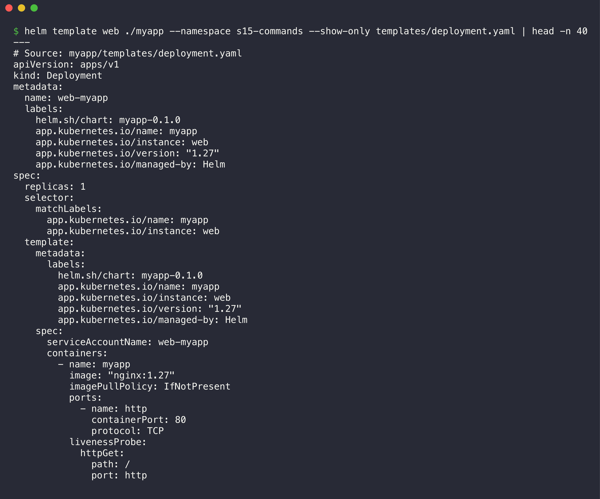

```console
$ helm template web ./myapp --namespace s15-commands --show-only templates/deployment.yaml | head -n 40
---
# Source: myapp/templates/deployment.yaml
apiVersion: apps/v1
kind: Deployment
metadata:
  name: web-myapp
  labels:
    helm.sh/chart: myapp-0.1.0
    app.kubernetes.io/name: myapp
    app.kubernetes.io/instance: web
    app.kubernetes.io/version: "1.27"
    app.kubernetes.io/managed-by: Helm
spec:
  replicas: 1
  selector:
    matchLabels:
      app.kubernetes.io/name: myapp
      app.kubernetes.io/instance: web
  template:
    metadata:
      labels:
        helm.sh/chart: myapp-0.1.0
        app.kubernetes.io/name: myapp
        app.kubernetes.io/instance: web
        app.kubernetes.io/version: "1.27"
        app.kubernetes.io/managed-by: Helm
    spec:
      serviceAccountName: web-myapp
      containers:
        - name: myapp
          image: "nginx:1.27"
          imagePullPolicy: IfNotPresent
          ports:
            - name: http
              containerPort: 80
              protocol: TCP
          livenessProbe:
            httpGet:
              path: /
              port: http
```

Helm replaced all placeholders. The release name `web` and the chart name `myapp` give the object name `web-myapp`.

## 4. helm install --dry-run

`--dry-run=server` renders the release and sends it to the API server for validation. Kubernetes does not create objects. `--dry-run=client` does the same without the API server.

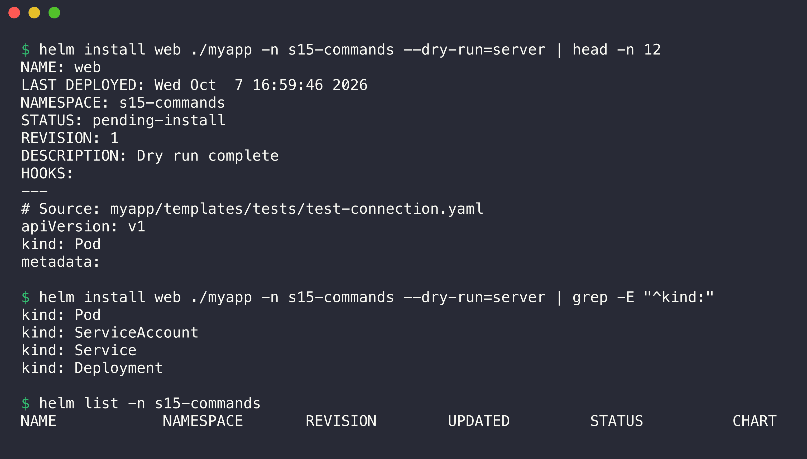

```console
$ helm install web ./myapp -n s15-commands --dry-run=server | head -n 12
NAME: web
LAST DEPLOYED: Wed Oct  7 16:59:46 2026
NAMESPACE: s15-commands
STATUS: pending-install
REVISION: 1
DESCRIPTION: Dry run complete
HOOKS:
---
# Source: myapp/templates/tests/test-connection.yaml
apiVersion: v1
kind: Pod
metadata:

$ helm install web ./myapp -n s15-commands --dry-run=server | grep -E "^kind:"
kind: Pod
kind: ServiceAccount
kind: Service
kind: Deployment

$ helm list -n s15-commands
NAME	NAMESPACE	REVISION	UPDATED	STATUS	CHART	APP VERSION
```

The status is `pending-install` and the description is `Dry run complete`. The empty `helm list` shows that Helm did not create a release. The `Pod` is the test hook, which only runs with `helm test`.

## 5. helm install

`helm install <release> <chart>` installs the chart. Helm stores the release as revision 1 in a Secret in the namespace.

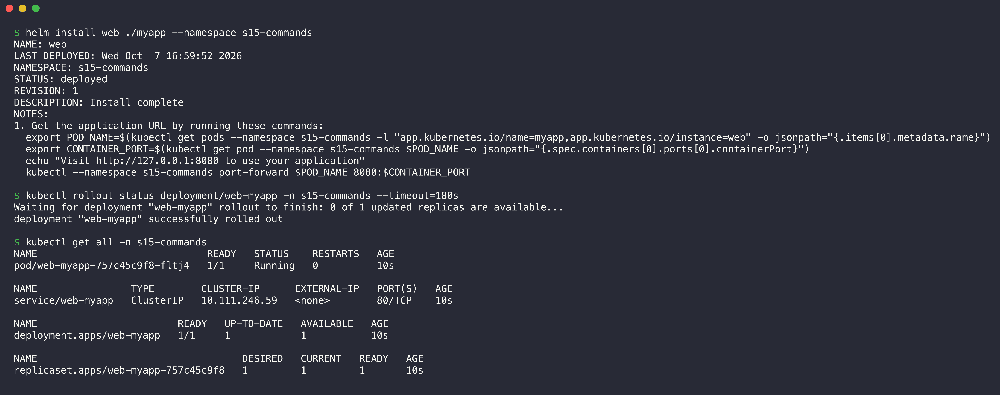

```console
$ helm install web ./myapp --namespace s15-commands
NAME: web
LAST DEPLOYED: Wed Oct  7 16:59:52 2026
NAMESPACE: s15-commands
STATUS: deployed
REVISION: 1
DESCRIPTION: Install complete
NOTES:
1. Get the application URL by running these commands:
  export POD_NAME=$(kubectl get pods --namespace s15-commands -l "app.kubernetes.io/name=myapp,app.kubernetes.io/instance=web" -o jsonpath="{.items[0].metadata.name}")
  export CONTAINER_PORT=$(kubectl get pod --namespace s15-commands $POD_NAME -o jsonpath="{.spec.containers[0].ports[0].containerPort}")
  echo "Visit http://127.0.0.1:8080 to use your application"
  kubectl --namespace s15-commands port-forward $POD_NAME 8080:$CONTAINER_PORT

$ kubectl rollout status deployment/web-myapp -n s15-commands --timeout=180s
Waiting for deployment "web-myapp" rollout to finish: 0 of 1 updated replicas are available...
deployment "web-myapp" successfully rolled out

$ kubectl get all -n s15-commands
NAME                             READY   STATUS    RESTARTS   AGE
pod/web-myapp-757c45c9f8-fltj4   1/1     Running   0          10s

NAME                TYPE        CLUSTER-IP      EXTERNAL-IP   PORT(S)   AGE
service/web-myapp   ClusterIP   10.111.246.59   <none>        80/TCP    10s

NAME                        READY   UP-TO-DATE   AVAILABLE   AGE
deployment.apps/web-myapp   1/1     1            1           10s

NAME                                   DESIRED   CURRENT   READY   AGE
replicaset.apps/web-myapp-757c45c9f8   1         1         1       10s
```

The `NOTES` part comes from `templates/NOTES.txt`. Helm rendered it with the real namespace and labels.

To test the application, I used a port-forward on local port 18300 (in the background) and `curl`:

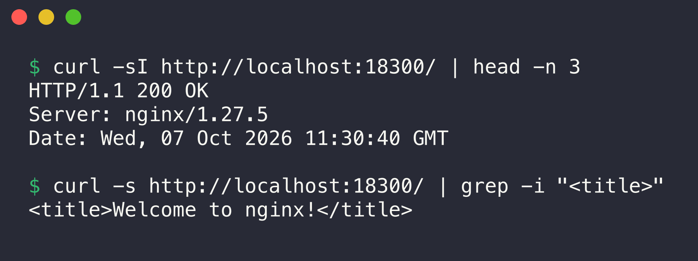

```console
$ curl -sI http://localhost:18300/ | head -n 3
HTTP/1.1 200 OK
Server: nginx/1.27.5
Date: Wed, 07 Oct 2026 11:30:40 GMT

$ curl -s http://localhost:18300/ | grep -i "<title>"
<title>Welcome to nginx!</title>
```

## 6. helm list

`helm list` shows the releases in the current namespace. `-A` (`--all-namespaces`) shows all namespaces. `--filter` takes a regular expression.

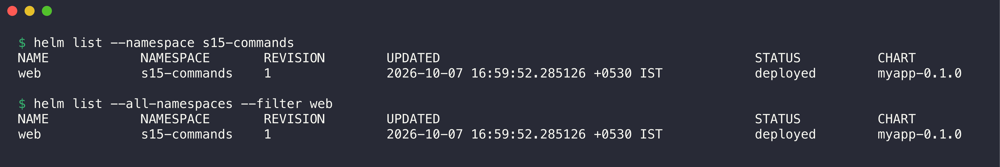

```console
$ helm list --namespace s15-commands
NAME	NAMESPACE   	REVISION	UPDATED                             	STATUS  	CHART      	APP VERSION
web 	s15-commands	1       	2026-10-07 16:59:52.285126 +0530 IST	deployed	myapp-0.1.0	1.27

$ helm list --all-namespaces --filter web
NAME	NAMESPACE   	REVISION	UPDATED                             	STATUS  	CHART      	APP VERSION
web 	s15-commands	1       	2026-10-07 16:59:52.285126 +0530 IST	deployed	myapp-0.1.0	1.27
```

## 7. helm status

`helm status` shows the state of one release: last deploy time, revision, the Kubernetes resources, and the notes.

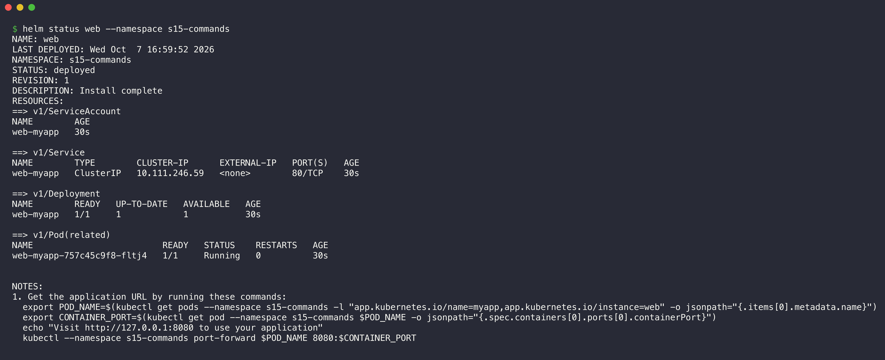

```console
$ helm status web --namespace s15-commands
NAME: web
LAST DEPLOYED: Wed Oct  7 16:59:52 2026
NAMESPACE: s15-commands
STATUS: deployed
REVISION: 1
DESCRIPTION: Install complete
RESOURCES:
==> v1/ServiceAccount
NAME        AGE
web-myapp   30s

==> v1/Service
NAME        TYPE        CLUSTER-IP      EXTERNAL-IP   PORT(S)   AGE
web-myapp   ClusterIP   10.111.246.59   <none>        80/TCP    30s

==> v1/Deployment
NAME        READY   UP-TO-DATE   AVAILABLE   AGE
web-myapp   1/1     1            1           30s

==> v1/Pod(related)
NAME                         READY   STATUS    RESTARTS   AGE
web-myapp-757c45c9f8-fltj4   1/1     Running   0          30s


NOTES:
1. Get the application URL by running these commands:
  export POD_NAME=$(kubectl get pods --namespace s15-commands -l "app.kubernetes.io/name=myapp,app.kubernetes.io/instance=web" -o jsonpath="{.items[0].metadata.name}")
  export CONTAINER_PORT=$(kubectl get pod --namespace s15-commands $POD_NAME -o jsonpath="{.spec.containers[0].ports[0].containerPort}")
  echo "Visit http://127.0.0.1:8080 to use your application"
  kubectl --namespace s15-commands port-forward $POD_NAME 8080:$CONTAINER_PORT
```

## 8. helm get

`helm get` reads the data that Helm stored for a release. Each subcommand shows one part.

### helm get values

`helm get values` shows the values that the user supplied. `--all` shows the computed values (defaults plus user values).

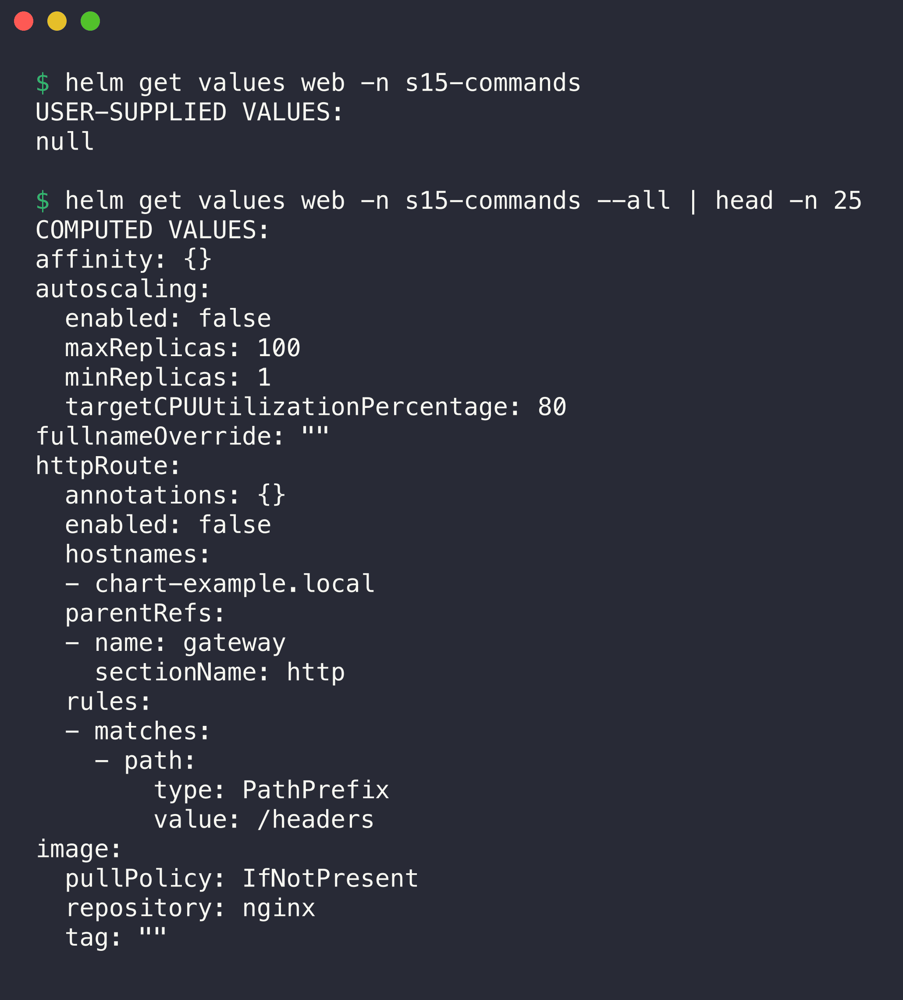

```console
$ helm get values web -n s15-commands
USER-SUPPLIED VALUES:
null

$ helm get values web -n s15-commands --all | head -n 25
COMPUTED VALUES:
affinity: {}
autoscaling:
  enabled: false
  maxReplicas: 100
  minReplicas: 1
  targetCPUUtilizationPercentage: 80
fullnameOverride: ""
httpRoute:
  annotations: {}
  enabled: false
  hostnames:
  - chart-example.local
  parentRefs:
  - name: gateway
    sectionName: http
  rules:
  - matches:
    - path:
        type: PathPrefix
        value: /headers
image:
  pullPolicy: IfNotPresent
  repository: nginx
  tag: ""
```

The user values are `null` because the install used only the defaults from `values.yaml`.

### helm get manifest and helm get notes

`helm get manifest` shows the rendered YAML that Helm applied. `helm get notes` shows the rendered `NOTES.txt`.

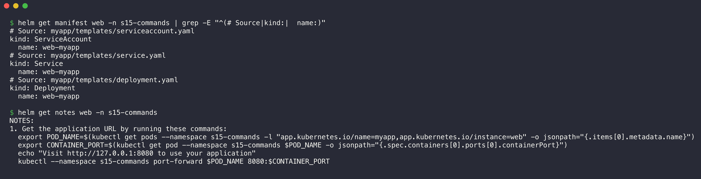

```console
$ helm get manifest web -n s15-commands | grep -E "^(# Source|kind:|  name:)"
# Source: myapp/templates/serviceaccount.yaml
kind: ServiceAccount
  name: web-myapp
# Source: myapp/templates/service.yaml
kind: Service
  name: web-myapp
# Source: myapp/templates/deployment.yaml
kind: Deployment
  name: web-myapp

$ helm get notes web -n s15-commands
NOTES:
1. Get the application URL by running these commands:
  export POD_NAME=$(kubectl get pods --namespace s15-commands -l "app.kubernetes.io/name=myapp,app.kubernetes.io/instance=web" -o jsonpath="{.items[0].metadata.name}")
  export CONTAINER_PORT=$(kubectl get pod --namespace s15-commands $POD_NAME -o jsonpath="{.spec.containers[0].ports[0].containerPort}")
  echo "Visit http://127.0.0.1:8080 to use your application"
  kubectl --namespace s15-commands port-forward $POD_NAME 8080:$CONTAINER_PORT
```

The manifest has only three objects. The Ingress, HTTPRoute and HPA templates are off by default (`enabled: false`).

### helm get all and helm get metadata

`helm get all` shows all parts in one output: metadata, user values, computed values, hooks, manifest and notes. `helm get metadata` shows only the release metadata.

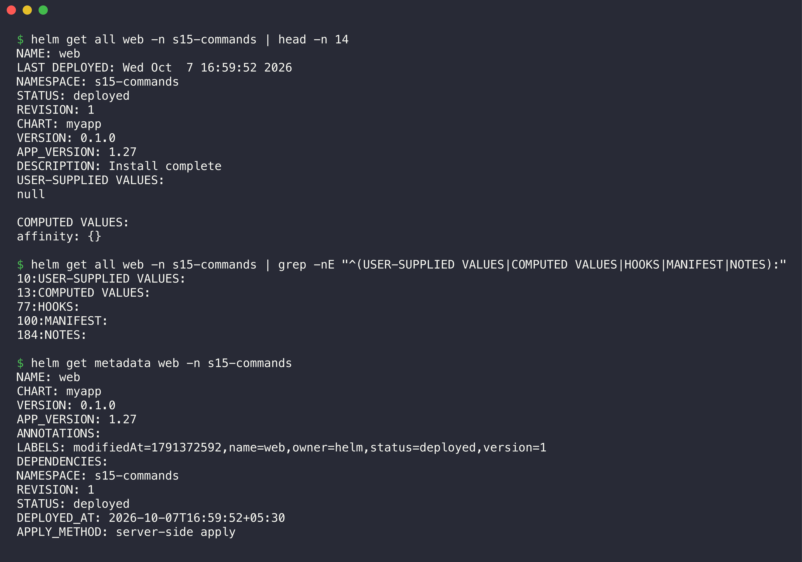

```console
$ helm get all web -n s15-commands | head -n 14
NAME: web
LAST DEPLOYED: Wed Oct  7 16:59:52 2026
NAMESPACE: s15-commands
STATUS: deployed
REVISION: 1
CHART: myapp
VERSION: 0.1.0
APP_VERSION: 1.27
DESCRIPTION: Install complete
USER-SUPPLIED VALUES:
null

COMPUTED VALUES:
affinity: {}

$ helm get all web -n s15-commands | grep -nE "^(USER-SUPPLIED VALUES|COMPUTED VALUES|HOOKS|MANIFEST|NOTES):"
10:USER-SUPPLIED VALUES:
13:COMPUTED VALUES:
77:HOOKS:
100:MANIFEST:
184:NOTES:

$ helm get metadata web -n s15-commands
NAME: web
CHART: myapp
VERSION: 0.1.0
APP_VERSION: 1.27
ANNOTATIONS:
LABELS: modifiedAt=1791372592,name=web,owner=helm,status=deployed,version=1
DEPENDENCIES:
NAMESPACE: s15-commands
REVISION: 1
STATUS: deployed
DEPLOYED_AT: 2026-10-07T16:59:52+05:30
APPLY_METHOD: server-side apply
```

The `grep -n` output shows the line numbers where each part starts.

## 9. helm upgrade

`helm upgrade` changes an existing release. `--set` overrides one value. `--wait` makes Helm wait until the new Pods are ready. Each upgrade makes a new revision.

1. Increase the replicas to 2.
2. Change the image tag to `1.28-alpine`.


```console
$ helm upgrade web ./myapp -n s15-commands --set replicaCount=2 --set image.tag=1.28-alpine --wait --timeout 3m | head -n 7
Release "web" has been upgraded. Happy Helming!
NAME: web
LAST DEPLOYED: Wed Oct  7 17:00:45 2026
NAMESPACE: s15-commands
STATUS: deployed
REVISION: 2
DESCRIPTION: Upgrade complete

$ kubectl get deploy,pods -n s15-commands -o wide | cut -c1-120
NAME                        READY   UP-TO-DATE   AVAILABLE   AGE   CONTAINERS   IMAGES              SELECTOR
deployment.apps/web-myapp   2/2     2            2           73s   myapp        nginx:1.28-alpine   app.kubernetes.io/in

NAME                             READY   STATUS      RESTARTS   AGE   IP            NODE       NOMINATED NODE   READINES
pod/web-myapp-757c45c9f8-fltj4   0/1     Completed   0          73s   10.244.0.9    minikube   <none>           <none>
pod/web-myapp-784fc8dcdc-nkw7h   1/1     Running     0          1s    10.244.0.22   minikube   <none>           <none>
pod/web-myapp-784fc8dcdc-rr7zt   1/1     Running     0          19s   10.244.0.18   minikube   <none>           <none>

$ helm get values web -n s15-commands
USER-SUPPLIED VALUES:
image:
  tag: 1.28-alpine
replicaCount: 2
```

The release is now at revision 2. One old Pod from revision 1 shows `Completed` because it was in the stop process. `helm get values` now shows the two user values.

## 10. helm history

`helm history` shows all revisions of a release, with the status and a description.

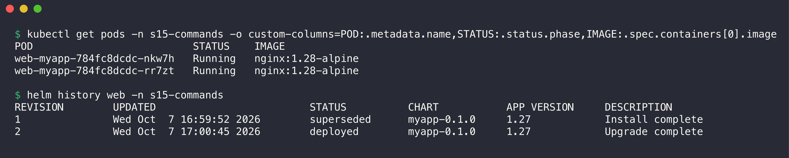

```console
$ kubectl get pods -n s15-commands -o custom-columns=POD:.metadata.name,STATUS:.status.phase,IMAGE:.spec.containers[0].image
POD                          STATUS    IMAGE
web-myapp-784fc8dcdc-nkw7h   Running   nginx:1.28-alpine
web-myapp-784fc8dcdc-rr7zt   Running   nginx:1.28-alpine

$ helm history web -n s15-commands
REVISION	UPDATED                 	STATUS    	CHART      	APP VERSION	DESCRIPTION     
1       	Wed Oct  7 16:59:52 2026	superseded	myapp-0.1.0	1.27       	Install complete
2       	Wed Oct  7 17:00:45 2026	deployed  	myapp-0.1.0	1.27       	Upgrade complete
```

Revision 1 is `superseded`. Revision 2 is `deployed`. Both Pods use `nginx:1.28-alpine`.

## 11. helm rollback

`helm rollback <release> <revision>` deploys the stored configuration of an earlier revision again. Helm does not delete history. It makes a new revision.

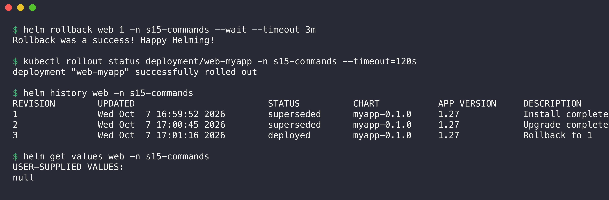

```console
$ helm rollback web 1 -n s15-commands --wait --timeout 3m
Rollback was a success! Happy Helming!

$ kubectl rollout status deployment/web-myapp -n s15-commands --timeout=120s
deployment "web-myapp" successfully rolled out

$ helm history web -n s15-commands
REVISION	UPDATED                 	STATUS    	CHART      	APP VERSION	DESCRIPTION     
1       	Wed Oct  7 16:59:52 2026	superseded	myapp-0.1.0	1.27       	Install complete
2       	Wed Oct  7 17:00:45 2026	superseded	myapp-0.1.0	1.27       	Upgrade complete
3       	Wed Oct  7 17:01:16 2026	deployed  	myapp-0.1.0	1.27       	Rollback to 1   

$ helm get values web -n s15-commands
USER-SUPPLIED VALUES:
null
```

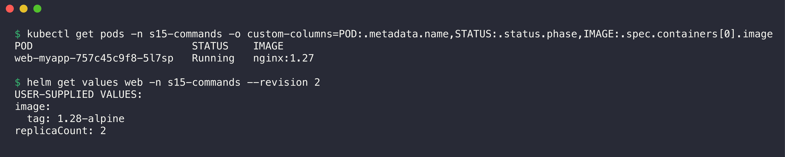

```console
$ kubectl get pods -n s15-commands -o custom-columns=POD:.metadata.name,STATUS:.status.phase,IMAGE:.spec.containers[0].image
POD                          STATUS    IMAGE
web-myapp-757c45c9f8-5l7sp   Running   nginx:1.27

$ helm get values web -n s15-commands --revision 2
USER-SUPPLIED VALUES:
image:
  tag: 1.28-alpine
replicaCount: 2
```

Revision 3 has the description `Rollback to 1`. The release has one Pod with `nginx:1.27` again. The Pod name has the same ReplicaSet hash (`757c45c9f8`) as revision 1. `--revision 2` shows that Helm keeps the values of old revisions.

## 12. helm repo

`helm repo add` adds a chart repository. `helm repo update` downloads the newest chart index of each repository. `helm repo list` shows the repositories.

> Note: Since 2025, Bitnami moved most of its free container images to a legacy repository. The Bitnami chart index still works for `helm search`. This demo uses Bitnami only for search, and installs only my own charts.

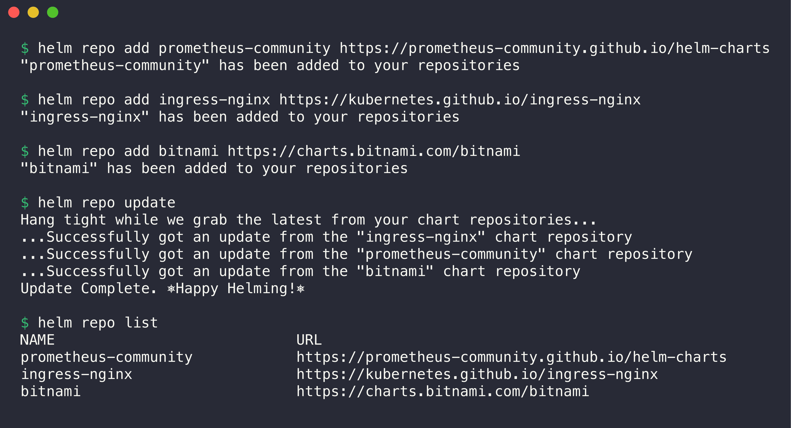

```console
$ helm repo add prometheus-community https://prometheus-community.github.io/helm-charts
"prometheus-community" has been added to your repositories

$ helm repo add ingress-nginx https://kubernetes.github.io/ingress-nginx
"ingress-nginx" has been added to your repositories

$ helm repo add bitnami https://charts.bitnami.com/bitnami
"bitnami" has been added to your repositories

$ helm repo update
Hang tight while we grab the latest from your chart repositories...
...Successfully got an update from the "ingress-nginx" chart repository
...Successfully got an update from the "prometheus-community" chart repository
...Successfully got an update from the "bitnami" chart repository
Update Complete. ⎈Happy Helming!⎈

$ helm repo list
NAME                	URL                                               
prometheus-community	https://prometheus-community.github.io/helm-charts
ingress-nginx       	https://kubernetes.github.io/ingress-nginx        
bitnami             	https://charts.bitnami.com/bitnami                
```

`helm repo remove` removes a repository from the local list:

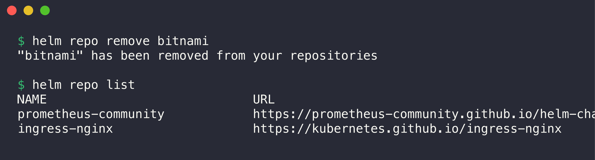

```console
$ helm repo remove bitnami
"bitnami" has been removed from your repositories

$ helm repo list
NAME                	URL                                               
prometheus-community	https://prometheus-community.github.io/helm-charts
ingress-nginx       	https://kubernetes.github.io/ingress-nginx        
```

The demo used a separate repository config file (`HELM_REPOSITORY_CONFIG`). Thus the demo did not change the repositories of other work on the same machine.

## 13. helm search

`helm search repo <keyword>` searches the local index of the added repositories. `--versions` shows all versions of a chart.

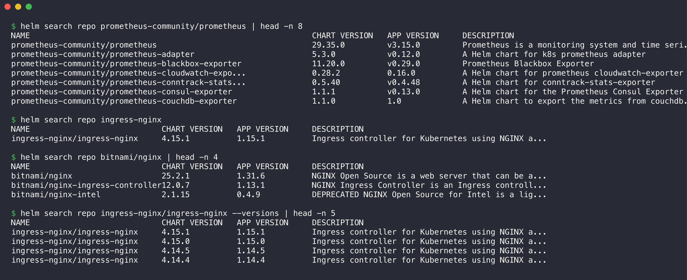

```console
$ helm search repo prometheus-community/prometheus | head -n 8
NAME                                              	CHART VERSION	APP VERSION	DESCRIPTION                                       
prometheus-community/prometheus                   	29.35.0      	v3.15.0    	Prometheus is a monitoring system and time seri...
prometheus-community/prometheus-adapter           	5.3.0        	v0.12.0    	A Helm chart for k8s prometheus adapter           
prometheus-community/prometheus-blackbox-exporter 	11.20.0      	v0.29.0    	Prometheus Blackbox Exporter                      
prometheus-community/prometheus-cloudwatch-expo...	0.28.2       	0.16.0     	A Helm chart for prometheus cloudwatch-exporter   
prometheus-community/prometheus-conntrack-stats...	0.5.40       	v0.4.48    	A Helm chart for conntrack-stats-exporter         
prometheus-community/prometheus-consul-exporter   	1.1.1        	v0.13.0    	A Helm chart for the Prometheus Consul Exporter   
prometheus-community/prometheus-couchdb-exporter  	1.1.0        	1.0        	A Helm chart to export the metrics from couchdb...

$ helm search repo ingress-nginx
NAME                       	CHART VERSION	APP VERSION	DESCRIPTION                                       
ingress-nginx/ingress-nginx	4.15.1       	1.15.1     	Ingress controller for Kubernetes using NGINX a...

$ helm search repo bitnami/nginx | head -n 4
NAME                            	CHART VERSION	APP VERSION	DESCRIPTION                                       
bitnami/nginx                   	25.2.1       	1.31.6     	NGINX Open Source is a web server that can be a...
bitnami/nginx-ingress-controller	12.0.7       	1.13.1     	NGINX Ingress Controller is an Ingress controll...
bitnami/nginx-intel             	2.1.15       	0.4.9      	DEPRECATED NGINX Open Source for Intel is a lig...

$ helm search repo ingress-nginx/ingress-nginx --versions | head -n 5
NAME                       	CHART VERSION	APP VERSION	DESCRIPTION                                       
ingress-nginx/ingress-nginx	4.15.1       	1.15.1     	Ingress controller for Kubernetes using NGINX a...
ingress-nginx/ingress-nginx	4.15.0       	1.15.0     	Ingress controller for Kubernetes using NGINX a...
ingress-nginx/ingress-nginx	4.14.5       	1.14.5     	Ingress controller for Kubernetes using NGINX a...
ingress-nginx/ingress-nginx	4.14.4       	1.14.4     	Ingress controller for Kubernetes using NGINX a...
```

`helm search hub <keyword>` searches Artifact Hub (artifacthub.io), which lists charts from many publishers. `helm show chart` shows the `Chart.yaml` of a chart from a repository.

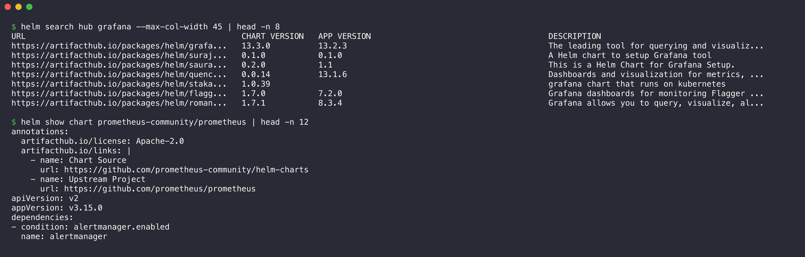

```console
$ helm search hub grafana --max-col-width 45 | head -n 8
URL                                          	CHART VERSION   	APP VERSION                             	DESCRIPTION                                  
https://artifacthub.io/packages/helm/grafa...	13.3.0          	13.2.3                                  	The leading tool for querying and visualiz...
https://artifacthub.io/packages/helm/suraj...	0.1.0           	0.1.0                                   	A Helm chart to setup Grafana tool           
https://artifacthub.io/packages/helm/saura...	0.2.0           	1.1                                     	This is a Helm Chart for Grafana Setup.      
https://artifacthub.io/packages/helm/quenc...	0.0.14          	13.1.6                                  	Dashboards and visualization for metrics, ...
https://artifacthub.io/packages/helm/staka...	1.0.39          	                                        	grafana chart that runs on kubernetes        
https://artifacthub.io/packages/helm/flagg...	1.7.0           	7.2.0                                   	Grafana dashboards for monitoring Flagger ...
https://artifacthub.io/packages/helm/roman...	1.7.1           	8.3.4                                   	Grafana allows you to query, visualize, al...

$ helm show chart prometheus-community/prometheus | head -n 12
annotations:
  artifacthub.io/license: Apache-2.0
  artifacthub.io/links: |
    - name: Chart Source
      url: https://github.com/prometheus-community/helm-charts
    - name: Upstream Project
      url: https://github.com/prometheus/prometheus
apiVersion: v2
appVersion: v3.15.0
dependencies:
- condition: alertmanager.enabled
  name: alertmanager
```

## 14. helm uninstall

`helm uninstall` removes all objects of the release. It also removes the release Secrets (the history), unless you use `--keep-history`.

I installed the release one more time (revision 1) to show the release Secret before and after the uninstall.

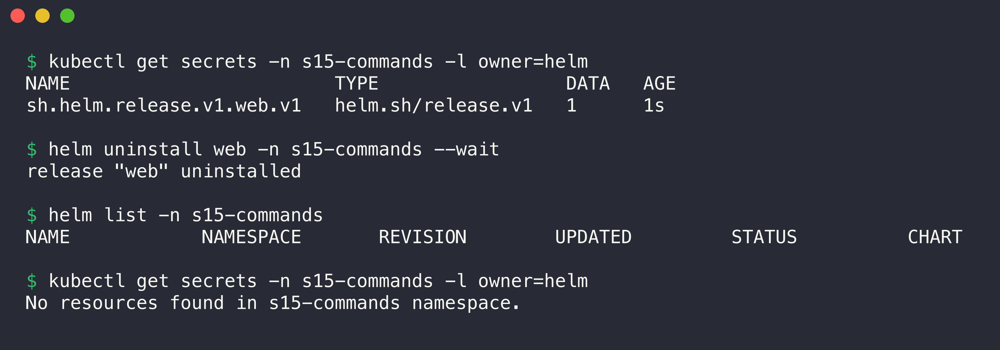

```console
$ kubectl get secrets -n s15-commands -l owner=helm
NAME                        TYPE                 DATA   AGE
sh.helm.release.v1.web.v1   helm.sh/release.v1   1      1s

$ helm uninstall web -n s15-commands --wait
release "web" uninstalled

$ helm list -n s15-commands
NAME	NAMESPACE	REVISION	UPDATED	STATUS	CHART	APP VERSION

$ kubectl get secrets -n s15-commands -l owner=helm
No resources found in s15-commands namespace.
```

The Secret `sh.helm.release.v1.web.v1` is the stored revision 1. After the uninstall, `helm list` is empty and the Secret is gone. Kubernetes then stopped the Pod. At the end of the session, I removed the namespace `s15-commands` (see [Task 2 cleanup](../02-helm-rollback/README.md#cleanup)).
