# Task 2: Helm Rollback

This folder contains a complete rollback workflow with a chart that I wrote. Each revision is visibly different: image tag, replica count and the message on the web page.

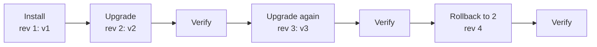

- Chart: [`web-chart/`](web-chart/)
- Namespace: `s15-rollback`
- Release name: `shop`
- Local port for the browser screenshots: 18310

## The chart

```text
web-chart/
├── Chart.yaml
├── values.yaml          # revision 1 (default values)
├── values-v2.yaml       # revision 2
├── values-v3.yaml       # revision 3 (the bad release)
└── templates/
    ├── _helpers.tpl     # names and labels
    ├── configmap.yaml   # index.html and version.txt
    ├── deployment.yaml  # nginx, mounts the ConfigMap
    ├── service.yaml     # ClusterIP Service
    └── NOTES.txt
```

| Revision | Values file | Image | Replicas | Page message | Color |
|----------|-------------|-------|----------|--------------|-------|
| 1 | [`values.yaml`](web-chart/values.yaml) | `nginx:1.27-alpine` | 1 | Version 1: first release | blue |
| 2 | [`values-v2.yaml`](web-chart/values-v2.yaml) | `nginx:1.28-alpine` | 2 | Version 2: stable release | green |
| 3 | [`values-v3.yaml`](web-chart/values-v3.yaml) | `nginx:1.29-alpine` | 3 | Version 3: BAD RELEASE | red |

Important parts of the templates:

- [`configmap.yaml`](web-chart/templates/configmap.yaml) renders `index.html` and `version.txt` from the values. It also writes `.Release.Revision`, the Helm revision that rendered the page.
- [`deployment.yaml`](web-chart/templates/deployment.yaml) mounts the ConfigMap at `/usr/share/nginx/html`. The `checksum/config` annotation is a hash of the ConfigMap. If the page changes, the hash changes, and Kubernetes starts new Pods.
- The Pod label `app-version` shows the version of each Pod in `kubectl get pods`.

### How I verified each revision

After each step, I ran the same three checks:

1. `kubectl get pods` with custom columns. This shows the Pod count, the image and the `app-version` label.
2. `curl` from a helper Pod (`curl`, image `curlimages/curl`) in the same namespace. This shows `version.txt` and the `Server` header of nginx (the real nginx version).
3. `helm history shop`.

I also took a browser screenshot of the page through `kubectl port-forward svc/shop-web-chart 18310:80`.

## Step 1: Install

1. Create the namespace.
2. Install the chart with the default values.

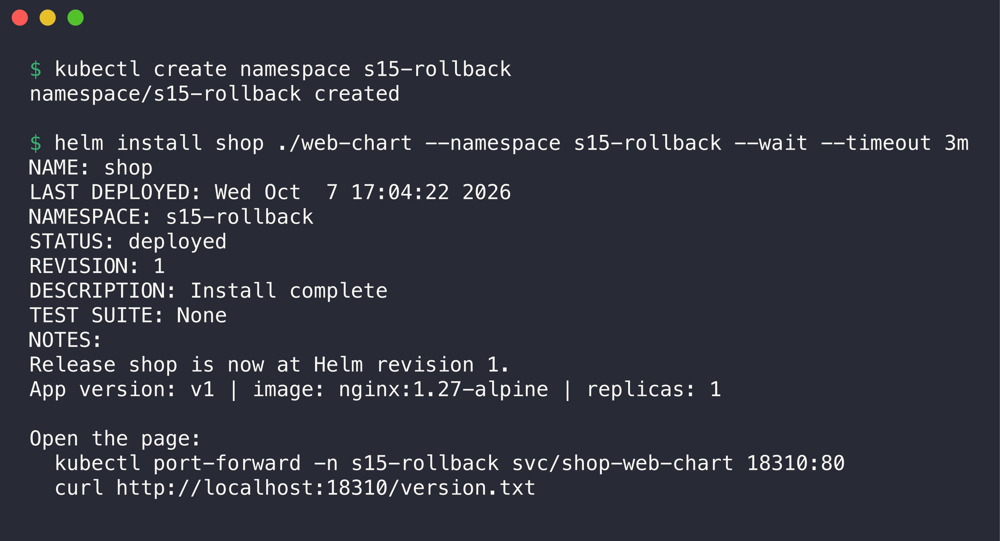

```console
$ kubectl create namespace s15-rollback
namespace/s15-rollback created

$ helm install shop ./web-chart --namespace s15-rollback --wait --timeout 3m
NAME: shop
LAST DEPLOYED: Wed Oct  7 17:04:22 2026
NAMESPACE: s15-rollback
STATUS: deployed
REVISION: 1
DESCRIPTION: Install complete
TEST SUITE: None
NOTES:
Release shop is now at Helm revision 1.
App version: v1 | image: nginx:1.27-alpine | replicas: 1

Open the page:
  kubectl port-forward -n s15-rollback svc/shop-web-chart 18310:80
  curl http://localhost:18310/version.txt
```

I then started the helper Pod for `curl`:

```console
$ kubectl run curl -n s15-rollback --image=curlimages/curl --restart=Never --command -- sleep 7200
pod/curl created
```

Verify revision 1:

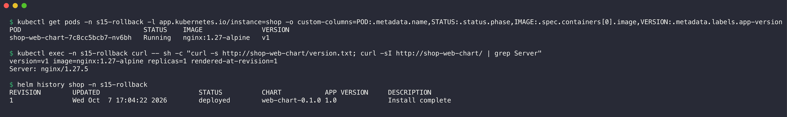

```console
$ kubectl get pods -n s15-rollback -l app.kubernetes.io/instance=shop -o custom-columns=POD:.metadata.name,STATUS:.status.phase,IMAGE:.spec.containers[0].image,VERSION:.metadata.labels.app-version
POD                               STATUS    IMAGE               VERSION
shop-web-chart-7c8cc5bcb7-nv6bh   Running   nginx:1.27-alpine   v1

$ kubectl exec -n s15-rollback curl -- sh -c "curl -s http://shop-web-chart/version.txt; curl -sI http://shop-web-chart/ | grep Server"
version=v1 image=nginx:1.27-alpine replicas=1 rendered-at-revision=1
Server: nginx/1.27.5

$ helm history shop -n s15-rollback
REVISION	UPDATED                 	STATUS  	CHART          	APP VERSION	DESCRIPTION     
1       	Wed Oct  7 17:04:22 2026	deployed	web-chart-0.1.0	1.0        	Install complete
```

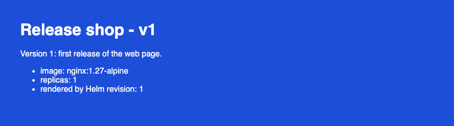

One Pod runs `nginx:1.27-alpine` (nginx/1.27.5). The page shows version v1 on a blue background.

## Step 2: Upgrade

1. Upgrade the release with `values-v2.yaml`.

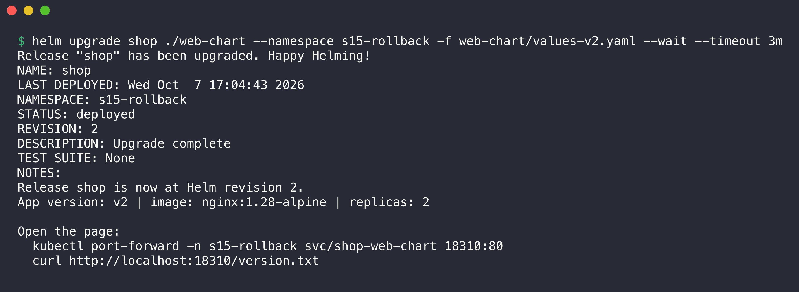

```console
$ helm upgrade shop ./web-chart --namespace s15-rollback -f web-chart/values-v2.yaml --wait --timeout 3m
Release "shop" has been upgraded. Happy Helming!
NAME: shop
LAST DEPLOYED: Wed Oct  7 17:04:43 2026
NAMESPACE: s15-rollback
STATUS: deployed
REVISION: 2
DESCRIPTION: Upgrade complete
TEST SUITE: None
NOTES:
Release shop is now at Helm revision 2.
App version: v2 | image: nginx:1.28-alpine | replicas: 2

Open the page:
  kubectl port-forward -n s15-rollback svc/shop-web-chart 18310:80
  curl http://localhost:18310/version.txt
```

## Step 3: Verify

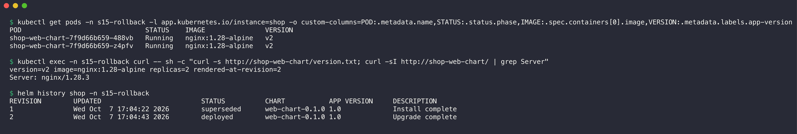

```console
$ kubectl get pods -n s15-rollback -l app.kubernetes.io/instance=shop -o custom-columns=POD:.metadata.name,STATUS:.status.phase,IMAGE:.spec.containers[0].image,VERSION:.metadata.labels.app-version
POD                               STATUS    IMAGE               VERSION
shop-web-chart-7f9d66b659-488vb   Running   nginx:1.28-alpine   v2
shop-web-chart-7f9d66b659-z4pfv   Running   nginx:1.28-alpine   v2

$ kubectl exec -n s15-rollback curl -- sh -c "curl -s http://shop-web-chart/version.txt; curl -sI http://shop-web-chart/ | grep Server"
version=v2 image=nginx:1.28-alpine replicas=2 rendered-at-revision=2
Server: nginx/1.28.3

$ helm history shop -n s15-rollback
REVISION	UPDATED                 	STATUS    	CHART          	APP VERSION	DESCRIPTION     
1       	Wed Oct  7 17:04:22 2026	superseded	web-chart-0.1.0	1.0        	Install complete
2       	Wed Oct  7 17:04:43 2026	deployed  	web-chart-0.1.0	1.0        	Upgrade complete
```

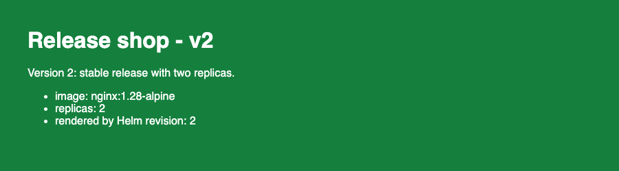

Two Pods run `nginx:1.28-alpine` (nginx/1.28.3). The page shows v2 on a green background. Revision 1 is now `superseded`.

## Step 4: Upgrade again

1. Upgrade the release with `values-v3.yaml`.

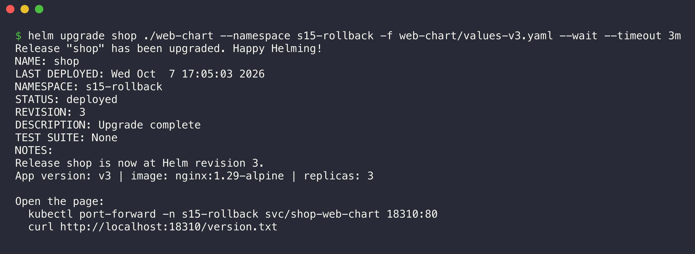

```console
$ helm upgrade shop ./web-chart --namespace s15-rollback -f web-chart/values-v3.yaml --wait --timeout 3m
Release "shop" has been upgraded. Happy Helming!
NAME: shop
LAST DEPLOYED: Wed Oct  7 17:05:03 2026
NAMESPACE: s15-rollback
STATUS: deployed
REVISION: 3
DESCRIPTION: Upgrade complete
TEST SUITE: None
NOTES:
Release shop is now at Helm revision 3.
App version: v3 | image: nginx:1.29-alpine | replicas: 3

Open the page:
  kubectl port-forward -n s15-rollback svc/shop-web-chart 18310:80
  curl http://localhost:18310/version.txt
```

## Step 5: Verify

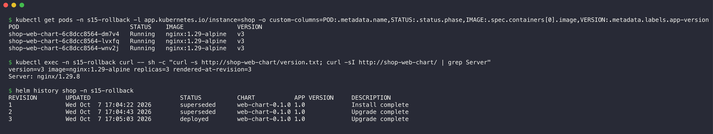

```console
$ kubectl get pods -n s15-rollback -l app.kubernetes.io/instance=shop -o custom-columns=POD:.metadata.name,STATUS:.status.phase,IMAGE:.spec.containers[0].image,VERSION:.metadata.labels.app-version
POD                               STATUS    IMAGE               VERSION
shop-web-chart-6c8dcc8564-dm7v4   Running   nginx:1.29-alpine   v3
shop-web-chart-6c8dcc8564-lvxfq   Running   nginx:1.29-alpine   v3
shop-web-chart-6c8dcc8564-wnv2j   Running   nginx:1.29-alpine   v3

$ kubectl exec -n s15-rollback curl -- sh -c "curl -s http://shop-web-chart/version.txt; curl -sI http://shop-web-chart/ | grep Server"
version=v3 image=nginx:1.29-alpine replicas=3 rendered-at-revision=3
Server: nginx/1.29.8

$ helm history shop -n s15-rollback
REVISION	UPDATED                 	STATUS    	CHART          	APP VERSION	DESCRIPTION     
1       	Wed Oct  7 17:04:22 2026	superseded	web-chart-0.1.0	1.0        	Install complete
2       	Wed Oct  7 17:04:43 2026	superseded	web-chart-0.1.0	1.0        	Upgrade complete
3       	Wed Oct  7 17:05:03 2026	deployed  	web-chart-0.1.0	1.0        	Upgrade complete
```


Three Pods run `nginx:1.29-alpine` (nginx/1.29.8). The Pods are healthy, but the page shows a wrong message to users. This is a bad release, and we must return to revision 2.

## Step 6: Rollback

1. Examine the values of revision 2 to make sure that it is the correct target.
2. Roll back the release to revision 2.

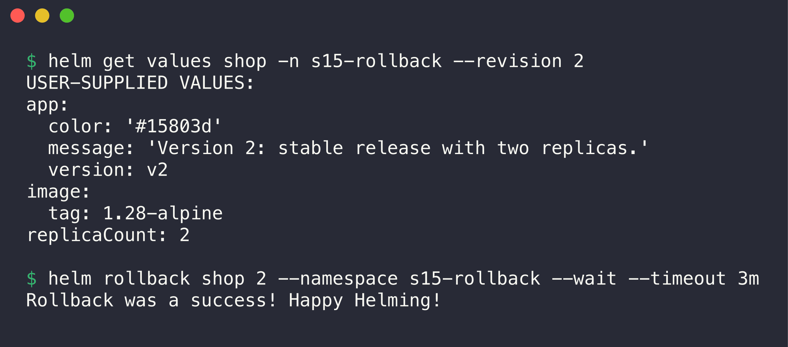

```console
$ helm get values shop -n s15-rollback --revision 2
USER-SUPPLIED VALUES:
app:
  color: '#15803d'
  message: 'Version 2: stable release with two replicas.'
  version: v2
image:
  tag: 1.28-alpine
replicaCount: 2

$ helm rollback shop 2 --namespace s15-rollback --wait --timeout 3m
Rollback was a success! Happy Helming!
```

## Step 7: Verify

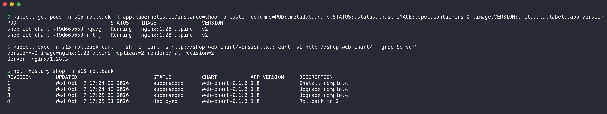

```console
$ kubectl get pods -n s15-rollback -l app.kubernetes.io/instance=shop -o custom-columns=POD:.metadata.name,STATUS:.status.phase,IMAGE:.spec.containers[0].image,VERSION:.metadata.labels.app-version
POD                               STATUS    IMAGE               VERSION
shop-web-chart-7f9d66b659-kqwqg   Running   nginx:1.28-alpine   v2
shop-web-chart-7f9d66b659-rftfj   Running   nginx:1.28-alpine   v2

$ kubectl exec -n s15-rollback curl -- sh -c "curl -s http://shop-web-chart/version.txt; curl -sI http://shop-web-chart/ | grep Server"
version=v2 image=nginx:1.28-alpine replicas=2 rendered-at-revision=2
Server: nginx/1.28.3

$ helm history shop -n s15-rollback
REVISION	UPDATED                 	STATUS    	CHART          	APP VERSION	DESCRIPTION     
1       	Wed Oct  7 17:04:22 2026	superseded	web-chart-0.1.0	1.0        	Install complete
2       	Wed Oct  7 17:04:43 2026	superseded	web-chart-0.1.0	1.0        	Upgrade complete
3       	Wed Oct  7 17:05:03 2026	superseded	web-chart-0.1.0	1.0        	Upgrade complete
4       	Wed Oct  7 17:05:31 2026	deployed  	web-chart-0.1.0	1.0        	Rollback to 2   
```


The rollback restored revision 2 completely:

- Two Pods run `nginx:1.28-alpine` again.
- The page shows v2 on a green background.
- The page still says `rendered by Helm revision: 2`. Helm does not render the templates again for a rollback. It applies the manifest that it stored for revision 2.

### helm history after the rollback

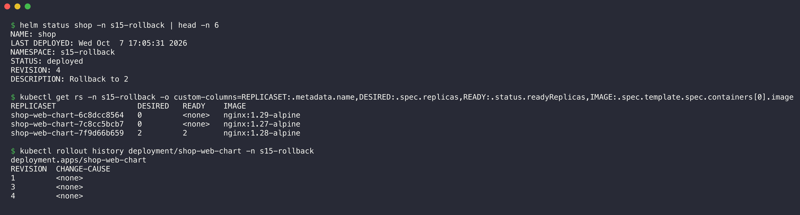

```console
$ helm status shop -n s15-rollback | head -n 6
NAME: shop
LAST DEPLOYED: Wed Oct  7 17:05:31 2026
NAMESPACE: s15-rollback
STATUS: deployed
REVISION: 4
DESCRIPTION: Rollback to 2

$ kubectl get rs -n s15-rollback -o custom-columns=REPLICASET:.metadata.name,DESIRED:.spec.replicas,READY:.status.readyReplicas,IMAGE:.spec.template.spec.containers[0].image
REPLICASET                  DESIRED   READY    IMAGE
shop-web-chart-6c8dcc8564   0         <none>   nginx:1.29-alpine
shop-web-chart-7c8cc5bcb7   0         <none>   nginx:1.27-alpine
shop-web-chart-7f9d66b659   2         2        nginx:1.28-alpine

$ kubectl rollout history deployment/shop-web-chart -n s15-rollback
deployment.apps/shop-web-chart 
REVISION  CHANGE-CAUSE
1         <none>
3         <none>
4         <none>
```

Helm made a new revision 4 with the description `Rollback to 2`. Helm did not delete revision 3. Thus you can also roll back the rollback if necessary.

The ReplicaSet list shows why the rollback is fast. Kubernetes keeps the old ReplicaSets with 0 replicas. The Pod template of revision 4 is the same as revision 2, so Kubernetes scaled up the old ReplicaSet `7f9d66b659` again. The Deployment rollout history has no revision 2, because the Deployment moved that revision to number 4.

## Extra: automatic rollback with --rollback-on-failure

In Helm 4, `--rollback-on-failure` replaces `--atomic`. If the upgrade does not become ready before `--timeout`, Helm rolls back automatically.

1. Upgrade with an image tag that does not exist.
2. Set `--rollback-on-failure` and a 60 second timeout.

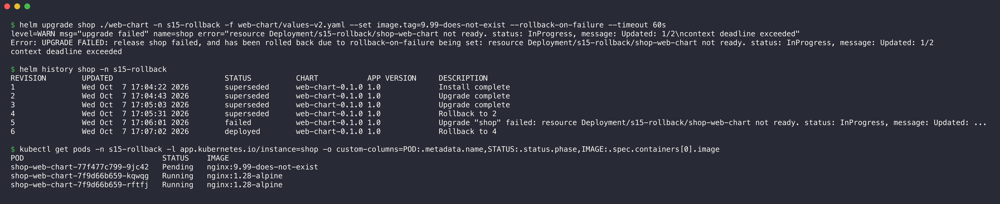

```console
$ helm upgrade shop ./web-chart -n s15-rollback -f web-chart/values-v2.yaml --set image.tag=9.99-does-not-exist --rollback-on-failure --timeout 60s
level=WARN msg="upgrade failed" name=shop error="resource Deployment/s15-rollback/shop-web-chart not ready. status: InProgress, message: Updated: 1/2\ncontext deadline exceeded"
Error: UPGRADE FAILED: release shop failed, and has been rolled back due to rollback-on-failure being set: resource Deployment/s15-rollback/shop-web-chart not ready. status: InProgress, message: Updated: 1/2
context deadline exceeded

$ helm history shop -n s15-rollback
REVISION	UPDATED                 	STATUS    	CHART          	APP VERSION	DESCRIPTION                                                                                                                
1       	Wed Oct  7 17:04:22 2026	superseded	web-chart-0.1.0	1.0        	Install complete                                                                                                           
2       	Wed Oct  7 17:04:43 2026	superseded	web-chart-0.1.0	1.0        	Upgrade complete                                                                                                           
3       	Wed Oct  7 17:05:03 2026	superseded	web-chart-0.1.0	1.0        	Upgrade complete                                                                                                           
4       	Wed Oct  7 17:05:31 2026	superseded	web-chart-0.1.0	1.0        	Rollback to 2                                                                                                              
5       	Wed Oct  7 17:06:01 2026	failed    	web-chart-0.1.0	1.0        	Upgrade "shop" failed: resource Deployment/s15-rollback/shop-web-chart not ready. status: InProgress, message: Updated: ...
6       	Wed Oct  7 17:07:02 2026	deployed  	web-chart-0.1.0	1.0        	Rollback to 4                                                                                                              

$ kubectl get pods -n s15-rollback -l app.kubernetes.io/instance=shop -o custom-columns=POD:.metadata.name,STATUS:.status.phase,IMAGE:.spec.containers[0].image
POD                               STATUS    IMAGE
shop-web-chart-77f477c799-9jc42   Pending   nginx:9.99-does-not-exist
shop-web-chart-7f9d66b659-kqwqg   Running   nginx:1.28-alpine
shop-web-chart-7f9d66b659-rftfj   Running   nginx:1.28-alpine
```

Revision 5 is `failed`. Helm then made revision 6 (`Rollback to 4`) by itself. The new Pod with the bad image was still `Pending` at that moment. Kubernetes removed it some seconds later:

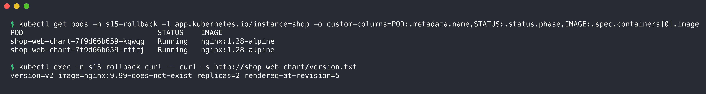

```console
$ kubectl get pods -n s15-rollback -l app.kubernetes.io/instance=shop -o custom-columns=POD:.metadata.name,STATUS:.status.phase,IMAGE:.spec.containers[0].image
POD                               STATUS    IMAGE
shop-web-chart-7f9d66b659-kqwqg   Running   nginx:1.28-alpine
shop-web-chart-7f9d66b659-rftfj   Running   nginx:1.28-alpine

$ kubectl exec -n s15-rollback curl -- curl -s http://shop-web-chart/version.txt
version=v2 image=nginx:9.99-does-not-exist replicas=2 rendered-at-revision=5
```

The Pods are correct, but `version.txt` still showed the values of the failed revision 5. The ConfigMap object was already correct:

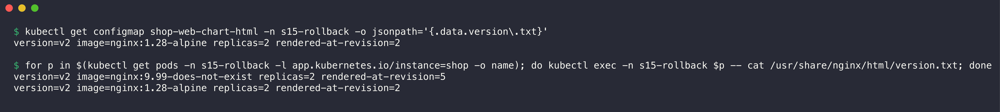

```console
$ kubectl get configmap shop-web-chart-html -n s15-rollback -o jsonpath='{.data.version\.txt}'
version=v2 image=nginx:1.28-alpine replicas=2 rendered-at-revision=2

$ for p in $(kubectl get pods -n s15-rollback -l app.kubernetes.io/instance=shop -o name); do kubectl exec -n s15-rollback $p -- cat /usr/share/nginx/html/version.txt; done
version=v2 image=nginx:9.99-does-not-exist replicas=2 rendered-at-revision=5
version=v2 image=nginx:1.28-alpine replicas=2 rendered-at-revision=2
```

The reason: the failed upgrade changed the ConfigMap. The kubelet copies ConfigMap changes into the volumes of Pods that run. It does this with a delay of up to about one minute, and at a different time for each Pod. Thus the old Pods served the page of revision 5 for some time, and then the page of revision 2 again. About one minute later, both Pods showed the correct file:

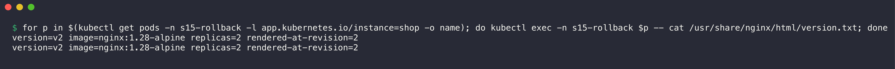

```console
$ for p in $(kubectl get pods -n s15-rollback -l app.kubernetes.io/instance=shop -o name); do kubectl exec -n s15-rollback $p -- cat /usr/share/nginx/html/version.txt; done
version=v2 image=nginx:1.28-alpine replicas=2 rendered-at-revision=2
version=v2 image=nginx:1.28-alpine replicas=2 rendered-at-revision=2
```

**CAUTION:** Do not trust a ConfigMap volume to stay the same during a failed upgrade. Put the version in the ConfigMap name, or mount it with `subPath`, if old Pods must keep the old configuration. The [mini project](../03-mini-project/README.md) uses `subPath` for this reason.

## Cleanup

1. Uninstall the release.
2. Delete the namespaces of this session.

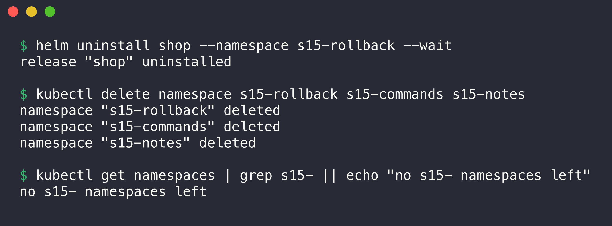

```console
$ helm uninstall shop --namespace s15-rollback --wait
release "shop" uninstalled

$ kubectl delete namespace s15-rollback s15-commands s15-notes
namespace "s15-rollback" deleted
namespace "s15-commands" deleted
namespace "s15-notes" deleted

$ kubectl get namespaces | grep s15- || echo "no s15- namespaces left"
no s15- namespaces left
```
