# Task 3: Mini Project: Package and Deploy the Notes App with Helm

This folder contains the Helm mini project from the class material (`session-15-helm/mini-project`). The application is an nginx Pod that represents a Notes web app.

- Chart: [`notes-chart/`](notes-chart/)
- Namespace: `s15-notes`
- Release name: `notes-dev`
- Local port for the browser screenshots: 18320

## The chart

```text
notes-chart/
├── Chart.yaml
├── values.yaml          # development values (default)
├── values-prod.yaml     # production values
└── templates/
    ├── configmap.yaml
    ├── deployment.yaml
    └── service.yaml
```

| File | Content |
|------|---------|
| [`Chart.yaml`](notes-chart/Chart.yaml) | `notes-chart`, chart version `0.1.0`, app version `1.0`. |
| [`values.yaml`](notes-chart/values.yaml) | 1 replica, `nginx:1.24`, environment `development`, two notes. |
| [`values-prod.yaml`](notes-chart/values-prod.yaml) | 3 replicas, `nginx:1.25`, environment `production`, three notes. |
| [`templates/configmap.yaml`](notes-chart/templates/configmap.yaml) | `APP_NAME`, `ENVIRONMENT`, and the `index.html` page. |
| [`templates/deployment.yaml`](notes-chart/templates/deployment.yaml) | nginx Deployment. It reads the ConfigMap with `envFrom` and mounts `index.html`. |
| [`templates/service.yaml`](notes-chart/templates/service.yaml) | NodePort Service. |

### Changes from the class material

The chart follows the class material. I made these small changes:

- The ConfigMap also has an `index.html` page. The page shows the app name, the environment, the replica count, and a list of notes from the values. Thus the difference between development and production is visible in the browser.
- The Deployment mounts `index.html` with `subPath`. Pods that run keep their page if a later upgrade changes the ConfigMap ([Task 2](../02-helm-rollback/README.md#extra-automatic-rollback-with---rollback-on-failure) shows why this is important).
- The Deployment has a `checksum/config` annotation. If the ConfigMap changes, Kubernetes starts new Pods.
- The Deployment has a readiness probe. Thus `helm upgrade --wait` waits until nginx answers.
- The NodePort is `30315`, not `30090`. Other demos use the same cluster at the same time, and a NodePort must be unique in the cluster.

## Step 1 to 7: Create the chart

1. Make the directory `notes-chart/templates`.
2. Write `Chart.yaml`, `values.yaml`, `values-prod.yaml` and the three templates.

## Step 8: Lint

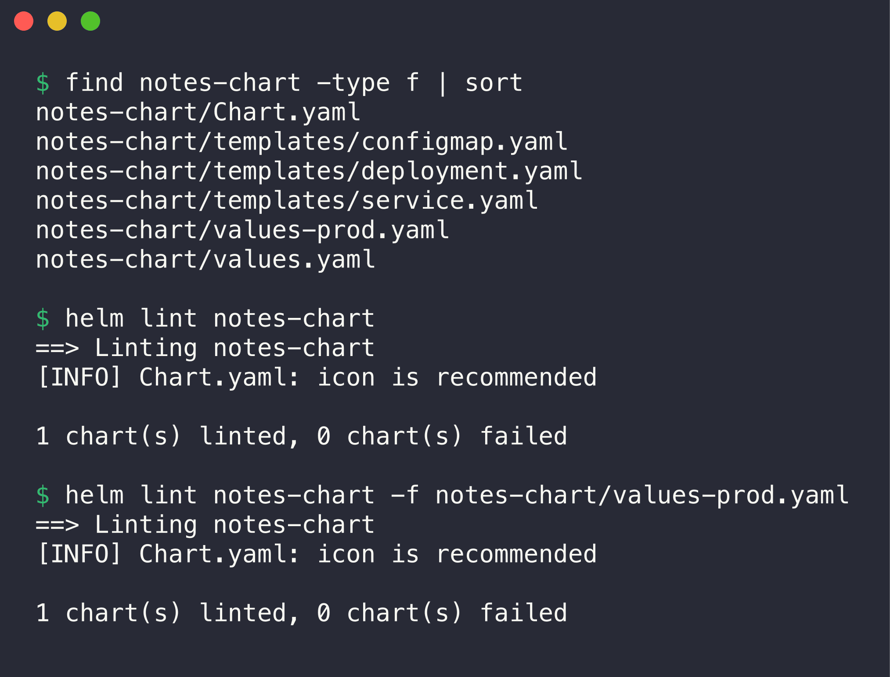

```console
$ find notes-chart -type f | sort
notes-chart/Chart.yaml
notes-chart/templates/configmap.yaml
notes-chart/templates/deployment.yaml
notes-chart/templates/service.yaml
notes-chart/values-prod.yaml
notes-chart/values.yaml

$ helm lint notes-chart
==> Linting notes-chart
[INFO] Chart.yaml: icon is recommended

1 chart(s) linted, 0 chart(s) failed

$ helm lint notes-chart -f notes-chart/values-prod.yaml
==> Linting notes-chart
[INFO] Chart.yaml: icon is recommended

1 chart(s) linted, 0 chart(s) failed
```

The chart has no errors with the development values and with the production values.

## Step 9: Render locally

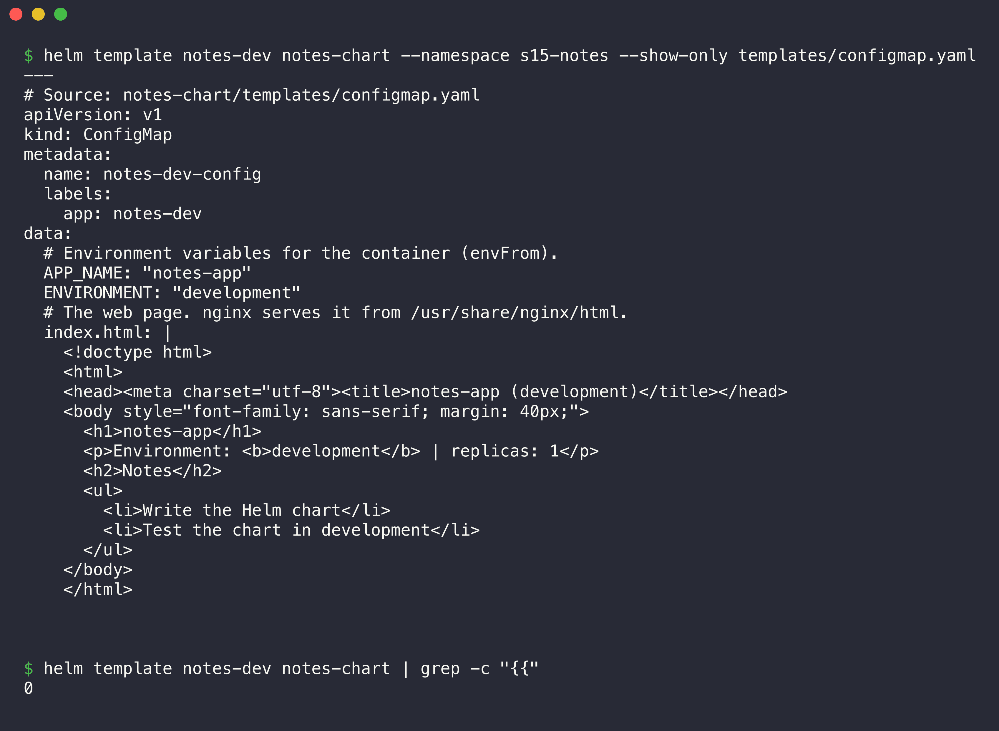

```console
$ helm template notes-dev notes-chart --namespace s15-notes --show-only templates/configmap.yaml
---
# Source: notes-chart/templates/configmap.yaml
apiVersion: v1
kind: ConfigMap
metadata:
  name: notes-dev-config
  labels:
    app: notes-dev
data:
  # Environment variables for the container (envFrom).
  APP_NAME: "notes-app"
  ENVIRONMENT: "development"
  # The web page. nginx serves it from /usr/share/nginx/html.
  index.html: |
    <!doctype html>
    <html>
    <head><meta charset="utf-8"><title>notes-app (development)</title></head>
    <body style="font-family: sans-serif; margin: 40px;">
      <h1>notes-app</h1>
      <p>Environment: <b>development</b> | replicas: 1</p>
      <h2>Notes</h2>
      <ul>
        <li>Write the Helm chart</li>
        <li>Test the chart in development</li>
      </ul>
    </body>
    </html>


$ helm template notes-dev notes-chart | grep -c "{{"
0
```

The `grep -c "{{"` result is `0`. Thus Helm replaced all placeholders.

The same command with `-f values-prod.yaml` shows the production values:

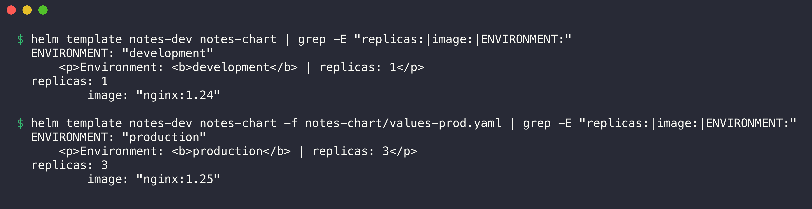

```console
$ helm template notes-dev notes-chart | grep -E "replicas:|image:|ENVIRONMENT:"
  ENVIRONMENT: "development"
      <p>Environment: <b>development</b> | replicas: 1</p>
  replicas: 1
          image: "nginx:1.24"

$ helm template notes-dev notes-chart -f notes-chart/values-prod.yaml | grep -E "replicas:|image:|ENVIRONMENT:"
  ENVIRONMENT: "production"
      <p>Environment: <b>production</b> | replicas: 3</p>
  replicas: 3
          image: "nginx:1.25"
```

## Step 10: Install (development)

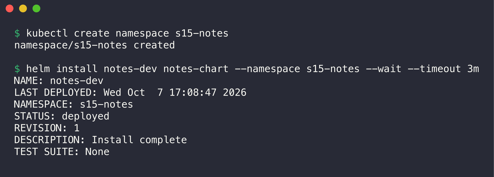

```console
$ kubectl create namespace s15-notes
namespace/s15-notes created

$ helm install notes-dev notes-chart --namespace s15-notes --wait --timeout 3m
NAME: notes-dev
LAST DEPLOYED: Wed Oct  7 17:08:47 2026
NAMESPACE: s15-notes
STATUS: deployed
REVISION: 1
DESCRIPTION: Install complete
TEST SUITE: None
```

Verify the Pods, the Service and the ConfigMap:

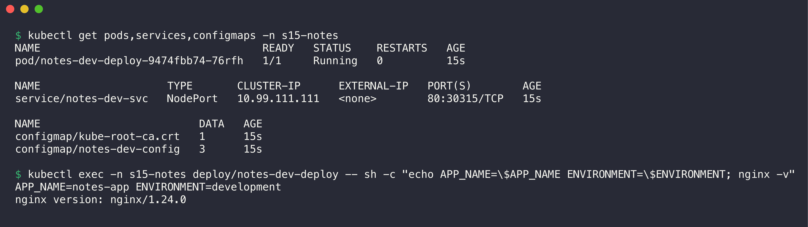

```console
$ kubectl get pods,services,configmaps -n s15-notes
NAME                                   READY   STATUS    RESTARTS   AGE
pod/notes-dev-deploy-9474fbb74-76rfh   1/1     Running   0          15s

NAME                    TYPE       CLUSTER-IP      EXTERNAL-IP   PORT(S)        AGE
service/notes-dev-svc   NodePort   10.99.111.111   <none>        80:30315/TCP   15s

NAME                         DATA   AGE
configmap/kube-root-ca.crt   1      15s
configmap/notes-dev-config   3      15s

$ kubectl exec -n s15-notes deploy/notes-dev-deploy -- sh -c "echo APP_NAME=\$APP_NAME ENVIRONMENT=\$ENVIRONMENT; nginx -v"
APP_NAME=notes-app ENVIRONMENT=development
nginx version: nginx/1.24.0
```

One Pod runs nginx 1.24. The container has the environment variables from the ConfigMap. The ConfigMap has 3 keys: `APP_NAME`, `ENVIRONMENT` and `index.html`.

The page through `kubectl port-forward -n s15-notes svc/notes-dev-svc 18320:80`:


## Step 11: Upgrade to production values

1. Upgrade the release with `-f notes-chart/values-prod.yaml`.

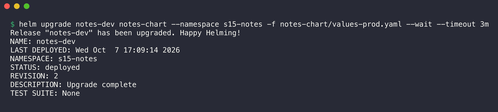

```console
$ helm upgrade notes-dev notes-chart --namespace s15-notes -f notes-chart/values-prod.yaml --wait --timeout 3m
Release "notes-dev" has been upgraded. Happy Helming!
NAME: notes-dev
LAST DEPLOYED: Wed Oct  7 17:09:14 2026
NAMESPACE: s15-notes
STATUS: deployed
REVISION: 2
DESCRIPTION: Upgrade complete
TEST SUITE: None
```

Verify that 3 Pods run:

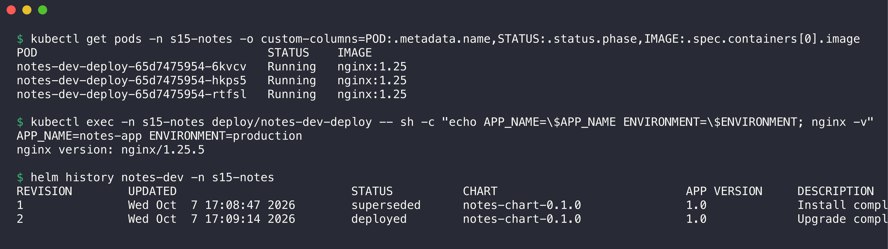

```console
$ kubectl get pods -n s15-notes -o custom-columns=POD:.metadata.name,STATUS:.status.phase,IMAGE:.spec.containers[0].image
POD                                 STATUS    IMAGE
notes-dev-deploy-65d7475954-6kvcv   Running   nginx:1.25
notes-dev-deploy-65d7475954-hkps5   Running   nginx:1.25
notes-dev-deploy-65d7475954-rtfsl   Running   nginx:1.25

$ kubectl exec -n s15-notes deploy/notes-dev-deploy -- sh -c "echo APP_NAME=\$APP_NAME ENVIRONMENT=\$ENVIRONMENT; nginx -v"
APP_NAME=notes-app ENVIRONMENT=production
nginx version: nginx/1.25.5

$ helm history notes-dev -n s15-notes
REVISION	UPDATED                 	STATUS    	CHART            	APP VERSION	DESCRIPTION     
1       	Wed Oct  7 17:08:47 2026	superseded	notes-chart-0.1.0	1.0        	Install complete
2       	Wed Oct  7 17:09:14 2026	deployed  	notes-chart-0.1.0	1.0        	Upgrade complete
```


The same chart now runs 3 Pods with nginx 1.25 and `ENVIRONMENT=production`. Only the values file is different.

## Step 12: Check the release history

The history is in the output of step 11. Revision 1 (`Install complete`) is `superseded`. Revision 2 (`Upgrade complete`) is `deployed`.

## Step 13: Simulate a bad upgrade

1. Upgrade with an image tag that does not exist.

I also used `-f notes-chart/values-prod.yaml`. Without it, `helm upgrade` uses the defaults from `values.yaml` plus `--set`. That would also change the release back to 1 replica and `development`.

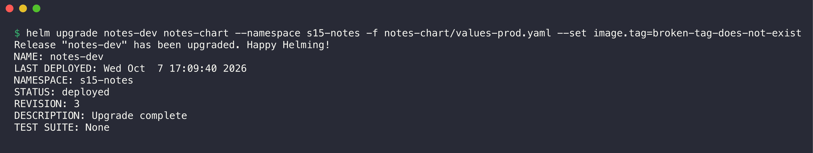

```console
$ helm upgrade notes-dev notes-chart --namespace s15-notes -f notes-chart/values-prod.yaml --set image.tag=broken-tag-does-not-exist
Release "notes-dev" has been upgraded. Happy Helming!
NAME: notes-dev
LAST DEPLOYED: Wed Oct  7 17:09:40 2026
NAMESPACE: s15-notes
STATUS: deployed
REVISION: 3
DESCRIPTION: Upgrade complete
TEST SUITE: None
```

Helm reports `deployed`, because it did not wait for the Pods. Examine the Pods:

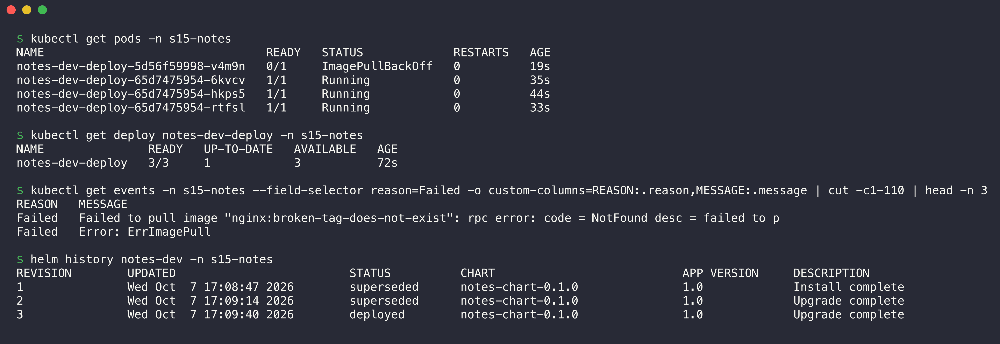

```console
$ kubectl get pods -n s15-notes
NAME                                READY   STATUS             RESTARTS   AGE
notes-dev-deploy-5d56f59998-v4m9n   0/1     ImagePullBackOff   0          19s
notes-dev-deploy-65d7475954-6kvcv   1/1     Running            0          35s
notes-dev-deploy-65d7475954-hkps5   1/1     Running            0          44s
notes-dev-deploy-65d7475954-rtfsl   1/1     Running            0          33s

$ kubectl get deploy notes-dev-deploy -n s15-notes
NAME               READY   UP-TO-DATE   AVAILABLE   AGE
notes-dev-deploy   3/3     1            3           72s

$ kubectl get events -n s15-notes --field-selector reason=Failed -o custom-columns=REASON:.reason,MESSAGE:.message | cut -c1-110 | head -n 3
REASON   MESSAGE
Failed   Failed to pull image "nginx:broken-tag-does-not-exist": rpc error: code = NotFound desc = failed to p
Failed   Error: ErrImagePull

$ helm history notes-dev -n s15-notes
REVISION	UPDATED                 	STATUS    	CHART            	APP VERSION	DESCRIPTION     
1       	Wed Oct  7 17:08:47 2026	superseded	notes-chart-0.1.0	1.0        	Install complete
2       	Wed Oct  7 17:09:14 2026	superseded	notes-chart-0.1.0	1.0        	Upgrade complete
3       	Wed Oct  7 17:09:40 2026	deployed  	notes-chart-0.1.0	1.0        	Upgrade complete
```

The new Pod is in `ImagePullBackOff`, because the tag `broken-tag-does-not-exist` does not exist. The rolling update stopped. The 3 old Pods still run, so users still get the page. Helm history shows revision 3 as `deployed`, but it is broken.

## Step 14: Rollback to revision 2

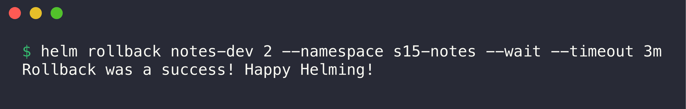

```console
$ helm rollback notes-dev 2 --namespace s15-notes --wait --timeout 3m
Rollback was a success! Happy Helming!
```

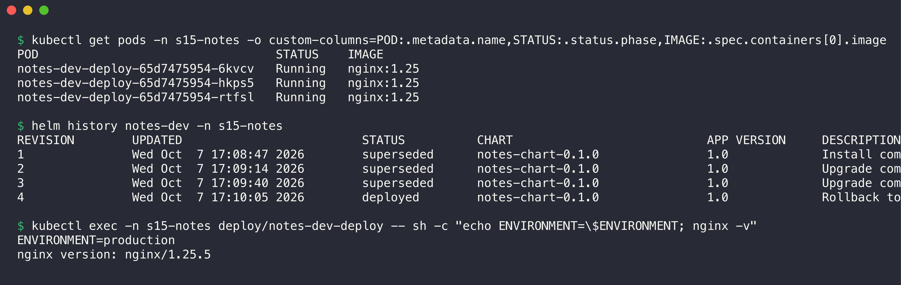

```console
$ kubectl get pods -n s15-notes -o custom-columns=POD:.metadata.name,STATUS:.status.phase,IMAGE:.spec.containers[0].image
POD                                 STATUS    IMAGE
notes-dev-deploy-65d7475954-6kvcv   Running   nginx:1.25
notes-dev-deploy-65d7475954-hkps5   Running   nginx:1.25
notes-dev-deploy-65d7475954-rtfsl   Running   nginx:1.25

$ helm history notes-dev -n s15-notes
REVISION	UPDATED                 	STATUS    	CHART            	APP VERSION	DESCRIPTION     
1       	Wed Oct  7 17:08:47 2026	superseded	notes-chart-0.1.0	1.0        	Install complete
2       	Wed Oct  7 17:09:14 2026	superseded	notes-chart-0.1.0	1.0        	Upgrade complete
3       	Wed Oct  7 17:09:40 2026	superseded	notes-chart-0.1.0	1.0        	Upgrade complete
4       	Wed Oct  7 17:10:05 2026	deployed  	notes-chart-0.1.0	1.0        	Rollback to 2   

$ kubectl exec -n s15-notes deploy/notes-dev-deploy -- sh -c "echo ENVIRONMENT=\$ENVIRONMENT; nginx -v"
ENVIRONMENT=production
nginx version: nginx/1.25.5
```

The broken Pod is gone. The 3 Pods with nginx 1.25 are the same Pods as before (same names). Revision 4 has the description `Rollback to 2`.

## Step 15: Clean up

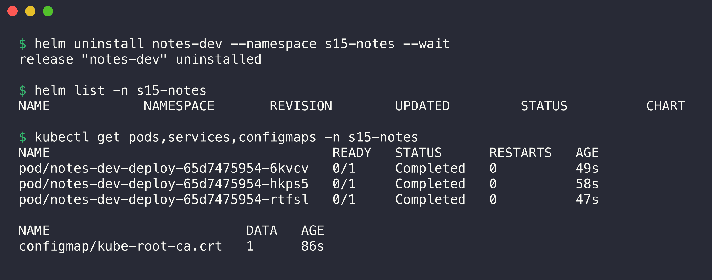

```console
$ helm uninstall notes-dev --namespace s15-notes --wait
release "notes-dev" uninstalled

$ helm list -n s15-notes
NAME	NAMESPACE	REVISION	UPDATED	STATUS	CHART	APP VERSION

$ kubectl get pods,services,configmaps -n s15-notes
NAME                                    READY   STATUS      RESTARTS   AGE
pod/notes-dev-deploy-65d7475954-6kvcv   0/1     Completed   0          49s
pod/notes-dev-deploy-65d7475954-hkps5   0/1     Completed   0          58s
pod/notes-dev-deploy-65d7475954-rtfsl   0/1     Completed   0          47s

NAME                         DATA   AGE
configmap/kube-root-ca.crt   1      86s
```

The Service and the ConfigMap `notes-dev-config` are gone at once. The Pods show `Completed` while they stop. Some seconds later, all objects of the release are gone:

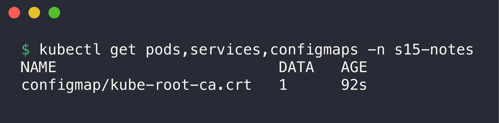

```console
$ kubectl get pods,services,configmaps -n s15-notes
NAME                         DATA   AGE
configmap/kube-root-ca.crt   1      92s
```

`kube-root-ca.crt` is not part of the release. Kubernetes makes it in every namespace. I deleted the namespace `s15-notes` at the end of the session.

## What I practiced

```text
[PASS] Created a Helm chart from scratch
[PASS] Used values.yaml and values-prod.yaml
[PASS] Deployed to Kubernetes with helm install
[PASS] Upgraded the release with different values
[PASS] Simulated a bad upgrade (broken image tag)
[PASS] Rolled back to a healthy revision
[PASS] Cleaned up with helm uninstall
```
