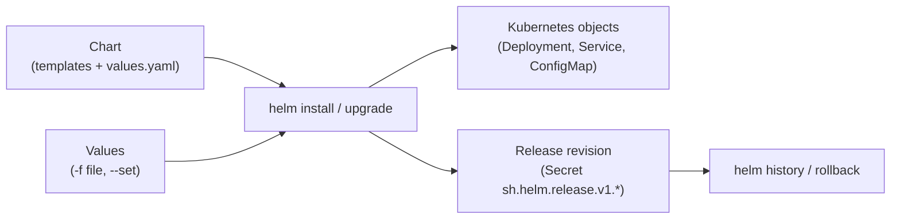
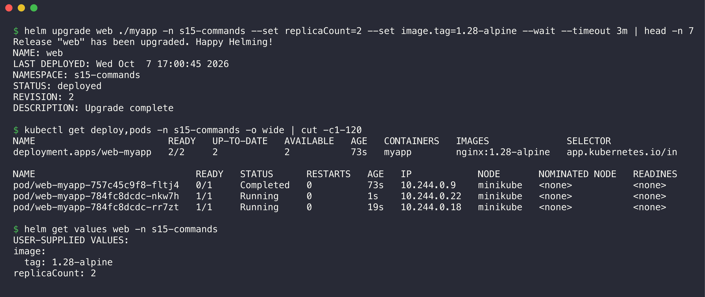
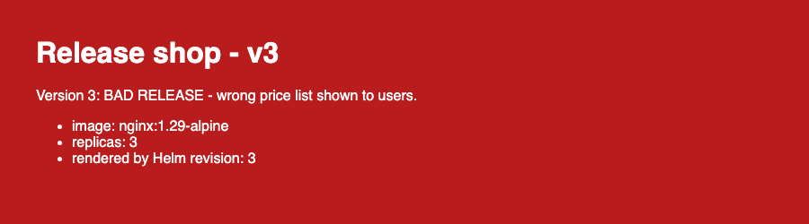
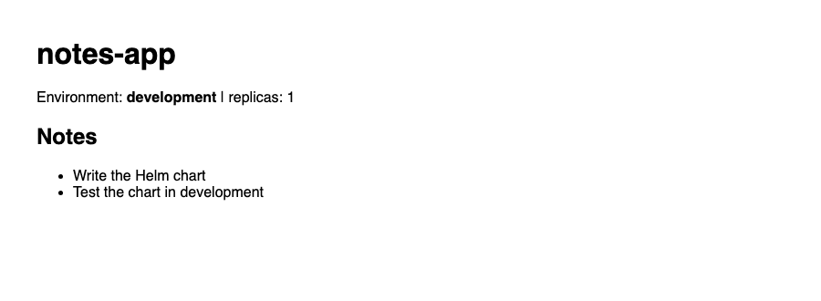
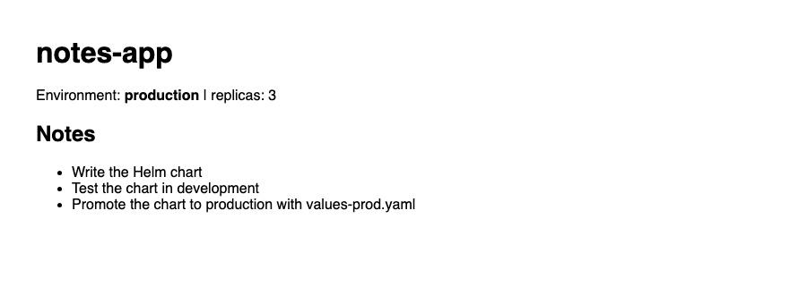

# Session 15: Helm

**Name:** Kartavya Panchal  
**Roll No.:** 24BCS10343

Helm is the package manager for Kubernetes. A chart is a package of Kubernetes YAML templates. A release is one installed copy of a chart. Values are the settings that change a chart for each environment.

All hands-on work ran on a local minikube cluster (Kubernetes v1.37, arm64) with Helm v4.3.0. All output blocks and screenshots come from real commands.

## Folder structure

```text
Helm/
├── README.md                    # this file
├── 01-helm-commands/            # Task 1
│   ├── README.md
│   └── myapp/                   # chart made with "helm create"
├── 02-helm-rollback/            # Task 2
│   ├── README.md
│   └── web-chart/               # chart with values for 3 revisions
│       ├── Chart.yaml
│       ├── values.yaml
│       ├── values-v2.yaml
│       ├── values-v3.yaml
│       └── templates/
├── 03-mini-project/             # Task 3
│   ├── README.md
│   └── notes-chart/             # Notes app chart (dev and prod values)
│       ├── Chart.yaml
│       ├── values.yaml
│       ├── values-prod.yaml
│       └── templates/
└── screenshots/                 # all screenshots (t1-*, t2-*, t3-*)
```

## Core concepts



- **Chart:** A directory with `Chart.yaml`, `values.yaml` and `templates/`.
- **Release:** A chart that Helm installed in a namespace, with a name.
- **Revision:** Each `install`, `upgrade` and `rollback` makes a new revision. Helm stores each revision in a Secret in the namespace.
- **Values:** `values.yaml` gives the defaults. `-f <file>` and `--set key=value` override them.

## Task 1: Helm Commands

Details: [01-helm-commands/README.md](01-helm-commands/README.md)

I ran each command, recorded the output, and wrote what it does. The commands are:

- `helm create`, `lint`, `template`, `install --dry-run`, `install`
- `list`, `status`, `get` (`values`, `manifest`, `notes`, `metadata`, `all`)
- `upgrade`, `history`, `rollback`, `uninstall`
- `repo` (`add`, `update`, `list`, `remove`) and `search` (`repo` and `hub`)



The README also lists the Helm 4 changes that I found, for example the new name `--rollback-on-failure` for `--atomic`.

## Task 2: Helm Rollback

Details: [02-helm-rollback/README.md](02-helm-rollback/README.md)

Workflow: Install → Upgrade → Verify → Upgrade again → Verify → Rollback → Verify. Each revision has a different image tag, replica count and page message:

| Revision | Action | Image | Replicas | Page |
|----------|--------|-------|----------|------|
| 1 | Install | `nginx:1.27-alpine` | 1 | v1 (blue) |
| 2 | Upgrade | `nginx:1.28-alpine` | 2 | v2 (green) |
| 3 | Upgrade again | `nginx:1.29-alpine` | 3 | v3 (red, bad release) |
| 4 | Rollback to 2 | `nginx:1.28-alpine` | 2 | v2 (green) |

| Before rollback (revision 3) | After rollback (revision 4) |
|---|---|
|  |  |

The task also shows an automatic rollback with `--rollback-on-failure`. It also shows a real problem: a failed upgrade can change a mounted ConfigMap for Pods that already run.

## Task 3: Mini Project

Details: [03-mini-project/README.md](03-mini-project/README.md)

The Notes app chart has development values (`values.yaml`) and production values (`values-prod.yaml`). I did lint, template, install (development), upgrade to production, a bad upgrade with a broken image tag, rollback, and uninstall.

| Development (revision 1) | Production (revision 2) |
|---|---|
|  |  |

## Deliverables

| Deliverable | Where |
|-------------|-------|
| Helm chart | [`myapp/`](01-helm-commands/myapp/), [`web-chart/`](02-helm-rollback/web-chart/), [`notes-chart/`](03-mini-project/notes-chart/) |
| values.yaml | [`web-chart/values.yaml`](02-helm-rollback/web-chart/values.yaml), [`notes-chart/values.yaml`](03-mini-project/notes-chart/values.yaml), [`notes-chart/values-prod.yaml`](03-mini-project/notes-chart/values-prod.yaml) |
| Templates | [`web-chart/templates/`](02-helm-rollback/web-chart/templates/), [`notes-chart/templates/`](03-mini-project/notes-chart/templates/) |
| Installation | [Task 1 install](01-helm-commands/README.md#5-helm-install), [Task 2 step 1](02-helm-rollback/README.md#step-1-install), [Task 3 step 10](03-mini-project/README.md#step-10-install-development) |
| Upgrade | [Task 1 upgrade](01-helm-commands/README.md#9-helm-upgrade), [Task 2 steps 2 and 4](02-helm-rollback/README.md#step-2-upgrade), [Task 3 step 11](03-mini-project/README.md#step-11-upgrade-to-production-values) |
| Rollback | [Task 1 rollback](01-helm-commands/README.md#11-helm-rollback), [Task 2 step 6](02-helm-rollback/README.md#step-6-rollback), [Task 3 step 14](03-mini-project/README.md#step-14-rollback-to-revision-2) |
| Screenshots | [`screenshots/`](screenshots/) |
| README files | This file and one README in each task folder |
| Mini project | [`03-mini-project/`](03-mini-project/) |

## Cleanup

At the end, I uninstalled all releases and deleted the namespaces `s15-commands`, `s15-rollback` and `s15-notes`. No port-forward stays open.

## Reference

- Helm documentation: https://helm.sh/docs/
- Helm chart best practices: https://helm.sh/docs/chart_best_practices/
- Helm CLI reference: https://helm.sh/docs/helm/
