# Session 09: Kubernetes Fundamentals

**Name:** Kartavya Panchal  
**Roll No.:** 24BCS10343

```
Kubernetes-Fundamentals/
├── logs/                       real terminal logs of the Minikube install, start and addons
│   ├── minikube-install.log
│   ├── minikube-start.log
│   └── minikube-addons.log
├── manifests/                  basic objects used in Task 4
│   ├── 00-namespace.yaml
│   ├── 01-configmap.yaml
│   ├── 02-pod.yaml
│   ├── 03-replicaset.yaml
│   ├── 04-deployment.yaml
│   └── 05-service.yaml
├── screenshots/
└── README.md
```

Environment: MacBook with Apple silicon (arm64), Docker Desktop, Minikube v1.39.0 with the Docker driver, Kubernetes v1.37.0, containerd 2.3.4.

All lab objects use the Namespaces `s9-basics` and `s9-bootcamp`. I removed both Namespaces at the end of the session.

---

## Task 1: Install and configure Minikube

### Commands used

```bash
brew install minikube
minikube start --driver=docker --cpus=6 --memory=7000mb
minikube addons enable ingress
minikube addons enable metrics-server
minikube version
kubectl version
```

1. Install Minikube with Homebrew. Homebrew also installs `kubectl` (`kubernetes-cli`) as a dependency.
2. Start a one-node cluster with the Docker driver.
3. Enable the `ingress` and `metrics-server` addons.

The `logs/` folder keeps the real terminal output of these commands.

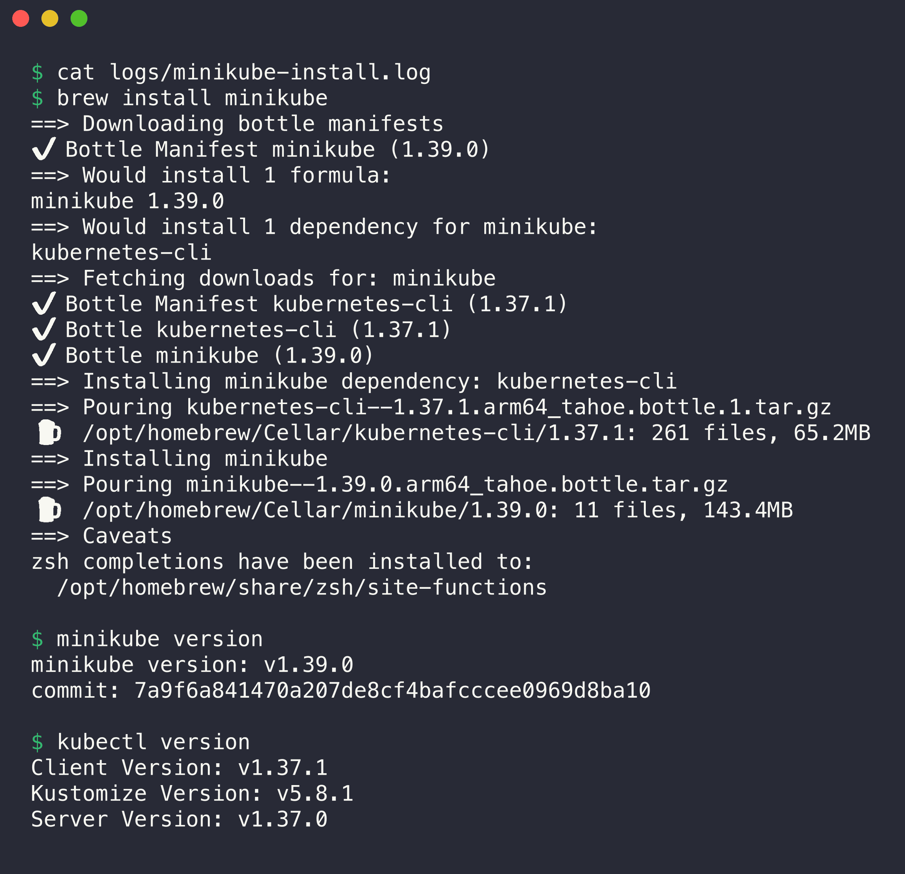

```console
$ cat logs/minikube-install.log
$ brew install minikube
==> Downloading bottle manifests
✔︎ Bottle Manifest minikube (1.39.0)
==> Would install 1 formula:
minikube 1.39.0
==> Would install 1 dependency for minikube:
kubernetes-cli
==> Fetching downloads for: minikube
✔︎ Bottle Manifest kubernetes-cli (1.37.1)
✔︎ Bottle kubernetes-cli (1.37.1)
✔︎ Bottle minikube (1.39.0)
==> Installing minikube dependency: kubernetes-cli
==> Pouring kubernetes-cli--1.37.1.arm64_tahoe.bottle.1.tar.gz
🍺  /opt/homebrew/Cellar/kubernetes-cli/1.37.1: 261 files, 65.2MB
==> Installing minikube
==> Pouring minikube--1.39.0.arm64_tahoe.bottle.tar.gz
🍺  /opt/homebrew/Cellar/minikube/1.39.0: 11 files, 143.4MB
==> Caveats
zsh completions have been installed to:
  /opt/homebrew/share/zsh/site-functions

$ minikube version
minikube version: v1.39.0
commit: 7a9f6a841470a207de8cf4bafcccee0969d8ba10

$ kubectl version
Client Version: v1.37.1
Kustomize Version: v5.8.1
Server Version: v1.37.0
```

Homebrew installed the arm64 bottles of `minikube` 1.39.0 and `kubernetes-cli` 1.37.1. The `kubectl` client (v1.37.1) and the API server (v1.37.0) are one patch version apart. This is in the supported version skew.

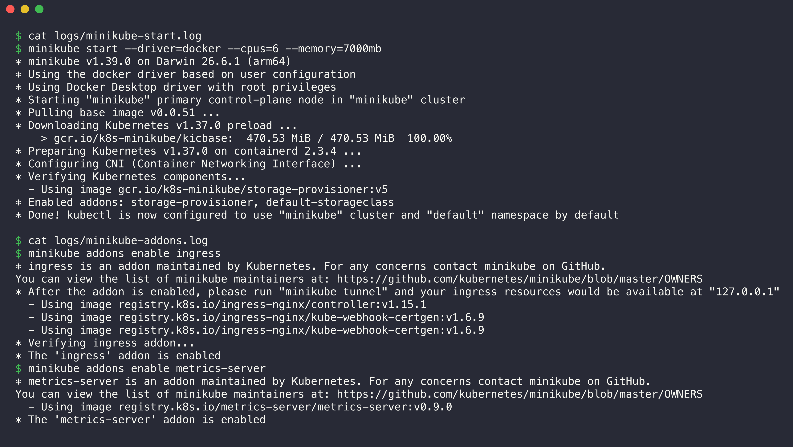

```console
$ cat logs/minikube-start.log
$ minikube start --driver=docker --cpus=6 --memory=7000mb
* minikube v1.39.0 on Darwin 26.6.1 (arm64)
* Using the docker driver based on user configuration
* Using Docker Desktop driver with root privileges
* Starting "minikube" primary control-plane node in "minikube" cluster
* Pulling base image v0.0.51 ...
* Downloading Kubernetes v1.37.0 preload ...
    > gcr.io/k8s-minikube/kicbase:  470.53 MiB / 470.53 MiB  100.00%
* Preparing Kubernetes v1.37.0 on containerd 2.3.4 ...
* Configuring CNI (Container Networking Interface) ...
* Verifying Kubernetes components...
  - Using image gcr.io/k8s-minikube/storage-provisioner:v5
* Enabled addons: storage-provisioner, default-storageclass
* Done! kubectl is now configured to use "minikube" cluster and "default" namespace by default

$ cat logs/minikube-addons.log
$ minikube addons enable ingress
* ingress is an addon maintained by Kubernetes. For any concerns contact minikube on GitHub.
You can view the list of minikube maintainers at: https://github.com/kubernetes/minikube/blob/master/OWNERS
* After the addon is enabled, please run "minikube tunnel" and your ingress resources would be available at "127.0.0.1"
  - Using image registry.k8s.io/ingress-nginx/controller:v1.15.1
  - Using image registry.k8s.io/ingress-nginx/kube-webhook-certgen:v1.6.9
  - Using image registry.k8s.io/ingress-nginx/kube-webhook-certgen:v1.6.9
* Verifying ingress addon...
* The 'ingress' addon is enabled
$ minikube addons enable metrics-server
* metrics-server is an addon maintained by Kubernetes. For any concerns contact minikube on GitHub.
You can view the list of minikube maintainers at: https://github.com/kubernetes/minikube/blob/master/OWNERS
  - Using image registry.k8s.io/metrics-server/metrics-server:v0.9.0
* The 'metrics-server' addon is enabled
```

Minikube downloaded the `kicbase` image and a preload archive with the Kubernetes v1.37.0 images. The node runs as a Docker container on the Mac. Minikube configured the CNI and changed the `kubectl` context to `minikube`.

---

## Task 2: Verify Kubernetes cluster status

### Commands used

```bash
minikube status
kubectl cluster-info
kubectl get nodes -o wide
kubectl config current-context
minikube addons list
```

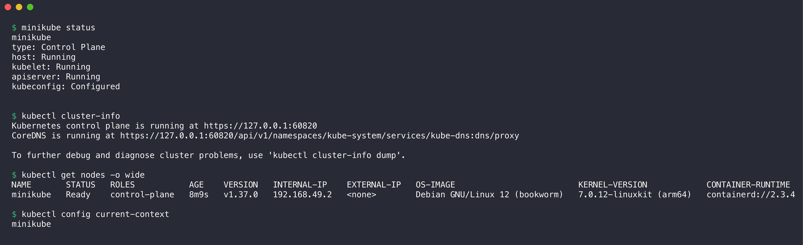

```console
$ minikube status
minikube
type: Control Plane
host: Running
kubelet: Running
apiserver: Running
kubeconfig: Configured


$ kubectl cluster-info
Kubernetes control plane is running at https://127.0.0.1:60820
CoreDNS is running at https://127.0.0.1:60820/api/v1/namespaces/kube-system/services/kube-dns:dns/proxy

To further debug and diagnose cluster problems, use 'kubectl cluster-info dump'.

$ kubectl get nodes -o wide
NAME       STATUS   ROLES           AGE    VERSION   INTERNAL-IP    EXTERNAL-IP   OS-IMAGE                         KERNEL-VERSION            CONTAINER-RUNTIME
minikube   Ready    control-plane   8m9s   v1.37.0   192.168.49.2   <none>        Debian GNU/Linux 12 (bookworm)   7.0.12-linuxkit (arm64)   containerd://2.3.4

$ kubectl config current-context
minikube
```

- The host, the kubelet and the API server are `Running`.
- The API server listens on `127.0.0.1:60820`. Docker Desktop forwards this port from the Mac into the node container.
- The node `minikube` is `Ready`. It has the `control-plane` role and also runs workloads.
- The node runs Debian 12 on an arm64 kernel. The container runtime is containerd 2.3.4.

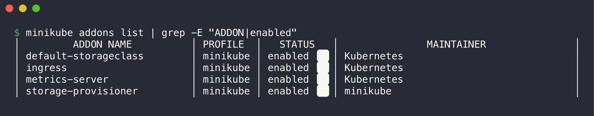

```console
$ minikube addons list | grep -E "ADDON|enabled"
│         ADDON NAME          │ PROFILE  │   STATUS   │               MAINTAINER               │
│ default-storageclass        │ minikube │ enabled ✅ │ Kubernetes                             │
│ ingress                     │ minikube │ enabled ✅ │ Kubernetes                             │
│ metrics-server              │ minikube │ enabled ✅ │ Kubernetes                             │
│ storage-provisioner         │ minikube │ enabled ✅ │ minikube                               │
```

Minikube has four addons enabled. The `storage-provisioner` and `default-storageclass` addons give dynamic volumes. The `ingress` addon installs ingress-nginx. The `metrics-server` addon gives data to `kubectl top` and the HPA.

---

## Task 3: Explore Kubernetes architecture

### Short notes on Kubernetes architecture

A Kubernetes cluster has two parts: the **control plane** and the **worker nodes**. The control plane stores the desired state and makes decisions. The worker nodes run the containers. In Minikube, one node does both jobs.

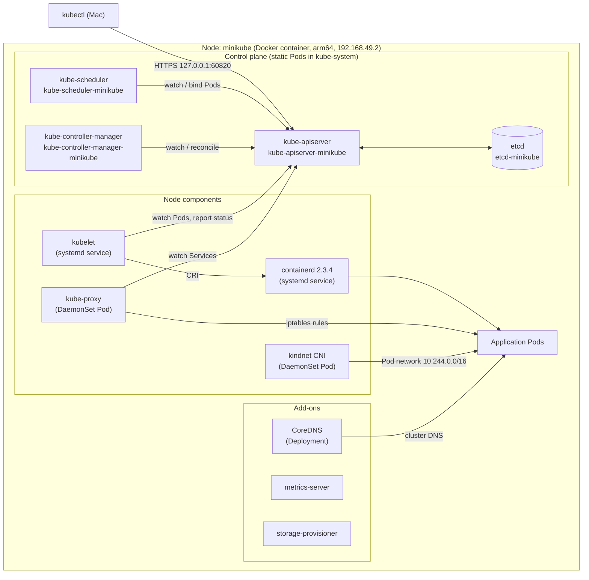
```mermaid
flowchart LR
    user["kubectl (Mac)"] -->|HTTPS 127.0.0.1:60820| api

    subgraph node["Node: minikube (Docker container, arm64, 192.168.49.2)"]
        subgraph cp["Control plane (static Pods in kube-system)"]
            api["kube-apiserver<br/>kube-apiserver-minikube"]
            etcd[("etcd<br/>etcd-minikube")]
            sched["kube-scheduler<br/>kube-scheduler-minikube"]
            cm["kube-controller-manager<br/>kube-controller-manager-minikube"]
        end
        subgraph wk["Node components"]
            kubelet["kubelet<br/>(systemd service)"]
            cri["containerd 2.3.4<br/>(systemd service)"]
            proxy["kube-proxy<br/>(DaemonSet Pod)"]
            cni["kindnet CNI<br/>(DaemonSet Pod)"]
        end
        subgraph addons["Add-ons"]
            dns["CoreDNS<br/>(Deployment)"]
            ms["metrics-server"]
            sp["storage-provisioner"]
        end
        pods["Application Pods"]
    end

    api <--> etcd
    sched -->|watch / bind Pods| api
    cm -->|watch / reconcile| api
    kubelet -->|watch Pods, report status| api
    kubelet -->|CRI| cri
    cri --> pods
    proxy -->|watch Services| api
    proxy -->|iptables rules| pods
    cni -->|Pod network 10.244.0.0/16| pods
    dns -->|cluster DNS| pods
```

| Component | Job | Where it runs in this cluster |
| --- | --- | --- |
| kube-apiserver | The front door of the cluster. All clients and components talk only to the API server. It checks, stores and serves objects. | Static Pod `kube-apiserver-minikube`, process `kube-apiserver` (PID 1206) |
| etcd | A key-value store. It keeps the full cluster state. Only the API server writes to etcd. | Static Pod `etcd-minikube`, process `etcd` (PID 1258) |
| kube-scheduler | Selects a node for each new Pod that has no node. It examines resource requests, affinity and taints. | Static Pod `kube-scheduler-minikube`, process `kube-scheduler` (PID 1227) |
| kube-controller-manager | Runs the control loops (Deployment, ReplicaSet, Node, Endpoint, Job controllers). Each loop moves the actual state to the desired state. | Static Pod `kube-controller-manager-minikube`, process `kube-controller` (PID 1259) |
| cloud-controller-manager | Connects the cluster to a cloud API (load balancers, cloud disks). | Not present. Minikube runs locally and has no cloud provider. |
| kubelet | The agent on each node. It starts the containers of the Pods on its node and reports their status. It also starts the static Pods from `/etc/kubernetes/manifests`. | systemd service `kubelet` (PID 1380), not a Pod |
| Container runtime | Pulls images and runs containers. The kubelet talks to it through the CRI. | systemd service `containerd` (PID 650) |
| kube-proxy | Programs iptables rules on the node so that a Service IP sends traffic to the Pods of the Service. | DaemonSet Pod `kube-proxy-cw4pt` |
| CNI plugin | Gives each Pod an IP address and connects Pods on the network. | DaemonSet Pod `kindnet-dzxj2` |
| CoreDNS (add-on) | Resolves Service names such as `web-svc.s9-basics.svc.cluster.local`. | Deployment Pod `coredns-559f6c778d-5jxct` |

### Commands used

```bash
kubectl get pods -n kube-system -o wide
kubectl get daemonsets -n kube-system
minikube ssh -- ls /etc/kubernetes/manifests
minikube ssh -- "sudo systemctl is-active kubelet containerd"
minikube ssh -- "ps -eo pid,comm | grep -E 'kube|etcd|containerd$|coredns|kindnet'"
kubectl get --raw='/readyz?verbose'
kubectl get --raw='/livez'
kubectl get leases -n kube-system
```

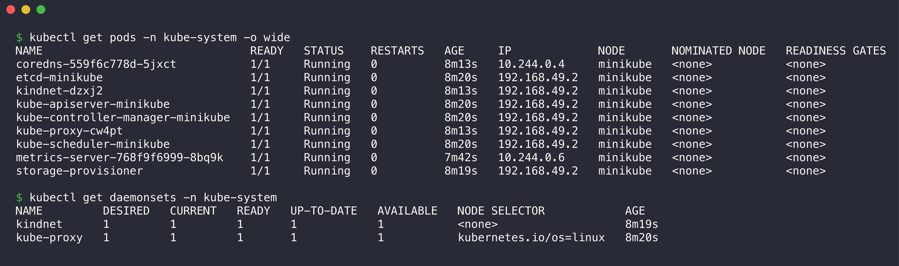

```console
$ kubectl get pods -n kube-system -o wide
NAME                               READY   STATUS    RESTARTS   AGE     IP             NODE       NOMINATED NODE   READINESS GATES
coredns-559f6c778d-5jxct           1/1     Running   0          8m13s   10.244.0.4     minikube   <none>           <none>
etcd-minikube                      1/1     Running   0          8m20s   192.168.49.2   minikube   <none>           <none>
kindnet-dzxj2                      1/1     Running   0          8m13s   192.168.49.2   minikube   <none>           <none>
kube-apiserver-minikube            1/1     Running   0          8m20s   192.168.49.2   minikube   <none>           <none>
kube-controller-manager-minikube   1/1     Running   0          8m20s   192.168.49.2   minikube   <none>           <none>
kube-proxy-cw4pt                   1/1     Running   0          8m13s   192.168.49.2   minikube   <none>           <none>
kube-scheduler-minikube            1/1     Running   0          8m20s   192.168.49.2   minikube   <none>           <none>
metrics-server-768f9f6999-8bq9k    1/1     Running   0          7m42s   10.244.0.6     minikube   <none>           <none>
storage-provisioner                1/1     Running   0          8m19s   192.168.49.2   minikube   <none>           <none>

$ kubectl get daemonsets -n kube-system
NAME         DESIRED   CURRENT   READY   UP-TO-DATE   AVAILABLE   NODE SELECTOR            AGE
kindnet      1         1         1       1            1           <none>                   8m19s
kube-proxy   1         1         1       1            1           kubernetes.io/os=linux   8m20s
```

- The four control plane Pods have the suffix `-minikube` (the node name). This suffix shows that they are static Pods.
- The control plane Pods, kube-proxy and kindnet use the node IP `192.168.49.2`. They use `hostNetwork`.
- CoreDNS and metrics-server get Pod IPs from the `10.244.0.0/16` Pod network.
- kube-proxy and kindnet are DaemonSets. Kubernetes runs one copy on each node.

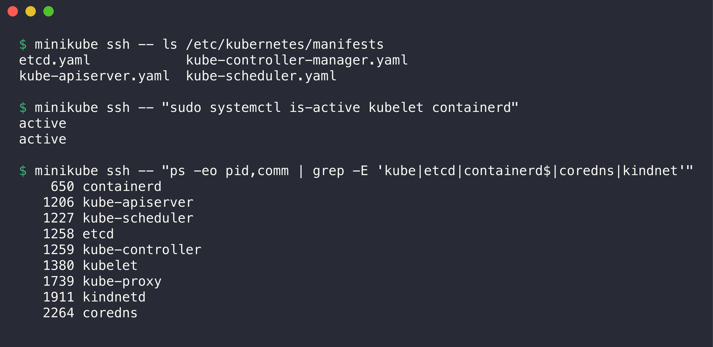

```console
$ minikube ssh -- ls /etc/kubernetes/manifests
etcd.yaml	     kube-controller-manager.yaml
kube-apiserver.yaml  kube-scheduler.yaml

$ minikube ssh -- "sudo systemctl is-active kubelet containerd"
active
active

$ minikube ssh -- "ps -eo pid,comm | grep -E 'kube|etcd|containerd$|coredns|kindnet'"
    650 containerd
   1206 kube-apiserver
   1227 kube-scheduler
   1258 etcd
   1259 kube-controller
   1380 kubelet
   1739 kube-proxy
   1911 kindnetd
   2264 coredns
```

The folder `/etc/kubernetes/manifests` has one file for each control plane component. The kubelet reads this folder and starts these Pods without the API server. The kubelet and containerd are not Pods. They are systemd services on the node, because they must run before any Pod can start.

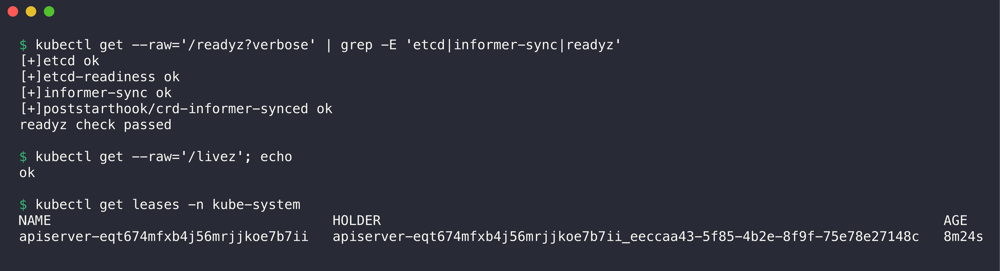

```console
$ kubectl get --raw='/readyz?verbose' | grep -E 'etcd|informer-sync|readyz'
[+]etcd ok
[+]etcd-readiness ok
[+]informer-sync ok
[+]poststarthook/crd-informer-synced ok
readyz check passed

$ kubectl get --raw='/livez'; echo
ok

$ kubectl get leases -n kube-system
NAME                                   HOLDER                                                                      AGE
apiserver-eqt674mfxb4j56mrjjkoe7b7ii   apiserver-eqt674mfxb4j56mrjjkoe7b7ii_eeccaa43-5f85-4b2e-8f9f-75e78e27148c   8m24s
```

The API server is ready and its connection to etcd is healthy. On a multi-node control plane, the scheduler and the controller manager use Lease objects to select one leader. Minikube starts them with `--leader-elect=false` because there is only one copy. For this reason, only the API server Lease shows.

---

## Task 4: Learn the basic Kubernetes objects and commands

### Basic objects

| Object | Job | File |
| --- | --- | --- |
| Namespace | Divides one cluster into separate groups of objects. | [00-namespace.yaml](manifests/00-namespace.yaml) |
| ConfigMap | Keeps configuration data apart from the container image. | [01-configmap.yaml](manifests/01-configmap.yaml) |
| Pod | The smallest unit that Kubernetes schedules. It has one or more containers that share a network and storage. | [02-pod.yaml](manifests/02-pod.yaml) |
| ReplicaSet | Keeps a fixed number of identical Pods. It replaces a Pod that stops. | [03-replicaset.yaml](manifests/03-replicaset.yaml) |
| Deployment | Manages ReplicaSets. It adds rolling updates, rollback and scaling. | [04-deployment.yaml](manifests/04-deployment.yaml) |
| Service | Gives a stable IP address and DNS name to a changing set of Pods. | [05-service.yaml](manifests/05-service.yaml) |

### Basic commands

| Command | Use |
| --- | --- |
| `kubectl apply -f <file or folder>` | Create or update objects from YAML. |
| `kubectl get <type> [-o wide]` | List objects. |
| `kubectl describe <type> <name>` | Show the details and the events of one object. |
| `kubectl logs <pod>` | Show the output of a container. |
| `kubectl exec -it <pod> -- <cmd>` | Run a command in a container. |
| `kubectl scale deployment <name> --replicas=N` | Change the number of Pods. |
| `kubectl delete <type> <name>` | Remove an object. |
| `kubectl api-resources` / `kubectl explain <field>` | Show the object types and the documentation of a field. |

### Step 1: Create the objects

1. Apply all files in the `manifests/` folder.
2. Wait until all Pods are Ready.
3. List the objects.

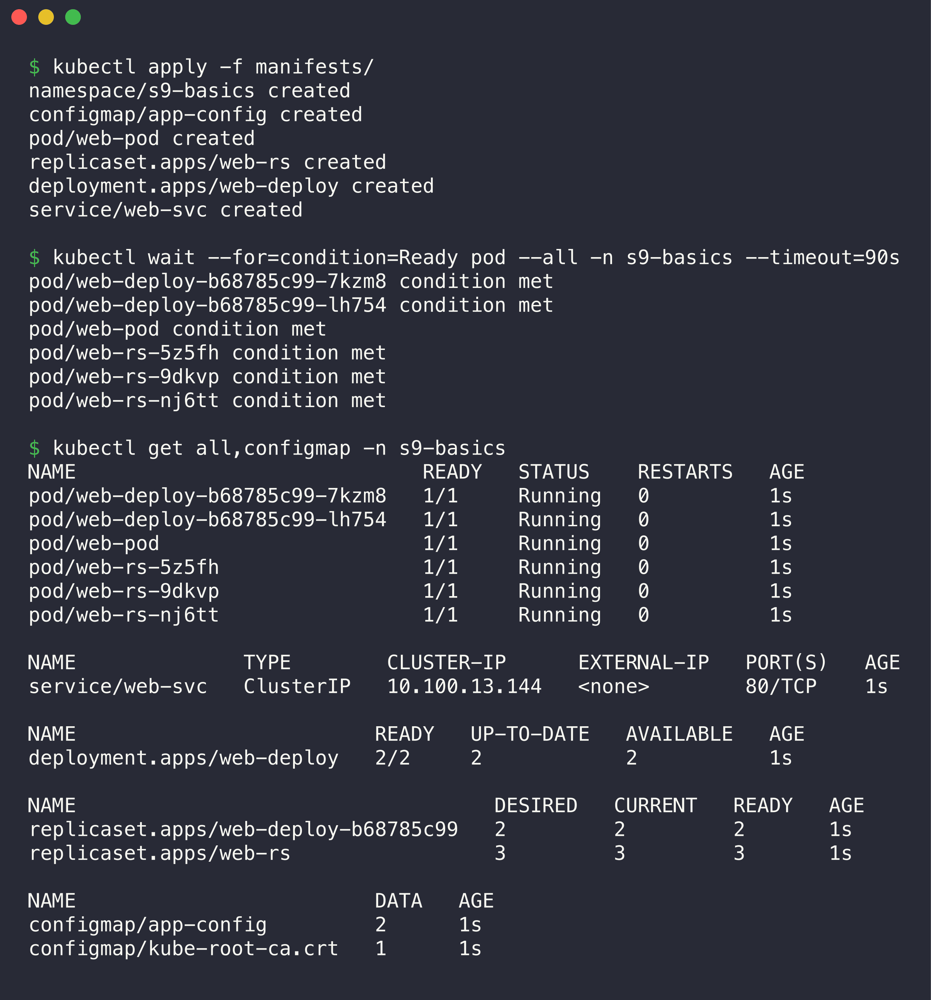

```console
$ kubectl apply -f manifests/
namespace/s9-basics created
configmap/app-config created
pod/web-pod created
replicaset.apps/web-rs created
deployment.apps/web-deploy created
service/web-svc created

$ kubectl wait --for=condition=Ready pod --all -n s9-basics --timeout=90s
pod/web-deploy-b68785c99-7kzm8 condition met
pod/web-deploy-b68785c99-lh754 condition met
pod/web-pod condition met
pod/web-rs-5z5fh condition met
pod/web-rs-9dkvp condition met
pod/web-rs-nj6tt condition met

$ kubectl get all,configmap -n s9-basics
NAME                             READY   STATUS    RESTARTS   AGE
pod/web-deploy-b68785c99-7kzm8   1/1     Running   0          1s
pod/web-deploy-b68785c99-lh754   1/1     Running   0          1s
pod/web-pod                      1/1     Running   0          1s
pod/web-rs-5z5fh                 1/1     Running   0          1s
pod/web-rs-9dkvp                 1/1     Running   0          1s
pod/web-rs-nj6tt                 1/1     Running   0          1s

NAME              TYPE        CLUSTER-IP      EXTERNAL-IP   PORT(S)   AGE
service/web-svc   ClusterIP   10.100.13.144   <none>        80/TCP    1s

NAME                         READY   UP-TO-DATE   AVAILABLE   AGE
deployment.apps/web-deploy   2/2     2            2           1s

NAME                                   DESIRED   CURRENT   READY   AGE
replicaset.apps/web-deploy-b68785c99   2         2         2       1s
replicaset.apps/web-rs                 3         3         3       1s

NAME                         DATA   AGE
configmap/app-config         2      1s
configmap/kube-root-ca.crt   1      1s
```

The Deployment `web-deploy` created the ReplicaSet `web-deploy-b68785c99`. That ReplicaSet created two Pods. The name of each Pod has the ReplicaSet hash. The ReplicaSet `web-rs` that I created directly has no hash in its name.

### Step 2: Examine a Pod with describe, exec and logs

1. Show the main details of `web-pod`.
2. Read the ConfigMap values in the container.
3. Show the last log lines.

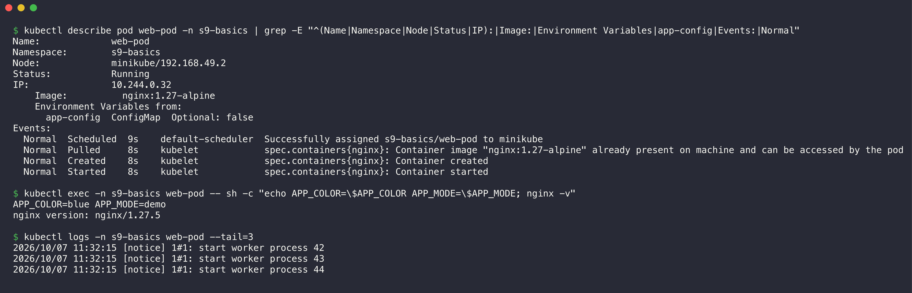

```console
$ kubectl describe pod web-pod -n s9-basics | grep -E "^(Name|Namespace|Node|Status|IP):|Image:|Environment Variables|app-config|Events:|Normal"
Name:             web-pod
Namespace:        s9-basics
Node:             minikube/192.168.49.2
Status:           Running
IP:               10.244.0.32
    Image:          nginx:1.27-alpine
    Environment Variables from:
      app-config  ConfigMap  Optional: false
Events:
  Normal  Scheduled  9s    default-scheduler  Successfully assigned s9-basics/web-pod to minikube
  Normal  Pulled     8s    kubelet            spec.containers{nginx}: Container image "nginx:1.27-alpine" already present on machine and can be accessed by the pod
  Normal  Created    8s    kubelet            spec.containers{nginx}: Container created
  Normal  Started    8s    kubelet            spec.containers{nginx}: Container started

$ kubectl exec -n s9-basics web-pod -- sh -c "echo APP_COLOR=\$APP_COLOR APP_MODE=\$APP_MODE; nginx -v"
APP_COLOR=blue APP_MODE=demo
nginx version: nginx/1.27.5

$ kubectl logs -n s9-basics web-pod --tail=3
2026/10/07 11:32:15 [notice] 1#1: start worker process 42
2026/10/07 11:32:15 [notice] 1#1: start worker process 43
2026/10/07 11:32:15 [notice] 1#1: start worker process 44
```

The events show the work of two components. The `default-scheduler` assigned the Pod to the node. Then the `kubelet` pulled the image, created the container and started it. The `exec` output shows that the ConfigMap keys are environment variables in the container.

### Step 3: Self-healing, scaling and Service endpoints

1. Delete one Pod of the ReplicaSet `web-rs`.
2. List the Pods of `web-rs` again.
3. Scale the Deployment to 4 replicas.
4. Show the endpoints of the Service.

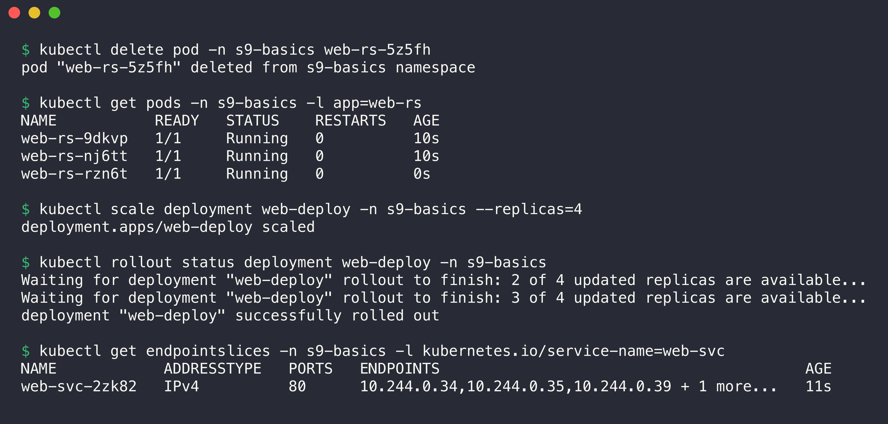

```console
$ kubectl delete pod -n s9-basics web-rs-5z5fh
pod "web-rs-5z5fh" deleted from s9-basics namespace

$ kubectl get pods -n s9-basics -l app=web-rs
NAME           READY   STATUS    RESTARTS   AGE
web-rs-9dkvp   1/1     Running   0          10s
web-rs-nj6tt   1/1     Running   0          10s
web-rs-rzn6t   1/1     Running   0          0s

$ kubectl scale deployment web-deploy -n s9-basics --replicas=4
deployment.apps/web-deploy scaled

$ kubectl rollout status deployment web-deploy -n s9-basics
Waiting for deployment "web-deploy" rollout to finish: 2 of 4 updated replicas are available...
Waiting for deployment "web-deploy" rollout to finish: 3 of 4 updated replicas are available...
deployment "web-deploy" successfully rolled out

$ kubectl get endpointslices -n s9-basics -l kubernetes.io/service-name=web-svc
NAME            ADDRESSTYPE   PORTS   ENDPOINTS                                         AGE
web-svc-2zk82   IPv4          80      10.244.0.34,10.244.0.35,10.244.0.39 + 1 more...   11s
```

The ReplicaSet controller created the new Pod `web-rs-rzn6t` (age `0s`) at once. After the scale command, the EndpointSlice of `web-svc` has 4 Pod IPs. The Service found the new Pods through its label selector.

### Step 4: Use the Service and the API discovery commands

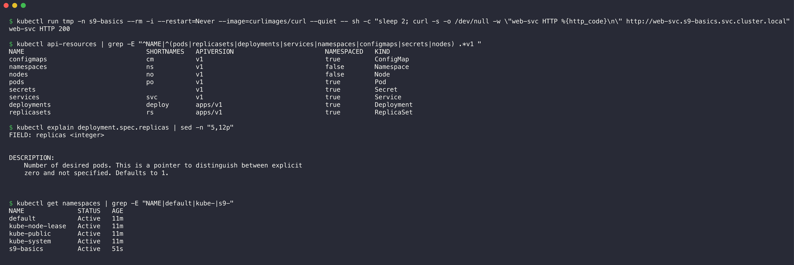

```console
$ kubectl run tmp -n s9-basics --rm -i --restart=Never --image=curlimages/curl --quiet -- sh -c "sleep 2; curl -s -o /dev/null -w \"web-svc HTTP %{http_code}\n\" http://web-svc.s9-basics.svc.cluster.local"
web-svc HTTP 200

$ kubectl api-resources | grep -E "^NAME|^(pods|replicasets|deployments|services|namespaces|configmaps|secrets|nodes) .*v1 "
NAME                                SHORTNAMES   APIVERSION                        NAMESPACED   KIND
configmaps                          cm           v1                                true         ConfigMap
namespaces                          ns           v1                                false        Namespace
nodes                               no           v1                                false        Node
pods                                po           v1                                true         Pod
secrets                                          v1                                true         Secret
services                            svc          v1                                true         Service
deployments                         deploy       apps/v1                           true         Deployment
replicasets                         rs           apps/v1                           true         ReplicaSet

$ kubectl explain deployment.spec.replicas | sed -n "5,12p"
FIELD: replicas <integer>


DESCRIPTION:
    Number of desired pods. This is a pointer to distinguish between explicit
    zero and not specified. Defaults to 1.
    


$ kubectl get namespaces | grep -E "NAME|default|kube-|s9-"
NAME              STATUS   AGE
default           Active   11m
kube-node-lease   Active   11m
kube-public       Active   11m
kube-system       Active   11m
s9-basics         Active   51s
```

- A temporary curl Pod reached the Service by its DNS name and got HTTP 200. CoreDNS resolved the name.
- `kubectl api-resources` shows the short names (`po`, `rs`, `deploy`, `svc`) and the API group of each type.
- Namespaces and Nodes are not namespaced. They belong to the full cluster.

---

## Task 5: Perform the Kubernetes Basics tutorial hands-on

I did all modules of the [Kubernetes Basics tutorial](https://kubernetes.io/docs/tutorials/kubernetes-basics/) in the Namespace `s9-bootcamp`. The Minikube cluster from Task 1 replaces module 1 ("Create a cluster").

### Image test on an arm64 node

The task notes gave the image `gcr.io/k8s-minikube/kubernetes-bootcamp:v1`. The current tutorial uses `gcr.io/google-samples/kubernetes-bootcamp:v1`. I tested both images on this arm64 node.

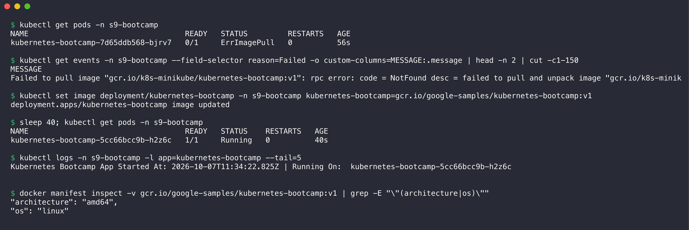

```console
$ kubectl get pods -n s9-bootcamp
NAME                                   READY   STATUS         RESTARTS   AGE
kubernetes-bootcamp-7d65ddb568-bjrv7   0/1     ErrImagePull   0          56s

$ kubectl get events -n s9-bootcamp --field-selector reason=Failed -o custom-columns=MESSAGE:.message | head -n 2 | cut -c1-150
MESSAGE
Failed to pull image "gcr.io/k8s-minikube/kubernetes-bootcamp:v1": rpc error: code = NotFound desc = failed to pull and unpack image "gcr.io/k8s-minik

$ kubectl set image deployment/kubernetes-bootcamp -n s9-bootcamp kubernetes-bootcamp=gcr.io/google-samples/kubernetes-bootcamp:v1
deployment.apps/kubernetes-bootcamp image updated

$ sleep 40; kubectl get pods -n s9-bootcamp
NAME                                   READY   STATUS    RESTARTS   AGE
kubernetes-bootcamp-5cc66bcc9b-h2z6c   1/1     Running   0          40s

$ kubectl logs -n s9-bootcamp -l app=kubernetes-bootcamp --tail=5
Kubernetes Bootcamp App Started At: 2026-10-07T11:34:22.825Z | Running On:  kubernetes-bootcamp-5cc66bcc9b-h2z6c 


$ docker manifest inspect -v gcr.io/google-samples/kubernetes-bootcamp:v1 | grep -E "\"(architecture|os)\""
			"architecture": "amd64",
			"os": "linux"
```

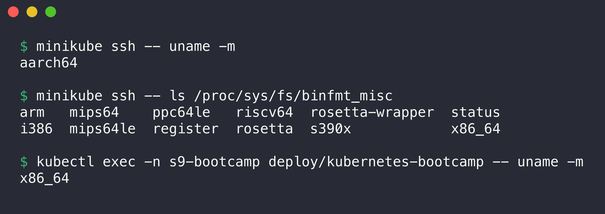

```console
$ minikube ssh -- uname -m
aarch64

$ minikube ssh -- ls /proc/sys/fs/binfmt_misc
arm   mips64	ppc64le   riscv64  rosetta-wrapper  status
i386  mips64le	register  rosetta  s390x	    x86_64

$ kubectl exec -n s9-bootcamp deploy/kubernetes-bootcamp -- uname -m
x86_64
```

Result of the test:

- The image `gcr.io/k8s-minikube/kubernetes-bootcamp:v1` is no longer in the registry. The pull failed with `NotFound`, not with an `exec format error`.
- The image `gcr.io/google-samples/kubernetes-bootcamp:v1` is amd64 only. It runs on this arm64 node without an error.
- The node kernel has `binfmt_misc` handlers for `rosetta` and `x86_64`. Docker Desktop adds them. The kernel runs the amd64 binary through emulation, so `uname -m` in the container shows `x86_64`.

For this reason, I used the official tutorial images without changes: `gcr.io/google-samples/kubernetes-bootcamp:v1` and `docker.io/jocatalin/kubernetes-bootcamp:v2`. A multi-arch replacement was not necessary.

### Module 2: Deploy an app

1. Create the Deployment with `kubectl create deployment`.
2. Start `kubectl proxy` on port 18001 in the background.
3. Find the Pod name and call the app through the API server proxy.

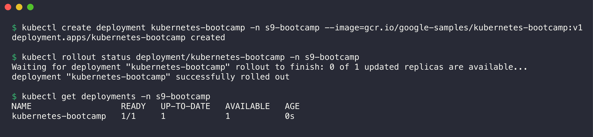

```console
$ kubectl create deployment kubernetes-bootcamp -n s9-bootcamp --image=gcr.io/google-samples/kubernetes-bootcamp:v1
deployment.apps/kubernetes-bootcamp created

$ kubectl rollout status deployment/kubernetes-bootcamp -n s9-bootcamp
Waiting for deployment "kubernetes-bootcamp" rollout to finish: 0 of 1 updated replicas are available...
deployment "kubernetes-bootcamp" successfully rolled out

$ kubectl get deployments -n s9-bootcamp
NAME                  READY   UP-TO-DATE   AVAILABLE   AGE
kubernetes-bootcamp   1/1     1            1           0s
```

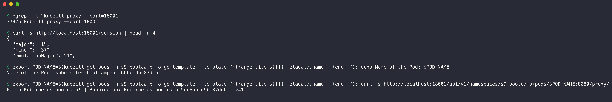

```console
$ pgrep -fl "kubectl proxy --port=18001"
37325 kubectl proxy --port=18001

$ curl -s http://localhost:18001/version | head -n 4
{
  "major": "1",
  "minor": "37",
  "emulationMajor": "1",

$ export POD_NAME=$(kubectl get pods -n s9-bootcamp -o go-template --template "{{range .items}}{{.metadata.name}}{{end}}"); echo Name of the Pod: $POD_NAME
Name of the Pod: kubernetes-bootcamp-5cc66bcc9b-87dch

$ export POD_NAME=$(kubectl get pods -n s9-bootcamp -o go-template --template "{{range .items}}{{.metadata.name}}{{end}}"); curl -s http://localhost:18001/api/v1/namespaces/s9-bootcamp/pods/$POD_NAME:8080/proxy/
Hello Kubernetes bootcamp! | Running on: kubernetes-bootcamp-5cc66bcc9b-87dch | v=1
```

`kubectl proxy` opens an authenticated tunnel from the Mac to the API server. The API server then forwards the request to port 8080 of the Pod. The app answers with its Pod name and `v=1`.

### Module 3: Explore your app

1. List the Pods and describe them.
2. Read the container logs.
3. Run commands in the container with `kubectl exec`.

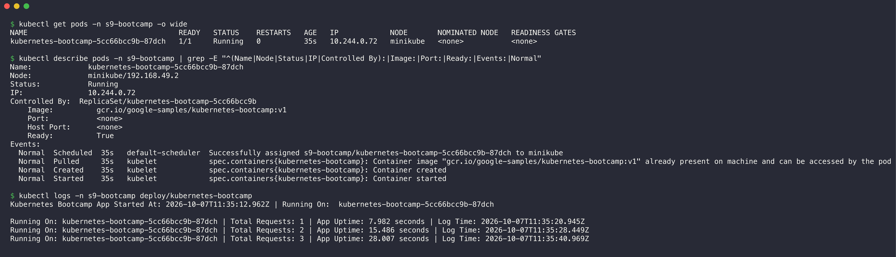

```console
$ kubectl get pods -n s9-bootcamp -o wide
NAME                                   READY   STATUS    RESTARTS   AGE   IP            NODE       NOMINATED NODE   READINESS GATES
kubernetes-bootcamp-5cc66bcc9b-87dch   1/1     Running   0          35s   10.244.0.72   minikube   <none>           <none>

$ kubectl describe pods -n s9-bootcamp | grep -E "^(Name|Node|Status|IP|Controlled By):|Image:|Port:|Ready:|Events:|Normal"
Name:             kubernetes-bootcamp-5cc66bcc9b-87dch
Node:             minikube/192.168.49.2
Status:           Running
IP:               10.244.0.72
Controlled By:  ReplicaSet/kubernetes-bootcamp-5cc66bcc9b
    Image:          gcr.io/google-samples/kubernetes-bootcamp:v1
    Port:           <none>
    Host Port:      <none>
    Ready:          True
Events:
  Normal  Scheduled  35s   default-scheduler  Successfully assigned s9-bootcamp/kubernetes-bootcamp-5cc66bcc9b-87dch to minikube
  Normal  Pulled     35s   kubelet            spec.containers{kubernetes-bootcamp}: Container image "gcr.io/google-samples/kubernetes-bootcamp:v1" already present on machine and can be accessed by the pod
  Normal  Created    35s   kubelet            spec.containers{kubernetes-bootcamp}: Container created
  Normal  Started    35s   kubelet            spec.containers{kubernetes-bootcamp}: Container started

$ kubectl logs -n s9-bootcamp deploy/kubernetes-bootcamp
Kubernetes Bootcamp App Started At: 2026-10-07T11:35:12.962Z | Running On:  kubernetes-bootcamp-5cc66bcc9b-87dch 

Running On: kubernetes-bootcamp-5cc66bcc9b-87dch | Total Requests: 1 | App Uptime: 7.982 seconds | Log Time: 2026-10-07T11:35:20.945Z
Running On: kubernetes-bootcamp-5cc66bcc9b-87dch | Total Requests: 2 | App Uptime: 15.486 seconds | Log Time: 2026-10-07T11:35:28.449Z
Running On: kubernetes-bootcamp-5cc66bcc9b-87dch | Total Requests: 3 | App Uptime: 28.007 seconds | Log Time: 2026-10-07T11:35:40.969Z
```

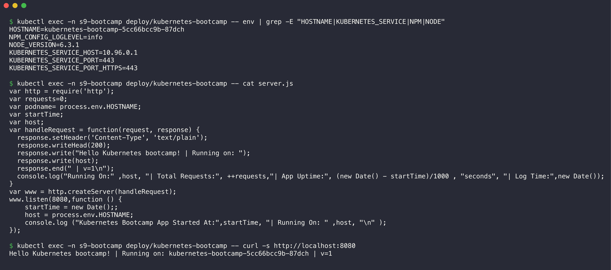

```console
$ kubectl exec -n s9-bootcamp deploy/kubernetes-bootcamp -- env | grep -E "HOSTNAME|KUBERNETES_SERVICE|NPM|NODE"
HOSTNAME=kubernetes-bootcamp-5cc66bcc9b-87dch
NPM_CONFIG_LOGLEVEL=info
NODE_VERSION=6.3.1
KUBERNETES_SERVICE_HOST=10.96.0.1
KUBERNETES_SERVICE_PORT=443
KUBERNETES_SERVICE_PORT_HTTPS=443

$ kubectl exec -n s9-bootcamp deploy/kubernetes-bootcamp -- cat server.js
var http = require('http');
var requests=0;
var podname= process.env.HOSTNAME;
var startTime;
var host;
var handleRequest = function(request, response) {
  response.setHeader('Content-Type', 'text/plain');
  response.writeHead(200);
  response.write("Hello Kubernetes bootcamp! | Running on: ");
  response.write(host);
  response.end(" | v=1\n");
  console.log("Running On:" ,host, "| Total Requests:", ++requests,"| App Uptime:", (new Date() - startTime)/1000 , "seconds", "| Log Time:",new Date());
}
var www = http.createServer(handleRequest);
www.listen(8080,function () {
    startTime = new Date();;
    host = process.env.HOSTNAME;
    console.log ("Kubernetes Bootcamp App Started At:",startTime, "| Running On: " ,host, "\n" );
});

$ kubectl exec -n s9-bootcamp deploy/kubernetes-bootcamp -- curl -s http://localhost:8080
Hello Kubernetes bootcamp! | Running on: kubernetes-bootcamp-5cc66bcc9b-87dch | v=1
```

- `Controlled By: ReplicaSet/...` shows the owner chain: Deployment, then ReplicaSet, then Pod.
- The logs show one line for each request. My `curl` calls through `kubectl proxy` in module 2 caused these requests. I ran the proxy call three times while I made the screenshot.
- The `server.js` file is the full app: a Node.js 6 HTTP server on port 8080.
- Kubernetes adds the `KUBERNETES_SERVICE_*` variables to each container, so the app can find the API server.

### Module 4: Use a Service to expose your app

1. Expose the Deployment with a NodePort Service.
2. Find the NodePort and call the app on the node IP.
3. Call the app from the Mac through `kubectl port-forward` on port 18002.
4. Use labels to select objects, and add the label `version=v1` to the Pod.
5. Delete the Service and make sure that the NodePort does not answer.

The node IP `192.168.49.2` is inside the Docker network of Docker Desktop. The Mac cannot reach it, so I ran `curl` on the node with `minikube ssh`.

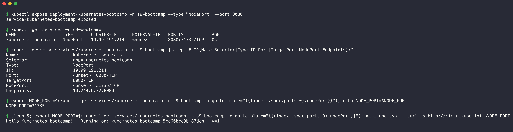

```console
$ kubectl expose deployment/kubernetes-bootcamp -n s9-bootcamp --type="NodePort" --port 8080
service/kubernetes-bootcamp exposed

$ kubectl get services -n s9-bootcamp
NAME                  TYPE       CLUSTER-IP      EXTERNAL-IP   PORT(S)          AGE
kubernetes-bootcamp   NodePort   10.99.191.214   <none>        8080:31735/TCP   0s

$ kubectl describe services/kubernetes-bootcamp -n s9-bootcamp | grep -E "^(Name|Selector|Type|IP|Port|TargetPort|NodePort|Endpoints):"
Name:                     kubernetes-bootcamp
Selector:                 app=kubernetes-bootcamp
Type:                     NodePort
IP:                       10.99.191.214
Port:                     <unset>  8080/TCP
TargetPort:               8080/TCP
NodePort:                 <unset>  31735/TCP
Endpoints:                10.244.0.72:8080

$ export NODE_PORT=$(kubectl get services/kubernetes-bootcamp -n s9-bootcamp -o go-template="{{(index .spec.ports 0).nodePort}}"); echo NODE_PORT=$NODE_PORT
NODE_PORT=31735

$ sleep 5; export NODE_PORT=$(kubectl get services/kubernetes-bootcamp -n s9-bootcamp -o go-template="{{(index .spec.ports 0).nodePort}}"); minikube ssh -- curl -s http://$(minikube ip):$NODE_PORT
Hello Kubernetes bootcamp! | Running on: kubernetes-bootcamp-5cc66bcc9b-87dch | v=1
```

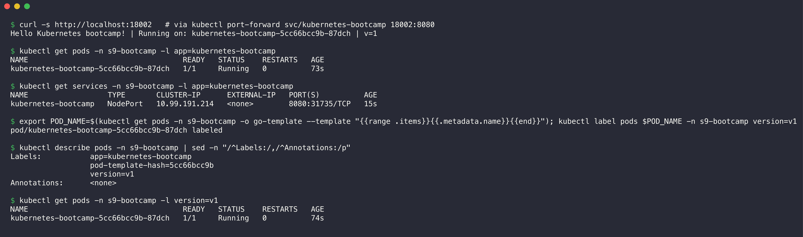

```console
$ curl -s http://localhost:18002   # via kubectl port-forward svc/kubernetes-bootcamp 18002:8080
Hello Kubernetes bootcamp! | Running on: kubernetes-bootcamp-5cc66bcc9b-87dch | v=1

$ kubectl get pods -n s9-bootcamp -l app=kubernetes-bootcamp
NAME                                   READY   STATUS    RESTARTS   AGE
kubernetes-bootcamp-5cc66bcc9b-87dch   1/1     Running   0          73s

$ kubectl get services -n s9-bootcamp -l app=kubernetes-bootcamp
NAME                  TYPE       CLUSTER-IP      EXTERNAL-IP   PORT(S)          AGE
kubernetes-bootcamp   NodePort   10.99.191.214   <none>        8080:31735/TCP   15s

$ export POD_NAME=$(kubectl get pods -n s9-bootcamp -o go-template --template "{{range .items}}{{.metadata.name}}{{end}}"); kubectl label pods $POD_NAME -n s9-bootcamp version=v1
pod/kubernetes-bootcamp-5cc66bcc9b-87dch labeled

$ kubectl describe pods -n s9-bootcamp | sed -n "/^Labels:/,/^Annotations:/p"
Labels:           app=kubernetes-bootcamp
                  pod-template-hash=5cc66bcc9b
                  version=v1
Annotations:      <none>

$ kubectl get pods -n s9-bootcamp -l version=v1
NAME                                   READY   STATUS    RESTARTS   AGE
kubernetes-bootcamp-5cc66bcc9b-87dch   1/1     Running   0          74s
```

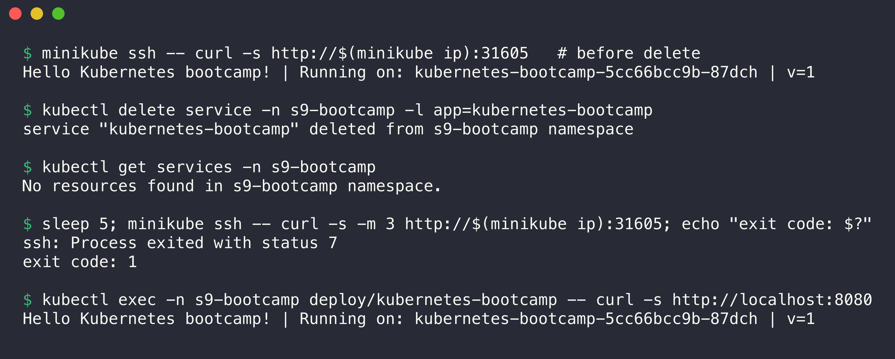

```console
$ minikube ssh -- curl -s http://$(minikube ip):31605   # before delete
Hello Kubernetes bootcamp! | Running on: kubernetes-bootcamp-5cc66bcc9b-87dch | v=1

$ kubectl delete service -n s9-bootcamp -l app=kubernetes-bootcamp
service "kubernetes-bootcamp" deleted from s9-bootcamp namespace

$ kubectl get services -n s9-bootcamp
No resources found in s9-bootcamp namespace.

$ sleep 5; minikube ssh -- curl -s -m 3 http://$(minikube ip):31605; echo "exit code: $?"
ssh: Process exited with status 7
exit code: 1

$ kubectl exec -n s9-bootcamp deploy/kubernetes-bootcamp -- curl -s http://localhost:8080
Hello Kubernetes bootcamp! | Running on: kubernetes-bootcamp-5cc66bcc9b-87dch | v=1
```

- The `kubectl create deployment` command adds the label `app=kubernetes-bootcamp`. The Service uses this label as its selector.
- A NodePort Service opens the same port (here `31735`) on each node and sends the traffic to the Pod endpoints.
- After I deleted the Service, `curl` exited with status 7 (connection refused). The app still answered inside the Pod. The Service only routes traffic; it does not run the app.
- **Note:** In the first try, the NodePort answered for some seconds after the delete. kube-proxy needs a short time to remove the iptables rules. The `sleep 5` gives kube-proxy this time. I used a new Service (NodePort `31605`) for this second try.

### Module 5: Scale your app

1. Make the Service again (`kubectl expose`, same command as module 4).
2. Scale the Deployment to 4 replicas.
3. Send 8 requests to the NodePort and examine which Pod answers.
4. Scale the Deployment down to 2 replicas.

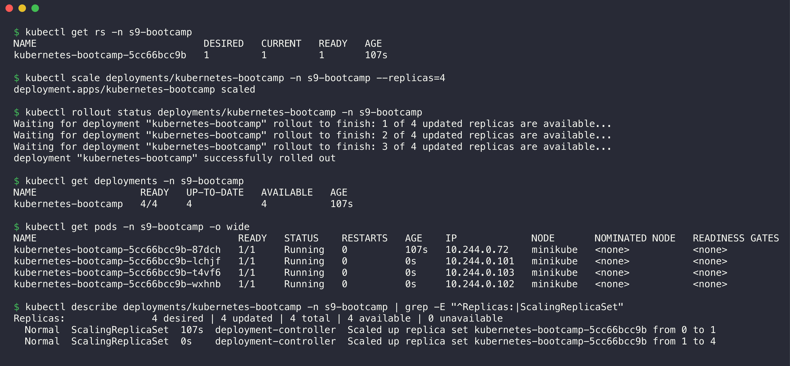

```console
$ kubectl get rs -n s9-bootcamp
NAME                             DESIRED   CURRENT   READY   AGE
kubernetes-bootcamp-5cc66bcc9b   1         1         1       107s

$ kubectl scale deployments/kubernetes-bootcamp -n s9-bootcamp --replicas=4
deployment.apps/kubernetes-bootcamp scaled

$ kubectl rollout status deployments/kubernetes-bootcamp -n s9-bootcamp
Waiting for deployment "kubernetes-bootcamp" rollout to finish: 1 of 4 updated replicas are available...
Waiting for deployment "kubernetes-bootcamp" rollout to finish: 2 of 4 updated replicas are available...
Waiting for deployment "kubernetes-bootcamp" rollout to finish: 3 of 4 updated replicas are available...
deployment "kubernetes-bootcamp" successfully rolled out

$ kubectl get deployments -n s9-bootcamp
NAME                  READY   UP-TO-DATE   AVAILABLE   AGE
kubernetes-bootcamp   4/4     4            4           107s

$ kubectl get pods -n s9-bootcamp -o wide
NAME                                   READY   STATUS    RESTARTS   AGE    IP             NODE       NOMINATED NODE   READINESS GATES
kubernetes-bootcamp-5cc66bcc9b-87dch   1/1     Running   0          107s   10.244.0.72    minikube   <none>           <none>
kubernetes-bootcamp-5cc66bcc9b-lchjf   1/1     Running   0          0s     10.244.0.101   minikube   <none>           <none>
kubernetes-bootcamp-5cc66bcc9b-t4vf6   1/1     Running   0          0s     10.244.0.103   minikube   <none>           <none>
kubernetes-bootcamp-5cc66bcc9b-wxhnb   1/1     Running   0          0s     10.244.0.102   minikube   <none>           <none>

$ kubectl describe deployments/kubernetes-bootcamp -n s9-bootcamp | grep -E "^Replicas:|ScalingReplicaSet"
Replicas:               4 desired | 4 updated | 4 total | 4 available | 0 unavailable
  Normal  ScalingReplicaSet  107s  deployment-controller  Scaled up replica set kubernetes-bootcamp-5cc66bcc9b from 0 to 1
  Normal  ScalingReplicaSet  0s    deployment-controller  Scaled up replica set kubernetes-bootcamp-5cc66bcc9b from 1 to 4
```

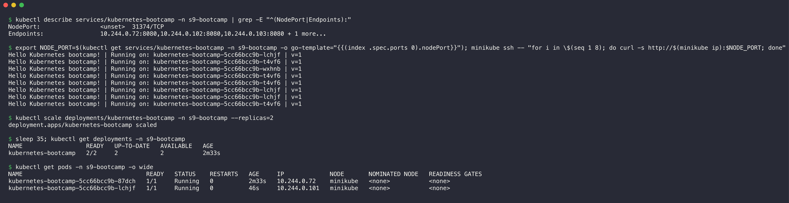

```console
$ kubectl describe services/kubernetes-bootcamp -n s9-bootcamp | grep -E "^(NodePort|Endpoints):"
NodePort:                 <unset>  31374/TCP
Endpoints:                10.244.0.72:8080,10.244.0.102:8080,10.244.0.103:8080 + 1 more...

$ export NODE_PORT=$(kubectl get services/kubernetes-bootcamp -n s9-bootcamp -o go-template="{{(index .spec.ports 0).nodePort}}"); minikube ssh -- "for i in \$(seq 1 8); do curl -s http://$(minikube ip):$NODE_PORT; done"
Hello Kubernetes bootcamp! | Running on: kubernetes-bootcamp-5cc66bcc9b-lchjf | v=1
Hello Kubernetes bootcamp! | Running on: kubernetes-bootcamp-5cc66bcc9b-t4vf6 | v=1
Hello Kubernetes bootcamp! | Running on: kubernetes-bootcamp-5cc66bcc9b-wxhnb | v=1
Hello Kubernetes bootcamp! | Running on: kubernetes-bootcamp-5cc66bcc9b-t4vf6 | v=1
Hello Kubernetes bootcamp! | Running on: kubernetes-bootcamp-5cc66bcc9b-t4vf6 | v=1
Hello Kubernetes bootcamp! | Running on: kubernetes-bootcamp-5cc66bcc9b-lchjf | v=1
Hello Kubernetes bootcamp! | Running on: kubernetes-bootcamp-5cc66bcc9b-lchjf | v=1
Hello Kubernetes bootcamp! | Running on: kubernetes-bootcamp-5cc66bcc9b-t4vf6 | v=1

$ kubectl scale deployments/kubernetes-bootcamp -n s9-bootcamp --replicas=2
deployment.apps/kubernetes-bootcamp scaled

$ sleep 35; kubectl get deployments -n s9-bootcamp
NAME                  READY   UP-TO-DATE   AVAILABLE   AGE
kubernetes-bootcamp   2/2     2            2           2m33s

$ kubectl get pods -n s9-bootcamp -o wide
NAME                                   READY   STATUS    RESTARTS   AGE     IP             NODE       NOMINATED NODE   READINESS GATES
kubernetes-bootcamp-5cc66bcc9b-87dch   1/1     Running   0          2m33s   10.244.0.72    minikube   <none>           <none>
kubernetes-bootcamp-5cc66bcc9b-lchjf   1/1     Running   0          46s     10.244.0.101   minikube   <none>           <none>
```

- Scaling changes only the `replicas` field of the ReplicaSet. The ReplicaSet name stays the same, so no new revision starts.
- The 8 requests went to 3 different Pods. kube-proxy selects an endpoint at random for each new connection. The fourth Pod got no request in this small sample.
- On scale down, the ReplicaSet removed two Pods. The app does not handle SIGTERM, so each Pod needed the full 30-second grace period to stop. For this reason, I waited 35 seconds.

### Module 6: Update your app

1. Change the image to `docker.io/jocatalin/kubernetes-bootcamp:v2`.
2. Monitor the rollout and make sure that all Pods answer `v=2`.
3. Change the image to a tag that does not exist (`v10`).
4. Examine the failed rollout.
5. Roll back with `kubectl rollout undo`.

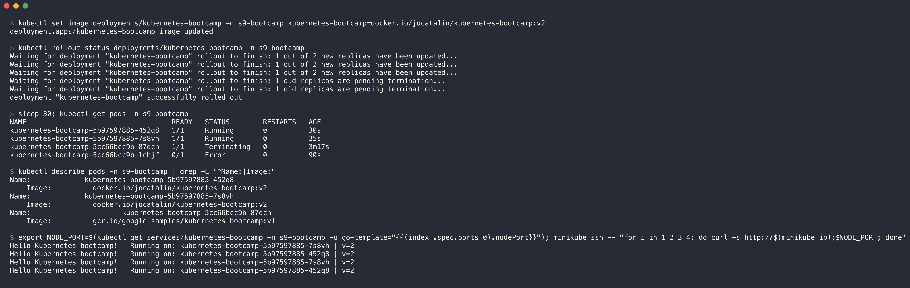

```console
$ kubectl set image deployments/kubernetes-bootcamp -n s9-bootcamp kubernetes-bootcamp=docker.io/jocatalin/kubernetes-bootcamp:v2
deployment.apps/kubernetes-bootcamp image updated

$ kubectl rollout status deployments/kubernetes-bootcamp -n s9-bootcamp
Waiting for deployment "kubernetes-bootcamp" rollout to finish: 1 out of 2 new replicas have been updated...
Waiting for deployment "kubernetes-bootcamp" rollout to finish: 1 out of 2 new replicas have been updated...
Waiting for deployment "kubernetes-bootcamp" rollout to finish: 1 out of 2 new replicas have been updated...
Waiting for deployment "kubernetes-bootcamp" rollout to finish: 1 old replicas are pending termination...
Waiting for deployment "kubernetes-bootcamp" rollout to finish: 1 old replicas are pending termination...
deployment "kubernetes-bootcamp" successfully rolled out

$ sleep 30; kubectl get pods -n s9-bootcamp
NAME                                   READY   STATUS        RESTARTS   AGE
kubernetes-bootcamp-5b97597885-452q8   1/1     Running       0          30s
kubernetes-bootcamp-5b97597885-7s8vh   1/1     Running       0          35s
kubernetes-bootcamp-5cc66bcc9b-87dch   1/1     Terminating   0          3m17s
kubernetes-bootcamp-5cc66bcc9b-lchjf   0/1     Error         0          90s

$ kubectl describe pods -n s9-bootcamp | grep -E "^Name:|Image:"
Name:             kubernetes-bootcamp-5b97597885-452q8
    Image:          docker.io/jocatalin/kubernetes-bootcamp:v2
Name:             kubernetes-bootcamp-5b97597885-7s8vh
    Image:          docker.io/jocatalin/kubernetes-bootcamp:v2
Name:                      kubernetes-bootcamp-5cc66bcc9b-87dch
    Image:          gcr.io/google-samples/kubernetes-bootcamp:v1

$ export NODE_PORT=$(kubectl get services/kubernetes-bootcamp -n s9-bootcamp -o go-template="{{(index .spec.ports 0).nodePort}}"); minikube ssh -- "for i in 1 2 3 4; do curl -s http://$(minikube ip):$NODE_PORT; done"
Hello Kubernetes bootcamp! | Running on: kubernetes-bootcamp-5b97597885-7s8vh | v=2
Hello Kubernetes bootcamp! | Running on: kubernetes-bootcamp-5b97597885-452q8 | v=2
Hello Kubernetes bootcamp! | Running on: kubernetes-bootcamp-5b97597885-7s8vh | v=2
Hello Kubernetes bootcamp! | Running on: kubernetes-bootcamp-5b97597885-452q8 | v=2
```

The Deployment made a new ReplicaSet (`5b97597885`) for the v2 Pod template. It increased the new ReplicaSet and decreased the old one step by step. The old v1 Pods show `Terminating` and `Error`, because the kubelet stopped them with SIGKILL after the grace period. All requests now answer `v=2`.

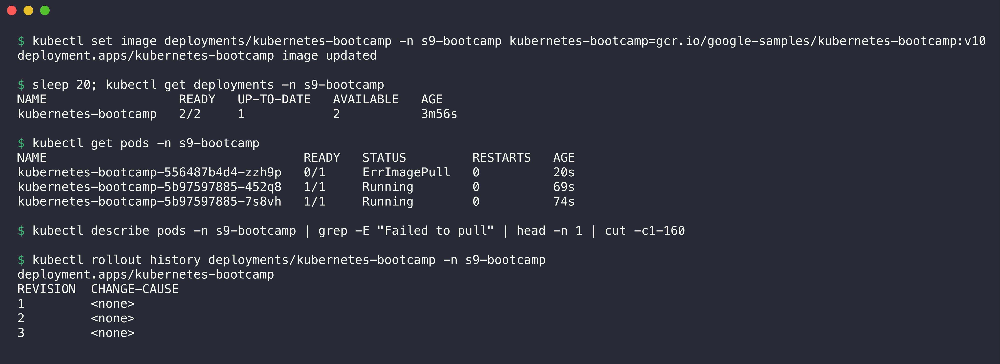

```console
$ kubectl set image deployments/kubernetes-bootcamp -n s9-bootcamp kubernetes-bootcamp=gcr.io/google-samples/kubernetes-bootcamp:v10
deployment.apps/kubernetes-bootcamp image updated

$ sleep 20; kubectl get deployments -n s9-bootcamp
NAME                  READY   UP-TO-DATE   AVAILABLE   AGE
kubernetes-bootcamp   2/2     1            2           3m56s

$ kubectl get pods -n s9-bootcamp
NAME                                   READY   STATUS         RESTARTS   AGE
kubernetes-bootcamp-556487b4d4-zzh9p   0/1     ErrImagePull   0          20s
kubernetes-bootcamp-5b97597885-452q8   1/1     Running        0          69s
kubernetes-bootcamp-5b97597885-7s8vh   1/1     Running        0          74s

$ kubectl describe pods -n s9-bootcamp | grep -E "Failed to pull" | head -n 1 | cut -c1-160

$ kubectl rollout history deployments/kubernetes-bootcamp -n s9-bootcamp
deployment.apps/kubernetes-bootcamp 
REVISION  CHANGE-CAUSE
1         <none>
2         <none>
3         <none>
```

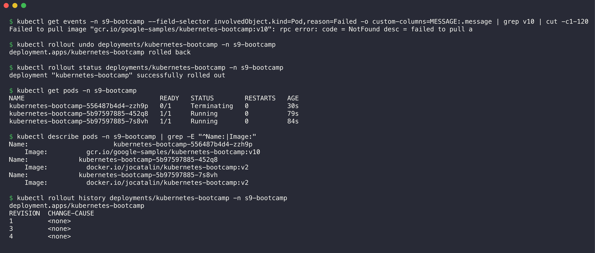

```console
$ kubectl get events -n s9-bootcamp --field-selector involvedObject.kind=Pod,reason=Failed -o custom-columns=MESSAGE:.message | grep v10 | cut -c1-120
Failed to pull image "gcr.io/google-samples/kubernetes-bootcamp:v10": rpc error: code = NotFound desc = failed to pull a

$ kubectl rollout undo deployments/kubernetes-bootcamp -n s9-bootcamp
deployment.apps/kubernetes-bootcamp rolled back

$ kubectl rollout status deployments/kubernetes-bootcamp -n s9-bootcamp
deployment "kubernetes-bootcamp" successfully rolled out

$ kubectl get pods -n s9-bootcamp
NAME                                   READY   STATUS        RESTARTS   AGE
kubernetes-bootcamp-556487b4d4-zzh9p   0/1     Terminating   0          30s
kubernetes-bootcamp-5b97597885-452q8   1/1     Running       0          79s
kubernetes-bootcamp-5b97597885-7s8vh   1/1     Running       0          84s

$ kubectl describe pods -n s9-bootcamp | grep -E "^Name:|Image:"
Name:                      kubernetes-bootcamp-556487b4d4-zzh9p
    Image:          gcr.io/google-samples/kubernetes-bootcamp:v10
Name:             kubernetes-bootcamp-5b97597885-452q8
    Image:          docker.io/jocatalin/kubernetes-bootcamp:v2
Name:             kubernetes-bootcamp-5b97597885-7s8vh
    Image:          docker.io/jocatalin/kubernetes-bootcamp:v2

$ kubectl rollout history deployments/kubernetes-bootcamp -n s9-bootcamp
deployment.apps/kubernetes-bootcamp 
REVISION  CHANGE-CAUSE
1         <none>
3         <none>
4         <none>
```

- The `v10` tag does not exist, so the new Pod stayed in `ErrImagePull`. The Deployment shows `UP-TO-DATE 1` but `READY 2/2`. The rolling update stopped and kept the two v2 Pods. The app stayed available.
- My first `grep` on `describe` found nothing, because `describe` wraps the long event line. The `kubectl get events` command shows the full message.
- `kubectl rollout undo` returned to the v2 template. Kubernetes moved revision 2 to the new number 4, so the history shows 1, 3 and 4.

### Clean up

```bash
kill <kubectl proxy PID>
kubectl delete namespace s9-basics s9-bootcamp
```
