# Session 12: Kubernetes Ingress, ConfigMaps & Secrets

**Name:** Kartavya Panchal  
**Roll No.:** 24BCS10343

All demos ran on a local minikube cluster (Kubernetes v1.37, docker driver, macOS arm64) with the `ingress` addon (ingress-nginx controller v1.15.1). The demos use the namespaces `s12-config`, `s12-ingress` and `s12-trouble`.

## Folder structure

```text
Kubernetes-Ingress-ConfigMaps-&-Secrets/
├── README.md                          # this file (Tasks 1, 2, 3)
├── 00-namespaces.yaml                 # s12-config, s12-ingress, s12-trouble
├── 01-configmap/
│   ├── configmap.yaml                 # ConfigMap YAML
│   └── pod.yaml                       # Pod: envFrom + configMapKeyRef + volume
├── 02-secret/
│   ├── secret.yaml                    # Secret YAML (dummy values only)
│   └── pod.yaml                       # Pod: secretKeyRef + volume
├── 03-ingress/
│   ├── echo-config.yaml               # nginx config for the 3 backends (a ConfigMap)
│   ├── apps.yaml                      # frontend, api, admin: Deployments + Services
│   └── ingress.yaml                   # Ingress YAML: host + path routing
├── ingress-vs-ingress-controller/
│   └── README.md                      # Task 4
├── troubleshooting/
│   ├── README.md                      # Task 5: 4 scenarios
│   ├── 01-secret-base64-newline/
│   ├── 02-configmap-missing-key/
│   ├── 03-ingress-wrong-service/
│   └── 04-ingress-wrong-class/
└── screenshots/
```

## Task index

| Task | Where |
|------|-------|
| Task 1: ConfigMap | [Below](#task-1-configmap) |
| Task 2: Secret | [Below](#task-2-secret) |
| Task 3: Ingress | [Below](#task-3-ingress) |
| Task 4: Ingress vs Ingress Controller | [ingress-vs-ingress-controller/README.md](ingress-vs-ingress-controller/README.md) |
| Task 5: Troubleshooting | [troubleshooting/README.md](troubleshooting/README.md) |

## Setup

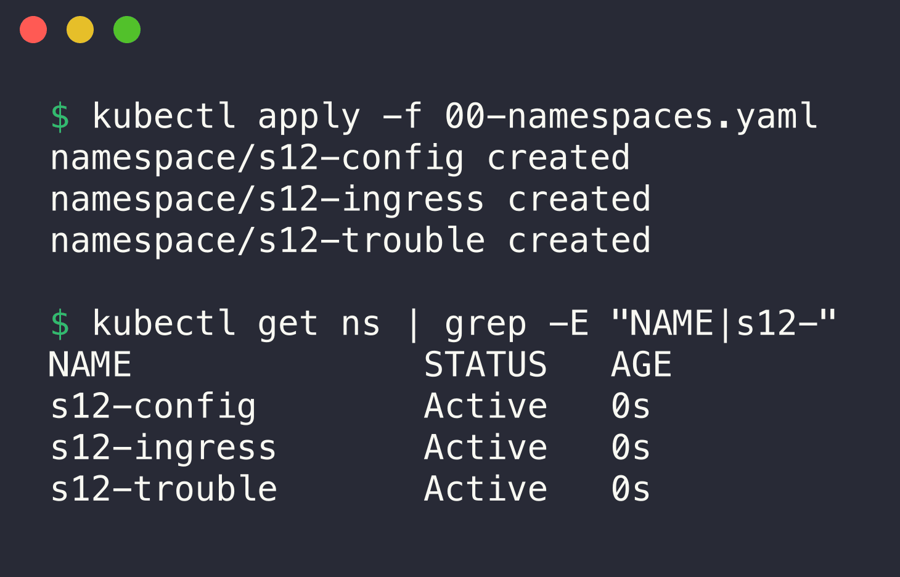

```console
$ kubectl apply -f 00-namespaces.yaml
namespace/s12-config created
namespace/s12-ingress created
namespace/s12-trouble created

$ kubectl get ns | grep -E "NAME|s12-"
NAME              STATUS   AGE
s12-config        Active   0s
s12-ingress       Active   0s
s12-trouble       Active   0s
```

---

## Task 1: ConfigMap

A ConfigMap stores configuration that is not secret, as key-value pairs. It keeps the configuration out of the container image. Thus the same image runs in dev, staging and production with different ConfigMaps.

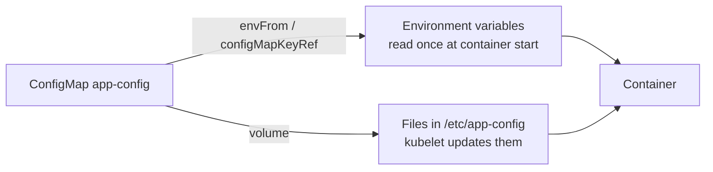

### Step 1: Create the ConfigMap and store the values

File: [01-configmap/configmap.yaml](01-configmap/configmap.yaml)

```yaml
data:
  APP_ENV: "staging"
  LOG_LEVEL: "debug"
  APP_PORT: "8080"
  FEATURE_NEW_UI: "true"
  app.properties: |
    app.name=yatri-booking
    app.currency=INR
    app.max-booking-days=30
    app.support-url=https://example.com/support
```

The first four keys are single values. The key `app.properties` holds a full file.

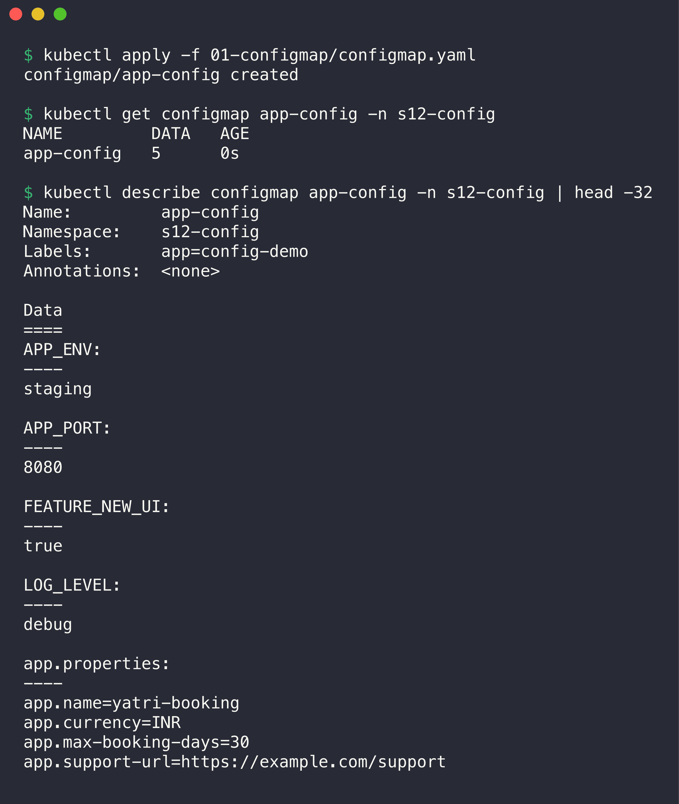

```console
$ kubectl apply -f 01-configmap/configmap.yaml
configmap/app-config created

$ kubectl get configmap app-config -n s12-config
NAME         DATA   AGE
app-config   5      0s

$ kubectl describe configmap app-config -n s12-config | head -32
Name:         app-config
Namespace:    s12-config
Labels:       app=config-demo
Annotations:  <none>

Data
====
APP_ENV:
----
staging

APP_PORT:
----
8080

FEATURE_NEW_UI:
----
true

LOG_LEVEL:
----
debug

app.properties:
----
app.name=yatri-booking
app.currency=INR
app.max-booking-days=30
app.support-url=https://example.com/support
```

### Step 2: Inject the ConfigMap into a Pod

File: [01-configmap/pod.yaml](01-configmap/pod.yaml)

The Pod uses three methods:

```yaml
envFrom:                       # 1. every key becomes an environment variable
  - configMapRef:
      name: app-config
env:
  - name: ENVIRONMENT_NAME     # 2. one key with a new variable name
    valueFrom:
      configMapKeyRef:
        name: app-config
        key: APP_ENV
volumeMounts:                  # 3. every key becomes a file
  - name: config-volume
    mountPath: /etc/app-config
```

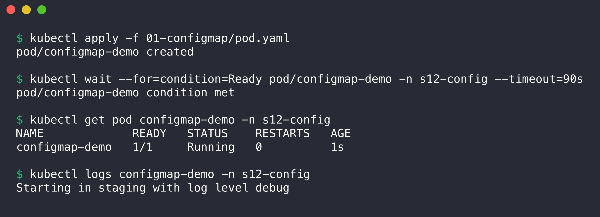

```console
$ kubectl apply -f 01-configmap/pod.yaml
pod/configmap-demo created

$ kubectl wait --for=condition=Ready pod/configmap-demo -n s12-config --timeout=90s
pod/configmap-demo condition met

$ kubectl get pod configmap-demo -n s12-config
NAME             READY   STATUS    RESTARTS   AGE
configmap-demo   1/1     Running   0          1s

$ kubectl logs configmap-demo -n s12-config
Starting in staging with log level debug
```

The start command of the container already used `$APP_ENV` and `$LOG_LEVEL`.

### Step 3: Verify the values inside the container

Environment variables:

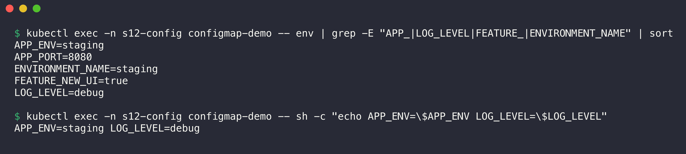

```console
$ kubectl exec -n s12-config configmap-demo -- env | grep -E "APP_|LOG_LEVEL|FEATURE_|ENVIRONMENT_NAME" | sort
APP_ENV=staging
APP_PORT=8080
ENVIRONMENT_NAME=staging
FEATURE_NEW_UI=true
LOG_LEVEL=debug

$ kubectl exec -n s12-config configmap-demo -- sh -c "echo APP_ENV=\$APP_ENV LOG_LEVEL=\$LOG_LEVEL"
APP_ENV=staging LOG_LEVEL=debug
```

`envFrom` made the four simple keys into variables. `ENVIRONMENT_NAME` comes from the key `APP_ENV`. `envFrom` skips the key `app.properties`, because a dot is not valid in a shell variable name.

Mounted volume:

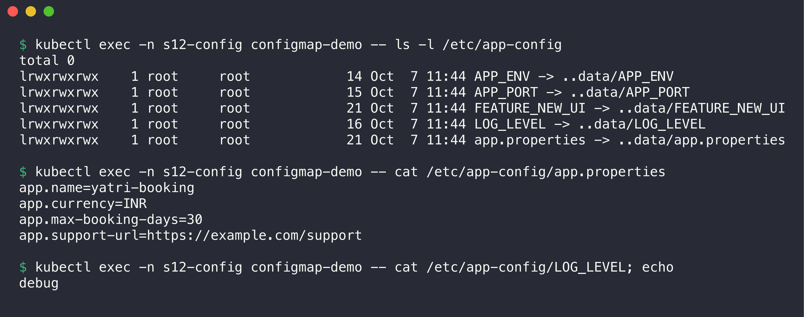

```console
$ kubectl exec -n s12-config configmap-demo -- ls -l /etc/app-config
total 0
lrwxrwxrwx    1 root     root            14 Oct  7 11:44 APP_ENV -> ..data/APP_ENV
lrwxrwxrwx    1 root     root            15 Oct  7 11:44 APP_PORT -> ..data/APP_PORT
lrwxrwxrwx    1 root     root            21 Oct  7 11:44 FEATURE_NEW_UI -> ..data/FEATURE_NEW_UI
lrwxrwxrwx    1 root     root            16 Oct  7 11:44 LOG_LEVEL -> ..data/LOG_LEVEL
lrwxrwxrwx    1 root     root            21 Oct  7 11:44 app.properties -> ..data/app.properties

$ kubectl exec -n s12-config configmap-demo -- cat /etc/app-config/app.properties
app.name=yatri-booking
app.currency=INR
app.max-booking-days=30
app.support-url=https://example.com/support

$ kubectl exec -n s12-config configmap-demo -- cat /etc/app-config/LOG_LEVEL; echo
debug
```

Each key is a file. The files are symbolic links into `..data`. The kubelet uses this to swap all files at the same time when the ConfigMap changes.

### Step 4: Update the ConfigMap (volume vs environment variable)

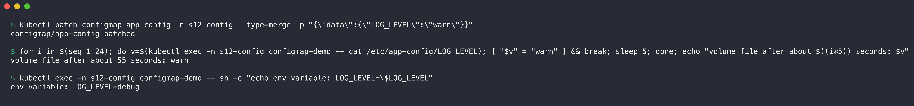

```console
$ kubectl patch configmap app-config -n s12-config --type=merge -p "{\"data\":{\"LOG_LEVEL\":\"warn\"}}"
configmap/app-config patched

$ for i in $(seq 1 24); do v=$(kubectl exec -n s12-config configmap-demo -- cat /etc/app-config/LOG_LEVEL); [ "$v" = "warn" ] && break; sleep 5; done; echo "volume file after about $((i*5)) seconds: $v"
volume file after about 55 seconds: warn

$ kubectl exec -n s12-config configmap-demo -- sh -c "echo env variable: LOG_LEVEL=\$LOG_LEVEL"
env variable: LOG_LEVEL=debug
```

The kubelet updated the mounted file after about 55 seconds, without a restart. The environment variable still has the old value. Environment variables are fixed at container start. To apply a new value to variables, restart the Pods (for example `kubectl rollout restart deployment/<name>`).

---

## Task 2: Secret

A Secret stores sensitive data: passwords, tokens, keys, certificates. It works like a ConfigMap, but Kubernetes handles it with more care. RBAC can limit access to it. The kubelet keeps it in memory (tmpfs) on the node. `kubectl describe` does not print the values.

**WARNING:** Use only dummy values in demo files. All values in this folder (`admin`, `demo-password-123`, `demo-api-key-abc123`, `demo-token-xyz`) are dummy values.

### Step 1: Create the Secret and store the sensitive values

File: [02-secret/secret.yaml](02-secret/secret.yaml)

```yaml
apiVersion: v1
kind: Secret # gitleaks:allow (dummy demo values)
metadata:
  name: db-credentials
  namespace: s12-config
type: Opaque
data:
  DB_USER: YWRtaW4= # gitleaks:allow (dummy demo value)
  DB_PASSWORD: ZGVtby1wYXNzd29yZC0xMjM= # gitleaks:allow (dummy demo value)
  API_KEY: ZGVtby1hcGkta2V5LWFiYzEyMw== # gitleaks:allow (dummy demo value)
```

The values under `data` must be base64. Use `printf '%s'` or `echo -n` to encode them. A plain `echo` adds a newline (see [troubleshooting scenario 1](troubleshooting/README.md#scenario-1-secret-with-a-hidden-newline)). The `gitleaks:allow` comments are explained in [Step 5](#step-5-why-secrets-must-not-go-to-git).

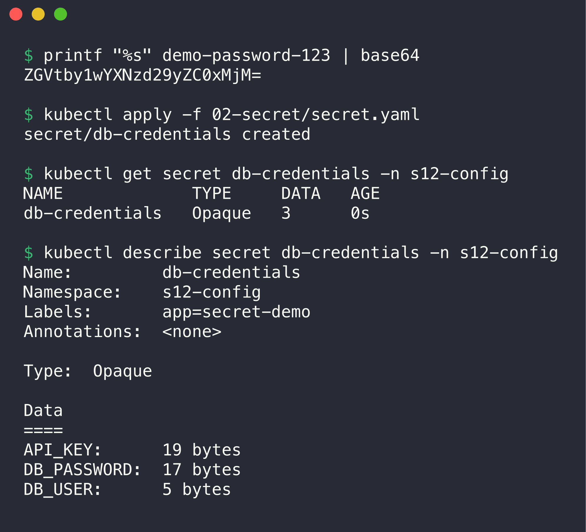

```console
$ printf "%s" demo-password-123 | base64
ZGVtby1wYXNzd29yZC0xMjM=

$ kubectl apply -f 02-secret/secret.yaml
secret/db-credentials created

$ kubectl get secret db-credentials -n s12-config
NAME             TYPE     DATA   AGE
db-credentials   Opaque   3      0s

$ kubectl describe secret db-credentials -n s12-config
Name:         db-credentials
Namespace:    s12-config
Labels:       app=secret-demo
Annotations:  <none>

Type:  Opaque

Data
====
API_KEY:      19 bytes
DB_PASSWORD:  17 bytes
DB_USER:      5 bytes
```

`kubectl describe` shows only the size of each value, not the value.

You can also create a Secret with a command. Then no YAML file with the value exists:

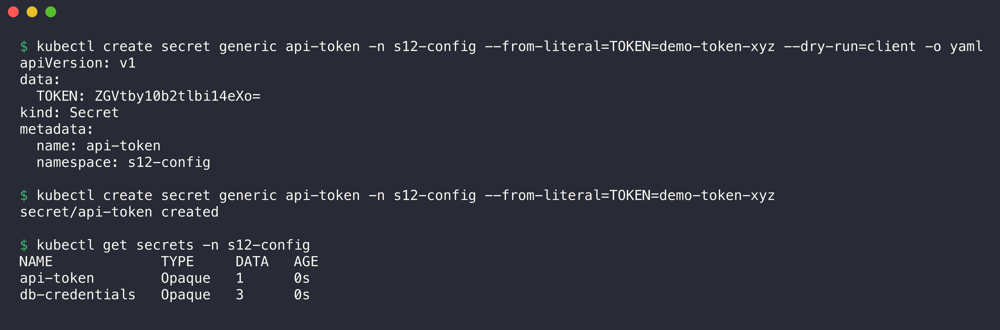

```console
$ kubectl create secret generic api-token -n s12-config --from-literal=TOKEN=demo-token-xyz --dry-run=client -o yaml
apiVersion: v1
data:
  TOKEN: ZGVtby10b2tlbi14eXo=
kind: Secret
metadata:
  name: api-token
  namespace: s12-config

$ kubectl create secret generic api-token -n s12-config --from-literal=TOKEN=demo-token-xyz
secret/api-token created

$ kubectl get secrets -n s12-config
NAME             TYPE     DATA   AGE
api-token        Opaque   1      0s
db-credentials   Opaque   3      0s
```

### Step 2: Inject the Secret into a Pod

File: [02-secret/pod.yaml](02-secret/pod.yaml)

```yaml
env:
  - name: DB_USER
    valueFrom:
      secretKeyRef:            # one environment variable from one key
        name: db-credentials
        key: DB_USER
  - name: DB_PASSWORD
    valueFrom:
      secretKeyRef:
        name: db-credentials
        key: DB_PASSWORD
volumeMounts:
  - name: secret-volume
    mountPath: /etc/secrets    # every key becomes a file
    readOnly: true
volumes:
  - name: secret-volume
    secret:
      secretName: db-credentials
      defaultMode: 0400        # only the owner can read the files
```

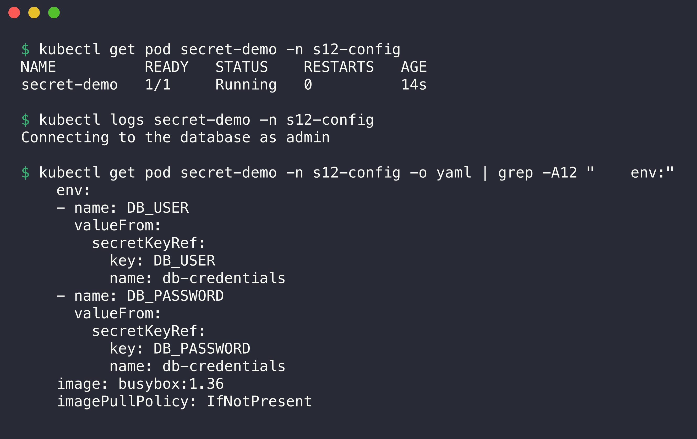

```console
$ kubectl get pod secret-demo -n s12-config
NAME          READY   STATUS    RESTARTS   AGE
secret-demo   1/1     Running   0          14s

$ kubectl logs secret-demo -n s12-config
Connecting to the database as admin

$ kubectl get pod secret-demo -n s12-config -o yaml | grep -A12 "    env:"
    env:
    - name: DB_USER
      valueFrom:
        secretKeyRef:
          key: DB_USER
          name: db-credentials
    - name: DB_PASSWORD
      valueFrom:
        secretKeyRef:
          key: DB_PASSWORD
          name: db-credentials
    image: busybox:1.36
    imagePullPolicy: IfNotPresent
```

I applied the Pod with `kubectl apply -f 02-secret/pod.yaml`. The Pod spec holds only a reference to the Secret, not the value.

### Step 3: Verify the values inside the container

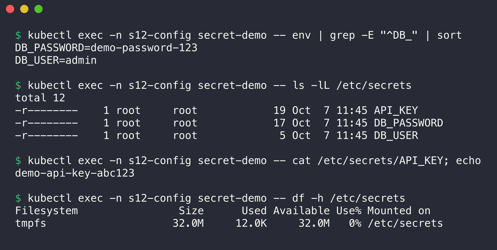

```console
$ kubectl exec -n s12-config secret-demo -- env | grep -E "^DB_" | sort
DB_PASSWORD=demo-password-123
DB_USER=admin

$ kubectl exec -n s12-config secret-demo -- ls -lL /etc/secrets
total 12
-r--------    1 root     root            19 Oct  7 11:45 API_KEY
-r--------    1 root     root            17 Oct  7 11:45 DB_PASSWORD
-r--------    1 root     root             5 Oct  7 11:45 DB_USER

$ kubectl exec -n s12-config secret-demo -- cat /etc/secrets/API_KEY; echo
demo-api-key-abc123

$ kubectl exec -n s12-config secret-demo -- df -h /etc/secrets
Filesystem                Size      Used Available Use% Mounted on
tmpfs                    32.0M     12.0K     32.0M   0% /etc/secrets
```

- Inside the container, the values are plain text. Kubernetes decoded the base64.
- The files have mode `-r--------` (0400) from `defaultMode`.
- The volume is `tmpfs` (memory). The kubelet does not write the Secret to the disk of the node.

### Step 4: Base64 is encoding, not encryption

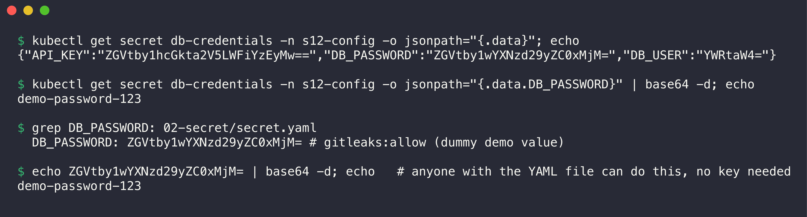

```console
$ kubectl get secret db-credentials -n s12-config -o jsonpath="{.data}"; echo
{"API_KEY":"ZGVtby1hcGkta2V5LWFiYzEyMw==","DB_PASSWORD":"ZGVtby1wYXNzd29yZC0xMjM=","DB_USER":"YWRtaW4="}

$ kubectl get secret db-credentials -n s12-config -o jsonpath="{.data.DB_PASSWORD}" | base64 -d; echo
demo-password-123

$ grep DB_PASSWORD: 02-secret/secret.yaml
  DB_PASSWORD: ZGVtby1wYXNzd29yZC0xMjM= # gitleaks:allow (dummy demo value)

$ echo ZGVtby1wYXNzd29yZC0xMjM= | base64 -d; echo   # anyone with the YAML file can do this, no key needed
demo-password-123
```

Base64 only changes binary data into text. It has no key. Anybody with `get secret` permission or with the YAML file can read the value in one command.

By default, the API server also stores Secrets in etcd without encryption. I read the raw etcd record (read-only) with `etcdctl`:



```console
$ kubectl exec -n kube-system etcd-minikube -- etcdctl --endpoints=https://127.0.0.1:2379 --cacert=/var/lib/minikube/certs/etcd/ca.crt --cert=/var/lib/minikube/certs/etcd/server.crt --key=/var/lib/minikube/certs/etcd/server.key get /registry/secrets/s12-config/db-credentials --print-value-only | strings | grep -E "demo-|admin|k8s"
demo-api-key-abc123
demo-password-123
admin
```

The values are in etcd as plain text. Production clusters enable encryption at rest (`EncryptionConfiguration` with a KMS provider) and limit access to Secrets with RBAC.

### Step 5: Why Secrets must not go to Git

**WARNING:** Do not commit real Secret YAML files to Git. Base64 does not protect the value, and Git keeps every old version of every file.

- **Git history is permanent.** If you delete the file in a new commit, the old commit still has the value. Every clone and fork has a copy.
- **Many people and systems can read a repository:** all developers, CI runners, forks, backups, and the public if the repository is public.
- **Bots scan public repositories** for keys within minutes of a push.
- **Rotation is the only fix.** After a leak, you must change the password or key everywhere. Removing the commit is not enough.

Secret scanners find this type of file. I ran `gitleaks` on the folder before I added the `gitleaks:allow` comments:

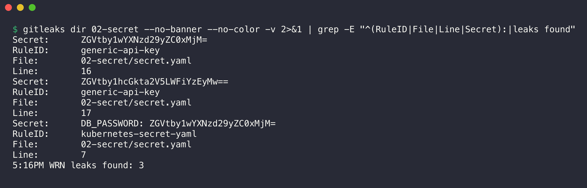

```console
$ gitleaks dir 02-secret --no-banner --no-color -v 2>&1 | grep -E "^(RuleID|File|Line|Secret):|leaks found"
Secret:      ZGVtby1wYXNzd29yZC0xMjM=
RuleID:      generic-api-key
File:        02-secret/secret.yaml
Line:        16
Secret:      ZGVtby1hcGkta2V5LWFiYzEyMw==
RuleID:      generic-api-key
File:        02-secret/secret.yaml
Line:        17
Secret:      DB_PASSWORD: ZGVtby1wYXNzd29yZC0xMjM=
RuleID:      kubernetes-secret-yaml
File:        02-secret/secret.yaml
Line:        7
5:16PM WRN leaks found: 3
```

gitleaks found the Secret manifest and the two values. This assignment must include a Secret YAML file as a deliverable, and the values are dummy values. Thus I marked these lines with `# gitleaks:allow`. Do not use this marker for real credentials.

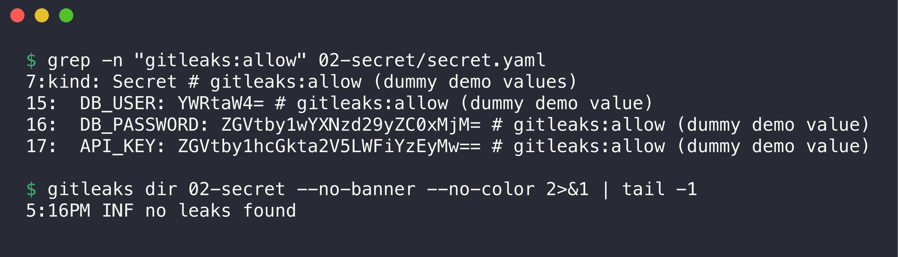

```console
$ grep -n "gitleaks:allow" 02-secret/secret.yaml
7:kind: Secret # gitleaks:allow (dummy demo values)
15:  DB_USER: YWRtaW4= # gitleaks:allow (dummy demo value)
16:  DB_PASSWORD: ZGVtby1wYXNzd29yZC0xMjM= # gitleaks:allow (dummy demo value)
17:  API_KEY: ZGVtby1hcGkta2V5LWFiYzEyMw== # gitleaks:allow (dummy demo value)

$ gitleaks dir 02-secret --no-banner --no-color 2>&1 | tail -1
5:16PM INF no leaks found
```

**Safe alternatives to plain Secrets in Git:**

| Tool | How it works | What goes into Git |
|------|--------------|--------------------|
| Sealed Secrets (Bitnami) | A controller in the cluster has a private key. `kubeseal` encrypts a Secret with the public key. Only the controller can decrypt it. | A `SealedSecret` with encrypted data |
| External Secrets Operator | A controller reads values from AWS Secrets Manager, HashiCorp Vault, GCP or Azure Key Vault, and creates normal Secrets in the cluster. | An `ExternalSecret` with only the name of the remote value |
| SOPS (+ age, PGP or KMS) | Encrypts only the values in a YAML file. Flux, Argo CD plugins or helm-secrets decrypt at deploy time. | The YAML file with encrypted values |
| HashiCorp Vault (Agent Injector or CSI driver) | Vault keeps the secret. A sidecar or the CSI driver writes it into the Pod at run time. | Only annotations or a `SecretProviderClass` |
| CI/CD secret store | GitHub Actions secrets or a similar store. The pipeline runs `kubectl create secret` at deploy time. | Nothing |

Also add patterns like `*secret*.yaml` to `.gitignore` for local files, and run a secret scanner (gitleaks, trufflehog) in a pre-commit hook and in CI.

---

## Task 3: Ingress

An Ingress is a set of HTTP routing rules: "requests for this host and this path go to this Service". An Ingress controller (here ingress-nginx) reads the rules and does the routing. With one entry point, many Services can share one IP and one port.

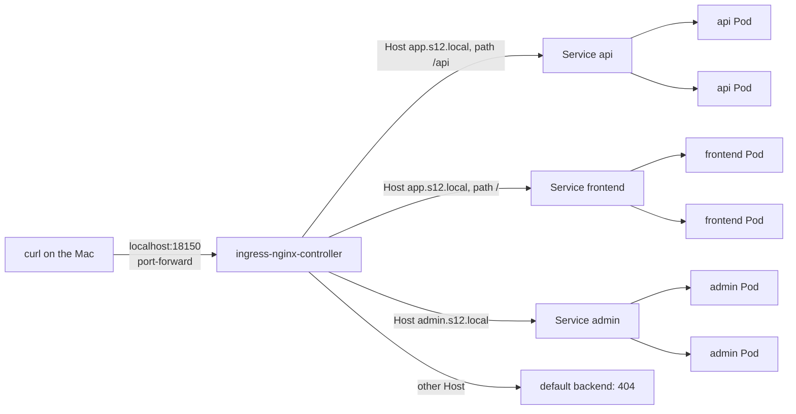

### Step 1: Deploy the applications and create the Services

Files: [03-ingress/echo-config.yaml](03-ingress/echo-config.yaml), [03-ingress/apps.yaml](03-ingress/apps.yaml)

There are three backends: `frontend`, `api` and `admin`. Each has a Deployment with 2 nginx Pods and a ClusterIP Service. A ConfigMap holds one nginx config for each backend. Each backend answers every request with its own name, the Pod name, the `Host` header and the path. For example:

```nginx
return 200 "backend=api pod=$hostname host=$host path=$request_uri\n";
```

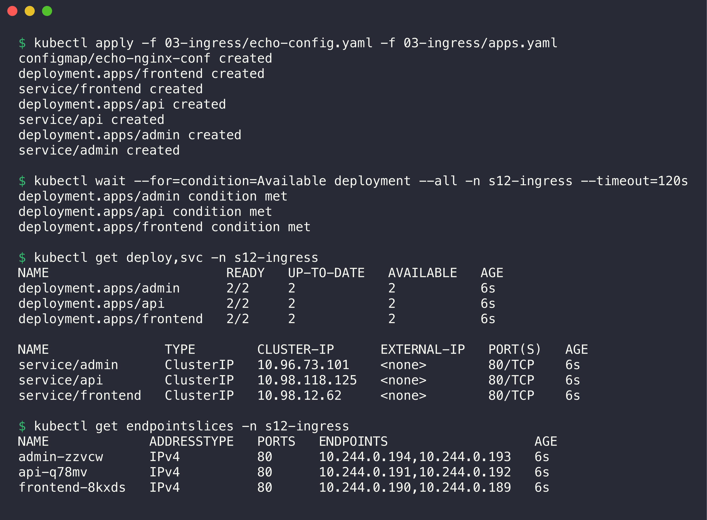

```console
$ kubectl apply -f 03-ingress/echo-config.yaml -f 03-ingress/apps.yaml
configmap/echo-nginx-conf created
deployment.apps/frontend created
service/frontend created
deployment.apps/api created
service/api created
deployment.apps/admin created
service/admin created

$ kubectl wait --for=condition=Available deployment --all -n s12-ingress --timeout=120s
deployment.apps/admin condition met
deployment.apps/api condition met
deployment.apps/frontend condition met

$ kubectl get deploy,svc -n s12-ingress
NAME                       READY   UP-TO-DATE   AVAILABLE   AGE
deployment.apps/admin      2/2     2            2           6s
deployment.apps/api        2/2     2            2           6s
deployment.apps/frontend   2/2     2            2           6s

NAME               TYPE        CLUSTER-IP      EXTERNAL-IP   PORT(S)   AGE
service/admin      ClusterIP   10.96.73.101    <none>        80/TCP    6s
service/api        ClusterIP   10.98.118.125   <none>        80/TCP    6s
service/frontend   ClusterIP   10.98.12.62     <none>        80/TCP    6s

$ kubectl get endpointslices -n s12-ingress
NAME             ADDRESSTYPE   PORTS   ENDPOINTS                   AGE
admin-zzvcw      IPv4          80      10.244.0.194,10.244.0.193   6s
api-q78mv        IPv4          80      10.244.0.191,10.244.0.192   6s
frontend-8kxds   IPv4          80      10.244.0.190,10.244.0.189   6s
```

### Step 2: Configure the Ingress

File: [03-ingress/ingress.yaml](03-ingress/ingress.yaml)

```yaml
spec:
  ingressClassName: nginx
  rules:
    - host: app.s12.local          # host-based routing
      http:
        paths:
          - path: /api             # path-based routing
            pathType: Prefix
            backend:
              service: { name: api, port: { number: 80 } }
          - path: /
            pathType: Prefix
            backend:
              service: { name: frontend, port: { number: 80 } }
    - host: admin.s12.local
      http:
        paths:
          - path: /
            pathType: Prefix
            backend:
              service: { name: admin, port: { number: 80 } }
```

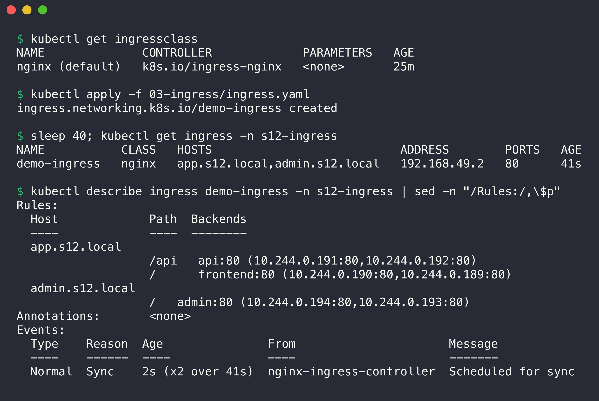

```console
$ kubectl get ingressclass
NAME              CONTROLLER             PARAMETERS   AGE
nginx (default)   k8s.io/ingress-nginx   <none>       25m

$ kubectl apply -f 03-ingress/ingress.yaml
ingress.networking.k8s.io/demo-ingress created

$ sleep 40; kubectl get ingress -n s12-ingress
NAME           CLASS   HOSTS                           ADDRESS        PORTS   AGE
demo-ingress   nginx   app.s12.local,admin.s12.local   192.168.49.2   80      41s

$ kubectl describe ingress demo-ingress -n s12-ingress | sed -n "/Rules:/,\$p"
Rules:
  Host             Path  Backends
  ----             ----  --------
  app.s12.local    
                   /api   api:80 (10.244.0.191:80,10.244.0.192:80)
                   /      frontend:80 (10.244.0.190:80,10.244.0.189:80)
  admin.s12.local  
                   /   admin:80 (10.244.0.194:80,10.244.0.193:80)
Annotations:       <none>
Events:
  Type    Reason  Age               From                      Message
  ----    ------  ----              ----                      -------
  Normal  Sync    2s (x2 over 41s)  nginx-ingress-controller  Scheduled for sync
```

The controller accepted the Ingress: it wrote the node IP into `ADDRESS` and made a `Sync` event. `describe` shows each rule with the Pod IPs behind the Service.

### Step 3: Access the application through the Ingress

The node IP is not reachable from the Mac (docker driver). Thus I forwarded local port 18150 to the controller Service and set the `Host` header with curl. This does not change ingress-nginx.

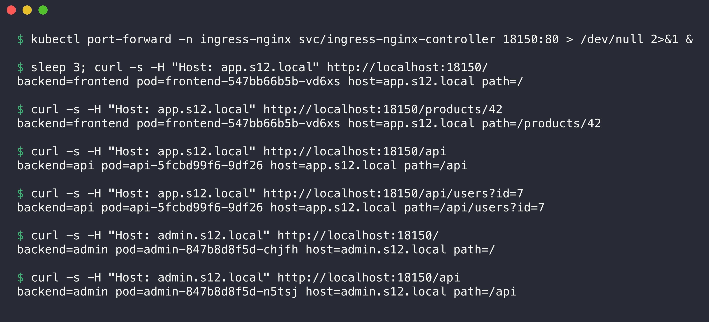

```console
$ kubectl port-forward -n ingress-nginx svc/ingress-nginx-controller 18150:80 > /dev/null 2>&1 &

$ sleep 3; curl -s -H "Host: app.s12.local" http://localhost:18150/
backend=frontend pod=frontend-547bb66b5b-vd6xs host=app.s12.local path=/

$ curl -s -H "Host: app.s12.local" http://localhost:18150/products/42
backend=frontend pod=frontend-547bb66b5b-vd6xs host=app.s12.local path=/products/42

$ curl -s -H "Host: app.s12.local" http://localhost:18150/api
backend=api pod=api-5fcbd99f6-9df26 host=app.s12.local path=/api

$ curl -s -H "Host: app.s12.local" http://localhost:18150/api/users?id=7
backend=api pod=api-5fcbd99f6-9df26 host=app.s12.local path=/api/users?id=7

$ curl -s -H "Host: admin.s12.local" http://localhost:18150/
backend=admin pod=admin-847b8d8f5d-chjfh host=admin.s12.local path=/

$ curl -s -H "Host: admin.s12.local" http://localhost:18150/api
backend=admin pod=admin-847b8d8f5d-n5tsj host=admin.s12.local path=/api
```

`curl --resolve` gives the same result with a real host name in the URL, as a browser would send it:

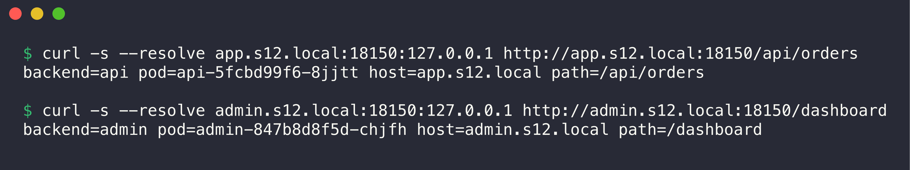

```console
$ curl -s --resolve app.s12.local:18150:127.0.0.1 http://app.s12.local:18150/api/orders
backend=api pod=api-5fcbd99f6-8jjtt host=app.s12.local path=/api/orders

$ curl -s --resolve admin.s12.local:18150:127.0.0.1 http://admin.s12.local:18150/dashboard
backend=admin pod=admin-847b8d8f5d-chjfh host=admin.s12.local path=/dashboard
```

### Step 4: Verify the routing

| Request | Expected backend | Result |
|---------|------------------|--------|
| `app.s12.local/` | frontend | frontend |
| `app.s12.local/products/42` | frontend (prefix `/`) | frontend |
| `app.s12.local/api`, `/api/users?id=7` | api (prefix `/api`) | api |
| `admin.s12.local/` | admin | admin |
| `admin.s12.local/api` | admin (the `/api` rule is only for `app.s12.local`) | admin |

More checks: load balancing, unknown hosts, and how `Prefix` matches:

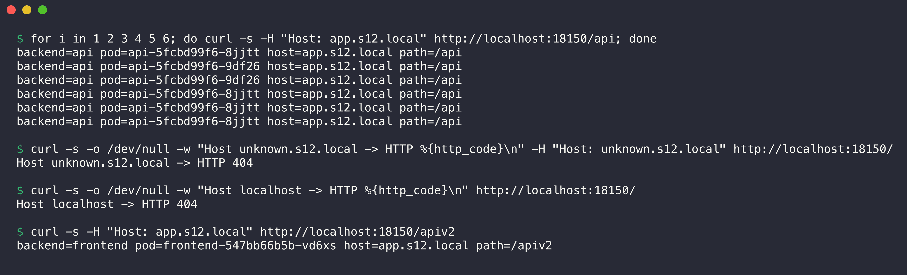

```console
$ for i in 1 2 3 4 5 6; do curl -s -H "Host: app.s12.local" http://localhost:18150/api; done
backend=api pod=api-5fcbd99f6-8jjtt host=app.s12.local path=/api
backend=api pod=api-5fcbd99f6-9df26 host=app.s12.local path=/api
backend=api pod=api-5fcbd99f6-9df26 host=app.s12.local path=/api
backend=api pod=api-5fcbd99f6-8jjtt host=app.s12.local path=/api
backend=api pod=api-5fcbd99f6-8jjtt host=app.s12.local path=/api
backend=api pod=api-5fcbd99f6-8jjtt host=app.s12.local path=/api

$ curl -s -o /dev/null -w "Host unknown.s12.local -> HTTP %{http_code}\n" -H "Host: unknown.s12.local" http://localhost:18150/
Host unknown.s12.local -> HTTP 404

$ curl -s -o /dev/null -w "Host localhost -> HTTP %{http_code}\n" http://localhost:18150/
Host localhost -> HTTP 404

$ curl -s -H "Host: app.s12.local" http://localhost:18150/apiv2
backend=frontend pod=frontend-547bb66b5b-vd6xs host=app.s12.local path=/apiv2
```

- The controller spreads requests over both `api` Pods. It sends traffic to the Pod IPs directly, not through the ClusterIP.
- A host without a rule gets HTTP 404 from the default backend of the controller.
- `/apiv2` goes to `frontend`, not to `api`. `pathType: Prefix` matches whole path elements: `/api` matches `/api` and `/api/...`, but not `/apiv2`.

The controller log and the `nginx.conf` that the controller wrote show how it used the Ingress (read-only):

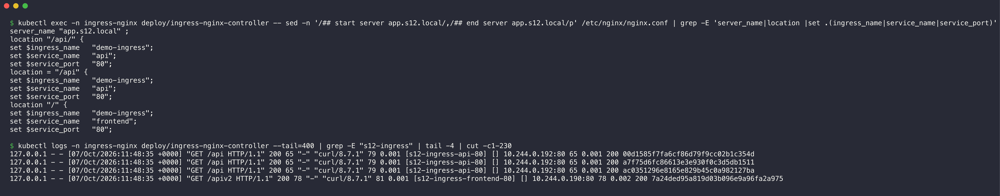

```console
$ kubectl exec -n ingress-nginx deploy/ingress-nginx-controller -- sed -n '/## start server app.s12.local/,/## end server app.s12.local/p' /etc/nginx/nginx.conf | grep -E 'server_name|location |set .(ingress_name|service_name|service_port)'
		server_name "app.s12.local" ;
		location "/api/" {
			set $ingress_name   "demo-ingress";
			set $service_name   "api";
			set $service_port   "80";
		location = "/api" {
			set $ingress_name   "demo-ingress";
			set $service_name   "api";
			set $service_port   "80";
		location "/" {
			set $ingress_name   "demo-ingress";
			set $service_name   "frontend";
			set $service_port   "80";

$ kubectl logs -n ingress-nginx deploy/ingress-nginx-controller --tail=400 | grep -E "s12-ingress" | tail -4 | cut -c1-230
127.0.0.1 - - [07/Oct/2026:11:48:35 +0000] "GET /api HTTP/1.1" 200 65 "-" "curl/8.7.1" 79 0.001 [s12-ingress-api-80] [] 10.244.0.192:80 65 0.001 200 00d1585f7fa6cf86d79f9cc02b1c354d
127.0.0.1 - - [07/Oct/2026:11:48:35 +0000] "GET /api HTTP/1.1" 200 65 "-" "curl/8.7.1" 79 0.001 [s12-ingress-api-80] [] 10.244.0.192:80 65 0.001 200 a7f75d6fc86613e3e930f0c3d5db1511
127.0.0.1 - - [07/Oct/2026:11:48:35 +0000] "GET /api HTTP/1.1" 200 65 "-" "curl/8.7.1" 79 0.001 [s12-ingress-api-80] [] 10.244.0.192:80 65 0.001 200 ac0351296e8165e829b45c0a982127ba
127.0.0.1 - - [07/Oct/2026:11:48:35 +0000] "GET /apiv2 HTTP/1.1" 200 78 "-" "curl/8.7.1" 81 0.001 [s12-ingress-frontend-80] [] 10.244.0.190:80 78 0.002 200 7a24ded95a819d03b096e9a96fa2a975
```

- The rule `/api` with `Prefix` became two nginx `location` blocks: `= "/api"` (exact) and `"/api/"` (prefix).
- Each log line names the upstream `[namespace-service-port]` and the Pod IP that answered. `/apiv2` went to `s12-ingress-frontend-80`.

The difference between the Ingress object and the controller is in [Task 4](ingress-vs-ingress-controller/README.md).

---

## Task 4: Ingress vs Ingress Controller

See [ingress-vs-ingress-controller/README.md](ingress-vs-ingress-controller/README.md).

## Task 5: Troubleshooting

See [troubleshooting/README.md](troubleshooting/README.md). It has four scenarios, each with the problem, the commands, the root cause, the fix, and before/after output with screenshots:

1. Secret with a hidden newline (base64 of `echo` without `-n`).
2. ConfigMap key that does not exist → `CreateContainerConfigError`.
3. Ingress with a wrong Service name → HTTP 503.
4. Ingress with a wrong `ingressClassName` → no controller, HTTP 404.

## Cleanup

```bash
kubectl delete namespace s12-config s12-ingress s12-trouble
pkill -f "port-forward -n ingress-nginx svc/ingress-nginx-controller 18150"
```
