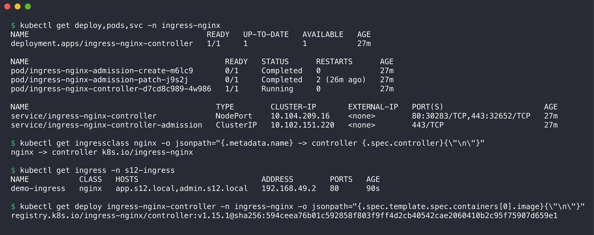
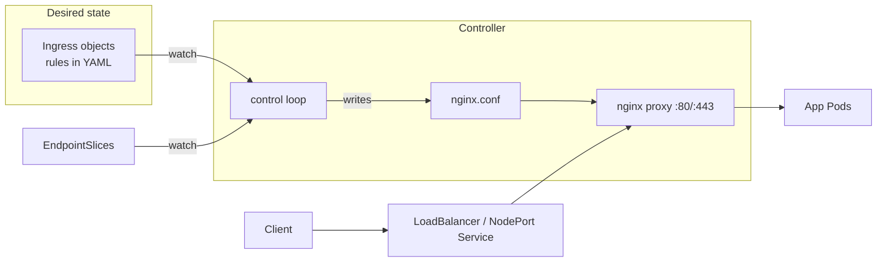

# Task 4: Ingress vs Ingress Controller

## 1. What is Ingress?

An Ingress is a Kubernetes API object (`networking.k8s.io/v1`, kind `Ingress`). It describes how HTTP and HTTPS traffic from outside the cluster reaches Services inside the cluster. It contains only rules:

- **Host rules:** `app.s12.local` goes to one set of Services, `admin.s12.local` to another.
- **Path rules:** `/api` goes to the Service `api`, `/` goes to `frontend`.
- **TLS:** which Secret has the certificate for which host.
- **ingressClassName:** which controller must apply the rules.

An Ingress is like a configuration file. Alone, it does not open a port or move a packet. Example from [Task 3](../03-ingress/ingress.yaml):

```yaml
apiVersion: networking.k8s.io/v1
kind: Ingress
metadata:
  name: demo-ingress
  namespace: s12-ingress
spec:
  ingressClassName: nginx
  rules:
    - host: app.s12.local
      http:
        paths:
          - path: /api
            pathType: Prefix
            backend:
              service:
                name: api
                port:
                  number: 80
```

## 2. What is an Ingress Controller?

An Ingress controller is a program that runs in the cluster, usually as a Deployment with a Service in front of it. It does two jobs:

1. **Control loop:** it watches Ingress, Service, EndpointSlice and Secret objects through the Kubernetes API. When they change, it builds a new proxy configuration.
2. **Data plane:** it is a reverse proxy (nginx, Envoy, HAProxy, Traefik). It receives the real HTTP requests and forwards them to the Pods.

Kubernetes does not include an Ingress controller. You must install one. This cluster uses ingress-nginx from the minikube `ingress` addon:



```console
$ kubectl get deploy,pods,svc -n ingress-nginx
NAME                                       READY   UP-TO-DATE   AVAILABLE   AGE
deployment.apps/ingress-nginx-controller   1/1     1            1           27m

NAME                                           READY   STATUS      RESTARTS      AGE
pod/ingress-nginx-admission-create-m6lc9       0/1     Completed   0             27m
pod/ingress-nginx-admission-patch-j9s2j        0/1     Completed   2 (26m ago)   27m
pod/ingress-nginx-controller-d7cd8c989-4w986   1/1     Running     0             27m

NAME                                         TYPE        CLUSTER-IP       EXTERNAL-IP   PORT(S)                      AGE
service/ingress-nginx-controller             NodePort    10.104.209.16    <none>        80:30283/TCP,443:32652/TCP   27m
service/ingress-nginx-controller-admission   ClusterIP   10.102.151.220   <none>        443/TCP                      27m

$ kubectl get ingressclass nginx -o jsonpath="{.metadata.name} -> controller {.spec.controller}{\"\n\"}"
nginx -> controller k8s.io/ingress-nginx

$ kubectl get ingress -n s12-ingress
NAME           CLASS   HOSTS                           ADDRESS        PORTS   AGE
demo-ingress   nginx   app.s12.local,admin.s12.local   192.168.49.2   80      90s

$ kubectl get deploy ingress-nginx-controller -n ingress-nginx -o jsonpath="{.spec.template.spec.containers[0].image}{\"\n\"}"
registry.k8s.io/ingress-nginx/controller:v1.15.1@sha256:594ceea76b01c592858f803f9ff4d2cb40542cae2060410b2c95f75907d659e1
```

- The controller Pod runs nginx plus the controller program.
- The Service `ingress-nginx-controller` is the entry point for traffic. On minikube it is a NodePort. On a cloud provider it is usually a LoadBalancer.
- The admission Service runs a webhook that checks every new Ingress before the API server accepts it.
- The IngressClass `nginx` connects the name in `ingressClassName` to the controller `k8s.io/ingress-nginx`. It is the default class in this cluster.

## 3. Difference between them

| Topic | Ingress | Ingress Controller |
|-------|---------|--------------------|
| What it is | An API object (YAML). Data. | A running program (Pods). Software. |
| Where it lives | In etcd, in the namespace of the app | Usually in its own namespace (`ingress-nginx`) |
| Who makes it | The app team, for each app | The platform team, once for each cluster |
| Job | Says *what* must happen: host X, path Y → Service Z | Does it: listens on ports 80 and 443, terminates TLS, proxies to Pods |
| Included in Kubernetes | Yes, the API type is built in | No, you install one (ingress-nginx, Traefik, HAProxy, Contour, AWS Load Balancer Controller, GKE Ingress) |
| Without the other | Nothing happens. No `ADDRESS`, no traffic. | The controller runs, but it has no rules. It answers 404 to every request. |
| Number in a cluster | Many | One or more (each with its own IngressClass) |

The controller turns the Ingress rules into proxy configuration. This is the `nginx.conf` that ingress-nginx made from `demo-ingress`:

```console
$ kubectl exec -n ingress-nginx deploy/ingress-nginx-controller -- sed -n '/## start server app.s12.local/,/## end server app.s12.local/p' /etc/nginx/nginx.conf | grep -E 'server_name|location |set .(ingress_name|service_name|service_port)'
		server_name "app.s12.local" ;
		location "/api/" {
			set $ingress_name   "demo-ingress";
			set $service_name   "api";
			set $service_port   "80";
		location = "/api" {
			set $ingress_name   "demo-ingress";
			set $service_name   "api";
			set $service_port   "80";
		location "/" {
			set $ingress_name   "demo-ingress";
			set $service_name   "frontend";
			set $service_port   "80";
```

(Screenshot: [ingress-06-controller-nginx-conf.png](../screenshots/ingress-06-controller-nginx-conf.png).)

## 4. Why both are required



- The Ingress is the desired state. The controller makes the real state match it. This is the normal Kubernetes pattern (object + controller), like Deployment + Deployment controller.
- Without a controller, an Ingress is only stored data. Troubleshooting [scenario 4](../troubleshooting/README.md#scenario-4-ingress-with-a-wrong-ingressclassname) shows this: an Ingress with a class that has no controller got no `ADDRESS` and served no traffic.
- Without Ingress objects, the controller does not know any route. Every request gets a 404 from the default backend.
- The split lets app teams write simple rules in their own namespace. They do not need to know nginx. The platform team can change the controller (for example from ingress-nginx to Envoy Gateway) without new app YAML, if both support the same Ingress API.
- One controller with one LoadBalancer serves many apps. This is cheaper than one cloud load balancer for each Service.

## 5. Examples

**Ingress controllers:**

| Controller | Proxy | Typical use |
|------------|-------|-------------|
| ingress-nginx | nginx | The most common general choice. Used in this assignment. |
| Traefik | Traefik | Default in k3s. Automatic Let's Encrypt. |
| HAProxy Ingress | HAProxy | High performance TCP and HTTP |
| Contour, Emissary | Envoy | Envoy-based routing |
| AWS Load Balancer Controller | AWS ALB | EKS: each Ingress becomes an AWS Application Load Balancer |
| GKE Ingress | Google Cloud Load Balancer | GKE |
| Azure Application Gateway Ingress Controller | Azure Application Gateway | AKS |

**Ingress examples from this assignment:**

| Ingress | Rule | Result |
|---------|------|--------|
| `demo-ingress` | `app.s12.local /api` → `api` | Path-based routing, see [Task 3](../README.md#task-3-ingress) |
| `demo-ingress` | `admin.s12.local /` → `admin` | Host-based routing |
| `shop-ingress` | `shop.s12.local /` → `shop-service` (wrong) | HTTP 503, see [scenario 3](../troubleshooting/README.md#scenario-3-ingress-points-to-a-wrong-service-name) |
| `catalog-ingress` | class `nginx-public` (no controller) | Ignored, see [scenario 4](../troubleshooting/README.md#scenario-4-ingress-with-a-wrong-ingressclassname) |

**A TLS example** (not deployed here). The controller reads the certificate from the Secret and terminates HTTPS:

```yaml
spec:
  ingressClassName: nginx
  tls:
    - hosts: [app.example.com]
      secretName: app-example-tls   # Secret of type kubernetes.io/tls
  rules:
    - host: app.example.com
      http:
        paths:
          - path: /
            pathType: Prefix
            backend:
              service: { name: frontend, port: { number: 80 } }
```

**Note about the future:** the Gateway API (`Gateway`, `HTTPRoute`) is the newer Kubernetes API for this job. It uses the same split: a `GatewayClass` and its controller do the work, and route objects hold the rules.
