# Task 5: Troubleshooting

The troubleshooting folder of the class material has one scenario: the Secret with a trailing newline (`secret-base64-gotcha.md`). I reproduced it and added three more realistic problems in the same area (ConfigMaps, Secrets, Ingress). All scenarios run in the namespace `s12-trouble`. Each scenario folder has the broken YAML and the fixed YAML.

| # | Scenario | Symptom | Root cause |
|---|----------|---------|------------|
| 1 | [Secret with a hidden newline](#scenario-1-secret-with-a-hidden-newline) | `password authentication failed` | `echo` without `-n` added `\n` to the base64 value |
| 2 | [ConfigMap key that does not exist](#scenario-2-configmap-key-that-does-not-exist) | `CreateContainerConfigError` | `configMapKeyRef` asks for `LOG_LEVEL`, the ConfigMap has `LOGLEVEL` |
| 3 | [Ingress points to a wrong Service name](#scenario-3-ingress-points-to-a-wrong-service-name) | HTTP 503 | Ingress backend `shop-service`, real Service `shop` |
| 4 | [Ingress with a wrong ingressClassName](#scenario-4-ingress-with-a-wrong-ingressclassname) | No `ADDRESS`, HTTP 404 | Class `nginx-public` does not exist, no controller uses the Ingress |

For the Ingress scenarios, port 18150 on the Mac forwards to the ingress-nginx controller:

```bash
kubectl port-forward -n ingress-nginx svc/ingress-nginx-controller 18150:80 > /dev/null 2>&1 &
```

---

## Scenario 1: Secret with a hidden newline

Folder: [01-secret-base64-newline/](01-secret-base64-newline/) (`broken-secret.yaml`, `fixed-secret.yaml`, `app-pod.yaml`)

The Pod `login-client` acts like a database login. It reads `DB_PASSWORD` from the Secret `db-login` and compares it with the password that the "database" expects (`demo-password-123`, a dummy value).

### 1. Identify the problem

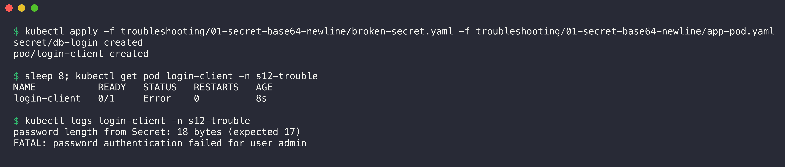

```console
$ kubectl apply -f troubleshooting/01-secret-base64-newline/broken-secret.yaml -f troubleshooting/01-secret-base64-newline/app-pod.yaml
secret/db-login created
pod/login-client created

$ sleep 8; kubectl get pod login-client -n s12-trouble
NAME           READY   STATUS   RESTARTS   AGE
login-client   0/1     Error    0          8s

$ kubectl logs login-client -n s12-trouble
password length from Secret: 18 bytes (expected 17)
FATAL: password authentication failed for user admin
```

The application rejects the password. The developer says: "The password in the Secret is correct."

### 2. Run troubleshooting commands

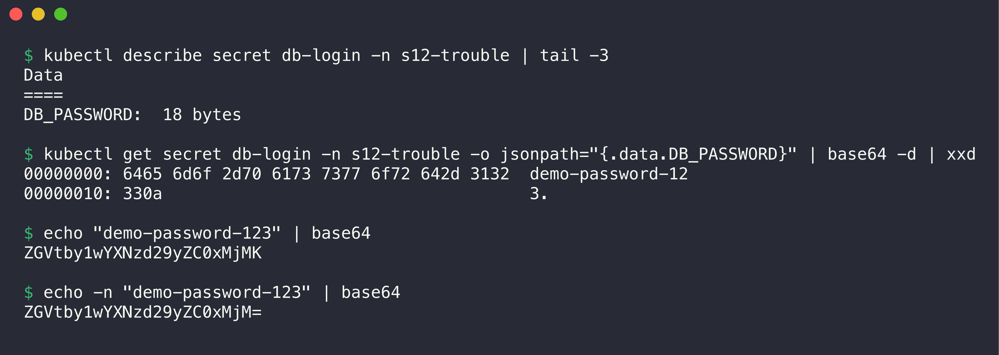

```console
$ kubectl describe secret db-login -n s12-trouble | tail -3
Data
====
DB_PASSWORD:  18 bytes

$ kubectl get secret db-login -n s12-trouble -o jsonpath="{.data.DB_PASSWORD}" | base64 -d | xxd
00000000: 6465 6d6f 2d70 6173 7377 6f72 642d 3132  demo-password-12
00000010: 330a                                     3.

$ echo "demo-password-123" | base64
ZGVtby1wYXNzd29yZC0xMjMK

$ echo -n "demo-password-123" | base64
ZGVtby1wYXNzd29yZC0xMjM=
```

### 3. Find the root cause

- `demo-password-123` has 17 characters, but the Secret value has 18 bytes.
- `xxd` shows the last byte `0a`. This is the newline character `\n`.
- The YAML author encoded the value with `echo "..." | base64`. `echo` adds a newline at the end, and base64 encodes it too. A base64 value that ends in `K` or `o=` often hides a newline.

### 4. Fix the issue

1. Encode the value again with `echo -n` (or `printf '%s'`).
2. Put the new value into [fixed-secret.yaml](01-secret-base64-newline/fixed-secret.yaml) and apply it.
3. Recreate the Pod. Environment variables from a Secret are read only at container start.

### 5. Before/after output

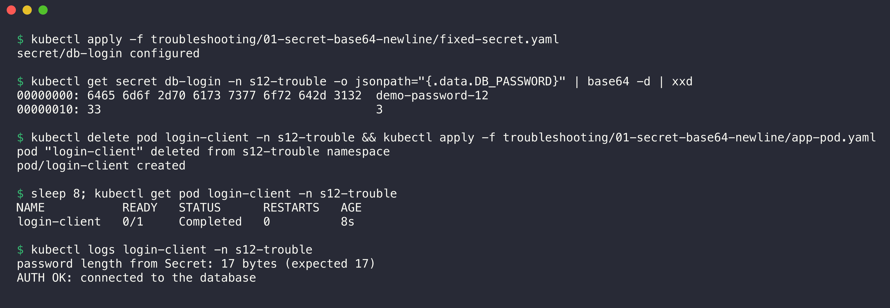

```console
$ kubectl apply -f troubleshooting/01-secret-base64-newline/fixed-secret.yaml
secret/db-login configured

$ kubectl get secret db-login -n s12-trouble -o jsonpath="{.data.DB_PASSWORD}" | base64 -d | xxd
00000000: 6465 6d6f 2d70 6173 7377 6f72 642d 3132  demo-password-12
00000010: 33                                       3

$ kubectl delete pod login-client -n s12-trouble && kubectl apply -f troubleshooting/01-secret-base64-newline/app-pod.yaml
pod "login-client" deleted from s12-trouble namespace
pod/login-client created

$ sleep 8; kubectl get pod login-client -n s12-trouble
NAME           READY   STATUS      RESTARTS   AGE
login-client   0/1     Completed   0          8s

$ kubectl logs login-client -n s12-trouble
password length from Secret: 17 bytes (expected 17)
AUTH OK: connected to the database
```

| | Before | After |
|-|--------|-------|
| base64 in YAML | `ZGVtby1wYXNzd29yZC0xMjMK` | `ZGVtby1wYXNzd29yZC0xMjM=` |
| Last byte | `0a` (newline) | `33` (`3`) |
| Size | 18 bytes | 17 bytes |
| Pod | `Error`, authentication failed | `Completed`, `AUTH OK` |

**Prevention:** use `kubectl create secret generic --from-literal=...` or `stringData:` in the YAML. Then Kubernetes does the encoding, and no `echo` is involved.

---

## Scenario 2: ConfigMap key that does not exist

Folder: [02-configmap-missing-key/](02-configmap-missing-key/) (`configmap.yaml`, `broken-deployment.yaml`, `fixed-deployment.yaml`)

### 1. Identify the problem

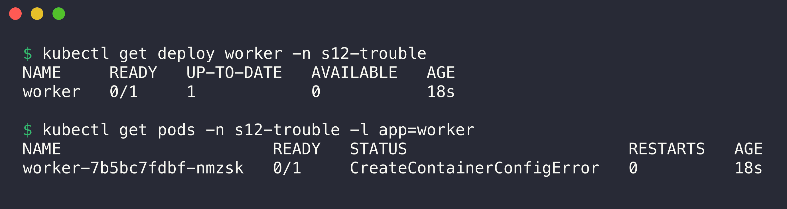

```console
$ kubectl get deploy worker -n s12-trouble
NAME     READY   UP-TO-DATE   AVAILABLE   AGE
worker   0/1     1            0           18s

$ kubectl get pods -n s12-trouble -l app=worker
NAME                      READY   STATUS                       RESTARTS   AGE
worker-7b5bc7fdbf-nmzsk   0/1     CreateContainerConfigError   0          18s
```

I applied `configmap.yaml` and `broken-deployment.yaml` before this step. The Pod never starts. `CreateContainerConfigError` means that the kubelet cannot build the container configuration. The image is not the problem.

### 2. Run troubleshooting commands

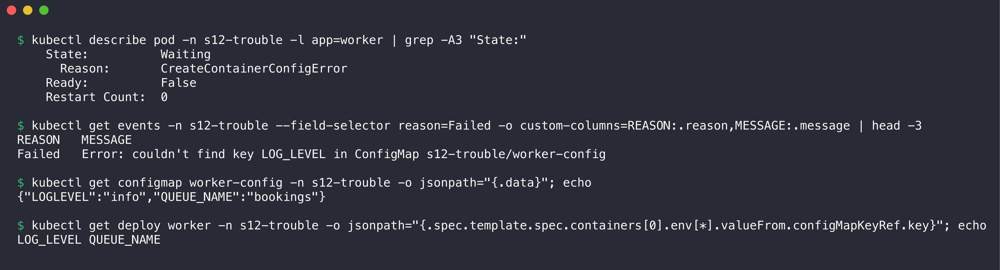

```console
$ kubectl describe pod -n s12-trouble -l app=worker | grep -A3 "State:"
    State:          Waiting
      Reason:       CreateContainerConfigError
    Ready:          False
    Restart Count:  0

$ kubectl get events -n s12-trouble --field-selector reason=Failed -o custom-columns=REASON:.reason,MESSAGE:.message | head -3
REASON   MESSAGE
Failed   Error: couldn't find key LOG_LEVEL in ConfigMap s12-trouble/worker-config

$ kubectl get configmap worker-config -n s12-trouble -o jsonpath="{.data}"; echo
{"LOGLEVEL":"info","QUEUE_NAME":"bookings"}

$ kubectl get deploy worker -n s12-trouble -o jsonpath="{.spec.template.spec.containers[0].env[*].valueFrom.configMapKeyRef.key}"; echo
LOG_LEVEL QUEUE_NAME
```

### 3. Find the root cause

- The event says: `couldn't find key LOG_LEVEL in ConfigMap s12-trouble/worker-config`.
- The ConfigMap has the key `LOGLEVEL` (no underscore). The Deployment asks for `LOG_LEVEL`.
- A `configMapKeyRef` is required by default. If the key does not exist, the kubelet does not start the container.

### 4. Fix the issue

1. Change the key in the Deployment to the real key `LOGLEVEL`. The variable name in the container stays `LOG_LEVEL`.
2. Apply [fixed-deployment.yaml](02-configmap-missing-key/fixed-deployment.yaml). The Deployment makes a new ReplicaSet and replaces the Pod.

Another fix is to add the key `LOG_LEVEL` to the ConfigMap. For a value that is not required, set `optional: true` in the `configMapKeyRef`.

### 5. Before/after output

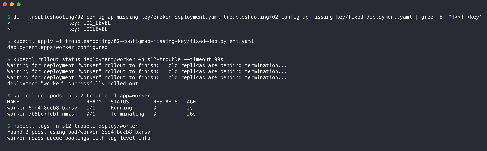

```console
$ diff troubleshooting/02-configmap-missing-key/broken-deployment.yaml troubleshooting/02-configmap-missing-key/fixed-deployment.yaml | grep -E '^[<>] +key'
<                   key: LOG_LEVEL
>                   key: LOGLEVEL

$ kubectl apply -f troubleshooting/02-configmap-missing-key/fixed-deployment.yaml
deployment.apps/worker configured

$ kubectl rollout status deployment/worker -n s12-trouble --timeout=90s
Waiting for deployment "worker" rollout to finish: 1 old replicas are pending termination...
Waiting for deployment "worker" rollout to finish: 1 old replicas are pending termination...
Waiting for deployment "worker" rollout to finish: 1 old replicas are pending termination...
deployment "worker" successfully rolled out

$ kubectl get pods -n s12-trouble -l app=worker
NAME                      READY   STATUS        RESTARTS   AGE
worker-6dd4f8dcb8-bxrsv   1/1     Running       0          2s
worker-7b5bc7fdbf-nmzsk   0/1     Terminating   0          26s

$ kubectl logs -n s12-trouble deploy/worker
Found 2 pods, using pod/worker-6dd4f8dcb8-bxrsv
worker reads queue bookings with log level info
```

| | Before | After |
|-|--------|-------|
| Pod status | `CreateContainerConfigError` | `Running` |
| Deployment | `0/1` | rolled out |
| Log | none (container did not start) | `worker reads queue bookings with log level info` |

The same error appears for a missing Secret key (`secretKeyRef`) or a missing ConfigMap or Secret.

---

## Scenario 3: Ingress points to a wrong Service name

Folder: [03-ingress-wrong-service/](03-ingress-wrong-service/) (`app.yaml`, `broken-ingress.yaml`, `fixed-ingress.yaml`)

### 1. Identify the problem

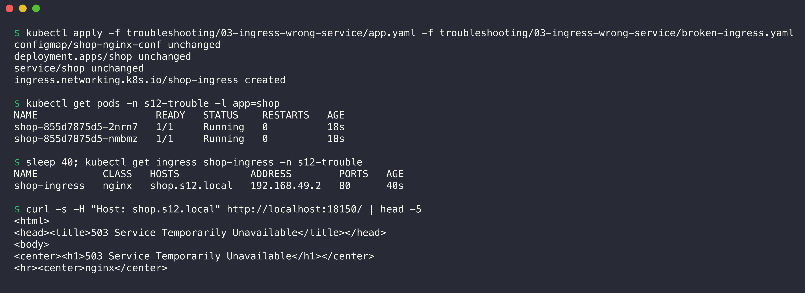

```console
$ kubectl apply -f troubleshooting/03-ingress-wrong-service/app.yaml -f troubleshooting/03-ingress-wrong-service/broken-ingress.yaml
configmap/shop-nginx-conf unchanged
deployment.apps/shop unchanged
service/shop unchanged
ingress.networking.k8s.io/shop-ingress created

$ kubectl get pods -n s12-trouble -l app=shop
NAME                    READY   STATUS    RESTARTS   AGE
shop-855d7875d5-2nrn7   1/1     Running   0          18s
shop-855d7875d5-nmbmz   1/1     Running   0          18s

$ sleep 40; kubectl get ingress shop-ingress -n s12-trouble
NAME           CLASS   HOSTS            ADDRESS        PORTS   AGE
shop-ingress   nginx   shop.s12.local   192.168.49.2   80      40s

$ curl -s -H "Host: shop.s12.local" http://localhost:18150/ | head -5
<html>
<head><title>503 Service Temporarily Unavailable</title></head>
<body>
<center><h1>503 Service Temporarily Unavailable</h1></center>
<hr><center>nginx</center>
```

(`app.yaml` shows `unchanged` because I applied it some seconds before this screenshot.) The Pods run and the Ingress has an `ADDRESS`, but the controller answers HTTP 503.

### 2. Run troubleshooting commands

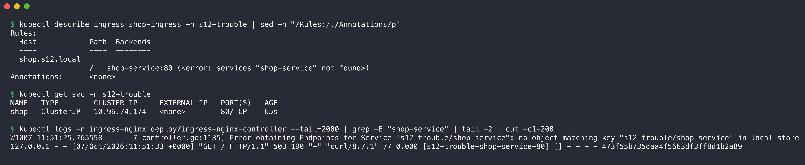

```console
$ kubectl describe ingress shop-ingress -n s12-trouble | sed -n "/Rules:/,/Annotations/p"
Rules:
  Host            Path  Backends
  ----            ----  --------
  shop.s12.local  
                  /   shop-service:80 (<error: services "shop-service" not found>)
Annotations:      <none>

$ kubectl get svc -n s12-trouble
NAME   TYPE        CLUSTER-IP     EXTERNAL-IP   PORT(S)   AGE
shop   ClusterIP   10.96.74.174   <none>        80/TCP    65s

$ kubectl logs -n ingress-nginx deploy/ingress-nginx-controller --tail=2000 | grep -E "shop-service" | tail -2 | cut -c1-200
W1007 11:51:25.765558       7 controller.go:1135] Error obtaining Endpoints for Service "s12-trouble/shop-service": no object matching key "s12-trouble/shop-service" in local store
127.0.0.1 - - [07/Oct/2026:11:51:33 +0000] "GET / HTTP/1.1" 503 190 "-" "curl/8.7.1" 77 0.000 [s12-trouble-shop-service-80] [] - - - - 473f55b735daa4f5663df3ff8d1b2a89
```

### 3. Find the root cause

- `describe ingress` shows `<error: services "shop-service" not found>`.
- The only Service in the namespace is `shop`.
- The controller log has the same error. The access log line has no upstream Pod IP (`- - - -`), so nginx had no backend and returned 503.

An HTTP 503 from ingress-nginx means "the rule matched, but there is no ready backend". Other causes with the same symptom:

- The Service port in the Ingress does not exist on the Service (for example 8080 instead of 80).
- The Service selector matches no Pods, or no Pod is Ready (empty EndpointSlice).
- The Service is in another namespace. An Ingress can only use Services in its own namespace.

### 4. Fix the issue

1. Change the backend Service name to `shop` in [fixed-ingress.yaml](03-ingress-wrong-service/fixed-ingress.yaml).
2. Apply it. The controller reloads its configuration in a few seconds.

### 5. Before/after output

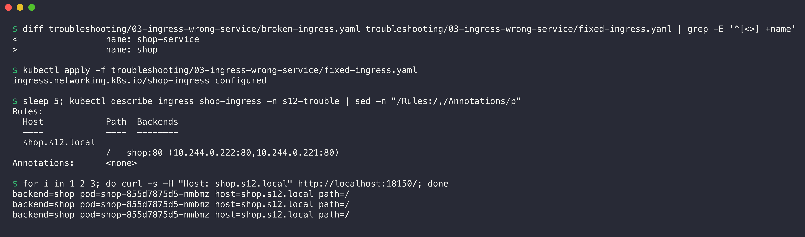

```console
$ diff troubleshooting/03-ingress-wrong-service/broken-ingress.yaml troubleshooting/03-ingress-wrong-service/fixed-ingress.yaml | grep -E '^[<>] +name'
<                 name: shop-service
>                 name: shop

$ kubectl apply -f troubleshooting/03-ingress-wrong-service/fixed-ingress.yaml
ingress.networking.k8s.io/shop-ingress configured

$ sleep 5; kubectl describe ingress shop-ingress -n s12-trouble | sed -n "/Rules:/,/Annotations/p"
Rules:
  Host            Path  Backends
  ----            ----  --------
  shop.s12.local  
                  /   shop:80 (10.244.0.222:80,10.244.0.221:80)
Annotations:      <none>

$ for i in 1 2 3; do curl -s -H "Host: shop.s12.local" http://localhost:18150/; done
backend=shop pod=shop-855d7875d5-nmbmz host=shop.s12.local path=/
backend=shop pod=shop-855d7875d5-nmbmz host=shop.s12.local path=/
backend=shop pod=shop-855d7875d5-nmbmz host=shop.s12.local path=/
```

| | Before | After |
|-|--------|-------|
| Backend in `describe` | `<error: services "shop-service" not found>` | `shop:80 (10.244.0.222:80,10.244.0.221:80)` |
| curl | HTTP 503 Service Temporarily Unavailable | `backend=shop ...` (HTTP 200) |

---

## Scenario 4: Ingress with a wrong ingressClassName

Folder: [04-ingress-wrong-class/](04-ingress-wrong-class/) (`broken-ingress.yaml`, `fixed-ingress.yaml`). It uses the `shop` app from scenario 3.

### 1. Identify the problem

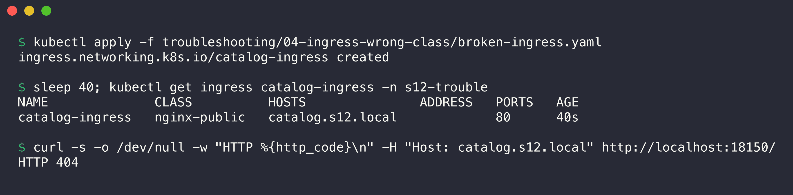

```console
$ kubectl apply -f troubleshooting/04-ingress-wrong-class/broken-ingress.yaml
ingress.networking.k8s.io/catalog-ingress created

$ sleep 40; kubectl get ingress catalog-ingress -n s12-trouble
NAME              CLASS          HOSTS               ADDRESS   PORTS   AGE
catalog-ingress   nginx-public   catalog.s12.local             80      40s

$ curl -s -o /dev/null -w "HTTP %{http_code}\n" -H "Host: catalog.s12.local" http://localhost:18150/
HTTP 404
```

The API server accepted the Ingress, but after 40 seconds it still has no `ADDRESS`. The controller answers 404 for the host.

### 2. Run troubleshooting commands

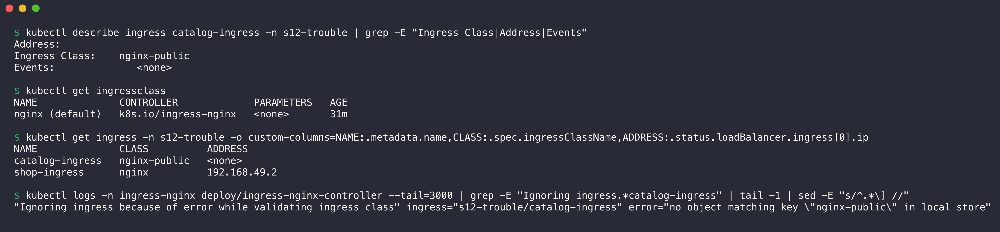

```console
$ kubectl describe ingress catalog-ingress -n s12-trouble | grep -E "Ingress Class|Address|Events"
Address:          
Ingress Class:    nginx-public
Events:              <none>

$ kubectl get ingressclass
NAME              CONTROLLER             PARAMETERS   AGE
nginx (default)   k8s.io/ingress-nginx   <none>       31m

$ kubectl get ingress -n s12-trouble -o custom-columns=NAME:.metadata.name,CLASS:.spec.ingressClassName,ADDRESS:.status.loadBalancer.ingress[0].ip
NAME              CLASS          ADDRESS
catalog-ingress   nginx-public   <none>
shop-ingress      nginx          192.168.49.2

$ kubectl logs -n ingress-nginx deploy/ingress-nginx-controller --tail=3000 | grep -E "Ignoring ingress.*catalog-ingress" | tail -1 | sed -E "s/^.*\] //"
"Ignoring ingress because of error while validating ingress class" ingress="s12-trouble/catalog-ingress" error="no object matching key \"nginx-public\" in local store"
```

### 3. Find the root cause

- The Ingress has class `nginx-public`. The only IngressClass in the cluster is `nginx`.
- No controller watches `nginx-public`. The Ingress has no events and no address, because no controller touched it.
- The ingress-nginx log says it ignores the Ingress because of the unknown class.

This shows that an Ingress object alone does nothing. A controller must accept it (see [Task 4](../ingress-vs-ingress-controller/README.md)). The same symptom appears when no Ingress controller is installed at all.

### 4. Fix the issue

1. Set `ingressClassName: nginx` in [fixed-ingress.yaml](04-ingress-wrong-class/fixed-ingress.yaml).
2. Apply it.

If you omit `ingressClassName`, this cluster uses `nginx`, because the IngressClass has the annotation `ingressclass.kubernetes.io/is-default-class: "true"`. Clusters without a default class ignore such an Ingress. Always set the class.

### 5. Before/after output

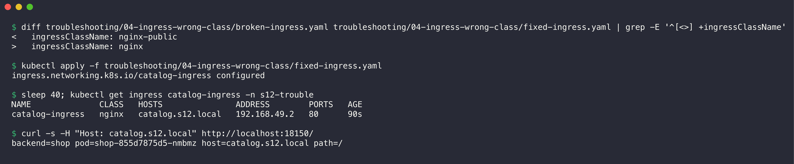

```console
$ diff troubleshooting/04-ingress-wrong-class/broken-ingress.yaml troubleshooting/04-ingress-wrong-class/fixed-ingress.yaml | grep -E '^[<>] +ingressClassName'
<   ingressClassName: nginx-public
>   ingressClassName: nginx

$ kubectl apply -f troubleshooting/04-ingress-wrong-class/fixed-ingress.yaml
ingress.networking.k8s.io/catalog-ingress configured

$ sleep 40; kubectl get ingress catalog-ingress -n s12-trouble
NAME              CLASS   HOSTS               ADDRESS        PORTS   AGE
catalog-ingress   nginx   catalog.s12.local   192.168.49.2   80      90s

$ curl -s -H "Host: catalog.s12.local" http://localhost:18150/
backend=shop pod=shop-855d7875d5-nmbmz host=catalog.s12.local path=/
```

| | Before | After |
|-|--------|-------|
| CLASS | `nginx-public` | `nginx` |
| ADDRESS | empty | `192.168.49.2` |
| curl | HTTP 404 | `backend=shop ...` (HTTP 200) |

---

## Quick reference

| Symptom | First command | Likely cause |
|---------|---------------|--------------|
| `CreateContainerConfigError` | `kubectl describe pod` (Events) | Missing ConfigMap, Secret, or key |
| App rejects a value from a Secret | `kubectl get secret -o jsonpath=... \| base64 -d \| xxd` | Newline or space in the encoded value |
| New ConfigMap value not in env | `kubectl exec ... env` | Env is fixed at start. Restart the Pods. |
| Ingress HTTP 503 | `kubectl describe ingress` (Backends) | Wrong Service name or port, no ready endpoints |
| Ingress HTTP 404 | `kubectl get ingress` (CLASS, HOSTS) | Wrong host, wrong path, wrong or missing class |
| Ingress has no ADDRESS | `kubectl get ingressclass`, controller logs | No controller for this class |
