# Session 11: Kubernetes Networking & Services

**Name:** Kartavya Panchal  
**Roll No.:** 24BCS10343

All demos ran on a local minikube cluster (Kubernetes v1.37, docker driver, macOS arm64). The demos use the namespaces `s11-services`, `s11-backend` and `s11-compare`.

## Folder structure

```text
Kubernetes-Networking-&-Services/
├── README.md                  # this file (Task 1: the 5 Service types)
├── 00-namespaces.yaml         # s11-services and s11-backend
├── client-pods.yaml           # curl-client and dnsutils test Pods
├── 01-clusterip/              # deployment.yaml, service.yaml
├── 02-nodeport/               # deployment.yaml, service.yaml
├── 03-loadbalancer/           # deployment.yaml, service.yaml
├── 04-externalname/           # service.yaml
├── 05-headless/               # statefulset.yaml, service.yaml
├── comparison/                # Task 2: README.md + demo YAML files
├── fqdn/                      # Task 3: README.md + backend.yaml (second namespace)
├── coredns/                   # Task 4: README.md + broken YAML for DNS drills
└── screenshots/               # all PNG screenshots
```

## Task index

| Task | Where |
|------|-------|
| Task 1: Kubernetes Services (all 5 types) | This file, sections below |
| Task 2: Kubernetes Object Comparison | [comparison/README.md](comparison/README.md) |
| Task 3: FQDN | [fqdn/README.md](fqdn/README.md) |
| Task 4: CoreDNS | [coredns/README.md](coredns/README.md) |

---

## Task 1: Kubernetes Services

A Service gives a group of Pods one stable name and one stable address. Pods come and go, and their IP addresses change. The Service uses a label selector to find the current Pods. The EndpointSlice objects hold the list of Pod IPs that receive the traffic.

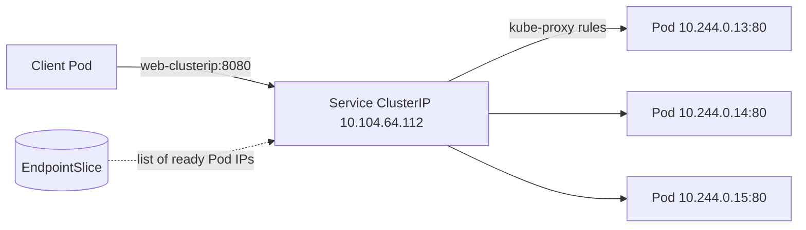

| Type | Address it gives | Reachable from | Typical use |
|------|------------------|----------------|-------------|
| ClusterIP | One virtual IP inside the cluster | Inside the cluster only | Traffic between microservices |
| NodePort | ClusterIP + a port (30000-32767) on every node | Anything that can reach a node IP | Tests, bare metal, simple exposure |
| LoadBalancer | NodePort + ClusterIP + an external load balancer IP | The internet or the network | Public apps on a cloud provider |
| ExternalName | A DNS CNAME, no IP | Inside the cluster (DNS only) | Alias for an external database or API |
| Headless (`clusterIP: None`) | No virtual IP. DNS returns each Pod IP | Inside the cluster | StatefulSets, databases, client-side load balancing |

### Setup: namespaces and client Pods

Files: [00-namespaces.yaml](00-namespaces.yaml), [client-pods.yaml](client-pods.yaml)

1. Create the namespaces and the two client Pods.
2. Use `curl-client` for HTTP tests. Use `dnsutils` for `nslookup` and `dig`.

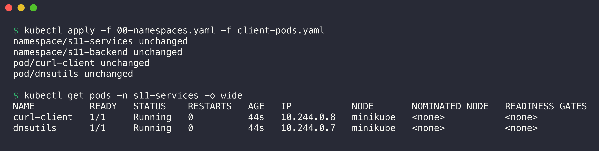

```console
$ kubectl apply -f 00-namespaces.yaml -f client-pods.yaml
namespace/s11-services unchanged
namespace/s11-backend unchanged
pod/curl-client unchanged
pod/dnsutils unchanged

$ kubectl get pods -n s11-services -o wide
NAME          READY   STATUS    RESTARTS   AGE   IP           NODE       NOMINATED NODE   READINESS GATES
curl-client   1/1     Running   0          44s   10.244.0.8   minikube   <none>           <none>
dnsutils      1/1     Running   0          44s   10.244.0.7   minikube   <none>           <none>
```

The output shows `unchanged` because I created the objects one minute before this screenshot.

Each web Deployment in this task runs nginx. At start, each Pod writes `Hello from pod <pod-name>` into `index.html`. Thus every response shows which Pod answered.

---

### 1. ClusterIP

Files: [01-clusterip/deployment.yaml](01-clusterip/deployment.yaml), [01-clusterip/service.yaml](01-clusterip/service.yaml)

```yaml
spec:
  type: ClusterIP
  selector:
    app: web-clusterip
  ports:
    - name: http
      port: 8080        # the port that clients use
      targetPort: 80    # the port of the container
```

#### Deploy

1. Apply the folder.
2. Wait for the rollout.

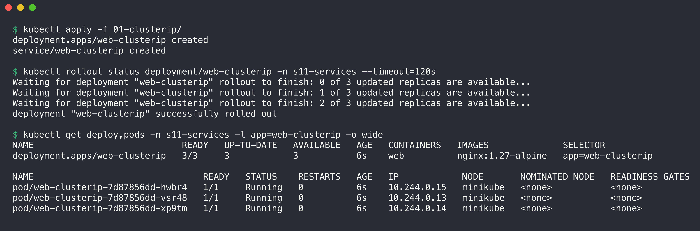

```console
$ kubectl apply -f 01-clusterip/
deployment.apps/web-clusterip created
service/web-clusterip created

$ kubectl rollout status deployment/web-clusterip -n s11-services --timeout=120s
Waiting for deployment "web-clusterip" rollout to finish: 0 of 3 updated replicas are available...
Waiting for deployment "web-clusterip" rollout to finish: 1 of 3 updated replicas are available...
Waiting for deployment "web-clusterip" rollout to finish: 2 of 3 updated replicas are available...
deployment "web-clusterip" successfully rolled out

$ kubectl get deploy,pods -n s11-services -l app=web-clusterip -o wide
NAME                            READY   UP-TO-DATE   AVAILABLE   AGE   CONTAINERS   IMAGES              SELECTOR
deployment.apps/web-clusterip   3/3     3            3           6s    web          nginx:1.27-alpine   app=web-clusterip

NAME                                READY   STATUS    RESTARTS   AGE   IP            NODE       NOMINATED NODE   READINESS GATES
pod/web-clusterip-7d87856dd-hwbr4   1/1     Running   0          6s    10.244.0.15   minikube   <none>           <none>
pod/web-clusterip-7d87856dd-vsr48   1/1     Running   0          6s    10.244.0.13   minikube   <none>           <none>
pod/web-clusterip-7d87856dd-xp9tm   1/1     Running   0          6s    10.244.0.14   minikube   <none>           <none>
```

#### Verify the Service

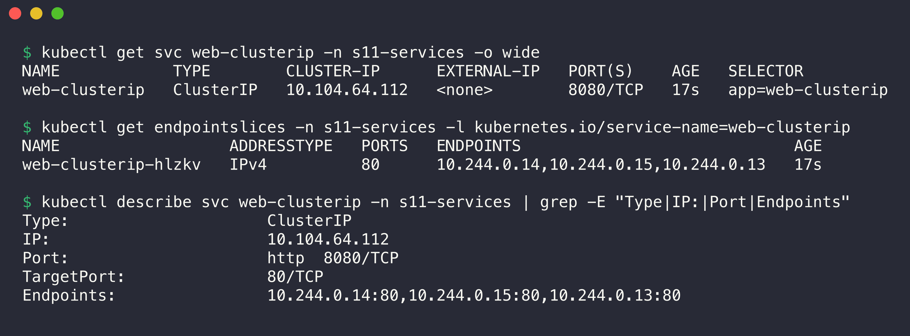

```console
$ kubectl get svc web-clusterip -n s11-services -o wide
NAME            TYPE        CLUSTER-IP      EXTERNAL-IP   PORT(S)    AGE   SELECTOR
web-clusterip   ClusterIP   10.104.64.112   <none>        8080/TCP   17s   app=web-clusterip

$ kubectl get endpointslices -n s11-services -l kubernetes.io/service-name=web-clusterip
NAME                  ADDRESSTYPE   PORTS   ENDPOINTS                             AGE
web-clusterip-hlzkv   IPv4          80      10.244.0.14,10.244.0.15,10.244.0.13   17s

$ kubectl describe svc web-clusterip -n s11-services | grep -E "Type|IP:|Port|Endpoints"
Type:                     ClusterIP
IP:                       10.104.64.112
Port:                     http  8080/TCP
TargetPort:               80/TCP
Endpoints:                10.244.0.14:80,10.244.0.15:80,10.244.0.13:80
```

The Service has the virtual IP `10.104.64.112`. The EndpointSlice holds the three Pod IPs from the previous step. The Service port is 8080 and the target port on the Pods is 80.

#### Test connectivity

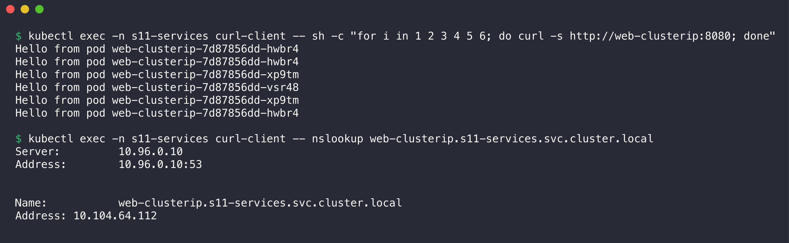

```console
$ kubectl exec -n s11-services curl-client -- sh -c "for i in 1 2 3 4 5 6; do curl -s http://web-clusterip:8080; done"
Hello from pod web-clusterip-7d87856dd-hwbr4
Hello from pod web-clusterip-7d87856dd-hwbr4
Hello from pod web-clusterip-7d87856dd-xp9tm
Hello from pod web-clusterip-7d87856dd-vsr48
Hello from pod web-clusterip-7d87856dd-xp9tm
Hello from pod web-clusterip-7d87856dd-hwbr4

$ kubectl exec -n s11-services curl-client -- nslookup web-clusterip.s11-services.svc.cluster.local
Server:		10.96.0.10
Address:	10.96.0.10:53


Name:	web-clusterip.s11-services.svc.cluster.local
Address: 10.104.64.112
```

All three Pods answered. kube-proxy picks a Pod at random for each new connection. The DNS name of the Service resolves to the ClusterIP.

A ClusterIP is not reachable from outside the cluster. To reach it from the laptop, use `kubectl port-forward`:

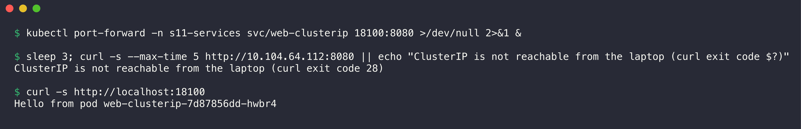

```console
$ kubectl port-forward -n s11-services svc/web-clusterip 18100:8080 >/dev/null 2>&1 &

$ sleep 3; curl -s --max-time 5 http://10.104.64.112:8080 || echo "ClusterIP is not reachable from the laptop (curl exit code $?)"
ClusterIP is not reachable from the laptop (curl exit code 28)

$ curl -s http://localhost:18100
Hello from pod web-clusterip-7d87856dd-hwbr4
```

Exit code 28 is a timeout. The port-forward sends the traffic through the API server to one Pod.

---

### 2. NodePort

Files: [02-nodeport/deployment.yaml](02-nodeport/deployment.yaml), [02-nodeport/service.yaml](02-nodeport/service.yaml)

```yaml
spec:
  type: NodePort
  ports:
    - port: 80          # ClusterIP port
      targetPort: 80    # container port
      nodePort: 30180   # port on every node (range 30000-32767)
```

#### Deploy and verify

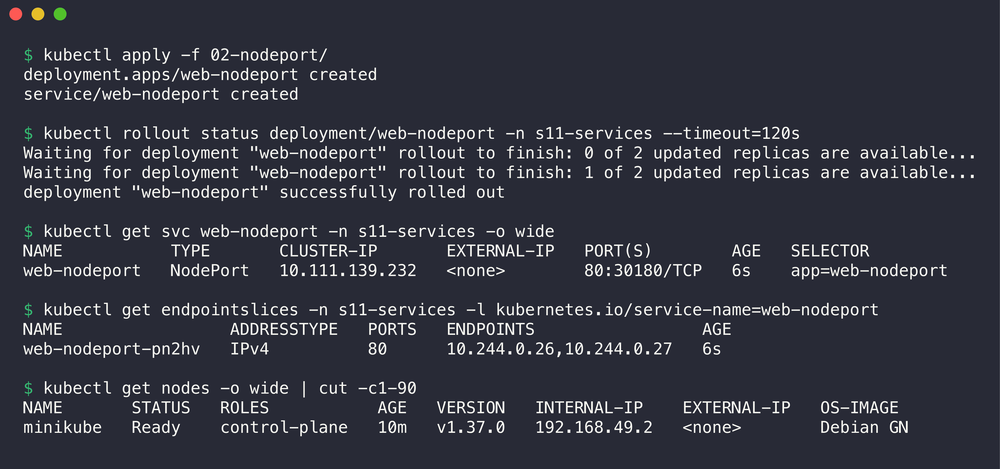

```console
$ kubectl apply -f 02-nodeport/
deployment.apps/web-nodeport created
service/web-nodeport created

$ kubectl rollout status deployment/web-nodeport -n s11-services --timeout=120s
Waiting for deployment "web-nodeport" rollout to finish: 0 of 2 updated replicas are available...
Waiting for deployment "web-nodeport" rollout to finish: 1 of 2 updated replicas are available...
deployment "web-nodeport" successfully rolled out

$ kubectl get svc web-nodeport -n s11-services -o wide
NAME           TYPE       CLUSTER-IP       EXTERNAL-IP   PORT(S)        AGE   SELECTOR
web-nodeport   NodePort   10.111.139.232   <none>        80:30180/TCP   6s    app=web-nodeport

$ kubectl get endpointslices -n s11-services -l kubernetes.io/service-name=web-nodeport
NAME                 ADDRESSTYPE   PORTS   ENDPOINTS                 AGE
web-nodeport-pn2hv   IPv4          80      10.244.0.26,10.244.0.27   6s

$ kubectl get nodes -o wide | cut -c1-90
NAME       STATUS   ROLES           AGE   VERSION   INTERNAL-IP    EXTERNAL-IP   OS-IMAGE 
minikube   Ready    control-plane   10m   v1.37.0   192.168.49.2   <none>        Debian GN
```

`80:30180/TCP` means: ClusterIP port 80, node port 30180. A NodePort Service also has a ClusterIP (`10.111.139.232`). The node IP is `192.168.49.2`.

#### Test connectivity

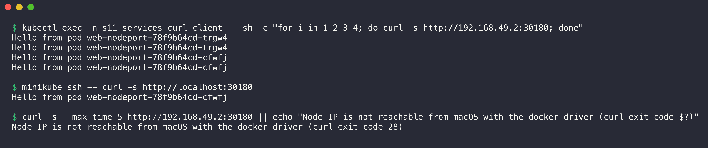

```console
$ kubectl exec -n s11-services curl-client -- sh -c "for i in 1 2 3 4; do curl -s http://192.168.49.2:30180; done"
Hello from pod web-nodeport-78f9b64cd-trgw4
Hello from pod web-nodeport-78f9b64cd-trgw4
Hello from pod web-nodeport-78f9b64cd-cfwfj
Hello from pod web-nodeport-78f9b64cd-cfwfj

$ minikube ssh -- curl -s http://localhost:30180
Hello from pod web-nodeport-78f9b64cd-cfwfj

$ curl -s --max-time 5 http://192.168.49.2:30180 || echo "Node IP is not reachable from macOS with the docker driver (curl exit code $?)"
Node IP is not reachable from macOS with the docker driver (curl exit code 28)
```

The node answers on port 30180, and both Pods receive traffic. On macOS with the docker driver, the minikube node runs inside a Docker VM. Thus the Mac cannot reach `192.168.49.2` directly. `minikube service --url` makes an SSH tunnel to the Service for this case:

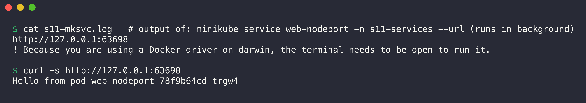

```console
$ cat s11-mksvc.log   # output of: minikube service web-nodeport -n s11-services --url (runs in background)
http://127.0.0.1:63698
! Because you are using a Docker driver on darwin, the terminal needs to be open to run it.

$ curl -s http://127.0.0.1:63698
Hello from pod web-nodeport-78f9b64cd-trgw4
```

---

### 3. LoadBalancer

Files: [03-loadbalancer/deployment.yaml](03-loadbalancer/deployment.yaml), [03-loadbalancer/service.yaml](03-loadbalancer/service.yaml)

```yaml
spec:
  type: LoadBalancer
  ports:
    - port: 8081        # not a privileged port, so minikube tunnel does not need sudo
      targetPort: 80
```

On a cloud provider (EKS, GKE, AKS), the cloud controller manager makes a real load balancer and writes its IP or DNS name into `EXTERNAL-IP`. minikube has no cloud controller. Thus `EXTERNAL-IP` stays `<pending>` until `minikube tunnel` runs.

#### Deploy: EXTERNAL-IP is pending

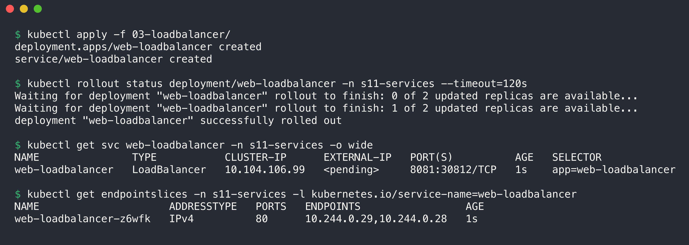

```console
$ kubectl apply -f 03-loadbalancer/
deployment.apps/web-loadbalancer created
service/web-loadbalancer created

$ kubectl rollout status deployment/web-loadbalancer -n s11-services --timeout=120s
Waiting for deployment "web-loadbalancer" rollout to finish: 0 of 2 updated replicas are available...
Waiting for deployment "web-loadbalancer" rollout to finish: 1 of 2 updated replicas are available...
deployment "web-loadbalancer" successfully rolled out

$ kubectl get svc web-loadbalancer -n s11-services -o wide
NAME               TYPE           CLUSTER-IP      EXTERNAL-IP   PORT(S)          AGE   SELECTOR
web-loadbalancer   LoadBalancer   10.104.106.99   <pending>     8081:30812/TCP   1s    app=web-loadbalancer

$ kubectl get endpointslices -n s11-services -l kubernetes.io/service-name=web-loadbalancer
NAME                     ADDRESSTYPE   PORTS   ENDPOINTS                 AGE
web-loadbalancer-z6wfk   IPv4          80      10.244.0.29,10.244.0.28   1s
```

Kubernetes also gave the Service a ClusterIP (`10.104.106.99`) and a NodePort (`30812`). A LoadBalancer Service is a NodePort Service with an extra external load balancer.

#### Start minikube tunnel: EXTERNAL-IP is assigned

1. Start `minikube tunnel` in the background with a time limit: `timeout 120 minikube tunnel > s11-tunnel.log 2>&1 &`.
2. Examine the Service again.
3. Send requests to the external IP and port.

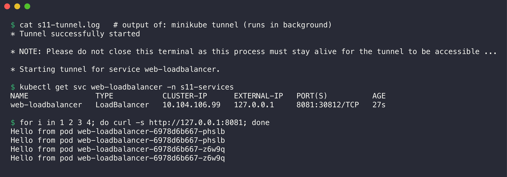

```console
$ cat s11-tunnel.log   # output of: minikube tunnel (runs in background)
* Tunnel successfully started

* NOTE: Please do not close this terminal as this process must stay alive for the tunnel to be accessible ...

* Starting tunnel for service web-loadbalancer.

$ kubectl get svc web-loadbalancer -n s11-services
NAME               TYPE           CLUSTER-IP      EXTERNAL-IP   PORT(S)          AGE
web-loadbalancer   LoadBalancer   10.104.106.99   127.0.0.1     8081:30812/TCP   27s

$ for i in 1 2 3 4; do curl -s http://127.0.0.1:8081; done
Hello from pod web-loadbalancer-6978d6b667-phslb
Hello from pod web-loadbalancer-6978d6b667-phslb
Hello from pod web-loadbalancer-6978d6b667-z6w9q
Hello from pod web-loadbalancer-6978d6b667-z6w9q
```

The tunnel did not ask for a password because port 8081 is above 1024. The tunnel acts as the "cloud load balancer". It wrote `127.0.0.1` into `EXTERNAL-IP` and forwarded port 8081 to the Service.

The same Service also works through its ClusterIP and NodePort:

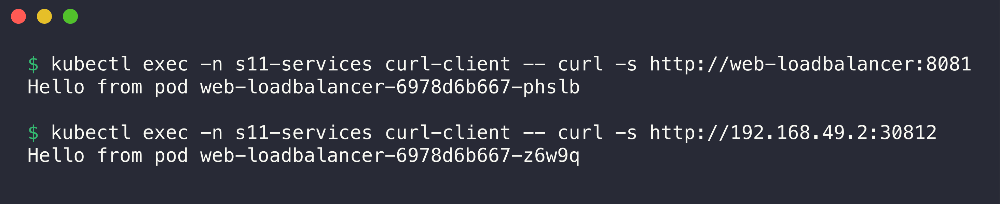

```console
$ kubectl exec -n s11-services curl-client -- curl -s http://web-loadbalancer:8081
Hello from pod web-loadbalancer-6978d6b667-phslb

$ kubectl exec -n s11-services curl-client -- curl -s http://192.168.49.2:30812
Hello from pod web-loadbalancer-6978d6b667-z6w9q
```

#### Stop the tunnel

1. Stop the tunnel process.
2. Recreate the Service to show the state without a tunnel.

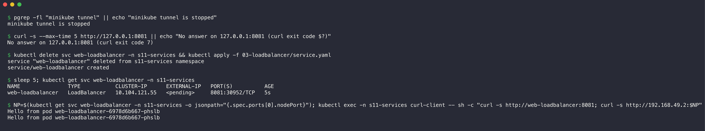

```console
$ pgrep -fl "minikube tunnel" || echo "minikube tunnel is stopped"
minikube tunnel is stopped

$ curl -s --max-time 5 http://127.0.0.1:8081 || echo "No answer on 127.0.0.1:8081 (curl exit code $?)"
No answer on 127.0.0.1:8081 (curl exit code 7)

$ kubectl delete svc web-loadbalancer -n s11-services && kubectl apply -f 03-loadbalancer/service.yaml
service "web-loadbalancer" deleted from s11-services namespace
service/web-loadbalancer created

$ sleep 5; kubectl get svc web-loadbalancer -n s11-services
NAME               TYPE           CLUSTER-IP      EXTERNAL-IP   PORT(S)          AGE
web-loadbalancer   LoadBalancer   10.104.121.55   <pending>     8081:30952/TCP   5s

$ NP=$(kubectl get svc web-loadbalancer -n s11-services -o jsonpath="{.spec.ports[0].nodePort}"); kubectl exec -n s11-services curl-client -- sh -c "curl -s http://web-loadbalancer:8081; curl -s http://192.168.49.2:$NP"
Hello from pod web-loadbalancer-6978d6b667-phslb
Hello from pod web-loadbalancer-6978d6b667-phslb
```

When I stopped the tunnel with a signal, the old `127.0.0.1` value stayed in the Service status. I recreated the Service to show the clean state. Without a tunnel, `EXTERNAL-IP` is `<pending>`, but the ClusterIP and NodePort parts still work.

---

### 4. ExternalName

File: [04-externalname/service.yaml](04-externalname/service.yaml)

```yaml
spec:
  type: ExternalName
  externalName: api.github.com   # no selector, no ports, no ClusterIP
```

#### Deploy and verify

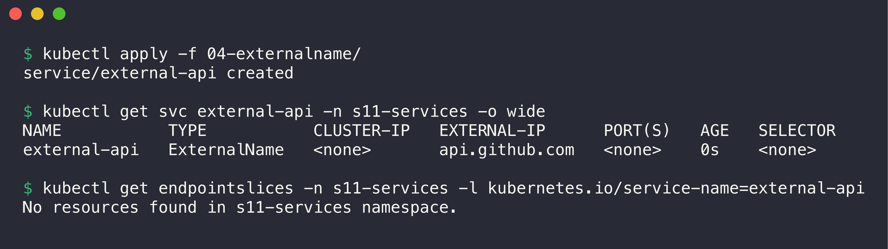

```console
$ kubectl apply -f 04-externalname/
service/external-api created

$ kubectl get svc external-api -n s11-services -o wide
NAME           TYPE           CLUSTER-IP   EXTERNAL-IP      PORT(S)   AGE   SELECTOR
external-api   ExternalName   <none>       api.github.com   <none>    0s    <none>

$ kubectl get endpointslices -n s11-services -l kubernetes.io/service-name=external-api
No resources found in s11-services namespace.
```

An ExternalName Service has no ClusterIP, no selector and no EndpointSlice. It exists only in DNS.

#### Test DNS: the CNAME record

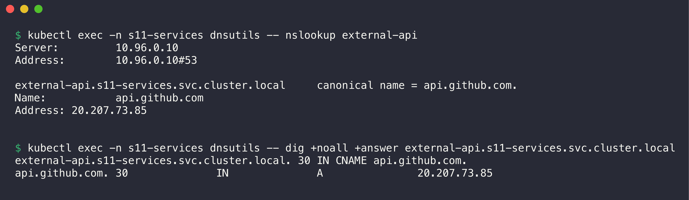

```console
$ kubectl exec -n s11-services dnsutils -- nslookup external-api
Server:		10.96.0.10
Address:	10.96.0.10#53

external-api.s11-services.svc.cluster.local	canonical name = api.github.com.
Name:	api.github.com
Address: 20.207.73.85


$ kubectl exec -n s11-services dnsutils -- dig +noall +answer external-api.s11-services.svc.cluster.local
external-api.s11-services.svc.cluster.local. 30	IN CNAME api.github.com.
api.github.com.		30	IN	A	20.207.73.85
```

CoreDNS answers with a `CNAME` record to `api.github.com`. The client then resolves `api.github.com` to a public IP and connects directly. kube-proxy is not in the path.

#### Test connectivity

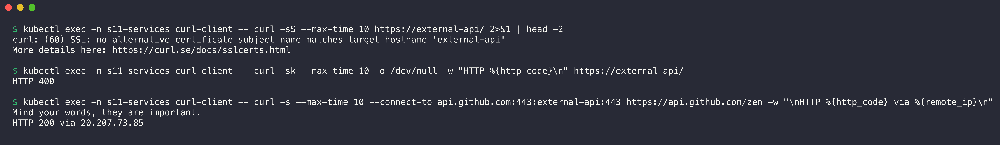

```console
$ kubectl exec -n s11-services curl-client -- curl -sS --max-time 10 https://external-api/ 2>&1 | head -2
curl: (60) SSL: no alternative certificate subject name matches target hostname 'external-api'
More details here: https://curl.se/docs/sslcerts.html

$ kubectl exec -n s11-services curl-client -- curl -sk --max-time 10 -o /dev/null -w "HTTP %{http_code}\n" https://external-api/
HTTP 400

$ kubectl exec -n s11-services curl-client -- curl -s --max-time 10 --connect-to api.github.com:443:external-api:443 https://api.github.com/zen -w "\nHTTP %{http_code} via %{remote_ip}\n"
Mind your words, they are important.
HTTP 200 via 20.207.73.85
```

The connection reaches GitHub, but HTTPS shows an important limit of ExternalName:

- The TLS certificate is for `api.github.com`, not for `external-api`. Thus curl rejects it (error 60).
- With `-k`, TLS works, but the server gets `Host: external-api` and returns HTTP 400.
- With `--connect-to`, curl connects through the alias but sends the real name in SNI and `Host`. The server returns HTTP 200.

ExternalName works best for protocols that do not check the host name, for example many database protocols. For HTTPS, the application must send the real host name.

---

### 5. Headless Service

Files: [05-headless/service.yaml](05-headless/service.yaml), [05-headless/statefulset.yaml](05-headless/statefulset.yaml)

```yaml
# Service
spec:
  clusterIP: None              # headless: no virtual IP
  selector:
    app: web-headless
---
# StatefulSet
spec:
  serviceName: web-headless    # gives each Pod a DNS name under this Service
  replicas: 3
```

#### Deploy and verify

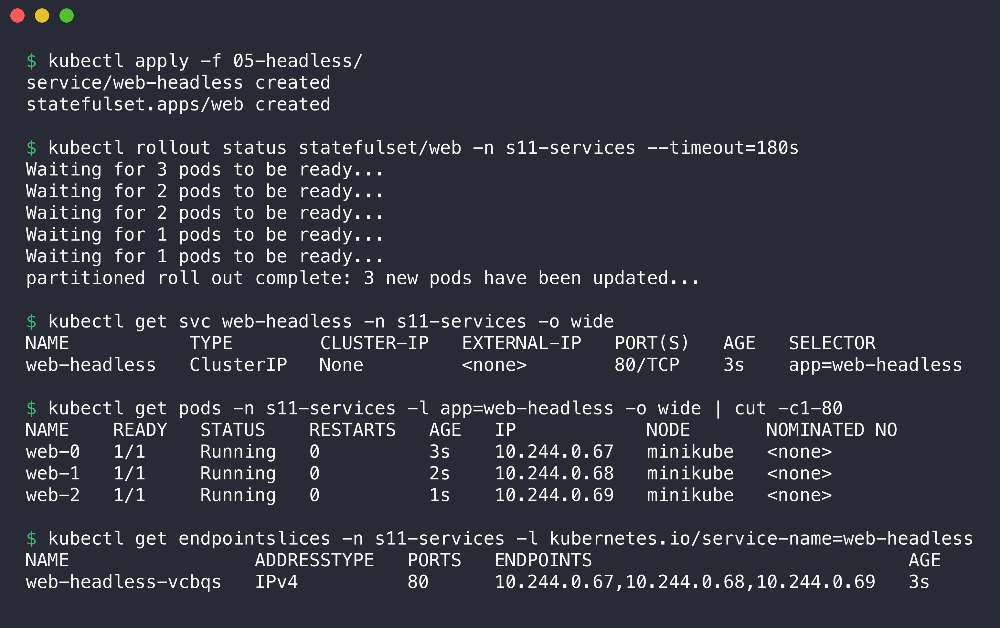

```console
$ kubectl apply -f 05-headless/
service/web-headless created
statefulset.apps/web created

$ kubectl rollout status statefulset/web -n s11-services --timeout=180s
Waiting for 3 pods to be ready...
Waiting for 2 pods to be ready...
Waiting for 2 pods to be ready...
Waiting for 1 pods to be ready...
Waiting for 1 pods to be ready...
partitioned roll out complete: 3 new pods have been updated...

$ kubectl get svc web-headless -n s11-services -o wide
NAME           TYPE        CLUSTER-IP   EXTERNAL-IP   PORT(S)   AGE   SELECTOR
web-headless   ClusterIP   None         <none>        80/TCP    3s    app=web-headless

$ kubectl get pods -n s11-services -l app=web-headless -o wide | cut -c1-80
NAME    READY   STATUS    RESTARTS   AGE   IP            NODE       NOMINATED NO
web-0   1/1     Running   0          3s    10.244.0.67   minikube   <none>      
web-1   1/1     Running   0          2s    10.244.0.68   minikube   <none>      
web-2   1/1     Running   0          1s    10.244.0.69   minikube   <none>      

$ kubectl get endpointslices -n s11-services -l kubernetes.io/service-name=web-headless
NAME                 ADDRESSTYPE   PORTS   ENDPOINTS                             AGE
web-headless-vcbqs   IPv4          80      10.244.0.67,10.244.0.68,10.244.0.69   3s
```

`CLUSTER-IP` is `None`. The StatefulSet made the Pods in order: `web-0`, then `web-1`, then `web-2`. Kubernetes sets the hostname and subdomain of each Pod:

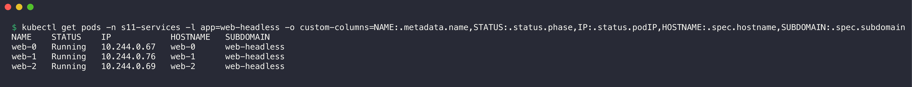

```console
$ kubectl get pods -n s11-services -l app=web-headless -o custom-columns=NAME:.metadata.name,STATUS:.status.phase,IP:.status.podIP,HOSTNAME:.spec.hostname,SUBDOMAIN:.spec.subdomain
NAME    STATUS    IP            HOSTNAME   SUBDOMAIN
web-0   Running   10.244.0.67   web-0      web-headless
web-1   Running   10.244.0.76   web-1      web-headless
web-2   Running   10.244.0.69   web-2      web-headless
```

(I took this screenshot after the restart test below, so `web-1` has a new IP.)

#### Test DNS: one record for each Pod

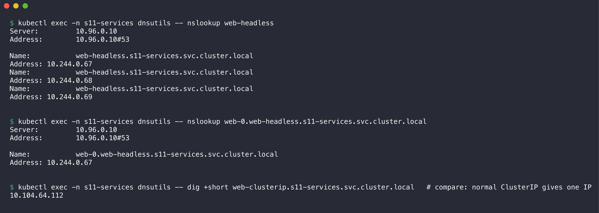

```console
$ kubectl exec -n s11-services dnsutils -- nslookup web-headless
Server:		10.96.0.10
Address:	10.96.0.10#53

Name:	web-headless.s11-services.svc.cluster.local
Address: 10.244.0.67
Name:	web-headless.s11-services.svc.cluster.local
Address: 10.244.0.68
Name:	web-headless.s11-services.svc.cluster.local
Address: 10.244.0.69


$ kubectl exec -n s11-services dnsutils -- nslookup web-0.web-headless.s11-services.svc.cluster.local
Server:		10.96.0.10
Address:	10.96.0.10#53

Name:	web-0.web-headless.s11-services.svc.cluster.local
Address: 10.244.0.67


$ kubectl exec -n s11-services dnsutils -- dig +short web-clusterip.s11-services.svc.cluster.local   # compare: normal ClusterIP gives one IP
10.104.64.112
```

A headless Service name resolves to all Pod IPs. A normal ClusterIP Service resolves to one virtual IP. Each StatefulSet Pod also has its own name: `<pod>.<service>.<namespace>.svc.cluster.local`.

#### Test connectivity to each Pod

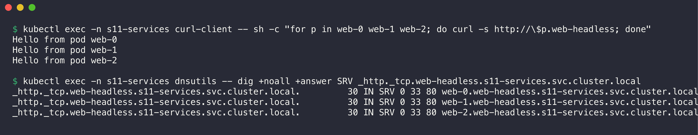

```console
$ kubectl exec -n s11-services curl-client -- sh -c "for p in web-0 web-1 web-2; do curl -s http://\$p.web-headless; done"
Hello from pod web-0
Hello from pod web-1
Hello from pod web-2

$ kubectl exec -n s11-services dnsutils -- dig +noall +answer SRV _http._tcp.web-headless.s11-services.svc.cluster.local
_http._tcp.web-headless.s11-services.svc.cluster.local.	30 IN SRV 0 33 80 web-0.web-headless.s11-services.svc.cluster.local.
_http._tcp.web-headless.s11-services.svc.cluster.local.	30 IN SRV 0 33 80 web-1.web-headless.s11-services.svc.cluster.local.
_http._tcp.web-headless.s11-services.svc.cluster.local.	30 IN SRV 0 33 80 web-2.web-headless.s11-services.svc.cluster.local.
```

The client chooses the exact Pod. This is how a database client finds the primary (`db-0`) and the replicas. The SRV records list the Pod names and the named port `http`.

#### Stable name after a Pod restart

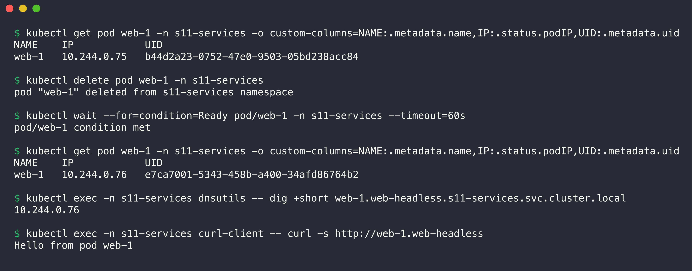

```console
$ kubectl get pod web-1 -n s11-services -o custom-columns=NAME:.metadata.name,IP:.status.podIP,UID:.metadata.uid
NAME    IP            UID
web-1   10.244.0.75   b44d2a23-0752-47e0-9503-05bd238acc84

$ kubectl delete pod web-1 -n s11-services
pod "web-1" deleted from s11-services namespace

$ kubectl wait --for=condition=Ready pod/web-1 -n s11-services --timeout=60s
pod/web-1 condition met

$ kubectl get pod web-1 -n s11-services -o custom-columns=NAME:.metadata.name,IP:.status.podIP,UID:.metadata.uid
NAME    IP            UID
web-1   10.244.0.76   e7ca7001-5343-458b-a400-34afd86764b2

$ kubectl exec -n s11-services dnsutils -- dig +short web-1.web-headless.s11-services.svc.cluster.local
10.244.0.76

$ kubectl exec -n s11-services curl-client -- curl -s http://web-1.web-headless
Hello from pod web-1
```

The new Pod has a new UID and a new IP, but the same name `web-1`. CoreDNS updated the record to the new IP. Clients keep the same DNS name.

---

### Summary of all Services

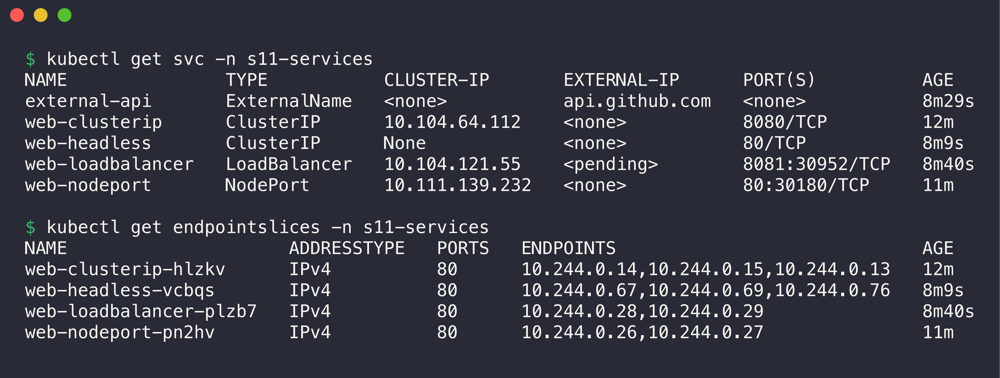

```console
$ kubectl get svc -n s11-services
NAME               TYPE           CLUSTER-IP       EXTERNAL-IP      PORT(S)          AGE
external-api       ExternalName   <none>           api.github.com   <none>           8m29s
web-clusterip      ClusterIP      10.104.64.112    <none>           8080/TCP         12m
web-headless       ClusterIP      None             <none>           80/TCP           8m9s
web-loadbalancer   LoadBalancer   10.104.121.55    <pending>        8081:30952/TCP   8m40s
web-nodeport       NodePort       10.111.139.232   <none>           80:30180/TCP     11m

$ kubectl get endpointslices -n s11-services
NAME                     ADDRESSTYPE   PORTS   ENDPOINTS                             AGE
web-clusterip-hlzkv      IPv4          80      10.244.0.14,10.244.0.15,10.244.0.13   12m
web-headless-vcbqs       IPv4          80      10.244.0.67,10.244.0.69,10.244.0.76   8m9s
web-loadbalancer-plzb7   IPv4          80      10.244.0.28,10.244.0.29               8m40s
web-nodeport-pn2hv       IPv4          80      10.244.0.26,10.244.0.27               11m
```

- Use ClusterIP for traffic between services inside the cluster.
- Use NodePort for tests or for bare metal clusters without a load balancer.
- Use LoadBalancer for public traffic on a cloud provider. In production, one LoadBalancer in front of an Ingress controller is cheaper than one LoadBalancer for each app.
- Use ExternalName for a stable internal name of an external system.
- Use a headless Service when clients must talk to a specific Pod, for example with StatefulSets.

## Cleanup

```bash
kubectl delete namespace s11-services s11-backend s11-compare
```
