# Task 2: Kubernetes Object Comparison

This README compares the Kubernetes workload objects and the Service object. Each part has a small real demo on minikube, in the namespace `s11-compare`.

Demo files in this folder:

| File | Object |
|------|--------|
| [namespace.yaml](namespace.yaml) | Namespace `s11-compare` |
| [deployment.yaml](deployment.yaml) | Deployment `demo-deploy` (3 replicas, RollingUpdate) |
| [replicaset.yaml](replicaset.yaml) | Standalone ReplicaSet `demo-rs` (2 replicas) |
| [daemonset.yaml](daemonset.yaml) | DaemonSet `demo-agent` |
| [statefulset.yaml](statefulset.yaml) | Headless Service + StatefulSet `db` with `volumeClaimTemplates` |
| [service.yaml](service.yaml) | ClusterIP Service `demo-deploy` |

---

## Part 1: Deployment vs ReplicaSet

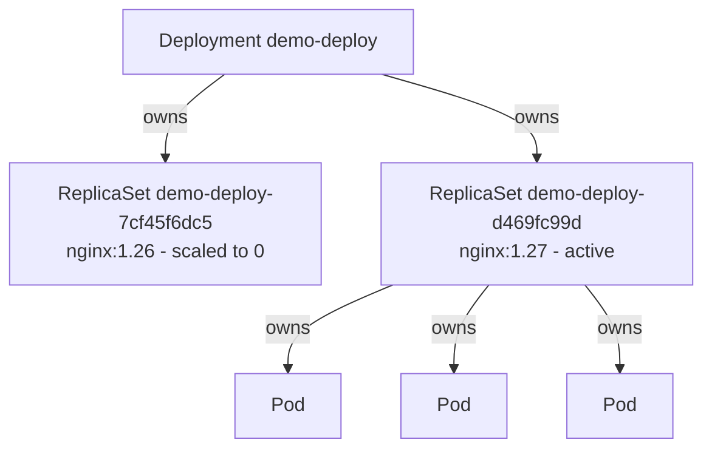

| Topic | ReplicaSet | Deployment |
|-------|------------|------------|
| Purpose | Keeps a fixed number of identical Pods alive. | Manages the release of an app: version changes, rollout, rollback. |
| Pod management | Creates and deletes Pods directly. It matches Pods with its label selector. | Does not create Pods itself. It creates and controls ReplicaSets, and the ReplicaSets create the Pods. |
| Scaling | `kubectl scale rs` changes `replicas`. | `kubectl scale deployment` changes `replicas`. The Deployment passes the number to its active ReplicaSet. |
| Rolling updates | No. If you change the Pod template, the existing Pods do not change. Only new Pods get the new template. | Yes. It makes a new ReplicaSet for each new template. It moves Pods from the old ReplicaSet to the new one step by step (`maxSurge`, `maxUnavailable`). |
| Rollback | No history. | Keeps old ReplicaSets (scaled to 0) as revisions. `kubectl rollout undo` scales an old one up again. |
| Use directly? | Almost never. | Yes, for all stateless apps. |

**Relationship:** a Deployment is a controller one level above the ReplicaSet. The Deployment owns its ReplicaSets, and each ReplicaSet owns its Pods. Kubernetes records this in `metadata.ownerReferences`. The label `pod-template-hash` makes the selector of each ReplicaSet unique, so two ReplicaSets never fight for the same Pods.

### Demo 1: the ownership chain

1. Apply the Deployment.
2. List the Deployment, the ReplicaSet and the Pods.
3. Read the `ownerReferences` of the ReplicaSet and the Pods.

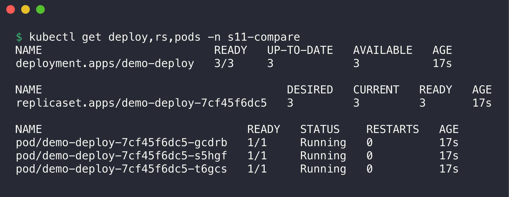

```console
$ kubectl get deploy,rs,pods -n s11-compare
NAME                          READY   UP-TO-DATE   AVAILABLE   AGE
deployment.apps/demo-deploy   3/3     3            3           17s

NAME                                     DESIRED   CURRENT   READY   AGE
replicaset.apps/demo-deploy-7cf45f6dc5   3         3         3       17s

NAME                               READY   STATUS    RESTARTS   AGE
pod/demo-deploy-7cf45f6dc5-gcdrb   1/1     Running   0          17s
pod/demo-deploy-7cf45f6dc5-s5hgf   1/1     Running   0          17s
pod/demo-deploy-7cf45f6dc5-t6gcs   1/1     Running   0          17s
```

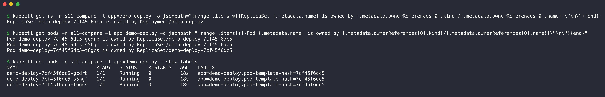

```console
$ kubectl get rs -n s11-compare -l app=demo-deploy -o jsonpath="{range .items[*]}ReplicaSet {.metadata.name} is owned by {.metadata.ownerReferences[0].kind}/{.metadata.ownerReferences[0].name}{\"\n\"}{end}"
ReplicaSet demo-deploy-7cf45f6dc5 is owned by Deployment/demo-deploy

$ kubectl get pods -n s11-compare -l app=demo-deploy -o jsonpath="{range .items[*]}Pod {.metadata.name} is owned by {.metadata.ownerReferences[0].kind}/{.metadata.ownerReferences[0].name}{\"\n\"}{end}"
Pod demo-deploy-7cf45f6dc5-gcdrb is owned by ReplicaSet/demo-deploy-7cf45f6dc5
Pod demo-deploy-7cf45f6dc5-s5hgf is owned by ReplicaSet/demo-deploy-7cf45f6dc5
Pod demo-deploy-7cf45f6dc5-t6gcs is owned by ReplicaSet/demo-deploy-7cf45f6dc5

$ kubectl get pods -n s11-compare -l app=demo-deploy --show-labels
NAME                           READY   STATUS    RESTARTS   AGE   LABELS
demo-deploy-7cf45f6dc5-gcdrb   1/1     Running   0          18s   app=demo-deploy,pod-template-hash=7cf45f6dc5
demo-deploy-7cf45f6dc5-s5hgf   1/1     Running   0          18s   app=demo-deploy,pod-template-hash=7cf45f6dc5
demo-deploy-7cf45f6dc5-t6gcs   1/1     Running   0          18s   app=demo-deploy,pod-template-hash=7cf45f6dc5
```

The chain is Deployment → ReplicaSet → Pod. The Pod names start with the ReplicaSet name. The suffix `7cf45f6dc5` is the `pod-template-hash`.

### Demo 2: rolling update with a Deployment

Before this step, I scaled the Deployment to 5 replicas. Then I changed the image from `nginx:1.26-alpine` to `nginx:1.27-alpine`.

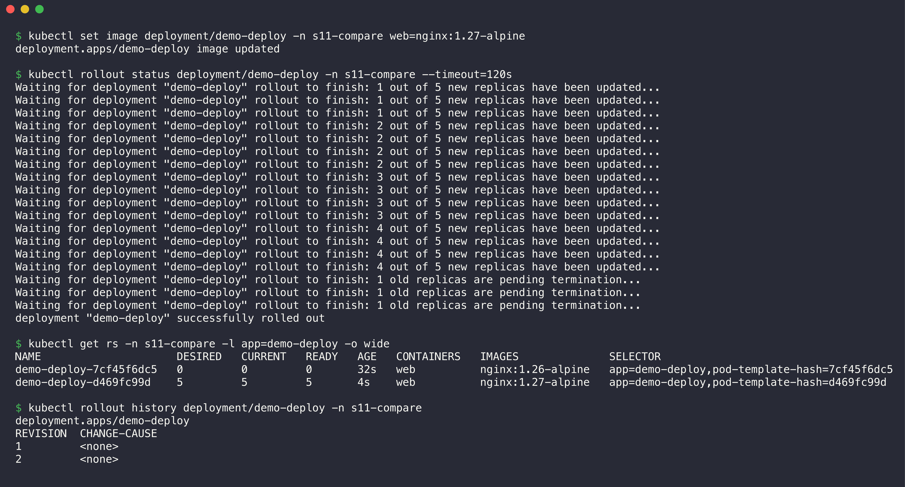

```console
$ kubectl set image deployment/demo-deploy -n s11-compare web=nginx:1.27-alpine
deployment.apps/demo-deploy image updated

$ kubectl rollout status deployment/demo-deploy -n s11-compare --timeout=120s
Waiting for deployment "demo-deploy" rollout to finish: 1 out of 5 new replicas have been updated...
Waiting for deployment "demo-deploy" rollout to finish: 1 out of 5 new replicas have been updated...
Waiting for deployment "demo-deploy" rollout to finish: 1 out of 5 new replicas have been updated...
Waiting for deployment "demo-deploy" rollout to finish: 2 out of 5 new replicas have been updated...
Waiting for deployment "demo-deploy" rollout to finish: 2 out of 5 new replicas have been updated...
Waiting for deployment "demo-deploy" rollout to finish: 2 out of 5 new replicas have been updated...
Waiting for deployment "demo-deploy" rollout to finish: 2 out of 5 new replicas have been updated...
Waiting for deployment "demo-deploy" rollout to finish: 3 out of 5 new replicas have been updated...
Waiting for deployment "demo-deploy" rollout to finish: 3 out of 5 new replicas have been updated...
Waiting for deployment "demo-deploy" rollout to finish: 3 out of 5 new replicas have been updated...
Waiting for deployment "demo-deploy" rollout to finish: 3 out of 5 new replicas have been updated...
Waiting for deployment "demo-deploy" rollout to finish: 4 out of 5 new replicas have been updated...
Waiting for deployment "demo-deploy" rollout to finish: 4 out of 5 new replicas have been updated...
Waiting for deployment "demo-deploy" rollout to finish: 4 out of 5 new replicas have been updated...
Waiting for deployment "demo-deploy" rollout to finish: 4 out of 5 new replicas have been updated...
Waiting for deployment "demo-deploy" rollout to finish: 1 old replicas are pending termination...
Waiting for deployment "demo-deploy" rollout to finish: 1 old replicas are pending termination...
Waiting for deployment "demo-deploy" rollout to finish: 1 old replicas are pending termination...
deployment "demo-deploy" successfully rolled out

$ kubectl get rs -n s11-compare -l app=demo-deploy -o wide
NAME                     DESIRED   CURRENT   READY   AGE   CONTAINERS   IMAGES              SELECTOR
demo-deploy-7cf45f6dc5   0         0         0       32s   web          nginx:1.26-alpine   app=demo-deploy,pod-template-hash=7cf45f6dc5
demo-deploy-d469fc99d    5         5         5       4s    web          nginx:1.27-alpine   app=demo-deploy,pod-template-hash=d469fc99d

$ kubectl rollout history deployment/demo-deploy -n s11-compare
deployment.apps/demo-deploy 
REVISION  CHANGE-CAUSE
1         <none>
2         <none>
```

The Deployment made a second ReplicaSet for the new image. It moved the Pods one at a time (`maxSurge: 1`, `maxUnavailable: 0`). The old ReplicaSet stays with 0 replicas. It is revision 1, the target for `kubectl rollout undo`.

### Demo 3: scaling, and who is in control

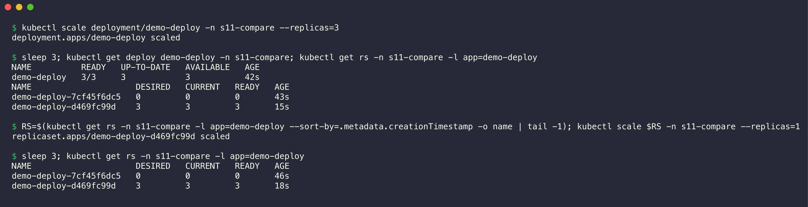

```console
$ kubectl scale deployment/demo-deploy -n s11-compare --replicas=3
deployment.apps/demo-deploy scaled

$ sleep 3; kubectl get deploy demo-deploy -n s11-compare; kubectl get rs -n s11-compare -l app=demo-deploy
NAME          READY   UP-TO-DATE   AVAILABLE   AGE
demo-deploy   3/3     3            3           42s
NAME                     DESIRED   CURRENT   READY   AGE
demo-deploy-7cf45f6dc5   0         0         0       43s
demo-deploy-d469fc99d    3         3         3       15s

$ RS=$(kubectl get rs -n s11-compare -l app=demo-deploy --sort-by=.metadata.creationTimestamp -o name | tail -1); kubectl scale $RS -n s11-compare --replicas=1
replicaset.apps/demo-deploy-d469fc99d scaled

$ sleep 3; kubectl get rs -n s11-compare -l app=demo-deploy
NAME                     DESIRED   CURRENT   READY   AGE
demo-deploy-7cf45f6dc5   0         0         0       46s
demo-deploy-d469fc99d    3         3         3       18s
```

The Deployment scaled its active ReplicaSet to 3. Then I scaled the ReplicaSet directly to 1. The Deployment controller changed it back to 3 within seconds. When a Deployment owns a ReplicaSet, scale the Deployment, not the ReplicaSet.

### Demo 4: a standalone ReplicaSet has no rolling update

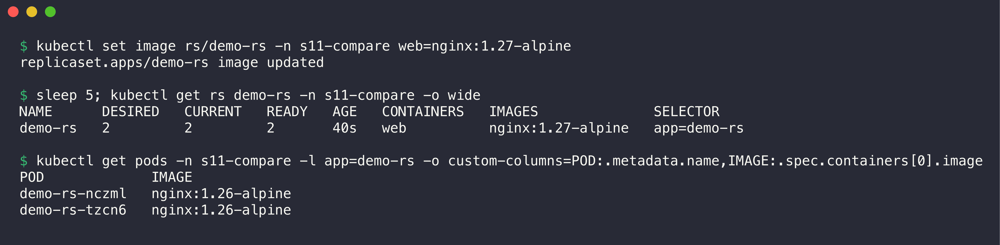

```console
$ kubectl set image rs/demo-rs -n s11-compare web=nginx:1.27-alpine
replicaset.apps/demo-rs image updated

$ sleep 5; kubectl get rs demo-rs -n s11-compare -o wide
NAME      DESIRED   CURRENT   READY   AGE   CONTAINERS   IMAGES              SELECTOR
demo-rs   2         2         2       40s   web          nginx:1.27-alpine   app=demo-rs

$ kubectl get pods -n s11-compare -l app=demo-rs -o custom-columns=POD:.metadata.name,IMAGE:.spec.containers[0].image
POD             IMAGE
demo-rs-nczml   nginx:1.26-alpine
demo-rs-tzcn6   nginx:1.26-alpine
```

The ReplicaSet template now says `nginx:1.27-alpine`, but both Pods still run `nginx:1.26-alpine`. A ReplicaSet only counts Pods. It does not replace Pods that already exist.

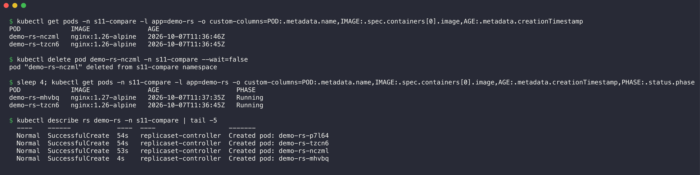

```console
$ kubectl get pods -n s11-compare -l app=demo-rs -o custom-columns=POD:.metadata.name,IMAGE:.spec.containers[0].image,AGE:.metadata.creationTimestamp
POD             IMAGE               AGE
demo-rs-nczml   nginx:1.26-alpine   2026-10-07T11:36:46Z
demo-rs-tzcn6   nginx:1.26-alpine   2026-10-07T11:36:45Z

$ kubectl delete pod demo-rs-nczml -n s11-compare --wait=false
pod "demo-rs-nczml" deleted from s11-compare namespace

$ sleep 4; kubectl get pods -n s11-compare -l app=demo-rs -o custom-columns=POD:.metadata.name,IMAGE:.spec.containers[0].image,AGE:.metadata.creationTimestamp,PHASE:.status.phase
POD             IMAGE               AGE                    PHASE
demo-rs-mhvbq   nginx:1.27-alpine   2026-10-07T11:37:35Z   Running
demo-rs-tzcn6   nginx:1.26-alpine   2026-10-07T11:36:45Z   Running

$ kubectl describe rs demo-rs -n s11-compare | tail -5
  ----    ------            ----  ----                   -------
  Normal  SuccessfulCreate  54s   replicaset-controller  Created pod: demo-rs-p7l64
  Normal  SuccessfulCreate  54s   replicaset-controller  Created pod: demo-rs-tzcn6
  Normal  SuccessfulCreate  53s   replicaset-controller  Created pod: demo-rs-nczml
  Normal  SuccessfulCreate  4s    replicaset-controller  Created pod: demo-rs-mhvbq
```

The ReplicaSet self-heals: it made `demo-rs-mhvbq` to replace the deleted Pod. Only the new Pod got the new image. Now the ReplicaSet runs two different versions. A Deployment prevents this mixed state.

---

## Part 2: Deployment vs DaemonSet vs StatefulSet

| Topic | Deployment | DaemonSet | StatefulSet |
|-------|------------|-----------|-------------|
| Use cases | Stateless apps: web servers, APIs, workers. | One agent on each node: log collectors, monitoring agents, CNI and kube-proxy. | Stateful apps that need a fixed identity: databases, Kafka, ZooKeeper, Elasticsearch. |
| Pod creation | Through a ReplicaSet. Pods are identical, with random names (`demo-deploy-d469fc99d-wb9cg`). Pods start in parallel. | One Pod on each node that matches. When a node joins, the DaemonSet adds a Pod to it. | Ordered names `db-0`, `db-1`. By default, Pod N+1 starts only after Pod N is Ready. Deletion goes in reverse order. |
| Scaling | `replicas`, `kubectl scale`, or an HPA. | No `replicas` field. The number of Pods follows the number of nodes. Use `nodeSelector` or taints to choose nodes. | `replicas`. Scale up adds the next number. Scale down removes the highest number first. |
| Networking | One ClusterIP Service in front of all Pods. Clients do not care which Pod answers. | Often `hostNetwork` or `hostPort`, because the agent works for its node. Can also use a Service. | Needs a headless Service (`serviceName`). Each Pod gets a stable DNS name: `db-0.db.<ns>.svc.cluster.local`. |
| Storage | All Pods share the same volume spec. A shared PVC must support ReadWriteMany. Usually no state. | Often `hostPath`, for example to read `/var/log` of the node. | `volumeClaimTemplates`: one PVC for each Pod (`data-db-0`, `data-db-1`). A restarted Pod gets the same PVC again. |
| Examples | nginx, a REST API, a frontend. | kube-proxy, kindnet, Fluent Bit, node-exporter. | PostgreSQL, MySQL, MongoDB, Redis, Kafka. |

### Demo 5: DaemonSet

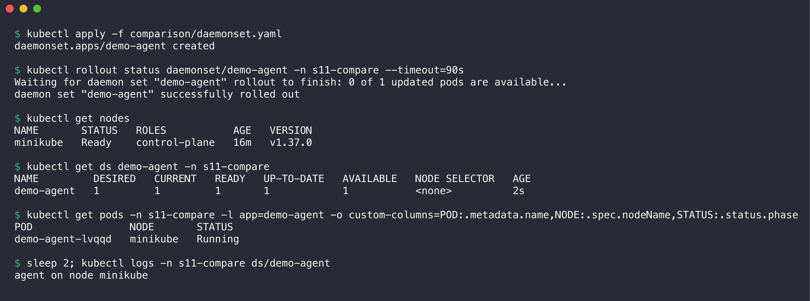

```console
$ kubectl apply -f comparison/daemonset.yaml
daemonset.apps/demo-agent created

$ kubectl rollout status daemonset/demo-agent -n s11-compare --timeout=90s
Waiting for daemon set "demo-agent" rollout to finish: 0 of 1 updated pods are available...
daemon set "demo-agent" successfully rolled out

$ kubectl get nodes
NAME       STATUS   ROLES           AGE   VERSION
minikube   Ready    control-plane   16m   v1.37.0

$ kubectl get ds demo-agent -n s11-compare
NAME         DESIRED   CURRENT   READY   UP-TO-DATE   AVAILABLE   NODE SELECTOR   AGE
demo-agent   1         1         1       1            1           <none>          2s

$ kubectl get pods -n s11-compare -l app=demo-agent -o custom-columns=POD:.metadata.name,NODE:.spec.nodeName,STATUS:.status.phase
POD                NODE       STATUS
demo-agent-lvqqd   minikube   Running

$ sleep 2; kubectl logs -n s11-compare ds/demo-agent
agent on node minikube
```

The cluster has one node, so `DESIRED` is 1. On a cluster with 5 nodes, `DESIRED` would be 5.

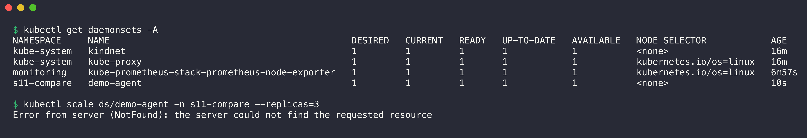

```console
$ kubectl get daemonsets -A
NAMESPACE     NAME                                             DESIRED   CURRENT   READY   UP-TO-DATE   AVAILABLE   NODE SELECTOR            AGE
kube-system   kindnet                                          1         1         1       1            1           <none>                   16m
kube-system   kube-proxy                                       1         1         1       1            1           kubernetes.io/os=linux   16m
monitoring    kube-prometheus-stack-prometheus-node-exporter   1         1         1       1            1           kubernetes.io/os=linux   6m57s
s11-compare   demo-agent                                       1         1         1       1            1           <none>                   10s

$ kubectl scale ds/demo-agent -n s11-compare --replicas=3
Error from server (NotFound): the server could not find the requested resource
```

The cluster already runs real DaemonSets: kube-proxy, the kindnet CNI and the Prometheus node exporter. `kubectl scale` fails on a DaemonSet because a DaemonSet has no `scale` subresource.

### Demo 6: StatefulSet with stable storage

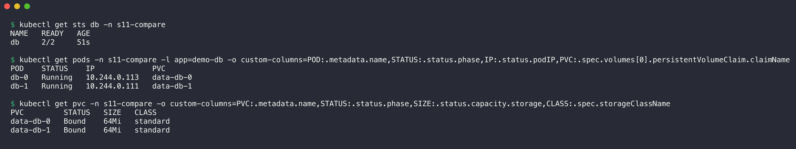

```console
$ kubectl get sts db -n s11-compare
NAME   READY   AGE
db     2/2     51s

$ kubectl get pods -n s11-compare -l app=demo-db -o custom-columns=POD:.metadata.name,STATUS:.status.phase,IP:.status.podIP,PVC:.spec.volumes[0].persistentVolumeClaim.claimName
POD    STATUS    IP             PVC
db-0   Running   10.244.0.113   data-db-0
db-1   Running   10.244.0.111   data-db-1

$ kubectl get pvc -n s11-compare -o custom-columns=PVC:.metadata.name,STATUS:.status.phase,SIZE:.status.capacity.storage,CLASS:.spec.storageClassName
PVC         STATUS   SIZE   CLASS
data-db-0   Bound    64Mi   standard
data-db-1   Bound    64Mi   standard
```

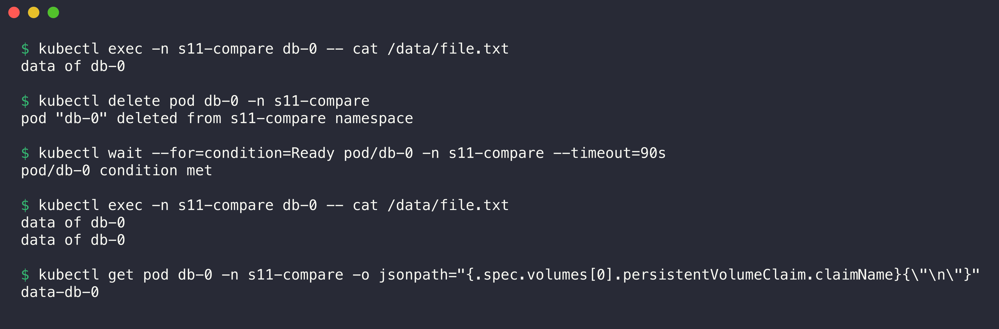

```console
$ kubectl exec -n s11-compare db-0 -- cat /data/file.txt
data of db-0

$ kubectl delete pod db-0 -n s11-compare
pod "db-0" deleted from s11-compare namespace

$ kubectl wait --for=condition=Ready pod/db-0 -n s11-compare --timeout=90s
pod/db-0 condition met

$ kubectl exec -n s11-compare db-0 -- cat /data/file.txt
data of db-0
data of db-0

$ kubectl get pod db-0 -n s11-compare -o jsonpath="{.spec.volumes[0].persistentVolumeClaim.claimName}{\"\n\"}"
data-db-0
```

Each Pod got its own PVC from the template. The container appends one line at each start. After I deleted `db-0`, the new `db-0` mounted the same PVC `data-db-0`. Thus the file has two lines. A Deployment Pod gets a random name and no own PVC, so it cannot keep data this way. The headless Service demo in [Task 1](../README.md#5-headless-service) shows the stable DNS names of StatefulSet Pods.

---

## Part 3: ReplicaSet vs Service

| Topic | ReplicaSet | Service |
|-------|------------|---------|
| Responsibility | Availability: keeps N Pods alive. Replaces Pods that fail or that someone deletes. | Discovery and traffic: gives the Pods one stable name and IP, and spreads traffic over the ready Pods. |
| Type of object | Workload controller (`apps/v1`). It creates Pods. | Network abstraction (`v1`). It creates no Pods. |
| Knows about Pods by | Label selector + `ownerReferences` | Label selector only |
| What changes | Pod names and Pod IPs change at each replacement. | ClusterIP and DNS name stay the same for the life of the Service. |

**Why a Service is required:** a ReplicaSet keeps the Pods alive, but each new Pod gets a new IP address. Clients cannot follow these changes. A Service gives a fixed virtual IP and a DNS name. It also tracks which Pods are Ready, so traffic goes only to healthy Pods. Without a Service, every client must find and update Pod IPs itself.

**How traffic reaches the Pods:**

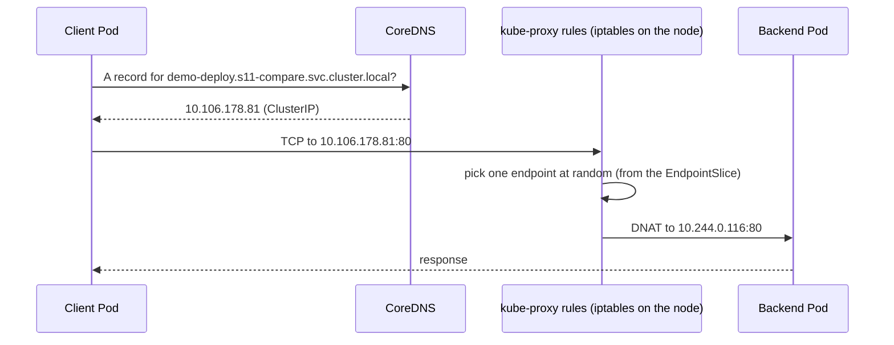

1. The EndpointSlice controller watches the Pods that match the Service selector. It writes the IPs of the Ready Pods into an EndpointSlice.
2. CoreDNS maps the Service name to the ClusterIP.
3. kube-proxy on each node watches Services and EndpointSlices. It writes iptables rules that change (DNAT) the ClusterIP to one Pod IP.
4. The packet goes to the Pod through the CNI network (kindnet here).

### Demo 7: the Service IP stays, the Pod IPs change

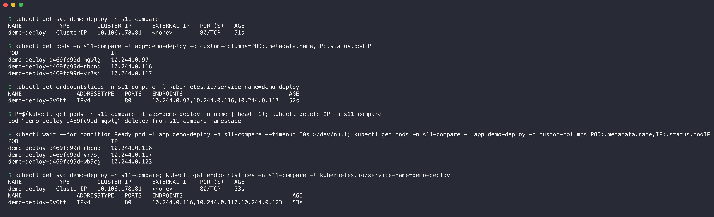

```console
$ kubectl get svc demo-deploy -n s11-compare
NAME          TYPE        CLUSTER-IP      EXTERNAL-IP   PORT(S)   AGE
demo-deploy   ClusterIP   10.106.178.81   <none>        80/TCP    51s

$ kubectl get pods -n s11-compare -l app=demo-deploy -o custom-columns=POD:.metadata.name,IP:.status.podIP
POD                           IP
demo-deploy-d469fc99d-mgwlg   10.244.0.97
demo-deploy-d469fc99d-nbbnq   10.244.0.116
demo-deploy-d469fc99d-vr7sj   10.244.0.117

$ kubectl get endpointslices -n s11-compare -l kubernetes.io/service-name=demo-deploy
NAME                ADDRESSTYPE   PORTS   ENDPOINTS                               AGE
demo-deploy-5v6ht   IPv4          80      10.244.0.97,10.244.0.116,10.244.0.117   52s

$ P=$(kubectl get pods -n s11-compare -l app=demo-deploy -o name | head -1); kubectl delete $P -n s11-compare
pod "demo-deploy-d469fc99d-mgwlg" deleted from s11-compare namespace

$ kubectl wait --for=condition=Ready pod -l app=demo-deploy -n s11-compare --timeout=60s >/dev/null; kubectl get pods -n s11-compare -l app=demo-deploy -o custom-columns=POD:.metadata.name,IP:.status.podIP
POD                           IP
demo-deploy-d469fc99d-nbbnq   10.244.0.116
demo-deploy-d469fc99d-vr7sj   10.244.0.117
demo-deploy-d469fc99d-wb9cg   10.244.0.123

$ kubectl get svc demo-deploy -n s11-compare; kubectl get endpointslices -n s11-compare -l kubernetes.io/service-name=demo-deploy
NAME          TYPE        CLUSTER-IP      EXTERNAL-IP   PORT(S)   AGE
demo-deploy   ClusterIP   10.106.178.81   <none>        80/TCP    53s
NAME                ADDRESSTYPE   PORTS   ENDPOINTS                                AGE
demo-deploy-5v6ht   IPv4          80      10.244.0.116,10.244.0.117,10.244.0.123   53s
```

The ReplicaSet replaced the deleted Pod with a new Pod at `10.244.0.123`. The EndpointSlice changed from `.97` to `.123` by itself. The Service IP `10.106.178.81` did not change. This shows the two jobs: the ReplicaSet keeps the Pods, and the Service keeps the address.

### Demo 8: the kube-proxy rules on the node

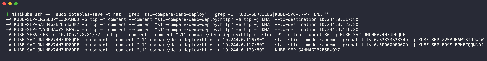

```console
$ minikube ssh -- "sudo iptables-save -t nat | grep 's11-compare/demo-deploy' | grep -E 'KUBE-SERVICES|KUBE-SVC-.*-> |DNAT'"
-A KUBE-SEP-ERSSLBPMEZQQNNDJ -p tcp -m comment --comment "s11-compare/demo-deploy:http" -m tcp -j DNAT --to-destination 10.244.0.117:80
-A KUBE-SEP-SAHH4G2B2B5BWQMZ -p tcp -m comment --comment "s11-compare/demo-deploy:http" -m tcp -j DNAT --to-destination 10.244.0.123:80
-A KUBE-SEP-ZV5BUHAWYSTRPWJW -p tcp -m comment --comment "s11-compare/demo-deploy:http" -m tcp -j DNAT --to-destination 10.244.0.116:80
-A KUBE-SERVICES -d 10.106.178.81/32 -p tcp -m comment --comment "s11-compare/demo-deploy:http cluster IP" -m tcp --dport 80 -j KUBE-SVC-JNUHEV74HZUD6QDF
-A KUBE-SVC-JNUHEV74HZUD6QDF -m comment --comment "s11-compare/demo-deploy:http -> 10.244.0.116:80" -m statistic --mode random --probability 0.33333333349 -j KUBE-SEP-ZV5BUHAWYSTRPWJW
-A KUBE-SVC-JNUHEV74HZUD6QDF -m comment --comment "s11-compare/demo-deploy:http -> 10.244.0.117:80" -m statistic --mode random --probability 0.50000000000 -j KUBE-SEP-ERSSLBPMEZQQNNDJ
-A KUBE-SVC-JNUHEV74HZUD6QDF -m comment --comment "s11-compare/demo-deploy:http -> 10.244.0.123:80" -j KUBE-SEP-SAHH4G2B2B5BWQMZ
```

- `KUBE-SERVICES` catches packets to the ClusterIP `10.106.178.81:80`.
- `KUBE-SVC-...` picks one endpoint at random: 1/3 for the first, then 1/2 of the rest, then the last one. Each Pod gets one third of the connections.
- `KUBE-SEP-...` does the DNAT to the Pod IP. The new Pod `10.244.0.123` is already in the rules.

## Cleanup

```bash
kubectl delete namespace s11-compare
```
