# Task 4: CoreDNS

This README explains CoreDNS, the DNS server of Kubernetes. All inspection of CoreDNS is read-only: I did not change the CoreDNS Deployment or its ConfigMap. The drills use two intentionally broken files in this folder:

- [broken-service.yaml](broken-service.yaml): a Service with a selector that matches no Pod.
- [dnspolicy-pod.yaml](dnspolicy-pod.yaml): a Pod with `dnsPolicy: Default`.

---

## 1. What is CoreDNS?

CoreDNS is a small, flexible DNS server written in Go. It is a graduated project of the CNCF. Its design is a chain of plugins: each plugin does one job (for example `kubernetes`, `cache`, `forward`, `log`). The configuration file is the `Corefile`.

In a Kubernetes cluster, CoreDNS runs as a normal Deployment in `kube-system`. A Service named `kube-dns` gives it a fixed ClusterIP.

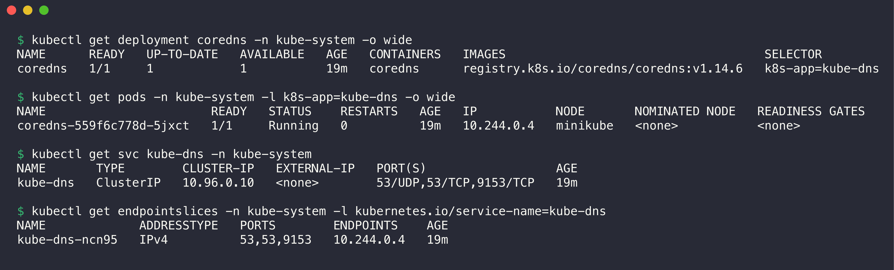

```console
$ kubectl get deployment coredns -n kube-system -o wide
NAME      READY   UP-TO-DATE   AVAILABLE   AGE   CONTAINERS   IMAGES                                    SELECTOR
coredns   1/1     1            1           19m   coredns      registry.k8s.io/coredns/coredns:v1.14.6   k8s-app=kube-dns

$ kubectl get pods -n kube-system -l k8s-app=kube-dns -o wide
NAME                       READY   STATUS    RESTARTS   AGE   IP           NODE       NOMINATED NODE   READINESS GATES
coredns-559f6c778d-5jxct   1/1     Running   0          19m   10.244.0.4   minikube   <none>           <none>

$ kubectl get svc kube-dns -n kube-system
NAME       TYPE        CLUSTER-IP   EXTERNAL-IP   PORT(S)                  AGE
kube-dns   ClusterIP   10.96.0.10   <none>        53/UDP,53/TCP,9153/TCP   19m

$ kubectl get endpointslices -n kube-system -l kubernetes.io/service-name=kube-dns
NAME             ADDRESSTYPE   PORTS        ENDPOINTS    AGE
kube-dns-ncn95   IPv4          53,53,9153   10.244.0.4   19m
```

- The Service keeps the old name `kube-dns` for compatibility. The Pods run CoreDNS v1.14.6.
- Port 53 (UDP and TCP) is DNS. Port 9153 is the Prometheus metrics endpoint.
- `10.96.0.10` is the same IP as the `nameserver` line in every Pod.

## 2. Why Kubernetes uses CoreDNS

- **Dynamic records.** Pods and Services change all the time. CoreDNS watches the Kubernetes API and updates its answers at once. A static zone file cannot do this.
- **Service discovery by name.** Applications use names like `api.s11-backend`. They do not need to know any IP.
- **Plugins.** Caching, forwarding, metrics, health checks, rewrites and stub domains are plugins. You can add them in the Corefile without code changes.
- **Small and fast.** One Go binary with a small memory footprint. It scales as a normal Deployment.
- **Default since Kubernetes 1.13.** CoreDNS replaced kube-dns (dnsmasq + sidecars). kube-dns had several containers and was harder to extend.

## 3. How Service discovery works

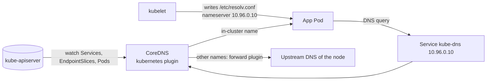

1. You create a Service. The API server stores it, and the EndpointSlice controller lists its ready Pods.
2. The `kubernetes` plugin of CoreDNS watches Services, EndpointSlices and Pods through the API. It keeps the data in memory.
3. The kubelet starts each Pod with `/etc/resolv.conf` that points to `10.96.0.10` (when `dnsPolicy` is `ClusterFirst`, the default).
4. The application asks for a name. CoreDNS answers from memory: the ClusterIP, the Pod IPs for a headless Service, or a CNAME for ExternalName.

The demos in [Task 1](../README.md) and [Task 3](../fqdn/README.md) show all these record types.

## 4. How DNS queries are resolved

The resolver in the Pod reads `/etc/resolv.conf`:

```text
search s11-services.svc.cluster.local svc.cluster.local cluster.local
nameserver 10.96.0.10
options ndots:5
```

If a name has fewer than 5 dots, the resolver tries each search suffix first. It tries the name as typed only at the end. The Corefile of this cluster has the `log` plugin, so CoreDNS logs every query. The log shows this order for one lookup of `kubernetes.io`:

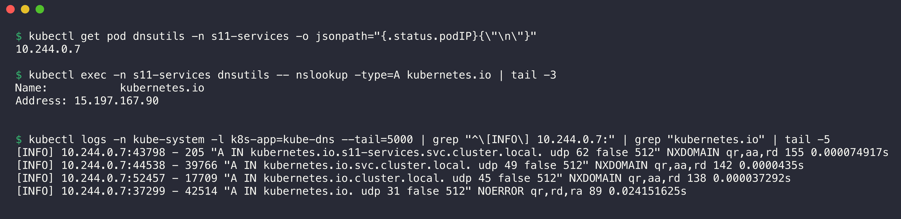

```console
$ kubectl get pod dnsutils -n s11-services -o jsonpath="{.status.podIP}{\"\n\"}"
10.244.0.7

$ kubectl exec -n s11-services dnsutils -- nslookup -type=A kubernetes.io | tail -3
Name:	kubernetes.io
Address: 15.197.167.90


$ kubectl logs -n kube-system -l k8s-app=kube-dns --tail=5000 | grep "^\[INFO\] 10.244.0.7:" | grep "kubernetes.io" | tail -5
[INFO] 10.244.0.7:43798 - 205 "A IN kubernetes.io.s11-services.svc.cluster.local. udp 62 false 512" NXDOMAIN qr,aa,rd 155 0.000074917s
[INFO] 10.244.0.7:44538 - 39766 "A IN kubernetes.io.svc.cluster.local. udp 49 false 512" NXDOMAIN qr,aa,rd 142 0.0000435s
[INFO] 10.244.0.7:52457 - 17709 "A IN kubernetes.io.cluster.local. udp 45 false 512" NXDOMAIN qr,aa,rd 138 0.000037292s
[INFO] 10.244.0.7:37299 - 42514 "A IN kubernetes.io. udp 31 false 512" NOERROR qr,rd,ra 89 0.024151625s
```

Step by step:

1. `kubernetes.io` has one dot, which is fewer than 5. The resolver adds the first suffix.
2. CoreDNS answers the three `cluster.local` names itself with `NXDOMAIN`. The flag `aa` means "authoritative answer". Each answer takes about 0.04 ms.
3. The last query `kubernetes.io.` is not in `cluster.local`. The `forward` plugin sends it to the upstream DNS server. The answer takes 24 ms and has the flag `ra` (recursion available).

Thus one external name costs four queries. To avoid this, use an FQDN with a final dot (`kubernetes.io.`), or set a lower `ndots` in the Pod `dnsConfig`.

## 5. CoreDNS configuration

The Corefile is in the ConfigMap `coredns` in `kube-system`:

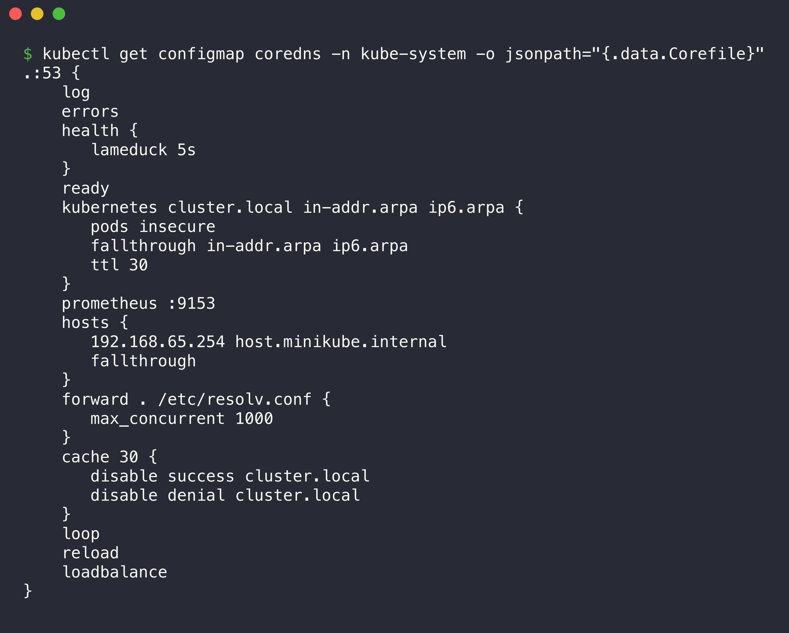

```console
$ kubectl get configmap coredns -n kube-system -o jsonpath="{.data.Corefile}"
.:53 {
    log
    errors
    health {
       lameduck 5s
    }
    ready
    kubernetes cluster.local in-addr.arpa ip6.arpa {
       pods insecure
       fallthrough in-addr.arpa ip6.arpa
       ttl 30
    }
    prometheus :9153
    hosts {
       192.168.65.254 host.minikube.internal
       fallthrough
    }
    forward . /etc/resolv.conf {
       max_concurrent 1000
    }
    cache 30 {
       disable success cluster.local
       disable denial cluster.local
    }
    loop
    reload
    loadbalance
}
```

| Line | What it does |
|------|--------------|
| `.:53` | One server block for all zones (`.`) on port 53. |
| `log` | Logs every query. minikube adds it. Most clusters do not enable it, because it makes a lot of log data. |
| `errors` | Logs errors. |
| `health { lameduck 5s }` | HTTP `/health` on port 8080 for the liveness probe. At shutdown, it waits 5 s before it stops. |
| `ready` | HTTP `/ready` on port 8181 for the readiness probe. |
| `kubernetes cluster.local in-addr.arpa ip6.arpa` | Answers names in `cluster.local` and reverse lookups from the Kubernetes API. |
| `pods insecure` | Makes the `<ip-with-dashes>.<ns>.pod.cluster.local` records. It does not check that the Pod exists. |
| `fallthrough in-addr.arpa ip6.arpa` | If a reverse lookup is not a cluster IP, pass it to the next plugin. |
| `ttl 30` | Records live 30 seconds in client caches. |
| `prometheus :9153` | Metrics for Prometheus. |
| `hosts { ... }` | Static entry for `host.minikube.internal` (the Docker host). minikube adds it. |
| `forward . /etc/resolv.conf` | Sends all other names to the upstream servers of the node. |
| `cache 30` | Caches answers for up to 30 s. Here it does not cache `cluster.local` answers. |
| `loop` | Detects a forwarding loop and stops CoreDNS if it finds one. |
| `reload` | Reloads the Corefile when the ConfigMap changes. No restart is necessary. |
| `loadbalance` | Shuffles the order of `A` records in each answer (round robin). |

To change the configuration, edit the ConfigMap (for example to add a stub domain for `corp.internal`). The `reload` plugin applies it after about 30 seconds. I did not change it in this shared cluster.

## 6. How to troubleshoot DNS issues

Use these steps in order:

1. Make sure that the application error is a DNS error (`Could not resolve host`, `NXDOMAIN`, `server can't find`).
2. Examine `/etc/resolv.conf` in the Pod.
3. Test the name with `nslookup` or `dig` from a debug Pod in the same namespace.
4. Make sure that the Service exists, in the correct namespace, with the correct name.
5. Make sure that the Service has endpoints.
6. Make sure that CoreDNS is healthy: Pods, logs, `/health`, `/ready`, metrics.

### Drill 1: wrong Service name

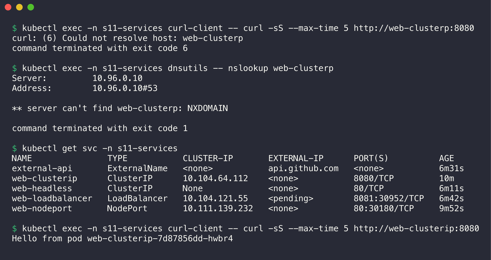

```console
$ kubectl exec -n s11-services curl-client -- curl -sS --max-time 5 http://web-clusterp:8080
curl: (6) Could not resolve host: web-clusterp
command terminated with exit code 6

$ kubectl exec -n s11-services dnsutils -- nslookup web-clusterp
Server:		10.96.0.10
Address:	10.96.0.10#53

** server can't find web-clusterp: NXDOMAIN

command terminated with exit code 1

$ kubectl get svc -n s11-services
NAME               TYPE           CLUSTER-IP       EXTERNAL-IP      PORT(S)          AGE
external-api       ExternalName   <none>           api.github.com   <none>           6m31s
web-clusterip      ClusterIP      10.104.64.112    <none>           8080/TCP         10m
web-headless       ClusterIP      None             <none>           80/TCP           6m11s
web-loadbalancer   LoadBalancer   10.104.121.55    <pending>        8081:30952/TCP   6m42s
web-nodeport       NodePort       10.111.139.232   <none>           80:30180/TCP     9m52s

$ kubectl exec -n s11-services curl-client -- curl -sS --max-time 5 http://web-clusterip:8080
Hello from pod web-clusterip-7d87856dd-hwbr4
```

- **Symptom:** curl exit code 6, `Could not resolve host`.
- **Root cause:** a typo. The name is `web-clusterp`, but the Service is `web-clusterip`.
- **Fix:** use the correct name from `kubectl get svc`.

### Drill 2: wrong namespace

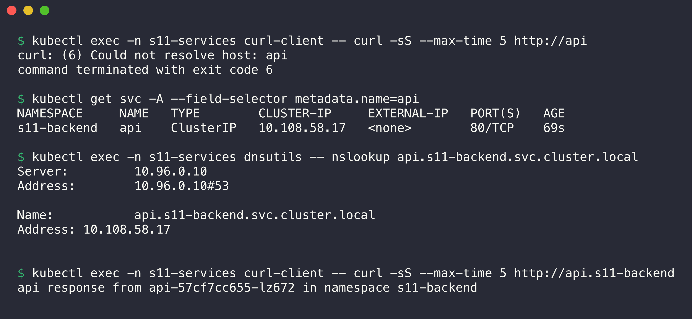

```console
$ kubectl exec -n s11-services curl-client -- curl -sS --max-time 5 http://api
curl: (6) Could not resolve host: api
command terminated with exit code 6

$ kubectl get svc -A --field-selector metadata.name=api
NAMESPACE     NAME   TYPE        CLUSTER-IP     EXTERNAL-IP   PORT(S)   AGE
s11-backend   api    ClusterIP   10.108.58.17   <none>        80/TCP    69s

$ kubectl exec -n s11-services dnsutils -- nslookup api.s11-backend.svc.cluster.local
Server:		10.96.0.10
Address:	10.96.0.10#53

Name:	api.s11-backend.svc.cluster.local
Address: 10.108.58.17


$ kubectl exec -n s11-services curl-client -- curl -sS --max-time 5 http://api.s11-backend
api response from api-57cf7cc655-lz672 in namespace s11-backend
```

- **Symptom:** the short name `api` does not resolve from `s11-services`.
- **Root cause:** the Service is in `s11-backend`. The short name only searches the namespace of the client Pod.
- **Fix:** use `api.s11-backend` or the full FQDN.

### Drill 3: DNS works, but the Service has no endpoints

File: [broken-service.yaml](broken-service.yaml)

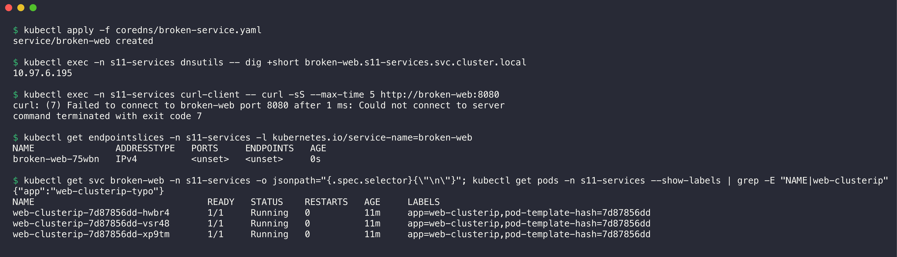

```console
$ kubectl apply -f coredns/broken-service.yaml
service/broken-web created

$ kubectl exec -n s11-services dnsutils -- dig +short broken-web.s11-services.svc.cluster.local
10.97.6.195

$ kubectl exec -n s11-services curl-client -- curl -sS --max-time 5 http://broken-web:8080
curl: (7) Failed to connect to broken-web port 8080 after 1 ms: Could not connect to server
command terminated with exit code 7

$ kubectl get endpointslices -n s11-services -l kubernetes.io/service-name=broken-web
NAME               ADDRESSTYPE   PORTS     ENDPOINTS   AGE
broken-web-75wbn   IPv4          <unset>   <unset>     0s

$ kubectl get svc broken-web -n s11-services -o jsonpath="{.spec.selector}{\"\n\"}"; kubectl get pods -n s11-services --show-labels | grep -E "NAME|web-clusterip"
{"app":"web-clusterip-typo"}
NAME                                READY   STATUS    RESTARTS   AGE     LABELS
web-clusterip-7d87856dd-hwbr4       1/1     Running   0          11m     app=web-clusterip,pod-template-hash=7d87856dd
web-clusterip-7d87856dd-vsr48       1/1     Running   0          11m     app=web-clusterip,pod-template-hash=7d87856dd
web-clusterip-7d87856dd-xp9tm       1/1     Running   0          11m     app=web-clusterip,pod-template-hash=7d87856dd
```

- **Symptom:** the name resolves to a ClusterIP, but the connection fails (curl exit code 7).
- **Analysis:** DNS is not the problem. The EndpointSlice is empty.
- **Root cause:** the selector `app: web-clusterip-typo` matches no Pod. The Pods have `app=web-clusterip`.

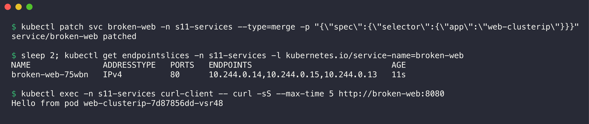

```console
$ kubectl patch svc broken-web -n s11-services --type=merge -p "{\"spec\":{\"selector\":{\"app\":\"web-clusterip\"}}}"
service/broken-web patched

$ sleep 2; kubectl get endpointslices -n s11-services -l kubernetes.io/service-name=broken-web
NAME               ADDRESSTYPE   PORTS   ENDPOINTS                             AGE
broken-web-75wbn   IPv4          80      10.244.0.14,10.244.0.15,10.244.0.13   11s

$ kubectl exec -n s11-services curl-client -- curl -sS --max-time 5 http://broken-web:8080
Hello from pod web-clusterip-7d87856dd-vsr48
```

- **Fix:** correct the selector. The EndpointSlice now has three Pods, and curl works.

### Drill 4: a Pod that does not use CoreDNS

File: [dnspolicy-pod.yaml](dnspolicy-pod.yaml)

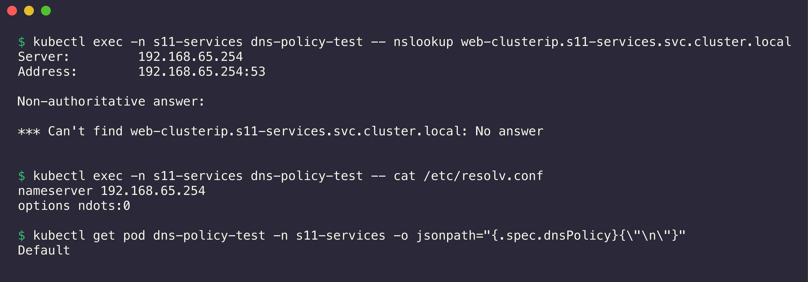

```console
$ kubectl exec -n s11-services dns-policy-test -- nslookup web-clusterip.s11-services.svc.cluster.local
Server:		192.168.65.254
Address:	192.168.65.254:53

Non-authoritative answer:

*** Can't find web-clusterip.s11-services.svc.cluster.local: No answer


$ kubectl exec -n s11-services dns-policy-test -- cat /etc/resolv.conf
nameserver 192.168.65.254
options ndots:0

$ kubectl get pod dns-policy-test -n s11-services -o jsonpath="{.spec.dnsPolicy}{\"\n\"}"
Default
```

- **Symptom:** even the full Service FQDN does not resolve.
- **Analysis:** the server in the answer is `192.168.65.254`, not `10.96.0.10`. The `resolv.conf` has no `search` line.
- **Root cause:** `dnsPolicy: Default` means "use the DNS of the node", not "the default policy". The node DNS server does not know `cluster.local`.

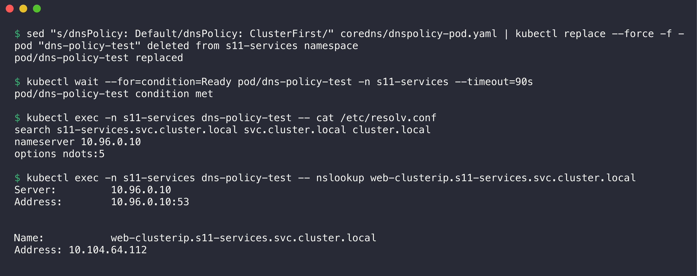

```console
$ sed "s/dnsPolicy: Default/dnsPolicy: ClusterFirst/" coredns/dnspolicy-pod.yaml | kubectl replace --force -f -
pod "dns-policy-test" deleted from s11-services namespace
pod/dns-policy-test replaced

$ kubectl wait --for=condition=Ready pod/dns-policy-test -n s11-services --timeout=90s
pod/dns-policy-test condition met

$ kubectl exec -n s11-services dns-policy-test -- cat /etc/resolv.conf
search s11-services.svc.cluster.local svc.cluster.local cluster.local
nameserver 10.96.0.10
options ndots:5

$ kubectl exec -n s11-services dns-policy-test -- nslookup web-clusterip.s11-services.svc.cluster.local
Server:		10.96.0.10
Address:	10.96.0.10:53


Name:	web-clusterip.s11-services.svc.cluster.local
Address: 10.104.64.112
```

- **Fix:** set `dnsPolicy: ClusterFirst` (or remove the line). The Pod spec field is immutable, so `kubectl replace --force` recreates the Pod.

### Check the health of CoreDNS

If many Pods have DNS problems at the same time, examine CoreDNS itself:

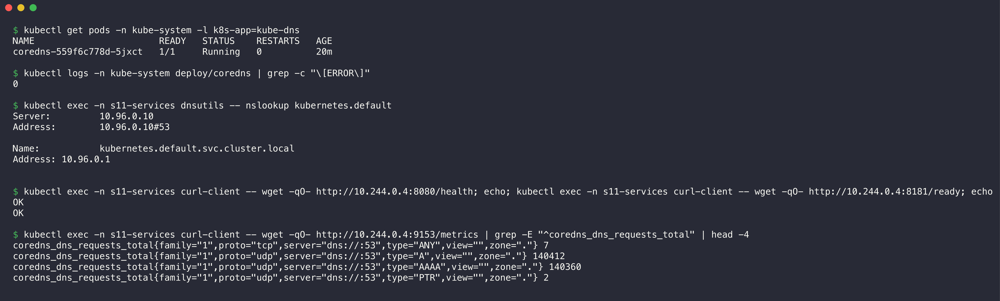

```console
$ kubectl get pods -n kube-system -l k8s-app=kube-dns
NAME                       READY   STATUS    RESTARTS   AGE
coredns-559f6c778d-5jxct   1/1     Running   0          20m

$ kubectl logs -n kube-system deploy/coredns | grep -c "\[ERROR\]"
0

$ kubectl exec -n s11-services dnsutils -- nslookup kubernetes.default
Server:		10.96.0.10
Address:	10.96.0.10#53

Name:	kubernetes.default.svc.cluster.local
Address: 10.96.0.1


$ kubectl exec -n s11-services curl-client -- wget -qO- http://10.244.0.4:8080/health; echo; kubectl exec -n s11-services curl-client -- wget -qO- http://10.244.0.4:8181/ready; echo
OK
OK

$ kubectl exec -n s11-services curl-client -- wget -qO- http://10.244.0.4:9153/metrics | grep -E "^coredns_dns_requests_total" | head -4
coredns_dns_requests_total{family="1",proto="tcp",server="dns://:53",type="ANY",view="",zone="."} 7
coredns_dns_requests_total{family="1",proto="udp",server="dns://:53",type="A",view="",zone="."} 140412
coredns_dns_requests_total{family="1",proto="udp",server="dns://:53",type="AAAA",view="",zone="."} 140360
coredns_dns_requests_total{family="1",proto="udp",server="dns://:53",type="PTR",view="",zone="."} 2
```

The CoreDNS Pod is `Running`, the log has no errors, and `kubernetes.default` resolves. `/health` and `/ready` return `OK`. The metrics show many queries, because other workloads in the cluster also use DNS.

### DNS troubleshooting checklist

| Symptom | Command | Possible cause |
|---------|---------|----------------|
| `NXDOMAIN` for a short name | `kubectl get svc -A \| grep <name>` | Typo, or the Service is in another namespace |
| Name resolves, connection fails | `kubectl get endpointslices -l kubernetes.io/service-name=<svc>` | Selector does not match, Pods not Ready, wrong `targetPort` |
| No cluster name resolves in one Pod | `cat /etc/resolv.conf` in the Pod | `dnsPolicy: Default`, or a custom `dnsConfig` |
| No cluster name resolves in any Pod | `kubectl get pods -n kube-system -l k8s-app=kube-dns`, `kubectl logs` | CoreDNS down, Corefile error, `loop` plugin stopped CoreDNS |
| External names fail, cluster names work | CoreDNS logs, `forward` line | Upstream DNS of the node does not work |
| Slow lookups of external names | CoreDNS query log | `ndots:5` search expansion. Use an FQDN with a final dot. |
