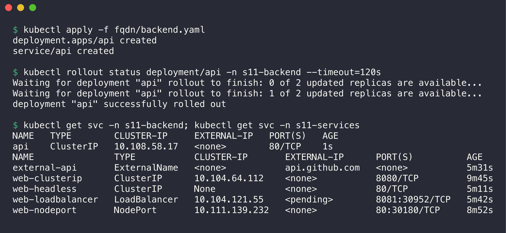
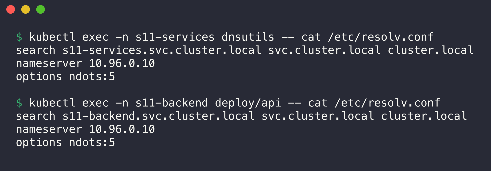
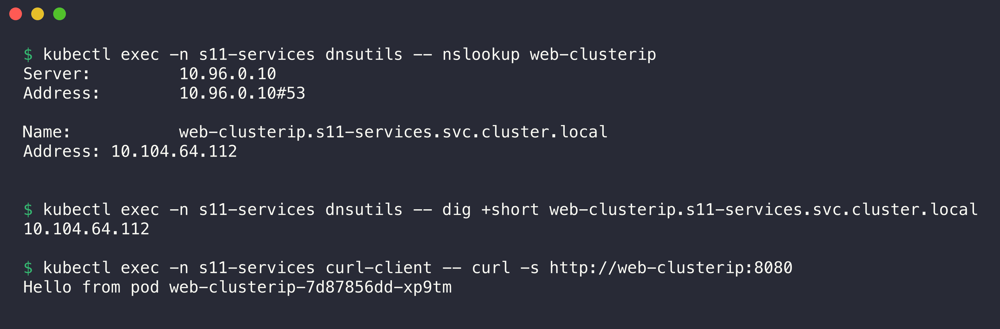
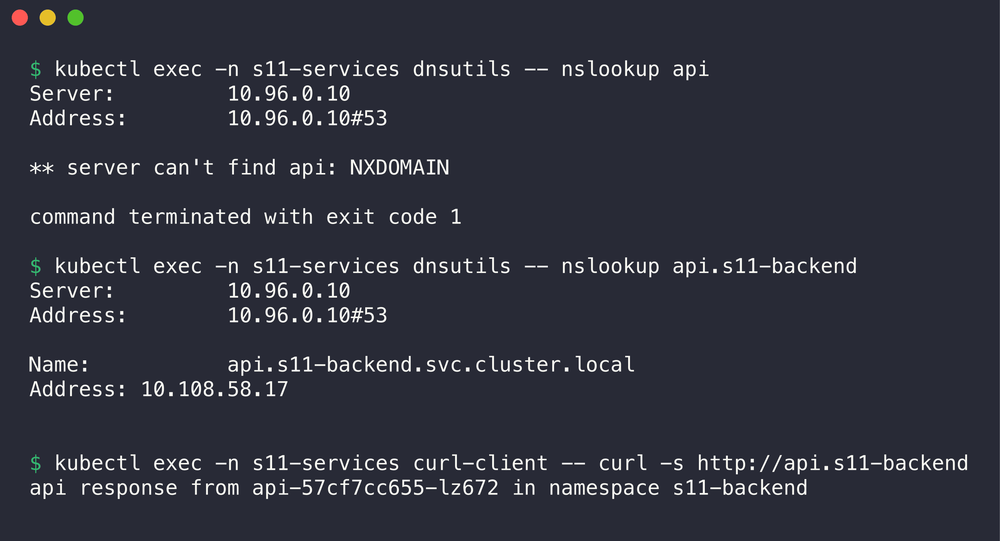
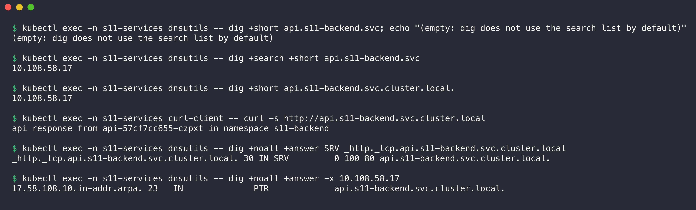
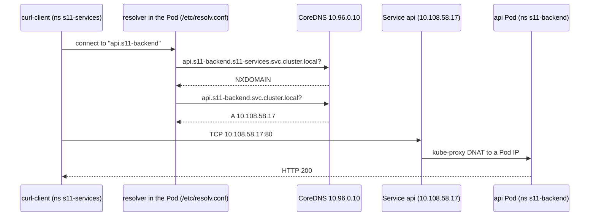
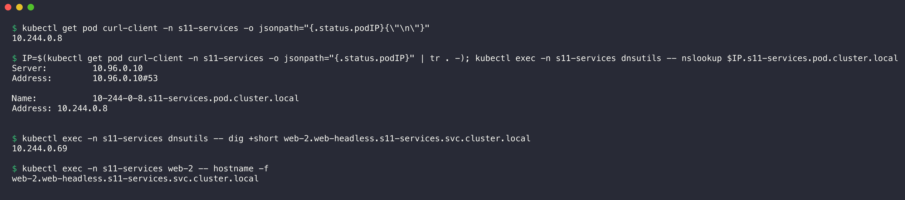

# Task 3: FQDN

This README explains fully qualified domain names (FQDNs) in Kubernetes. All output comes from Pods in the minikube cluster. The test Pods are `dnsutils` (with `dig` and `nslookup`) and `curl-client`, both in the namespace `s11-services`. A second namespace, `s11-backend`, holds the Service `api` for the cross-namespace tests ([backend.yaml](backend.yaml)).



```console
$ kubectl apply -f fqdn/backend.yaml
deployment.apps/api created
service/api created

$ kubectl rollout status deployment/api -n s11-backend --timeout=120s
Waiting for deployment "api" rollout to finish: 0 of 2 updated replicas are available...
Waiting for deployment "api" rollout to finish: 1 of 2 updated replicas are available...
deployment "api" successfully rolled out

$ kubectl get svc -n s11-backend; kubectl get svc -n s11-services
NAME   TYPE        CLUSTER-IP     EXTERNAL-IP   PORT(S)   AGE
api    ClusterIP   10.108.58.17   <none>        80/TCP    1s
NAME               TYPE           CLUSTER-IP       EXTERNAL-IP      PORT(S)          AGE
external-api       ExternalName   <none>           api.github.com   <none>           5m31s
web-clusterip      ClusterIP      10.104.64.112    <none>           8080/TCP         9m45s
web-headless       ClusterIP      None             <none>           80/TCP           5m11s
web-loadbalancer   LoadBalancer   10.104.121.55    <pending>        8081:30952/TCP   5m42s
web-nodeport       NodePort       10.111.139.232   <none>           80:30180/TCP     8m52s
```

---

## 1. What is FQDN?

A fully qualified domain name is the complete name of a host in the DNS tree. It includes every label from the host up to the root. The root is the empty label at the end, written as a final dot.

```text
www.example.com.
 |     |     |  └── root (the final dot)
 |     |     └───── top-level domain
 |     └─────────── second-level domain
 └───────────────── host
```

- An FQDN has only one meaning. The resolver does not add anything to it.
- A short name (for example `api`) is a relative name. The resolver adds suffixes from the `search` list until a name resolves.
- In practice, people often write an FQDN without the final dot. A name with the final dot is always absolute.

## 2. Kubernetes Service DNS

Kubernetes runs a DNS server in the cluster (CoreDNS, see [Task 4](../coredns/README.md)). Each Service gets DNS records automatically when you create it:

| Service type | Record for `<svc>.<ns>.svc.cluster.local` |
|--------------|-------------------------------------------|
| ClusterIP, NodePort, LoadBalancer | `A` record → the ClusterIP |
| Headless (`clusterIP: None`) | One `A` record for each ready Pod IP |
| ExternalName | `CNAME` → the external name |
| Any Service with named ports | `SRV` record `_<port>._<proto>.<svc>.<ns>.svc.cluster.local` |

The kubelet configures every Pod to use this DNS server. It writes `/etc/resolv.conf` in the Pod:



```console
$ kubectl exec -n s11-services dnsutils -- cat /etc/resolv.conf
search s11-services.svc.cluster.local svc.cluster.local cluster.local
nameserver 10.96.0.10
options ndots:5

$ kubectl exec -n s11-backend deploy/api -- cat /etc/resolv.conf
search s11-backend.svc.cluster.local svc.cluster.local cluster.local
nameserver 10.96.0.10
options ndots:5
```

- `nameserver 10.96.0.10` is the ClusterIP of the `kube-dns` Service, which points to CoreDNS.
- `search` is a list of suffixes. The first suffix is the namespace of the Pod. Thus the two Pods have different search lists.
- `ndots:5` means: if a name has fewer than 5 dots, the resolver tries the search suffixes first.

## 3. Kubernetes DNS naming convention

```text
<service>.<namespace>.svc.<cluster-domain>
   api   . s11-backend .svc. cluster.local
```

| Object | DNS name format |
|--------|-----------------|
| Service | `<service>.<namespace>.svc.cluster.local` |
| Pod of a headless Service / StatefulSet | `<pod-hostname>.<service>.<namespace>.svc.cluster.local` |
| Any Pod (by IP) | `<ip-with-dashes>.<namespace>.pod.cluster.local` |
| Named port (SRV) | `_<port-name>._<protocol>.<service>.<namespace>.svc.cluster.local` |
| Reverse lookup (PTR) | `<reversed-ip>.in-addr.arpa` → Service name |

`cluster.local` is the default cluster domain. An administrator can change it in the kubelet and CoreDNS configuration.

## 4. Namespace-based DNS

The namespace is part of every Service name. Thus two Services with the same name in different namespaces do not collide. The search list decides which short names work.

### Same namespace: the short name works



```console
$ kubectl exec -n s11-services dnsutils -- nslookup web-clusterip
Server:		10.96.0.10
Address:	10.96.0.10#53

Name:	web-clusterip.s11-services.svc.cluster.local
Address: 10.104.64.112


$ kubectl exec -n s11-services dnsutils -- dig +short web-clusterip.s11-services.svc.cluster.local
10.104.64.112

$ kubectl exec -n s11-services curl-client -- curl -s http://web-clusterip:8080
Hello from pod web-clusterip-7d87856dd-xp9tm
```

The resolver added the first search suffix `s11-services.svc.cluster.local` to `web-clusterip` and found the Service.

### Other namespace: add the namespace



```console
$ kubectl exec -n s11-services dnsutils -- nslookup api
Server:		10.96.0.10
Address:	10.96.0.10#53

** server can't find api: NXDOMAIN

command terminated with exit code 1

$ kubectl exec -n s11-services dnsutils -- nslookup api.s11-backend
Server:		10.96.0.10
Address:	10.96.0.10#53

Name:	api.s11-backend.svc.cluster.local
Address: 10.108.58.17


$ kubectl exec -n s11-services curl-client -- curl -s http://api.s11-backend
api response from api-57cf7cc655-lz672 in namespace s11-backend
```

- `api` fails from `s11-services`. The resolver tried `api.s11-services.svc.cluster.local` and the other suffixes, but no Service `api` exists in `s11-services`.
- `api.s11-backend` works. The resolver added the second suffix `svc.cluster.local`.

### Full FQDN, SRV and PTR records



```console
$ kubectl exec -n s11-services dnsutils -- dig +short api.s11-backend.svc; echo "(empty: dig does not use the search list by default)"
(empty: dig does not use the search list by default)

$ kubectl exec -n s11-services dnsutils -- dig +search +short api.s11-backend.svc
10.108.58.17

$ kubectl exec -n s11-services dnsutils -- dig +short api.s11-backend.svc.cluster.local.
10.108.58.17

$ kubectl exec -n s11-services curl-client -- curl -s http://api.s11-backend.svc.cluster.local
api response from api-57cf7cc655-czpxt in namespace s11-backend

$ kubectl exec -n s11-services dnsutils -- dig +noall +answer SRV _http._tcp.api.s11-backend.svc.cluster.local
_http._tcp.api.s11-backend.svc.cluster.local. 30 IN SRV	0 100 80 api.s11-backend.svc.cluster.local.

$ kubectl exec -n s11-services dnsutils -- dig +noall +answer -x 10.108.58.17
17.58.108.10.in-addr.arpa. 23	IN	PTR	api.s11-backend.svc.cluster.local.
```

- `dig` sends the name exactly as typed. It uses the search list only with `+search`. `nslookup`, curl and most applications use the search list.
- The full FQDN with the final dot works from any namespace and needs no search.
- The SRV record gives the port number (80) of the named port `http`.
- The PTR record maps the ClusterIP back to the Service FQDN.

## 5. Pod-to-Service communication



1. The application uses a name, not an IP. The Pod IP can change, but the Service name stays.
2. The resolver in the Pod adds the search suffixes and asks CoreDNS.
3. CoreDNS answers from the Kubernetes API data (Services and EndpointSlices).
4. The application connects to the ClusterIP. kube-proxy sends the connection to one ready Pod.

Recommended practice:

- Use the short name (`web-clusterip`) inside the same namespace.
- Use `<service>.<namespace>` across namespaces.
- Use the full FQDN with the final dot in configuration that must work from everywhere. It also skips extra search lookups (see the CoreDNS query log in [Task 4](../coredns/README.md#4-how-dns-queries-are-resolved)).

## 6. Pod DNS records



```console
$ kubectl get pod curl-client -n s11-services -o jsonpath="{.status.podIP}{\"\n\"}"
10.244.0.8

$ IP=$(kubectl get pod curl-client -n s11-services -o jsonpath="{.status.podIP}" | tr . -); kubectl exec -n s11-services dnsutils -- nslookup $IP.s11-services.pod.cluster.local
Server:		10.96.0.10
Address:	10.96.0.10#53

Name:	10-244-0-8.s11-services.pod.cluster.local
Address: 10.244.0.8


$ kubectl exec -n s11-services dnsutils -- dig +short web-2.web-headless.s11-services.svc.cluster.local
10.244.0.69

$ kubectl exec -n s11-services web-2 -- hostname -f
web-2.web-headless.s11-services.svc.cluster.local
```

- Every Pod has an `A` record from its IP, with dashes: `10-244-0-8.s11-services.pod.cluster.local`. This works because the Corefile has `pods insecure`. This name is not useful for discovery, because you must know the IP first.
- A Pod with `hostname` and `subdomain` (set by a StatefulSet with a headless Service) has a stable name. `hostname -f` inside `web-2` shows its own FQDN.

## 7. Examples of Kubernetes FQDNs

All examples come from this cluster.

| Name | Resolves to | Meaning |
|------|-------------|---------|
| `web-clusterip.s11-services.svc.cluster.local` | `10.104.64.112` | ClusterIP Service |
| `api.s11-backend.svc.cluster.local` | `10.108.58.17` | Service in another namespace |
| `web-headless.s11-services.svc.cluster.local` | `10.244.0.67`, `.68`, `.69` | Headless Service: all Pod IPs |
| `web-0.web-headless.s11-services.svc.cluster.local` | `10.244.0.67` | One StatefulSet Pod |
| `external-api.s11-services.svc.cluster.local` | CNAME `api.github.com.` | ExternalName Service |
| `_http._tcp.api.s11-backend.svc.cluster.local` | SRV `0 100 80 api.s11-backend.svc.cluster.local.` | Named port |
| `10-244-0-8.s11-services.pod.cluster.local` | `10.244.0.8` | Pod by IP |
| `kubernetes.default.svc.cluster.local` | `10.96.0.1` | The Kubernetes API server |
| `kube-dns.kube-system.svc.cluster.local` | `10.96.0.10` | The cluster DNS Service |
