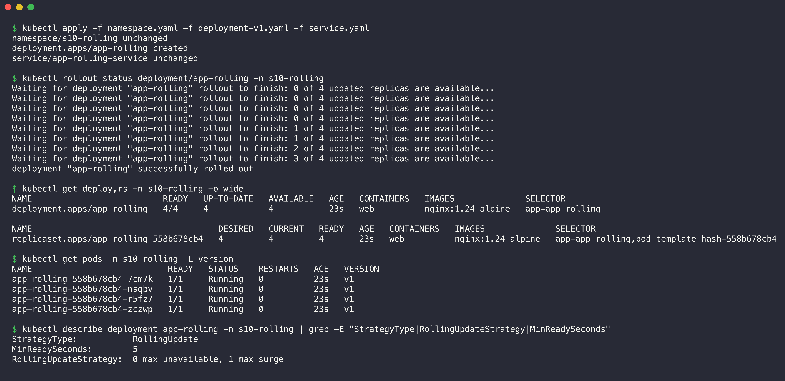
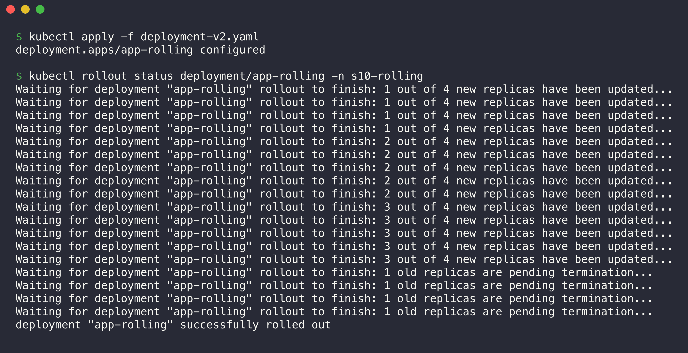
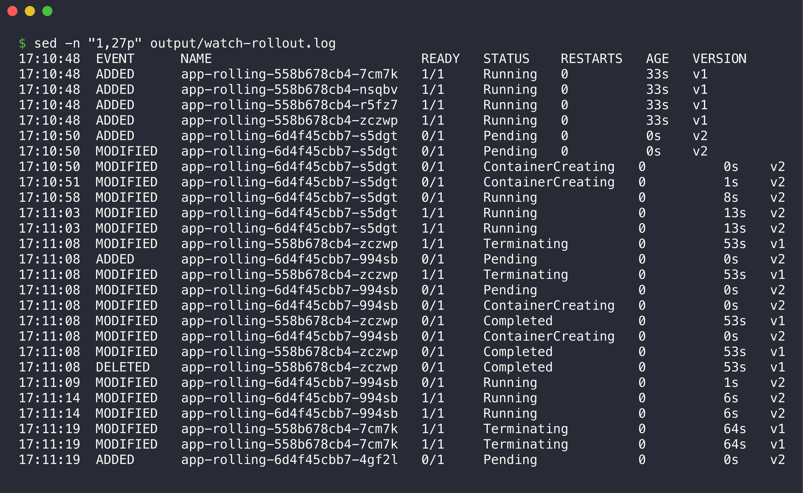
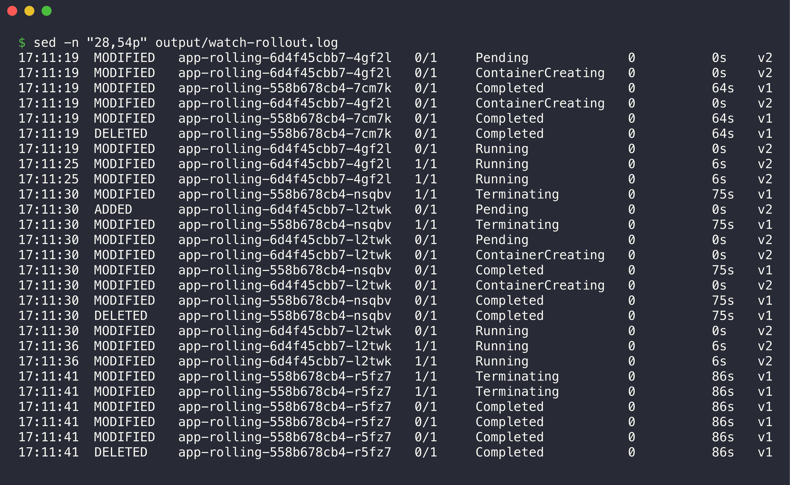
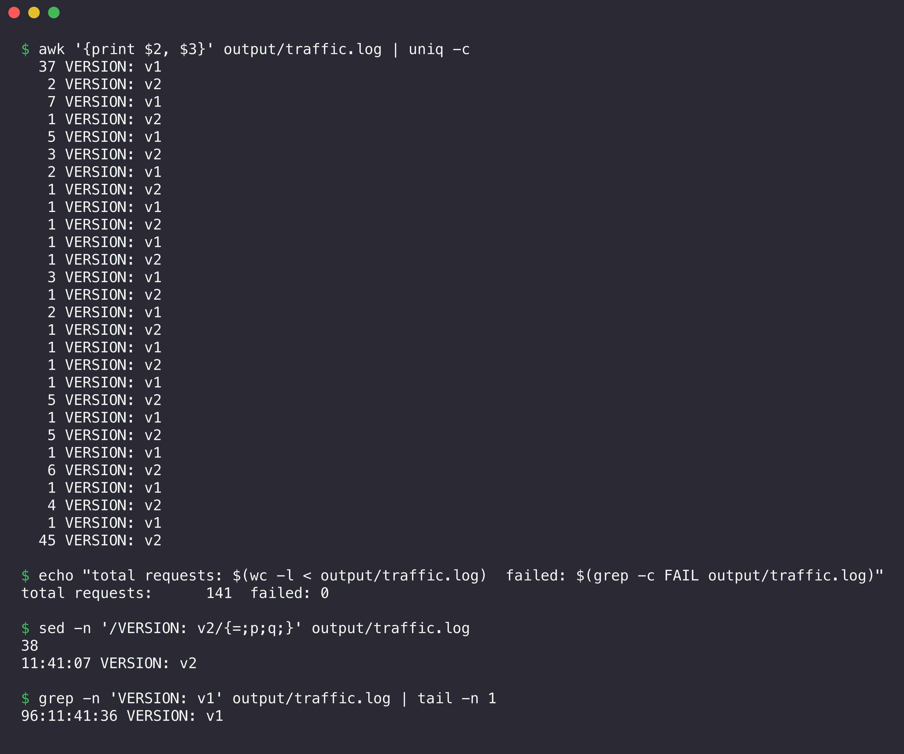
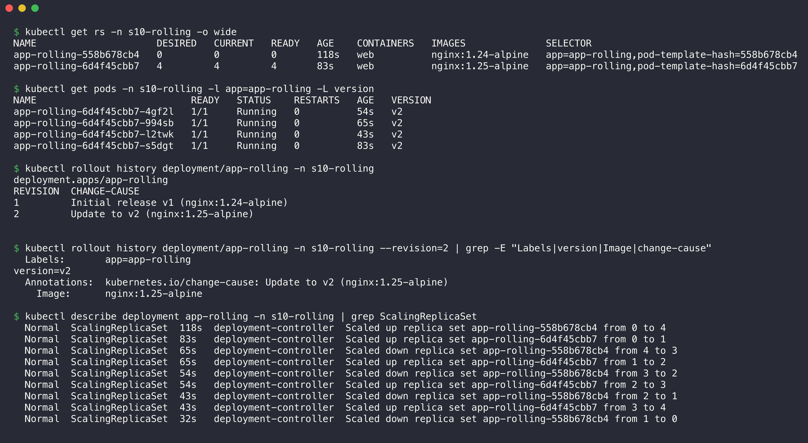


# 01. Rolling Update

**Namespace:** `s10-rolling`

| File | Content |
| --- | --- |
| [namespace.yaml](namespace.yaml) | The Namespace `s10-rolling` |
| [deployment-v1.yaml](deployment-v1.yaml) | Deployment `app-rolling`, 4 replicas, `nginx:1.24-alpine`, label `version: v1` |
| [deployment-v2.yaml](deployment-v2.yaml) | The same Deployment with `nginx:1.25-alpine` and label `version: v2` |
| [service.yaml](service.yaml) | ClusterIP Service `app-rolling-service` for all `app=app-rolling` Pods |
| [output/watch-rollout.log](output/watch-rollout.log) | `kubectl get pods -w` during the update, with a time stamp on each line |
| [output/traffic.log](output/traffic.log) | One request about every 0.5 seconds during the update, from a curl Pod |

## How the strategy works

```yaml
  minReadySeconds: 5
  strategy:
    type: RollingUpdate
    rollingUpdate:
      maxSurge: 1        # max 4 + 1 = 5 Pods during the update
      maxUnavailable: 0  # min 4 available Pods during the update
```

The Deployment controller creates one new Pod (`maxSurge: 1`). When the new Pod is Ready for 5 seconds (`minReadySeconds`), the controller stops one old Pod. Then it repeats these steps. Because `maxUnavailable: 0`, the number of available Pods never decreases below 4. A readiness probe makes sure that the Service sends traffic only to Pods that answer.

Each Pod writes its version and its Pod name into `index.html` with a `postStart` hook. A request to the Service shows which version answered.

The time stamps in `watch-rollout.log` use the local time of the Mac (IST, UTC+5:30). The time stamps in `traffic.log` come from the curl Pod and use UTC.

## Step 1: Create the Deployment (v1)

1. Apply the Namespace, the v1 Deployment and the Service.
2. Wait until the rollout completes.
3. Examine the strategy settings.

```bash
kubectl apply -f namespace.yaml -f deployment-v1.yaml -f service.yaml
kubectl rollout status deployment/app-rolling -n s10-rolling
kubectl get deploy,rs -n s10-rolling -o wide
kubectl get pods -n s10-rolling -L version
kubectl describe deployment app-rolling -n s10-rolling | grep -E "StrategyType|RollingUpdateStrategy|MinReadySeconds"
```



```console
$ kubectl apply -f namespace.yaml -f deployment-v1.yaml -f service.yaml
namespace/s10-rolling unchanged
deployment.apps/app-rolling created
service/app-rolling-service unchanged

$ kubectl rollout status deployment/app-rolling -n s10-rolling
Waiting for deployment "app-rolling" rollout to finish: 0 of 4 updated replicas are available...
Waiting for deployment "app-rolling" rollout to finish: 0 of 4 updated replicas are available...
Waiting for deployment "app-rolling" rollout to finish: 0 of 4 updated replicas are available...
Waiting for deployment "app-rolling" rollout to finish: 0 of 4 updated replicas are available...
Waiting for deployment "app-rolling" rollout to finish: 1 of 4 updated replicas are available...
Waiting for deployment "app-rolling" rollout to finish: 1 of 4 updated replicas are available...
Waiting for deployment "app-rolling" rollout to finish: 2 of 4 updated replicas are available...
Waiting for deployment "app-rolling" rollout to finish: 3 of 4 updated replicas are available...
deployment "app-rolling" successfully rolled out

$ kubectl get deploy,rs -n s10-rolling -o wide
NAME                          READY   UP-TO-DATE   AVAILABLE   AGE   CONTAINERS   IMAGES              SELECTOR
deployment.apps/app-rolling   4/4     4            4           23s   web          nginx:1.24-alpine   app=app-rolling

NAME                                     DESIRED   CURRENT   READY   AGE   CONTAINERS   IMAGES              SELECTOR
replicaset.apps/app-rolling-558b678cb4   4         4         4       23s   web          nginx:1.24-alpine   app=app-rolling,pod-template-hash=558b678cb4

$ kubectl get pods -n s10-rolling -L version
NAME                           READY   STATUS    RESTARTS   AGE   VERSION
app-rolling-558b678cb4-7cm7k   1/1     Running   0          23s   v1
app-rolling-558b678cb4-nsqbv   1/1     Running   0          23s   v1
app-rolling-558b678cb4-r5fz7   1/1     Running   0          23s   v1
app-rolling-558b678cb4-zczwp   1/1     Running   0          23s   v1

$ kubectl describe deployment app-rolling -n s10-rolling | grep -E "StrategyType|RollingUpdateStrategy|MinReadySeconds"
StrategyType:           RollingUpdate
MinReadySeconds:        5
RollingUpdateStrategy:  0 max unavailable, 1 max surge
```

The Namespace and the Service show `unchanged` because my first apply created them. In that first apply, the Deployment file had a YAML error. I corrected the file and applied it again. Four v1 Pods run in one ReplicaSet (`558b678cb4`). The strategy line confirms `0 max unavailable, 1 max surge`.

## Step 2: Do the application update (v1 to v2)

1. Start a curl Pod that sends a request to the Service about every 0.5 seconds.
2. Start `kubectl get pods -w` in the background and add a time stamp to each line.
3. Apply the v2 Deployment.
4. Monitor the rollout until it completes.

```bash
kubectl run traffic -n s10-rolling --image=curlimages/curl --restart=Never -- sh -c \
  'while true; do echo "$(date +%T) $(curl -s -m 1 http://app-rolling-service | grep -o "VERSION: v[0-9]" || echo FAIL)"; sleep 0.5; done'
( kubectl get pods -n s10-rolling -l app=app-rolling -L version -w --output-watch-events \
  | while IFS= read -r l; do echo "$(date +%T)  $l"; done ) > output/watch-rollout.log &
kubectl apply -f deployment-v2.yaml
kubectl rollout status deployment/app-rolling -n s10-rolling
```



```console
$ kubectl apply -f deployment-v2.yaml
deployment.apps/app-rolling configured

$ kubectl rollout status deployment/app-rolling -n s10-rolling
Waiting for deployment "app-rolling" rollout to finish: 1 out of 4 new replicas have been updated...
Waiting for deployment "app-rolling" rollout to finish: 1 out of 4 new replicas have been updated...
Waiting for deployment "app-rolling" rollout to finish: 1 out of 4 new replicas have been updated...
Waiting for deployment "app-rolling" rollout to finish: 1 out of 4 new replicas have been updated...
Waiting for deployment "app-rolling" rollout to finish: 2 out of 4 new replicas have been updated...
Waiting for deployment "app-rolling" rollout to finish: 2 out of 4 new replicas have been updated...
Waiting for deployment "app-rolling" rollout to finish: 2 out of 4 new replicas have been updated...
Waiting for deployment "app-rolling" rollout to finish: 2 out of 4 new replicas have been updated...
Waiting for deployment "app-rolling" rollout to finish: 2 out of 4 new replicas have been updated...
Waiting for deployment "app-rolling" rollout to finish: 3 out of 4 new replicas have been updated...
Waiting for deployment "app-rolling" rollout to finish: 3 out of 4 new replicas have been updated...
Waiting for deployment "app-rolling" rollout to finish: 3 out of 4 new replicas have been updated...
Waiting for deployment "app-rolling" rollout to finish: 3 out of 4 new replicas have been updated...
Waiting for deployment "app-rolling" rollout to finish: 3 out of 4 new replicas have been updated...
Waiting for deployment "app-rolling" rollout to finish: 1 old replicas are pending termination...
Waiting for deployment "app-rolling" rollout to finish: 1 old replicas are pending termination...
Waiting for deployment "app-rolling" rollout to finish: 1 old replicas are pending termination...
Waiting for deployment "app-rolling" rollout to finish: 1 old replicas are pending termination...
deployment "app-rolling" successfully rolled out
```

## Step 3: Verify old and new Pods during the update

### The Pod watch, with time stamps



```console
$ sed -n "1,27p" output/watch-rollout.log
17:10:48  EVENT      NAME                           READY   STATUS    RESTARTS   AGE   VERSION
17:10:48  ADDED      app-rolling-558b678cb4-7cm7k   1/1     Running   0          33s   v1
17:10:48  ADDED      app-rolling-558b678cb4-nsqbv   1/1     Running   0          33s   v1
17:10:48  ADDED      app-rolling-558b678cb4-r5fz7   1/1     Running   0          33s   v1
17:10:48  ADDED      app-rolling-558b678cb4-zczwp   1/1     Running   0          33s   v1
17:10:50  ADDED      app-rolling-6d4f45cbb7-s5dgt   0/1     Pending   0          0s    v2
17:10:50  MODIFIED   app-rolling-6d4f45cbb7-s5dgt   0/1     Pending   0          0s    v2
17:10:50  MODIFIED   app-rolling-6d4f45cbb7-s5dgt   0/1     ContainerCreating   0          0s    v2
17:10:51  MODIFIED   app-rolling-6d4f45cbb7-s5dgt   0/1     ContainerCreating   0          1s    v2
17:10:58  MODIFIED   app-rolling-6d4f45cbb7-s5dgt   0/1     Running             0          8s    v2
17:11:03  MODIFIED   app-rolling-6d4f45cbb7-s5dgt   1/1     Running             0          13s   v2
17:11:03  MODIFIED   app-rolling-6d4f45cbb7-s5dgt   1/1     Running             0          13s   v2
17:11:08  MODIFIED   app-rolling-558b678cb4-zczwp   1/1     Terminating         0          53s   v1
17:11:08  ADDED      app-rolling-6d4f45cbb7-994sb   0/1     Pending             0          0s    v2
17:11:08  MODIFIED   app-rolling-558b678cb4-zczwp   1/1     Terminating         0          53s   v1
17:11:08  MODIFIED   app-rolling-6d4f45cbb7-994sb   0/1     Pending             0          0s    v2
17:11:08  MODIFIED   app-rolling-6d4f45cbb7-994sb   0/1     ContainerCreating   0          0s    v2
17:11:08  MODIFIED   app-rolling-558b678cb4-zczwp   0/1     Completed           0          53s   v1
17:11:08  MODIFIED   app-rolling-6d4f45cbb7-994sb   0/1     ContainerCreating   0          0s    v2
17:11:08  MODIFIED   app-rolling-558b678cb4-zczwp   0/1     Completed           0          53s   v1
17:11:08  DELETED    app-rolling-558b678cb4-zczwp   0/1     Completed           0          53s   v1
17:11:09  MODIFIED   app-rolling-6d4f45cbb7-994sb   0/1     Running             0          1s    v2
17:11:14  MODIFIED   app-rolling-6d4f45cbb7-994sb   1/1     Running             0          6s    v2
17:11:14  MODIFIED   app-rolling-6d4f45cbb7-994sb   1/1     Running             0          6s    v2
17:11:19  MODIFIED   app-rolling-558b678cb4-7cm7k   1/1     Terminating         0          64s   v1
17:11:19  MODIFIED   app-rolling-558b678cb4-7cm7k   1/1     Terminating         0          64s   v1
17:11:19  ADDED      app-rolling-6d4f45cbb7-4gf2l   0/1     Pending             0          0s    v2
```



```console
$ sed -n "28,54p" output/watch-rollout.log
17:11:19  MODIFIED   app-rolling-6d4f45cbb7-4gf2l   0/1     Pending             0          0s    v2
17:11:19  MODIFIED   app-rolling-6d4f45cbb7-4gf2l   0/1     ContainerCreating   0          0s    v2
17:11:19  MODIFIED   app-rolling-558b678cb4-7cm7k   0/1     Completed           0          64s   v1
17:11:19  MODIFIED   app-rolling-6d4f45cbb7-4gf2l   0/1     ContainerCreating   0          0s    v2
17:11:19  MODIFIED   app-rolling-558b678cb4-7cm7k   0/1     Completed           0          64s   v1
17:11:19  DELETED    app-rolling-558b678cb4-7cm7k   0/1     Completed           0          64s   v1
17:11:19  MODIFIED   app-rolling-6d4f45cbb7-4gf2l   0/1     Running             0          0s    v2
17:11:25  MODIFIED   app-rolling-6d4f45cbb7-4gf2l   1/1     Running             0          6s    v2
17:11:25  MODIFIED   app-rolling-6d4f45cbb7-4gf2l   1/1     Running             0          6s    v2
17:11:30  MODIFIED   app-rolling-558b678cb4-nsqbv   1/1     Terminating         0          75s   v1
17:11:30  ADDED      app-rolling-6d4f45cbb7-l2twk   0/1     Pending             0          0s    v2
17:11:30  MODIFIED   app-rolling-558b678cb4-nsqbv   1/1     Terminating         0          75s   v1
17:11:30  MODIFIED   app-rolling-6d4f45cbb7-l2twk   0/1     Pending             0          0s    v2
17:11:30  MODIFIED   app-rolling-6d4f45cbb7-l2twk   0/1     ContainerCreating   0          0s    v2
17:11:30  MODIFIED   app-rolling-558b678cb4-nsqbv   0/1     Completed           0          75s   v1
17:11:30  MODIFIED   app-rolling-6d4f45cbb7-l2twk   0/1     ContainerCreating   0          0s    v2
17:11:30  MODIFIED   app-rolling-558b678cb4-nsqbv   0/1     Completed           0          75s   v1
17:11:30  DELETED    app-rolling-558b678cb4-nsqbv   0/1     Completed           0          75s   v1
17:11:30  MODIFIED   app-rolling-6d4f45cbb7-l2twk   0/1     Running             0          0s    v2
17:11:36  MODIFIED   app-rolling-6d4f45cbb7-l2twk   1/1     Running             0          6s    v2
17:11:36  MODIFIED   app-rolling-6d4f45cbb7-l2twk   1/1     Running             0          6s    v2
17:11:41  MODIFIED   app-rolling-558b678cb4-r5fz7   1/1     Terminating         0          86s   v1
17:11:41  MODIFIED   app-rolling-558b678cb4-r5fz7   1/1     Terminating         0          86s   v1
17:11:41  MODIFIED   app-rolling-558b678cb4-r5fz7   0/1     Completed           0          86s   v1
17:11:41  MODIFIED   app-rolling-558b678cb4-r5fz7   0/1     Completed           0          86s   v1
17:11:41  MODIFIED   app-rolling-558b678cb4-r5fz7   0/1     Completed           0          86s   v1
17:11:41  DELETED    app-rolling-558b678cb4-r5fz7   0/1     Completed           0          86s   v1
```

The watch shows the pattern of `maxSurge: 1` and `maxUnavailable: 0`:

1. At 17:10:50, Kubernetes created the first v2 Pod. All 4 v1 Pods still ran, so 5 Pods existed.
2. At 17:11:03, the v2 Pod became Ready (`1/1`).
3. At 17:11:08 (5 seconds later, `minReadySeconds`), one v1 Pod went to `Terminating` and the next v2 Pod started.
4. Kubernetes repeated this cycle about every 11 seconds until the last v1 Pod stopped at 17:11:41.

At no time were fewer than 4 Ready Pods present.

### The traffic during the update



```console
$ awk '{print $2, $3}' output/traffic.log | uniq -c
  37 VERSION: v1
   2 VERSION: v2
   7 VERSION: v1
   1 VERSION: v2
   5 VERSION: v1
   3 VERSION: v2
   2 VERSION: v1
   1 VERSION: v2
   1 VERSION: v1
   1 VERSION: v2
   1 VERSION: v1
   1 VERSION: v2
   3 VERSION: v1
   1 VERSION: v2
   2 VERSION: v1
   1 VERSION: v2
   1 VERSION: v1
   1 VERSION: v2
   1 VERSION: v1
   5 VERSION: v2
   1 VERSION: v1
   5 VERSION: v2
   1 VERSION: v1
   6 VERSION: v2
   1 VERSION: v1
   4 VERSION: v2
   1 VERSION: v1
  45 VERSION: v2

$ echo "total requests: $(wc -l < output/traffic.log)  failed: $(grep -c FAIL output/traffic.log)"
total requests:      141  failed: 0

$ sed -n '/VERSION: v2/{=;p;q;}' output/traffic.log
38
11:41:07 VERSION: v2

$ grep -n 'VERSION: v1' output/traffic.log | tail -n 1
96:11:41:36 VERSION: v1
```

- During the update, v1 and v2 answered at the same time. The share of v2 answers increased with each step.
- The first v2 answer came at 11:41:07 UTC (17:11:07 IST), 4 seconds after the first v2 Pod became Ready.
- The last v1 answer came at 11:41:36 UTC. The last v1 Pod stopped at 17:11:41 IST.
- None of the 141 requests failed. The rolling update had zero downtime.

### The final state and the rollout history

```bash
kubectl get rs -n s10-rolling -o wide
kubectl get pods -n s10-rolling -l app=app-rolling -L version
kubectl rollout history deployment/app-rolling -n s10-rolling
kubectl rollout history deployment/app-rolling -n s10-rolling --revision=2
kubectl describe deployment app-rolling -n s10-rolling | grep ScalingReplicaSet
```



```console
$ kubectl get rs -n s10-rolling -o wide
NAME                     DESIRED   CURRENT   READY   AGE    CONTAINERS   IMAGES              SELECTOR
app-rolling-558b678cb4   0         0         0       118s   web          nginx:1.24-alpine   app=app-rolling,pod-template-hash=558b678cb4
app-rolling-6d4f45cbb7   4         4         4       83s    web          nginx:1.25-alpine   app=app-rolling,pod-template-hash=6d4f45cbb7

$ kubectl get pods -n s10-rolling -l app=app-rolling -L version
NAME                           READY   STATUS    RESTARTS   AGE   VERSION
app-rolling-6d4f45cbb7-4gf2l   1/1     Running   0          54s   v2
app-rolling-6d4f45cbb7-994sb   1/1     Running   0          65s   v2
app-rolling-6d4f45cbb7-l2twk   1/1     Running   0          43s   v2
app-rolling-6d4f45cbb7-s5dgt   1/1     Running   0          83s   v2

$ kubectl rollout history deployment/app-rolling -n s10-rolling
deployment.apps/app-rolling 
REVISION  CHANGE-CAUSE
1         Initial release v1 (nginx:1.24-alpine)
2         Update to v2 (nginx:1.25-alpine)


$ kubectl rollout history deployment/app-rolling -n s10-rolling --revision=2 | grep -E "Labels|version|Image|change-cause"
  Labels:	app=app-rolling
	version=v2
  Annotations:	kubernetes.io/change-cause: Update to v2 (nginx:1.25-alpine)
    Image:	nginx:1.25-alpine

$ kubectl describe deployment app-rolling -n s10-rolling | grep ScalingReplicaSet
  Normal  ScalingReplicaSet  118s  deployment-controller  Scaled up replica set app-rolling-558b678cb4 from 0 to 4
  Normal  ScalingReplicaSet  83s   deployment-controller  Scaled up replica set app-rolling-6d4f45cbb7 from 0 to 1
  Normal  ScalingReplicaSet  65s   deployment-controller  Scaled down replica set app-rolling-558b678cb4 from 4 to 3
  Normal  ScalingReplicaSet  65s   deployment-controller  Scaled up replica set app-rolling-6d4f45cbb7 from 1 to 2
  Normal  ScalingReplicaSet  54s   deployment-controller  Scaled down replica set app-rolling-558b678cb4 from 3 to 2
  Normal  ScalingReplicaSet  54s   deployment-controller  Scaled up replica set app-rolling-6d4f45cbb7 from 2 to 3
  Normal  ScalingReplicaSet  43s   deployment-controller  Scaled down replica set app-rolling-558b678cb4 from 2 to 1
  Normal  ScalingReplicaSet  43s   deployment-controller  Scaled up replica set app-rolling-6d4f45cbb7 from 3 to 4
  Normal  ScalingReplicaSet  32s   deployment-controller  Scaled down replica set app-rolling-558b678cb4 from 1 to 0
```

- The old ReplicaSet `558b678cb4` (v1) stays with 0 replicas. Kubernetes keeps it for a rollback.
- The new ReplicaSet `6d4f45cbb7` (v2) has 4 Pods.
- The `kubernetes.io/change-cause` annotation fills the CHANGE-CAUSE column of the history.
- The events show the steps: each "scaled up" of the new ReplicaSet comes with a "scaled down" of the old ReplicaSet.

## Step 4 (extra): Roll back to revision 1

```bash
kubectl rollout undo deployment/app-rolling -n s10-rolling --to-revision=1
```



```console
$ kubectl rollout undo deployment/app-rolling -n s10-rolling --to-revision=1
Warning: resource deployments/app-rolling was previously managed with 'kubectl apply'. Rolling back will not update the kubectl.kubernetes.io/last-applied-configuration annotation, which may cause unexpected behavior on future 'kubectl apply' operations. Consider using 'kubectl apply' with your previous configuration file instead.
deployment.apps/app-rolling rolled back

$ kubectl rollout status deployment/app-rolling -n s10-rolling | tail -n 1
deployment "app-rolling" successfully rolled out

$ kubectl get rs -n s10-rolling
NAME                     DESIRED   CURRENT   READY   AGE
app-rolling-558b678cb4   4         4         4       2m52s
app-rolling-6d4f45cbb7   0         0         0       2m17s

$ kubectl rollout history deployment/app-rolling -n s10-rolling
deployment.apps/app-rolling 
REVISION  CHANGE-CAUSE
2         Update to v2 (nginx:1.25-alpine)
3         Initial release v1 (nginx:1.24-alpine)


$ kubectl exec -n s10-rolling traffic -- curl -s http://app-rolling-service
Rolling Update Demo | VERSION: v1 | Pod: app-rolling-558b678cb4-6pcpn
```

The rollback used the old ReplicaSet `558b678cb4` again and increased it to 4 Pods. Revision 1 became revision 3. The warning says that `kubectl apply` and `rollout undo` both change the Deployment. In a real project, apply the old YAML file from Git to roll back.

## Clean up

```bash
kubectl delete namespace s10-rolling
```
