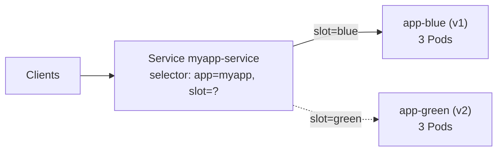
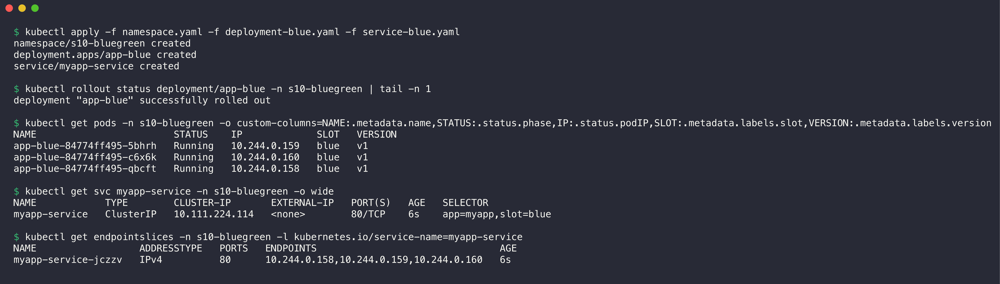
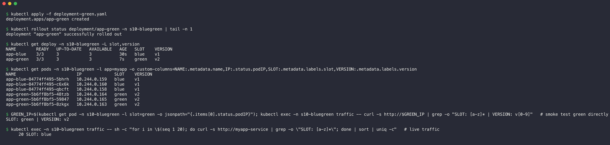
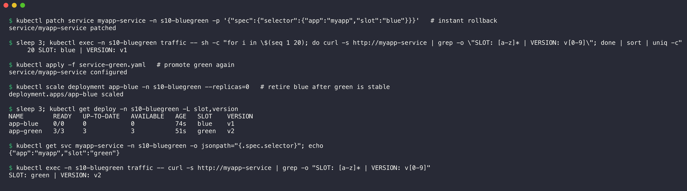

# 02. Blue-Green Deployment

**Namespace:** `s10-bluegreen`

| File | Content |
| --- | --- |
| [namespace.yaml](namespace.yaml) | The Namespace `s10-bluegreen` |
| [deployment-blue.yaml](deployment-blue.yaml) | Deployment `app-blue`, 3 replicas, `nginx:1.24-alpine`, labels `slot: blue`, `version: v1` |
| [deployment-green.yaml](deployment-green.yaml) | Deployment `app-green`, 3 replicas, `nginx:1.25-alpine`, labels `slot: green`, `version: v2` |
| [service-blue.yaml](service-blue.yaml) | Service `myapp-service` with selector `app=myapp, slot=blue` |
| [service-green.yaml](service-green.yaml) | The same Service with selector `app=myapp, slot=green` |
| [output/traffic-switch.log](output/traffic-switch.log) | One request about every 0.5 seconds, before and after the switch |

## How the strategy works



Two full environments run at the same time. Only the Service selector decides which environment gets traffic. To switch, I change one label value in the selector (`slot: blue` to `slot: green`). The switch is instant and complete. To roll back, I change the value again. The old environment stays ready until I remove it.

Each Pod writes its slot, its version and its Pod name into `index.html` with a `postStart` hook.

## Step 1: Create the blue version (live)

1. Apply the Namespace, the blue Deployment and the blue Service.
2. Examine the Pods, the Service selector and the endpoints.

```bash
kubectl apply -f namespace.yaml -f deployment-blue.yaml -f service-blue.yaml
kubectl rollout status deployment/app-blue -n s10-bluegreen
kubectl get pods -n s10-bluegreen -o custom-columns=NAME:.metadata.name,STATUS:.status.phase,IP:.status.podIP,SLOT:.metadata.labels.slot,VERSION:.metadata.labels.version
kubectl get svc myapp-service -n s10-bluegreen -o wide
kubectl get endpointslices -n s10-bluegreen -l kubernetes.io/service-name=myapp-service
```



```console
$ kubectl apply -f namespace.yaml -f deployment-blue.yaml -f service-blue.yaml
namespace/s10-bluegreen created
deployment.apps/app-blue created
service/myapp-service created

$ kubectl rollout status deployment/app-blue -n s10-bluegreen | tail -n 1
deployment "app-blue" successfully rolled out

$ kubectl get pods -n s10-bluegreen -o custom-columns=NAME:.metadata.name,STATUS:.status.phase,IP:.status.podIP,SLOT:.metadata.labels.slot,VERSION:.metadata.labels.version
NAME                        STATUS    IP             SLOT   VERSION
app-blue-84774ff495-5bhrh   Running   10.244.0.159   blue   v1
app-blue-84774ff495-c6x6k   Running   10.244.0.160   blue   v1
app-blue-84774ff495-qbcft   Running   10.244.0.158   blue   v1

$ kubectl get svc myapp-service -n s10-bluegreen -o wide
NAME            TYPE        CLUSTER-IP       EXTERNAL-IP   PORT(S)   AGE   SELECTOR
myapp-service   ClusterIP   10.111.224.114   <none>        80/TCP    6s    app=myapp,slot=blue

$ kubectl get endpointslices -n s10-bluegreen -l kubernetes.io/service-name=myapp-service
NAME                  ADDRESSTYPE   PORTS   ENDPOINTS                                AGE
myapp-service-jczzv   IPv4          80      10.244.0.158,10.244.0.159,10.244.0.160   6s
```

The endpoints of the Service are the three blue Pod IPs. The browser shows the blue page through `kubectl port-forward svc/myapp-service 18010:80`:


## Step 2: Create the green version (standby)

1. Start a curl Pod that sends a request to the Service about every 0.5 seconds.
2. Apply the green Deployment.
3. Test one green Pod directly by its Pod IP.
4. Send 20 requests to the Service. Make sure that all answers still come from blue.

```bash
kubectl run traffic -n s10-bluegreen --image=curlimages/curl --restart=Never -- sh -c \
  'while true; do echo "$(date +%T) $(curl -s -m 1 http://myapp-service | grep -o "SLOT: [a-z]* | VERSION: v[0-9]" || echo FAIL)"; sleep 0.5; done'
kubectl apply -f deployment-green.yaml
```



```console
$ kubectl apply -f deployment-green.yaml
deployment.apps/app-green created

$ kubectl rollout status deployment/app-green -n s10-bluegreen | tail -n 1
deployment "app-green" successfully rolled out

$ kubectl get deploy -n s10-bluegreen -L slot,version
NAME        READY   UP-TO-DATE   AVAILABLE   AGE   SLOT    VERSION
app-blue    3/3     3            3           30s   blue    v1
app-green   3/3     3            3           7s    green   v2

$ kubectl get pods -n s10-bluegreen -l app=myapp -o custom-columns=NAME:.metadata.name,IP:.status.podIP,SLOT:.metadata.labels.slot,VERSION:.metadata.labels.version
NAME                        IP             SLOT    VERSION
app-blue-84774ff495-5bhrh   10.244.0.159   blue    v1
app-blue-84774ff495-c6x6k   10.244.0.160   blue    v1
app-blue-84774ff495-qbcft   10.244.0.158   blue    v1
app-green-5b6ff8bf5-48tzb   10.244.0.164   green   v2
app-green-5b6ff8bf5-59847   10.244.0.165   green   v2
app-green-5b6ff8bf5-8zkgx   10.244.0.163   green   v2

$ GREEN_IP=$(kubectl get pod -n s10-bluegreen -l slot=green -o jsonpath="{.items[0].status.podIP}"); kubectl exec -n s10-bluegreen traffic -- curl -s http://$GREEN_IP | grep -o "SLOT: [a-z]* | VERSION: v[0-9]"   # smoke test green directly
SLOT: green | VERSION: v2

$ kubectl exec -n s10-bluegreen traffic -- sh -c "for i in \$(seq 1 20); do curl -s http://myapp-service | grep -o \"SLOT: [a-z]*\"; done | sort | uniq -c"   # live traffic
     20 SLOT: blue
```

Six Pods run: three blue and three green. The green version answers correctly by its Pod IP. All 20 requests through the Service still go to blue. Users do not see the green version yet.

## Step 3: Switch traffic to green

1. Compare the two Service files.
2. Apply `service-green.yaml`.
3. Make sure that the selector and the endpoints changed.
4. Send 20 requests to the Service.

```bash
diff service-blue.yaml service-green.yaml
kubectl apply -f service-green.yaml
```


```console
$ diff service-blue.yaml service-green.yaml
1c1
< # The Service "myapp-service" sends all traffic to the blue environment.
---
> # The Service "myapp-service" sends all traffic to the green environment.
14c14
<     slot: blue   # <-- the switch
---
>     slot: green   # <-- the switch

$ date +%T; kubectl apply -f service-green.yaml
17:14:35
service/myapp-service configured

$ kubectl get svc myapp-service -n s10-bluegreen -o wide
NAME            TYPE        CLUSTER-IP       EXTERNAL-IP   PORT(S)   AGE   SELECTOR
myapp-service   ClusterIP   10.111.224.114   <none>        80/TCP    40s   app=myapp,slot=green

$ kubectl get endpointslices -n s10-bluegreen -l kubernetes.io/service-name=myapp-service
NAME                  ADDRESSTYPE   PORTS   ENDPOINTS                                AGE
myapp-service-jczzv   IPv4          80      10.244.0.164,10.244.0.163,10.244.0.165   40s

$ sleep 3; kubectl exec -n s10-bluegreen traffic -- sh -c "for i in \$(seq 1 20); do curl -s http://myapp-service | grep -o \"SLOT: [a-z]* | VERSION: v[0-9]\"; done | sort | uniq -c"
     20 SLOT: green | VERSION: v2
```

The ClusterIP (`10.111.224.114`) did not change. Only the selector and the endpoints changed. The endpoints are now the three green Pod IPs.

## Step 4: Verify the active version


```console
$ awk '{print $2,$3,$4,$5,$6}' output/traffic-switch.log | uniq -c
  35 SLOT: blue | VERSION: v1
  36 SLOT: green | VERSION: v2

$ grep -n -B3 -A3 -m1 green output/traffic-switch.log
33-11:44:34 SLOT: blue | VERSION: v1
34-11:44:35 SLOT: blue | VERSION: v1
35-11:44:35 SLOT: blue | VERSION: v1
36:11:44:36 SLOT: green | VERSION: v2
37-11:44:36 SLOT: green | VERSION: v2
38-11:44:37 SLOT: green | VERSION: v2
39-11:44:37 SLOT: green | VERSION: v2

$ echo "failed requests: $(grep -c FAIL output/traffic-switch.log)"
failed requests: 0
```

- The traffic log has exactly one change: 35 blue answers, then 36 green answers. There is no mix of versions.
- I applied the green Service at 17:14:35 IST (11:44:35 UTC). The first green answer came at 11:44:36 UTC, about one second later.
- No request failed during the switch.

## Step 5: Roll back, promote again, and retire blue

1. Patch the Service selector back to `slot: blue` (instant rollback).
2. Send 20 requests and make sure that blue answers.
3. Apply `service-green.yaml` again.
4. Scale the blue Deployment to 0 replicas.



```console
$ kubectl patch service myapp-service -n s10-bluegreen -p '{"spec":{"selector":{"app":"myapp","slot":"blue"}}}'   # instant rollback
service/myapp-service patched

$ sleep 3; kubectl exec -n s10-bluegreen traffic -- sh -c "for i in \$(seq 1 20); do curl -s http://myapp-service | grep -o \"SLOT: [a-z]* | VERSION: v[0-9]\"; done | sort | uniq -c"
     20 SLOT: blue | VERSION: v1

$ kubectl apply -f service-green.yaml   # promote green again
service/myapp-service configured

$ kubectl scale deployment app-blue -n s10-bluegreen --replicas=0   # retire blue after green is stable
deployment.apps/app-blue scaled

$ sleep 3; kubectl get deploy -n s10-bluegreen -L slot,version
NAME        READY   UP-TO-DATE   AVAILABLE   AGE   SLOT    VERSION
app-blue    0/0     0            0           74s   blue    v1
app-green   3/3     3            3           51s   green   v2

$ kubectl get svc myapp-service -n s10-bluegreen -o jsonpath="{.spec.selector}"; echo
{"app":"myapp","slot":"green"}

$ kubectl exec -n s10-bluegreen traffic -- curl -s http://myapp-service | grep -o "SLOT: [a-z]* | VERSION: v[0-9]"
SLOT: green | VERSION: v2
```

The rollback needed only one selector change, because the blue Pods still ran. After the second promotion, I scaled blue to 0 replicas. The blue Deployment object stays, so I can scale it up again for the next release. The disadvantage of blue-green is the cost: during the release, the cluster runs two full copies of the application.

## Clean up

```bash
kubectl delete namespace s10-bluegreen
```
