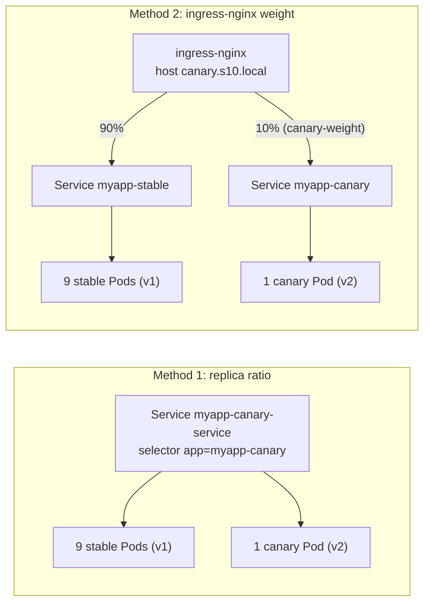
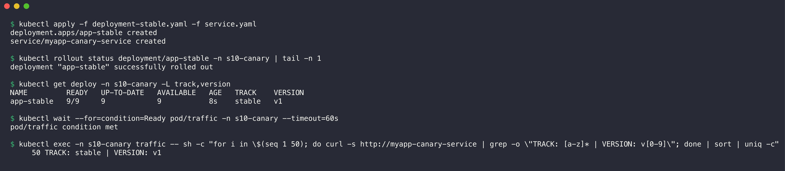
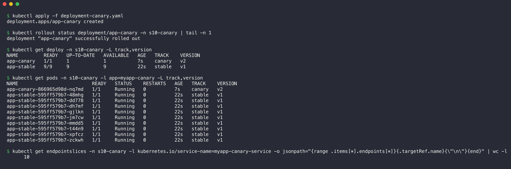
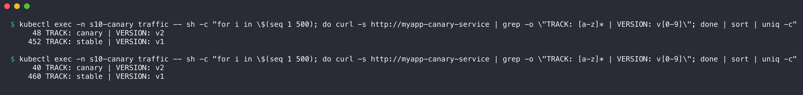
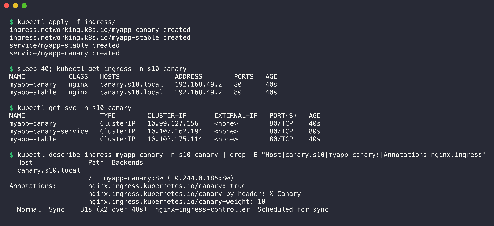
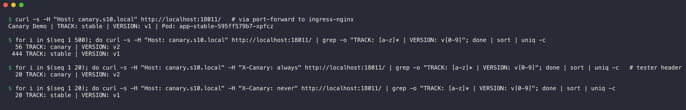
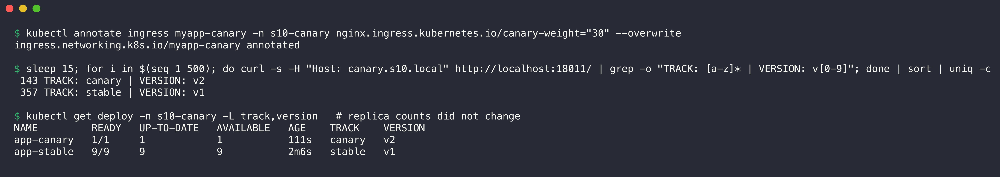

# 03. Canary Deployment

**Namespace:** `s10-canary`

| File | Content |
| --- | --- |
| [namespace.yaml](namespace.yaml) | The Namespace `s10-canary` |
| [deployment-stable.yaml](deployment-stable.yaml) | Deployment `app-stable`, 9 replicas, `nginx:1.24-alpine`, labels `track: stable`, `version: v1` |
| [deployment-canary.yaml](deployment-canary.yaml) | Deployment `app-canary`, 1 replica, `nginx:1.25-alpine`, labels `track: canary`, `version: v2` |
| [service.yaml](service.yaml) | Method 1: Service `myapp-canary-service` that selects both tracks (`app=myapp-canary`) |
| [ingress/services.yaml](ingress/services.yaml) | Method 2: Services `myapp-stable` and `myapp-canary`, one for each track |
| [ingress/ingress-stable.yaml](ingress/ingress-stable.yaml) | Method 2: main Ingress for host `canary.s10.local` to `myapp-stable` |
| [ingress/ingress-canary.yaml](ingress/ingress-canary.yaml) | Method 2: canary Ingress with `canary-weight: "10"` and `canary-by-header: X-Canary` |

## How the strategy works

A canary release sends a small share of the real traffic to the new version. If the canary has no errors, I increase its share step by step. If it has errors, only a small number of users see them. I used two methods.



- **Method 1 (replica ratio):** one Service selects both Deployments through the common label. kube-proxy selects a Pod at random, so the traffic share follows the Pod count: 1 of 10 Pods gives about 10%.
- **Method 2 (ingress-nginx annotations):** the ingress controller splits the traffic by weight. The share does not depend on the Pod count. A header can also force a request to the canary.

Each Pod writes its track, its version and its Pod name into `index.html` with a `postStart` hook.

## Step 1: Deploy the stable version

1. Apply the Namespace, the stable Deployment and the shared Service.
2. Start a curl Pod (`kubectl run traffic ... -- sleep 3600`) to send requests from inside the cluster.
3. Send 50 requests to the Service.

```bash
kubectl apply -f namespace.yaml
kubectl run traffic -n s10-canary --image=curlimages/curl --restart=Never --command -- sleep 3600
kubectl apply -f deployment-stable.yaml -f service.yaml
```



```console
$ kubectl apply -f deployment-stable.yaml -f service.yaml
deployment.apps/app-stable created
service/myapp-canary-service created

$ kubectl rollout status deployment/app-stable -n s10-canary | tail -n 1
deployment "app-stable" successfully rolled out

$ kubectl get deploy -n s10-canary -L track,version
NAME         READY   UP-TO-DATE   AVAILABLE   AGE   TRACK    VERSION
app-stable   9/9     9            9           8s    stable   v1

$ kubectl wait --for=condition=Ready pod/traffic -n s10-canary --timeout=60s
pod/traffic condition met

$ kubectl exec -n s10-canary traffic -- sh -c "for i in \$(seq 1 50); do curl -s http://myapp-canary-service | grep -o \"TRACK: [a-z]* | VERSION: v[0-9]\"; done | sort | uniq -c"
     50 TRACK: stable | VERSION: v1
```

All 50 requests go to the stable version, because only stable Pods exist.

## Step 2: Deploy the canary version

1. Apply the canary Deployment.
2. List the Pods with their track and version.
3. Count the endpoints of the shared Service.



```console
$ kubectl apply -f deployment-canary.yaml
deployment.apps/app-canary created

$ kubectl rollout status deployment/app-canary -n s10-canary | tail -n 1
deployment "app-canary" successfully rolled out

$ kubectl get deploy -n s10-canary -L track,version
NAME         READY   UP-TO-DATE   AVAILABLE   AGE   TRACK    VERSION
app-canary   1/1     1            1           7s    canary   v2
app-stable   9/9     9            9           22s   stable   v1

$ kubectl get pods -n s10-canary -l app=myapp-canary -L track,version
NAME                          READY   STATUS    RESTARTS   AGE   TRACK    VERSION
app-canary-866965d98d-nq7md   1/1     Running   0          7s    canary   v2
app-stable-595ff579b7-48mhg   1/1     Running   0          22s   stable   v1
app-stable-595ff579b7-dd778   1/1     Running   0          22s   stable   v1
app-stable-595ff579b7-dh7mf   1/1     Running   0          22s   stable   v1
app-stable-595ff579b7-gjlkn   1/1     Running   0          22s   stable   v1
app-stable-595ff579b7-jm7cw   1/1     Running   0          22s   stable   v1
app-stable-595ff579b7-mmdd5   1/1     Running   0          22s   stable   v1
app-stable-595ff579b7-t44n9   1/1     Running   0          22s   stable   v1
app-stable-595ff579b7-xpfcz   1/1     Running   0          22s   stable   v1
app-stable-595ff579b7-zckwh   1/1     Running   0          22s   stable   v1

$ kubectl get endpointslices -n s10-canary -l kubernetes.io/service-name=myapp-canary-service -o jsonpath="{range .items[*].endpoints[*]}{.targetRef.name}{\"\n\"}{end}" | wc -l
      10
```

The shared Service has 10 endpoints: 9 stable Pods and 1 canary Pod.

## Step 3: Route a small percentage of traffic to the canary (method 1, replica ratio)

1. Send 500 requests to the shared Service and count the answers for each version.
2. Do the same count a second time.



```console
$ kubectl exec -n s10-canary traffic -- sh -c "for i in \$(seq 1 500); do curl -s http://myapp-canary-service | grep -o \"TRACK: [a-z]* | VERSION: v[0-9]\"; done | sort | uniq -c"
     48 TRACK: canary | VERSION: v2
    452 TRACK: stable | VERSION: v1

$ kubectl exec -n s10-canary traffic -- sh -c "for i in \$(seq 1 500); do curl -s http://myapp-canary-service | grep -o \"TRACK: [a-z]* | VERSION: v[0-9]\"; done | sort | uniq -c"
     40 TRACK: canary | VERSION: v2
    460 TRACK: stable | VERSION: v1
```

| Run | Canary (v2) | Stable (v1) | Canary share |
| --- | --- | --- | --- |
| 1 | 48 | 452 | 9.6% |
| 2 | 40 | 460 | 8.0% |

The expected share is 1 of 10 Pods, which is 10%. The results are near 10%. They are not exact, because kube-proxy selects a Pod at random for each connection. With this method, the smallest share is 1 divided by the total Pod count.

## Step 4: Route a small percentage of traffic to the canary (method 2, ingress-nginx)

1. Apply the two track Services and the two Ingress objects.
2. Wait until the ingress controller gives an address to the Ingress objects.
3. Start `kubectl port-forward -n ingress-nginx svc/ingress-nginx-controller 18011:80` in the background.
4. Send 500 requests through the ingress controller.
5. Send 20 requests with `X-Canary: always` and 20 requests with `X-Canary: never`.

```bash
kubectl apply -f ingress/
kubectl port-forward -n ingress-nginx svc/ingress-nginx-controller 18011:80 &
```



```console
$ kubectl apply -f ingress/
ingress.networking.k8s.io/myapp-canary created
ingress.networking.k8s.io/myapp-stable created
service/myapp-stable created
service/myapp-canary created

$ sleep 40; kubectl get ingress -n s10-canary
NAME           CLASS   HOSTS              ADDRESS        PORTS   AGE
myapp-canary   nginx   canary.s10.local   192.168.49.2   80      40s
myapp-stable   nginx   canary.s10.local   192.168.49.2   80      40s

$ kubectl get svc -n s10-canary
NAME                   TYPE        CLUSTER-IP       EXTERNAL-IP   PORT(S)   AGE
myapp-canary           ClusterIP   10.99.127.156    <none>        80/TCP    40s
myapp-canary-service   ClusterIP   10.107.162.194   <none>        80/TCP    80s
myapp-stable           ClusterIP   10.102.175.114   <none>        80/TCP    40s

$ kubectl describe ingress myapp-canary -n s10-canary | grep -E "Host|canary.s10|myapp-canary:|Annotations|nginx.ingress"
  Host              Path  Backends
  canary.s10.local  
                    /   myapp-canary:80 (10.244.0.185:80)
Annotations:        nginx.ingress.kubernetes.io/canary: true
                    nginx.ingress.kubernetes.io/canary-by-header: X-Canary
                    nginx.ingress.kubernetes.io/canary-weight: 10
  Normal  Sync    31s (x2 over 40s)  nginx-ingress-controller  Scheduled for sync
```



```console
$ curl -s -H "Host: canary.s10.local" http://localhost:18011/   # via port-forward to ingress-nginx
Canary Demo | TRACK: stable | VERSION: v1 | Pod: app-stable-595ff579b7-xpfcz

$ for i in $(seq 1 500); do curl -s -H "Host: canary.s10.local" http://localhost:18011/ | grep -o "TRACK: [a-z]* | VERSION: v[0-9]"; done | sort | uniq -c
  56 TRACK: canary | VERSION: v2
 444 TRACK: stable | VERSION: v1

$ for i in $(seq 1 20); do curl -s -H "Host: canary.s10.local" -H "X-Canary: always" http://localhost:18011/ | grep -o "TRACK: [a-z]* | VERSION: v[0-9]"; done | sort | uniq -c   # tester header
  20 TRACK: canary | VERSION: v2

$ for i in $(seq 1 20); do curl -s -H "Host: canary.s10.local" -H "X-Canary: never" http://localhost:18011/ | grep -o "TRACK: [a-z]* | VERSION: v[0-9]"; done | sort | uniq -c
  20 TRACK: stable | VERSION: v1
```

- With `canary-weight: "10"`, 56 of 500 requests (11.2%) went to the canary.
- The header `X-Canary: always` sent all 20 requests to the canary. Testers can use this header to examine the new version before users see it.
- The header `X-Canary: never` sent all 20 requests to the stable version.

## Step 5: Increase the canary share without a change to the Pods

1. Change the annotation `canary-weight` to `"30"`.
2. Send 500 requests again.



```console
$ kubectl annotate ingress myapp-canary -n s10-canary nginx.ingress.kubernetes.io/canary-weight="30" --overwrite
ingress.networking.k8s.io/myapp-canary annotated

$ sleep 15; for i in $(seq 1 500); do curl -s -H "Host: canary.s10.local" http://localhost:18011/ | grep -o "TRACK: [a-z]* | VERSION: v[0-9]"; done | sort | uniq -c
 143 TRACK: canary | VERSION: v2
 357 TRACK: stable | VERSION: v1

$ kubectl get deploy -n s10-canary -L track,version   # replica counts did not change
NAME         READY   UP-TO-DATE   AVAILABLE   AGE    TRACK    VERSION
app-canary   1/1     1            1           111s   canary   v2
app-stable   9/9     9            9           2m6s   stable   v1
```

The canary share increased to 143 of 500 (28.6%). The Pod counts did not change: 1 canary Pod and 9 stable Pods. With the ingress method, the weight controls the traffic, and the replica count controls only the capacity.

## Verify both versions

| Check | Result |
| --- | --- |
| Both Deployments run | `app-stable` 9/9 (v1) and `app-canary` 1/1 (v2) |
| Method 1, replica ratio 9:1 | 9.6% and 8.0% canary in two runs of 500 requests |
| Method 2, weight 10 | 11.2% canary in 500 requests |
| Method 2, weight 30 | 28.6% canary in 500 requests |
| Header `X-Canary: always` | 20 of 20 requests to the canary |

To complete the release, I would increase the weight to 100, then change the stable Deployment to the v2 image and remove the canary objects.

## Clean up

```bash
kill <port-forward PID>
kubectl delete namespace s10-canary
```
