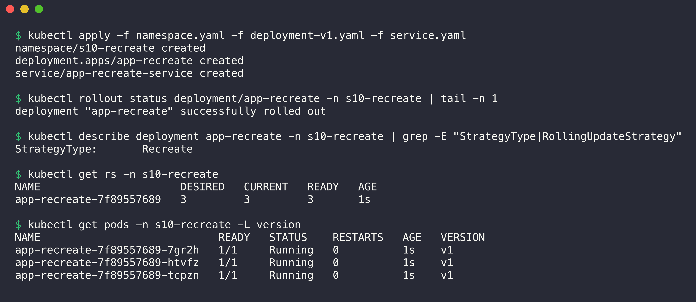
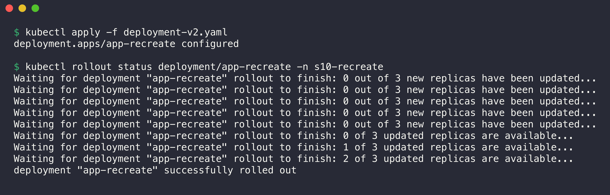
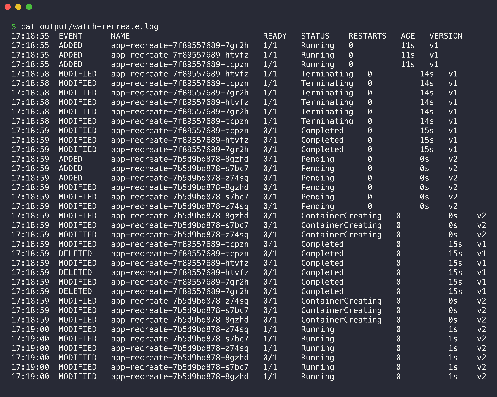
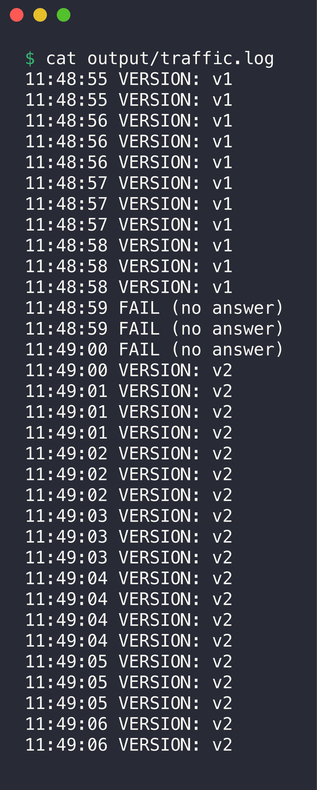
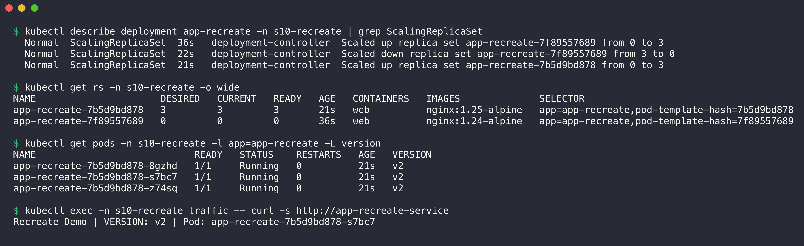

# 04. Recreate Deployment

**Namespace:** `s10-recreate`

| File | Content |
| --- | --- |
| [namespace.yaml](namespace.yaml) | The Namespace `s10-recreate` |
| [deployment-v1.yaml](deployment-v1.yaml) | Deployment `app-recreate`, 3 replicas, `strategy: Recreate`, `nginx:1.24-alpine`, label `version: v1` |
| [deployment-v2.yaml](deployment-v2.yaml) | The same Deployment with `nginx:1.25-alpine` and label `version: v2` |
| [service.yaml](service.yaml) | ClusterIP Service `app-recreate-service` |
| [output/watch-recreate.log](output/watch-recreate.log) | `kubectl get pods -w` during the update, with a time stamp on each line (Mac time, IST) |
| [output/traffic.log](output/traffic.log) | One request about every 0.3 seconds during the update (curl Pod time, UTC) |

## How the strategy works

```yaml
  strategy:
    type: Recreate
```

With `Recreate`, the Deployment controller first decreases the old ReplicaSet to 0. It waits until all old Pods stop. Then it increases the new ReplicaSet to the full count. Two versions never run at the same time. The disadvantage is a short downtime between the two steps. Use this strategy when two versions cannot run together, for example because of a database schema change or a shared volume with `ReadWriteOnce` access.

## Step 1: Deploy the application (v1)

1. Apply the Namespace, the v1 Deployment and the Service.
2. Examine the strategy type and the Pods.

```bash
kubectl apply -f namespace.yaml -f deployment-v1.yaml -f service.yaml
kubectl rollout status deployment/app-recreate -n s10-recreate
kubectl describe deployment app-recreate -n s10-recreate | grep -E "StrategyType|RollingUpdateStrategy"
kubectl get rs -n s10-recreate
kubectl get pods -n s10-recreate -L version
```



```console
$ kubectl apply -f namespace.yaml -f deployment-v1.yaml -f service.yaml
namespace/s10-recreate created
deployment.apps/app-recreate created
service/app-recreate-service created

$ kubectl rollout status deployment/app-recreate -n s10-recreate | tail -n 1
deployment "app-recreate" successfully rolled out

$ kubectl describe deployment app-recreate -n s10-recreate | grep -E "StrategyType|RollingUpdateStrategy"
StrategyType:       Recreate

$ kubectl get rs -n s10-recreate
NAME                      DESIRED   CURRENT   READY   AGE
app-recreate-7f89557689   3         3         3       1s

$ kubectl get pods -n s10-recreate -L version
NAME                            READY   STATUS    RESTARTS   AGE   VERSION
app-recreate-7f89557689-7gr2h   1/1     Running   0          1s    v1
app-recreate-7f89557689-htvfz   1/1     Running   0          1s    v1
app-recreate-7f89557689-tcpzn   1/1     Running   0          1s    v1
```

The strategy type is `Recreate`. Unlike the rolling update, there is no `RollingUpdateStrategy` line, because `maxSurge` and `maxUnavailable` do not apply.

## Step 2: Update the application (v2)

1. Start a curl Pod that sends a request to the Service about every 0.3 seconds.
2. Start `kubectl get pods -w` in the background and add a time stamp to each line.
3. Apply the v2 Deployment.
4. Monitor the rollout until it completes.

```bash
kubectl run traffic -n s10-recreate --image=curlimages/curl --restart=Never -- sh -c \
  'while true; do echo "$(date +%T) $(curl -s -m 1 http://app-recreate-service | grep -o "VERSION: v[0-9]" || echo "FAIL (no answer)")"; sleep 0.3; done'
( kubectl get pods -n s10-recreate -l app=app-recreate -L version -w --output-watch-events \
  | while IFS= read -r l; do echo "$(date +%T)  $l"; done ) > output/watch-recreate.log &
kubectl apply -f deployment-v2.yaml
kubectl rollout status deployment/app-recreate -n s10-recreate
```



```console
$ kubectl apply -f deployment-v2.yaml
deployment.apps/app-recreate configured

$ kubectl rollout status deployment/app-recreate -n s10-recreate
Waiting for deployment "app-recreate" rollout to finish: 0 out of 3 new replicas have been updated...
Waiting for deployment "app-recreate" rollout to finish: 0 out of 3 new replicas have been updated...
Waiting for deployment "app-recreate" rollout to finish: 0 out of 3 new replicas have been updated...
Waiting for deployment "app-recreate" rollout to finish: 0 out of 3 new replicas have been updated...
Waiting for deployment "app-recreate" rollout to finish: 0 out of 3 new replicas have been updated...
Waiting for deployment "app-recreate" rollout to finish: 0 of 3 updated replicas are available...
Waiting for deployment "app-recreate" rollout to finish: 1 of 3 updated replicas are available...
Waiting for deployment "app-recreate" rollout to finish: 2 of 3 updated replicas are available...
deployment "app-recreate" successfully rolled out
```

The status stays at `0 out of 3 new replicas have been updated` while the old Pods stop. No new Pod exists in this period.

## Step 3: Observe the old Pods being terminated before new Pods are created



```console
$ cat output/watch-recreate.log
17:18:55  EVENT      NAME                            READY   STATUS    RESTARTS   AGE   VERSION
17:18:55  ADDED      app-recreate-7f89557689-7gr2h   1/1     Running   0          11s   v1
17:18:55  ADDED      app-recreate-7f89557689-htvfz   1/1     Running   0          11s   v1
17:18:55  ADDED      app-recreate-7f89557689-tcpzn   1/1     Running   0          11s   v1
17:18:58  MODIFIED   app-recreate-7f89557689-htvfz   1/1     Terminating   0          14s   v1
17:18:58  MODIFIED   app-recreate-7f89557689-tcpzn   1/1     Terminating   0          14s   v1
17:18:58  MODIFIED   app-recreate-7f89557689-7gr2h   1/1     Terminating   0          14s   v1
17:18:58  MODIFIED   app-recreate-7f89557689-htvfz   1/1     Terminating   0          14s   v1
17:18:58  MODIFIED   app-recreate-7f89557689-7gr2h   1/1     Terminating   0          14s   v1
17:18:58  MODIFIED   app-recreate-7f89557689-tcpzn   1/1     Terminating   0          14s   v1
17:18:59  MODIFIED   app-recreate-7f89557689-tcpzn   0/1     Completed     0          15s   v1
17:18:59  MODIFIED   app-recreate-7f89557689-htvfz   0/1     Completed     0          15s   v1
17:18:59  MODIFIED   app-recreate-7f89557689-7gr2h   0/1     Completed     0          15s   v1
17:18:59  ADDED      app-recreate-7b5d9bd878-8gzhd   0/1     Pending       0          0s    v2
17:18:59  ADDED      app-recreate-7b5d9bd878-s7bc7   0/1     Pending       0          0s    v2
17:18:59  ADDED      app-recreate-7b5d9bd878-z74sq   0/1     Pending       0          0s    v2
17:18:59  MODIFIED   app-recreate-7b5d9bd878-8gzhd   0/1     Pending       0          0s    v2
17:18:59  MODIFIED   app-recreate-7b5d9bd878-s7bc7   0/1     Pending       0          0s    v2
17:18:59  MODIFIED   app-recreate-7b5d9bd878-z74sq   0/1     Pending       0          0s    v2
17:18:59  MODIFIED   app-recreate-7b5d9bd878-8gzhd   0/1     ContainerCreating   0          0s    v2
17:18:59  MODIFIED   app-recreate-7b5d9bd878-s7bc7   0/1     ContainerCreating   0          0s    v2
17:18:59  MODIFIED   app-recreate-7b5d9bd878-z74sq   0/1     ContainerCreating   0          0s    v2
17:18:59  MODIFIED   app-recreate-7f89557689-tcpzn   0/1     Completed           0          15s   v1
17:18:59  DELETED    app-recreate-7f89557689-tcpzn   0/1     Completed           0          15s   v1
17:18:59  MODIFIED   app-recreate-7f89557689-htvfz   0/1     Completed           0          15s   v1
17:18:59  DELETED    app-recreate-7f89557689-htvfz   0/1     Completed           0          15s   v1
17:18:59  MODIFIED   app-recreate-7f89557689-7gr2h   0/1     Completed           0          15s   v1
17:18:59  DELETED    app-recreate-7f89557689-7gr2h   0/1     Completed           0          15s   v1
17:18:59  MODIFIED   app-recreate-7b5d9bd878-z74sq   0/1     ContainerCreating   0          0s    v2
17:18:59  MODIFIED   app-recreate-7b5d9bd878-s7bc7   0/1     ContainerCreating   0          0s    v2
17:18:59  MODIFIED   app-recreate-7b5d9bd878-8gzhd   0/1     ContainerCreating   0          0s    v2
17:19:00  MODIFIED   app-recreate-7b5d9bd878-z74sq   1/1     Running             0          1s    v2
17:19:00  MODIFIED   app-recreate-7b5d9bd878-s7bc7   1/1     Running             0          1s    v2
17:19:00  MODIFIED   app-recreate-7b5d9bd878-z74sq   1/1     Running             0          1s    v2
17:19:00  MODIFIED   app-recreate-7b5d9bd878-8gzhd   0/1     Running             0          1s    v2
17:19:00  MODIFIED   app-recreate-7b5d9bd878-s7bc7   1/1     Running             0          1s    v2
17:19:00  MODIFIED   app-recreate-7b5d9bd878-8gzhd   1/1     Running             0          1s    v2
```

The order of the events shows the Recreate strategy:

1. At 17:18:58, all three v1 Pods went to `Terminating` at the same time.
2. At 17:18:59, all three v1 containers stopped (`Completed`, `0/1`).
3. Only after that, Kubernetes added the three v2 Pods (`Pending`, age `0s`).
4. At 17:19:00, all three v2 Pods were `Running`.

The `DELETED` lines of the v1 Pods come in the same second as the new Pods. The controller waits until the old Pods no longer run. It does not wait for the API objects to be removed. nginx stops in less than one second, so the gap is short.



```console
$ cat output/traffic.log
11:48:55 VERSION: v1
11:48:55 VERSION: v1
11:48:56 VERSION: v1
11:48:56 VERSION: v1
11:48:56 VERSION: v1
11:48:57 VERSION: v1
11:48:57 VERSION: v1
11:48:57 VERSION: v1
11:48:58 VERSION: v1
11:48:58 VERSION: v1
11:48:58 VERSION: v1
11:48:59 FAIL (no answer)
11:48:59 FAIL (no answer)
11:49:00 FAIL (no answer)
11:49:00 VERSION: v2
11:49:01 VERSION: v2
11:49:01 VERSION: v2
11:49:01 VERSION: v2
11:49:02 VERSION: v2
11:49:02 VERSION: v2
11:49:02 VERSION: v2
11:49:03 VERSION: v2
11:49:03 VERSION: v2
11:49:03 VERSION: v2
11:49:04 VERSION: v2
11:49:04 VERSION: v2
11:49:04 VERSION: v2
11:49:04 VERSION: v2
11:49:05 VERSION: v2
11:49:05 VERSION: v2
11:49:05 VERSION: v2
11:49:06 VERSION: v2
11:49:06 VERSION: v2
```

- Three requests failed between 11:48:59 and 11:49:00 UTC (17:18:59 to 17:19:00 IST). This is the downtime of the Recreate strategy.
- No request got a mix of v1 and v2. After the gap, only v2 answered.
- The downtime was about 1.5 seconds because nginx stops and starts fast. An application with a slow start or a long shutdown has a longer downtime.

## Step 4: Verify the result



```console
$ kubectl describe deployment app-recreate -n s10-recreate | grep ScalingReplicaSet
  Normal  ScalingReplicaSet  36s   deployment-controller  Scaled up replica set app-recreate-7f89557689 from 0 to 3
  Normal  ScalingReplicaSet  22s   deployment-controller  Scaled down replica set app-recreate-7f89557689 from 3 to 0
  Normal  ScalingReplicaSet  21s   deployment-controller  Scaled up replica set app-recreate-7b5d9bd878 from 0 to 3

$ kubectl get rs -n s10-recreate -o wide
NAME                      DESIRED   CURRENT   READY   AGE   CONTAINERS   IMAGES              SELECTOR
app-recreate-7b5d9bd878   3         3         3       21s   web          nginx:1.25-alpine   app=app-recreate,pod-template-hash=7b5d9bd878
app-recreate-7f89557689   0         0         0       36s   web          nginx:1.24-alpine   app=app-recreate,pod-template-hash=7f89557689

$ kubectl get pods -n s10-recreate -l app=app-recreate -L version
NAME                            READY   STATUS    RESTARTS   AGE   VERSION
app-recreate-7b5d9bd878-8gzhd   1/1     Running   0          21s   v2
app-recreate-7b5d9bd878-s7bc7   1/1     Running   0          21s   v2
app-recreate-7b5d9bd878-z74sq   1/1     Running   0          21s   v2

$ kubectl exec -n s10-recreate traffic -- curl -s http://app-recreate-service
Recreate Demo | VERSION: v2 | Pod: app-recreate-7b5d9bd878-s7bc7
```

Compare these events with the rolling update. The rolling update had many small steps (4 to 3, 1 to 2, and so on). The Recreate strategy has only two steps: "scaled down from 3 to 0", then "scaled up from 0 to 3".

## Clean up

```bash
kubectl delete namespace s10-recreate
```
