# Session 10: Kubernetes Pods, ReplicaSets & Deployments

**Name:** Kartavya Panchal  
**Roll No.:** 24BCS10343

```
Kubernetes-Pods-ReplicaSets-&-Deployments/
├── 01-rolling-update/      YAML + README (steps and output) + output/ logs
├── 02-blue-green/          YAML + README + output/ logs
├── 03-canary/              YAML + README; ingress/ has the ingress-nginx canary method
├── 04-recreate/            YAML + README + output/ logs
├── pod-lifecycle/          the 12 Pod lifecycle YAML files + output/ logs
├── screenshots/
└── README.md               this file
```

Environment: Minikube v1.39.0 (Docker driver, arm64), Kubernetes v1.37.0, containerd 2.3.4. All images (`nginx:*-alpine`, `nginx:1.27`, `busybox:1.36`, `curlimages/curl`) are multi-arch and run natively on arm64.

I copied the YAML files from the class material and changed them in these ways:

- Each object has a Namespace (`s10-rolling`, `s10-bluegreen`, `s10-canary`, `s10-recreate`, `s10-lifecycle`). Thus the labs of the other sessions on the same cluster do not interfere.
- The Services are `ClusterIP`, not `NodePort`. The node IP is not reachable from the Mac. Thus I tested from a curl Pod in the cluster and with `kubectl port-forward` (ports 18010 and 18011).
- The `postStart` hook writes one short line with the version and the Pod name. This makes it easy to count the answers for each version with `grep` and `uniq -c`.
- Each YAML file has a short comment that tells what it shows.

I removed all five Namespaces at the end.

---

## Task 1: Deployment Strategies

| Strategy | Two versions at the same time? | Downtime | Traffic control | Extra resources |
| --- | --- | --- | --- | --- |
| Rolling Update | Yes, for a short time | None (measured: 0 of 141 requests failed) | Gradual, by Pod count | `maxSurge` Pods (here +1) |
| Blue-Green | Both run, but only one gets traffic | None (measured: 0 failed) | All traffic switches at once | A full second copy |
| Canary | Yes, on purpose | None | Small share (measured: about 10%) | Small (1 canary Pod) |
| Recreate | No | Yes (measured: 3 failed requests, about 1.5 s) | None | None |

Each strategy has its own folder with the YAML files, all steps, all commands and all output. This section shows the main evidence.

### 01. Rolling Update

Full steps and output: [01-rolling-update/README.md](01-rolling-update/README.md)

- **Create Deployment:** [deployment-v1.yaml](01-rolling-update/deployment-v1.yaml) runs 4 Pods of `nginx:1.24-alpine` (v1).
- **Configure rolling update:** `maxSurge: 1`, `maxUnavailable: 0`, `minReadySeconds: 5`, and a readiness probe.
- **Perform an application update:** `kubectl apply -f deployment-v2.yaml` changes the image to `nginx:1.25-alpine` (v2).
- **Verify old and new Pods:** a timestamped `kubectl get pods -w`, a traffic log, the ReplicaSets and the rollout history.


```console
$ kubectl get rs -n s10-rolling -o wide
NAME                     DESIRED   CURRENT   READY   AGE    CONTAINERS   IMAGES              SELECTOR
app-rolling-558b678cb4   0         0         0       118s   web          nginx:1.24-alpine   app=app-rolling,pod-template-hash=558b678cb4
app-rolling-6d4f45cbb7   4         4         4       83s    web          nginx:1.25-alpine   app=app-rolling,pod-template-hash=6d4f45cbb7

$ kubectl rollout history deployment/app-rolling -n s10-rolling
deployment.apps/app-rolling 
REVISION  CHANGE-CAUSE
1         Initial release v1 (nginx:1.24-alpine)
2         Update to v2 (nginx:1.25-alpine)
```

Kubernetes created one v2 Pod, waited until it was Ready for 5 seconds, and then stopped one v1 Pod. It repeated this 4 times. During the update, v1 and v2 answered at the same time. None of the 141 requests failed. The old ReplicaSet stays with 0 replicas for a rollback. I also did a rollback to revision 1 with `kubectl rollout undo`.

### 02. Blue-Green Deployment

Full steps and output: [02-blue-green/README.md](02-blue-green/README.md)

- **Create Blue version:** [deployment-blue.yaml](02-blue-green/deployment-blue.yaml), 3 Pods, v1, label `slot: blue`.
- **Create Green version:** [deployment-green.yaml](02-blue-green/deployment-green.yaml), 3 Pods, v2, label `slot: green`.
- **Switch traffic between versions:** apply [service-green.yaml](02-blue-green/service-green.yaml). Only the selector value changes (`slot: blue` to `slot: green`).
- **Verify the active version:** the Service selector, the endpoints, 20 requests, a traffic log and a browser screenshot.

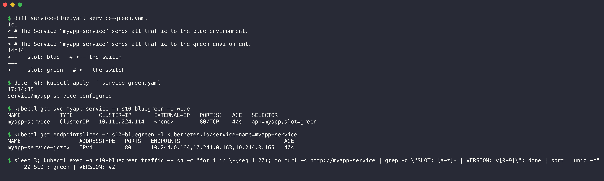

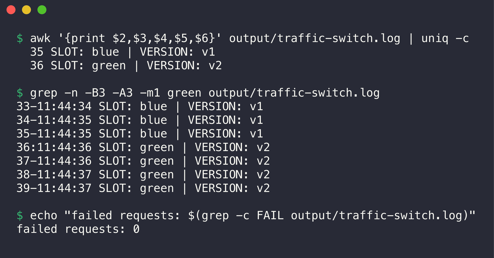

```console
$ awk '{print $2,$3,$4,$5,$6}' output/traffic-switch.log | uniq -c
  35 SLOT: blue | VERSION: v1
  36 SLOT: green | VERSION: v2
```

| Before the switch | After the switch |
| --- | --- |
|  |  |

The traffic changed from blue to green in one step, about one second after `kubectl apply`. There was no mix of versions and no failed request. A rollback is one more selector change (`kubectl patch`). After that test, I promoted green again and scaled blue to 0.

### 03. Canary Deployment

Full steps and output: [03-canary/README.md](03-canary/README.md)

- **Deploy stable version:** [deployment-stable.yaml](03-canary/deployment-stable.yaml), 9 Pods, v1.
- **Deploy canary version:** [deployment-canary.yaml](03-canary/deployment-canary.yaml), 1 Pod, v2.
- **Route a small percentage of traffic to Canary:** method 1 with a shared Service (replica ratio 9:1). Method 2 with the ingress-nginx annotations `canary-weight: "10"` and `canary-by-header: X-Canary`.
- **Verify both versions:** I sent 500 requests for each test and counted the answers for each version.


| Test (500 requests each) | Canary (v2) | Stable (v1) | Canary share |
| --- | --- | --- | --- |
| Replica ratio 9:1, run 1 | 48 | 452 | 9.6% |
| Replica ratio 9:1, run 2 | 40 | 460 | 8.0% |
| ingress-nginx `canary-weight: "10"` | 56 | 444 | 11.2% |
| ingress-nginx `canary-weight: "30"` | 143 | 357 | 28.6% |

Both methods sent about 10% of the requests to the canary. With the replica ratio, the share depends on the Pod count. With ingress-nginx, the weight sets the share, and the Pod count did not change when I increased the weight to 30. The header `X-Canary: always` sent 20 of 20 requests to the canary.

### 04. Recreate Deployment

Full steps and output: [04-recreate/README.md](04-recreate/README.md)

- **Deploy the application:** [deployment-v1.yaml](04-recreate/deployment-v1.yaml), 3 Pods, `strategy: Recreate`.
- **Update the application:** `kubectl apply -f deployment-v2.yaml`.
- **Observe the old Pods being terminated before new Pods are created:** a timestamped `kubectl get pods -w`, a traffic log and the Deployment events.


```console
17:18:58  MODIFIED   app-recreate-7f89557689-htvfz   1/1     Terminating   0          14s   v1
17:18:58  MODIFIED   app-recreate-7f89557689-tcpzn   1/1     Terminating   0          14s   v1
17:18:58  MODIFIED   app-recreate-7f89557689-7gr2h   1/1     Terminating   0          14s   v1
...
17:18:59  MODIFIED   app-recreate-7f89557689-tcpzn   0/1     Completed     0          15s   v1
17:18:59  MODIFIED   app-recreate-7f89557689-htvfz   0/1     Completed     0          15s   v1
17:18:59  MODIFIED   app-recreate-7f89557689-7gr2h   0/1     Completed     0          15s   v1
17:18:59  ADDED      app-recreate-7b5d9bd878-8gzhd   0/1     Pending       0          0s    v2
17:18:59  ADDED      app-recreate-7b5d9bd878-s7bc7   0/1     Pending       0          0s    v2
17:18:59  ADDED      app-recreate-7b5d9bd878-z74sq   0/1     Pending       0          0s    v2
```

(Lines from [04-recreate/output/watch-recreate.log](04-recreate/output/watch-recreate.log). The full log is in the screenshot.)


All three v1 Pods went to `Terminating` at the same time. Kubernetes added the v2 Pods only after all v1 containers stopped. The events show only two steps: "scaled down from 3 to 0", then "scaled up from 0 to 3". The traffic log shows 3 failed requests between the last v1 answer and the first v2 answer. This is the downtime of the Recreate strategy.

---

## Task 2: Pod Lifecycle

### Pod phases, container states and the STATUS column

| Pod phase (`.status.phase`) | Meaning |
| --- | --- |
| `Pending` | The API server accepted the Pod, but one or more containers do not run yet (not scheduled, image pull, init containers). |
| `Running` | The Pod is on a node and at least one container runs or restarts. |
| `Succeeded` | All containers stopped with exit code 0 and will not restart. |
| `Failed` | All containers stopped and at least one stopped with an error. |
| `Unknown` | The control plane cannot get the state of the Pod (usually a lost node). |

Each container has its own state: `Waiting`, `Running` or `Terminated`. The STATUS column of `kubectl get pods` is not the phase. It shows the most useful reason, for example `ContainerCreating`, `Completed`, `Error`, `CrashLoopBackOff`, `ImagePullBackOff`, `Init:0/1` or `Terminating`. For this reason, I show the phase and the container state with `jsonpath` for each example.

### Procedure

For each YAML file in [pod-lifecycle/](pod-lifecycle/):

1. Apply the YAML file.
2. Check the Pod status with `kubectl get pod`.
3. Check the Pod details with `kubectl describe pod` (only the relevant lines, with `grep`) and `kubectl get pod -o jsonpath`.
4. Capture the output, and the logs if they help.
5. Explain the result.

Before the first file, I applied [00-namespace.yaml](pod-lifecycle/00-namespace.yaml). I also started a watch on all Pods in the background. The watch adds the time of the Mac (IST) to each line:

```bash
kubectl apply -f pod-lifecycle/00-namespace.yaml
( kubectl get pods -n s10-lifecycle -w --output-watch-events \
  | while IFS= read -r l; do echo "$(date +%T)  $l"; done ) > pod-lifecycle/output/watch-all.log &
```

The full watch log is in [pod-lifecycle/output/watch-all.log](pod-lifecycle/output/watch-all.log). All commands below run in the `pod-lifecycle/` folder.

### 1. Running ([01-running.yaml](pod-lifecycle/01-running.yaml))

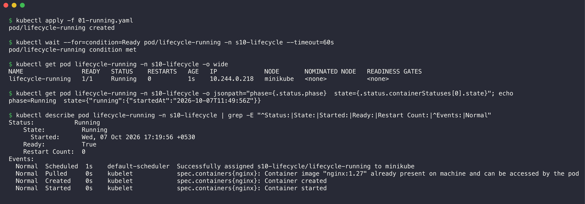

```console
$ kubectl apply -f 01-running.yaml
pod/lifecycle-running created

$ kubectl wait --for=condition=Ready pod/lifecycle-running -n s10-lifecycle --timeout=60s
pod/lifecycle-running condition met

$ kubectl get pod lifecycle-running -n s10-lifecycle -o wide
NAME                READY   STATUS    RESTARTS   AGE   IP             NODE       NOMINATED NODE   READINESS GATES
lifecycle-running   1/1     Running   0          1s    10.244.0.218   minikube   <none>           <none>

$ kubectl get pod lifecycle-running -n s10-lifecycle -o jsonpath="phase={.status.phase}  state={.status.containerStatuses[0].state}"; echo
phase=Running  state={"running":{"startedAt":"2026-10-07T11:49:56Z"}}

$ kubectl describe pod lifecycle-running -n s10-lifecycle | grep -E "^Status:|State:|Started:|Ready:|Restart Count:|^Events:|Normal"
Status:           Running
    State:          Running
      Started:      Wed, 07 Oct 2026 17:19:56 +0530
    Ready:          True
    Restart Count:  0
Events:
  Normal  Scheduled  1s    default-scheduler  Successfully assigned s10-lifecycle/lifecycle-running to minikube
  Normal  Pulled     0s    kubelet            spec.containers{nginx}: Container image "nginx:1.27" already present on machine and can be accessed by the pod
  Normal  Created    0s    kubelet            spec.containers{nginx}: Container created
  Normal  Started    0s    kubelet            spec.containers{nginx}: Container started
```

**Observation:** This is the normal path. The scheduler assigned the Pod to the node. The kubelet found the image on the node, created the container and started it. The phase is `Running`, the container state is `running`, and the Pod is `Ready` with 0 restarts. The nginx process does not stop, so the Pod stays in this state.

### 2. Pending ([02-pending.yaml](pod-lifecycle/02-pending.yaml))

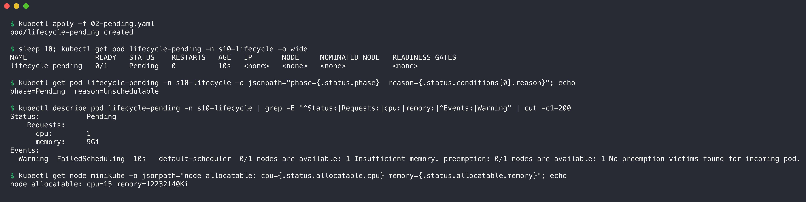

```console
$ kubectl apply -f 02-pending.yaml
pod/lifecycle-pending created

$ sleep 10; kubectl get pod lifecycle-pending -n s10-lifecycle -o wide
NAME                READY   STATUS    RESTARTS   AGE   IP       NODE     NOMINATED NODE   READINESS GATES
lifecycle-pending   0/1     Pending   0          10s   <none>   <none>   <none>           <none>

$ kubectl get pod lifecycle-pending -n s10-lifecycle -o jsonpath="phase={.status.phase}  reason={.status.conditions[0].reason}"; echo
phase=Pending  reason=Unschedulable

$ kubectl describe pod lifecycle-pending -n s10-lifecycle | grep -E "^Status:|Requests:|cpu:|memory:|^Events:|Warning" | cut -c1-200
Status:           Pending
    Requests:
      cpu:        1
      memory:     9Gi
Events:
  Warning  FailedScheduling  10s   default-scheduler  0/1 nodes are available: 1 Insufficient memory. preemption: 0/1 nodes are available: 1 No preemption victims found for incoming pod.

$ kubectl get node minikube -o jsonpath="node allocatable: cpu={.status.allocatable.cpu} memory={.status.allocatable.memory}"; echo
node allocatable: cpu=15 memory=12232140Ki
```

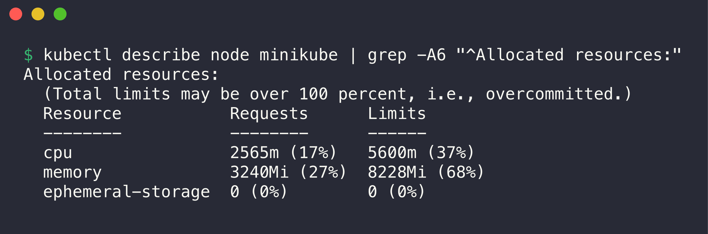

```console
$ kubectl describe node minikube | grep -A6 "^Allocated resources:"
Allocated resources:
  (Total limits may be over 100 percent, i.e., overcommitted.)
  Resource           Requests      Limits
  --------           --------      ------
  cpu                2565m (17%)   5600m (37%)
  memory             3240Mi (27%)  8228Mi (68%)
  ephemeral-storage  0 (0%)        0 (0%)
```

**Observation:** The Pod has no node and no IP. The condition `PodScheduled` has the reason `Unschedulable`. The scheduler event says `Insufficient memory`. With the Docker driver, the node reports the memory of the Docker Desktop VM: 12232140Ki (about 11945Mi). Other Pods already requested 3240Mi. The free amount (about 8705Mi) is less than the 9Gi (9216Mi) that this Pod requests. Preemption cannot help, because no Pod with a lower priority can be removed.

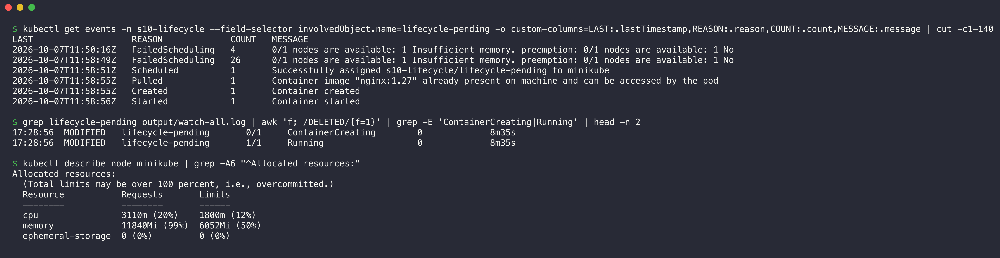

```console
$ kubectl get events -n s10-lifecycle --field-selector involvedObject.name=lifecycle-pending -o custom-columns=LAST:.lastTimestamp,REASON:.reason,COUNT:.count,MESSAGE:.message | cut -c1-140
LAST                   REASON             COUNT   MESSAGE
2026-10-07T11:50:16Z   FailedScheduling   4       0/1 nodes are available: 1 Insufficient memory. preemption: 0/1 nodes are available: 1 No 
2026-10-07T11:58:49Z   FailedScheduling   26      0/1 nodes are available: 1 Insufficient memory. preemption: 0/1 nodes are available: 1 No 
2026-10-07T11:58:51Z   Scheduled          1       Successfully assigned s10-lifecycle/lifecycle-pending to minikube
2026-10-07T11:58:55Z   Pulled             1       Container image "nginx:1.27" already present on machine and can be accessed by the pod
2026-10-07T11:58:55Z   Created            1       Container created
2026-10-07T11:58:56Z   Started            1       Container started

$ grep lifecycle-pending output/watch-all.log | awk 'f; /DELETED/{f=1}' | grep -E 'ContainerCreating|Running' | head -n 2
17:28:56  MODIFIED   lifecycle-pending       0/1     ContainerCreating        0             8m35s
17:28:56  MODIFIED   lifecycle-pending       1/1     Running                  0             8m35s

$ kubectl describe node minikube | grep -A6 "^Allocated resources:"
Allocated resources:
  (Total limits may be over 100 percent, i.e., overcommitted.)
  Resource           Requests       Limits
  --------           --------       ------
  cpu                3110m (20%)    1800m (12%)
  memory             11840Mi (99%)  6052Mi (50%)
  ephemeral-storage  0 (0%)         0 (0%)
```

**Extra observation:** Labs from other sessions ran on this cluster at the same time. About 8.5 minutes later, some of their Pods stopped and released memory. The scheduler tried again (26 more `FailedScheduling` events) and then placed the Pod. After that, the node had 11840Mi (99%) of memory requested. This shows that `Pending` is not a final state. The scheduler keeps trying until the resources are free. On a cluster with more load, this Pod stays `Pending`.

### 3. Succeeded ([03-succeeded.yaml](pod-lifecycle/03-succeeded.yaml))

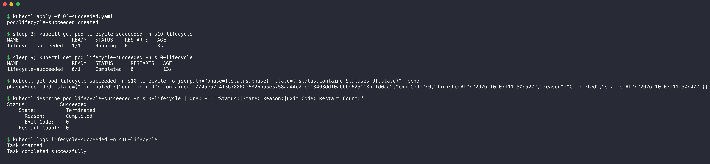

```console
$ kubectl apply -f 03-succeeded.yaml
pod/lifecycle-succeeded created

$ sleep 3; kubectl get pod lifecycle-succeeded -n s10-lifecycle
NAME                  READY   STATUS    RESTARTS   AGE
lifecycle-succeeded   1/1     Running   0          3s

$ sleep 9; kubectl get pod lifecycle-succeeded -n s10-lifecycle
NAME                  READY   STATUS      RESTARTS   AGE
lifecycle-succeeded   0/1     Completed   0          13s

$ kubectl get pod lifecycle-succeeded -n s10-lifecycle -o jsonpath="phase={.status.phase}  state={.status.containerStatuses[0].state}"; echo
phase=Succeeded  state={"terminated":{"containerID":"containerd://45e57c4f3678860d6826ba5e5758aa44c2ecc13403ddf0abbbd625118bcfd0cc","exitCode":0,"finishedAt":"2026-10-07T11:50:52Z","reason":"Completed","startedAt":"2026-10-07T11:50:47Z"}}

$ kubectl describe pod lifecycle-succeeded -n s10-lifecycle | grep -E "^Status:|State:|Reason:|Exit Code:|Restart Count:"
Status:           Succeeded
    State:          Terminated
      Reason:       Completed
      Exit Code:    0
    Restart Count:  0

$ kubectl logs lifecycle-succeeded -n s10-lifecycle
Task started
Task completed successfully
```

**Observation:** The container ran for 5 seconds (`startedAt` 11:50:47, `finishedAt` 11:50:52) and exited with code 0. Because `restartPolicy: Never`, the kubelet did not start it again. The STATUS column shows `Completed`, and the phase is `Succeeded`. The logs stay available after the container stops. Jobs use this behaviour.

### 4. Failed ([04-failed.yaml](pod-lifecycle/04-failed.yaml))

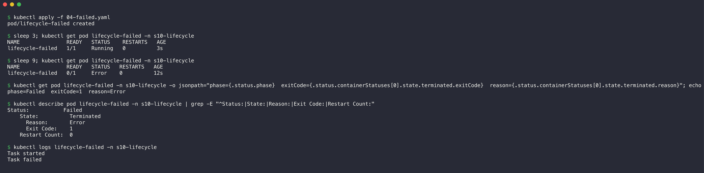

```console
$ kubectl apply -f 04-failed.yaml
pod/lifecycle-failed created

$ sleep 3; kubectl get pod lifecycle-failed -n s10-lifecycle
NAME               READY   STATUS    RESTARTS   AGE
lifecycle-failed   1/1     Running   0          3s

$ sleep 9; kubectl get pod lifecycle-failed -n s10-lifecycle
NAME               READY   STATUS   RESTARTS   AGE
lifecycle-failed   0/1     Error    0          12s

$ kubectl get pod lifecycle-failed -n s10-lifecycle -o jsonpath="phase={.status.phase}  exitCode={.status.containerStatuses[0].state.terminated.exitCode}  reason={.status.containerStatuses[0].state.terminated.reason}"; echo
phase=Failed  exitCode=1  reason=Error

$ kubectl describe pod lifecycle-failed -n s10-lifecycle | grep -E "^Status:|State:|Reason:|Exit Code:|Restart Count:"
Status:           Failed
    State:          Terminated
      Reason:       Error
      Exit Code:    1
    Restart Count:  0

$ kubectl logs lifecycle-failed -n s10-lifecycle
Task started
Task failed
```

**Observation:** This Pod is the same as the Succeeded Pod, but the script exits with code 1. The non-zero exit code gives the reason `Error` and the phase `Failed`. `restartPolicy: Never` stops a restart, so the restart count stays 0. The logs show the last message before the failure.

### 5. CrashLoopBackOff ([05-crashloopbackoff.yaml](pod-lifecycle/05-crashloopbackoff.yaml))

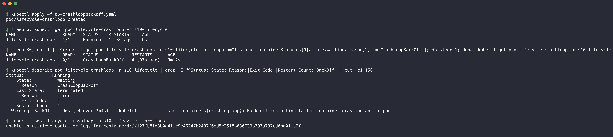

```console
$ kubectl apply -f 05-crashloopbackoff.yaml
pod/lifecycle-crashloop created

$ sleep 6; kubectl get pod lifecycle-crashloop -n s10-lifecycle
NAME                  READY   STATUS    RESTARTS     AGE
lifecycle-crashloop   1/1     Running   1 (3s ago)   6s

$ sleep 30; until [ "$(kubectl get pod lifecycle-crashloop -n s10-lifecycle -o jsonpath="{.status.containerStatuses[0].state.waiting.reason}")" = CrashLoopBackOff ]; do sleep 1; done; kubectl get pod lifecycle-crashloop -n s10-lifecycle
NAME                  READY   STATUS             RESTARTS      AGE
lifecycle-crashloop   0/1     CrashLoopBackOff   4 (97s ago)   3m12s

$ kubectl describe pod lifecycle-crashloop -n s10-lifecycle | grep -E "^Status:|State:|Reason:|Exit Code:|Restart Count:|BackOff" | cut -c1-150
Status:           Running
    State:          Waiting
      Reason:       CrashLoopBackOff
    Last State:     Terminated
      Reason:       Error
      Exit Code:    1
    Restart Count:  4
  Warning  BackOff    96s (x4 over 3m4s)    kubelet            spec.containers{crashing-app}: Back-off restarting failed container crashing-app in pod

$ kubectl logs lifecycle-crashloop -n s10-lifecycle --previous
unable to retrieve container logs for containerd://127fb81d8b0a411c9e46247b2487f6ed5e2518b036739b797a797cd6bd0f1a2f
```

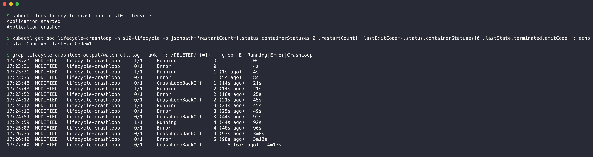

```console
$ kubectl logs lifecycle-crashloop -n s10-lifecycle
Application started
Application crashed

$ kubectl get pod lifecycle-crashloop -n s10-lifecycle -o jsonpath="restartCount={.status.containerStatuses[0].restartCount}  lastExitCode={.status.containerStatuses[0].lastState.terminated.exitCode}"; echo
restartCount=5  lastExitCode=1

$ grep lifecycle-crashloop output/watch-all.log | awk 'f; /DELETED/{f=1}' | grep -E 'Running|Error|CrashLoop'
17:23:27  MODIFIED   lifecycle-crashloop     1/1     Running             0             0s
17:23:31  MODIFIED   lifecycle-crashloop     0/1     Error               0             4s
17:23:31  MODIFIED   lifecycle-crashloop     1/1     Running             1 (1s ago)    4s
17:23:35  MODIFIED   lifecycle-crashloop     0/1     Error               1 (5s ago)    8s
17:23:48  MODIFIED   lifecycle-crashloop     0/1     CrashLoopBackOff    1 (14s ago)   21s
17:23:48  MODIFIED   lifecycle-crashloop     1/1     Running             2 (14s ago)   21s
17:23:52  MODIFIED   lifecycle-crashloop     0/1     Error               2 (18s ago)   25s
17:24:12  MODIFIED   lifecycle-crashloop     0/1     CrashLoopBackOff    2 (21s ago)   45s
17:24:12  MODIFIED   lifecycle-crashloop     1/1     Running             3 (21s ago)   45s
17:24:16  MODIFIED   lifecycle-crashloop     0/1     Error               3 (25s ago)   49s
17:24:59  MODIFIED   lifecycle-crashloop     0/1     CrashLoopBackOff    3 (44s ago)   92s
17:24:59  MODIFIED   lifecycle-crashloop     1/1     Running             4 (44s ago)   92s
17:25:03  MODIFIED   lifecycle-crashloop     0/1     Error               4 (48s ago)   96s
17:26:35  MODIFIED   lifecycle-crashloop     0/1     CrashLoopBackOff    4 (93s ago)   3m8s
17:26:40  MODIFIED   lifecycle-crashloop     0/1     Error               5 (98s ago)   3m13s
17:27:40  MODIFIED   lifecycle-crashloop     0/1     CrashLoopBackOff         5 (67s ago)   4m13s
```

**Observation:** The default `restartPolicy` is `Always`. The container runs for 4 seconds and exits with code 1 each time. The watch shows the cycle `Running` then `Error` then `CrashLoopBackOff`. The wait before each restart increases: about 13 s, 20 s, 43 s, 92 s. The kubelet doubles the back-off delay after each crash, to a maximum of 5 minutes. The phase stays `Running`, because the kubelet still tries to run the container.

**Note:** `kubectl logs --previous` failed. In the `CrashLoopBackOff` state, the "current" container is the last one that stopped, and the kubelet already removed the container before it. `kubectl logs` without `--previous` showed the logs of the last crash.

### 6. ImagePullBackOff ([06-imagepullbackoff.yaml](pod-lifecycle/06-imagepullbackoff.yaml))

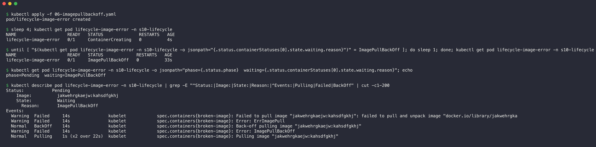

```console
$ kubectl apply -f 06-imagepullbackoff.yaml
pod/lifecycle-image-error created

$ sleep 4; kubectl get pod lifecycle-image-error -n s10-lifecycle
NAME                    READY   STATUS              RESTARTS   AGE
lifecycle-image-error   0/1     ContainerCreating   0          4s

$ until [ "$(kubectl get pod lifecycle-image-error -n s10-lifecycle -o jsonpath="{.status.containerStatuses[0].state.waiting.reason}")" = ImagePullBackOff ]; do sleep 1; done; kubectl get pod lifecycle-image-error -n s10-lifecycle
NAME                    READY   STATUS             RESTARTS   AGE
lifecycle-image-error   0/1     ImagePullBackOff   0          33s

$ kubectl get pod lifecycle-image-error -n s10-lifecycle -o jsonpath="phase={.status.phase}  waiting={.status.containerStatuses[0].state.waiting.reason}"; echo
phase=Pending  waiting=ImagePullBackOff

$ kubectl describe pod lifecycle-image-error -n s10-lifecycle | grep -E "^Status:|Image:|State:|Reason:|^Events:|Pulling|Failed|BackOff" | cut -c1-200
Status:           Pending
    Image:          jakwehrgkaejw:kahsdfgkhj
    State:          Waiting
      Reason:       ImagePullBackOff
Events:
  Warning  Failed     14s               kubelet            spec.containers{broken-image}: Failed to pull image "jakwehrgkaejw:kahsdfgkhj": failed to pull and unpack image "docker.io/library/jakwehrgka
  Warning  Failed     14s               kubelet            spec.containers{broken-image}: Error: ErrImagePull
  Normal   BackOff    14s               kubelet            spec.containers{broken-image}: Back-off pulling image "jakwehrgkaejw:kahsdfgkhj"
  Warning  Failed     14s               kubelet            spec.containers{broken-image}: Error: ImagePullBackOff
  Normal   Pulling    1s (x2 over 22s)  kubelet            spec.containers{broken-image}: Pulling image "jakwehrgkaejw:kahsdfgkhj"
```

**Observation:** The image name has no registry, so containerd tried `docker.io/library/jakwehrgkaejw`. The pull failed with `ErrImagePull`. After that, the kubelet waits before the next try. During this wait, the reason is `ImagePullBackOff`. The status changes between `ErrImagePull` and `ImagePullBackOff` at each try, and the delay doubles. The container never started, so the phase stays `Pending` and the restart count stays 0. In my first try, I captured the Pod in the `ErrImagePull` state. For this reason, I used an `until` loop that waits for `ImagePullBackOff`.

### 7. Readiness probe ([07-readiness.yaml](pod-lifecycle/07-readiness.yaml))

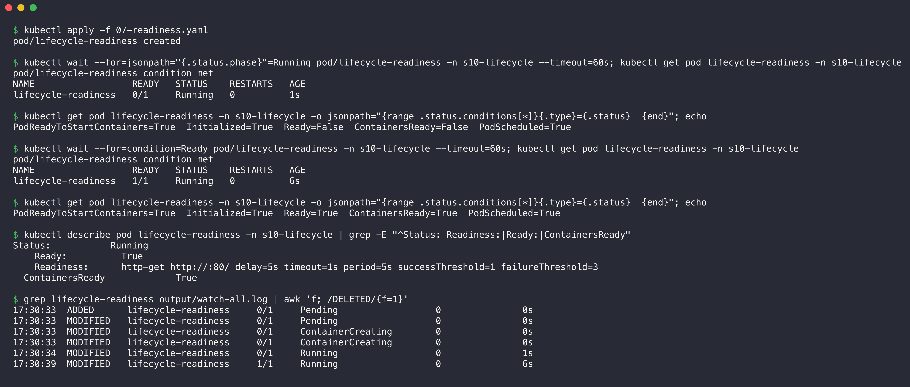

```console
$ kubectl apply -f 07-readiness.yaml
pod/lifecycle-readiness created

$ kubectl wait --for=jsonpath="{.status.phase}"=Running pod/lifecycle-readiness -n s10-lifecycle --timeout=60s; kubectl get pod lifecycle-readiness -n s10-lifecycle
pod/lifecycle-readiness condition met
NAME                  READY   STATUS    RESTARTS   AGE
lifecycle-readiness   0/1     Running   0          1s

$ kubectl get pod lifecycle-readiness -n s10-lifecycle -o jsonpath="{range .status.conditions[*]}{.type}={.status}  {end}"; echo
PodReadyToStartContainers=True  Initialized=True  Ready=False  ContainersReady=False  PodScheduled=True  

$ kubectl wait --for=condition=Ready pod/lifecycle-readiness -n s10-lifecycle --timeout=60s; kubectl get pod lifecycle-readiness -n s10-lifecycle
pod/lifecycle-readiness condition met
NAME                  READY   STATUS    RESTARTS   AGE
lifecycle-readiness   1/1     Running   0          6s

$ kubectl get pod lifecycle-readiness -n s10-lifecycle -o jsonpath="{range .status.conditions[*]}{.type}={.status}  {end}"; echo
PodReadyToStartContainers=True  Initialized=True  Ready=True  ContainersReady=True  PodScheduled=True  

$ kubectl describe pod lifecycle-readiness -n s10-lifecycle | grep -E "^Status:|Readiness:|Ready:|ContainersReady"
Status:           Running
    Ready:          True
    Readiness:      http-get http://:80/ delay=5s timeout=1s period=5s successThreshold=1 failureThreshold=3
  ContainersReady             True 

$ grep lifecycle-readiness output/watch-all.log | awk 'f; /DELETED/{f=1}'
17:30:33  ADDED      lifecycle-readiness     0/1     Pending                  0               0s
17:30:33  MODIFIED   lifecycle-readiness     0/1     Pending                  0               0s
17:30:33  MODIFIED   lifecycle-readiness     0/1     ContainerCreating        0               0s
17:30:33  MODIFIED   lifecycle-readiness     0/1     ContainerCreating        0               0s
17:30:34  MODIFIED   lifecycle-readiness     0/1     Running                  0               1s
17:30:39  MODIFIED   lifecycle-readiness     1/1     Running                  0               6s
```

**Observation:** At 1 second, the status is `Running` but READY is `0/1`, and the condition `Ready` is `False`. The readiness probe has `delay=5s`, so the kubelet does not mark the container as ready before the first successful probe. At 6 seconds, the HTTP probe got a 200 answer, and the Pod became `1/1`, `Ready=True`. Running does not mean Ready. A Service sends traffic only to Ready Pods. A failed readiness probe removes the Pod from the Service endpoints, but it does not restart the container.

### 8. Liveness probe ([08-liveness.yaml](pod-lifecycle/08-liveness.yaml))

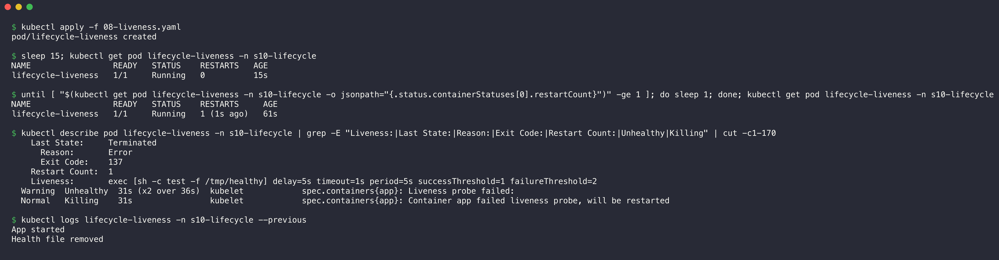

```console
$ kubectl apply -f 08-liveness.yaml
pod/lifecycle-liveness created

$ sleep 15; kubectl get pod lifecycle-liveness -n s10-lifecycle
NAME                 READY   STATUS    RESTARTS   AGE
lifecycle-liveness   1/1     Running   0          15s

$ until [ "$(kubectl get pod lifecycle-liveness -n s10-lifecycle -o jsonpath="{.status.containerStatuses[0].restartCount}")" -ge 1 ]; do sleep 1; done; kubectl get pod lifecycle-liveness -n s10-lifecycle
NAME                 READY   STATUS    RESTARTS     AGE
lifecycle-liveness   1/1     Running   1 (1s ago)   61s

$ kubectl describe pod lifecycle-liveness -n s10-lifecycle | grep -E "Liveness:|Last State:|Reason:|Exit Code:|Restart Count:|Unhealthy|Killing" | cut -c1-170
    Last State:     Terminated
      Reason:       Error
      Exit Code:    137
    Restart Count:  1
    Liveness:       exec [sh -c test -f /tmp/healthy] delay=5s timeout=1s period=5s successThreshold=1 failureThreshold=2
  Warning  Unhealthy  31s (x2 over 36s)  kubelet            spec.containers{app}: Liveness probe failed:
  Normal   Killing    31s                kubelet            spec.containers{app}: Container app failed liveness probe, will be restarted

$ kubectl logs lifecycle-liveness -n s10-lifecycle --previous
App started
Health file removed
```

**Observation:** The timeline:

1. From 0 to 20 seconds, `/tmp/healthy` exists and the probe passes.
2. At 20 seconds, the app removes the file (`Health file removed` in the previous logs).
3. The probe failed 2 times, 5 seconds apart (`x2 over 36s`). This is `failureThreshold: 2`. At about 30 seconds, the kubelet decided to restart the container (`Killing`).
4. The restart came at 61 seconds. The shell runs as PID 1 and has no SIGTERM handler, so it ignored SIGTERM. The kubelet waited for the default 30-second grace period and then sent SIGKILL. Exit code 137 = 128 + 9 (SIGKILL).

A liveness probe restarts a container that runs but no longer works. The file comes back after the restart, so the cycle repeats. The summary at the end shows 2 restarts.

### 9. Startup probe ([09-startup.yaml](pod-lifecycle/09-startup.yaml))

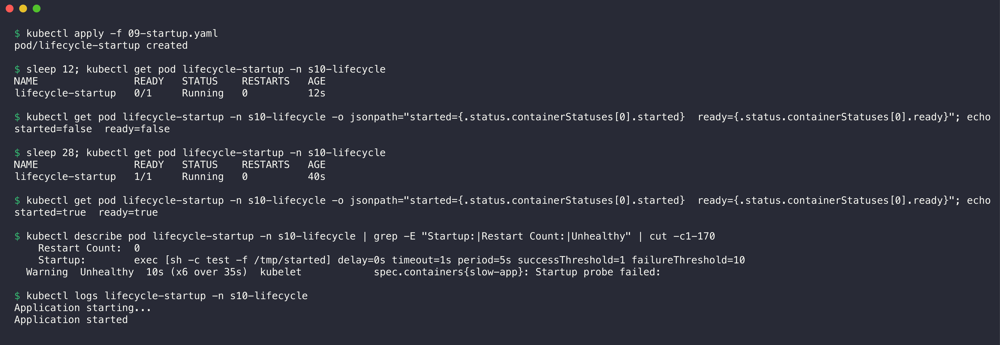

```console
$ kubectl apply -f 09-startup.yaml
pod/lifecycle-startup created

$ sleep 12; kubectl get pod lifecycle-startup -n s10-lifecycle
NAME                READY   STATUS    RESTARTS   AGE
lifecycle-startup   0/1     Running   0          12s

$ kubectl get pod lifecycle-startup -n s10-lifecycle -o jsonpath="started={.status.containerStatuses[0].started}  ready={.status.containerStatuses[0].ready}"; echo
started=false  ready=false

$ sleep 28; kubectl get pod lifecycle-startup -n s10-lifecycle
NAME                READY   STATUS    RESTARTS   AGE
lifecycle-startup   1/1     Running   0          40s

$ kubectl get pod lifecycle-startup -n s10-lifecycle -o jsonpath="started={.status.containerStatuses[0].started}  ready={.status.containerStatuses[0].ready}"; echo
started=true  ready=true

$ kubectl describe pod lifecycle-startup -n s10-lifecycle | grep -E "Startup:|Restart Count:|Unhealthy" | cut -c1-170
    Restart Count:  0
    Startup:        exec [sh -c test -f /tmp/started] delay=0s timeout=1s period=5s successThreshold=1 failureThreshold=10
  Warning  Unhealthy  10s (x6 over 35s)  kubelet            spec.containers{slow-app}: Startup probe failed:

$ kubectl logs lifecycle-startup -n s10-lifecycle
Application starting...
Application started
```

**Observation:** At 12 seconds, the process runs, but `started=false` and READY is `0/1`. The startup probe failed 6 times in the first 30 seconds (`x6 over 35s`), because `/tmp/started` did not exist yet. These failures did not cause a restart. The probe allows `failureThreshold × periodSeconds` = 10 × 5 = 50 seconds. At about 30 seconds, the app made the file. The probe passed, and `started` and `ready` changed to `true` with 0 restarts. While a startup probe runs, the kubelet does not run the liveness and readiness probes. This protects a slow application from a restart loop.

### 10. Init container ([10-init-container.yaml](pod-lifecycle/10-init-container.yaml))

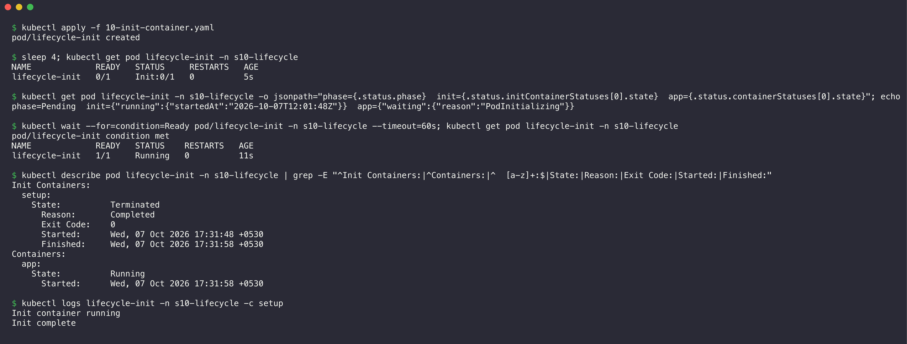

```console
$ kubectl apply -f 10-init-container.yaml
pod/lifecycle-init created

$ sleep 4; kubectl get pod lifecycle-init -n s10-lifecycle
NAME             READY   STATUS     RESTARTS   AGE
lifecycle-init   0/1     Init:0/1   0          5s

$ kubectl get pod lifecycle-init -n s10-lifecycle -o jsonpath="phase={.status.phase}  init={.status.initContainerStatuses[0].state}  app={.status.containerStatuses[0].state}"; echo
phase=Pending  init={"running":{"startedAt":"2026-10-07T12:01:48Z"}}  app={"waiting":{"reason":"PodInitializing"}}

$ kubectl wait --for=condition=Ready pod/lifecycle-init -n s10-lifecycle --timeout=60s; kubectl get pod lifecycle-init -n s10-lifecycle
pod/lifecycle-init condition met
NAME             READY   STATUS    RESTARTS   AGE
lifecycle-init   1/1     Running   0          11s

$ kubectl describe pod lifecycle-init -n s10-lifecycle | grep -E "^Init Containers:|^Containers:|^  [a-z]+:$|State:|Reason:|Exit Code:|Started:|Finished:"
Init Containers:
  setup:
    State:          Terminated
      Reason:       Completed
      Exit Code:    0
      Started:      Wed, 07 Oct 2026 17:31:48 +0530
      Finished:     Wed, 07 Oct 2026 17:31:58 +0530
Containers:
  app:
    State:          Running
      Started:      Wed, 07 Oct 2026 17:31:58 +0530

$ kubectl logs lifecycle-init -n s10-lifecycle -c setup
Init container running
Init complete
```

**Observation:** At 5 seconds, the status is `Init:0/1` (0 of 1 init containers complete) and the phase is `Pending`. The init container `setup` runs, and the app container waits with the reason `PodInitializing`. The `setup` container finished at 17:31:58 with exit code 0. The `app` container started in the same second. Init containers run in order, and each must complete before the main containers start. Use them for setup work, for example to wait for a database or to prepare files.

### 11. Multi-container Pod ([11-multi-container.yaml](pod-lifecycle/11-multi-container.yaml))

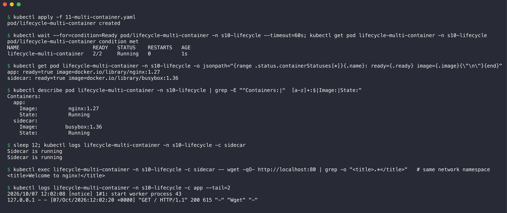

```console
$ kubectl apply -f 11-multi-container.yaml
pod/lifecycle-multi-container created

$ kubectl wait --for=condition=Ready pod/lifecycle-multi-container -n s10-lifecycle --timeout=60s; kubectl get pod lifecycle-multi-container -n s10-lifecycle
pod/lifecycle-multi-container condition met
NAME                        READY   STATUS    RESTARTS   AGE
lifecycle-multi-container   2/2     Running   0          1s

$ kubectl get pod lifecycle-multi-container -n s10-lifecycle -o jsonpath="{range .status.containerStatuses[*]}{.name}: ready={.ready} image={.image}{\"\n\"}{end}"
app: ready=true image=docker.io/library/nginx:1.27
sidecar: ready=true image=docker.io/library/busybox:1.36

$ kubectl describe pod lifecycle-multi-container -n s10-lifecycle | grep -E "^Containers:|^  [a-z]+:$|Image:|State:"
Containers:
  app:
    Image:          nginx:1.27
    State:          Running
  sidecar:
    Image:         busybox:1.36
    State:          Running

$ sleep 12; kubectl logs lifecycle-multi-container -n s10-lifecycle -c sidecar
Sidecar is running
Sidecar is running

$ kubectl exec lifecycle-multi-container -n s10-lifecycle -c sidecar -- wget -qO- http://localhost:80 | grep -o "<title>.*</title>"   # same network namespace
<title>Welcome to nginx!</title>

$ kubectl logs lifecycle-multi-container -n s10-lifecycle -c app --tail=2
2026/10/07 12:02:08 [notice] 1#1: start worker process 43
127.0.0.1 - - [07/Oct/2026:12:02:20 +0000] "GET / HTTP/1.1" 200 615 "-" "Wget" "-"
```

**Observation:** READY shows `2/2`: two containers in one Pod, and both are ready. Each container has its own image, state and logs, so `kubectl logs` needs `-c <container>`. The sidecar called `localhost:80` and got the nginx page. The nginx access log shows this request from `127.0.0.1`. This proves that the containers of a Pod share one network namespace. The Pod is Ready only when all its containers are ready.

### 12. Graceful termination ([12-termination.yaml](pod-lifecycle/12-termination.yaml))

1. Apply the YAML file and wait until the Pod is Ready.
2. In the background, follow the logs and watch the Pod with time stamps.
3. Delete the Pod and measure the time.

```bash
kubectl logs -f lifecycle-termination -n s10-lifecycle --timestamps > output/termination-app.log &
( kubectl get pod lifecycle-termination -n s10-lifecycle -w --output-watch-events \
  | while IFS= read -r l; do echo "$(date +%T)  $l"; done ) > output/termination-watch.log &
```

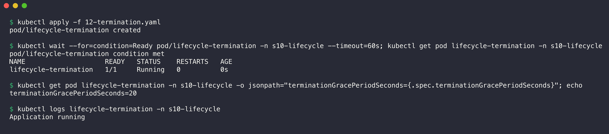

```console
$ kubectl apply -f 12-termination.yaml
pod/lifecycle-termination created

$ kubectl wait --for=condition=Ready pod/lifecycle-termination -n s10-lifecycle --timeout=60s; kubectl get pod lifecycle-termination -n s10-lifecycle
pod/lifecycle-termination condition met
NAME                    READY   STATUS    RESTARTS   AGE
lifecycle-termination   1/1     Running   0          0s

$ kubectl get pod lifecycle-termination -n s10-lifecycle -o jsonpath="terminationGracePeriodSeconds={.spec.terminationGracePeriodSeconds}"; echo
terminationGracePeriodSeconds=20

$ kubectl logs lifecycle-termination -n s10-lifecycle
Application running
```

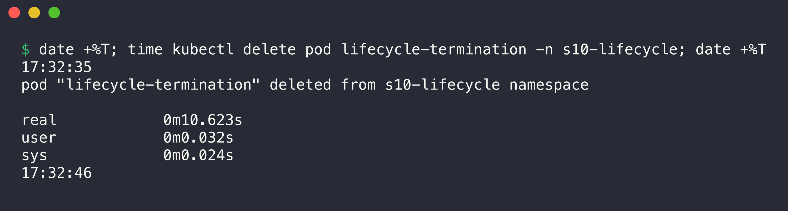

```console
$ date +%T; time kubectl delete pod lifecycle-termination -n s10-lifecycle; date +%T
17:32:35
pod "lifecycle-termination" deleted from s10-lifecycle namespace

real	0m10.623s
user	0m0.032s
sys	0m0.024s
17:32:46
```

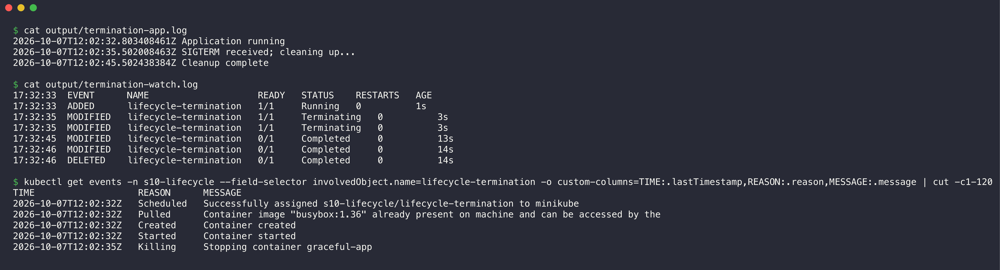

```console
$ cat output/termination-app.log
2026-10-07T12:02:32.803408461Z Application running
2026-10-07T12:02:35.502008463Z SIGTERM received; cleaning up...
2026-10-07T12:02:45.502438384Z Cleanup complete

$ cat output/termination-watch.log
17:32:33  EVENT      NAME                    READY   STATUS    RESTARTS   AGE
17:32:33  ADDED      lifecycle-termination   1/1     Running   0          1s
17:32:35  MODIFIED   lifecycle-termination   1/1     Terminating   0          3s
17:32:35  MODIFIED   lifecycle-termination   1/1     Terminating   0          3s
17:32:45  MODIFIED   lifecycle-termination   0/1     Completed     0          13s
17:32:46  MODIFIED   lifecycle-termination   0/1     Completed     0          14s
17:32:46  DELETED    lifecycle-termination   0/1     Completed     0          14s

$ kubectl get events -n s10-lifecycle --field-selector involvedObject.name=lifecycle-termination -o custom-columns=TIME:.lastTimestamp,REASON:.reason,MESSAGE:.message | cut -c1-120
TIME                   REASON      MESSAGE
2026-10-07T12:02:32Z   Scheduled   Successfully assigned s10-lifecycle/lifecycle-termination to minikube
2026-10-07T12:02:32Z   Pulled      Container image "busybox:1.36" already present on machine and can be accessed by the 
2026-10-07T12:02:32Z   Created     Container created
2026-10-07T12:02:32Z   Started     Container started
2026-10-07T12:02:35Z   Killing     Stopping container graceful-app
```

**Observation:** The termination sequence:

1. At 17:32:35 (12:02:35 UTC), `kubectl delete` started. The Pod went to `Terminating`, and the kubelet sent SIGTERM (`Killing` event).
2. In the same second, the `trap` in the script caught SIGTERM and printed `SIGTERM received; cleaning up...`.
3. The cleanup took 10 seconds. At 12:02:45, the script printed `Cleanup complete` and exited with code 0 (`Completed`).
4. At 17:32:46, the API server removed the Pod. `kubectl delete` took 10.6 seconds in total.

The app stopped in 10 seconds, before the 20-second `terminationGracePeriodSeconds` ended. For this reason, the kubelet did not need SIGKILL. Compare this with the liveness example: there, the shell had no SIGTERM handler, and the kubelet sent SIGKILL (exit code 137) after the grace period.

### Summary of all Pods

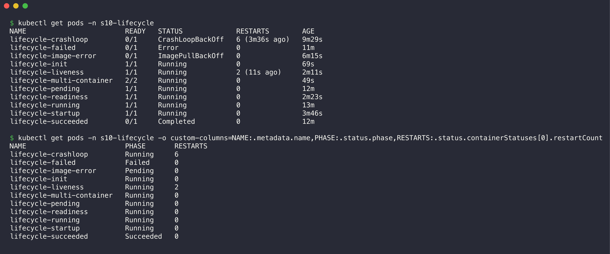

```console
$ kubectl get pods -n s10-lifecycle
NAME                        READY   STATUS             RESTARTS        AGE
lifecycle-crashloop         0/1     CrashLoopBackOff   6 (3m36s ago)   9m29s
lifecycle-failed            0/1     Error              0               11m
lifecycle-image-error       0/1     ImagePullBackOff   0               6m15s
lifecycle-init              1/1     Running            0               69s
lifecycle-liveness          1/1     Running            2 (11s ago)     2m11s
lifecycle-multi-container   2/2     Running            0               49s
lifecycle-pending           1/1     Running            0               12m
lifecycle-readiness         1/1     Running            0               2m23s
lifecycle-running           1/1     Running            0               13m
lifecycle-startup           1/1     Running            0               3m46s
lifecycle-succeeded         0/1     Completed          0               12m

$ kubectl get pods -n s10-lifecycle -o custom-columns=NAME:.metadata.name,PHASE:.status.phase,RESTARTS:.status.containerStatuses[0].restartCount
NAME                        PHASE       RESTARTS
lifecycle-crashloop         Running     6
lifecycle-failed            Failed      0
lifecycle-image-error       Pending     0
lifecycle-init              Running     0
lifecycle-liveness          Running     2
lifecycle-multi-container   Running     0
lifecycle-pending           Running     0
lifecycle-readiness         Running     0
lifecycle-running           Running     0
lifecycle-startup           Running     0
lifecycle-succeeded         Succeeded   0
```

| File | STATUS column | Pod phase | What caused it |
| --- | --- | --- | --- |
| 01-running | Running | Running | Normal start |
| 02-pending | Pending (later Running) | Pending | Not enough free memory for the 9Gi request. The scheduler placed it later when other Pods released memory. |
| 03-succeeded | Completed | Succeeded | Exit code 0, `restartPolicy: Never` |
| 04-failed | Error | Failed | Exit code 1, `restartPolicy: Never` |
| 05-crashloopbackoff | CrashLoopBackOff | Running | Exit code 1 again and again, `restartPolicy: Always`, back-off delay doubles |
| 06-imagepullbackoff | ImagePullBackOff | Pending | The image does not exist |
| 07-readiness | Running 0/1, then 1/1 | Running | The readiness probe passed after 5 seconds |
| 08-liveness | Running, RESTARTS increases | Running | The liveness probe failed, so the kubelet restarted the container |
| 09-startup | Running 0/1, then 1/1 | Running | The startup probe waited about 30 seconds for the slow app |
| 10-init-container | Init:0/1, then Running | Pending, then Running | The init container ran first |
| 11-multi-container | Running 2/2 | Running | Two containers share one Pod |
| 12-termination | Terminating, then Completed | Running until the delete | SIGTERM, 10 seconds of cleanup, exit 0 in the grace period, then the API server removed the Pod |

The `lifecycle-termination` Pod is not in the summary, because I deleted it in example 12.

### Clean up

```bash
kubectl delete namespace s10-lifecycle
```
