# Task 1: Kubernetes Volumes

**Name:** Kartavya Panchal
**Roll No.:** 24BCS10343

This document explains the six storage topics of Session 13. Each topic has a YAML file in this folder and the real output from the minikube cluster. All objects are in the namespace `s13-volumes`.

```text
01-kubernetes-volumes/
├── README.md
├── namespace.yaml            # namespace s13-volumes
├── emptydir-pod.yaml         # 2 containers share one emptyDir volume
├── hostpath-pod.yaml         # directory from the node file system
├── static-pv.yaml            # PersistentVolume (static provisioning)
├── static-pvc.yaml           # claim that binds to the static PV
├── static-pod.yaml           # Pod that uses the static claim
├── dynamic-pvc.yaml          # claim with StorageClass "standard"
└── dynamic-deployment.yaml   # Deployment that uses the dynamic claim
```

## Why containers need volumes

A container has its own file system. If the container restarts, Kubernetes starts it from the image again, and all files that the container wrote are lost. A volume is a directory that Kubernetes mounts into one or more containers of a Pod. The type of the volume decides where the data is kept and how long the data stays.

| Type | Where the data is kept | Lifetime of the data | Typical use |
| :--- | :--- | :--- | :--- |
| `emptyDir` | Node disk (or RAM), one directory per Pod | Same as the Pod | Cache, scratch space, files shared by containers of one Pod |
| `hostPath` | A fixed path on the node | Same as the node | Node agents, logs, local tests (not for normal applications) |
| PersistentVolume (PV) | Storage system (disk, NFS, cloud disk, hostpath in minikube) | Independent of Pods | Databases, uploads, any state |
| PersistentVolumeClaim (PVC) | A request for a PV | Until you delete the claim | The Pod uses the claim, not the PV directly |
| StorageClass | Template for new PVs | Not applicable | Dynamic provisioning |

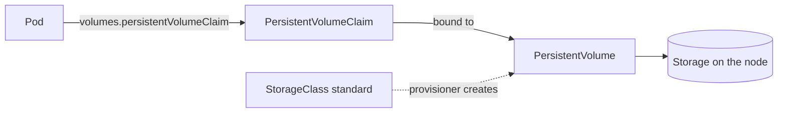

## 1. emptyDir

An `emptyDir` volume is empty when Kubernetes creates the Pod. All containers in the Pod can mount it. Kubernetes removes the volume and its data when it removes the Pod. A container restart does not remove the data, because the Pod stays.

File: [emptydir-pod.yaml](emptydir-pod.yaml). The `writer` container (busybox) adds one line every 5 seconds to `/shared/index.html`. The `web` container (nginx) mounts the same volume at `/usr/share/nginx/html` and serves the file.

### Step 1: Create the Pod

1. Create the namespace.
2. Apply the Pod.
3. Wait until the Pod is ready.

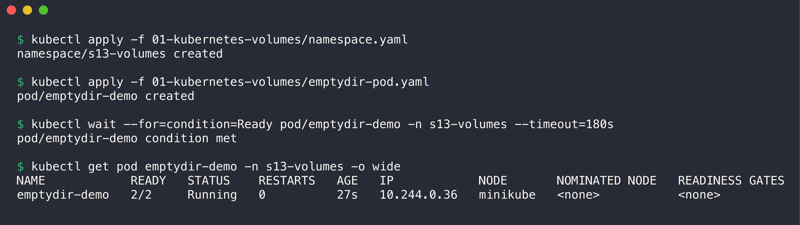

```console
$ kubectl apply -f 01-kubernetes-volumes/namespace.yaml
namespace/s13-volumes created

$ kubectl apply -f 01-kubernetes-volumes/emptydir-pod.yaml
pod/emptydir-demo created

$ kubectl wait --for=condition=Ready pod/emptydir-demo -n s13-volumes --timeout=180s
pod/emptydir-demo condition met

$ kubectl get pod emptydir-demo -n s13-volumes -o wide
NAME            READY   STATUS    RESTARTS   AGE   IP            NODE       NOMINATED NODE   READINESS GATES
emptydir-demo   2/2     Running   0          27s   10.244.0.36   minikube   <none>           <none>
```

`READY 2/2` shows that both containers run in the same Pod.

### Step 2: Examine the shared data

1. Read the file in the `writer` container.
2. Request the same file from nginx in the `web` container.

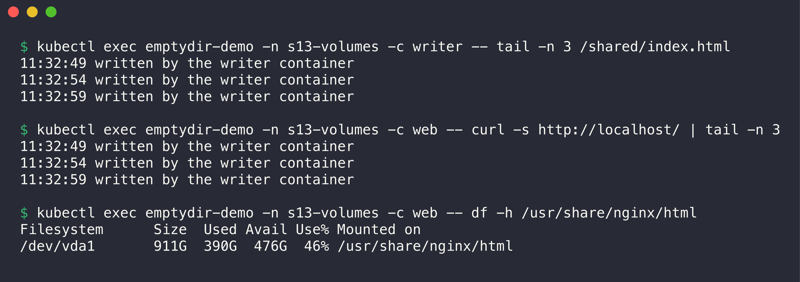

```console
$ kubectl exec emptydir-demo -n s13-volumes -c writer -- tail -n 3 /shared/index.html
11:32:49 written by the writer container
11:32:54 written by the writer container
11:32:59 written by the writer container

$ kubectl exec emptydir-demo -n s13-volumes -c web -- curl -s http://localhost/ | tail -n 3
11:32:49 written by the writer container
11:32:54 written by the writer container
11:32:59 written by the writer container

$ kubectl exec emptydir-demo -n s13-volumes -c web -- df -h /usr/share/nginx/html
Filesystem      Size  Used Avail Use% Mounted on
/dev/vda1       911G  390G  476G  46% /usr/share/nginx/html
```

The two containers show the same lines. The `writer` container writes the file and nginx serves it. The `df` output shows that the volume is a directory on the node disk.

### Step 3: Delete the Pod and examine the data again

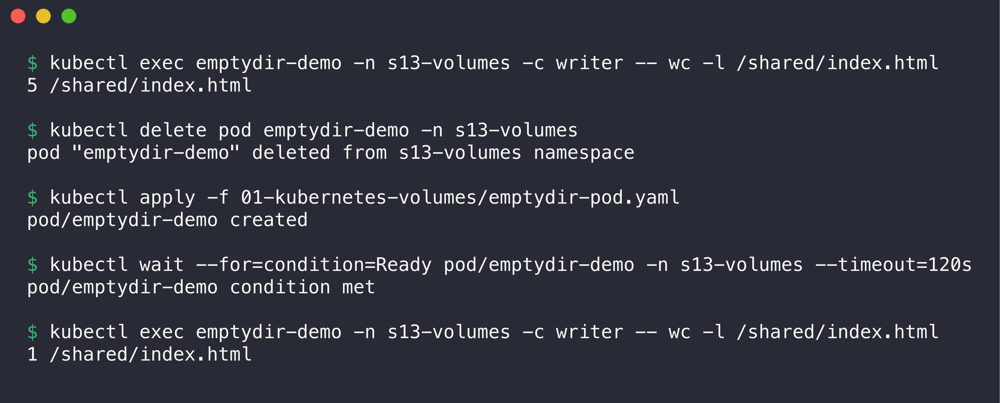

```console
$ kubectl exec emptydir-demo -n s13-volumes -c writer -- wc -l /shared/index.html
5 /shared/index.html

$ kubectl delete pod emptydir-demo -n s13-volumes
pod "emptydir-demo" deleted from s13-volumes namespace

$ kubectl apply -f 01-kubernetes-volumes/emptydir-pod.yaml
pod/emptydir-demo created

$ kubectl wait --for=condition=Ready pod/emptydir-demo -n s13-volumes --timeout=120s
pod/emptydir-demo condition met

$ kubectl exec emptydir-demo -n s13-volumes -c writer -- wc -l /shared/index.html
1 /shared/index.html
```

The file had 5 lines before the deletion. The new Pod has a new, empty volume, so the file starts again with 1 line. Do not use `emptyDir` for data that must stay.

## 2. hostPath

A `hostPath` volume mounts a file or directory from the node into the Pod. The data stays on the node after Kubernetes deletes the Pod. If Kubernetes schedules the new Pod on a different node, the Pod sees different data.

**WARNING:** Do not use `hostPath` for normal applications. A Pod with `hostPath` can read and change files on the node, and this is a security risk.

File: [hostpath-pod.yaml](hostpath-pod.yaml). The volume uses the node path `/tmp/s13-hostpath-demo` with `type: DirectoryOrCreate`.

1. Apply the Pod and write a file to `/data`.
2. Delete the Pod.
3. Read the file directly on the minikube node.
4. Create the Pod again and read the file.

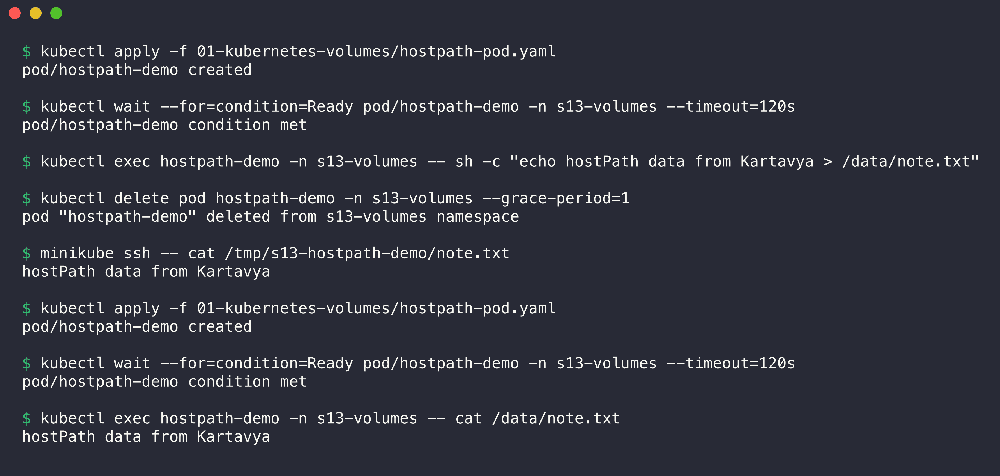

```console
$ kubectl apply -f 01-kubernetes-volumes/hostpath-pod.yaml
pod/hostpath-demo created

$ kubectl wait --for=condition=Ready pod/hostpath-demo -n s13-volumes --timeout=120s
pod/hostpath-demo condition met

$ kubectl exec hostpath-demo -n s13-volumes -- sh -c "echo hostPath data from Kartavya > /data/note.txt"

$ kubectl delete pod hostpath-demo -n s13-volumes --grace-period=1
pod "hostpath-demo" deleted from s13-volumes namespace

$ minikube ssh -- cat /tmp/s13-hostpath-demo/note.txt
hostPath data from Kartavya

$ kubectl apply -f 01-kubernetes-volumes/hostpath-pod.yaml
pod/hostpath-demo created

$ kubectl wait --for=condition=Ready pod/hostpath-demo -n s13-volumes --timeout=120s
pod/hostpath-demo condition met

$ kubectl exec hostpath-demo -n s13-volumes -- cat /data/note.txt
hostPath data from Kartavya
```

The file stayed on the node after the Pod was deleted. The new Pod read the same file because minikube has only one node.

## 3. PersistentVolume (PV)

A PersistentVolume is a cluster-wide storage object. It is not in a namespace. A PV describes the capacity, the access modes, the reclaim policy, and the real storage (here a `hostPath` directory on the node). An administrator creates the PV by hand in **static provisioning**.

Important fields:

- `capacity.storage`: the size of the volume.
- `accessModes`: `ReadWriteOnce` (RWO, one node can mount read-write), `ReadOnlyMany` (ROX), `ReadWriteMany` (RWX), `ReadWriteOncePod` (RWOP, one Pod).
- `persistentVolumeReclaimPolicy`: `Retain` keeps the PV and data after the claim is deleted. `Delete` removes the PV and the storage.
- `storageClassName`: a claim binds only to a PV with the same class name.

File: [static-pv.yaml](static-pv.yaml). The PV `s13-static-pv` has 1Gi, RWO, `Retain`, and the class name `manual`.

**CAUTION:** Give a static PV and its claim the same `storageClassName` (here `manual`). If the claim has no class, minikube gives it the default class `standard`, and the provisioner creates a new volume instead of the static PV.

## 4. PersistentVolumeClaim (PVC)

A PersistentVolumeClaim is a request for storage in a namespace. The claim gives a size, an access mode, and a class. Kubernetes finds a PV that matches and **binds** the two objects one-to-one. The Pod then uses the claim name in `volumes.persistentVolumeClaim.claimName`.

Files: [static-pvc.yaml](static-pvc.yaml) (500Mi, RWO, class `manual`, label selector `type: s13-static`) and [static-pod.yaml](static-pod.yaml).

### Step 1: Create the PV and the PVC

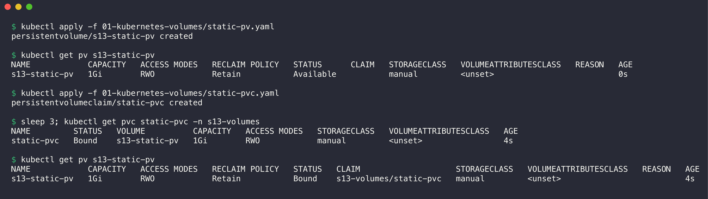

```console
$ kubectl apply -f 01-kubernetes-volumes/static-pv.yaml
persistentvolume/s13-static-pv created

$ kubectl get pv s13-static-pv
NAME            CAPACITY   ACCESS MODES   RECLAIM POLICY   STATUS      CLAIM   STORAGECLASS   VOLUMEATTRIBUTESCLASS   REASON   AGE
s13-static-pv   1Gi        RWO            Retain           Available           manual         <unset>                          0s

$ kubectl apply -f 01-kubernetes-volumes/static-pvc.yaml
persistentvolumeclaim/static-pvc created

$ sleep 3; kubectl get pvc static-pvc -n s13-volumes
NAME         STATUS   VOLUME          CAPACITY   ACCESS MODES   STORAGECLASS   VOLUMEATTRIBUTESCLASS   AGE
static-pvc   Bound    s13-static-pv   1Gi        RWO            manual         <unset>                 4s

$ kubectl get pv s13-static-pv
NAME            CAPACITY   ACCESS MODES   RECLAIM POLICY   STATUS   CLAIM                    STORAGECLASS   VOLUMEATTRIBUTESCLASS   REASON   AGE
s13-static-pv   1Gi        RWO            Retain           Bound    s13-volumes/static-pvc   manual         <unset>                          4s
```

The PV status changed from `Available` to `Bound`, and the `CLAIM` column shows `s13-volumes/static-pvc`. The claim asked for 500Mi but got 1Gi. A claim always gets the full PV, because binding is one-to-one.

### Step 2: Make sure that data stays after the Pod is deleted

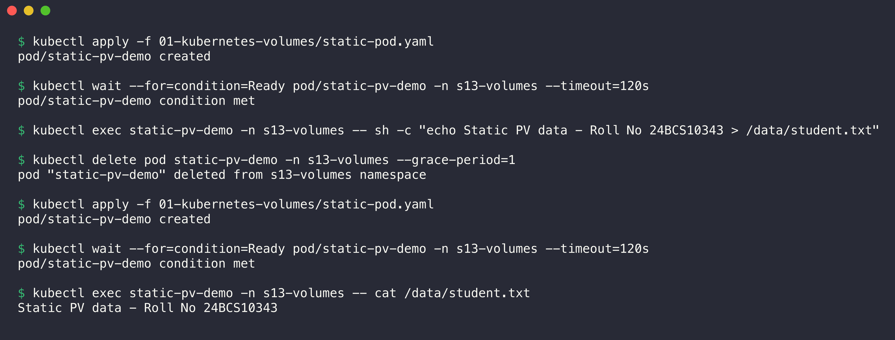

```console
$ kubectl apply -f 01-kubernetes-volumes/static-pod.yaml
pod/static-pv-demo created

$ kubectl wait --for=condition=Ready pod/static-pv-demo -n s13-volumes --timeout=120s
pod/static-pv-demo condition met

$ kubectl exec static-pv-demo -n s13-volumes -- sh -c "echo Static PV data - Roll No 24BCS10343 > /data/student.txt"

$ kubectl delete pod static-pv-demo -n s13-volumes --grace-period=1
pod "static-pv-demo" deleted from s13-volumes namespace

$ kubectl apply -f 01-kubernetes-volumes/static-pod.yaml
pod/static-pv-demo created

$ kubectl wait --for=condition=Ready pod/static-pv-demo -n s13-volumes --timeout=120s
pod/static-pv-demo condition met

$ kubectl exec static-pv-demo -n s13-volumes -- cat /data/student.txt
Static PV data - Roll No 24BCS10343
```

The new Pod read the file that the old Pod wrote. The data belongs to the PV, not to the Pod.

## 5. StorageClass

A StorageClass describes a type of storage and the **provisioner** that creates volumes of that type. In a cloud, the classes can be "fast SSD" or "cheap HDD". minikube has one class, `standard`, which is the default class.



```console
$ kubectl get storageclass
NAME                 PROVISIONER                RECLAIMPOLICY   VOLUMEBINDINGMODE   ALLOWVOLUMEEXPANSION   AGE
standard (default)   k8s.io/minikube-hostpath   Delete          Immediate           false                  12m

$ kubectl describe storageclass standard
Name:            standard
IsDefaultClass:  Yes
Annotations:     kubectl.kubernetes.io/last-applied-configuration={"apiVersion":"storage.k8s.io/v1","kind":"StorageClass","metadata":{"annotations":{"storageclass.kubernetes.io/is-default-class":"true"},"labels":{"addonmanager.kubernetes.io/mode":"EnsureExists"},"name":"standard"},"provisioner":"k8s.io/minikube-hostpath"}
,storageclass.kubernetes.io/is-default-class=true
Provisioner:           k8s.io/minikube-hostpath
Parameters:            <none>
AllowVolumeExpansion:  <unset>
MountOptions:          <none>
ReclaimPolicy:         Delete
VolumeBindingMode:     Immediate
Events:                <none>
```

- `Provisioner: k8s.io/minikube-hostpath`: the minikube storage-provisioner Pod creates a directory on the node for each new volume.
- `ReclaimPolicy: Delete`: Kubernetes removes the PV when you delete the claim.
- `VolumeBindingMode: Immediate`: the provisioner creates the volume when the claim is created. The other mode, `WaitForFirstConsumer`, waits until a Pod uses the claim. That mode helps in clusters with zones.
- The annotation `storageclass.kubernetes.io/is-default-class=true` makes `standard` the class for claims that do not name a class.

## 6. Dynamic provisioning

In dynamic provisioning, nobody creates the PV by hand. The claim names a StorageClass, and the provisioner of that class creates a new PV that matches the claim.

Files: [dynamic-pvc.yaml](dynamic-pvc.yaml) and [dynamic-deployment.yaml](dynamic-deployment.yaml).

### Step 1: Create the claim



```console
$ kubectl apply -f 01-kubernetes-volumes/dynamic-pvc.yaml
persistentvolumeclaim/dynamic-pvc created

$ sleep 4; kubectl get pvc dynamic-pvc -n s13-volumes
NAME          STATUS   VOLUME                                     CAPACITY   ACCESS MODES   STORAGECLASS   VOLUMEATTRIBUTESCLASS   AGE
dynamic-pvc   Bound    pvc-2cebe90f-7c21-4ce8-99b5-4e7832cdfe79   500Mi      RWO            standard       <unset>                 4s

$ kubectl get pv | grep -E "NAME|s13-volumes/dynamic-pvc"
NAME                                       CAPACITY   ACCESS MODES   RECLAIM POLICY   STATUS   CLAIM                        STORAGECLASS   VOLUMEATTRIBUTESCLASS   REASON   AGE
pvc-2cebe90f-7c21-4ce8-99b5-4e7832cdfe79   500Mi      RWO            Delete           Bound    s13-volumes/dynamic-pvc      standard       <unset>                          4s

$ kubectl describe pvc dynamic-pvc -n s13-volumes | tail -n 6
Events:
  Type    Reason                 Age   From                                                                    Message
  ----    ------                 ----  ----                                                                    -------
  Normal  ExternalProvisioning   4s    persistentvolume-controller                                             Waiting for a volume to be created either by the external provisioner 'k8s.io/minikube-hostpath' or manually by the system administrator. If volume creation is delayed, please verify that the provisioner is running and correctly registered.
  Normal  Provisioning           4s    k8s.io/minikube-hostpath_minikube_de4f05df-7cfb-4767-b914-cc9ed4ebdbfe  External provisioner is provisioning volume for claim "s13-volumes/dynamic-pvc"
  Normal  ProvisioningSucceeded  4s    k8s.io/minikube-hostpath_minikube_de4f05df-7cfb-4767-b914-cc9ed4ebdbfe  Successfully provisioned volume pvc-2cebe90f-7c21-4ce8-99b5-4e7832cdfe79
```

The provisioner created the PV `pvc-2cebe90f-...` with exactly 500Mi in less than 4 seconds. The events show the three steps: `ExternalProvisioning`, `Provisioning`, and `ProvisioningSucceeded`.

### Step 2: Make sure that data survives Pod deletion

The Deployment has one replica. When you delete its Pod, the ReplicaSet creates a new Pod with a new name, and the new Pod mounts the same claim.

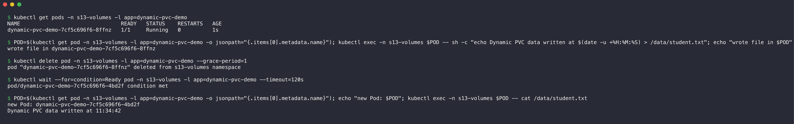

```console
$ kubectl get pods -n s13-volumes -l app=dynamic-pvc-demo
NAME                                READY   STATUS    RESTARTS   AGE
dynamic-pvc-demo-7cf5c696f6-8ffnz   1/1     Running   0          1s

$ POD=$(kubectl get pod -n s13-volumes -l app=dynamic-pvc-demo -o jsonpath="{.items[0].metadata.name}"); kubectl exec -n s13-volumes $POD -- sh -c "echo Dynamic PVC data written at $(date -u +%H:%M:%S) > /data/student.txt"; echo "wrote file in $POD"
wrote file in dynamic-pvc-demo-7cf5c696f6-8ffnz

$ kubectl delete pod -n s13-volumes -l app=dynamic-pvc-demo --grace-period=1
pod "dynamic-pvc-demo-7cf5c696f6-8ffnz" deleted from s13-volumes namespace

$ kubectl wait --for=condition=Ready pod -n s13-volumes -l app=dynamic-pvc-demo --timeout=120s
pod/dynamic-pvc-demo-7cf5c696f6-4bd2f condition met

$ POD=$(kubectl get pod -n s13-volumes -l app=dynamic-pvc-demo -o jsonpath="{.items[0].metadata.name}"); echo "new Pod: $POD"; kubectl exec -n s13-volumes $POD -- cat /data/student.txt
new Pod: dynamic-pvc-demo-7cf5c696f6-4bd2f
Dynamic PVC data written at 11:34:42
```

Pod `...-8ffnz` wrote the file. Pod `...-4bd2f` is a new Pod, and it read the same file.

### Step 3: Compare the reclaim policies

1. Delete the Deployment and the static Pod.
2. Delete both claims.
3. Examine the two PVs.

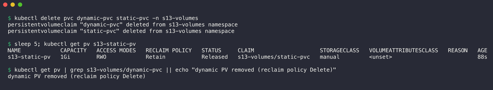

```console
$ kubectl delete pvc dynamic-pvc static-pvc -n s13-volumes
persistentvolumeclaim "dynamic-pvc" deleted from s13-volumes namespace
persistentvolumeclaim "static-pvc" deleted from s13-volumes namespace

$ sleep 5; kubectl get pv s13-static-pv
NAME            CAPACITY   ACCESS MODES   RECLAIM POLICY   STATUS     CLAIM                    STORAGECLASS   VOLUMEATTRIBUTESCLASS   REASON   AGE
s13-static-pv   1Gi        RWO            Retain           Released   s13-volumes/static-pvc   manual         <unset>                          88s

$ kubectl get pv | grep s13-volumes/dynamic-pvc || echo "dynamic PV removed (reclaim policy Delete)"
dynamic PV removed (reclaim policy Delete)
```

- The static PV has `Retain`. It stays with the status `Released`, and the data is still on the node. An administrator must clean it before another claim can use it.
- The dynamic PV has `Delete` (from the StorageClass). Kubernetes removed the PV and its directory.

## Summary

| Need | Use |
| :--- | :--- |
| Share temporary files between containers of one Pod | `emptyDir` |
| Read files of the node (agents, log collectors) | `hostPath` (with care) |
| Keep data after Pod deletion, storage prepared by an administrator | Static PV + PVC |
| Keep data after Pod deletion, storage created on request | PVC + StorageClass (dynamic provisioning) |

## Cleanup

```bash
kubectl delete namespace s13-volumes
kubectl delete pv s13-static-pv
minikube ssh -- sudo rm -rf /tmp/s13-hostpath-demo /tmp/s13-static-pv
```
