# Session 13: Kubernetes Storage, HPA & Probes

**Name:** Kartavya Panchal  
**Roll No.:** 24BCS10343

All work ran on a local minikube cluster (Kubernetes v1.37, containerd, docker driver, addons `metrics-server`, `storage-provisioner`, and `default-storageclass`). Every output block and screenshot in this document comes from a real command.

```text
Kubernetes-Storage-HPA-&-Probes/
├── README.md                      # this file
├── 01-kubernetes-volumes/         # Task 1
│   ├── README.md                  # emptyDir, hostPath, PV, PVC, StorageClass, dynamic provisioning
│   └── *.yaml                     # one example for each topic
├── 02-hpa/                        # Task 2
│   ├── namespace.yaml             # namespace s13-hpa
│   ├── deployment.yaml            # nginx with CPU requests
│   ├── service.yaml               # ClusterIP Service hpa-demo-service
│   ├── hpa.yml                    # HorizontalPodAutoscaler (autoscaling/v2)
│   ├── load-generator.yaml        # 3 busybox Pods that send requests in a loop
│   ├── hpa-watch-output.txt       # kubectl get hpa -w, with timestamps
│   └── pod-count-output.txt       # Pod count and CPU every 15 seconds
├── 03-probes/                     # liveness, readiness, startup (fail and pass)
│   ├── namespace.yaml
│   ├── client-pod.yaml
│   ├── liveness-fail.yaml / liveness-pass.yaml
│   ├── readiness-fail.yaml / readiness-pass.yaml / readiness-service.yaml
│   └── startup-fail.yaml / startup-pass.yaml
├── mini-project/                  # Task 3
│   ├── namespace.yaml             # namespace s13-webapp
│   ├── pvc.yaml                   # 500Mi RWO claim
│   ├── deployment.yaml            # 2 replicas, probes, PVC, CPU requests
│   ├── service.yaml               # web-service
│   ├── hpa.yaml                   # min 2, max 5, 50% CPU
│   ├── load-generator.yaml        # one busybox Pod
│   └── hpa-watch-output.txt       # kubectl get hpa -w, with timestamps
└── screenshots/                   # all PNG files used in this document
```

---

## Task 1: Kubernetes Volumes

The full document is in [01-kubernetes-volumes/README.md](01-kubernetes-volumes/README.md). It covers each topic with a YAML file and real output:

| Topic | Practical example in the document |
| :--- | :--- |
| emptyDir | Two containers (busybox writer and nginx) share one volume. The data is lost when the Pod is deleted. |
| hostPath | A file stays on the node after Pod deletion. `minikube ssh` reads it on the node. |
| PersistentVolume | Static PV `s13-static-pv` (1Gi, RWO, `Retain`, class `manual`). |
| PersistentVolumeClaim | The claim binds to the static PV. Data survives Pod deletion. |
| StorageClass | `standard` with the provisioner `k8s.io/minikube-hostpath`. |
| Dynamic provisioning | A claim with class `standard` gets a new PV automatically. `Retain` and `Delete` are compared. |

---

## Task 2: HPA Hands-on

The Horizontal Pod Autoscaler (HPA) changes the number of replicas of a Deployment. The HPA controller reads the CPU usage of the Pods from metrics-server every 15 seconds. Then it calculates:

```text
desiredReplicas = ceil( currentReplicas × currentUtilization / targetUtilization )
utilization     = CPU usage of the Pod / CPU request of the Pod
```

The HPA does not change the replicas if the ratio is within 10% of the target (the tolerance).

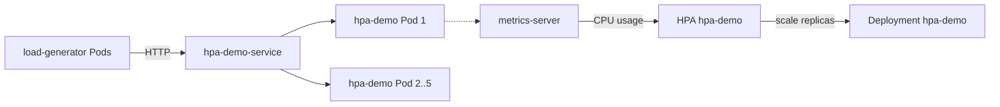
```mermaid
flowchart LR
  LG[load-generator Pods] -->|HTTP| SVC[hpa-demo-service]
  SVC --> P1[hpa-demo Pod 1]
  SVC --> P2[hpa-demo Pod 2..5]
  MS[metrics-server] -->|CPU usage| HPA[HPA hpa-demo]
  P1 -.-> MS
  HPA -->|scale replicas| DEP[Deployment hpa-demo]
```

### Files

- [02-hpa/deployment.yaml](02-hpa/deployment.yaml): nginx with `requests.cpu: 50m` and `limits.cpu: 150m`.
- [02-hpa/service.yaml](02-hpa/service.yaml): ClusterIP Service on port 80.
- [02-hpa/hpa.yml](02-hpa/hpa.yml): the HPA.
- [02-hpa/load-generator.yaml](02-hpa/load-generator.yaml): 3 busybox Pods that call the Service in a loop.

The HPA file (`hpa.yml`):

```yaml
apiVersion: autoscaling/v2
kind: HorizontalPodAutoscaler
metadata:
  name: hpa-demo
  namespace: s13-hpa
spec:
  scaleTargetRef:
    apiVersion: apps/v1
    kind: Deployment
    name: hpa-demo
  minReplicas: 1
  maxReplicas: 5
  metrics:
    - type: Resource
      resource:
        name: cpu
        target:
          type: Utilization
          averageUtilization: 50
  behavior:
    scaleUp:
      stabilizationWindowSeconds: 0
    scaleDown:
      stabilizationWindowSeconds: 60
      policies:
        - type: Percent
          value: 100
          periodSeconds: 15
```

Notes on the configuration:

- The default scale-down stabilization window is 300 seconds (5 minutes). For this demo, I set it to 60 seconds, so the scale-down shows in the output quickly. Use the default value in production. It prevents fast changes ("flapping") when the load changes often.
- The CPU request is 50m. Labs from other sessions ran on the same cluster, so the load generator must stay small. With a small request, a small load gives a high utilization. In a first test with `requests.cpu: 100m` and 2 load Pods, the utilization stayed at 52-53%, inside the 10% tolerance, and the HPA did not scale. I then changed the request to 50m and used 3 load Pods.
- `maxReplicas: 5` keeps the CPU use of the demo small.

### Step 1: Deploy the application

1. Apply the namespace, the Deployment, and the Service.
2. Wait until the rollout completes.

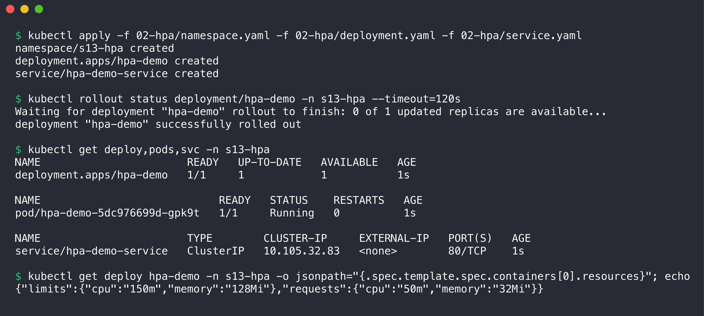

```console
$ kubectl apply -f 02-hpa/namespace.yaml -f 02-hpa/deployment.yaml -f 02-hpa/service.yaml
namespace/s13-hpa created
deployment.apps/hpa-demo created
service/hpa-demo-service created

$ kubectl rollout status deployment/hpa-demo -n s13-hpa --timeout=120s
Waiting for deployment "hpa-demo" rollout to finish: 0 of 1 updated replicas are available...
deployment "hpa-demo" successfully rolled out

$ kubectl get deploy,pods,svc -n s13-hpa
NAME                       READY   UP-TO-DATE   AVAILABLE   AGE
deployment.apps/hpa-demo   1/1     1            1           1s

NAME                            READY   STATUS    RESTARTS   AGE
pod/hpa-demo-5dc976699d-gpk9t   1/1     Running   0          1s

NAME                       TYPE        CLUSTER-IP     EXTERNAL-IP   PORT(S)   AGE
service/hpa-demo-service   ClusterIP   10.105.32.83   <none>        80/TCP    1s

$ kubectl get deploy hpa-demo -n s13-hpa -o jsonpath="{.spec.template.spec.containers[0].resources}"; echo
{"limits":{"cpu":"150m","memory":"128Mi"},"requests":{"cpu":"50m","memory":"32Mi"}}
```

The Deployment has one Pod. The last command shows the CPU request (50m) that the HPA uses for the utilization.

### Step 2: Configure the HPA

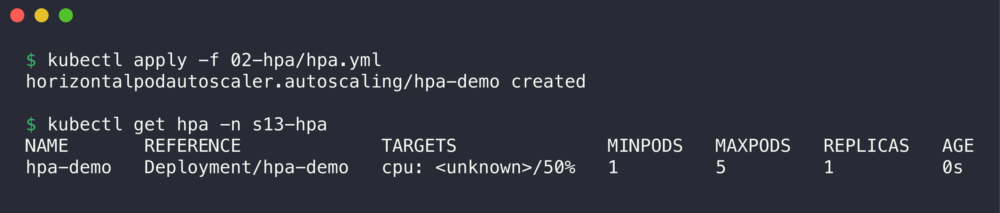

```console
$ kubectl apply -f 02-hpa/hpa.yml
horizontalpodautoscaler.autoscaling/hpa-demo created

$ kubectl get hpa -n s13-hpa
NAME       REFERENCE             TARGETS              MINPODS   MAXPODS   REPLICAS   AGE
hpa-demo   Deployment/hpa-demo   cpu: <unknown>/50%   1         5         1          0s
```

`<unknown>` is normal for the first 1-2 minutes. metrics-server needs time to collect the first samples of a new Pod.

### Step 3: Verify the HPA

After about 80 seconds, the HPA had a valid metric.

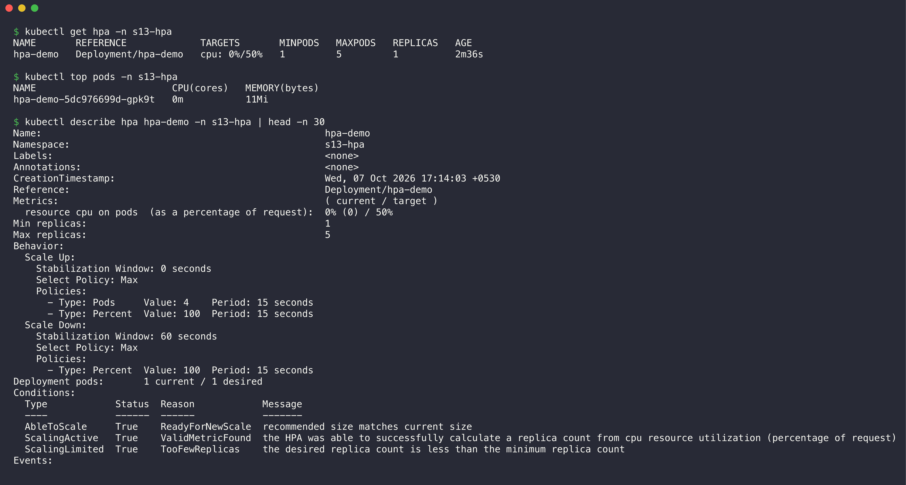

```console
$ kubectl get hpa -n s13-hpa
NAME       REFERENCE             TARGETS       MINPODS   MAXPODS   REPLICAS   AGE
hpa-demo   Deployment/hpa-demo   cpu: 0%/50%   1         5         1          2m36s

$ kubectl top pods -n s13-hpa
NAME                        CPU(cores)   MEMORY(bytes)   
hpa-demo-5dc976699d-gpk9t   0m           11Mi            

$ kubectl describe hpa hpa-demo -n s13-hpa | head -n 30
Name:                                                  hpa-demo
Namespace:                                             s13-hpa
Labels:                                                <none>
Annotations:                                           <none>
CreationTimestamp:                                     Wed, 07 Oct 2026 17:14:03 +0530
Reference:                                             Deployment/hpa-demo
Metrics:                                               ( current / target )
  resource cpu on pods  (as a percentage of request):  0% (0) / 50%
Min replicas:                                          1
Max replicas:                                          5
Behavior:
  Scale Up:
    Stabilization Window: 0 seconds
    Select Policy: Max
    Policies:
      - Type: Pods     Value: 4    Period: 15 seconds
      - Type: Percent  Value: 100  Period: 15 seconds
  Scale Down:
    Stabilization Window: 60 seconds
    Select Policy: Max
    Policies:
      - Type: Percent  Value: 100  Period: 15 seconds
Deployment pods:       1 current / 1 desired
Conditions:
  Type            Status  Reason            Message
  ----            ------  ------            -------
  AbleToScale     True    ReadyForNewScale  recommended size matches current size
  ScalingActive   True    ValidMetricFound  the HPA was able to successfully calculate a replica count from cpu resource utilization (percentage of request)
  ScalingLimited  True    TooFewReplicas    the desired replica count is less than the minimum replica count
Events:
```

- `ScalingActive True / ValidMetricFound`: the HPA can read the CPU metric.
- `ScalingLimited True / TooFewReplicas`: the HPA wants fewer than 1 replica at 0% CPU, but `minReplicas` is 1.
- The `Behavior` block shows the scale-up policies (default) and the scale-down window of 60 seconds.

### Step 4 and 5: Deploy the load generator and increase the load

Before I applied the load generator, I started two background loggers. One logger ran `kubectl get hpa -w` and added the local time to each line. The other logger wrote the Pod count and `kubectl top pods` every 15 seconds. The logs are in [02-hpa/hpa-watch-output.txt](02-hpa/hpa-watch-output.txt) and [02-hpa/pod-count-output.txt](02-hpa/pod-count-output.txt).

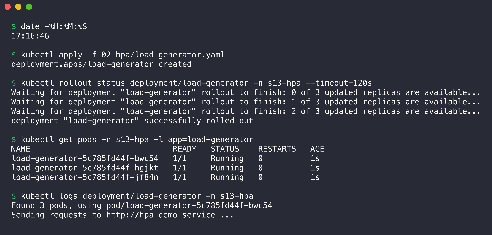

```console
$ date +%H:%M:%S
17:16:46

$ kubectl apply -f 02-hpa/load-generator.yaml
deployment.apps/load-generator created

$ kubectl rollout status deployment/load-generator -n s13-hpa --timeout=120s
Waiting for deployment "load-generator" rollout to finish: 0 of 3 updated replicas are available...
Waiting for deployment "load-generator" rollout to finish: 1 of 3 updated replicas are available...
Waiting for deployment "load-generator" rollout to finish: 2 of 3 updated replicas are available...
deployment "load-generator" successfully rolled out

$ kubectl get pods -n s13-hpa -l app=load-generator
NAME                              READY   STATUS    RESTARTS   AGE
load-generator-5c785fd44f-bwc54   1/1     Running   0          1s
load-generator-5c785fd44f-hgjkt   1/1     Running   0          1s
load-generator-5c785fd44f-jf84n   1/1     Running   0          1s

$ kubectl logs deployment/load-generator -n s13-hpa
Found 3 pods, using pod/load-generator-5c785fd44f-bwc54
Sending requests to http://hpa-demo-service ...
```

Each load generator Pod runs `while true; do wget -q -O /dev/null http://hpa-demo-service; done`. A CPU limit of 200m for each Pod keeps the total load small.

### Step 6 and 7: Observe the CPU utilization and the Pod scaling

About 90 seconds after the load started, the CPU utilization was 126% of the request. The HPA increased the replicas from 1 to 3.

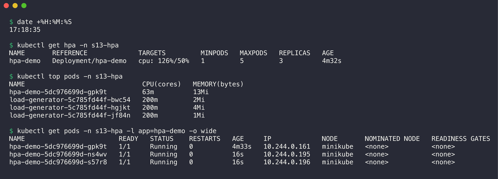

```console
$ date +%H:%M:%S
17:18:35

$ kubectl get hpa -n s13-hpa
NAME       REFERENCE             TARGETS         MINPODS   MAXPODS   REPLICAS   AGE
hpa-demo   Deployment/hpa-demo   cpu: 126%/50%   1         5         3          4m32s

$ kubectl top pods -n s13-hpa
NAME                              CPU(cores)   MEMORY(bytes)   
hpa-demo-5dc976699d-gpk9t         63m          13Mi            
load-generator-5c785fd44f-bwc54   200m         2Mi             
load-generator-5c785fd44f-hgjkt   200m         4Mi             
load-generator-5c785fd44f-jf84n   200m         1Mi             

$ kubectl get pods -n s13-hpa -l app=hpa-demo -o wide
NAME                        READY   STATUS    RESTARTS   AGE     IP             NODE       NOMINATED NODE   READINESS GATES
hpa-demo-5dc976699d-gpk9t   1/1     Running   0          4m33s   10.244.0.161   minikube   <none>           <none>
hpa-demo-5dc976699d-ns4wv   1/1     Running   0          16s     10.244.0.195   minikube   <none>           <none>
hpa-demo-5dc976699d-s57r8   1/1     Running   0          16s     10.244.0.196   minikube   <none>           <none>
```

The calculation: `ceil(1 × 126 / 50) = ceil(2.52) = 3`. One Pod used 63m of its 50m request, so its utilization was 126%. The two new Pods are 16 seconds old.

Three minutes later, the Service sent the load to 3 Pods. The utilization stayed at about 47%, which is near the target. So the HPA kept 3 replicas.

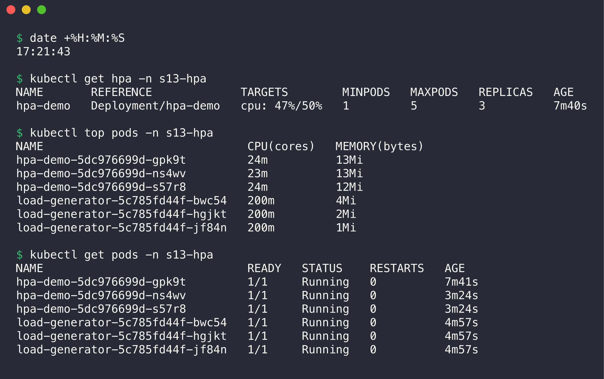

```console
$ date +%H:%M:%S
17:21:43

$ kubectl get hpa -n s13-hpa
NAME       REFERENCE             TARGETS        MINPODS   MAXPODS   REPLICAS   AGE
hpa-demo   Deployment/hpa-demo   cpu: 47%/50%   1         5         3          7m40s

$ kubectl top pods -n s13-hpa
NAME                              CPU(cores)   MEMORY(bytes)   
hpa-demo-5dc976699d-gpk9t         24m          13Mi            
hpa-demo-5dc976699d-ns4wv         23m          13Mi            
hpa-demo-5dc976699d-s57r8         24m          12Mi            
load-generator-5c785fd44f-bwc54   200m         4Mi             
load-generator-5c785fd44f-hgjkt   200m         2Mi             
load-generator-5c785fd44f-jf84n   200m         1Mi             

$ kubectl get pods -n s13-hpa
NAME                              READY   STATUS    RESTARTS   AGE
hpa-demo-5dc976699d-gpk9t         1/1     Running   0          7m41s
hpa-demo-5dc976699d-ns4wv         1/1     Running   0          3m24s
hpa-demo-5dc976699d-s57r8         1/1     Running   0          3m24s
load-generator-5c785fd44f-bwc54   1/1     Running   0          4m57s
load-generator-5c785fd44f-hgjkt   1/1     Running   0          4m57s
load-generator-5c785fd44f-jf84n   1/1     Running   0          4m57s
```

The scaling event in `kubectl describe hpa`:

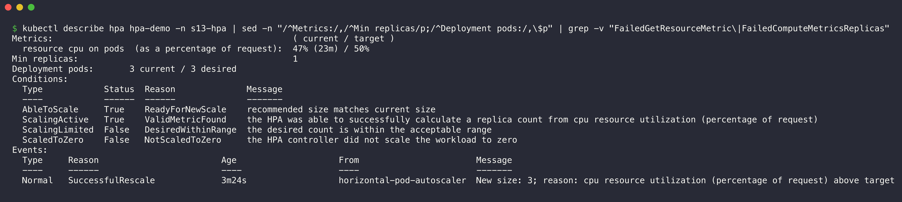

```console
$ kubectl describe hpa hpa-demo -n s13-hpa | sed -n "/^Metrics:/,/^Min replicas/p;/^Deployment pods:/,\$p" | grep -v "FailedGetResourceMetric\|FailedComputeMetricsReplicas"
Metrics:                                               ( current / target )
  resource cpu on pods  (as a percentage of request):  47% (23m) / 50%
Min replicas:                                          1
Deployment pods:       3 current / 3 desired
Conditions:
  Type            Status  Reason              Message
  ----            ------  ------              -------
  AbleToScale     True    ReadyForNewScale    recommended size matches current size
  ScalingActive   True    ValidMetricFound    the HPA was able to successfully calculate a replica count from cpu resource utilization (percentage of request)
  ScalingLimited  False   DesiredWithinRange  the desired count is within the acceptable range
  ScaledToZero    False   NotScaledToZero     the HPA controller did not scale the workload to zero
Events:
  Type     Reason                        Age                    From                       Message
  ----     ------                        ----                   ----                       -------
  Normal   SuccessfulRescale             3m24s                  horizontal-pod-autoscaler  New size: 3; reason: cpu resource utilization (percentage of request) above target
```

The `grep -v` removes the warnings from the first minute, when metrics-server had no data for the new Pod (see Step 3).

### Stop the load and observe the scale-down

**CAUTION:** Delete the load generator when you have the evidence. Other workloads share the CPU of the node.

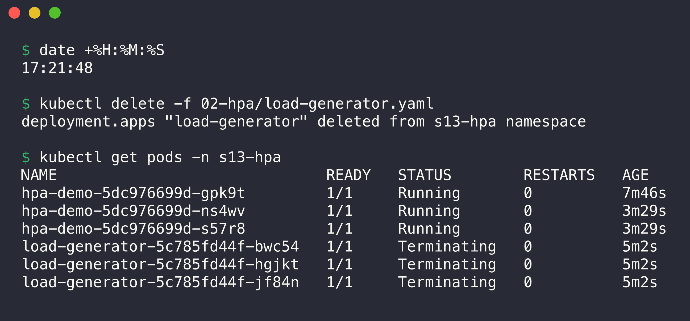

```console
$ date +%H:%M:%S
17:21:48

$ kubectl delete -f 02-hpa/load-generator.yaml
deployment.apps "load-generator" deleted from s13-hpa namespace

$ kubectl get pods -n s13-hpa
NAME                              READY   STATUS        RESTARTS   AGE
hpa-demo-5dc976699d-gpk9t         1/1     Running       0          7m46s
hpa-demo-5dc976699d-ns4wv         1/1     Running       0          3m29s
hpa-demo-5dc976699d-s57r8         1/1     Running       0          3m29s
load-generator-5c785fd44f-bwc54   1/1     Terminating   0          5m2s
load-generator-5c785fd44f-hgjkt   1/1     Terminating   0          5m2s
load-generator-5c785fd44f-jf84n   1/1     Terminating   0          5m2s
```

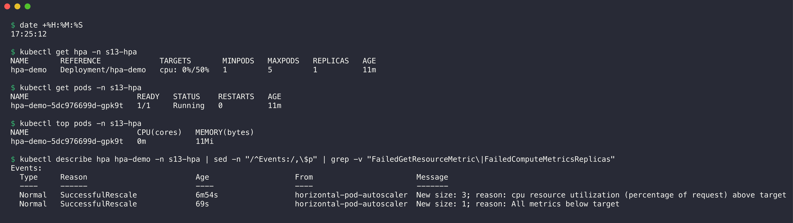

```console
$ date +%H:%M:%S
17:25:12

$ kubectl get hpa -n s13-hpa
NAME       REFERENCE             TARGETS       MINPODS   MAXPODS   REPLICAS   AGE
hpa-demo   Deployment/hpa-demo   cpu: 0%/50%   1         5         1          11m

$ kubectl get pods -n s13-hpa
NAME                        READY   STATUS    RESTARTS   AGE
hpa-demo-5dc976699d-gpk9t   1/1     Running   0          11m

$ kubectl top pods -n s13-hpa
NAME                        CPU(cores)   MEMORY(bytes)   
hpa-demo-5dc976699d-gpk9t   0m           11Mi            

$ kubectl describe hpa hpa-demo -n s13-hpa | sed -n "/^Events:/,\$p" | grep -v "FailedGetResourceMetric\|FailedComputeMetricsReplicas"
Events:
  Type     Reason                        Age                   From                       Message
  ----     ------                        ----                  ----                       -------
  Normal   SuccessfulRescale             6m54s                 horizontal-pod-autoscaler  New size: 3; reason: cpu resource utilization (percentage of request) above target
  Normal   SuccessfulRescale             69s                   horizontal-pod-autoscaler  New size: 1; reason: All metrics below target
```

The HPA removed 2 Pods with the reason `All metrics below target`. The `100% per 15 seconds` policy let it go from 3 to 1 in one step.

### Step 8: Capture the output (timeline)

The full `kubectl get hpa -w` log, with the local time on each line:

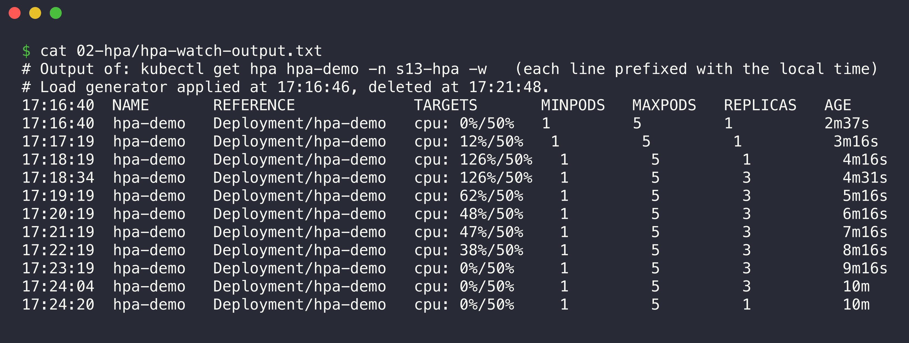

```console
$ cat 02-hpa/hpa-watch-output.txt
# Output of: kubectl get hpa hpa-demo -n s13-hpa -w   (each line prefixed with the local time)
# Load generator applied at 17:16:46, deleted at 17:21:48.
17:16:40  NAME       REFERENCE             TARGETS       MINPODS   MAXPODS   REPLICAS   AGE
17:16:40  hpa-demo   Deployment/hpa-demo   cpu: 0%/50%   1         5         1          2m37s
17:17:19  hpa-demo   Deployment/hpa-demo   cpu: 12%/50%   1         5         1          3m16s
17:18:19  hpa-demo   Deployment/hpa-demo   cpu: 126%/50%   1         5         1          4m16s
17:18:34  hpa-demo   Deployment/hpa-demo   cpu: 126%/50%   1         5         3          4m31s
17:19:19  hpa-demo   Deployment/hpa-demo   cpu: 62%/50%    1         5         3          5m16s
17:20:19  hpa-demo   Deployment/hpa-demo   cpu: 48%/50%    1         5         3          6m16s
17:21:19  hpa-demo   Deployment/hpa-demo   cpu: 47%/50%    1         5         3          7m16s
17:22:19  hpa-demo   Deployment/hpa-demo   cpu: 38%/50%    1         5         3          8m16s
17:23:19  hpa-demo   Deployment/hpa-demo   cpu: 0%/50%     1         5         3          9m16s
17:24:04  hpa-demo   Deployment/hpa-demo   cpu: 0%/50%     1         5         3          10m
17:24:20  hpa-demo   Deployment/hpa-demo   cpu: 0%/50%     1         5         1          10m
```

The Pod count and the CPU of each Pod (every second sample of the 15-second log):

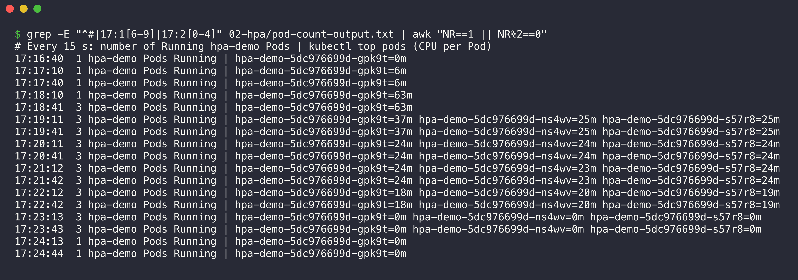

```console
$ grep -E "^#|17:1[6-9]|17:2[0-4]" 02-hpa/pod-count-output.txt | awk "NR==1 || NR%2==0"
# Every 15 s: number of Running hpa-demo Pods | kubectl top pods (CPU per Pod)
17:16:40  1 hpa-demo Pods Running | hpa-demo-5dc976699d-gpk9t=0m 
17:17:10  1 hpa-demo Pods Running | hpa-demo-5dc976699d-gpk9t=6m 
17:17:40  1 hpa-demo Pods Running | hpa-demo-5dc976699d-gpk9t=6m 
17:18:10  1 hpa-demo Pods Running | hpa-demo-5dc976699d-gpk9t=63m 
17:18:41  3 hpa-demo Pods Running | hpa-demo-5dc976699d-gpk9t=63m 
17:19:11  3 hpa-demo Pods Running | hpa-demo-5dc976699d-gpk9t=37m hpa-demo-5dc976699d-ns4wv=25m hpa-demo-5dc976699d-s57r8=25m 
17:19:41  3 hpa-demo Pods Running | hpa-demo-5dc976699d-gpk9t=37m hpa-demo-5dc976699d-ns4wv=25m hpa-demo-5dc976699d-s57r8=25m 
17:20:11  3 hpa-demo Pods Running | hpa-demo-5dc976699d-gpk9t=24m hpa-demo-5dc976699d-ns4wv=24m hpa-demo-5dc976699d-s57r8=24m 
17:20:41  3 hpa-demo Pods Running | hpa-demo-5dc976699d-gpk9t=24m hpa-demo-5dc976699d-ns4wv=24m hpa-demo-5dc976699d-s57r8=24m 
17:21:12  3 hpa-demo Pods Running | hpa-demo-5dc976699d-gpk9t=24m hpa-demo-5dc976699d-ns4wv=23m hpa-demo-5dc976699d-s57r8=24m 
17:21:42  3 hpa-demo Pods Running | hpa-demo-5dc976699d-gpk9t=24m hpa-demo-5dc976699d-ns4wv=23m hpa-demo-5dc976699d-s57r8=24m 
17:22:12  3 hpa-demo Pods Running | hpa-demo-5dc976699d-gpk9t=18m hpa-demo-5dc976699d-ns4wv=20m hpa-demo-5dc976699d-s57r8=19m 
17:22:42  3 hpa-demo Pods Running | hpa-demo-5dc976699d-gpk9t=18m hpa-demo-5dc976699d-ns4wv=20m hpa-demo-5dc976699d-s57r8=19m 
17:23:13  3 hpa-demo Pods Running | hpa-demo-5dc976699d-gpk9t=0m hpa-demo-5dc976699d-ns4wv=0m hpa-demo-5dc976699d-s57r8=0m 
17:23:43  3 hpa-demo Pods Running | hpa-demo-5dc976699d-gpk9t=0m hpa-demo-5dc976699d-ns4wv=0m hpa-demo-5dc976699d-s57r8=0m 
17:24:13  1 hpa-demo Pods Running | hpa-demo-5dc976699d-gpk9t=0m 
17:24:44  1 hpa-demo Pods Running | hpa-demo-5dc976699d-gpk9t=0m 
```

### What the timeline shows

| Time | Event |
| :--- | :--- |
| 17:16:46 | The load generator starts. |
| 17:18:19 | metrics-server reports 126% (the metric window is about 60 seconds, so the HPA sees the load after a delay). |
| 17:18:34 | The HPA scales from 1 to 3 replicas. |
| 17:19:19 | 62%. The new Pods share the load. The utilization decreases. |
| 17:20:19 - 17:21:19 | 47-48%. This value is inside the 10% tolerance, so the replicas stay at 3. |
| 17:21:48 | The load generator is deleted. |
| 17:23:19 | The utilization is 0%. |
| 17:24:20 | After the 60-second stabilization window, the HPA scales from 3 to 1. |

The HPA did not reach `maxReplicas: 5`. The load from 3 small Pods was enough for 3 replicas at about 50%. With the default window of 300 seconds, the scale-down would come about 5 minutes after 17:23:19.

---

## Probes: liveness, readiness, and startup

The kubelet runs probes on each container. A probe can be `httpGet`, `tcpSocket`, `exec`, or `grpc`.

| Probe | Question | Result of a failure |
| :--- | :--- | :--- |
| Startup | Did the application finish its start? | The kubelet restarts the container. The other probes wait until the startup probe succeeds. |
| Readiness | Can the container receive traffic now? | Kubernetes removes the Pod from the Service endpoints. The container does not restart. |
| Liveness | Is the container still healthy? | The kubelet kills and restarts the container. |

All probe demos are in the namespace `s13-probes`. Each probe has a failing YAML file and a passing YAML file in [03-probes/](03-probes/).

### Liveness probe that fails

File: [03-probes/liveness-fail.yaml](03-probes/liveness-fail.yaml). The probe checks `/healthz`, but nginx returns 404 for that path.

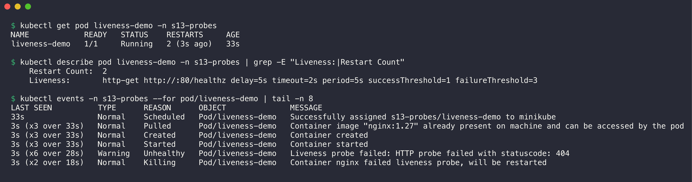

```console
$ kubectl get pod liveness-demo -n s13-probes
NAME            READY   STATUS    RESTARTS     AGE
liveness-demo   1/1     Running   2 (3s ago)   33s

$ kubectl describe pod liveness-demo -n s13-probes | grep -E "Liveness:|Restart Count"
    Restart Count:  2
    Liveness:       http-get http://:80/healthz delay=5s timeout=2s period=5s successThreshold=1 failureThreshold=3

$ kubectl events -n s13-probes --for pod/liveness-demo | tail -n 8
LAST SEEN          TYPE      REASON      OBJECT              MESSAGE
33s                Normal    Scheduled   Pod/liveness-demo   Successfully assigned s13-probes/liveness-demo to minikube
3s (x3 over 33s)   Normal    Pulled      Pod/liveness-demo   Container image "nginx:1.27" already present on machine and can be accessed by the pod
3s (x3 over 33s)   Normal    Created     Pod/liveness-demo   Container created
3s (x3 over 33s)   Normal    Started     Pod/liveness-demo   Container started
3s (x6 over 28s)   Warning   Unhealthy   Pod/liveness-demo   Liveness probe failed: HTTP probe failed with statuscode: 404
3s (x2 over 18s)   Normal    Killing     Pod/liveness-demo   Container nginx failed liveness probe, will be restarted
```

After 3 failures (3 × 5 seconds), the kubelet kills the container (`Killing`). The restart count increases about every 15 seconds. The Pod looks `Running`, but nginx never runs for long. If this continues, the Pod goes to `CrashLoopBackOff`.

### Readiness probe that fails

Files: [03-probes/readiness-fail.yaml](03-probes/readiness-fail.yaml), [03-probes/readiness-service.yaml](03-probes/readiness-service.yaml), and [03-probes/client-pod.yaml](03-probes/client-pod.yaml). The probe checks `/ready`, which returns 404.

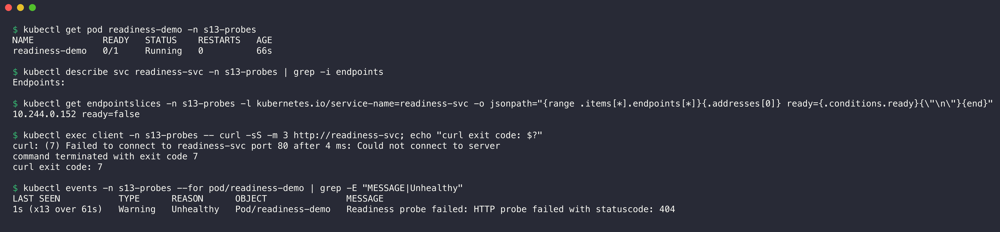

```console
$ kubectl get pod readiness-demo -n s13-probes
NAME             READY   STATUS    RESTARTS   AGE
readiness-demo   0/1     Running   0          66s

$ kubectl describe svc readiness-svc -n s13-probes | grep -i endpoints
Endpoints:                

$ kubectl get endpointslices -n s13-probes -l kubernetes.io/service-name=readiness-svc -o jsonpath="{range .items[*].endpoints[*]}{.addresses[0]} ready={.conditions.ready}{\"\n\"}{end}"
10.244.0.152 ready=false

$ kubectl exec client -n s13-probes -- curl -sS -m 3 http://readiness-svc; echo "curl exit code: $?"
curl: (7) Failed to connect to readiness-svc port 80 after 4 ms: Could not connect to server
command terminated with exit code 7
curl exit code: 7

$ kubectl events -n s13-probes --for pod/readiness-demo | grep -E "MESSAGE|Unhealthy"
LAST SEEN           TYPE      REASON      OBJECT               MESSAGE
1s (x13 over 61s)   Warning   Unhealthy   Pod/readiness-demo   Readiness probe failed: HTTP probe failed with statuscode: 404
```

The Pod is `Running` with `RESTARTS 0`, but `READY` is `0/1`. The EndpointSlice marks the Pod IP as `ready=false`, so the Service has no ready endpoint. The client cannot connect. A readiness failure never restarts the container.

### Startup probe that fails

File: [03-probes/startup-fail.yaml](03-probes/startup-fail.yaml). The application waits 20 seconds before its HTTP server starts. The startup probe allows only `3 × 2 = 6` seconds.

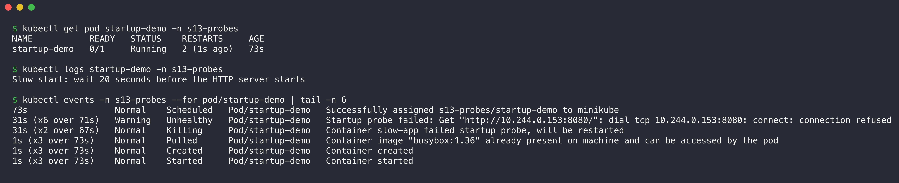

```console
$ kubectl get pod startup-demo -n s13-probes
NAME           READY   STATUS    RESTARTS     AGE
startup-demo   0/1     Running   2 (1s ago)   73s

$ kubectl logs startup-demo -n s13-probes
Slow start: wait 20 seconds before the HTTP server starts

$ kubectl events -n s13-probes --for pod/startup-demo | tail -n 6
73s                 Normal    Scheduled   Pod/startup-demo   Successfully assigned s13-probes/startup-demo to minikube
31s (x6 over 71s)   Warning   Unhealthy   Pod/startup-demo   Startup probe failed: Get "http://10.244.0.153:8080/": dial tcp 10.244.0.153:8080: connect: connection refused
31s (x2 over 67s)   Normal    Killing     Pod/startup-demo   Container slow-app failed startup probe, will be restarted
1s (x3 over 73s)    Normal    Pulled      Pod/startup-demo   Container image "busybox:1.36" already present on machine and can be accessed by the pod
1s (x3 over 73s)    Normal    Created     Pod/startup-demo   Container created
1s (x3 over 73s)    Normal    Started     Pod/startup-demo   Container started
```

The log never shows "HTTP server starts", because the kubelet kills the container before 20 seconds. The container never finishes its start. The time between `Killing` and the next `Started` is about 30 seconds. The reason is that busybox `sh` ignores SIGTERM, so the kubelet waits for the default grace period of 30 seconds.

### Fix the probes

Kubernetes does not let you change the probe fields of a Pod in place. Delete the Pods and apply the passing versions:

- [liveness-pass.yaml](03-probes/liveness-pass.yaml): the probe checks `/`.
- [readiness-pass.yaml](03-probes/readiness-pass.yaml): the probe checks `/`.
- [startup-pass.yaml](03-probes/startup-pass.yaml): `failureThreshold: 20`, so the start budget is `20 × 2 = 40` seconds.

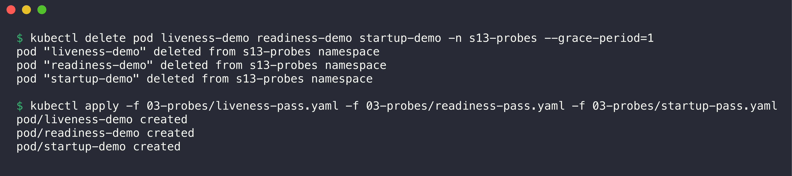

```console
$ kubectl delete pod liveness-demo readiness-demo startup-demo -n s13-probes --grace-period=1
pod "liveness-demo" deleted from s13-probes namespace
pod "readiness-demo" deleted from s13-probes namespace
pod "startup-demo" deleted from s13-probes namespace

$ kubectl apply -f 03-probes/liveness-pass.yaml -f 03-probes/readiness-pass.yaml -f 03-probes/startup-pass.yaml
pod/liveness-demo created
pod/readiness-demo created
pod/startup-demo created
```

The startup Pod becomes ready after about 20 seconds, with no restart:

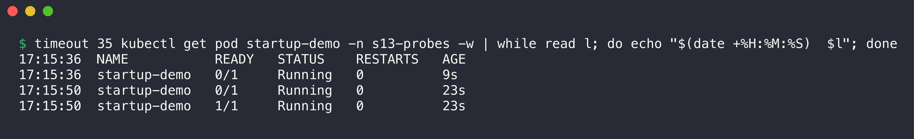

```console
$ timeout 35 kubectl get pod startup-demo -n s13-probes -w | while read l; do echo "$(date +%H:%M:%S)  $l"; done
17:15:36  NAME           READY   STATUS    RESTARTS   AGE
17:15:36  startup-demo   0/1     Running   0          9s
17:15:50  startup-demo   0/1     Running   0          23s
17:15:50  startup-demo   1/1     Running   0          23s
```

### Probes that pass

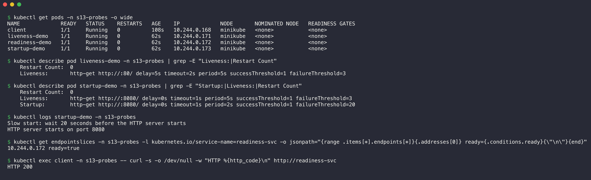

```console
$ kubectl get pods -n s13-probes -o wide
NAME             READY   STATUS    RESTARTS   AGE    IP             NODE       NOMINATED NODE   READINESS GATES
client           1/1     Running   0          108s   10.244.0.168   minikube   <none>           <none>
liveness-demo    1/1     Running   0          62s    10.244.0.171   minikube   <none>           <none>
readiness-demo   1/1     Running   0          62s    10.244.0.172   minikube   <none>           <none>
startup-demo     1/1     Running   0          62s    10.244.0.173   minikube   <none>           <none>

$ kubectl describe pod liveness-demo -n s13-probes | grep -E "Liveness:|Restart Count"
    Restart Count:  0
    Liveness:       http-get http://:80/ delay=5s timeout=2s period=5s successThreshold=1 failureThreshold=3

$ kubectl describe pod startup-demo -n s13-probes | grep -E "Startup:|Liveness:|Restart Count"
    Restart Count:  0
    Liveness:       http-get http://:8080/ delay=0s timeout=1s period=5s successThreshold=1 failureThreshold=3
    Startup:        http-get http://:8080/ delay=0s timeout=1s period=2s successThreshold=1 failureThreshold=20

$ kubectl logs startup-demo -n s13-probes
Slow start: wait 20 seconds before the HTTP server starts
HTTP server starts on port 8080

$ kubectl get endpointslices -n s13-probes -l kubernetes.io/service-name=readiness-svc -o jsonpath="{range .items[*].endpoints[*]}{.addresses[0]} ready={.conditions.ready}{\"\n\"}{end}"
10.244.0.172 ready=true

$ kubectl exec client -n s13-probes -- curl -s -o /dev/null -w "HTTP %{http_code}\n" http://readiness-svc
HTTP 200
```

All 3 Pods are `1/1` with 0 restarts. The readiness Pod is `ready=true` in the EndpointSlice, and the Service returns HTTP 200.

---

## Task 3: Mini Project

The mini project is the "Production-Ready Kubernetes Web App" from the Session 13 class material. It combines three parts:

1. **State persistence**: a PVC at `/data` keeps data after Pod deletion.
2. **Elastic scaling**: an HPA scales the Deployment between 2 and 5 replicas at 50% CPU.
3. **Health checks**: startup, readiness, and liveness probes.

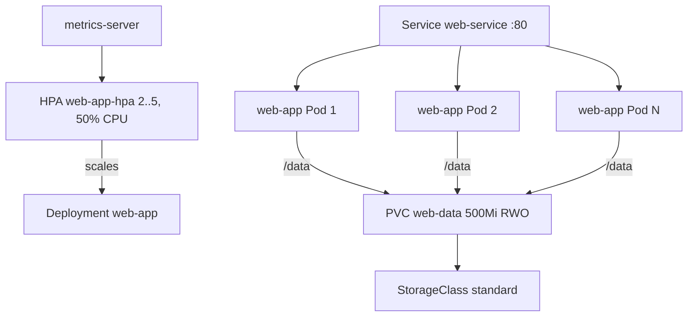
```mermaid
flowchart TB
  SVC[Service web-service :80] --> P1[web-app Pod 1]
  SVC --> P2[web-app Pod 2]
  SVC --> PN[web-app Pod N]
  HPA[HPA web-app-hpa 2..5, 50% CPU] -->|scales| DEP[Deployment web-app]
  MS[metrics-server] --> HPA
  P1 & P2 & PN -->|/data| PVC[PVC web-data 500Mi RWO]
  PVC --> SC[StorageClass standard]
```

### Changes from the class files

| Change | Reason |
| :--- | :--- |
| Namespace `s13-webapp` (not `production-webapp`) | Each session uses its own namespace prefix on the same cluster. |
| `requests.cpu: 50m`, `limits.cpu: 150m` (not 100m / 200m) | Labs from other sessions ran on the same cluster, so the load generator must be small. A smaller request gives a higher utilization from the same load. |
| `storageClassName: standard` in the PVC | The claim names the class. The result is the same as the default. |
| `behavior.scaleDown.stabilizationWindowSeconds: 60` in the HPA | The scale-down shows in about 1 minute, not 5 minutes. |
| Load generator in a YAML file, with 100 URLs in each `wget` call | One `wget` process for each request used most of the CPU limit of the load Pod. A first test with the simple loop reached only 13% CPU on the web Pods. |

Files: [namespace.yaml](mini-project/namespace.yaml), [pvc.yaml](mini-project/pvc.yaml), [deployment.yaml](mini-project/deployment.yaml), [service.yaml](mini-project/service.yaml), [hpa.yaml](mini-project/hpa.yaml), [load-generator.yaml](mini-project/load-generator.yaml).

### Step 1: Create the namespace and the PVC

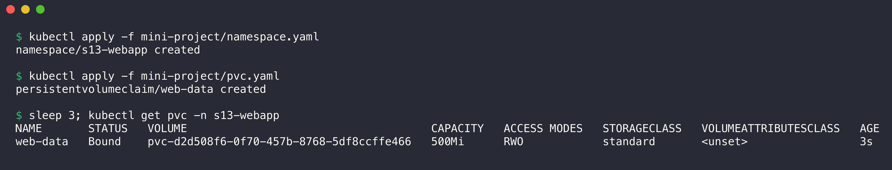

```console
$ kubectl apply -f mini-project/namespace.yaml
namespace/s13-webapp created

$ kubectl apply -f mini-project/pvc.yaml
persistentvolumeclaim/web-data created

$ sleep 3; kubectl get pvc -n s13-webapp
NAME       STATUS   VOLUME                                     CAPACITY   ACCESS MODES   STORAGECLASS   VOLUMEATTRIBUTESCLASS   AGE
web-data   Bound    pvc-d2d508f6-0f70-457b-8768-5df8ccffe466   500Mi      RWO            standard       <unset>                 3s
```

The `standard` StorageClass provisioned the volume at once, so the claim is `Bound`.

### Step 2: Deploy the application and the Service

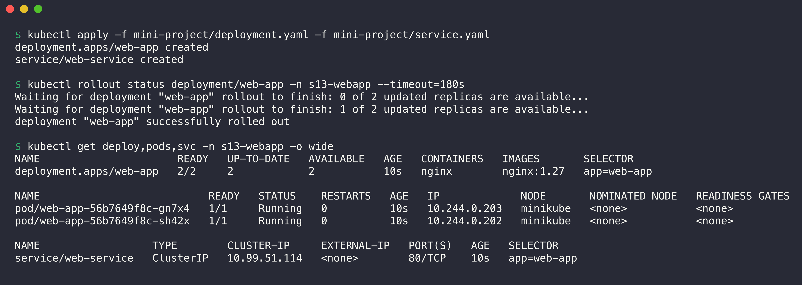

```console
$ kubectl apply -f mini-project/deployment.yaml -f mini-project/service.yaml
deployment.apps/web-app created
service/web-service created

$ kubectl rollout status deployment/web-app -n s13-webapp --timeout=180s
Waiting for deployment "web-app" rollout to finish: 0 of 2 updated replicas are available...
Waiting for deployment "web-app" rollout to finish: 1 of 2 updated replicas are available...
deployment "web-app" successfully rolled out

$ kubectl get deploy,pods,svc -n s13-webapp -o wide
NAME                      READY   UP-TO-DATE   AVAILABLE   AGE   CONTAINERS   IMAGES       SELECTOR
deployment.apps/web-app   2/2     2            2           10s   nginx        nginx:1.27   app=web-app

NAME                           READY   STATUS    RESTARTS   AGE   IP             NODE       NOMINATED NODE   READINESS GATES
pod/web-app-56b7649f8c-gn7x4   1/1     Running   0          10s   10.244.0.203   minikube   <none>           <none>
pod/web-app-56b7649f8c-sh42x   1/1     Running   0          10s   10.244.0.202   minikube   <none>           <none>

NAME                  TYPE        CLUSTER-IP     EXTERNAL-IP   PORT(S)   AGE   SELECTOR
service/web-service   ClusterIP   10.99.51.114   <none>        80/TCP    10s   app=web-app
```

The probes, the resources, and the volume of one Pod:

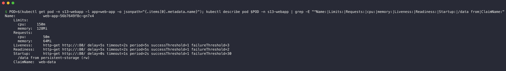

```console
$ POD=$(kubectl get pod -n s13-webapp -l app=web-app -o jsonpath="{.items[0].metadata.name}"); kubectl describe pod $POD -n s13-webapp | grep -E "^Name:|Limits:|Requests:|cpu:|memory:|Liveness:|Readiness:|Startup:|/data from|ClaimName:"
Name:             web-app-56b7649f8c-gn7x4
    Limits:
      cpu:     150m
      memory:  128Mi
    Requests:
      cpu:        50m
      memory:     64Mi
    Liveness:     http-get http://:80/ delay=5s timeout=2s period=5s successThreshold=1 failureThreshold=3
    Readiness:    http-get http://:80/ delay=5s timeout=2s period=5s successThreshold=1 failureThreshold=2
    Startup:      http-get http://:80/ delay=0s timeout=1s period=2s successThreshold=1 failureThreshold=30
      /data from persistent-storage (rw)
    ClaimName:  web-data
```

### Step 3: Deploy the HPA

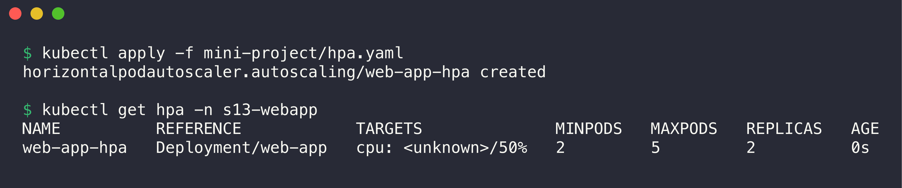

```console
$ kubectl apply -f mini-project/hpa.yaml
horizontalpodautoscaler.autoscaling/web-app-hpa created

$ kubectl get hpa -n s13-webapp
NAME          REFERENCE            TARGETS              MINPODS   MAXPODS   REPLICAS   AGE
web-app-hpa   Deployment/web-app   cpu: <unknown>/50%   2         5         2          0s
```

### Verification task 1: Storage persistence

1. Write a file to `/data` in one Pod.
2. Delete that Pod.
3. Read the file in the new Pod and in the other Pod.


```console
$ POD_NAME=$(kubectl get pods -n s13-webapp -l app=web-app -o jsonpath="{.items[0].metadata.name}"); echo "Pod: $POD_NAME"; kubectl exec -n s13-webapp "$POD_NAME" -- sh -c "echo \"Student: Kartavya Panchal (24BCS10343)\" > /data/student.txt"; kubectl exec -n s13-webapp "$POD_NAME" -- cat /data/student.txt; kubectl delete pod -n s13-webapp "$POD_NAME"
Pod: web-app-56b7649f8c-gn7x4
Student: Kartavya Panchal (24BCS10343)
pod "web-app-56b7649f8c-gn7x4" deleted from s13-webapp namespace

$ kubectl wait --for=condition=Ready pod -n s13-webapp -l app=web-app --timeout=120s
pod/web-app-56b7649f8c-7fldz condition met
pod/web-app-56b7649f8c-sh42x condition met

$ kubectl get pods -n s13-webapp -l app=web-app
NAME                       READY   STATUS    RESTARTS   AGE
web-app-56b7649f8c-7fldz   1/1     Running   0          9s
web-app-56b7649f8c-sh42x   1/1     Running   0          41s

$ for p in $(kubectl get pods -n s13-webapp -l app=web-app -o jsonpath="{.items[*].metadata.name}"); do echo "$p: $(kubectl exec -n s13-webapp $p -- cat /data/student.txt)"; done
web-app-56b7649f8c-7fldz: Student: Kartavya Panchal (24BCS10343)
web-app-56b7649f8c-sh42x: Student: Kartavya Panchal (24BCS10343)
```

Pod `...-gn7x4` wrote the file and Kubernetes deleted it. The new Pod `...-7fldz` reads the same file. Both replicas mount the same claim, because minikube has one node and RWO allows many Pods on one node.

### Verification task 2: Service

1. Forward local port 18200 to the Service in the background.
2. Send a request with curl and open the page in a browser.

```bash
kubectl port-forward -n s13-webapp svc/web-service 18200:80 &
```

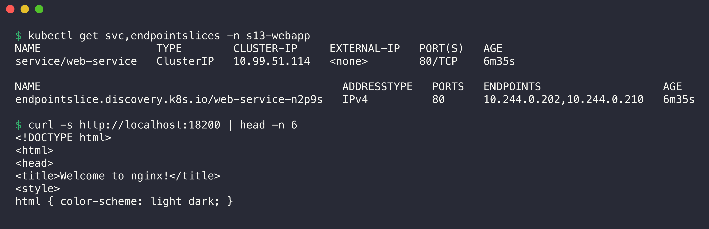

```console
$ kubectl get svc,endpointslices -n s13-webapp
NAME                  TYPE        CLUSTER-IP     EXTERNAL-IP   PORT(S)   AGE
service/web-service   ClusterIP   10.99.51.114   <none>        80/TCP    6m35s

NAME                                               ADDRESSTYPE   PORTS   ENDPOINTS                   AGE
endpointslice.discovery.k8s.io/web-service-n2p9s   IPv4          80      10.244.0.202,10.244.0.210   6m35s

$ curl -s http://localhost:18200 | head -n 6
<!DOCTYPE html>
<html>
<head>
<title>Welcome to nginx!</title>
<style>
html { color-scheme: light dark; }
```

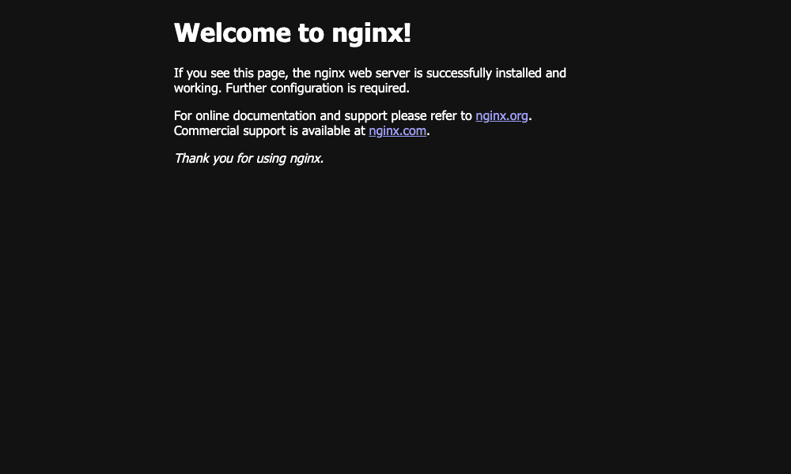

### Verification task 3: HPA elastic scaling

1. Start a `kubectl get hpa -w` logger in the background, with timestamps.
2. Apply the load generator Pod.

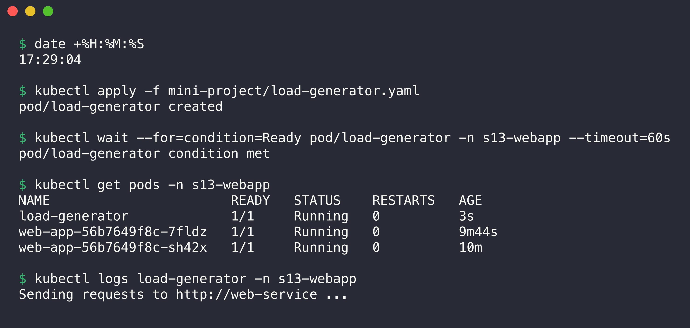

```console
$ date +%H:%M:%S
17:29:04

$ kubectl apply -f mini-project/load-generator.yaml
pod/load-generator created

$ kubectl wait --for=condition=Ready pod/load-generator -n s13-webapp --timeout=60s
pod/load-generator condition met

$ kubectl get pods -n s13-webapp
NAME                       READY   STATUS    RESTARTS   AGE
load-generator             1/1     Running   0          3s
web-app-56b7649f8c-7fldz   1/1     Running   0          9m44s
web-app-56b7649f8c-sh42x   1/1     Running   0          10m

$ kubectl logs load-generator -n s13-webapp
Sending requests to http://web-service ...
```

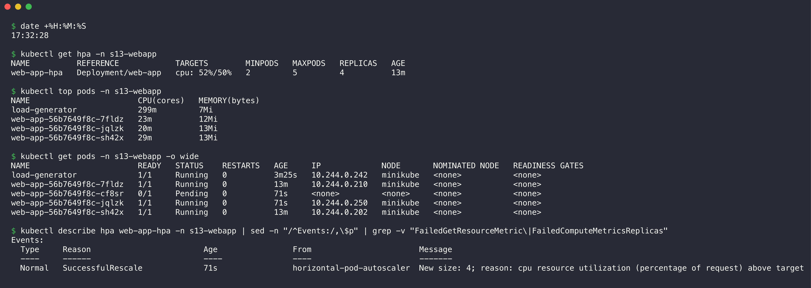

```console
$ date +%H:%M:%S
17:32:28

$ kubectl get hpa -n s13-webapp
NAME          REFERENCE            TARGETS        MINPODS   MAXPODS   REPLICAS   AGE
web-app-hpa   Deployment/web-app   cpu: 52%/50%   2         5         4          13m

$ kubectl top pods -n s13-webapp
NAME                       CPU(cores)   MEMORY(bytes)   
load-generator             299m         7Mi             
web-app-56b7649f8c-7fldz   23m          12Mi            
web-app-56b7649f8c-jqlzk   20m          13Mi            
web-app-56b7649f8c-sh42x   29m          13Mi            

$ kubectl get pods -n s13-webapp -o wide
NAME                       READY   STATUS    RESTARTS   AGE     IP             NODE       NOMINATED NODE   READINESS GATES
load-generator             1/1     Running   0          3m25s   10.244.0.242   minikube   <none>           <none>
web-app-56b7649f8c-7fldz   1/1     Running   0          13m     10.244.0.210   minikube   <none>           <none>
web-app-56b7649f8c-cf8sr   0/1     Pending   0          71s     <none>         <none>     <none>           <none>
web-app-56b7649f8c-jqlzk   1/1     Running   0          71s     10.244.0.250   minikube   <none>           <none>
web-app-56b7649f8c-sh42x   1/1     Running   0          13m     10.244.0.202   minikube   <none>           <none>

$ kubectl describe hpa web-app-hpa -n s13-webapp | sed -n "/^Events:/,\$p" | grep -v "FailedGetResourceMetric\|FailedComputeMetricsReplicas"
Events:
  Type     Reason                        Age                From                       Message
  ----     ------                        ----               ----                       -------
  Normal   SuccessfulRescale             71s                horizontal-pod-autoscaler  New size: 4; reason: cpu resource utilization (percentage of request) above target
```

At 79% CPU, the HPA calculated `ceil(2 × 79 / 50) = 4` and scaled from 2 to 4 replicas. One new Pod stayed `Pending`. I examined it:

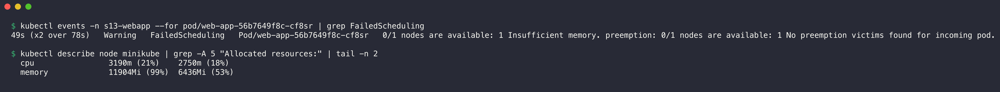

```console
$ kubectl events -n s13-webapp --for pod/web-app-56b7649f8c-cf8sr | grep FailedScheduling
49s (x2 over 78s)   Warning   FailedScheduling   Pod/web-app-56b7649f8c-cf8sr   0/1 nodes are available: 1 Insufficient memory. preemption: 0/1 nodes are available: 1 No preemption victims found for incoming pod.

$ kubectl describe node minikube | grep -A 5 "Allocated resources:" | tail -n 2
  cpu                3190m (21%)    2750m (18%)
  memory             11904Mi (99%)  6436Mi (53%)
```

The memory requests of all Pods on the shared node were at 99%. Another workload in a different namespace requested a lot of memory at that time. The scheduler places a Pod only if its request (64Mi) fits, so the fourth replica could not start. This is a real limit of HPA: the HPA can add Pods, but the scheduler needs free capacity for them. In production, the Cluster Autoscaler adds nodes for such Pods.

Stop the load:

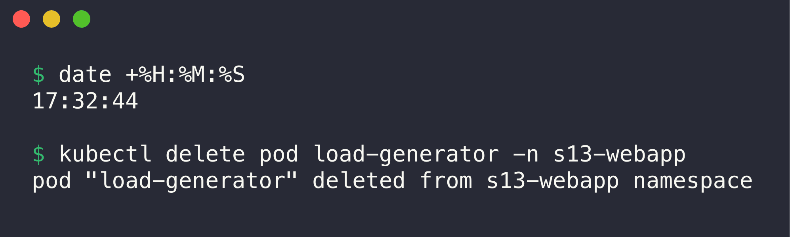

```console
$ date +%H:%M:%S
17:32:44

$ kubectl delete pod load-generator -n s13-webapp
pod "load-generator" deleted from s13-webapp namespace
```

The full timeline and the scale-down:

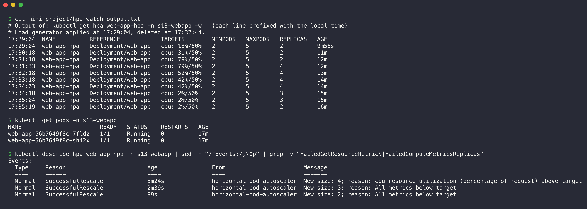

```console
$ cat mini-project/hpa-watch-output.txt
# Output of: kubectl get hpa web-app-hpa -n s13-webapp -w   (each line prefixed with the local time)
# Load generator applied at 17:29:04, deleted at 17:32:44.
17:29:04  NAME          REFERENCE            TARGETS        MINPODS   MAXPODS   REPLICAS   AGE
17:29:04  web-app-hpa   Deployment/web-app   cpu: 13%/50%   2         5         2          9m56s
17:30:18  web-app-hpa   Deployment/web-app   cpu: 31%/50%   2         5         2          11m
17:31:18  web-app-hpa   Deployment/web-app   cpu: 79%/50%   2         5         2          12m
17:31:33  web-app-hpa   Deployment/web-app   cpu: 79%/50%   2         5         4          12m
17:32:18  web-app-hpa   Deployment/web-app   cpu: 52%/50%   2         5         4          13m
17:33:18  web-app-hpa   Deployment/web-app   cpu: 42%/50%   2         5         4          14m
17:34:03  web-app-hpa   Deployment/web-app   cpu: 42%/50%   2         5         4          14m
17:34:18  web-app-hpa   Deployment/web-app   cpu: 2%/50%    2         5         3          15m
17:35:04  web-app-hpa   Deployment/web-app   cpu: 2%/50%    2         5         3          15m
17:35:19  web-app-hpa   Deployment/web-app   cpu: 2%/50%    2         5         2          16m

$ kubectl get pods -n s13-webapp
NAME                       READY   STATUS    RESTARTS   AGE
web-app-56b7649f8c-7fldz   1/1     Running   0          17m
web-app-56b7649f8c-sh42x   1/1     Running   0          17m

$ kubectl describe hpa web-app-hpa -n s13-webapp | sed -n "/^Events:/,\$p" | grep -v "FailedGetResourceMetric\|FailedComputeMetricsReplicas"
Events:
  Type     Reason                        Age                From                       Message
  ----     ------                        ----               ----                       -------
  Normal   SuccessfulRescale             5m24s              horizontal-pod-autoscaler  New size: 4; reason: cpu resource utilization (percentage of request) above target
  Normal   SuccessfulRescale             2m39s              horizontal-pod-autoscaler  New size: 3; reason: All metrics below target
  Normal   SuccessfulRescale             99s                horizontal-pod-autoscaler  New size: 2; reason: All metrics below target
```

The first line (13%) comes from a first load generator. That version ran one `wget` process for each request and did not make enough load. I replaced it with the current `load-generator.yaml` at 17:29:04. The HPA scaled 2 → 4 under load. After the load stopped, it scaled 4 → 3 → 2 and stopped at `minReplicas: 2`.

### Bonus challenge 1: Target tuning

I did not do this optional challenge (lower the HPA CPU target from 50% to 30%). A lower target makes the HPA add Pods at a lower CPU utilization, so the workload scales out sooner.

### Bonus challenge 2: Readiness gating

1. Change the readiness path of the Deployment to `/does-not-exist`.
2. Examine the Pods and the Service endpoints.

```bash
kubectl patch deployment web-app -n s13-webapp --type=json \
  -p='[{"op":"replace","path":"/spec/template/spec/containers/0/readinessProbe/httpGet/path","value":"/does-not-exist"}]'
```

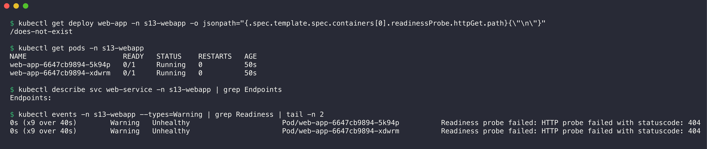

```console
$ kubectl get deploy web-app -n s13-webapp -o jsonpath="{.spec.template.spec.containers[0].readinessProbe.httpGet.path}{\"\n\"}"
/does-not-exist

$ kubectl get pods -n s13-webapp
NAME                       READY   STATUS    RESTARTS   AGE
web-app-6647cb9894-5k94p   0/1     Running   0          50s
web-app-6647cb9894-xdwrm   0/1     Running   0          50s

$ kubectl describe svc web-service -n s13-webapp | grep Endpoints
Endpoints:                

$ kubectl events -n s13-webapp --types=Warning | grep Readiness | tail -n 2
0s (x9 over 40s)        Warning   Unhealthy                      Pod/web-app-6647cb9894-5k94p          Readiness probe failed: HTTP probe failed with statuscode: 404
0s (x9 over 40s)        Warning   Unhealthy                      Pod/web-app-6647cb9894-xdwrm          Readiness probe failed: HTTP probe failed with statuscode: 404
```

The Pods are `Running`, but `READY` is `0/1` and the Service has no endpoints. The Deployment uses the `Recreate` strategy, so Kubernetes removed both old Pods first. The application was down for all users. With `RollingUpdate`, the old Pods stay until the new Pods are ready, and the bad change does not cause an outage.

3. Apply the correct Deployment again and make sure that the data is still on the PVC.

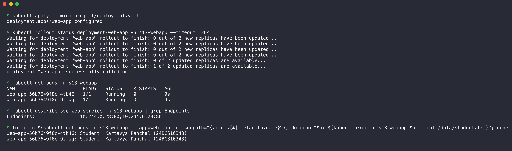

```console
$ kubectl apply -f mini-project/deployment.yaml
deployment.apps/web-app configured

$ kubectl rollout status deployment/web-app -n s13-webapp --timeout=120s
Waiting for deployment "web-app" rollout to finish: 0 out of 2 new replicas have been updated...
Waiting for deployment "web-app" rollout to finish: 0 out of 2 new replicas have been updated...
Waiting for deployment "web-app" rollout to finish: 0 out of 2 new replicas have been updated...
Waiting for deployment "web-app" rollout to finish: 0 out of 2 new replicas have been updated...
Waiting for deployment "web-app" rollout to finish: 0 of 2 updated replicas are available...
Waiting for deployment "web-app" rollout to finish: 1 of 2 updated replicas are available...
deployment "web-app" successfully rolled out

$ kubectl get pods -n s13-webapp
NAME                       READY   STATUS    RESTARTS   AGE
web-app-56b7649f8c-4tb46   1/1     Running   0          9s
web-app-56b7649f8c-9zfwg   1/1     Running   0          9s

$ kubectl describe svc web-service -n s13-webapp | grep Endpoints
Endpoints:                10.244.0.28:80,10.244.0.29:80

$ for p in $(kubectl get pods -n s13-webapp -l app=web-app -o jsonpath="{.items[*].metadata.name}"); do echo "$p: $(kubectl exec -n s13-webapp $p -- cat /data/student.txt)"; done
web-app-56b7649f8c-4tb46: Student: Kartavya Panchal (24BCS10343)
web-app-56b7649f8c-9zfwg: Student: Kartavya Panchal (24BCS10343)
```

The new Pods are ready, the Service has 2 endpoints, and the file from verification task 1 is still on the volume. Bonus challenge 3 (liveness restart loop) is shown in the [Probes](#liveness-probe-that-fails) section.

### Troubleshooting guide for the mini project

| Symptom | Command | Root cause | Fix |
| :--- | :--- | :--- | :--- |
| PVC stays `Pending` | `kubectl describe pvc web-data -n s13-webapp` | No default StorageClass, or the provisioner does not run | `kubectl get sc`. Enable the `default-storageclass` and `storage-provisioner` addons. |
| HPA shows `<unknown>/50%` | `kubectl top pods -n s13-webapp` | metrics-server is not ready, or the container has no `requests.cpu` | Wait 1-2 minutes after Pod start. Add `resources.requests.cpu`. |
| Pods restart often | `kubectl describe pod <pod>` | The liveness probe path or port is wrong | Use a path that returns HTTP 200-399. |
| New replicas stay `Pending` | `kubectl events --for pod/<pod>` | The node has no free CPU or memory for the request | Free capacity, decrease requests, or add nodes. |

---

## Cleanup

```bash
kubectl delete namespace s13-volumes s13-hpa s13-probes s13-webapp
kubectl delete pv s13-static-pv
minikube ssh -- sudo rm -rf /tmp/s13-hostpath-demo /tmp/s13-static-pv
```

I deleted all Session 13 namespaces, the static PV, and the node directories after the screenshots. I stopped the background loggers and the port-forward.
