# Session 14: Kubernetes Troubleshooting

**Name:** Kartavya Panchal  
**Roll No.:** 24BCS10343

All work ran on a local minikube cluster (Kubernetes v1.37, containerd, docker driver, kindnet CNI, metrics-server). Every output block and screenshot in this document comes from a real command.

```text
Kubernetes-Troubleshooting/
├── README.md                          # this file
├── 01-kubectl-commands/               # Task 1
│   ├── namespace.yaml                 # namespace s14-commands
│   ├── multi-container-pod.yaml       # nginx + logger sidecar (logs -c, exec -c)
│   ├── restarting-pod.yaml            # exits with code 1 (logs --previous)
│   └── web-deployment.yaml            # 2 replicas (get -o wide, top)
├── 02-common-issues/                  # Task 2
│   ├── namespace.yaml                 # namespace s14-issues
│   ├── client.yaml                    # curl client Pod for Service and DNS tests
│   ├── 01-crashloopbackoff/           # broken.yaml, fixed.yaml
│   ├── 02-imagepullbackoff/           # broken.yaml, fixed.yaml
│   ├── 03-errimagepull/               # broken.yaml, fixed.yaml
│   ├── 04-pending/                    # broken.yaml, fixed.yaml
│   ├── 05-containercreating/          # broken.yaml, fixed-configmap.yaml
│   ├── 06-service-connectivity/       # deployment.yaml, broken-service-selector.yaml,
│   │                                  # broken-service-targetport.yaml, fixed-service.yaml
│   ├── 07-dns/                        # backend.yaml, broken-client.yaml, fixed-client.yaml
│   ├── 08-pod-networking/             # broken.yaml, fixed.yaml
│   └── 09-configuration/              # configmap.yaml, broken.yaml, fixed.yaml
├── mini-project/                      # Task 3
│   ├── namespace.yaml                 # namespace s14-mini
│   ├── deployment.yaml, service.yaml
│   ├── broken-pod.yaml, fixed-pod.yaml
│   └── broken-service.yaml            # selector app=wrong-app
└── screenshots/
```

## The troubleshooting method

Do not guess. Collect facts in a fixed order, from the general view to the details:

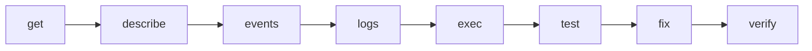
```mermaid
flowchart LR
  A[get] --> B[describe]
  B --> C[events]
  C --> D[logs]
  D --> E[exec]
  E --> F[test]
  F --> G[fix]
  G --> H[verify]
```

| Status that you see | First command | What to look for |
| :--- | :--- | :--- |
| `Pending` | `kubectl describe pod` | `FailedScheduling` event: CPU, memory, node selector, taints, PVC |
| `ContainerCreating` (for a long time) | `kubectl describe pod` | `FailedMount` event: missing ConfigMap, Secret, or PVC |
| `ErrImagePull` / `ImagePullBackOff` | `kubectl describe pod` | `Failed to pull image`: wrong name, wrong tag, registry, credentials |
| `CreateContainerConfigError` | `kubectl describe pod` | Missing ConfigMap key or Secret key |
| `CrashLoopBackOff` / `Error` | `kubectl logs --previous` | The error message of the application, the exit code |
| `Running` but not `Ready` | `kubectl describe pod` | `Unhealthy` event: readiness probe |
| `Running`, but the Service does not answer | `kubectl describe svc`, EndpointSlices | Selector, targetPort, listen address, DNS name |

---

## Task 1: Kubernetes Commands

Files: [01-kubectl-commands/](01-kubectl-commands/). All objects are in the namespace `s14-commands`.

### kubectl get

`kubectl get` lists objects and shows a short status for each one. Use labels (`-l`) to filter and `-o jsonpath` to extract one field.

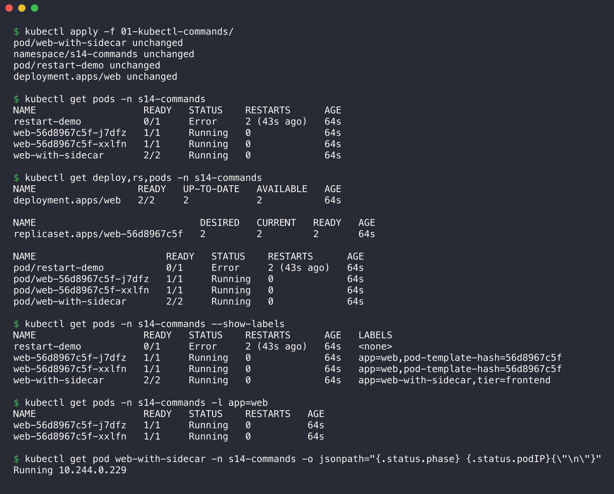

```console
$ kubectl apply -f 01-kubectl-commands/
pod/web-with-sidecar unchanged
namespace/s14-commands unchanged
pod/restart-demo unchanged
deployment.apps/web unchanged

$ kubectl get pods -n s14-commands
NAME                   READY   STATUS    RESTARTS      AGE
restart-demo           0/1     Error     2 (43s ago)   64s
web-56d8967c5f-j7dfz   1/1     Running   0             64s
web-56d8967c5f-xxlfn   1/1     Running   0             64s
web-with-sidecar       2/2     Running   0             64s

$ kubectl get deploy,rs,pods -n s14-commands
NAME                  READY   UP-TO-DATE   AVAILABLE   AGE
deployment.apps/web   2/2     2            2           64s

NAME                             DESIRED   CURRENT   READY   AGE
replicaset.apps/web-56d8967c5f   2         2         2       64s

NAME                       READY   STATUS    RESTARTS      AGE
pod/restart-demo           0/1     Error     2 (43s ago)   64s
pod/web-56d8967c5f-j7dfz   1/1     Running   0             64s
pod/web-56d8967c5f-xxlfn   1/1     Running   0             64s
pod/web-with-sidecar       2/2     Running   0             64s

$ kubectl get pods -n s14-commands --show-labels
NAME                   READY   STATUS    RESTARTS      AGE   LABELS
restart-demo           0/1     Error     2 (43s ago)   64s   <none>
web-56d8967c5f-j7dfz   1/1     Running   0             64s   app=web,pod-template-hash=56d8967c5f
web-56d8967c5f-xxlfn   1/1     Running   0             64s   app=web,pod-template-hash=56d8967c5f
web-with-sidecar       2/2     Running   0             64s   app=web-with-sidecar,tier=frontend

$ kubectl get pods -n s14-commands -l app=web
NAME                   READY   STATUS    RESTARTS   AGE
web-56d8967c5f-j7dfz   1/1     Running   0          64s
web-56d8967c5f-xxlfn   1/1     Running   0          64s

$ kubectl get pod web-with-sidecar -n s14-commands -o jsonpath="{.status.phase} {.status.podIP}{\"\n\"}"
Running 10.244.0.229
```

The objects were applied a short time before, so the first command shows `unchanged`. `restart-demo` already shows a problem: `Error` and 2 restarts.

### kubectl get -o wide

`-o wide` adds columns: the Pod IP, the node, the images, and the selector.

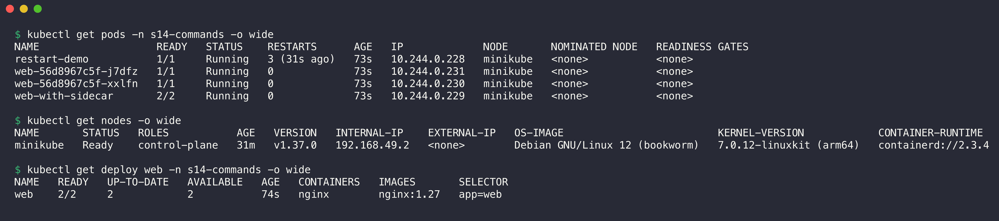

```console
$ kubectl get pods -n s14-commands -o wide
NAME                   READY   STATUS    RESTARTS      AGE   IP             NODE       NOMINATED NODE   READINESS GATES
restart-demo           1/1     Running   3 (31s ago)   73s   10.244.0.228   minikube   <none>           <none>
web-56d8967c5f-j7dfz   1/1     Running   0             73s   10.244.0.231   minikube   <none>           <none>
web-56d8967c5f-xxlfn   1/1     Running   0             73s   10.244.0.230   minikube   <none>           <none>
web-with-sidecar       2/2     Running   0             73s   10.244.0.229   minikube   <none>           <none>

$ kubectl get nodes -o wide
NAME       STATUS   ROLES           AGE   VERSION   INTERNAL-IP    EXTERNAL-IP   OS-IMAGE                         KERNEL-VERSION            CONTAINER-RUNTIME
minikube   Ready    control-plane   31m   v1.37.0   192.168.49.2   <none>        Debian GNU/Linux 12 (bookworm)   7.0.12-linuxkit (arm64)   containerd://2.3.4

$ kubectl get deploy web -n s14-commands -o wide
NAME   READY   UP-TO-DATE   AVAILABLE   AGE   CONTAINERS   IMAGES       SELECTOR
web    2/2     2            2           74s   nginx        nginx:1.27   app=web
```

The Pod IP helps to test a Pod directly. The node column helps when only one node has a problem.

### kubectl describe

`kubectl describe` shows the full state of one object and its recent events. For a Pod, it shows each container: image, state, restart count, resources, probes, and mounts.

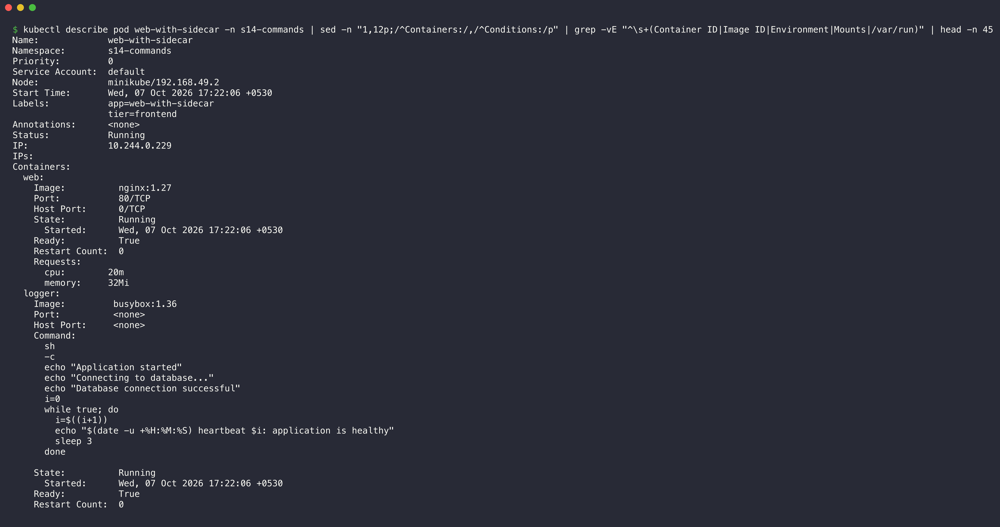

```console
$ kubectl describe pod web-with-sidecar -n s14-commands | sed -n "1,12p;/^Containers:/,/^Conditions:/p" | grep -vE "^\s+(Container ID|Image ID|Environment|Mounts|/var/run)" | head -n 45
Name:             web-with-sidecar
Namespace:        s14-commands
Priority:         0
Service Account:  default
Node:             minikube/192.168.49.2
Start Time:       Wed, 07 Oct 2026 17:22:06 +0530
Labels:           app=web-with-sidecar
                  tier=frontend
Annotations:      <none>
Status:           Running
IP:               10.244.0.229
IPs:
Containers:
  web:
    Image:          nginx:1.27
    Port:           80/TCP
    Host Port:      0/TCP
    State:          Running
      Started:      Wed, 07 Oct 2026 17:22:06 +0530
    Ready:          True
    Restart Count:  0
    Requests:
      cpu:        20m
      memory:     32Mi
  logger:
    Image:         busybox:1.36
    Port:          <none>
    Host Port:     <none>
    Command:
      sh
      -c
      echo "Application started"
      echo "Connecting to database..."
      echo "Database connection successful"
      i=0
      while true; do
        i=$((i+1))
        echo "$(date -u +%H:%M:%S) heartbeat $i: application is healthy"
        sleep 3
      done
      
    State:          Running
      Started:      Wed, 07 Oct 2026 17:22:06 +0530
    Ready:          True
    Restart Count:  0
```

For a container that fails, the `State`, `Last State`, and `Exit Code` fields are the most important:

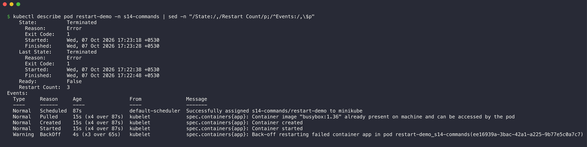

```console
$ kubectl describe pod restart-demo -n s14-commands | sed -n "/State:/,/Restart Count/p;/^Events:/,\$p"
    State:          Terminated
      Reason:       Error
      Exit Code:    1
      Started:      Wed, 07 Oct 2026 17:23:18 +0530
      Finished:     Wed, 07 Oct 2026 17:23:28 +0530
    Last State:     Terminated
      Reason:       Error
      Exit Code:    1
      Started:      Wed, 07 Oct 2026 17:22:38 +0530
      Finished:     Wed, 07 Oct 2026 17:22:48 +0530
    Ready:          False
    Restart Count:  3
Events:
  Type     Reason     Age                From               Message
  ----     ------     ----               ----               -------
  Normal   Scheduled  87s                default-scheduler  Successfully assigned s14-commands/restart-demo to minikube
  Normal   Pulled     15s (x4 over 87s)  kubelet            spec.containers{app}: Container image "busybox:1.36" already present on machine and can be accessed by the pod
  Normal   Created    15s (x4 over 87s)  kubelet            spec.containers{app}: Container created
  Normal   Started    15s (x4 over 87s)  kubelet            spec.containers{app}: Container started
  Warning  BackOff    4s (x3 over 65s)   kubelet            spec.containers{app}: Back-off restarting failed container app in pod restart-demo_s14-commands(ee16939a-3bac-42a1-a225-9b77e5c0a7c7)
```

Each run lasted 10 seconds and ended with exit code 1. The `BackOff` event shows that the kubelet waits longer before each restart.

### kubectl logs (-c, --tail, --since, --previous, -f)

`kubectl logs` shows the standard output and standard error of a container.

- `-c <name>` selects a container in a Pod with more than one container. Without `-c`, kubectl uses the default container and prints `Defaulted container`.
- `--all-containers --prefix` shows all containers with a name prefix.
- `--tail=N`, `--since=10s`, and `--timestamps` limit and mark the lines.
- `deployment/<name>` selects one Pod of the Deployment.

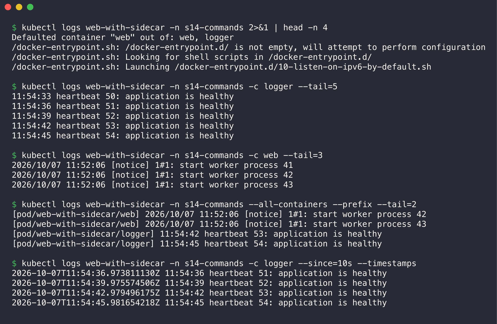

```console
$ kubectl logs web-with-sidecar -n s14-commands 2>&1 | head -n 4
Defaulted container "web" out of: web, logger
/docker-entrypoint.sh: /docker-entrypoint.d/ is not empty, will attempt to perform configuration
/docker-entrypoint.sh: Looking for shell scripts in /docker-entrypoint.d/
/docker-entrypoint.sh: Launching /docker-entrypoint.d/10-listen-on-ipv6-by-default.sh

$ kubectl logs web-with-sidecar -n s14-commands -c logger --tail=5
11:54:33 heartbeat 50: application is healthy
11:54:36 heartbeat 51: application is healthy
11:54:39 heartbeat 52: application is healthy
11:54:42 heartbeat 53: application is healthy
11:54:45 heartbeat 54: application is healthy

$ kubectl logs web-with-sidecar -n s14-commands -c web --tail=3
2026/10/07 11:52:06 [notice] 1#1: start worker process 41
2026/10/07 11:52:06 [notice] 1#1: start worker process 42
2026/10/07 11:52:06 [notice] 1#1: start worker process 43

$ kubectl logs web-with-sidecar -n s14-commands --all-containers --prefix --tail=2
[pod/web-with-sidecar/web] 2026/10/07 11:52:06 [notice] 1#1: start worker process 42
[pod/web-with-sidecar/web] 2026/10/07 11:52:06 [notice] 1#1: start worker process 43
[pod/web-with-sidecar/logger] 11:54:42 heartbeat 53: application is healthy
[pod/web-with-sidecar/logger] 11:54:45 heartbeat 54: application is healthy

$ kubectl logs web-with-sidecar -n s14-commands -c logger --since=10s --timestamps
2026-10-07T11:54:36.973811130Z 11:54:36 heartbeat 51: application is healthy
2026-10-07T11:54:39.975574506Z 11:54:39 heartbeat 52: application is healthy
2026-10-07T11:54:42.979496175Z 11:54:42 heartbeat 53: application is healthy
2026-10-07T11:54:45.981654218Z 11:54:45 heartbeat 54: application is healthy
```

`-f` (follow) streams new lines until you stop it. In the example, `timeout 10` stops it after 10 seconds:

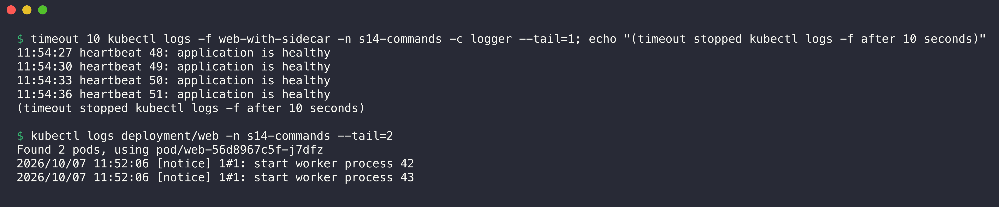

```console
$ timeout 10 kubectl logs -f web-with-sidecar -n s14-commands -c logger --tail=1; echo "(timeout stopped kubectl logs -f after 10 seconds)"
11:54:27 heartbeat 48: application is healthy
11:54:30 heartbeat 49: application is healthy
11:54:33 heartbeat 50: application is healthy
11:54:36 heartbeat 51: application is healthy
(timeout stopped kubectl logs -f after 10 seconds)

$ kubectl logs deployment/web -n s14-commands --tail=2
Found 2 pods, using pod/web-56d8967c5f-j7dfz
2026/10/07 11:52:06 [notice] 1#1: start worker process 42
2026/10/07 11:52:06 [notice] 1#1: start worker process 43
```

`--previous` shows the logs of the last container that stopped. This is the most important command for a container that crashes, because the new container does not have the error yet:

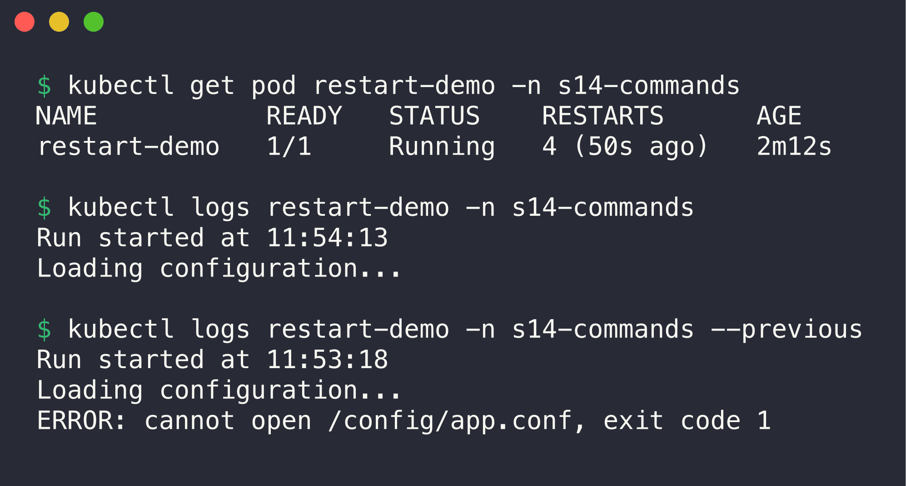

```console
$ kubectl get pod restart-demo -n s14-commands
NAME           READY   STATUS    RESTARTS      AGE
restart-demo   1/1     Running   4 (50s ago)   2m12s

$ kubectl logs restart-demo -n s14-commands
Run started at 11:54:13
Loading configuration...

$ kubectl logs restart-demo -n s14-commands --previous
Run started at 11:53:18
Loading configuration...
ERROR: cannot open /config/app.conf, exit code 1
```

The current run has not failed yet. The previous run shows the error line.

**Note:** My first `--previous` attempt failed with `unable to retrieve container logs for containerd://...`. At that time, the current container had also stopped (status `Error`, in back-off). The kubelet keeps only the last stopped container, so "previous" referred to a container that was already removed. When the container ran again, `--previous` worked.

### kubectl exec

`kubectl exec` runs a command inside a container. Use it to test from the view of the application: local HTTP calls, DNS settings, environment variables, and files.

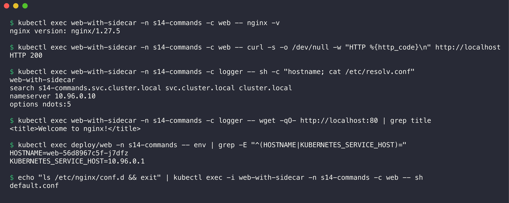

```console
$ kubectl exec web-with-sidecar -n s14-commands -c web -- nginx -v
nginx version: nginx/1.27.5

$ kubectl exec web-with-sidecar -n s14-commands -c web -- curl -s -o /dev/null -w "HTTP %{http_code}\n" http://localhost
HTTP 200

$ kubectl exec web-with-sidecar -n s14-commands -c logger -- sh -c "hostname; cat /etc/resolv.conf"
web-with-sidecar
search s14-commands.svc.cluster.local svc.cluster.local cluster.local
nameserver 10.96.0.10
options ndots:5

$ kubectl exec web-with-sidecar -n s14-commands -c logger -- wget -qO- http://localhost:80 | grep title
<title>Welcome to nginx!</title>

$ kubectl exec deploy/web -n s14-commands -- env | grep -E "^(HOSTNAME|KUBERNETES_SERVICE_HOST)="
HOSTNAME=web-56d8967c5f-j7dfz
KUBERNETES_SERVICE_HOST=10.96.0.1

$ echo "ls /etc/nginx/conf.d && exit" | kubectl exec -i web-with-sidecar -n s14-commands -c web -- sh
default.conf
```

The `logger` container reaches nginx on `localhost:80`, because all containers in a Pod share one network namespace. For an interactive shell, use `kubectl exec -it <pod> -- sh`. The last example sends the commands through standard input with `-i`.

### kubectl events

`kubectl events` lists events in time order. Use `--for` for one object and `--types=Warning` for problems only. The older form `kubectl get events` needs `--sort-by=.lastTimestamp` to show the events in time order.

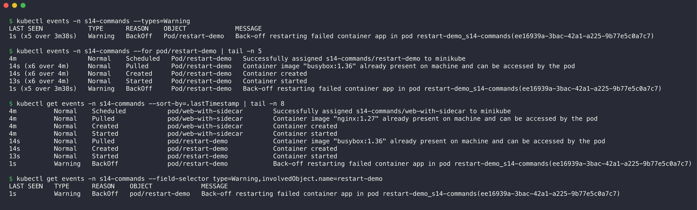

```console
$ kubectl events -n s14-commands --types=Warning
LAST SEEN            TYPE      REASON    OBJECT             MESSAGE
1s (x5 over 3m38s)   Warning   BackOff   Pod/restart-demo   Back-off restarting failed container app in pod restart-demo_s14-commands(ee16939a-3bac-42a1-a225-9b77e5c0a7c7)

$ kubectl events -n s14-commands --for pod/restart-demo | tail -n 5
4m                   Normal    Scheduled   Pod/restart-demo   Successfully assigned s14-commands/restart-demo to minikube
14s (x6 over 4m)     Normal    Pulled      Pod/restart-demo   Container image "busybox:1.36" already present on machine and can be accessed by the pod
14s (x6 over 4m)     Normal    Created     Pod/restart-demo   Container created
13s (x6 over 4m)     Normal    Started     Pod/restart-demo   Container started
1s (x5 over 3m38s)   Warning   BackOff     Pod/restart-demo   Back-off restarting failed container app in pod restart-demo_s14-commands(ee16939a-3bac-42a1-a225-9b77e5c0a7c7)

$ kubectl get events -n s14-commands --sort-by=.lastTimestamp | tail -n 8
4m          Normal    Scheduled           pod/web-with-sidecar        Successfully assigned s14-commands/web-with-sidecar to minikube
4m          Normal    Pulled              pod/web-with-sidecar        Container image "nginx:1.27" already present on machine and can be accessed by the pod
4m          Normal    Created             pod/web-with-sidecar        Container created
4m          Normal    Started             pod/web-with-sidecar        Container started
14s         Normal    Pulled              pod/restart-demo            Container image "busybox:1.36" already present on machine and can be accessed by the pod
14s         Normal    Created             pod/restart-demo            Container created
13s         Normal    Started             pod/restart-demo            Container started
1s          Warning   BackOff             pod/restart-demo            Back-off restarting failed container app in pod restart-demo_s14-commands(ee16939a-3bac-42a1-a225-9b77e5c0a7c7)

$ kubectl get events -n s14-commands --field-selector type=Warning,involvedObject.name=restart-demo
LAST SEEN   TYPE      REASON    OBJECT             MESSAGE
1s          Warning   BackOff   pod/restart-demo   Back-off restarting failed container app in pod restart-demo_s14-commands(ee16939a-3bac-42a1-a225-9b77e5c0a7c7)
```

Kubernetes keeps events for about 1 hour by default. Examine them soon after a problem.

### kubectl explain

`kubectl explain` shows the documentation of a field from the API schema of the cluster. Use it when you do not know the name or the type of a YAML field.

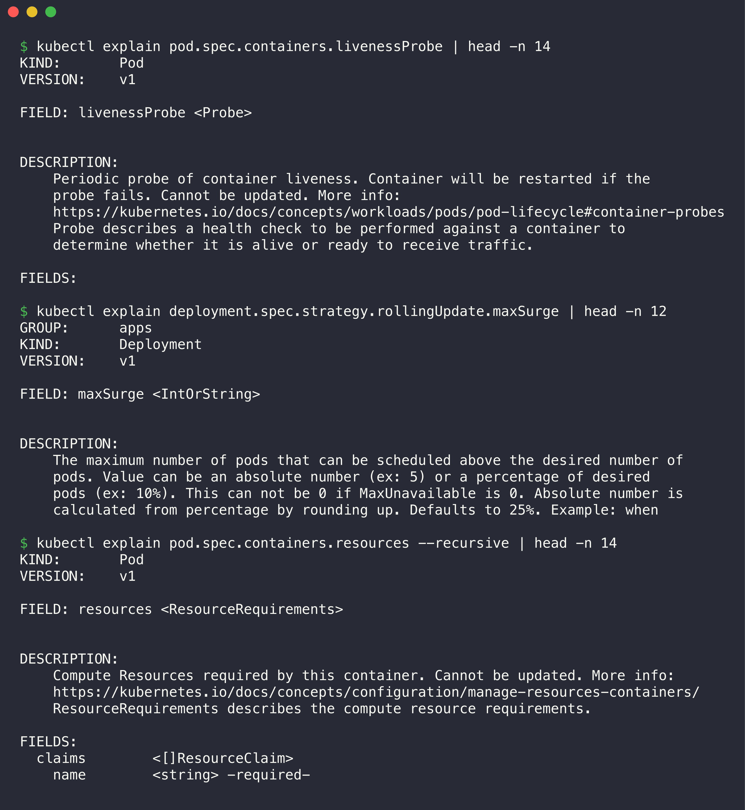

```console
$ kubectl explain pod.spec.containers.livenessProbe | head -n 14
KIND:       Pod
VERSION:    v1

FIELD: livenessProbe <Probe>


DESCRIPTION:
    Periodic probe of container liveness. Container will be restarted if the
    probe fails. Cannot be updated. More info:
    https://kubernetes.io/docs/concepts/workloads/pods/pod-lifecycle#container-probes
    Probe describes a health check to be performed against a container to
    determine whether it is alive or ready to receive traffic.
    
FIELDS:

$ kubectl explain deployment.spec.strategy.rollingUpdate.maxSurge | head -n 12
GROUP:      apps
KIND:       Deployment
VERSION:    v1

FIELD: maxSurge <IntOrString>


DESCRIPTION:
    The maximum number of pods that can be scheduled above the desired number of
    pods. Value can be an absolute number (ex: 5) or a percentage of desired
    pods (ex: 10%). This can not be 0 if MaxUnavailable is 0. Absolute number is
    calculated from percentage by rounding up. Defaults to 25%. Example: when

$ kubectl explain pod.spec.containers.resources --recursive | head -n 14
KIND:       Pod
VERSION:    v1

FIELD: resources <ResourceRequirements>


DESCRIPTION:
    Compute Resources required by this container. Cannot be updated. More info:
    https://kubernetes.io/docs/concepts/configuration/manage-resources-containers/
    ResourceRequirements describes the compute resource requirements.
    
FIELDS:
  claims	<[]ResourceClaim>
    name	<string> -required-
```

The text "Cannot be updated" is useful in troubleshooting. It tells you that you must create the Pod again to change a probe.

### kubectl top

`kubectl top` shows the current CPU and memory use from metrics-server.

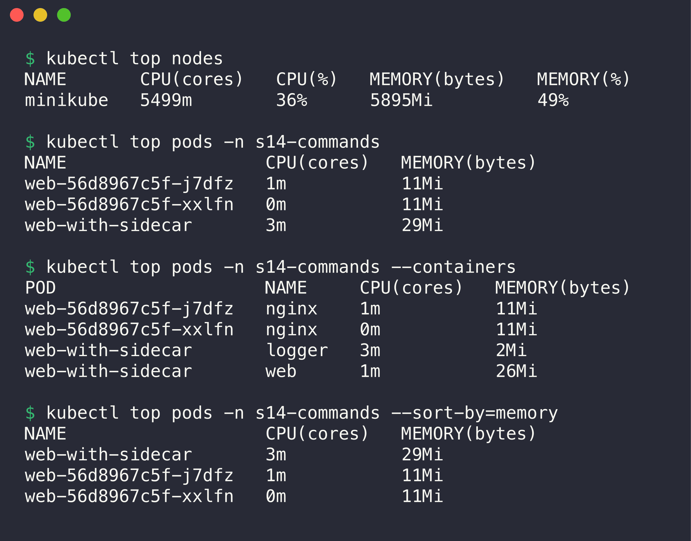

```console
$ kubectl top nodes
NAME       CPU(cores)   CPU(%)   MEMORY(bytes)   MEMORY(%)   
minikube   5499m        36%      5895Mi          49%         

$ kubectl top pods -n s14-commands
NAME                   CPU(cores)   MEMORY(bytes)   
web-56d8967c5f-j7dfz   1m           11Mi            
web-56d8967c5f-xxlfn   0m           11Mi            
web-with-sidecar       3m           29Mi            

$ kubectl top pods -n s14-commands --containers
POD                    NAME     CPU(cores)   MEMORY(bytes)   
web-56d8967c5f-j7dfz   nginx    1m           11Mi            
web-56d8967c5f-xxlfn   nginx    0m           11Mi            
web-with-sidecar       logger   3m           2Mi             
web-with-sidecar       web      1m           26Mi            

$ kubectl top pods -n s14-commands --sort-by=memory
NAME                   CPU(cores)   MEMORY(bytes)   
web-with-sidecar       3m           29Mi            
web-56d8967c5f-j7dfz   1m           11Mi            
web-56d8967c5f-xxlfn   0m           11Mi            
```

`--containers` shows each container. Use it to find which container of a Pod uses the memory (for example before an `OOMKilled` error).

### Command summary

| Command | Use it to |
| :--- | :--- |
| `kubectl get <kind> [-o wide] [-l k=v] [--show-labels]` | List objects, status, restarts, IP, node, labels |
| `kubectl describe <kind> <name>` | Full state, container state, exit code, probes, events |
| `kubectl logs <pod> [-c c] [--previous] [-f] [--tail]` | Application output, crash messages |
| `kubectl exec [-it] <pod> [-c c] -- <cmd>` | Test from inside: curl, nslookup, env, files, listen ports |
| `kubectl events [--for kind/name] [--types=Warning]` | Time line of what Kubernetes did |
| `kubectl explain <field.path>` | Field documentation and types |
| `kubectl top nodes / pods [--containers]` | Current CPU and memory use |

---

## Task 2: Troubleshoot Common Issues

All labs are in the namespace `s14-issues` (the DNS backend is in `s14-dns-backend`). Each issue has its own folder with a broken YAML file and a fixed YAML file. Each section has the six steps from the brief: identify, investigate, root cause, fix, verify, and document.

Apply the shared objects first:

```bash
kubectl apply -f 02-common-issues/namespace.yaml -f 02-common-issues/client.yaml
```

### Issue 1: CrashLoopBackOff

Files: [broken.yaml](02-common-issues/01-crashloopbackoff/broken.yaml), [fixed.yaml](02-common-issues/01-crashloopbackoff/fixed.yaml)

**1. Identify the problem.** The Pod does not stay up and the status is `CrashLoopBackOff`.

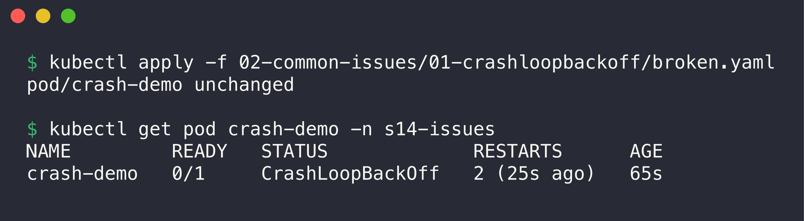

```console
$ kubectl apply -f 02-common-issues/01-crashloopbackoff/broken.yaml
pod/crash-demo unchanged

$ kubectl get pod crash-demo -n s14-issues
NAME         READY   STATUS             RESTARTS      AGE
crash-demo   0/1     CrashLoopBackOff   2 (25s ago)   65s
```

**2. Investigate.**

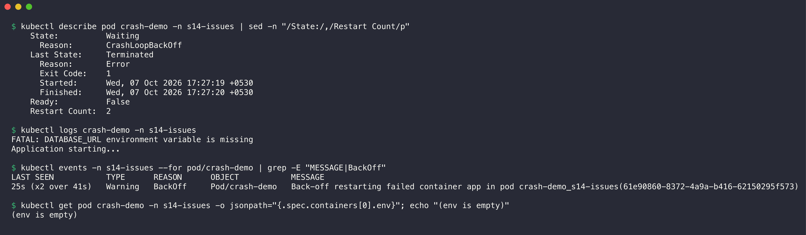

```console
$ kubectl describe pod crash-demo -n s14-issues | sed -n "/State:/,/Restart Count/p"
    State:          Waiting
      Reason:       CrashLoopBackOff
    Last State:     Terminated
      Reason:       Error
      Exit Code:    1
      Started:      Wed, 07 Oct 2026 17:27:19 +0530
      Finished:     Wed, 07 Oct 2026 17:27:20 +0530
    Ready:          False
    Restart Count:  2

$ kubectl logs crash-demo -n s14-issues
FATAL: DATABASE_URL environment variable is missing
Application starting...

$ kubectl events -n s14-issues --for pod/crash-demo | grep -E "MESSAGE|BackOff"
LAST SEEN           TYPE      REASON      OBJECT           MESSAGE
25s (x2 over 41s)   Warning   BackOff     Pod/crash-demo   Back-off restarting failed container app in pod crash-demo_s14-issues(61e90860-8372-4a9a-b416-62150295f573)

$ kubectl get pod crash-demo -n s14-issues -o jsonpath="{.spec.containers[0].env}"; echo "(env is empty)"
(env is empty)
```

(The stderr line prints before the stdout line because the runtime buffers the two streams differently.)

**3. Root cause.** The process ran for about 1 second and exited with code 1. The log says `DATABASE_URL environment variable is missing`, and the Pod spec has no `env`. The image and Kubernetes are correct. The application configuration is incomplete. `CrashLoopBackOff` is not the error itself. It means "the container stopped again, and the kubelet waits longer (10s, 20s, 40s, up to 5 minutes) before the next start".

**4. Fix.** Add the environment variable. Kubernetes does not let you change the `env` of a Pod in place, so delete the Pod and apply the fixed file.

**5. Verify.**

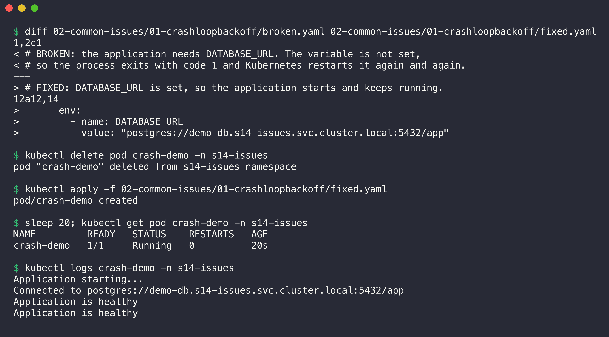

```console
$ diff 02-common-issues/01-crashloopbackoff/broken.yaml 02-common-issues/01-crashloopbackoff/fixed.yaml
1,2c1
< # BROKEN: the application needs DATABASE_URL. The variable is not set,
< # so the process exits with code 1 and Kubernetes restarts it again and again.
---
> # FIXED: DATABASE_URL is set, so the application starts and keeps running.
12a12,14
>       env:
>         - name: DATABASE_URL
>           value: "postgres://demo-db.s14-issues.svc.cluster.local:5432/app"

$ kubectl delete pod crash-demo -n s14-issues
pod "crash-demo" deleted from s14-issues namespace

$ kubectl apply -f 02-common-issues/01-crashloopbackoff/fixed.yaml
pod/crash-demo created

$ sleep 20; kubectl get pod crash-demo -n s14-issues
NAME         READY   STATUS    RESTARTS   AGE
crash-demo   1/1     Running   0          20s

$ kubectl logs crash-demo -n s14-issues
Application starting...
Connected to postgres://demo-db.s14-issues.svc.cluster.local:5432/app
Application is healthy
Application is healthy
```

**Before / after:** `CrashLoopBackOff`, 2 restarts, exit code 1 → `Running`, 0 restarts, the log shows "Application is healthy".

### Issue 2: ImagePullBackOff

Files: [broken.yaml](02-common-issues/02-imagepullbackoff/broken.yaml), [fixed.yaml](02-common-issues/02-imagepullbackoff/fixed.yaml)

**1. Identify the problem.**

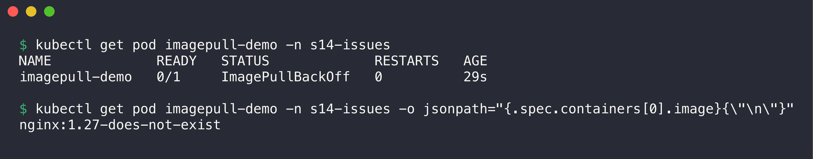

```console
$ kubectl get pod imagepull-demo -n s14-issues
NAME             READY   STATUS             RESTARTS   AGE
imagepull-demo   0/1     ImagePullBackOff   0          29s

$ kubectl get pod imagepull-demo -n s14-issues -o jsonpath="{.spec.containers[0].image}{\"\n\"}"
nginx:1.27-does-not-exist
```

**2. Investigate.**


```console
$ kubectl describe pod imagepull-demo -n s14-issues | sed -n "/State:/,/Ready:/p;/^Events:/,\$p"
    State:          Waiting
      Reason:       ImagePullBackOff
    Ready:          False
Events:
  Type     Reason     Age                From               Message
  ----     ------     ----               ----               -------
  Normal   Scheduled  30s                default-scheduler  Successfully assigned s14-issues/imagepull-demo to minikube
  Normal   BackOff    24s                kubelet            spec.containers{web}: Back-off pulling image "nginx:1.27-does-not-exist"
  Warning  Failed     24s                kubelet            spec.containers{web}: Error: ImagePullBackOff
  Normal   Pulling    10s (x2 over 27s)  kubelet            spec.containers{web}: Pulling image "nginx:1.27-does-not-exist"
  Warning  Failed     6s (x2 over 24s)   kubelet            spec.containers{web}: Failed to pull image "nginx:1.27-does-not-exist": failed to pull and unpack image "docker.io/library/nginx:1.27-does-not-exist": failed to resolve reference "docker.io/library/nginx:1.27-does-not-exist": unexpected status from HEAD request to https://registry-1.docker.io/v2/library/nginx/manifests/1.27-does-not-exist: 429 Too Many Requests
  Warning  Failed     6s (x2 over 24s)   kubelet            spec.containers{web}: Error: ErrImagePull
```

The first attempts got `429 Too Many Requests` from Docker Hub. The cluster is shared and many Pods pull images from the same IP address, so Docker Hub applied its anonymous rate limit. This is a second possible cause of `ImagePullBackOff`, so I examined more.


```console
$ kubectl events -n s14-issues --for pod/imagepull-demo | grep "Failed to pull" | tail -n 1
35s                 Warning   Failed      Pod/imagepull-demo   Failed to pull image "nginx:1.27-does-not-exist": rpc error: code = NotFound desc = failed to pull and unpack image "docker.io/library/nginx:1.27-does-not-exist": failed to resolve reference "docker.io/library/nginx:1.27-does-not-exist": docker.io/library/nginx:1.27-does-not-exist: not found

$ curl -s -o /dev/null -w "tag 1.27-does-not-exist -> HTTP %{http_code}\n" https://hub.docker.com/v2/repositories/library/nginx/tags/1.27-does-not-exist
tag 1.27-does-not-exist -> HTTP 404

$ curl -s -o /dev/null -w "tag 1.27               -> HTTP %{http_code}\n" https://hub.docker.com/v2/repositories/library/nginx/tags/1.27
tag 1.27               -> HTTP 200
```

**3. Root cause.** The next pull attempt returned `NotFound ... not found`. The Docker Hub tag API returns 404 for `1.27-does-not-exist` and 200 for `1.27`. The tag in the Pod spec does not exist. The 429 error was a temporary side effect of the shared IP address.

`ErrImagePull` is the result of one failed pull. `ImagePullBackOff` means that the kubelet waits before the next try. The two statuses alternate.

**4. Fix.** Change the image to `nginx:1.27`. The `image` field is one of the few Pod fields that you can change in place, so `kubectl apply` is enough.

**5. Verify.**

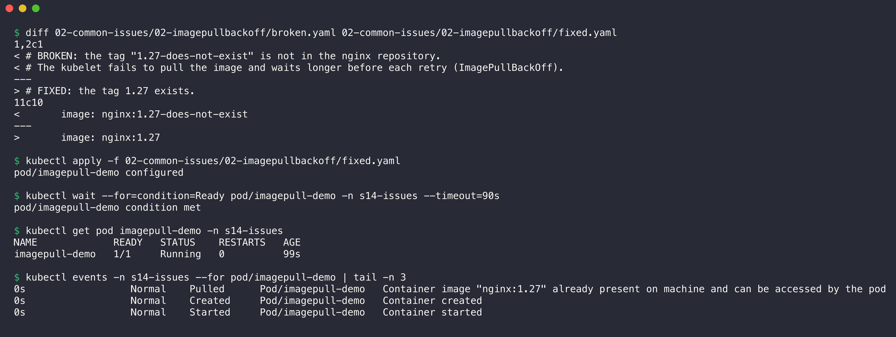

```console
$ diff 02-common-issues/02-imagepullbackoff/broken.yaml 02-common-issues/02-imagepullbackoff/fixed.yaml
1,2c1
< # BROKEN: the tag "1.27-does-not-exist" is not in the nginx repository.
< # The kubelet fails to pull the image and waits longer before each retry (ImagePullBackOff).
---
> # FIXED: the tag 1.27 exists.
11c10
<       image: nginx:1.27-does-not-exist
---
>       image: nginx:1.27

$ kubectl apply -f 02-common-issues/02-imagepullbackoff/fixed.yaml
pod/imagepull-demo configured

$ kubectl wait --for=condition=Ready pod/imagepull-demo -n s14-issues --timeout=90s
pod/imagepull-demo condition met

$ kubectl get pod imagepull-demo -n s14-issues
NAME             READY   STATUS    RESTARTS   AGE
imagepull-demo   1/1     Running   0          99s

$ kubectl events -n s14-issues --for pod/imagepull-demo | tail -n 3
0s                  Normal    Pulled      Pod/imagepull-demo   Container image "nginx:1.27" already present on machine and can be accessed by the pod
0s                  Normal    Created     Pod/imagepull-demo   Container created
0s                  Normal    Started     Pod/imagepull-demo   Container started
```

**Before / after:** `ImagePullBackOff`, image tag not found → `Running`, image `nginx:1.27`.

### Issue 3: ErrImagePull

Files: [broken.yaml](02-common-issues/03-errimagepull/broken.yaml), [fixed.yaml](02-common-issues/03-errimagepull/fixed.yaml)

**1. Identify the problem.** I captured the status 2 seconds after the Pod was created, before the first back-off.


```console
$ kubectl get pod errimagepull-demo -n s14-issues
NAME                READY   STATUS         RESTARTS   AGE
errimagepull-demo   0/1     ErrImagePull   0          2s

$ kubectl describe pod errimagepull-demo -n s14-issues | sed -n "/^Events:/,\$p"
Events:
  Type     Reason     Age   From               Message
  ----     ------     ----  ----               -------
  Normal   Scheduled  2s    default-scheduler  Successfully assigned s14-issues/errimagepull-demo to minikube
  Normal   Pulling    1s    kubelet            spec.containers{web}: Pulling image "registry.invalid/team/nginx:1.27"
  Warning  Failed     1s    kubelet            spec.containers{web}: Failed to pull image "registry.invalid/team/nginx:1.27": failed to pull and unpack image "registry.invalid/team/nginx:1.27": failed to resolve reference "registry.invalid/team/nginx:1.27": failed to do request: Head "https://registry.invalid/v2/team/nginx/manifests/1.27": dial tcp: lookup registry.invalid on 192.168.65.254:53: no such host
  Warning  Failed     1s    kubelet            spec.containers{web}: Error: ErrImagePull
  Normal   BackOff    0s    kubelet            spec.containers{web}: Back-off pulling image "registry.invalid/team/nginx:1.27"
  Warning  Failed     0s    kubelet            spec.containers{web}: Error: ImagePullBackOff
```

The events show the order: `Pulling` → `Failed` (`ErrImagePull`) → `BackOff` (`ImagePullBackOff`).

**2. Investigate.** The message says `lookup registry.invalid ... no such host`. I checked DNS on the node, where containerd pulls images.


```console
$ kubectl get pod errimagepull-demo -n s14-issues -o jsonpath="{.status.containerStatuses[0].state.waiting}{\"\n\"}"
{"message":"failed to pull and unpack image \"registry.invalid/team/nginx:1.27\": failed to resolve reference \"registry.invalid/team/nginx:1.27\": failed to do request: Head \"https://registry.invalid/v2/team/nginx/manifests/1.27\": dial tcp: lookup registry.invalid on 192.168.65.254:53: no such host","reason":"ErrImagePull"}

$ minikube ssh -- nslookup registry.invalid 2>&1 | tail -n 3
** server can't find registry.invalid: NXDOMAIN

ssh: Process exited with status 1

$ minikube ssh -- nslookup registry-1.docker.io 2>&1 | grep -m2 -E "Name|Address"
Address:	192.168.65.254#53
Name:	registry-1.docker.io
```

**3. Root cause.** The image name starts with a registry host, `registry.invalid`. That host does not exist (NXDOMAIN), so the node cannot connect to a registry. DNS on the node works, because `registry-1.docker.io` resolves. Other causes of `ErrImagePull` are a private registry without `imagePullSecrets` (`401 Unauthorized`), a wrong repository name, or an image without the node architecture (`no match for platform`).

**4. Fix.** Use the correct registry and repository: `docker.io/library/nginx:1.27`.

**5. Verify.**

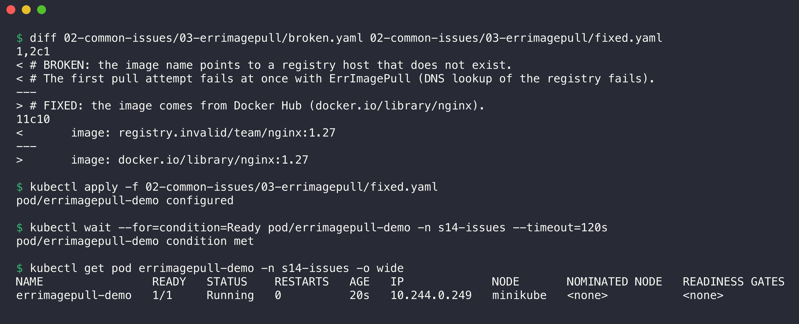

```console
$ diff 02-common-issues/03-errimagepull/broken.yaml 02-common-issues/03-errimagepull/fixed.yaml
1,2c1
< # BROKEN: the image name points to a registry host that does not exist.
< # The first pull attempt fails at once with ErrImagePull (DNS lookup of the registry fails).
---
> # FIXED: the image comes from Docker Hub (docker.io/library/nginx).
11c10
<       image: registry.invalid/team/nginx:1.27
---
>       image: docker.io/library/nginx:1.27

$ kubectl apply -f 02-common-issues/03-errimagepull/fixed.yaml
pod/errimagepull-demo configured

$ kubectl wait --for=condition=Ready pod/errimagepull-demo -n s14-issues --timeout=120s
pod/errimagepull-demo condition met

$ kubectl get pod errimagepull-demo -n s14-issues -o wide
NAME                READY   STATUS    RESTARTS   AGE   IP             NODE       NOMINATED NODE   READINESS GATES
errimagepull-demo   1/1     Running   0          20s   10.244.0.249   minikube   <none>           <none>
```

**Before / after:** `ErrImagePull` (registry host not found) → `Running`.

### Issue 4: Pending

Files: [broken.yaml](02-common-issues/04-pending/broken.yaml), [fixed.yaml](02-common-issues/04-pending/fixed.yaml)

**1. Identify the problem.** The Pod has no IP and no node.

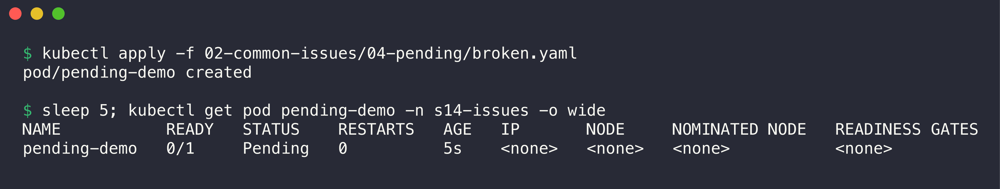

```console
$ kubectl apply -f 02-common-issues/04-pending/broken.yaml
pod/pending-demo created

$ sleep 5; kubectl get pod pending-demo -n s14-issues -o wide
NAME           READY   STATUS    RESTARTS   AGE   IP       NODE     NOMINATED NODE   READINESS GATES
pending-demo   0/1     Pending   0          5s    <none>   <none>   <none>           <none>
```

**2. Investigate.**

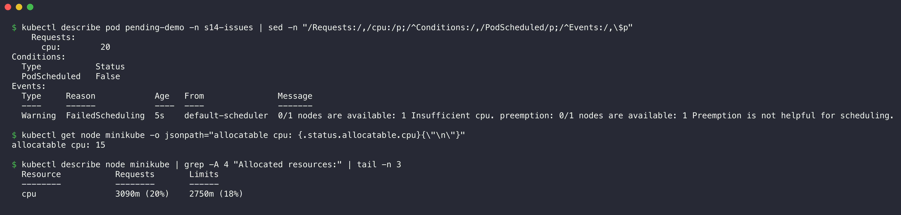

```console
$ kubectl describe pod pending-demo -n s14-issues | sed -n "/Requests:/,/cpu:/p;/^Conditions:/,/PodScheduled/p;/^Events:/,\$p"
    Requests:
      cpu:        20
Conditions:
  Type           Status
  PodScheduled   False 
Events:
  Type     Reason            Age   From               Message
  ----     ------            ----  ----               -------
  Warning  FailedScheduling  5s    default-scheduler  0/1 nodes are available: 1 Insufficient cpu. preemption: 0/1 nodes are available: 1 Preemption is not helpful for scheduling.

$ kubectl get node minikube -o jsonpath="allocatable cpu: {.status.allocatable.cpu}{\"\n\"}"
allocatable cpu: 15

$ kubectl describe node minikube | grep -A 4 "Allocated resources:" | tail -n 3
  Resource           Requests       Limits
  --------           --------       ------
  cpu                3090m (20%)    2750m (18%)
```

**3. Root cause.** The Pod requests 20 CPU cores. The only node has 15 allocatable cores, and 3.09 cores are already requested. The scheduler cannot find a node, so `PodScheduled` is `False`. Preemption does not help, because no node could ever fit 20 cores. Other causes of `Pending` are a `nodeSelector` or affinity that matches no node, a taint without a toleration, and a PVC that is not bound.

**Note:** My first try of this lab also requested 64Mi of memory, and the event said `Insufficient cpu, 1 Insufficient memory`. Another workload on the shared node had requested 99% of the memory at that time. I removed the memory request from the lab files, so that the lab shows one clear cause.

**4. Fix.** Request a CPU amount that fits (`100m`). Delete the Pod and apply the fixed file.

**5. Verify.**

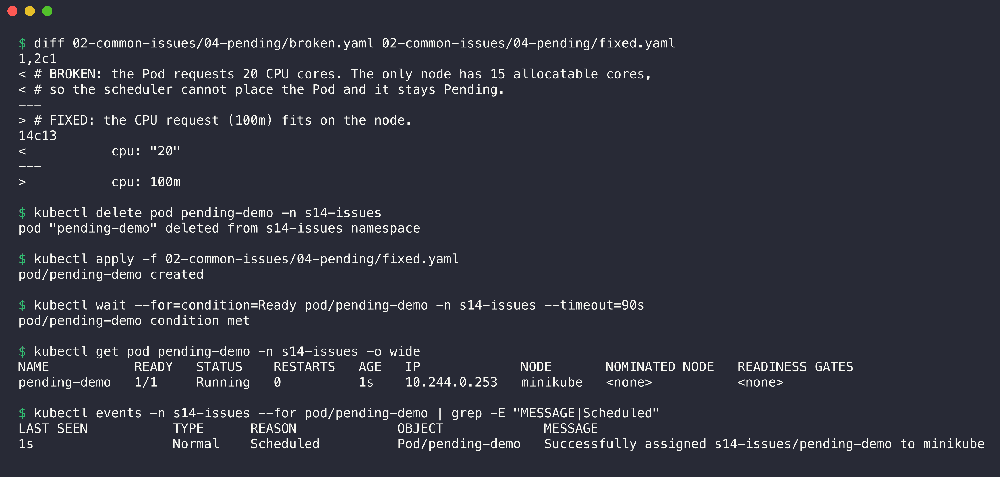

```console
$ diff 02-common-issues/04-pending/broken.yaml 02-common-issues/04-pending/fixed.yaml
1,2c1
< # BROKEN: the Pod requests 20 CPU cores. The only node has 15 allocatable cores,
< # so the scheduler cannot place the Pod and it stays Pending.
---
> # FIXED: the CPU request (100m) fits on the node.
14c13
<           cpu: "20"
---
>           cpu: 100m

$ kubectl delete pod pending-demo -n s14-issues
pod "pending-demo" deleted from s14-issues namespace

$ kubectl apply -f 02-common-issues/04-pending/fixed.yaml
pod/pending-demo created

$ kubectl wait --for=condition=Ready pod/pending-demo -n s14-issues --timeout=90s
pod/pending-demo condition met

$ kubectl get pod pending-demo -n s14-issues -o wide
NAME           READY   STATUS    RESTARTS   AGE   IP             NODE       NOMINATED NODE   READINESS GATES
pending-demo   1/1     Running   0          1s    10.244.0.253   minikube   <none>           <none>

$ kubectl events -n s14-issues --for pod/pending-demo | grep -E "MESSAGE|Scheduled"
LAST SEEN           TYPE      REASON             OBJECT             MESSAGE
1s                  Normal    Scheduled          Pod/pending-demo   Successfully assigned s14-issues/pending-demo to minikube
```

**Before / after:** `Pending`, no node, `Insufficient cpu` → `Running` on node `minikube`.

### Issue 5: ContainerCreating

Files: [broken.yaml](02-common-issues/05-containercreating/broken.yaml), [fixed-configmap.yaml](02-common-issues/05-containercreating/fixed-configmap.yaml)

**1. Identify the problem.** A Pod normally leaves `ContainerCreating` in a few seconds. This Pod stays there.

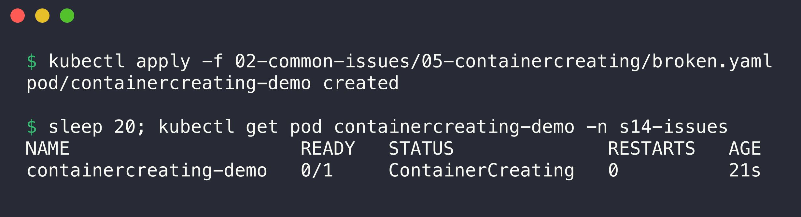

```console
$ kubectl apply -f 02-common-issues/05-containercreating/broken.yaml
pod/containercreating-demo created

$ sleep 20; kubectl get pod containercreating-demo -n s14-issues
NAME                     READY   STATUS              RESTARTS   AGE
containercreating-demo   0/1     ContainerCreating   0          21s
```

**2. Investigate.**

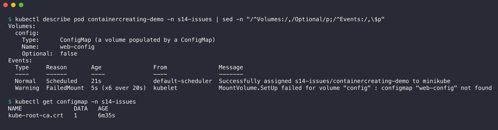

```console
$ kubectl describe pod containercreating-demo -n s14-issues | sed -n "/^Volumes:/,/Optional/p;/^Events:/,\$p"
Volumes:
  config:
    Type:      ConfigMap (a volume populated by a ConfigMap)
    Name:      web-config
    Optional:  false
Events:
  Type     Reason       Age               From               Message
  ----     ------       ----              ----               -------
  Normal   Scheduled    21s               default-scheduler  Successfully assigned s14-issues/containercreating-demo to minikube
  Warning  FailedMount  5s (x6 over 20s)  kubelet            MountVolume.SetUp failed for volume "config" : configmap "web-config" not found

$ kubectl get configmap -n s14-issues
NAME               DATA   AGE
kube-root-ca.crt   1      6m35s
```

**3. Root cause.** The Pod mounts the ConfigMap `web-config` as a volume (`Optional: false`). That ConfigMap does not exist in the namespace. The kubelet cannot prepare the volume, so it does not start the container. `kubectl logs` shows nothing, because no container exists yet. A missing Secret or a PVC that cannot attach gives the same symptom.

**4. Fix.** Create the missing ConfigMap. The kubelet retries the mount, so you do not need to recreate the Pod.

**5. Verify.**

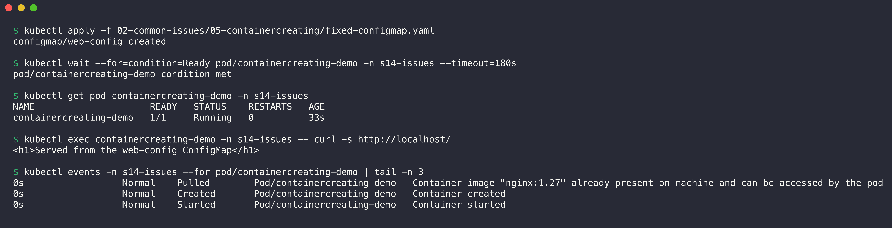

```console
$ kubectl apply -f 02-common-issues/05-containercreating/fixed-configmap.yaml
configmap/web-config created

$ kubectl wait --for=condition=Ready pod/containercreating-demo -n s14-issues --timeout=180s
pod/containercreating-demo condition met

$ kubectl get pod containercreating-demo -n s14-issues
NAME                     READY   STATUS    RESTARTS   AGE
containercreating-demo   1/1     Running   0          33s

$ kubectl exec containercreating-demo -n s14-issues -- curl -s http://localhost/
<h1>Served from the web-config ConfigMap</h1>

$ kubectl events -n s14-issues --for pod/containercreating-demo | tail -n 3
0s                  Normal    Pulled        Pod/containercreating-demo   Container image "nginx:1.27" already present on machine and can be accessed by the pod
0s                  Normal    Created       Pod/containercreating-demo   Container created
0s                  Normal    Started       Pod/containercreating-demo   Container started
```

**Before / after:** `ContainerCreating` with `FailedMount` → `Running`, and nginx serves the page from the ConfigMap.

### Issue 6: Service connectivity issues

Files: [deployment.yaml](02-common-issues/06-service-connectivity/deployment.yaml), [broken-service-selector.yaml](02-common-issues/06-service-connectivity/broken-service-selector.yaml), [broken-service-targetport.yaml](02-common-issues/06-service-connectivity/broken-service-targetport.yaml), [fixed-service.yaml](02-common-issues/06-service-connectivity/fixed-service.yaml)

The backend Deployment `api` has 2 nginx Pods with the label `app=api` and container port 80. This lab shows two separate faults.

#### Case A: The selector does not match

**1. Identify the problem.** The Pods run, but a client cannot connect to the Service.

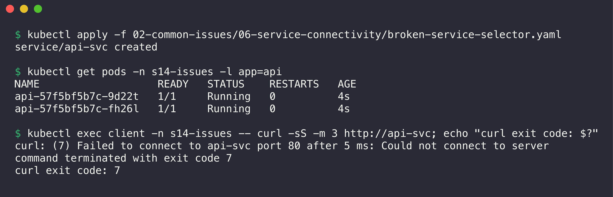

```console
$ kubectl apply -f 02-common-issues/06-service-connectivity/broken-service-selector.yaml
service/api-svc created

$ kubectl get pods -n s14-issues -l app=api
NAME                   READY   STATUS    RESTARTS   AGE
api-57f5bf5b7c-9d22t   1/1     Running   0          4s
api-57f5bf5b7c-fh26l   1/1     Running   0          4s

$ kubectl exec client -n s14-issues -- curl -sS -m 3 http://api-svc; echo "curl exit code: $?"
curl: (7) Failed to connect to api-svc port 80 after 5 ms: Could not connect to server
command terminated with exit code 7
curl exit code: 7
```

**2. Investigate.**

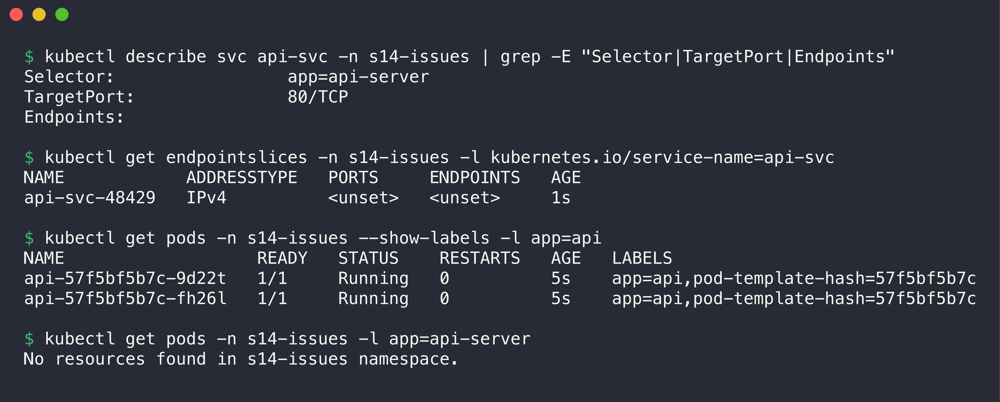

```console
$ kubectl describe svc api-svc -n s14-issues | grep -E "Selector|TargetPort|Endpoints"
Selector:                 app=api-server
TargetPort:               80/TCP
Endpoints:                

$ kubectl get endpointslices -n s14-issues -l kubernetes.io/service-name=api-svc
NAME            ADDRESSTYPE   PORTS     ENDPOINTS   AGE
api-svc-48429   IPv4          <unset>   <unset>     1s

$ kubectl get pods -n s14-issues --show-labels -l app=api
NAME                   READY   STATUS    RESTARTS   AGE   LABELS
api-57f5bf5b7c-9d22t   1/1     Running   0          5s    app=api,pod-template-hash=57f5bf5b7c
api-57f5bf5b7c-fh26l   1/1     Running   0          5s    app=api,pod-template-hash=57f5bf5b7c

$ kubectl get pods -n s14-issues -l app=api-server
No resources found in s14-issues namespace.
```

**3. Root cause.** The Service selector is `app=api-server`, but the Pods have the label `app=api`. No Pod matches the selector, so the Service has no endpoints. DNS still resolves the name `api-svc` to the ClusterIP (curl did not report a DNS error). But kube-proxy has no backend for that IP, so the connection is refused.

#### Case B: The selector matches, but targetPort is wrong

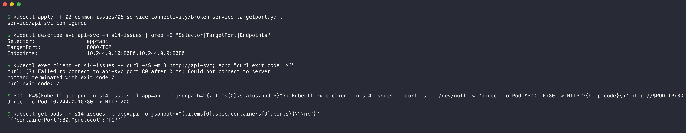

```console
$ kubectl apply -f 02-common-issues/06-service-connectivity/broken-service-targetport.yaml
service/api-svc configured

$ kubectl describe svc api-svc -n s14-issues | grep -E "Selector|TargetPort|Endpoints"
Selector:                 app=api
TargetPort:               8080/TCP
Endpoints:                10.244.0.10:8080,10.244.0.9:8080

$ kubectl exec client -n s14-issues -- curl -sS -m 3 http://api-svc; echo "curl exit code: $?"
curl: (7) Failed to connect to api-svc port 80 after 0 ms: Could not connect to server
command terminated with exit code 7
curl exit code: 7

$ POD_IP=$(kubectl get pod -n s14-issues -l app=api -o jsonpath="{.items[0].status.podIP}"); kubectl exec client -n s14-issues -- curl -s -o /dev/null -w "direct to Pod $POD_IP:80 -> HTTP %{http_code}\n" http://$POD_IP:80
direct to Pod 10.244.0.10:80 -> HTTP 200

$ kubectl get pods -n s14-issues -l app=api -o jsonpath="{.items[0].spec.containers[0].ports}{\"\n\"}"
[{"containerPort":80,"protocol":"TCP"}]
```

**Root cause B.** Now the Service has 2 endpoints, but on port 8080. nginx listens on port 80: the direct request to `PodIP:80` returns 200. kube-proxy forwards to `PodIP:8080`, where nothing listens, so the connection is refused. Endpoints that exist do not prove that the port is correct.

**4. Fix.** Use `app: api` as the selector and `targetPort: 80`.

**5. Verify.**

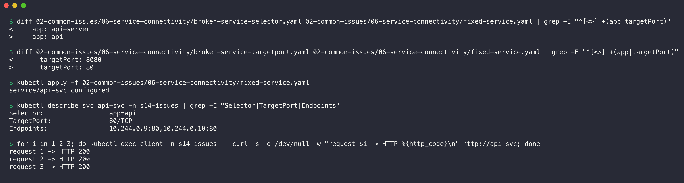

```console
$ diff 02-common-issues/06-service-connectivity/broken-service-selector.yaml 02-common-issues/06-service-connectivity/fixed-service.yaml | grep -E "^[<>] +(app|targetPort)"
<     app: api-server
>     app: api

$ diff 02-common-issues/06-service-connectivity/broken-service-targetport.yaml 02-common-issues/06-service-connectivity/fixed-service.yaml | grep -E "^[<>] +(app|targetPort)"
<       targetPort: 8080
>       targetPort: 80

$ kubectl apply -f 02-common-issues/06-service-connectivity/fixed-service.yaml
service/api-svc configured

$ kubectl describe svc api-svc -n s14-issues | grep -E "Selector|TargetPort|Endpoints"
Selector:                 app=api
TargetPort:               80/TCP
Endpoints:                10.244.0.9:80,10.244.0.10:80

$ for i in 1 2 3; do kubectl exec client -n s14-issues -- curl -s -o /dev/null -w "request $i -> HTTP %{http_code}\n" http://api-svc; done
request 1 -> HTTP 200
request 2 -> HTTP 200
request 3 -> HTTP 200
```

**Before / after:** no endpoints (case A) or endpoints on the wrong port (case B), curl exit code 7 → 2 endpoints on port 80, HTTP 200.

### Issue 7: DNS issues

Files: [backend.yaml](02-common-issues/07-dns/backend.yaml), [broken-client.yaml](02-common-issues/07-dns/broken-client.yaml), [fixed-client.yaml](02-common-issues/07-dns/fixed-client.yaml)

The Service `orders-svc` is in the namespace `s14-dns-backend`. The client Pod `orders-client` is in `s14-issues` and calls the URL from the variable `ORDERS_URL` every 5 seconds. I did not change CoreDNS. The fault is in the client configuration.

**1. Identify the problem.**

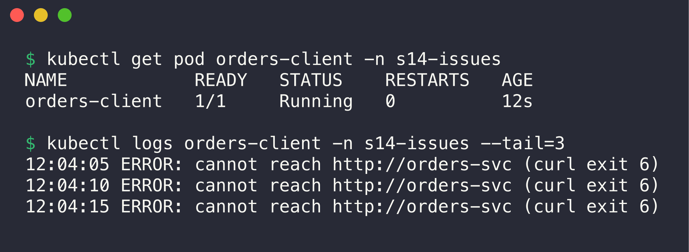

```console
$ kubectl get pod orders-client -n s14-issues
NAME            READY   STATUS    RESTARTS   AGE
orders-client   1/1     Running   0          12s

$ kubectl logs orders-client -n s14-issues --tail=3
12:04:05 ERROR: cannot reach http://orders-svc (curl exit 6)
12:04:10 ERROR: cannot reach http://orders-svc (curl exit 6)
12:04:15 ERROR: cannot reach http://orders-svc (curl exit 6)
```

curl exit code 6 means "could not resolve host". This is a DNS problem, not a connection problem (exit code 7).

**2. Investigate.**

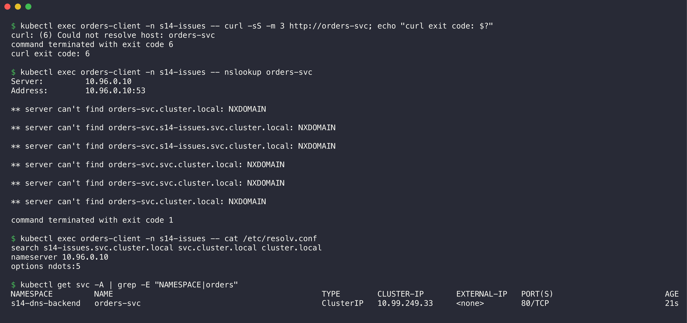

```console
$ kubectl exec orders-client -n s14-issues -- curl -sS -m 3 http://orders-svc; echo "curl exit code: $?"
curl: (6) Could not resolve host: orders-svc
command terminated with exit code 6
curl exit code: 6

$ kubectl exec orders-client -n s14-issues -- nslookup orders-svc
Server:		10.96.0.10
Address:	10.96.0.10:53

** server can't find orders-svc.cluster.local: NXDOMAIN

** server can't find orders-svc.s14-issues.svc.cluster.local: NXDOMAIN

** server can't find orders-svc.s14-issues.svc.cluster.local: NXDOMAIN

** server can't find orders-svc.svc.cluster.local: NXDOMAIN

** server can't find orders-svc.svc.cluster.local: NXDOMAIN

** server can't find orders-svc.cluster.local: NXDOMAIN

command terminated with exit code 1

$ kubectl exec orders-client -n s14-issues -- cat /etc/resolv.conf
search s14-issues.svc.cluster.local svc.cluster.local cluster.local
nameserver 10.96.0.10
options ndots:5

$ kubectl get svc -A | grep -E "NAMESPACE|orders"
NAMESPACE         NAME                                             TYPE        CLUSTER-IP       EXTERNAL-IP   PORT(S)                        AGE
s14-dns-backend   orders-svc                                       ClusterIP   10.99.249.33     <none>        80/TCP                         21s
```

Make sure that CoreDNS works (read-only checks):

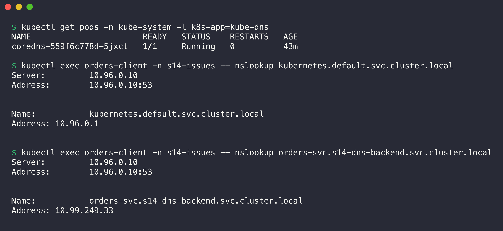

```console
$ kubectl get pods -n kube-system -l k8s-app=kube-dns
NAME                       READY   STATUS    RESTARTS   AGE
coredns-559f6c778d-5jxct   1/1     Running   0          43m

$ kubectl exec orders-client -n s14-issues -- nslookup kubernetes.default.svc.cluster.local
Server:		10.96.0.10
Address:	10.96.0.10:53


Name:	kubernetes.default.svc.cluster.local
Address: 10.96.0.1


$ kubectl exec orders-client -n s14-issues -- nslookup orders-svc.s14-dns-backend.svc.cluster.local
Server:		10.96.0.10
Address:	10.96.0.10:53


Name:	orders-svc.s14-dns-backend.svc.cluster.local
Address: 10.99.249.33
```

**3. Root cause.** CoreDNS is healthy: it resolves `kubernetes.default.svc.cluster.local` and the full name of the orders Service. The search list in `/etc/resolv.conf` starts with `s14-issues.svc.cluster.local`. So the short name `orders-svc` becomes `orders-svc.s14-issues.svc.cluster.local`, and that Service does not exist. A short Service name works only inside the same namespace. The Service is in `s14-dns-backend`.

**4. Fix.** Use the fully qualified domain name: `orders-svc.s14-dns-backend.svc.cluster.local` (the form `orders-svc.s14-dns-backend` also works). Environment variables of a Pod cannot change in place, so recreate the client Pod.

**5. Verify.**

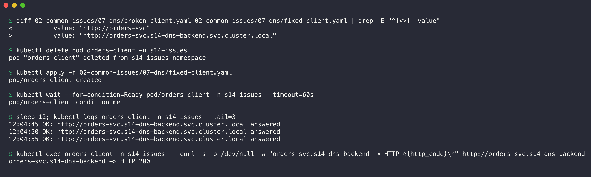

```console
$ diff 02-common-issues/07-dns/broken-client.yaml 02-common-issues/07-dns/fixed-client.yaml | grep -E "^[<>] +value"
<           value: "http://orders-svc"
>           value: "http://orders-svc.s14-dns-backend.svc.cluster.local"

$ kubectl delete pod orders-client -n s14-issues
pod "orders-client" deleted from s14-issues namespace

$ kubectl apply -f 02-common-issues/07-dns/fixed-client.yaml
pod/orders-client created

$ kubectl wait --for=condition=Ready pod/orders-client -n s14-issues --timeout=60s
pod/orders-client condition met

$ sleep 12; kubectl logs orders-client -n s14-issues --tail=3
12:04:45 OK: http://orders-svc.s14-dns-backend.svc.cluster.local answered
12:04:50 OK: http://orders-svc.s14-dns-backend.svc.cluster.local answered
12:04:55 OK: http://orders-svc.s14-dns-backend.svc.cluster.local answered

$ kubectl exec orders-client -n s14-issues -- curl -s -o /dev/null -w "orders-svc.s14-dns-backend -> HTTP %{http_code}\n" http://orders-svc.s14-dns-backend
orders-svc.s14-dns-backend -> HTTP 200
```

**Before / after:** `Could not resolve host` (exit code 6), NXDOMAIN → "answered", HTTP 200.

### Issue 8: Pod networking issues

Files: [broken.yaml](02-common-issues/08-pod-networking/broken.yaml), [fixed.yaml](02-common-issues/08-pod-networking/fixed.yaml)

The Deployment `inventory` runs a busybox HTTP server on port 8080 behind the Service `inventory-svc`.

**1. Identify the problem.** The Pod is `Running` and `Ready`, and the Service has an endpoint. But neither the Service nor the Pod IP answers.

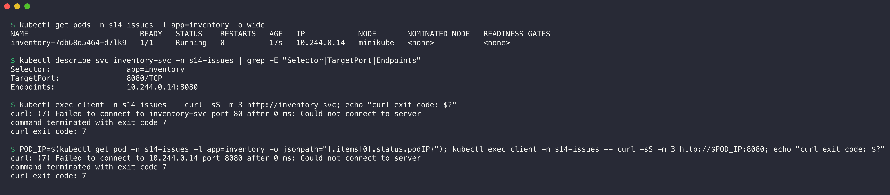

```console
$ kubectl get pods -n s14-issues -l app=inventory -o wide
NAME                         READY   STATUS    RESTARTS   AGE   IP            NODE       NOMINATED NODE   READINESS GATES
inventory-7db68d5464-d7lk9   1/1     Running   0          17s   10.244.0.14   minikube   <none>           <none>

$ kubectl describe svc inventory-svc -n s14-issues | grep -E "Selector|TargetPort|Endpoints"
Selector:                 app=inventory
TargetPort:               8080/TCP
Endpoints:                10.244.0.14:8080

$ kubectl exec client -n s14-issues -- curl -sS -m 3 http://inventory-svc; echo "curl exit code: $?"
curl: (7) Failed to connect to inventory-svc port 80 after 0 ms: Could not connect to server
command terminated with exit code 7
curl exit code: 7

$ POD_IP=$(kubectl get pod -n s14-issues -l app=inventory -o jsonpath="{.items[0].status.podIP}"); kubectl exec client -n s14-issues -- curl -sS -m 3 http://$POD_IP:8080; echo "curl exit code: $?"
curl: (7) Failed to connect to 10.244.0.14 port 8080 after 0 ms: Could not connect to server
command terminated with exit code 7
curl exit code: 7
```

The direct request to the Pod IP also fails. So the problem is not the Service. It is between the network and the process in the Pod.

**2. Investigate.** Test from inside the Pod and examine the listen sockets.

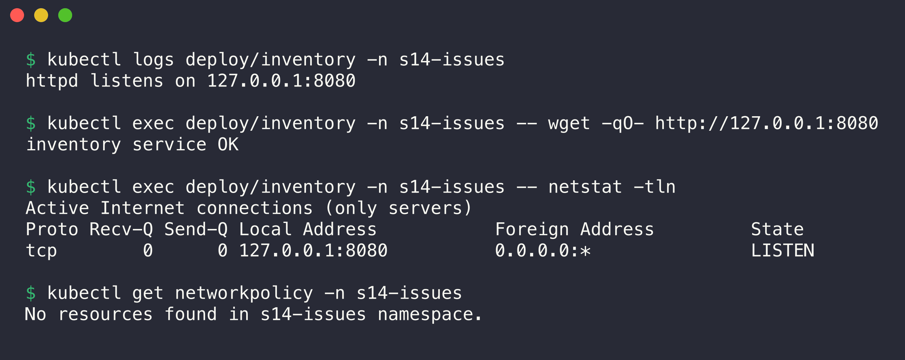

```console
$ kubectl logs deploy/inventory -n s14-issues
httpd listens on 127.0.0.1:8080

$ kubectl exec deploy/inventory -n s14-issues -- wget -qO- http://127.0.0.1:8080
inventory service OK

$ kubectl exec deploy/inventory -n s14-issues -- netstat -tln
Active Internet connections (only servers)
Proto Recv-Q Send-Q Local Address           Foreign Address         State       
tcp        0      0 127.0.0.1:8080          0.0.0.0:*               LISTEN      

$ kubectl get networkpolicy -n s14-issues
No resources found in s14-issues namespace.
```

**3. Root cause.** The server listens on `127.0.0.1:8080` (loopback only). A request from inside the container works. A request to the Pod IP `10.244.0.14` arrives on the `eth0` interface, where no process listens, so the kernel refuses the connection. No NetworkPolicy exists. Also, the kindnet CNI of this cluster does not enforce NetworkPolicy, so a policy cannot be the cause here. Other causes of the same symptom are a `containerPort`/`targetPort` that differs from the real port, and an application that listens only on IPv6.

**4. Fix.** Make the server listen on `0.0.0.0:8080` (all interfaces).

**5. Verify.**

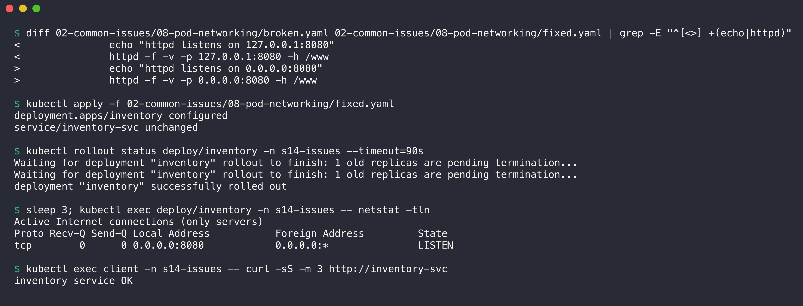

```console
$ diff 02-common-issues/08-pod-networking/broken.yaml 02-common-issues/08-pod-networking/fixed.yaml | grep -E "^[<>] +(echo|httpd)"
<               echo "httpd listens on 127.0.0.1:8080"
<               httpd -f -v -p 127.0.0.1:8080 -h /www
>               echo "httpd listens on 0.0.0.0:8080"
>               httpd -f -v -p 0.0.0.0:8080 -h /www

$ kubectl apply -f 02-common-issues/08-pod-networking/fixed.yaml
deployment.apps/inventory configured
service/inventory-svc unchanged

$ kubectl rollout status deploy/inventory -n s14-issues --timeout=90s
Waiting for deployment "inventory" rollout to finish: 1 old replicas are pending termination...
Waiting for deployment "inventory" rollout to finish: 1 old replicas are pending termination...
deployment "inventory" successfully rolled out

$ sleep 3; kubectl exec deploy/inventory -n s14-issues -- netstat -tln
Active Internet connections (only servers)
Proto Recv-Q Send-Q Local Address           Foreign Address         State       
tcp        0      0 0.0.0.0:8080            0.0.0.0:*               LISTEN      

$ kubectl exec client -n s14-issues -- curl -sS -m 3 http://inventory-svc
inventory service OK
```

**Before / after:** listen address `127.0.0.1:8080`, connection refused → `0.0.0.0:8080`, the Service returns "inventory service OK".

### Issue 9: Configuration issues

Files: [configmap.yaml](02-common-issues/09-configuration/configmap.yaml), [broken.yaml](02-common-issues/09-configuration/broken.yaml), [fixed.yaml](02-common-issues/09-configuration/fixed.yaml)

**1. Identify the problem.**

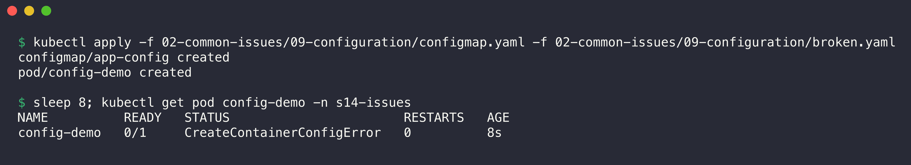

```console
$ kubectl apply -f 02-common-issues/09-configuration/configmap.yaml -f 02-common-issues/09-configuration/broken.yaml
configmap/app-config created
pod/config-demo created

$ sleep 8; kubectl get pod config-demo -n s14-issues
NAME          READY   STATUS                       RESTARTS   AGE
config-demo   0/1     CreateContainerConfigError   0          8s
```

**2. Investigate.**

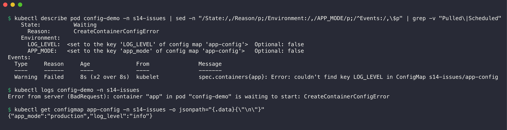

```console
$ kubectl describe pod config-demo -n s14-issues | sed -n "/State:/,/Reason/p;/Environment:/,/APP_MODE/p;/^Events:/,\$p" | grep -v "Pulled\|Scheduled"
    State:          Waiting
      Reason:       CreateContainerConfigError
    Environment:
      LOG_LEVEL:  <set to the key 'LOG_LEVEL' of config map 'app-config'>  Optional: false
      APP_MODE:   <set to the key 'app_mode' of config map 'app-config'>   Optional: false
Events:
  Type     Reason     Age              From               Message
  ----     ------     ----             ----               -------
  Warning  Failed     8s (x2 over 8s)  kubelet            spec.containers{app}: Error: couldn't find key LOG_LEVEL in ConfigMap s14-issues/app-config

$ kubectl logs config-demo -n s14-issues
Error from server (BadRequest): container "app" in pod "config-demo" is waiting to start: CreateContainerConfigError

$ kubectl get configmap app-config -n s14-issues -o jsonpath="{.data}{\"\n\"}"
{"app_mode":"production","log_level":"info"}
```

**3. Root cause.** The Pod reads the key `LOG_LEVEL` from the ConfigMap `app-config`. The ConfigMap has the key `log_level` (lower case). Keys are case-sensitive, so the kubelet cannot build the environment and does not create the container. No logs exist, because the container never started. The same error comes from a missing ConfigMap or Secret, or a wrong Secret key.

**4. Fix.** Use the key `log_level` in the Pod. (Another correct fix is to add the key `LOG_LEVEL` to the ConfigMap.) `env` cannot change in place, so recreate the Pod.

**5. Verify.**

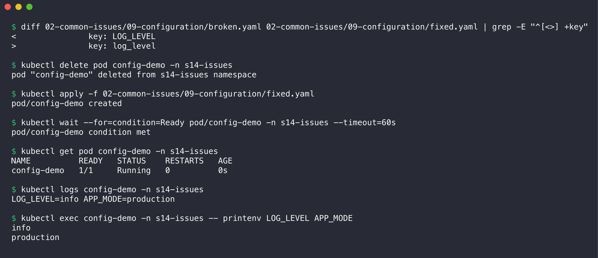

```console
$ diff 02-common-issues/09-configuration/broken.yaml 02-common-issues/09-configuration/fixed.yaml | grep -E "^[<>] +key"
<               key: LOG_LEVEL
>               key: log_level

$ kubectl delete pod config-demo -n s14-issues
pod "config-demo" deleted from s14-issues namespace

$ kubectl apply -f 02-common-issues/09-configuration/fixed.yaml
pod/config-demo created

$ kubectl wait --for=condition=Ready pod/config-demo -n s14-issues --timeout=60s
pod/config-demo condition met

$ kubectl get pod config-demo -n s14-issues
NAME          READY   STATUS    RESTARTS   AGE
config-demo   1/1     Running   0          0s

$ kubectl logs config-demo -n s14-issues
LOG_LEVEL=info APP_MODE=production

$ kubectl exec config-demo -n s14-issues -- printenv LOG_LEVEL APP_MODE
info
production
```

**Before / after:** `CreateContainerConfigError` → `Running`, and the application reads `LOG_LEVEL=info`.

### Final state of all labs

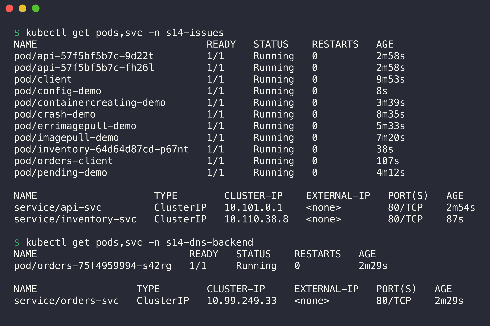

```console
$ kubectl get pods,svc -n s14-issues
NAME                             READY   STATUS    RESTARTS   AGE
pod/api-57f5bf5b7c-9d22t         1/1     Running   0          2m58s
pod/api-57f5bf5b7c-fh26l         1/1     Running   0          2m58s
pod/client                       1/1     Running   0          9m53s
pod/config-demo                  1/1     Running   0          8s
pod/containercreating-demo       1/1     Running   0          3m39s
pod/crash-demo                   1/1     Running   0          8m35s
pod/errimagepull-demo            1/1     Running   0          5m33s
pod/imagepull-demo               1/1     Running   0          7m20s
pod/inventory-64d64d87cd-p67nt   1/1     Running   0          38s
pod/orders-client                1/1     Running   0          107s
pod/pending-demo                 1/1     Running   0          4m12s

NAME                    TYPE        CLUSTER-IP    EXTERNAL-IP   PORT(S)   AGE
service/api-svc         ClusterIP   10.101.0.1    <none>        80/TCP    2m54s
service/inventory-svc   ClusterIP   10.110.38.8   <none>        80/TCP    87s

$ kubectl get pods,svc -n s14-dns-backend
NAME                          READY   STATUS    RESTARTS   AGE
pod/orders-75f4959994-s42rg   1/1     Running   0          2m29s

NAME                 TYPE        CLUSTER-IP     EXTERNAL-IP   PORT(S)   AGE
service/orders-svc   ClusterIP   10.99.249.33   <none>        80/TCP    2m29s
```

### Summary of the issues

| # | Issue | Key symptom | Command that found the cause | Root cause | Fix |
| :--- | :--- | :--- | :--- | :--- | :--- |
| 1 | CrashLoopBackOff | Exit code 1, restarts | `kubectl logs` | `DATABASE_URL` not set | Add the env variable |
| 2 | ImagePullBackOff | `not found` (and a temporary 429) | `kubectl describe pod` | Image tag does not exist | Use tag `1.27` |
| 3 | ErrImagePull | `no such host` | `kubectl describe pod`, `nslookup` on the node | Registry host does not exist | Use `docker.io/library/nginx:1.27` |
| 4 | Pending | `Insufficient cpu` | `kubectl describe pod` | Request of 20 CPU > 15 allocatable | Request `100m` |
| 5 | ContainerCreating | `FailedMount` | `kubectl describe pod` | ConfigMap `web-config` missing | Create the ConfigMap |
| 6 | Service connectivity | No endpoints / refused | `kubectl describe svc`, `--show-labels` | Selector mismatch, wrong `targetPort` | Fix the selector and the port |
| 7 | DNS | curl exit 6, NXDOMAIN | `nslookup`, `/etc/resolv.conf` | Short name used across namespaces | Use the FQDN |
| 8 | Pod networking | Pod IP refuses, localhost works | `kubectl exec ... netstat -tln` | Server bound to `127.0.0.1` | Bind to `0.0.0.0` |
| 9 | Configuration | `CreateContainerConfigError` | `kubectl describe pod` | ConfigMap key `LOG_LEVEL` missing | Use key `log_level` |

---

## Task 3: Mini Project

This is the "Kubernetes Troubleshooting Challenge" from the class material: deploy, observe, break, investigate, find the root cause, fix, and verify. All objects are in the namespace `s14-mini`.

Files: [namespace.yaml](mini-project/namespace.yaml), [deployment.yaml](mini-project/deployment.yaml), [service.yaml](mini-project/service.yaml), [broken-pod.yaml](mini-project/broken-pod.yaml), [fixed-pod.yaml](mini-project/fixed-pod.yaml), [broken-service.yaml](mini-project/broken-service.yaml).

### 1. Deploy the application

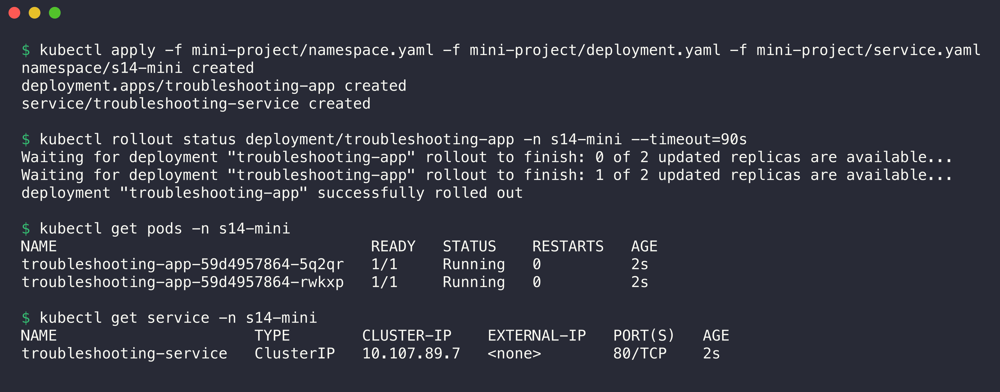

```console
$ kubectl apply -f mini-project/namespace.yaml -f mini-project/deployment.yaml -f mini-project/service.yaml
namespace/s14-mini created
deployment.apps/troubleshooting-app created
service/troubleshooting-service created

$ kubectl rollout status deployment/troubleshooting-app -n s14-mini --timeout=90s
Waiting for deployment "troubleshooting-app" rollout to finish: 0 of 2 updated replicas are available...
Waiting for deployment "troubleshooting-app" rollout to finish: 1 of 2 updated replicas are available...
deployment "troubleshooting-app" successfully rolled out

$ kubectl get pods -n s14-mini
NAME                                   READY   STATUS    RESTARTS   AGE
troubleshooting-app-59d4957864-5q2qr   1/1     Running   0          2s
troubleshooting-app-59d4957864-rwkxp   1/1     Running   0          2s

$ kubectl get service -n s14-mini
NAME                      TYPE        CLUSTER-IP    EXTERNAL-IP   PORT(S)   AGE
troubleshooting-service   ClusterIP   10.107.89.7   <none>        80/TCP    2s
```

### 2. Check the application

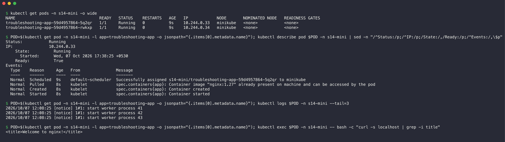

```console
$ kubectl get pods -n s14-mini -o wide
NAME                                   READY   STATUS    RESTARTS   AGE   IP            NODE       NOMINATED NODE   READINESS GATES
troubleshooting-app-59d4957864-5q2qr   1/1     Running   0          9s    10.244.0.33   minikube   <none>           <none>
troubleshooting-app-59d4957864-rwkxp   1/1     Running   0          9s    10.244.0.34   minikube   <none>           <none>

$ POD=$(kubectl get pod -n s14-mini -l app=troubleshooting-app -o jsonpath="{.items[0].metadata.name}"); kubectl describe pod $POD -n s14-mini | sed -n "/^Status:/p;/^IP:/p;/State:/,/Ready:/p;/^Events:/,\$p"
Status:           Running
IP:               10.244.0.33
    State:          Running
      Started:      Wed, 07 Oct 2026 17:38:25 +0530
    Ready:          True
Events:
  Type    Reason     Age   From               Message
  ----    ------     ----  ----               -------
  Normal  Scheduled  9s    default-scheduler  Successfully assigned s14-mini/troubleshooting-app-59d4957864-5q2qr to minikube
  Normal  Pulled     8s    kubelet            spec.containers{app}: Container image "nginx:1.27" already present on machine and can be accessed by the pod
  Normal  Created    8s    kubelet            spec.containers{app}: Container created
  Normal  Started    8s    kubelet            spec.containers{app}: Container started

$ POD=$(kubectl get pod -n s14-mini -l app=troubleshooting-app -o jsonpath="{.items[0].metadata.name}"); kubectl logs $POD -n s14-mini --tail=3
2026/10/07 12:08:25 [notice] 1#1: start worker process 41
2026/10/07 12:08:25 [notice] 1#1: start worker process 42
2026/10/07 12:08:25 [notice] 1#1: start worker process 43

$ POD=$(kubectl get pod -n s14-mini -l app=troubleshooting-app -o jsonpath="{.items[0].metadata.name}"); kubectl exec $POD -n s14-mini -- bash -c "curl -s localhost | grep -i title"
<title>Welcome to nginx!</title>
```

The Pods run, the events are all `Normal`, nginx started its workers, and `curl localhost` inside the container returns the nginx page.

### 3 and 4. Check the Service and the endpoints

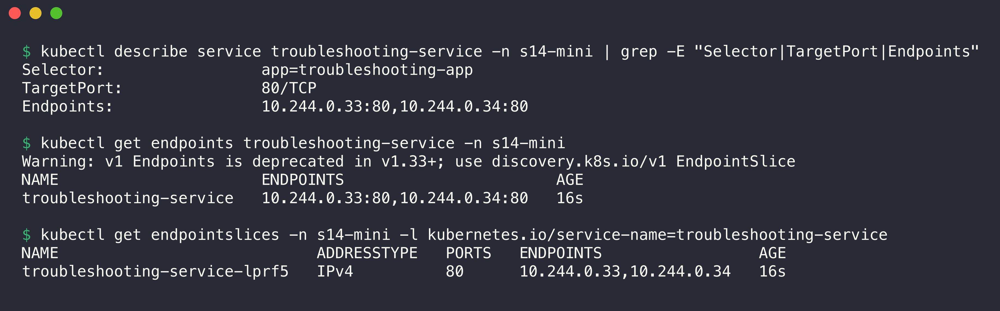

```console
$ kubectl describe service troubleshooting-service -n s14-mini | grep -E "Selector|TargetPort|Endpoints"
Selector:                 app=troubleshooting-app
TargetPort:               80/TCP
Endpoints:                10.244.0.33:80,10.244.0.34:80

$ kubectl get endpoints troubleshooting-service -n s14-mini
Warning: v1 Endpoints is deprecated in v1.33+; use discovery.k8s.io/v1 EndpointSlice
NAME                      ENDPOINTS                       AGE
troubleshooting-service   10.244.0.33:80,10.244.0.34:80   16s

$ kubectl get endpointslices -n s14-mini -l kubernetes.io/service-name=troubleshooting-service
NAME                            ADDRESSTYPE   PORTS   ENDPOINTS                 AGE
troubleshooting-service-lprf5   IPv4          80      10.244.0.33,10.244.0.34   16s
```

The selector matches the Pods, the targetPort is 80, and the endpoints are the two Pod IPs. Kubernetes v1.33+ marks the old `Endpoints` API as deprecated. EndpointSlices give the same information.

### 5. Create a broken Pod

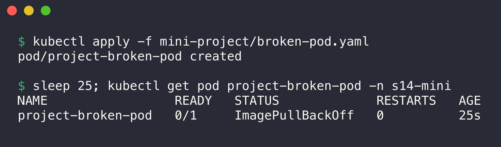

```console
$ kubectl apply -f mini-project/broken-pod.yaml
pod/project-broken-pod created

$ sleep 25; kubectl get pod project-broken-pod -n s14-mini
NAME                 READY   STATUS             RESTARTS   AGE
project-broken-pod   0/1     ImagePullBackOff   0          25s
```

### 6. Troubleshoot it (no YAML change first)


```console
$ kubectl get pod project-broken-pod -n s14-mini
NAME                 READY   STATUS         RESTARTS   AGE
project-broken-pod   0/1     ErrImagePull   0          31s

$ kubectl describe pod project-broken-pod -n s14-mini | sed -n "/^Containers:/,/Ready:/p;/^Events:/,\$p" | grep -v "Container ID"
Containers:
  app:
    Image:          nginx:this-tag-does-not-exist
    Image ID:       
    Port:           <none>
    Host Port:      <none>
    State:          Waiting
      Reason:       ErrImagePull
    Ready:          False
Events:
  Type     Reason     Age                From               Message
  ----     ------     ----               ----               -------
  Normal   Scheduled  31s                default-scheduler  Successfully assigned s14-mini/project-broken-pod to minikube
  Normal   Pulling    17s (x2 over 31s)  kubelet            spec.containers{app}: Pulling image "nginx:this-tag-does-not-exist"
  Warning  Failed     15s (x2 over 29s)  kubelet            spec.containers{app}: Failed to pull image "nginx:this-tag-does-not-exist": rpc error: code = NotFound desc = failed to pull and unpack image "docker.io/library/nginx:this-tag-does-not-exist": failed to resolve reference "docker.io/library/nginx:this-tag-does-not-exist": docker.io/library/nginx:this-tag-does-not-exist: not found
  Warning  Failed     15s (x2 over 29s)  kubelet            spec.containers{app}: Error: ErrImagePull
  Normal   BackOff    2s (x2 over 28s)   kubelet            spec.containers{app}: Back-off pulling image "nginx:this-tag-does-not-exist"
  Warning  Failed     2s (x2 over 28s)   kubelet            spec.containers{app}: Error: ImagePullBackOff

$ curl -s -o /dev/null -w "Docker Hub tag this-tag-does-not-exist -> HTTP %{http_code}\n" https://hub.docker.com/v2/repositories/library/nginx/tags/this-tag-does-not-exist
Docker Hub tag this-tag-does-not-exist -> HTTP 404
```

The status changes between `ImagePullBackOff` (25 s) and `ErrImagePull` (31 s), because the kubelet retries the pull after each back-off.

### 7. Your Task (answers)

**Question 1: What is the Pod status?**
*Answer:* `ImagePullBackOff`, and `ErrImagePull` during each new pull attempt. `READY` is `0/1` and `RESTARTS` is 0, because the container never started.

**Question 2: What is the actual error?**
*Answer:* `Failed to pull image "nginx:this-tag-does-not-exist": rpc error: code = NotFound ... docker.io/library/nginx:this-tag-does-not-exist: not found`.

**Question 3: Which command helped you find the reason?**
*Answer:* `kubectl describe pod project-broken-pod`, in the `Events` section (the `Failed` event from the kubelet). `kubectl events --for pod/project-broken-pod` shows the same message.

**Question 4: What is wrong with the image?**
*Answer:* The repository `nginx` exists, but the tag `this-tag-does-not-exist` does not exist in it. The Docker Hub tag API returns HTTP 404 for that tag.

**Question 5: How would you fix it?**
*Answer:* Change the image to a tag that exists, for example `nginx:1.27`, and apply the file again. The `image` field of a Pod can change in place. In a Deployment, use `kubectl set image` or change the YAML.

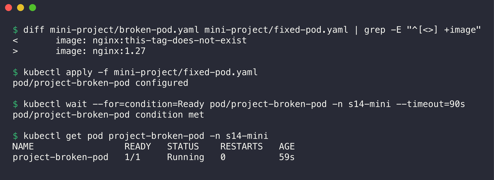

```console
$ diff mini-project/broken-pod.yaml mini-project/fixed-pod.yaml | grep -E "^[<>] +image"
<       image: nginx:this-tag-does-not-exist
>       image: nginx:1.27

$ kubectl apply -f mini-project/fixed-pod.yaml
pod/project-broken-pod configured

$ kubectl wait --for=condition=Ready pod/project-broken-pod -n s14-mini --timeout=90s
pod/project-broken-pod condition met

$ kubectl get pod project-broken-pod -n s14-mini
NAME                 READY   STATUS    RESTARTS   AGE
project-broken-pod   1/1     Running   0          59s
```

### 8. Service troubleshooting challenge

Change the selector to `app: wrong-app` ([broken-service.yaml](mini-project/broken-service.yaml)) and apply it.

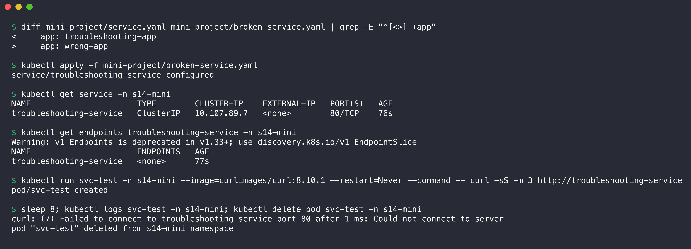

```console
$ diff mini-project/service.yaml mini-project/broken-service.yaml | grep -E "^[<>] +app"
<     app: troubleshooting-app
>     app: wrong-app

$ kubectl apply -f mini-project/broken-service.yaml
service/troubleshooting-service configured

$ kubectl get service -n s14-mini
NAME                      TYPE        CLUSTER-IP    EXTERNAL-IP   PORT(S)   AGE
troubleshooting-service   ClusterIP   10.107.89.7   <none>        80/TCP    76s

$ kubectl get endpoints troubleshooting-service -n s14-mini
Warning: v1 Endpoints is deprecated in v1.33+; use discovery.k8s.io/v1 EndpointSlice
NAME                      ENDPOINTS   AGE
troubleshooting-service   <none>      77s

$ kubectl run svc-test -n s14-mini --image=curlimages/curl:8.10.1 --restart=Never --command -- curl -sS -m 3 http://troubleshooting-service
pod/svc-test created

$ sleep 8; kubectl logs svc-test -n s14-mini; kubectl delete pod svc-test -n s14-mini
curl: (7) Failed to connect to troubleshooting-service port 80 after 1 ms: Could not connect to server
pod "svc-test" deleted from s14-mini namespace
```

`kubectl get service` looks normal: the Service has a ClusterIP and a port. Only the endpoints show the problem: `<none>`.

### 9. Find the root cause

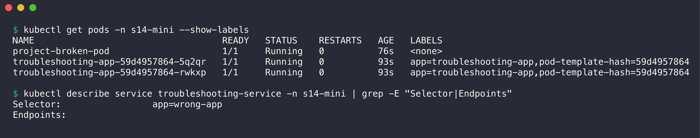

```console
$ kubectl get pods -n s14-mini --show-labels
NAME                                   READY   STATUS    RESTARTS   AGE   LABELS
project-broken-pod                     1/1     Running   0          76s   <none>
troubleshooting-app-59d4957864-5q2qr   1/1     Running   0          93s   app=troubleshooting-app,pod-template-hash=59d4957864
troubleshooting-app-59d4957864-rwkxp   1/1     Running   0          93s   app=troubleshooting-app,pod-template-hash=59d4957864

$ kubectl describe service troubleshooting-service -n s14-mini | grep -E "Selector|Endpoints"
Selector:                 app=wrong-app
Endpoints:                
```

The Pod label is `app=troubleshooting-app`. The Service selector is `app=wrong-app`. They do not match, so the Service selects no Pod. Fix: apply the original [service.yaml](mini-project/service.yaml).

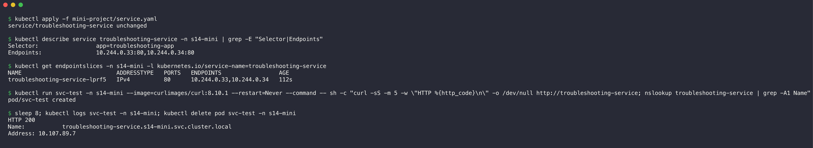

```console
$ kubectl apply -f mini-project/service.yaml
service/troubleshooting-service unchanged

$ kubectl describe service troubleshooting-service -n s14-mini | grep -E "Selector|Endpoints"
Selector:                 app=troubleshooting-app
Endpoints:                10.244.0.33:80,10.244.0.34:80

$ kubectl get endpointslices -n s14-mini -l kubernetes.io/service-name=troubleshooting-service
NAME                            ADDRESSTYPE   PORTS   ENDPOINTS                 AGE
troubleshooting-service-lprf5   IPv4          80      10.244.0.33,10.244.0.34   112s

$ kubectl run svc-test -n s14-mini --image=curlimages/curl:8.10.1 --restart=Never --command -- sh -c "curl -sS -m 5 -w \"HTTP %{http_code}\n\" -o /dev/null http://troubleshooting-service; nslookup troubleshooting-service | grep -A1 Name"
pod/svc-test created

$ sleep 8; kubectl logs svc-test -n s14-mini; kubectl delete pod svc-test -n s14-mini
HTTP 200
Name:	troubleshooting-service.s14-mini.svc.cluster.local
Address: 10.107.89.7
```

The screenshot shows `unchanged`, because I applied `service.yaml` once before this capture. In that first test, the curl call ran less than one second after the fix and printed no page. The probable cause is that kube-proxy had not yet updated its rules for the new endpoints. The capture above repeats the test, and it returns HTTP 200. DNS resolves the short name to the ClusterIP, because the test Pod is in the same namespace.

Final state:


```console
$ kubectl get all -n s14-mini
NAME                                       READY   STATUS    RESTARTS   AGE
pod/project-broken-pod                     1/1     Running   0          112s
pod/troubleshooting-app-59d4957864-5q2qr   1/1     Running   0          2m9s
pod/troubleshooting-app-59d4957864-rwkxp   1/1     Running   0          2m9s

NAME                              TYPE        CLUSTER-IP    EXTERNAL-IP   PORT(S)   AGE
service/troubleshooting-service   ClusterIP   10.107.89.7   <none>        80/TCP    2m9s

NAME                                  READY   UP-TO-DATE   AVAILABLE   AGE
deployment.apps/troubleshooting-app   2/2     2            2           2m9s

NAME                                             DESIRED   CURRENT   READY   AGE
replicaset.apps/troubleshooting-app-59d4957864   2         2         2       2m9s

$ kubectl events -n s14-mini --types=Warning | tail -n 4
LAST SEEN            TYPE      REASON   OBJECT                   MESSAGE
69s (x3 over 110s)   Warning   Failed   Pod/project-broken-pod   Failed to pull image "nginx:this-tag-does-not-exist": rpc error: code = NotFound desc = failed to pull and unpack image "docker.io/library/nginx:this-tag-does-not-exist": failed to resolve reference "docker.io/library/nginx:this-tag-does-not-exist": docker.io/library/nginx:this-tag-does-not-exist: not found
69s (x3 over 110s)   Warning   Failed   Pod/project-broken-pod   Error: ErrImagePull
54s (x3 over 109s)   Warning   Failed   Pod/project-broken-pod   Error: ImagePullBackOff
```

All objects run. The warnings are the old events from the broken image (`LAST SEEN` 54-69 seconds ago). No new warning came after the fix.

### 10. Final troubleshooting checklist

Before you say "it does not work", always do these checks:

```bash
kubectl get pods
kubectl describe pod <pod-name>
kubectl logs <pod-name>
kubectl exec -it <pod-name> -- sh
kubectl get events
```

For Service problems, also do these checks:

```bash
kubectl describe service <service-name>
kubectl get endpoints <service-name>
nslookup <service-name>
```

I used these commands in this order in steps 1 to 9.

### 11. Troubleshooting table

| Problem | What I Saw | Command I Used | Root Cause | Fix |
| :--- | :--- | :--- | :--- | :--- |
| **Broken Pod** | `project-broken-pod` was `0/1`, status `ImagePullBackOff` / `ErrImagePull`, 0 restarts | `kubectl get pod`, `kubectl describe pod` | The container could not start, because the kubelet could not pull its image | Apply [fixed-pod.yaml](mini-project/fixed-pod.yaml). The Pod became `1/1 Running` |
| **Service Problem** | Service had a ClusterIP, but `ENDPOINTS <none>` and curl exit code 7 | `kubectl get endpoints`, `kubectl describe service`, `kubectl get pods --show-labels` | Selector `app=wrong-app` did not match the Pod label `app=troubleshooting-app` | Set the selector back to `app: troubleshooting-app`. 2 endpoints, HTTP 200 |
| **Image Problem** | Event `Failed to pull image ... not found` (NotFound) | `kubectl describe pod` (Events), Docker Hub tag API (HTTP 404) | Tag `this-tag-does-not-exist` is not in the `nginx` repository | Use the tag `nginx:1.27` |

### 12. README questions

1. **What does `kubectl get` tell us?**
   It lists objects of one kind with a short summary: name, ready containers, status, restarts, and age. With `-o wide`, it also shows the Pod IP and the node. It answers the question "what exists, and is it healthy?".

2. **What is the difference between `get` and `describe`?**
   `get` gives one line for each object, for many objects. `describe` gives the full detail of one object: container states, exit codes, probes, volumes, conditions, and the recent events. Use `get` to find the problem object and `describe` to find the reason.

3. **Why do we use `kubectl logs`?**
   To read what the application wrote to standard output and standard error. Kubernetes does not know why an application failed. The application log does. Use `--previous` for a container that crashed and restarted.

4. **When would you use `kubectl exec`?**
   When you must test from inside the container. Examples: `curl localhost` to test the application, `nslookup` to test DNS, `env` to examine the configuration, `netstat -tln` to find the listen address, and `cat` to read mounted files.

5. **What does `CrashLoopBackOff` mean?**
   The container starts, stops (crashes or exits), and Kubernetes restarts it again and again. Between the restarts, the kubelet waits longer each time (10s, 20s, 40s, up to 5 minutes). The cause is in the application or its configuration. Use `kubectl logs --previous` to find it.

6. **What does `ImagePullBackOff` mean?**
   The kubelet could not pull the container image, and it waits before the next try. Typical causes are a wrong image name or tag, a registry that does not exist, a private registry without credentials, or a registry rate limit.

7. **Why can a Pod remain `Pending`?**
   The scheduler cannot find a node for it. Causes: not enough CPU or memory for the requests, a `nodeSelector` or affinity that matches no node, taints without tolerations, or a PVC that is not bound. The `FailedScheduling` event gives the reason.

8. **Why can a Service have no endpoints?**
   The selector matches no Pod (wrong label or wrong namespace), or the matching Pods are not `Ready` (for example, a readiness probe fails). A Service without endpoints has a ClusterIP, but the connections are refused.

9. **What is the relationship between a Service selector and Pod labels?**
   The Service selector is a label query. The EndpointSlice controller adds every ready Pod in the same namespace whose labels match all key-value pairs of the selector. If one value differs (`wrong-app` instead of `troubleshooting-app`), the Pod is not selected.

10. **What is Kubernetes DNS?**
    CoreDNS runs in the cluster and gives each Service a DNS name: `<service>.<namespace>.svc.cluster.local`. Each Pod uses CoreDNS (`nameserver 10.96.0.10`) and has a search list that starts with its own namespace. So a short name works in the same namespace. From another namespace, use `<service>.<namespace>` or the full name.

### 13. Final architecture

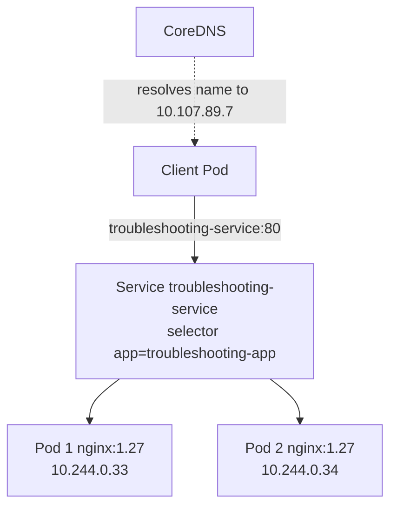
```mermaid
flowchart TB
  C[Client Pod] -->|troubleshooting-service:80| S[Service troubleshooting-service<br/>selector app=troubleshooting-app]
  S --> P1[Pod 1 nginx:1.27<br/>10.244.0.33]
  S --> P2[Pod 2 nginx:1.27<br/>10.244.0.34]
  D[CoreDNS] -.->|resolves name to 10.107.89.7| C
```

---

## Cleanup

```bash
kubectl delete namespace s14-commands s14-issues s14-dns-backend s14-mini
```

I deleted all Session 14 namespaces after the screenshots. No port-forward or background process stays.
