# Session 20: Monitoring, Observability & GitOps

**Name:** Kartavya Panchal  
**Roll No.:** 24BCS10343

```
Monitoring-Observability-&-GitOps/
├── platform/                              Helm values for the shared platform (pinned chart versions)
│   ├── kube-prometheus-stack-values.yaml  Prometheus + Alertmanager + Grafana + exporters
│   ├── loki-values.yaml                   Loki (log store, SingleBinary mode)
│   ├── alloy-values.yaml                  Grafana Alloy (log collector)
│   ├── argocd-values.yaml                 Argo CD (non-HA)
│   └── gitea-values.yaml                  Gitea (in-cluster Git server, SQLite)
├── monitoring-demo/                       Task 1: the monitored demo application
│   ├── 00-namespace.yaml
│   ├── 01-podinfo.yaml                    frontend + backend Deployments, probes, limits, tracing
│   ├── 02-services.yaml
│   ├── 03-servicemonitor.yaml             tells Prometheus to scrape /metrics
│   ├── 04-prometheusrule.yaml             5 alert rules (errors, CPU, memory, readiness, target down)
│   ├── 05-loadgen.yaml                    fortio load generator (normal + HTTP 500 traffic)
│   ├── 06-grafana-dashboard.yaml          dashboard as a ConfigMap
│   ├── 07-liveness-demo.yaml              a Pod that fails its liveness probe
│   └── pq                                 small script: PromQL query from the terminal
├── tracing-demo/
│   └── jaeger.yaml                        Task 2: Jaeger all-in-one for the traces demo
├── gitops/                                Task 3
│   ├── argocd-application.yaml            the Argo CD Application (applied one time)
│   └── gitops-repo/                       first commit of the Git repository that Argo CD watches
│       ├── README.md
│       └── app/ (namespace.yaml, deployment.yaml, service.yaml)
├── screenshots/
└── README.md
```

---

## Architecture

All parts run in the same minikube cluster that the other sessions use. The platform namespaces (`monitoring`, `argocd`, `gitea`) stay in the cluster for the Final Project. The demo namespaces (`s20-monitoring`, `s20-tracing`, `s20-gitops`) stayed only for the demo. I deleted them at the end.

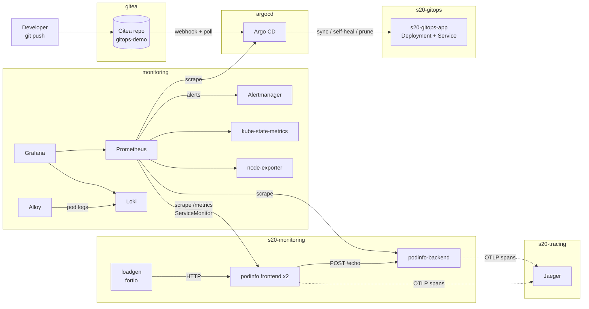
```mermaid
flowchart LR
  subgraph s20-monitoring
    LG[loadgen<br/>fortio] -->|HTTP| FE[podinfo frontend x2]
    FE -->|POST /echo| BE[podinfo-backend]
  end
  subgraph monitoring
    P[Prometheus] -->|alerts| AM[Alertmanager]
    G[Grafana]
    L[Loki]
    A[Alloy]
    KSM[kube-state-metrics]
    NE[node-exporter]
  end
  subgraph s20-tracing
    J[Jaeger]
  end
  subgraph gitea
    GT[(Gitea repo<br/>gitops-demo)]
  end
  subgraph argocd
    AC[Argo CD]
  end
  subgraph s20-gitops
    APP[s20-gitops-app<br/>Deployment + Service]
  end
  P -->|scrape /metrics<br/>ServiceMonitor| FE
  P -->|scrape| BE
  P --> KSM
  P --> NE
  P -->|scrape| AC
  A -->|pod logs| L
  FE -.->|OTLP spans| J
  BE -.->|OTLP spans| J
  G --> P
  G --> L
  DEV[Developer<br/>git push] --> GT
  GT -->|webhook + poll| AC
  AC -->|sync / self-heal / prune| APP
```

| Signal | Tool in this demo | Where |
|---|---|---|
| Metrics | Prometheus (+ kube-state-metrics, node-exporter, ServiceMonitor) | `monitoring` |
| Dashboards | Grafana | `monitoring` |
| Alerts | PrometheusRule -> Prometheus -> Alertmanager | `monitoring` |
| Logs | `kubectl logs`, Alloy -> Loki -> Grafana | `monitoring` |
| Traces | OpenTelemetry (in podinfo) -> Jaeger | `s20-tracing` |
| GitOps | Gitea (Git server) + Argo CD | `gitea`, `argocd` |

---

## Platform installation

The cluster is small and also runs the labs of other sessions. Thus every component has small resource requests, short retention, and only the parts that this demo needs. All chart versions are pinned.

### Step 1: Install kube-prometheus-stack

1. Create the `monitoring` namespace.
2. Create the Grafana admin Secret with a random password. The password is only in the cluster, not in Git.
3. Install the chart with [`platform/kube-prometheus-stack-values.yaml`](platform/kube-prometheus-stack-values.yaml).

**CAUTION:** Do not write real passwords in a values file. Git keeps the history of all files.

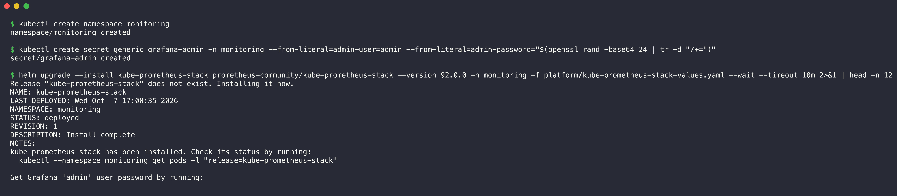

```console
$ kubectl create namespace monitoring
namespace/monitoring created

$ kubectl create secret generic grafana-admin -n monitoring --from-literal=admin-user=admin --from-literal=admin-password="$(openssl rand -base64 24 | tr -d "/+=")"
secret/grafana-admin created

$ helm upgrade --install kube-prometheus-stack prometheus-community/kube-prometheus-stack --version 92.0.0 -n monitoring -f platform/kube-prometheus-stack-values.yaml --wait --timeout 10m 2>&1 | head -n 12
Release "kube-prometheus-stack" does not exist. Installing it now.
NAME: kube-prometheus-stack
LAST DEPLOYED: Wed Oct  7 17:00:35 2026
NAMESPACE: monitoring
STATUS: deployed
REVISION: 1
DESCRIPTION: Install complete
NOTES:
kube-prometheus-stack has been installed. Check its status by running:
  kubectl --namespace monitoring get pods -l "release=kube-prometheus-stack"

Get Grafana 'admin' user password by running:
```

The important values are:

- `serviceMonitorSelectorNilUsesHelmValues: false` (and the same for PodMonitors and rules). Prometheus then selects every ServiceMonitor and PrometheusRule in every namespace. The objects do not need a special label.
- `retention: 12h` and no PersistentVolume. This is a demo cluster.
- The etcd, controller-manager, scheduler and kube-proxy targets are disabled. minikube does not expose them, so they only cause false "down" alerts.
- `grafana.ini` → `auth.anonymous` with role `Viewer`. A headless browser can then take dashboard screenshots. The admin login continues to work.
- Grafana is pinned to `11.6.16`. Refer to [Problems and fixes](#problems-and-fixes).

### Step 2: Install Loki and Alloy (logs)

Loki stores logs. Alloy reads the logs of all Pods through the Kubernetes API and sends them to Loki. Loki runs as one small process (`SingleBinary`). The caches, the gateway, and MinIO are disabled. Refer to [`platform/loki-values.yaml`](platform/loki-values.yaml) and [`platform/alloy-values.yaml`](platform/alloy-values.yaml).

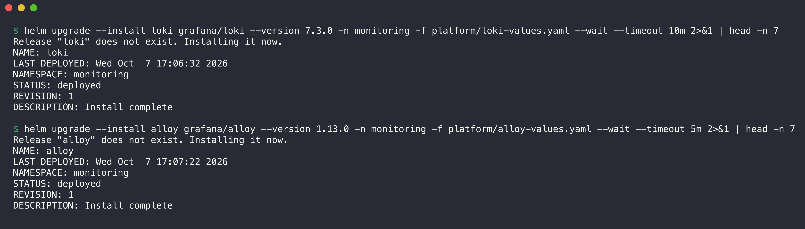

```console
$ helm upgrade --install loki grafana/loki --version 7.3.0 -n monitoring -f platform/loki-values.yaml --wait --timeout 10m 2>&1 | head -n 7
Release "loki" does not exist. Installing it now.
NAME: loki
LAST DEPLOYED: Wed Oct  7 17:06:32 2026
NAMESPACE: monitoring
STATUS: deployed
REVISION: 1
DESCRIPTION: Install complete

$ helm upgrade --install alloy grafana/alloy --version 1.13.0 -n monitoring -f platform/alloy-values.yaml --wait --timeout 5m 2>&1 | head -n 7
Release "alloy" does not exist. Installing it now.
NAME: alloy
LAST DEPLOYED: Wed Oct  7 17:07:22 2026
NAMESPACE: monitoring
STATUS: deployed
REVISION: 1
DESCRIPTION: Install complete
```

### Step 3: Install Gitea and Argo CD (GitOps)

Gitea is a small Git server inside the cluster. It uses SQLite, so the chart does not install PostgreSQL or Valkey ([`platform/gitea-values.yaml`](platform/gitea-values.yaml)). Argo CD is a non-HA install without dex and notifications ([`platform/argocd-values.yaml`](platform/argocd-values.yaml)).

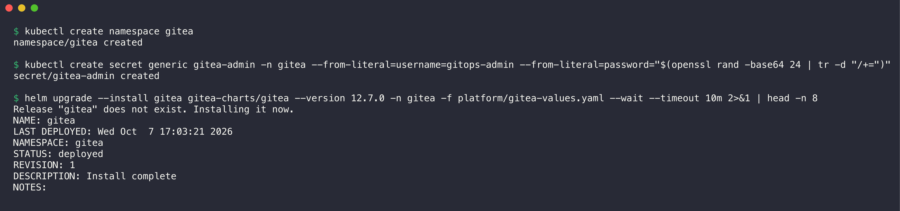

```console
$ kubectl create namespace gitea
namespace/gitea created

$ kubectl create secret generic gitea-admin -n gitea --from-literal=username=gitops-admin --from-literal=password="$(openssl rand -base64 24 | tr -d "/+=")"
secret/gitea-admin created

$ helm upgrade --install gitea gitea-charts/gitea --version 12.7.0 -n gitea -f platform/gitea-values.yaml --wait --timeout 10m 2>&1 | head -n 8
Release "gitea" does not exist. Installing it now.
NAME: gitea
LAST DEPLOYED: Wed Oct  7 17:03:21 2026
NAMESPACE: gitea
STATUS: deployed
REVISION: 1
DESCRIPTION: Install complete
NOTES:
```

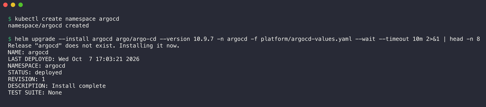

```console
$ kubectl create namespace argocd
namespace/argocd created

$ helm upgrade --install argocd argo/argo-cd --version 10.9.7 -n argocd -f platform/argocd-values.yaml --wait --timeout 10m 2>&1 | head -n 8
Release "argocd" does not exist. Installing it now.
NAME: argocd
LAST DEPLOYED: Wed Oct  7 17:03:21 2026
NAMESPACE: argocd
STATUS: deployed
REVISION: 1
DESCRIPTION: Install complete
TEST SUITE: None
```

### Step 4: Examine the platform

This output is from the end of the session, after the cleanup. These Pods stay in the cluster for the Final Project.

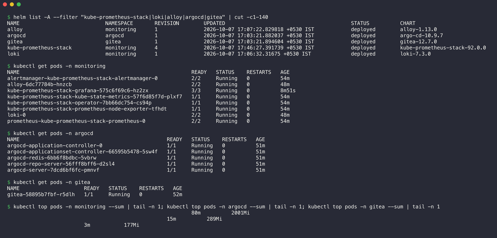

```console
$ helm list -A --filter "kube-prometheus-stack|loki|alloy|argocd|gitea" | cut -c1-140
NAME                 	NAMESPACE 	REVISION	UPDATED                             	STATUS  	CHART                       	APP VERSION
alloy                	monitoring	1       	2026-10-07 17:07:22.829818 +0530 IST	deployed	alloy-1.13.0                	v1.20.0    
argocd               	argocd    	1       	2026-10-07 17:03:21.882037 +0530 IST	deployed	argo-cd-10.9.7              	v3.5.4     
gitea                	gitea     	1       	2026-10-07 17:03:21.894604 +0530 IST	deployed	gitea-12.7.0                	1.27.0     
kube-prometheus-stack	monitoring	4       	2026-10-07 17:46:27.391739 +0530 IST	deployed	kube-prometheus-stack-92.0.0	v0.94.1    
loki                 	monitoring	1       	2026-10-07 17:06:32.31675 +0530 IST 	deployed	loki-7.3.0                  	3.6.12     

$ kubectl get pods -n monitoring
NAME                                                        READY   STATUS    RESTARTS   AGE
alertmanager-kube-prometheus-stack-alertmanager-0           2/2     Running   0          54m
alloy-6dc77784b-hnzcb                                       2/2     Running   0          48m
kube-prometheus-stack-grafana-575c6f69c6-hz2zx              3/3     Running   0          8m51s
kube-prometheus-stack-kube-state-metrics-57f6d85f7d-plxf7   1/1     Running   0          54m
kube-prometheus-stack-operator-7bb66dc754-cs94p             1/1     Running   0          54m
kube-prometheus-stack-prometheus-node-exporter-tfhdt        1/1     Running   0          54m
loki-0                                                      2/2     Running   0          48m
prometheus-kube-prometheus-stack-prometheus-0               2/2     Running   0          54m

$ kubectl get pods -n argocd
NAME                                                READY   STATUS    RESTARTS   AGE
argocd-application-controller-0                     1/1     Running   0          51m
argocd-applicationset-controller-66595b5478-5sw4f   1/1     Running   0          51m
argocd-redis-6bb6f8bdbc-5vbrw                       1/1     Running   0          51m
argocd-repo-server-56fff8bff6-d2sl4                 1/1     Running   0          51m
argocd-server-7dcd6bf6fc-pmnvf                      1/1     Running   0          51m

$ kubectl get pods -n gitea
NAME                     READY   STATUS    RESTARTS   AGE
gitea-58895b7fbf-r5dlh   1/1     Running   0          52m

$ kubectl top pods -n monitoring --sum | tail -n 1; kubectl top pods -n argocd --sum | tail -n 1; kubectl top pods -n gitea --sum | tail -n 1
                                                            80m          2001Mi          
                                                    15m          289Mi           
                         3m           177Mi
```

The `kube-prometheus-stack` release has revision 4 because of three `helm upgrade` runs during the session (Grafana CPU limit, SQLite WAL, and the Grafana version pin). The whole platform uses about 0.1 CPU and 2.5 GiB of memory when it is idle.

To open the web UIs from the Mac, use these port-forwards (this session uses the ports 18600-18699):

```bash
kubectl port-forward -n monitoring svc/kube-prometheus-stack-prometheus   18600:9090
kubectl port-forward -n monitoring svc/kube-prometheus-stack-grafana      18601:80
kubectl port-forward -n monitoring svc/kube-prometheus-stack-alertmanager 18602:9093
kubectl port-forward -n s20-tracing svc/jaeger                            18603:16686
kubectl port-forward -n monitoring svc/loki                               18605:3100
kubectl port-forward -n argocd svc/argocd-server                          18610:80
kubectl port-forward -n gitea svc/gitea-http                              18620:3000
```

---

## Task 1: Monitoring

### The demo application

The monitored application is [podinfo](https://github.com/stefanprodan/podinfo), a small Go web server. It has the features that a real service needs for monitoring:

- `/metrics`: Prometheus metrics (`http_requests_total`, `http_request_duration_seconds`, Go runtime metrics).
- `/healthz` and `/readyz`: endpoints for the liveness probe and the readiness probe.
- JSON logs on stdout.
- OpenTelemetry tracing. The frontend calls the backend on `POST /echo`, so one request makes a trace across two services.

The frontend has a small CPU limit (`50m`). This makes the CPU alert easy to show. A fortio load generator ([`05-loadgen.yaml`](monitoring-demo/05-loadgen.yaml)) sends 300 requests per second to `POST /echo`, and 20 requests per second to `/status/500` (always HTTP 500).

1. Apply the manifests in [`monitoring-demo/`](monitoring-demo/) (files `00` to `04` and `06`).
2. Apply the Jaeger manifest [`tracing-demo/jaeger.yaml`](tracing-demo/jaeger.yaml).
3. Apply the load generator `05-loadgen.yaml`.

```bash
kubectl apply -f tracing-demo/jaeger.yaml
kubectl apply -f monitoring-demo/00-namespace.yaml -f monitoring-demo/01-podinfo.yaml -f monitoring-demo/02-services.yaml \
  -f monitoring-demo/03-servicemonitor.yaml -f monitoring-demo/04-prometheusrule.yaml -f monitoring-demo/06-grafana-dashboard.yaml
kubectl apply -f monitoring-demo/05-loadgen.yaml
```

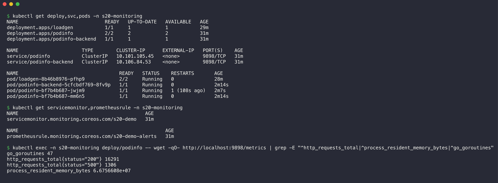

```console
$ kubectl get deploy,svc,pods -n s20-monitoring
NAME                              READY   UP-TO-DATE   AVAILABLE   AGE
deployment.apps/loadgen           1/1     1            1           29m
deployment.apps/podinfo           2/2     2            2           31m
deployment.apps/podinfo-backend   1/1     1            1           31m

NAME                      TYPE        CLUSTER-IP      EXTERNAL-IP   PORT(S)    AGE
service/podinfo           ClusterIP   10.101.105.45   <none>        9898/TCP   31m
service/podinfo-backend   ClusterIP   10.106.84.53    <none>        9898/TCP   31m

NAME                                   READY   STATUS    RESTARTS       AGE
pod/loadgen-8b46b8976-pfhp9            2/2     Running   0              28m
pod/podinfo-backend-5cfcbdf769-8fv9p   1/1     Running   0              2m14s
pod/podinfo-bf7b4b687-jwjm9            1/1     Running   1 (108s ago)   2m7s
pod/podinfo-bf7b4b687-mm6n5            1/1     Running   0              2m14s

$ kubectl get servicemonitor,prometheusrule -n s20-monitoring
NAME                                            AGE
servicemonitor.monitoring.coreos.com/s20-demo   31m

NAME                                                   AGE
prometheusrule.monitoring.coreos.com/s20-demo-alerts   31m

$ kubectl exec -n s20-monitoring deploy/podinfo -- wget -qO- http://localhost:9898/metrics | grep -E "^http_requests_total|^process_resident_memory_bytes|^go_goroutines"
go_goroutines 47
http_requests_total{status="200"} 16291
http_requests_total{status="500"} 1306
process_resident_memory_bytes 6.6756608e+07
```

The last command shows the raw metrics that the application exposes. Prometheus reads this text every 15 seconds. The restart of `podinfo-bf7b4b687-jwjm9` comes from the health demo later in this task.

### Metrics

A metric is a number with a name, labels, and a timestamp. Prometheus **pulls** (scrapes) metrics from targets. The [`ServiceMonitor`](monitoring-demo/03-servicemonitor.yaml) tells the Prometheus Operator which Services to scrape. It selects both podinfo Services with the label `part-of: s20-demo` and scrapes the port named `http` on `/metrics`.

The Prometheus "Target health" page shows the three Pods of the ServiceMonitor. All three are `UP`.

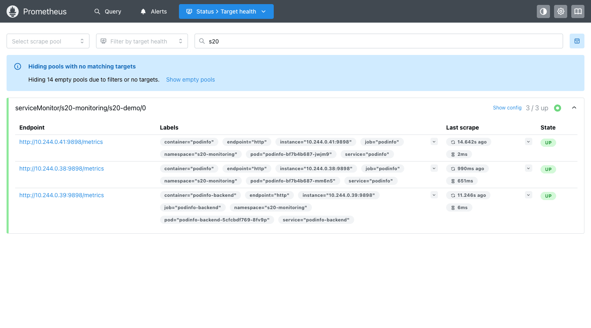

The [`pq`](monitoring-demo/pq) script sends a PromQL query to the Prometheus HTTP API and prints one line for each series.

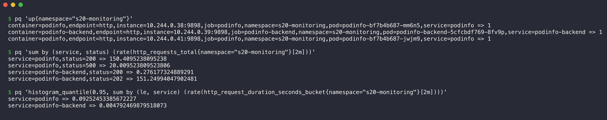

```console
$ pq 'up{namespace="s20-monitoring"}'
container=podinfo,endpoint=http,instance=10.244.0.38:9898,job=podinfo,namespace=s20-monitoring,pod=podinfo-bf7b4b687-mm6n5,service=podinfo => 1
container=podinfo-backend,endpoint=http,instance=10.244.0.39:9898,job=podinfo-backend,namespace=s20-monitoring,pod=podinfo-backend-5cfcbdf769-8fv9p,service=podinfo-backend => 1
container=podinfo,endpoint=http,instance=10.244.0.41:9898,job=podinfo,namespace=s20-monitoring,pod=podinfo-bf7b4b687-jwjm9,service=podinfo => 1

$ pq 'sum by (service, status) (rate(http_requests_total{namespace="s20-monitoring"}[2m]))'
service=podinfo,status=200 => 150.4095238095238
service=podinfo,status=500 => 20.009523809523806
service=podinfo-backend,status=200 => 0.276177324889291
service=podinfo-backend,status=202 => 151.24994047902481

$ pq 'histogram_quantile(0.95, sum by (le, service) (rate(http_request_duration_seconds_bucket{namespace="s20-monitoring"}[2m])))'
service=podinfo => 0.09252453385672227
service=podinfo-backend => 0.004792469879518073
```

- `up` is `1` for each target. Prometheus makes this metric itself for each scrape. `0` means that the scrape failed.
- The request rate shows about 150 requests per second with HTTP 200 and 20 per second with HTTP 500 on the frontend. The backend receives the `/echo` calls (HTTP 202).
- The 95th percentile latency of the frontend is about 92 ms. The backend needs less than 5 ms. The frontend is slow because its CPU limit throttles it (refer to [CPU utilization](#cpu-utilization)).

### Logs

#### Logs with kubectl

`kubectl logs` reads the stdout and stderr of a container from the node.

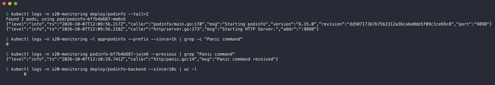

```console
$ kubectl logs -n s20-monitoring deploy/podinfo --tail=2
Found 2 pods, using pod/podinfo-bf7b4b687-mm6n5
{"level":"info","ts":"2026-10-07T12:09:56.217Z","caller":"podinfo/main.go:170","msg":"Starting podinfo","version":"6.15.0","revision":"dd507173b7b75b2312a36cabe0de5f09c1ce69c8","port":"9898"}
{"level":"info","ts":"2026-10-07T12:09:56.218Z","caller":"http/server.go:273","msg":"Starting HTTP Server.","addr":":9898"}

$ kubectl logs -n s20-monitoring -l app=podinfo --prefix --since=1h | grep -c "Panic command"
0

$ kubectl logs -n s20-monitoring podinfo-bf7b4b687-jwjm9 --previous | grep "Panic command"
{"level":"info","ts":"2026-10-07T12:10:19.741Z","caller":"http/panic.go:14","msg":"Panic command received"}

$ kubectl logs -n s20-monitoring deploy/podinfo-backend --since=10s | wc -l
       0
```

This output shows a limit of `kubectl logs`. A container crashed (the `/panic` demo in [Application health](#application-health)). The log line about the crash is not in the logs of the current container. You must know the Pod name and use `--previous` to find it. If the Pod is deleted, the line is lost. The backend logs at `info` level and does not write a line for each request, so the last command counts 0 lines.

#### Logs with Loki

Alloy sends the logs of all Pods to Loki, with the labels `namespace`, `pod`, `container` and `app`. Loki keeps the logs after a container restart or a Pod deletion. LogQL is the query language of Loki.


```console
$ curl -s http://127.0.0.1:18605/loki/api/v1/labels | jq -c .data
["__stream_shard__","app","container","instance","job","namespace","pod","service_name"]

$ curl -s http://127.0.0.1:18605/loki/api/v1/label/namespace/values | jq -c .data
["argocd","gitea","ingress-nginx","kube-system","monitoring","s10-bluegreen","s10-canary","s10-lifecycle","s10-recreate","s10-rolling","s11-backend","s11-compare","s11-services","s12-config","s12-ingress","s12-trouble","s13-hpa","s13-probes","s13-webapp","s14-commands","s14-dns-backend","s14-issues","s14-mini","s15-notes","s15-rollback","s16-cicd","s17-devsecops","s20-gitops","s20-monitoring","s20-tracing","s9-basics","s9-bootcamp"]

$ curl -s -G http://127.0.0.1:18605/loki/api/v1/query_range --data-urlencode 'query={namespace="s20-monitoring", container="podinfo"} |= "Panic"' --data-urlencode "since=1h" | jq -r ".data.result[] | .stream.pod as \$p | .values[] | \"\(\$p)  \(.[1])\"" | cut -c1-170
podinfo-bf7b4b687-jwjm9  {"level":"info","ts":"2026-10-07T12:10:19.741Z","caller":"http/panic.go:14","msg":"Panic command received"}


$ curl -s -G http://127.0.0.1:18605/loki/api/v1/query --data-urlencode 'query=sum by (namespace) (count_over_time({namespace=~"s20-.*|argocd|gitea"}[1h]))' | jq -r ".data.result[] | \"\(.metric.namespace) => \(.value[1]) log lines in 1h\""
argocd => 2225 log lines in 1h
gitea => 193 log lines in 1h
s20-gitops => 27 log lines in 1h
s20-monitoring => 3601 log lines in 1h
s20-tracing => 357 log lines in 1h
```

- Loki collects logs from all namespaces of the cluster, not only from the demo.
- One LogQL query finds the crash line without the Pod name and without `--previous`.
- `count_over_time` changes log lines into numbers. You can make graphs and alerts from logs this way.

Loki and Alloy use about 500 MiB of memory together. This was acceptable on this cluster, so the demo includes them. The Grafana dashboard in the [CPU and memory section](#grafana-dashboards) also has a Loki logs panel.

### Alerts

The [`PrometheusRule`](monitoring-demo/04-prometheusrule.yaml) `s20-demo-alerts` has five rules:

| Alert | Expression (short form) | for | Severity |
|---|---|---|---|
| `PodinfoHighErrorRate` | 5xx requests / all requests > 5 %, per Service | 1m | warning |
| `PodinfoHighCpu` | container CPU usage / CPU limit > 80 % | 1m | warning |
| `PodinfoHighMemory` | working set memory / memory limit > 90 % | 2m | warning |
| `PodinfoPodNotReady` | `kube_pod_status_ready{condition="false"} == 1` | 30s | critical |
| `PodinfoTargetDown` | `up == 0` | 1m | critical |

An alert first goes to the state `pending`. If the condition stays true for the `for` time, the alert goes to `firing`. Prometheus then sends it to Alertmanager. Alertmanager groups, silences, and routes alerts to receivers (email, Slack, PagerDuty). This demo uses the default receiver `null`, so the alerts are visible in the UI and the API only.

To make three alerts fire:

1. Apply the load generator. The 20 requests per second to `/status/500` give about 8 % errors. The frontend CPU increases to its limit.
2. Disable the readiness of one frontend Pod (refer to [Application health](#application-health)).
3. Wait about 2 minutes.

The Prometheus "Alerts" page shows three firing rules. The second `PodinfoHighCpu` instance is `pending`: that Pod gets no traffic because it is not ready.

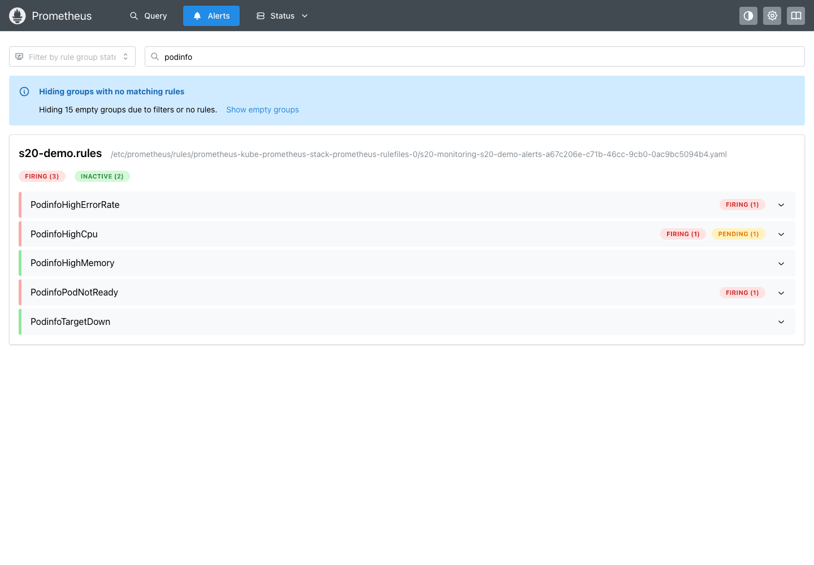

Alertmanager received the same three alerts. The screenshot uses the filter `namespace="s20-monitoring"`.

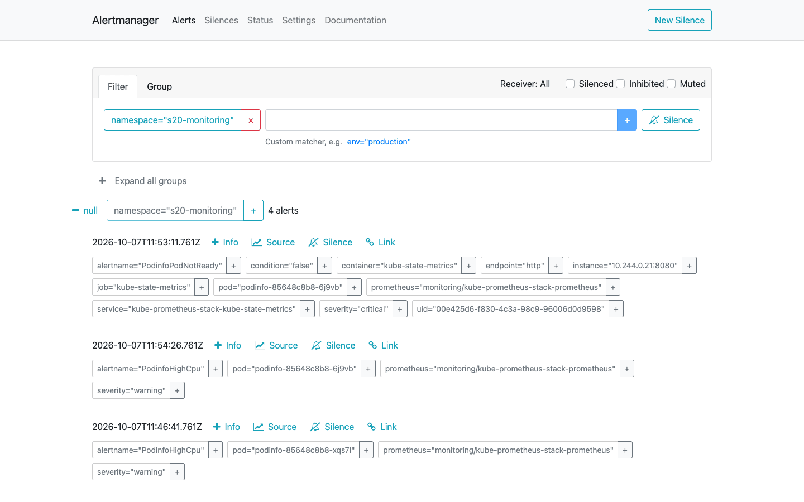

The same data from the Prometheus API and the Alertmanager API v2:

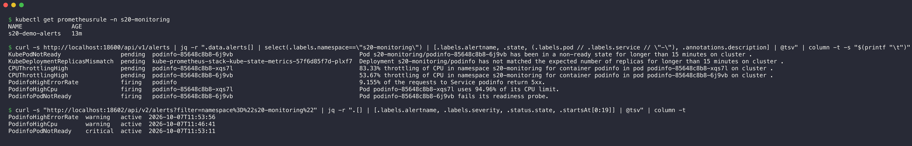

```console
$ kubectl get prometheusrule -n s20-monitoring
NAME              AGE
s20-demo-alerts   13m

$ curl -s http://localhost:18600/api/v1/alerts | jq -r ".data.alerts[] | select(.labels.namespace==\"s20-monitoring\") | [.labels.alertname, .state, (.labels.pod // .labels.service // \"-\"), .annotations.description] | @tsv" | column -t -s "$(printf "\t")"
KubePodNotReady                 pending  podinfo-85648c8b8-6j9vb                                    Pod s20-monitoring/podinfo-85648c8b8-6j9vb has been in a non-ready state for longer than 15 minutes on cluster .
KubeDeploymentReplicasMismatch  pending  kube-prometheus-stack-kube-state-metrics-57f6d85f7d-plxf7  Deployment s20-monitoring/podinfo has not matched the expected number of replicas for longer than 15 minutes on cluster .
CPUThrottlingHigh               pending  podinfo-85648c8b8-xqs7l                                    83.33% throttling of CPU in namespace s20-monitoring for container podinfo in pod podinfo-85648c8b8-xqs7l on cluster .
CPUThrottlingHigh               pending  podinfo-85648c8b8-6j9vb                                    53.67% throttling of CPU in namespace s20-monitoring for container podinfo in pod podinfo-85648c8b8-6j9vb on cluster .
PodinfoHighErrorRate            firing   podinfo                                                    9.155% of the requests to Service podinfo return 5xx.
PodinfoHighCpu                  firing   podinfo-85648c8b8-xqs7l                                    Pod podinfo-85648c8b8-xqs7l uses 94.96% of its CPU limit.
PodinfoPodNotReady              firing   podinfo-85648c8b8-6j9vb                                    Pod podinfo-85648c8b8-6j9vb fails its readiness probe.

$ curl -s "http://localhost:18602/api/v2/alerts?filter=namespace%3D%22s20-monitoring%22" | jq -r ".[] | [.labels.alertname, .labels.severity, .status.state, .startsAt[0:19]] | @tsv" | column -t
PodinfoHighErrorRate  warning   active  2026-10-07T11:53:56
PodinfoHighCpu        warning   active  2026-10-07T11:46:41
PodinfoPodNotReady    critical  active  2026-10-07T11:53:11
```

The `Kube*` and `CPUThrottlingHigh` alerts come from the default rules of kube-prometheus-stack. They are `pending` because their `for` times are 15 minutes. They show the same problems as our rules: a Pod that is not ready, and CPU throttling.

To make the alerts resolve, delete the load generator. I replaced the readiness demo Pod during the session, so all `Podinfo*` alerts became inactive after about 2 minutes.

```bash
kubectl delete -f monitoring-demo/05-loadgen.yaml
```

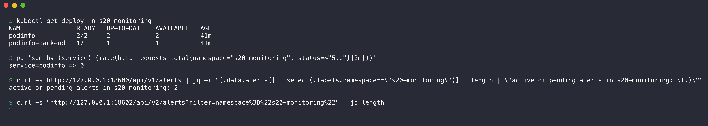

```console
$ kubectl get deploy -n s20-monitoring
NAME              READY   UP-TO-DATE   AVAILABLE   AGE
podinfo           2/2     2            2           41m
podinfo-backend   1/1     1            1           41m

$ pq 'sum by (service) (rate(http_requests_total{namespace="s20-monitoring", status=~"5.."}[2m]))'
service=podinfo => 0

$ curl -s http://127.0.0.1:18600/api/v1/alerts | jq -r "[.data.alerts[] | select(.labels.namespace==\"s20-monitoring\")] | length | \"active or pending alerts in s20-monitoring: \(.)\""
active or pending alerts in s20-monitoring: 2

$ curl -s "http://127.0.0.1:18602/api/v2/alerts?filter=namespace%3D%22s20-monitoring%22" | jq length
1
```

The two remaining entries are a `pending` `CPUThrottlingHigh` (it decays slowly) and the built-in `InfoInhibitor` meta-alert. All five `Podinfo*` rules are inactive:

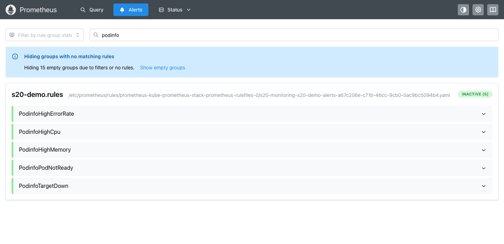

### CPU utilization

CPU usage comes from the kubelet (cAdvisor) as the counter `container_cpu_usage_seconds_total` (CPU seconds). `rate()` changes the counter into CPU cores. kube-state-metrics gives the requests and limits (`kube_pod_container_resource_limits`). node-exporter gives the CPU of the node (`node_cpu_seconds_total`).

### Memory utilization

The kubelet reports `container_memory_working_set_bytes`. This is the value that the kubelet compares with the memory limit for an OOM kill. node-exporter gives the memory of the node (`node_memory_MemAvailable_bytes`, `node_memory_MemTotal_bytes`).

I ran these queries while the load generator was active:

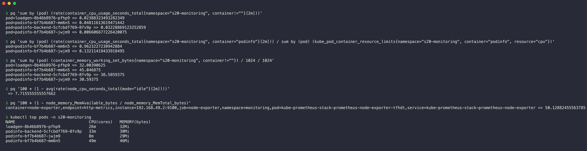

```console
$ pq 'sum by (pod) (rate(container_cpu_usage_seconds_total{namespace="s20-monitoring", container!=""}[2m]))'
pod=loadgen-8b46b8976-pfhp9 => 0.02388323493282349
pod=podinfo-bf7b4b687-mm6n5 => 0.04811613619471442
pod=podinfo-backend-5cfcbdf769-8fv9p => 0.03228869123252859
pod=podinfo-bf7b4b687-jwjm9 => 0.006606677226420075

$ pq 'sum by (pod) (rate(container_cpu_usage_seconds_total{namespace="s20-monitoring", container="podinfo"}[2m])) / sum by (pod) (kube_pod_container_resource_limits{namespace="s20-monitoring", container="podinfo", resource="cpu"})'
pod=podinfo-bf7b4b687-mm6n5 => 0.9623227238942884
pod=podinfo-bf7b4b687-jwjm9 => 0.13211419433918495

$ pq 'sum by (pod) (container_memory_working_set_bytes{namespace="s20-monitoring", container!=""}) / 1024 / 1024'
pod=loadgen-8b46b8976-pfhp9 => 32.00390625
pod=podinfo-bf7b4b687-mm6n5 => 45.046875
pod=podinfo-backend-5cfcbdf769-8fv9p => 38.5859375
pod=podinfo-bf7b4b687-jwjm9 => 30.59375

$ pq '100 * (1 - avg(rate(node_cpu_seconds_total{mode="idle"}[2m])))'
 => 7.715555555557662

$ pq '100 * (1 - node_memory_MemAvailable_bytes / node_memory_MemTotal_bytes)'
container=node-exporter,endpoint=http-metrics,instance=192.168.49.2:9100,job=node-exporter,namespace=monitoring,pod=kube-prometheus-stack-prometheus-node-exporter-tfhdt,service=kube-prometheus-stack-prometheus-node-exporter => 50.12882455563785

$ kubectl top pods -n s20-monitoring
NAME                               CPU(cores)   MEMORY(bytes)   
loadgen-8b46b8976-pfhp9            26m          32Mi            
podinfo-backend-5cfcbdf769-8fv9p   33m          38Mi            
podinfo-bf7b4b687-jwjm9            8m           29Mi            
podinfo-bf7b4b687-mm6n5            49m          46Mi
```

- One frontend Pod uses 96 % of its CPU limit (0.048 of 0.050 cores). This is why `PodinfoHighCpu` fired. The other frontend Pod restarted a short time before and had less traffic.
- Memory of the podinfo containers is 30 to 45 MiB, below the 64 MiB limit. `PodinfoHighMemory` stayed inactive.
- The node uses about 8 % CPU and 50 % memory. With the docker driver, node-exporter sees the Docker VM of the Mac, so these node numbers include other containers on the VM.
- `kubectl top` (metrics-server) shows almost the same values as Prometheus. metrics-server only keeps the current value. Prometheus keeps the history.

The Prometheus graph of the CPU query shows the history for 30 minutes. The frontend Pods stay flat at about 0.05 cores: that is the CPU limit.

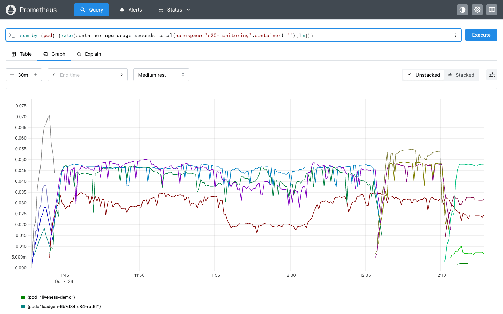

#### Grafana dashboards

The dashboard **S20 Demo App - Monitoring** is a ConfigMap with the label `grafana_dashboard: "1"` ([`06-grafana-dashboard.yaml`](monitoring-demo/06-grafana-dashboard.yaml)). The Grafana sidecar loads it automatically. It shows these panels:

- targets up, ready Pods, restarts and firing alerts
- request rate, error ratio and p95 latency
- CPU and memory per Pod, with the limits
- the podinfo logs from Loki

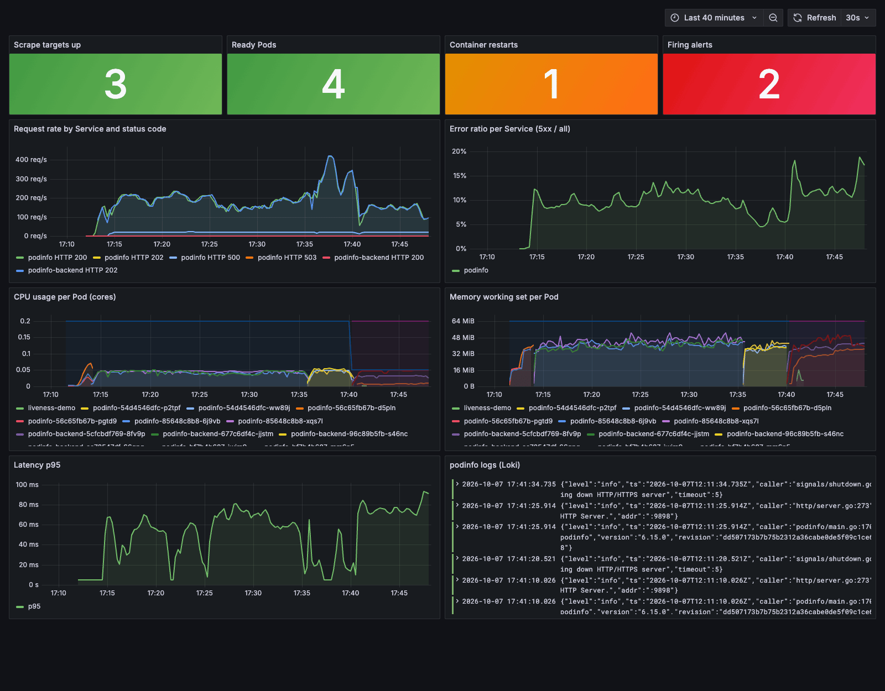

- The CPU panel shows the frontend Pods flat at the 0.05 core limit line while the load generator ran.
- The error ratio is about 8 to 12 %, above the 5 % alert threshold.
- The latency increased to about 90 ms when the CPU was at the limit (CPU throttling).
- The "Firing alerts" stat shows 2 at the time of the screenshot. The "Container restarts" stat shows the restart from the `/panic` demo.

kube-prometheus-stack also installs ready-made dashboards. **Kubernetes / Compute Resources / Namespace (Pods)** for `s20-monitoring` shows the CPU and memory of each Pod against its requests and limits:

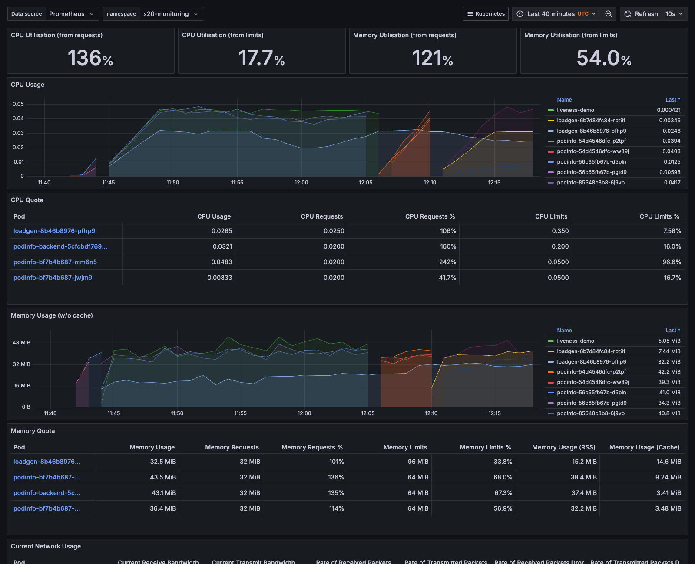

**Node Exporter / Nodes** shows the CPU, load, memory, disk, and network of the node:

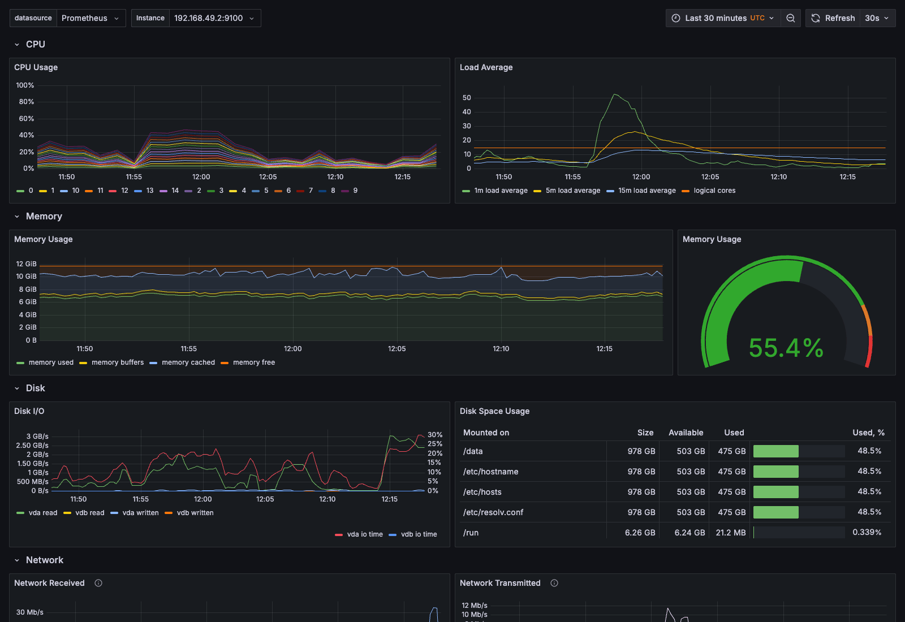

### Application health

Kubernetes checks the health of the application with probes ([`01-podinfo.yaml`](monitoring-demo/01-podinfo.yaml)):

- **Liveness probe** (`/healthz`): if it fails 3 times, the kubelet restarts the container.
- **Readiness probe** (`/readyz`): if it fails, Kubernetes removes the Pod from the Service endpoints. The Pod gets no traffic, but it is not restarted.

Prometheus monitors the health from the outside: `up` (scrape succeeded), `kube_pod_status_ready`, and `kube_pod_container_status_restarts_total`.

#### Step 1: Fail the readiness probe

podinfo has the endpoint `POST /readyz/disable`. After this call, `/readyz` returns HTTP 503.

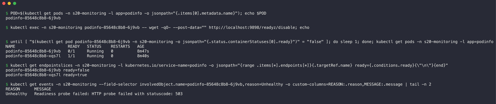

```console
$ POD=$(kubectl get pods -n s20-monitoring -l app=podinfo -o jsonpath="{.items[0].metadata.name}"); echo $POD
podinfo-85648c8b8-6j9vb

$ kubectl exec -n s20-monitoring podinfo-85648c8b8-6j9vb -- wget -qO- --post-data="" http://localhost:9898/readyz/disable; echo


$ until [ "$(kubectl get pod podinfo-85648c8b8-6j9vb -n s20-monitoring -o jsonpath="{.status.containerStatuses[0].ready}")" = "false" ]; do sleep 1; done; kubectl get pods -n s20-monitoring -l app=podinfo
NAME                      READY   STATUS    RESTARTS   AGE
podinfo-85648c8b8-6j9vb   0/1     Running   0          8m47s
podinfo-85648c8b8-xqs7l   1/1     Running   0          8m40s

$ kubectl get endpointslices -n s20-monitoring -l kubernetes.io/service-name=podinfo -o jsonpath="{range .items[*].endpoints[*]}{.targetRef.name} ready={.conditions.ready}{\"\n\"}{end}"
podinfo-85648c8b8-6j9vb ready=false
podinfo-85648c8b8-xqs7l ready=true

$ kubectl get events -n s20-monitoring --field-selector involvedObject.name=podinfo-85648c8b8-6j9vb,reason=Unhealthy -o custom-columns=REASON:.reason,MESSAGE:.message | tail -n 2
REASON      MESSAGE
Unhealthy   Readiness probe failed: HTTP probe failed with statuscode: 503
```

The Pod is `0/1` but `Running` with 0 restarts. The EndpointSlice marks it `ready=false`, so the Service does not send traffic to it. After 30 seconds, `PodinfoPodNotReady` fired (refer to the [Alerts](#alerts) screenshots).

#### Step 2: Crash the process

podinfo has the endpoint `/panic`. It stops the process with exit code 255. The kubelet restarts the container (restart policy `Always`).


```console
$ kubectl get pod podinfo-bf7b4b687-jwjm9 -n s20-monitoring
NAME                      READY   STATUS    RESTARTS   AGE
podinfo-bf7b4b687-jwjm9   1/1     Running   0          19s

$ kubectl exec -n s20-monitoring podinfo-bf7b4b687-jwjm9 -- wget -qO- http://localhost:9898/panic; echo "exit code: $?"
wget: error getting response: Invalid argument
command terminated with exit code 1
exit code: 1

$ until [ "$(kubectl get pod podinfo-bf7b4b687-jwjm9 -n s20-monitoring -o jsonpath='{.status.containerStatuses[0].ready}')" = true ] && [ "$(kubectl get pod podinfo-bf7b4b687-jwjm9 -n s20-monitoring -o jsonpath='{.status.containerStatuses[0].restartCount}')" -ge 1 ]; do sleep 1; done; kubectl get pod podinfo-bf7b4b687-jwjm9 -n s20-monitoring
NAME                      READY   STATUS    RESTARTS     AGE
podinfo-bf7b4b687-jwjm9   1/1     Running   1 (9s ago)   28s

$ kubectl get pod podinfo-bf7b4b687-jwjm9 -n s20-monitoring -o jsonpath='{.status.containerStatuses[0].lastState.terminated}' | jq -c '{exitCode, reason, finishedAt}'
{"exitCode":255,"reason":"Error","finishedAt":"2026-10-07T12:10:19Z"}

$ kubectl logs podinfo-bf7b4b687-jwjm9 -n s20-monitoring --previous | grep -i panic | head -n 2 | cut -c1-160
{"level":"info","ts":"2026-10-07T12:10:19.741Z","caller":"http/panic.go:14","msg":"Panic command received"}
```

The `wget` error is expected: the server stopped before it sent a response. `lastState.terminated` keeps the exit code 255 of the old container.

#### Step 3: Fail the liveness probe

[`07-liveness-demo.yaml`](monitoring-demo/07-liveness-demo.yaml) starts podinfo with `--unhealthy`. Then `/healthz` always returns HTTP 503.

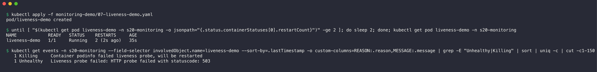

```console
$ kubectl apply -f monitoring-demo/07-liveness-demo.yaml
pod/liveness-demo created

$ until [ "$(kubectl get pod liveness-demo -n s20-monitoring -o jsonpath="{.status.containerStatuses[0].restartCount}")" -ge 2 ]; do sleep 2; done; kubectl get pod liveness-demo -n s20-monitoring
NAME            READY   STATUS    RESTARTS     AGE
liveness-demo   1/1     Running   2 (2s ago)   35s

$ kubectl get events -n s20-monitoring --field-selector involvedObject.name=liveness-demo --sort-by=.lastTimestamp -o custom-columns=REASON:.reason,MESSAGE:.message | grep -E "Unhealthy|Killing" | sort | uniq -c | cut -c1-150
   1 Killing     Container podinfo failed liveness probe, will be restarted
   1 Unhealthy   Liveness probe failed: HTTP probe failed with statuscode: 503
```

The kubelet restarted the container 2 times in 35 seconds. The event says why: "failed liveness probe, will be restarted". Without a fix, the Pod goes to `CrashLoopBackOff`. I deleted the Pod after this step.

#### Step 4: Examine the restart metric

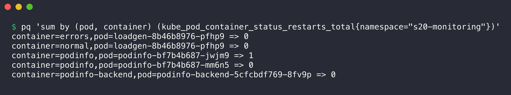

```console
$ pq 'sum by (pod, container) (kube_pod_container_status_restarts_total{namespace="s20-monitoring"})'
container=errors,pod=loadgen-8b46b8976-pfhp9 => 0
container=normal,pod=loadgen-8b46b8976-pfhp9 => 0
container=podinfo,pod=podinfo-bf7b4b687-jwjm9 => 1
container=podinfo,pod=podinfo-bf7b4b687-mm6n5 => 0
container=podinfo-backend,pod=podinfo-backend-5cfcbdf769-8fv9p => 0
```

Prometheus recorded the restart of `podinfo-bf7b4b687-jwjm9`. The built-in alert `KubePodCrashLooping` uses this metric. Together with `up`, `kube_pod_status_ready`, and the probes, this gives a complete view of application health.

---

## Task 2: Observability

### Monitoring and observability

**Monitoring** answers the question "Is the system healthy?". You decide before a problem which signals to watch, and you make dashboards and alerts for them. Task 1 is monitoring: the alert told us that the error rate was above 5 %.

**Observability** answers the question "Why does the system behave like this?". An observable system gives enough data to examine problems that nobody expected. The team can ask new questions without a change to the code. Monitoring is a part of observability. A production system uses both.

| Monitoring | Observability |
|---|---|
| Is something wrong? | Why is it wrong? |
| Known failure signals | Unknown problems too |
| Dashboards and alerts | Metrics + logs + traces, connected |
| Health view | Deep investigation |

### The three pillars

#### Metrics

Metrics are numbers that a system measures over time, for example requests per second, error count, CPU seconds, memory bytes. Each sample has a metric name, labels, a value, and a timestamp. Metrics are cheap to store and fast to query, so they are good for dashboards and alerts. They do not tell you about one single request.

In this demo: Prometheus scraped `http_requests_total`, `http_request_duration_seconds`, `container_cpu_usage_seconds_total` and `kube_pod_status_ready`. The metrics showed **that** the frontend had 8 % errors and **that** its CPU was at the limit.

#### Logs

Logs are text records of events, with a timestamp. Structured logs (JSON) have fields that a tool can filter. Logs give the details of one event: an error message, a stack trace, a user ID. They use more storage than metrics.

In this demo: `kubectl logs` showed the JSON logs of podinfo. Loki kept the "Panic command received" line after the container restarted. The line explained **why** the container restarted.

#### Traces

A trace follows one request through all the services that it touches. A trace has spans. Each span is one operation with a start time, a duration, and attributes. A trace ID goes from service to service in an HTTP header (W3C `traceparent`). Traces show where the time goes and which service fails.

In this demo: podinfo sends spans with OpenTelemetry (OTLP) to Jaeger ([`tracing-demo/jaeger.yaml`](tracing-demo/jaeger.yaml)). The frontend calls the backend on `POST /echo`. The frontend keeps 10 % of the traces (`OTEL_TRACES_SAMPLER_ARG: "0.1"`) to save memory.

The Jaeger search page shows the traces of `POST /echo`. Some traces take about 100 ms and most take less than 1 ms. One trace has an error.

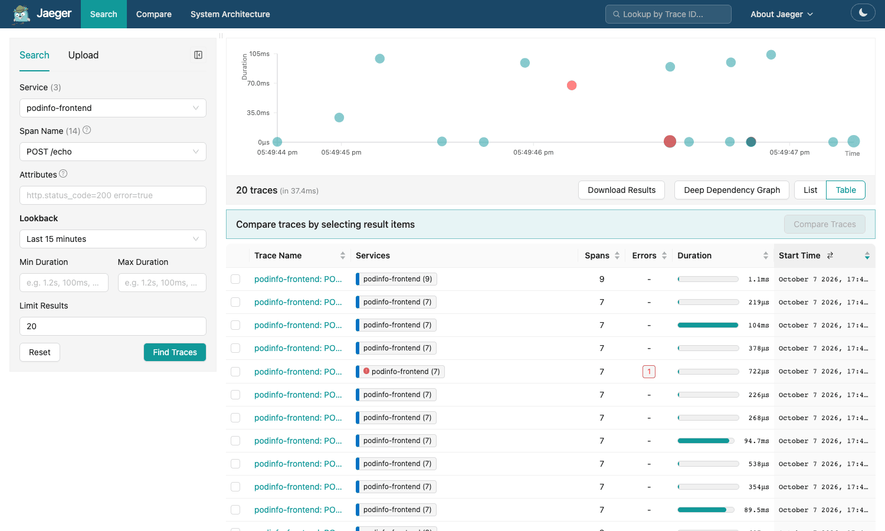

One trace in detail: the frontend span `POST /echo` (204 µs) contains the outgoing `HTTP POST` (172 µs), which contains the backend span `POST /echo` (19 µs). Two services and 9 spans make one request.

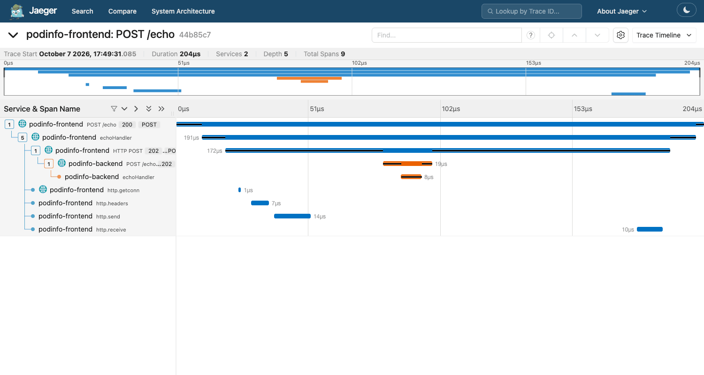


```console
$ curl -s http://127.0.0.1:18603/api/v3/services | jq -c .
{"services":["podinfo-backend","podinfo-frontend","jaeger"]}

$ curl -s -G http://127.0.0.1:18603/api/v3/traces/44b85c7b41d8404318e2c65cce02c5df | jq -r ".result.resourceSpans[] | (.resource.attributes[] | select(.key==\"service.name\") | .value.stringValue) as \$svc | .scopeSpans[].spans[] | [\$svc, .name, (((.endTimeUnixNano|tonumber) - (.startTimeUnixNano|tonumber))/1000 | tostring + \" us\")] | @tsv" | column -t -s "$(printf "\t")"
podinfo-frontend  echoHandler   191.744 us
podinfo-frontend  POST /echo    204.544 us
podinfo-frontend  http.getconn  2.048 us
podinfo-frontend  http.headers  7.68 us
podinfo-frontend  http.send     14.848 us
podinfo-frontend  http.receive  10.496 us
podinfo-frontend  HTTP POST     172.288 us
podinfo-backend   echoHandler   8.704 us
podinfo-backend   POST /echo    19.2 us
```

The traces of 100 ms match the p95 latency metric of about 92 ms from Task 1. The backend spans are short, so the backend is not the cause. The cause is CPU throttling in the frontend. This is how the three pillars work together:

```text
Alert (metric)   PodinfoHighCpu firing, p95 latency 92 ms     -> WHAT is wrong
Trace            frontend spans slow, backend spans fast      -> WHERE it is slow
Metric           CPU usage = CPU limit (0.05 cores)           -> WHY: throttling
Logs             "Panic command received" before the restart  -> WHY a container restarted
```

### Why observability is required

- **Distributed systems fail in new ways.** A request can touch many microservices, queues and databases. A dashboard of known signals cannot show every failure mode.
- **Faster recovery.** A short time to detect and a short time to repair (MTTD, MTTR) need data that points to the cause, not only to the symptom.
- **Short-lived containers.** Kubernetes moves, restarts and deletes Pods. Data that stays only in a Pod is lost with the Pod (the `--previous` example in Task 1). Central metrics, logs and traces keep the data.
- **Service level objectives.** SLOs (for example "99.9 % of requests below 300 ms") need correct, continuous measurement.
- **Capacity and cost.** CPU and memory data shows if requests and limits are too high (waste) or too low (throttling, OOM kills).
- **Security and audit.** Logs record who did what and when.

### Common tools

| Pillar | Open source tools | Managed / commercial |
|---|---|---|
| Metrics | Prometheus, Thanos, Mimir, VictoriaMetrics, metrics-server | Amazon CloudWatch, Google Cloud Monitoring, Datadog |
| Logs | Loki, Elasticsearch / OpenSearch + Kibana (ELK), Fluent Bit, Fluentd, Alloy, Vector | CloudWatch Logs, Splunk, Datadog Logs |
| Traces | Jaeger, Grafana Tempo, Zipkin | AWS X-Ray, Honeycomb, New Relic |
| Collection standard | OpenTelemetry (SDKs + Collector) | All major vendors accept OTLP |
| Dashboards | Grafana, Kibana | Datadog, New Relic |
| Alerting | Alertmanager, Grafana Alerting | PagerDuty, Opsgenie |

This demo used Prometheus, Alertmanager, Grafana, Loki, Alloy, OpenTelemetry and Jaeger.

### Kubernetes observability

Kubernetes has several layers. Each layer has its own signals:

| Layer | Signals | Source in this demo |
|---|---|---|
| Node | CPU, memory, disk, network of the machine | node-exporter |
| Container | CPU, memory, throttling, restarts | kubelet / cAdvisor, metrics-server (`kubectl top`) |
| Kubernetes objects | desired vs. ready replicas, Pod phase, readiness, resource requests and limits | kube-state-metrics |
| Control plane | API server requests and latency | `kubeApiServer` ServiceMonitor |
| Application | requests, errors, latency (RED method) | podinfo `/metrics` via ServiceMonitor |
| Events | Unhealthy, Killing, BackOff, Scheduled | `kubectl get events` |
| Logs | container stdout and stderr | `kubectl logs`, Alloy -> Loki |
| Traces | spans across services | OpenTelemetry -> Jaeger |
| GitOps | sync and health status of applications | Argo CD metrics (`argocd_app_info`) |

The Prometheus Operator adds Kubernetes-native objects: `ServiceMonitor`, `PodMonitor` and `PrometheusRule`. A team adds monitoring with YAML next to the application, like any other Kubernetes object. Labels such as `namespace`, `pod` and `container` are the same in metrics and logs. Thus you can go from a metric to the logs of the same Pod.

Argo CD also exposes metrics. Prometheus scrapes them through the ServiceMonitor of the Argo CD chart. This connects Task 2 and Task 3:

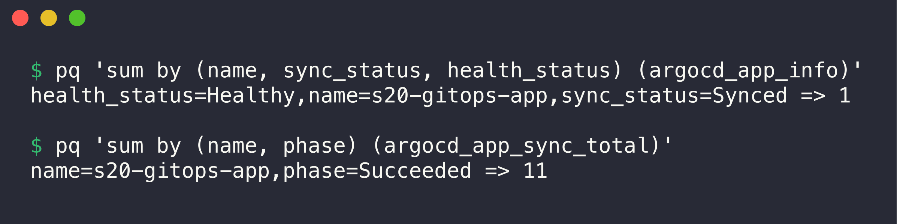

```console
$ pq 'sum by (name, sync_status, health_status) (argocd_app_info)'
health_status=Healthy,name=s20-gitops-app,sync_status=Synced => 1

$ pq 'sum by (name, phase) (argocd_app_sync_total)'
name=s20-gitops-app,phase=Succeeded => 11
```

---

## Task 3: GitOps

### What is GitOps?

GitOps is a way to operate infrastructure and applications. A Git repository holds the full desired state of the system as declarative files. A software agent in the cluster (Argo CD or Flux) makes the cluster match the repository, all the time. The four OpenGitOps principles are:

1. **Declarative**: the files describe the desired state, not the steps.
2. **Versioned and immutable**: Git stores the desired state, with full history.
3. **Pulled automatically**: an agent pulls the desired state from Git.
4. **Continuously reconciled**: the agent compares the actual state with the desired state and corrects the difference.

### Git as the source of truth

The Git repository is the only place where people change the system. If Git and the cluster are different, Git is correct. This gives:

- **History**: every change is a commit with an author, a time, and a message (the Gitea commit list below).
- **Review**: changes go through pull requests before they reach the cluster.
- **Audit**: Git answers "who changed what, and when?".
- **Rollback**: `git revert` returns to a known good state. Argo CD also keeps a sync history.
- **Disaster recovery**: a new cluster gets the same state from the same repository.

In this demo, the source of truth is the repository `gitops-admin/gitops-demo` on Gitea inside the cluster. Argo CD reads it at `http://gitea-http.gitea.svc.cluster.local:3000/gitops-admin/gitops-demo.git`.

### Declarative configuration

Declarative configuration describes **what** you want, not **how** to get it. [`deployment.yaml`](gitops/gitops-repo/app/deployment.yaml) says "3 replicas of podinfo 6.15.0". It does not say "start one more Pod". Kubernetes controllers and Argo CD calculate the steps. Imperative commands such as `kubectl scale` or `kubectl set image` change the cluster but leave no record in Git. Declarative files can be compared (diff), reviewed, and applied again with the same result (idempotent).

### Continuous reconciliation

Reconciliation is a control loop: **observe** the actual state, **compare** it with the desired state, **act** to remove the difference, and repeat.

```text
        +--------------------+
        |   Git (desired)    |
        +---------+----------+
                  |  pull (webhook or poll every 60s)
                  v
        +--------------------+      compare       +---------------------+
        |      Argo CD       | <----------------> | Cluster (actual)    |
        +---------+----------+                    +---------------------+
                  |  OutOfSync?  -> sync (apply)
                  |  drift?      -> self-heal (apply again)
                  |  removed?    -> prune (delete)
                  +--------------------------------> back to desired state
```

Argo CD does this at two speeds. It watches the live Kubernetes objects, so it sees a manual change in about one second. It also checks Git: Gitea sends a webhook on each push, and Argo CD polls every 60 seconds (`timeout.reconciliation: 60s`) as a backup.

### GitOps workflow

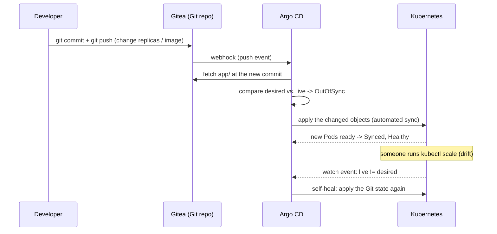
```mermaid
sequenceDiagram
  participant Dev as Developer
  participant Git as Gitea (Git repo)
  participant Argo as Argo CD
  participant K8s as Kubernetes
  Dev->>Git: git commit + git push (change replicas / image)
  Git->>Argo: webhook (push event)
  Argo->>Git: fetch app/ at the new commit
  Argo->>Argo: compare desired vs. live -> OutOfSync
  Argo->>K8s: apply the changed objects (automated sync)
  K8s-->>Argo: new Pods ready -> Synced, Healthy
  Note over K8s: someone runs kubectl scale (drift)
  K8s-->>Argo: watch event: live != desired
  Argo->>K8s: self-heal: apply the Git state again
```

In a full CI/CD pipeline, CI builds and pushes the image, then changes the image tag in the GitOps repository (a commit or a pull request). CD is then only the GitOps agent. The CI system does not need cluster credentials.

### Kubernetes + GitOps

Kubernetes is a good match for GitOps:

- The Kubernetes API is declarative, and every object is a YAML file.
- Kubernetes itself works with control loops (the Deployment controller reconciles ReplicaSets). Argo CD adds one more loop, from Git to the API.
- Argo CD runs inside the cluster and pulls. No external system needs a kubeconfig (pull model, better security).
- One Argo CD can manage many namespaces and clusters. Helm charts and Kustomize overlays also work as the source.
- The Argo CD `Application` is itself a Kubernetes custom resource.

### GitOps demo (mini project)

This demo follows the Session 20 mini project (`session20-monitoring-observability-gitops/08-mini-project` in the class material). The differences are:

- The Git server is Gitea inside the cluster, not GitHub.
- The cluster is minikube, not kind.
- The app is podinfo. It shows its version on `/version`.

#### Step 1: Create the Git repository and push the manifests

1. Read the Gitea admin user and password from the Secret into shell variables. Do not print them.
2. Create the repository with the Gitea API.
3. Commit and push the files from [`gitops/gitops-repo/`](gitops/gitops-repo/).
4. Add a push webhook that calls Argo CD.

```bash
export GITEA_USER=$(kubectl get secret gitea-admin -n gitea -o jsonpath='{.data.username}' | base64 -d)
export GITEA_PASS=$(kubectl get secret gitea-admin -n gitea -o jsonpath='{.data.password}' | base64 -d)
# git uses a credential helper that reads the two variables, so the password is not in the remote URL
git config credential.helper '!f() { echo "username=$GITEA_USER"; echo "password=$GITEA_PASS"; }; f'
```


```console
$ curl -s -u "$GITEA_USER:$GITEA_PASS" -X POST -H "Content-Type: application/json" http://localhost:18620/api/v1/user/repos -d '{"name":"gitops-demo","private":false,"default_branch":"main","description":"Session 20 GitOps demo"}' | jq "{full_name, private, clone_url}"
{
  "full_name": "gitops-admin/gitops-demo",
  "private": false,
  "clone_url": "http://localhost:18620/gitops-admin/gitops-demo.git"
}

$ find app -type f | sort
app/deployment.yaml
app/namespace.yaml
app/service.yaml

$ git add . && git commit -q -m "Add s20 GitOps demo app (2 replicas, podinfo 6.14.1)" && git log --oneline
61ce6cb Add s20 GitOps demo app (2 replicas, podinfo 6.14.1)

$ git push -u origin main 2>&1
To http://localhost:18620/gitops-admin/gitops-demo.git
 * [new branch]      main -> main
branch 'main' set up to track 'origin/main'.

$ curl -s -u "$GITEA_USER:$GITEA_PASS" -X POST -H "Content-Type: application/json" http://localhost:18620/api/v1/repos/gitops-admin/gitops-demo/hooks -d '{"type":"gitea","active":true,"events":["push"],"config":{"url":"http://argocd-server.argocd.svc.cluster.local/api/webhook","content_type":"json"}}' | jq -c "{id, type, events, url: .config.url}"
{"id":2,"type":"gitea","events":["push"],"url":"http://argocd-server.argocd.svc.cluster.local/api/webhook"}
```

The `clone_url` shows the port-forward address because I sent the request through the port-forward. Inside the cluster, Argo CD uses the Service DNS name.

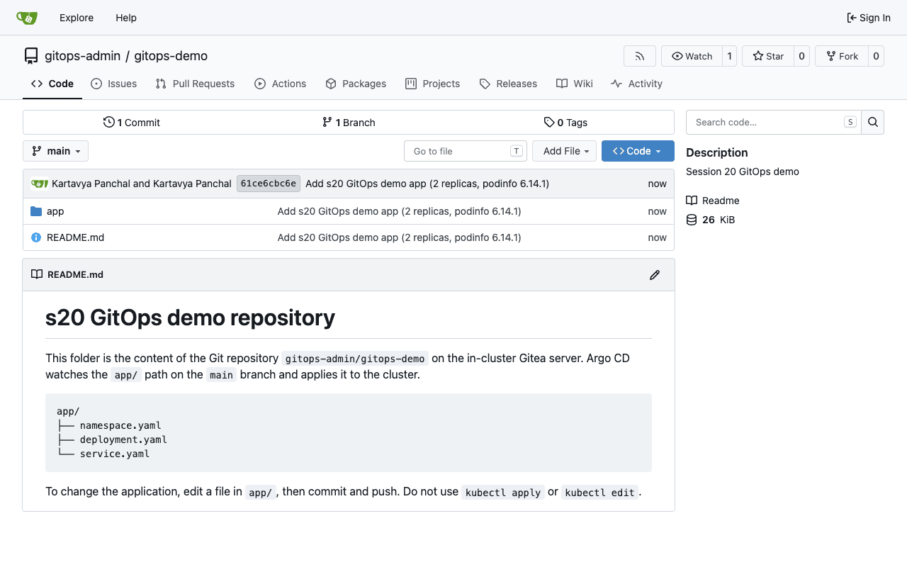

#### Step 2: Create the Argo CD Application

[`gitops/argocd-application.yaml`](gitops/argocd-application.yaml) is outside the `app/` path, as the mini project says. Apply it one time. Argo CD then applies everything in `app/`.

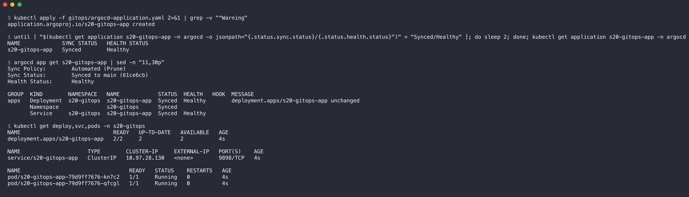

```console
$ kubectl apply -f gitops/argocd-application.yaml 2>&1 | grep -v "^Warning"
application.argoproj.io/s20-gitops-app created

$ until [ "$(kubectl get application s20-gitops-app -n argocd -o jsonpath="{.status.sync.status}/{.status.health.status}")" = "Synced/Healthy" ]; do sleep 2; done; kubectl get application s20-gitops-app -n argocd
NAME             SYNC STATUS   HEALTH STATUS
s20-gitops-app   Synced        Healthy

$ argocd app get s20-gitops-app | sed -n "11,30p"
Sync Policy:        Automated (Prune)
Sync Status:        Synced to main (61ce6cb)
Health Status:      Healthy

GROUP  KIND        NAMESPACE   NAME            STATUS  HEALTH   HOOK  MESSAGE
apps   Deployment  s20-gitops  s20-gitops-app  Synced  Healthy        deployment.apps/s20-gitops-app unchanged
       Namespace               s20-gitops      Synced                 
       Service     s20-gitops  s20-gitops-app  Synced  Healthy        

$ kubectl get deploy,svc,pods -n s20-gitops
NAME                             READY   UP-TO-DATE   AVAILABLE   AGE
deployment.apps/s20-gitops-app   2/2     2            2           4s

NAME                     TYPE        CLUSTER-IP     EXTERNAL-IP   PORT(S)    AGE
service/s20-gitops-app   ClusterIP   10.97.28.130   <none>        9898/TCP   4s

NAME                                  READY   STATUS    RESTARTS   AGE
pod/s20-gitops-app-79d9ff7676-kn7c2   1/1     Running   0          4s
pod/s20-gitops-app-79d9ff7676-qfcgl   1/1     Running   0          4s
```

The `grep -v "^Warning"` removes a Kubernetes 1.37 warning about the finalizer name format. The finalizer works. `argocd app get` shows the policy as "Automated (Prune)". The full policy, with `selfHeal`, is in the Application spec:

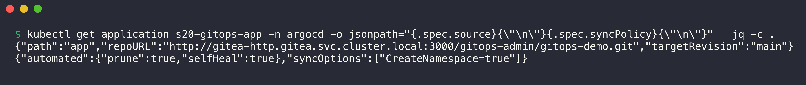

```console
$ kubectl get application s20-gitops-app -n argocd -o jsonpath="{.spec.source}{\"\n\"}{.spec.syncPolicy}{\"\n\"}" | jq -c .
{"path":"app","repoURL":"http://gitea-http.gitea.svc.cluster.local:3000/gitops-admin/gitops-demo.git","targetRevision":"main"}
{"automated":{"prune":true,"selfHeal":true},"syncOptions":["CreateNamespace=true"]}
```

The Argo CD UI shows the resource tree: Namespace, Service, Deployment, ReplicaSet, and 2 Pods, all Synced and Healthy at commit `61ce6cb`.

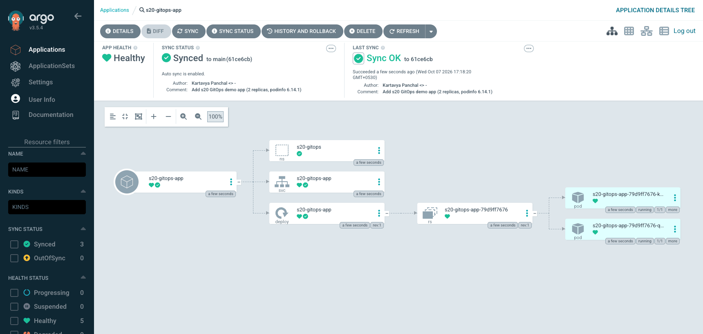

The CLI login used `argocd login 127.0.0.1:18610 --plaintext --skip-test-tls --grpc-web --username admin`. The password is in the Secret `argocd-initial-admin-secret`.

#### Step 3 (a): Change the replica count with a Git commit

Change `replicas: 2` to `replicas: 3` in Git. Do not touch the cluster.

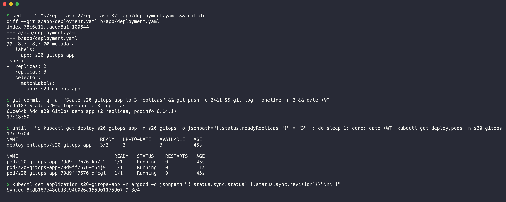

```console
$ sed -i "" "s/replicas: 2/replicas: 3/" app/deployment.yaml && git diff
diff --git a/app/deployment.yaml b/app/deployment.yaml
index 78c6e11..aeed8a1 100644
--- a/app/deployment.yaml
+++ b/app/deployment.yaml
@@ -8,7 +8,7 @@ metadata:
   labels:
     app: s20-gitops-app
 spec:
-  replicas: 2
+  replicas: 3
   selector:
     matchLabels:
       app: s20-gitops-app

$ git commit -q -am "Scale s20-gitops-app to 3 replicas" && git push -q 2>&1 && git log --oneline -n 2 && date +%T
8cdb187 Scale s20-gitops-app to 3 replicas
61ce6cb Add s20 GitOps demo app (2 replicas, podinfo 6.14.1)
17:18:50

$ until [ "$(kubectl get deploy s20-gitops-app -n s20-gitops -o jsonpath="{.status.readyReplicas}")" = "3" ]; do sleep 1; done; date +%T; kubectl get deploy,pods -n s20-gitops
17:19:04
NAME                             READY   UP-TO-DATE   AVAILABLE   AGE
deployment.apps/s20-gitops-app   3/3     3            3           45s

NAME                                  READY   STATUS    RESTARTS   AGE
pod/s20-gitops-app-79d9ff7676-kn7c2   1/1     Running   0          45s
pod/s20-gitops-app-79d9ff7676-m54j9   1/1     Running   0          11s
pod/s20-gitops-app-79d9ff7676-qfcgl   1/1     Running   0          45s

$ kubectl get application s20-gitops-app -n argocd -o jsonpath="{.status.sync.status} {.status.sync.revision}{\"\n\"}"
Synced 8cdb187e48ebd3c94b026a155901175007f9f8e4
```

The push was at 17:18:50. The third Pod is 11 seconds old at 17:19:04, so Kubernetes created it at about 17:18:53, 3 seconds after the push. The logs of Argo CD show that the webhook started the sync, not the 60-second poll:

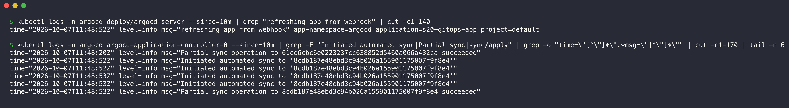

```console
$ kubectl logs -n argocd deploy/argocd-server --since=10m | grep "refreshing app from webhook" | cut -c1-140
time="2026-10-07T11:48:52Z" level=info msg="refreshing app from webhook" app-namespace=argocd application=s20-gitops-app project=default

$ kubectl logs -n argocd argocd-application-controller-0 --since=10m | grep -E "Initiated automated sync|Partial sync|sync/apply" | grep -o "time=\"[^\"]*\".*msg=\"[^\"]*\"" | cut -c1-170 | tail -n 6
time="2026-10-07T11:48:20Z" level=info msg="Partial sync operation to 61ce6cbc6e0223237cc638852d5460a066a432ca succeeded"
time="2026-10-07T11:48:52Z" level=info msg="Initiated automated sync to '8cdb187e48ebd3c94b026a155901175007f9f8e4'"
time="2026-10-07T11:48:52Z" level=info msg="Initiated automated sync to '8cdb187e48ebd3c94b026a155901175007f9f8e4'"
time="2026-10-07T11:48:53Z" level=info msg="Initiated automated sync to '8cdb187e48ebd3c94b026a155901175007f9f8e4'"
time="2026-10-07T11:48:53Z" level=info msg="Initiated automated sync to '8cdb187e48ebd3c94b026a155901175007f9f8e4'"
time="2026-10-07T11:48:53Z" level=info msg="Partial sync operation to 8cdb187e48ebd3c94b026a155901175007f9f8e4 succeeded"
```

The log times are UTC (11:48:52 UTC = 17:18:52 IST).

#### Step 3 (b): Change the image tag with a Git commit

The second commit changes the image from `podinfo:6.14.1` to `podinfo:6.15.0`. Argo CD applies the change, and the Deployment does a rolling update.

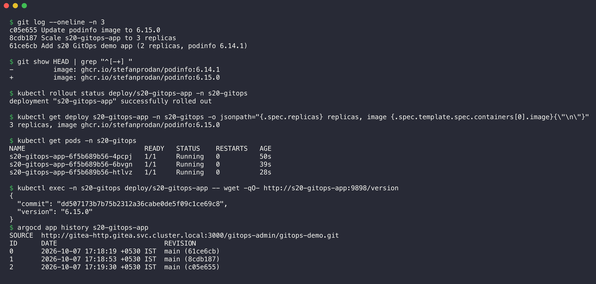

```console
$ git log --oneline -n 3
c05e655 Update podinfo image to 6.15.0
8cdb187 Scale s20-gitops-app to 3 replicas
61ce6cb Add s20 GitOps demo app (2 replicas, podinfo 6.14.1)

$ git show HEAD | grep "^[-+] "
-          image: ghcr.io/stefanprodan/podinfo:6.14.1
+          image: ghcr.io/stefanprodan/podinfo:6.15.0

$ kubectl rollout status deploy/s20-gitops-app -n s20-gitops
deployment "s20-gitops-app" successfully rolled out

$ kubectl get deploy s20-gitops-app -n s20-gitops -o jsonpath="{.spec.replicas} replicas, image {.spec.template.spec.containers[0].image}{\"\n\"}"
3 replicas, image ghcr.io/stefanprodan/podinfo:6.15.0

$ kubectl get pods -n s20-gitops
NAME                              READY   STATUS    RESTARTS   AGE
s20-gitops-app-6f5b689b56-4pcpj   1/1     Running   0          50s
s20-gitops-app-6f5b689b56-6bvgn   1/1     Running   0          39s
s20-gitops-app-6f5b689b56-htlvz   1/1     Running   0          28s

$ kubectl exec -n s20-gitops deploy/s20-gitops-app -- wget -qO- http://s20-gitops-app:9898/version
{
  "commit": "dd507173b7b75b2312a36cabe0de5f09c1ce69c8",
  "version": "6.15.0"
}
$ argocd app history s20-gitops-app
SOURCE  http://gitea-http.gitea.svc.cluster.local:3000/gitops-admin/gitops-demo.git
ID      DATE                           REVISION
0       2026-10-07 17:18:19 +0530 IST  main (61ce6cb)
1       2026-10-07 17:18:53 +0530 IST  main (8cdb187)
2       2026-10-07 17:19:30 +0530 IST  main (c05e655)
```

The application now answers with version `6.15.0`. `argocd app history` shows one sync for each commit. The UI shows the new ReplicaSet (`rev:2`) with 3 Pods and the old ReplicaSet (`rev:1`) with 0 Pods:

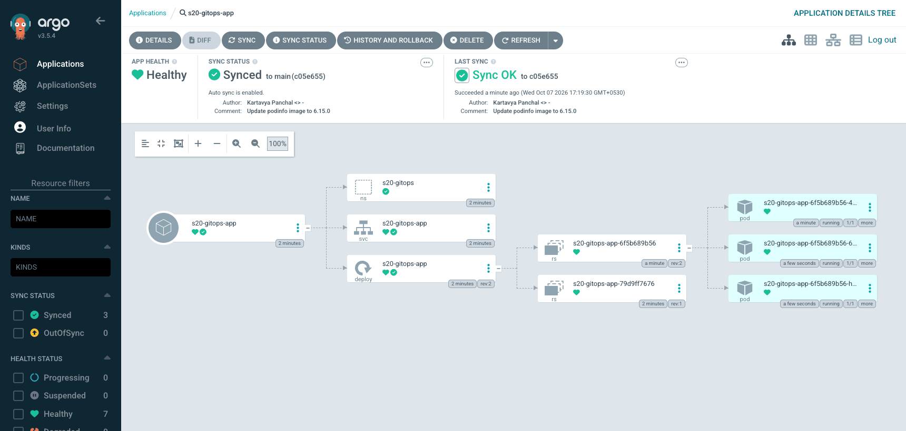

#### Step 4: Change the cluster manually (self-heal)

Scale the Deployment to 1 replica with kubectl. Git still says 3.

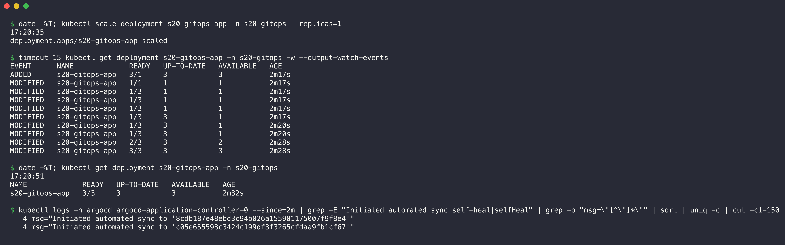

```console
$ date +%T; kubectl scale deployment s20-gitops-app -n s20-gitops --replicas=1
17:20:35
deployment.apps/s20-gitops-app scaled

$ timeout 15 kubectl get deployment s20-gitops-app -n s20-gitops -w --output-watch-events
EVENT      NAME             READY   UP-TO-DATE   AVAILABLE   AGE
ADDED      s20-gitops-app   3/1     3            3           2m17s
MODIFIED   s20-gitops-app   1/1     1            1           2m17s
MODIFIED   s20-gitops-app   1/3     1            1           2m17s
MODIFIED   s20-gitops-app   1/3     1            1           2m17s
MODIFIED   s20-gitops-app   1/3     1            1           2m17s
MODIFIED   s20-gitops-app   1/3     3            1           2m17s
MODIFIED   s20-gitops-app   1/3     3            1           2m20s
MODIFIED   s20-gitops-app   1/3     3            1           2m20s
MODIFIED   s20-gitops-app   2/3     3            2           2m28s
MODIFIED   s20-gitops-app   3/3     3            3           2m28s

$ date +%T; kubectl get deployment s20-gitops-app -n s20-gitops
17:20:51
NAME             READY   UP-TO-DATE   AVAILABLE   AGE
s20-gitops-app   3/3     3            3           2m32s

$ kubectl logs -n argocd argocd-application-controller-0 --since=2m | grep -E "Initiated automated sync|self-heal|selfHeal" | grep -o "msg=\"[^\"]*\"" | sort | uniq -c | cut -c1-150
   4 msg="Initiated automated sync to '8cdb187e48ebd3c94b026a155901175007f9f8e4'"
   4 msg="Initiated automated sync to 'c05e655598c3424c199df3f3265cfdaa9fb1cf67'"
```

The watch shows the drift and the correction. The desired replicas went to 1 (`1/1`), and immediately back to 3 (`1/3`). Then two new Pods started, and the Deployment was `3/3` again after 13 seconds. Nobody changed Git. The Application events show the exact time of the self-heal:

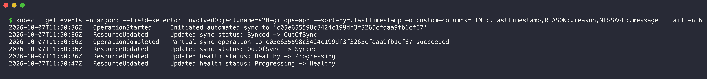

```console
$ kubectl get events -n argocd --field-selector involvedObject.name=s20-gitops-app --sort-by=.lastTimestamp -o custom-columns=TIME:.lastTimestamp,REASON:.reason,MESSAGE:.message | tail -n 6
2026-10-07T11:50:36Z   OperationStarted     Initiated automated sync to 'c05e655598c3424c199df3f3265cfdaa9fb1cf67'
2026-10-07T11:50:36Z   ResourceUpdated      Updated sync status: Synced -> OutOfSync
2026-10-07T11:50:36Z   OperationCompleted   Partial sync operation to c05e655598c3424c199df3f3265cfdaa9fb1cf67 succeeded
2026-10-07T11:50:36Z   ResourceUpdated      Updated sync status: OutOfSync -> Synced
2026-10-07T11:50:36Z   ResourceUpdated      Updated health status: Healthy -> Progressing
2026-10-07T11:50:47Z   ResourceUpdated      Updated health status: Progressing -> Healthy
```

The `kubectl scale` was at 11:50:35 UTC. At 11:50:36 Argo CD saw `OutOfSync`, applied the same commit `c05e655` again, and was `Synced` in the same second.

Self-heal also recreates deleted objects. Delete the Service manually:

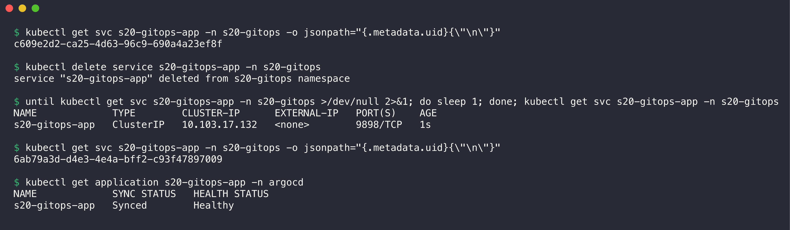

```console
$ kubectl get svc s20-gitops-app -n s20-gitops -o jsonpath="{.metadata.uid}{\"\n\"}"
c609e2d2-ca25-4d63-96c9-690a4a23ef8f

$ kubectl delete service s20-gitops-app -n s20-gitops
service "s20-gitops-app" deleted from s20-gitops namespace

$ until kubectl get svc s20-gitops-app -n s20-gitops >/dev/null 2>&1; do sleep 1; done; kubectl get svc s20-gitops-app -n s20-gitops
NAME             TYPE        CLUSTER-IP      EXTERNAL-IP   PORT(S)    AGE
s20-gitops-app   ClusterIP   10.103.17.132   <none>        9898/TCP   1s

$ kubectl get svc s20-gitops-app -n s20-gitops -o jsonpath="{.metadata.uid}{\"\n\"}"
6ab79a3d-d4e3-4e4a-bff2-c93f47897009

$ kubectl get application s20-gitops-app -n argocd
NAME             SYNC STATUS   HEALTH STATUS
s20-gitops-app   Synced        Healthy
```

The new UID shows that Argo CD created a new Service object. The age is 1 second.

#### Step 5: Remove a file from Git (prune)

Add a ConfigMap in one commit, then remove its file in the next commit. With `prune: true`, Argo CD deletes the live object.

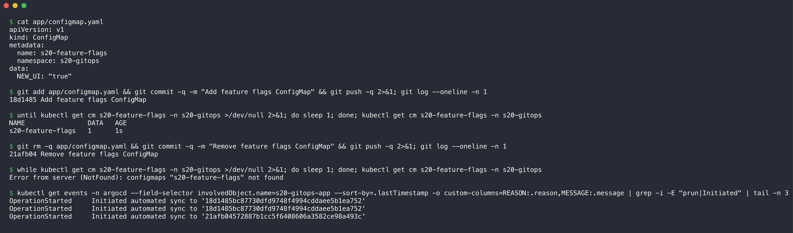

```console
$ cat app/configmap.yaml
apiVersion: v1
kind: ConfigMap
metadata:
  name: s20-feature-flags
  namespace: s20-gitops
data:
  NEW_UI: "true"

$ git add app/configmap.yaml && git commit -q -m "Add feature flags ConfigMap" && git push -q 2>&1; git log --oneline -n 1
18d1485 Add feature flags ConfigMap

$ until kubectl get cm s20-feature-flags -n s20-gitops >/dev/null 2>&1; do sleep 1; done; kubectl get cm s20-feature-flags -n s20-gitops
NAME                DATA   AGE
s20-feature-flags   1      1s

$ git rm -q app/configmap.yaml && git commit -q -m "Remove feature flags ConfigMap" && git push -q 2>&1; git log --oneline -n 1
21afb04 Remove feature flags ConfigMap

$ while kubectl get cm s20-feature-flags -n s20-gitops >/dev/null 2>&1; do sleep 1; done; kubectl get cm s20-feature-flags -n s20-gitops
Error from server (NotFound): configmaps "s20-feature-flags" not found

$ kubectl get events -n argocd --field-selector involvedObject.name=s20-gitops-app --sort-by=.lastTimestamp -o custom-columns=REASON:.reason,MESSAGE:.message | grep -i -E "prun|Initiated" | tail -n 3
OperationStarted     Initiated automated sync to '18d1485bc87730dfd9748f4994cddaee5b1ea752'
OperationStarted     Initiated automated sync to '18d1485bc87730dfd9748f4994cddaee5b1ea752'
OperationStarted     Initiated automated sync to '21afb04572887b1cc5f6408606a3582ce98a493c'
```

Without `prune`, the ConfigMap stays in the cluster as an orphan, and Argo CD only marks it "requires pruning".

The Gitea commit list is the audit trail of all five changes:

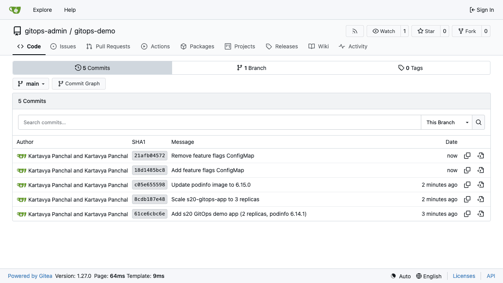

The folder [`gitops/gitops-repo/`](gitops/gitops-repo/) has the first commit (2 replicas, podinfo 6.14.1). The steps above show each later change as a diff.

#### Step 6: Observe the system

The mini project asks for logs, Pods, and the Application status. The output of Steps 2 to 5 shows `kubectl get pods`, `kubectl get application`, and the Argo CD logs. The [Argo CD metrics](#kubernetes-observability) in Prometheus show `Synced` / `Healthy` and 11 successful syncs.

### Answers to the mini project questions

1. **Monitoring vs. observability**: monitoring tells you that something is wrong (known signals). Observability lets you find why (metrics, logs and traces together).
2. **Metrics vs. logs vs. traces**: numbers over time; event records; the path of one request through services.
3. **Prometheus**: a time-series database that scrapes metrics over HTTP, stores them, runs PromQL queries, and evaluates alert rules.
4. **Grafana**: a tool for dashboards. It queries data sources such as Prometheus and Loki and shows graphs.
5. **GitOps**: operation of a system where Git holds the declarative desired state and an agent reconciles the cluster to it.
6. **Git as the source of truth**: all changes go through Git, so Git has the full, reviewed, versioned record. If the cluster is different, Git wins.
7. **Argo CD**: a GitOps controller in Kubernetes. It pulls manifests from Git, compares them with the live objects, and syncs them.
8. **Desired state**: what Git says the system must be (3 replicas of podinfo 6.15.0).
9. **Actual state**: what runs in the cluster now (for example 1 replica after `kubectl scale`).
10. **Reconciliation**: the loop that compares desired and actual state and removes the difference.
11. **Self-healing in Argo CD**: with `selfHeal: true`, Argo CD applies the Git state again when someone changes the cluster manually.
12. **Replicas 2 to 3 in Git**: the webhook (or the poll) tells Argo CD about the new commit. Argo CD sees `OutOfSync`, applies the Deployment, and the Deployment controller starts one more Pod (Step 3 (a)).

---

## Cleanup

I deleted the demo namespaces. The Application has the finalizer `resources-finalizer.argocd.argoproj.io`, so its deletion also deleted the `s20-gitops` namespace and its objects. The platform (`monitoring`, `argocd`, `gitea`) stays for the Final Project.

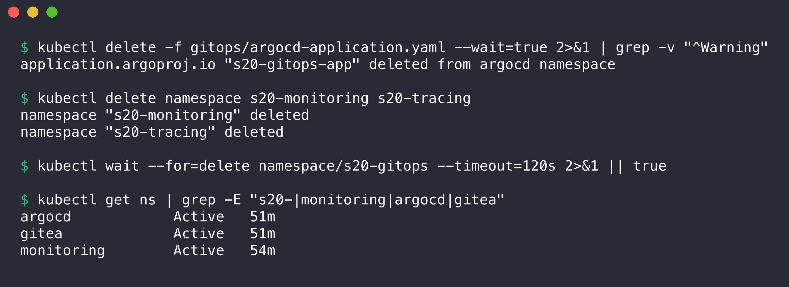

```console
$ kubectl delete -f gitops/argocd-application.yaml --wait=true 2>&1 | grep -v "^Warning"
application.argoproj.io "s20-gitops-app" deleted from argocd namespace

$ kubectl delete namespace s20-monitoring s20-tracing
namespace "s20-monitoring" deleted
namespace "s20-tracing" deleted

$ kubectl wait --for=delete namespace/s20-gitops --timeout=120s 2>&1 || true

$ kubectl get ns | grep -E "s20-|monitoring|argocd|gitea"
argocd            Active   51m
gitea             Active   51m
monitoring        Active   54m
```

I stopped all port-forwards and logged the `argocd` CLI out. The repository `gitops-admin/gitops-demo` stays in Gitea as a record of the demo.

---

## Problems and fixes

| Problem | Cause | Fix |
|---|---|---|
| Grafana used 100 % of its CPU (4 cores before a limit was set, then 1 core) and the dashboards did not load | Grafana 13.2.3 (the chart default) with SQLite: its internal API server timed out ("Handler timeout") when it rendered the large default dashboards | Pinned `grafana.image.tag: "11.6.16"`, added a CPU limit, and turned on the SQLite WAL. Grafana now uses about 30m CPU. |
| `PodinfoHighErrorRate` did not fire at first | The first rule divided by the requests of the frontend and the backend together, so the ratio was 4.4 % | The rule now calculates the ratio `by (namespace, service)`. The frontend ratio is about 8 %. |
| fortio stopped after the first HTTP 500 | fortio stops on errors by default | Added `-allow-initial-errors` to the error container. |
| Jaeger was `OOMKilled` | The in-memory store keeps 100000 traces; the load made about 450 spans per second | Jaeger config with `max_traces: 5000`, and 10 % trace sampling in podinfo. |
| podinfo logged "unknown service ... LogsService" every second | podinfo also exports OpenTelemetry logs; Jaeger accepts traces only | Added a `logs` pipeline with the `nop` exporter to the Jaeger config. |
| `argocd login` killed the port-forward | The CLI first tests TLS; the plain-HTTP server resets the connection, and `kubectl port-forward` stops on a reset | `argocd login ... --plaintext --skip-test-tls --grpc-web`, and a port-forward restart loop. |
| The first Gitea commit showed an email address in Gitea and Argo CD | The local git config had a placeholder email | Deleted the repo and the Application, and pushed again with an empty `user.email`. |
