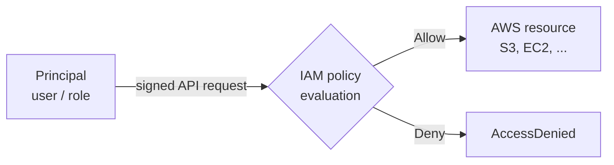
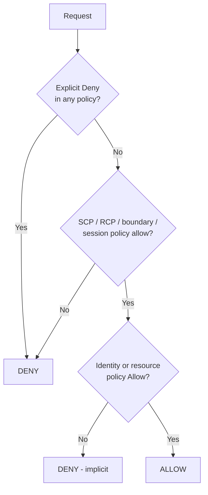
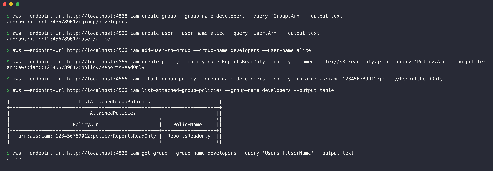

# 01. IAM - Governance

## What is IAM?

AWS Identity and Access Management (IAM) controls **who** can do **what** on **which** AWS resources. IAM does two tasks:

- **Authentication:** IAM checks the identity of the caller (a user, a role, or an application).
- **Authorization:** IAM checks the policies and decides if the request is allowed.

IAM is a global service. It is not tied to one region. IAM has no extra cost.



Every AWS account also has a **root user**. The root user has full access to everything, and policies cannot restrict it inside its own account. Use the root user only for the few tasks that need it, for example to close the account or change the support plan.

## Users

An **IAM user** is an identity for one person or one application in one account.

- A user can have a password for the AWS Management Console.
- A user can have up to two **access keys** (access key ID + secret access key) for the CLI, SDKs and the API.
- A new user has **no permissions**. You must attach policies.

AWS now recommends **IAM Identity Center** (the successor to AWS SSO) for people. Identity Center gives temporary credentials and connects to an identity provider such as Okta, Microsoft Entra ID or Google Workspace. Use IAM users with long-term access keys only when there is no other option.

## Groups

An **IAM group** is a collection of IAM users.

- You attach policies to the group. All users in the group get these permissions.
- A user can be in more than one group (up to 10).
- Groups cannot contain other groups.
- A group is not a principal. You cannot use a group in the `Principal` element of a resource-based policy, and a group cannot sign in.

Example: a `developers` group with read access to S3 and EC2, and an `admins` group with full access.

## Roles

An **IAM role** is an identity with permissions but **no long-term credentials**. A trusted principal **assumes** the role and AWS STS gives it temporary credentials (access key, secret key and session token). These credentials expire after a time from 15 minutes to 12 hours.

A role has two policies:

- **Trust policy:** who can assume the role (for example `ec2.amazonaws.com`, another AWS account, or a GitHub Actions OIDC provider).
- **Permissions policy:** what the role can do after someone assumes it.

Typical roles:

- **EC2 instance role** (through an instance profile): the application on the instance calls S3 without access keys on disk.
- **Lambda execution role:** the permissions of a Lambda function.
- **Cross-account role:** users in account A get access to account B.
- **Federation role:** GitHub Actions, or users from a corporate identity provider, get temporary AWS access through OIDC or SAML.
- **Service-linked role:** a role that an AWS service creates and manages for itself.

## Policies

A **policy** is a JSON document that defines permissions. Each statement has these elements:

| Element | Meaning |
|---------|---------|
| `Effect` | `Allow` or `Deny` |
| `Action` | API operations, for example `s3:GetObject` or `ec2:*` |
| `Resource` | ARNs that the statement applies to |
| `Principal` | Only in resource-based policies: who gets the access |
| `Condition` | Optional rules, for example source IP, MFA present, tag values, `aws:SecureTransport` |

Example: read-only access to one bucket.

```json
{
  "Version": "2012-10-17",
  "Statement": [
    {
      "Effect": "Allow",
      "Action": ["s3:GetObject", "s3:ListBucket"],
      "Resource": [
        "arn:aws:s3:::reports-bucket",
        "arn:aws:s3:::reports-bucket/*"
      ]
    }
  ]
}
```

Types of policies:

| Type | Attached to | Notes |
|------|-------------|-------|
| AWS managed policy | users, groups, roles | AWS writes and updates it, for example `ReadOnlyAccess`. Easy, but often too broad. |
| Customer managed policy | users, groups, roles | You write it. You can use it on many identities. It has versions. |
| Inline policy | one user, group or role | Part of that identity only. AWS deletes it with the identity. |
| Resource-based policy | a resource (S3 bucket, SQS queue, KMS key, role trust policy) | Has a `Principal` element. Can give access to other accounts. |
| Permissions boundary | a user or role | Sets the **maximum** permissions. It does not give permissions by itself. |
| Service control policy (SCP) | an AWS Organizations account or OU | Sets the maximum permissions for all identities in the accounts, including the root user of member accounts. |
| Resource control policy (RCP) | an AWS Organizations account or OU | Sets the maximum permissions on resources in the accounts. |
| Session policy | an assumed-role session | Limits a session to fewer permissions. |

## Permissions

IAM evaluates all policies that apply to a request with these rules:

1. By default, every request is **denied** (implicit deny).
2. An explicit `Allow` in an identity-based or resource-based policy overrides the implicit deny.
3. An explicit `Deny` in **any** policy overrides every `Allow`.
4. SCPs, RCPs, permissions boundaries and session policies must also allow the action. If one of them does not allow it, the request is denied.



Use the **IAM policy simulator** or `aws iam simulate-principal-policy` to test a policy before you use it.

## Least privilege

**Least privilege** means: give each identity only the permissions that it needs for its task, and nothing more.

How to apply it:

- Start with no permissions. Add only the actions and resources that the task needs.
- Use specific actions (`s3:GetObject`) and specific ARNs, not `*`.
- Add conditions, for example only from the company network, or only with MFA.
- Use **IAM Access Analyzer** to create a policy from the CloudTrail activity of a role. It also finds unused roles, unused permissions and resources that are shared outside the account.
- Examine the "last accessed" information. Remove permissions that nobody used in the last 90 days.

## IAM best practices

1. Do not use the root user for daily work. Enable MFA for it. Do not create access keys for it.
2. Use IAM Identity Center and federation for people, so that they get temporary credentials.
3. Use IAM roles for workloads (EC2, Lambda, ECS, CI/CD). Do not put access keys in code, AMIs or Git.
4. Require MFA for all human users. Phishing-resistant MFA (passkeys, FIDO2 security keys) is the best option.
5. Apply least privilege. Start from AWS managed policies only as a first step, then reduce them to customer managed policies.
6. Use groups to give permissions to users, not policies on each user.
7. If you must use access keys, rotate them on a schedule and remove keys that nobody uses.
8. Use permissions boundaries to let developers create roles safely.
9. Use AWS Organizations with SCPs as guardrails across accounts.
10. Enable AWS CloudTrail in all regions to log every API call. Review the logs.
11. Use IAM Access Analyzer to find public and cross-account access.
12. Use a strong password policy if you have IAM users with console passwords.

## Common use cases

- Give developers read-only access to production and full access to a sandbox account.
- Let an EC2 instance or a Lambda function read from S3 or DynamoDB without stored keys.
- Let GitHub Actions deploy to AWS through OIDC, with no long-term secrets in GitHub.
- Give an auditor or a partner company cross-account read access.
- Give contractors temporary access that expires automatically.
- Limit what all accounts in a company can do (for example, deny all regions except two) with SCPs.

## CLI example on the local emulator

I ran these commands against the Moto emulator (`http://localhost:4566`), not against real AWS. They create a group, a user, a customer managed policy (the read-only example above), and attach the policy to the group.



```console
$ aws --endpoint-url http://localhost:4566 iam create-group --group-name developers --query 'Group.Arn' --output text
arn:aws:iam::123456789012:group/developers

$ aws --endpoint-url http://localhost:4566 iam create-user --user-name alice --query 'User.Arn' --output text
arn:aws:iam::123456789012:user/alice

$ aws --endpoint-url http://localhost:4566 iam add-user-to-group --group-name developers --user-name alice

$ aws --endpoint-url http://localhost:4566 iam create-policy --policy-name ReportsReadOnly --policy-document file://s3-read-only.json --query 'Policy.Arn' --output text
arn:aws:iam::123456789012:policy/ReportsReadOnly

$ aws --endpoint-url http://localhost:4566 iam attach-group-policy --group-name developers --policy-arn arn:aws:iam::123456789012:policy/ReportsReadOnly

$ aws --endpoint-url http://localhost:4566 iam list-attached-group-policies --group-name developers --output table
---------------------------------------------------------------------------
|                        ListAttachedGroupPolicies                        |
+-------------------------------------------------------------------------+
||                           AttachedPolicies                            ||
|+---------------------------------------------------+-------------------+|
||                     PolicyArn                     |    PolicyName     ||
|+---------------------------------------------------+-------------------+|
||  arn:aws:iam::123456789012:policy/ReportsReadOnly |  ReportsReadOnly  ||
|+---------------------------------------------------+-------------------+|

$ aws --endpoint-url http://localhost:4566 iam get-group --group-name developers --query 'Users[].UserName' --output text
alice
```

User `alice` gets the `ReportsReadOnly` permissions through the `developers` group. After the demo, I removed the user, the group and the policy.

## References

- [IAM User Guide](https://docs.aws.amazon.com/IAM/latest/UserGuide/introduction.html)
- [Security best practices in IAM](https://docs.aws.amazon.com/IAM/latest/UserGuide/best-practices.html)
- [Policy evaluation logic](https://docs.aws.amazon.com/IAM/latest/UserGuide/reference_policies_evaluation-logic.html)
