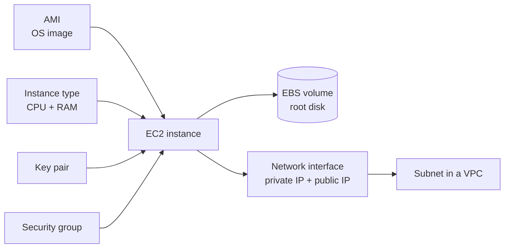
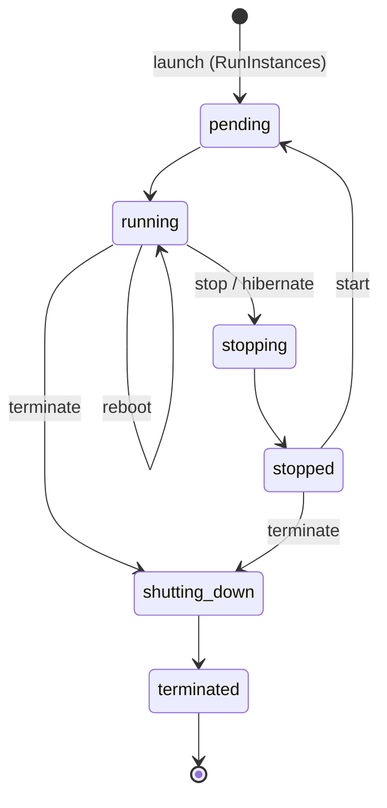

# 02. EC2 - Compute

## What is EC2?

Amazon Elastic Compute Cloud (EC2) gives you virtual servers, called **instances**, in the AWS cloud. You select the operating system, the CPU, the memory, the storage and the network. You pay only while the instance runs. Linux and Windows instances have per-second billing, with a minimum of 60 seconds.

EC2 is **Infrastructure as a Service (IaaS)**. AWS manages the physical hardware and the hypervisor (the Nitro System). You manage the operating system, patches, applications and data.



Pricing options:

| Option | Description |
|--------|-------------|
| On-Demand | Pay per second. No commitment. |
| Savings Plans | Commit to an amount of USD per hour for 1 or 3 years. Up to about 72% lower cost. |
| Reserved Instances | Commit to one instance type in one region for 1 or 3 years. |
| Spot Instances | Use spare capacity at up to 90% lower cost. AWS can stop the instance with a 2-minute warning. |
| Dedicated Hosts | A physical server only for you, for licenses that need it. |

## AMI

An **Amazon Machine Image (AMI)** is the template that EC2 uses to start an instance. An AMI contains:

- One or more EBS snapshots (or an instance-store template) with the operating system and software.
- Launch permissions: who can use the AMI.
- A block device mapping: which volumes to attach at start.

AMI facts:

- An AMI is regional. Copy it to another region to use it there. The same OS has a different AMI ID in each region.
- Sources: AWS (Amazon Linux 2023, Ubuntu, Windows Server, and others), AWS Marketplace, community AMIs, and your own AMIs.
- An AMI is for one architecture: `x86_64` or `arm64` (AWS Graviton).
- **Golden AMI:** your own AMI with the OS hardened and your software installed. Tools such as EC2 Image Builder or Packer build golden AMIs.
- To find the newest Amazon Linux 2023 AMI, use the public SSM parameter `/aws/service/ami-amazon-linux-latest/al2023-ami-kernel-default-x86_64`.

## Instance types

The instance type sets the CPU, memory, storage and network capacity.

Name format: `m7g.xlarge`

| Part | Meaning |
|------|---------|
| `m` | Family (general purpose) |
| `7` | Generation |
| `g` | Extra attribute: `g` = Graviton (ARM), `i` = Intel, `a` = AMD, `d` = local NVMe disk, `n` = more network bandwidth |
| `xlarge` | Size: nano, micro, small, medium, large, xlarge, 2xlarge ... metal |

Families:

| Family | Type | Examples | Use |
|--------|------|----------|-----|
| General purpose | balanced CPU and memory | `t3`, `t4g`, `m7i`, `m7g`, `m8g` | web servers, small databases, development |
| Burstable | low baseline CPU, CPU credits | `t3`, `t3a`, `t4g` | low-traffic sites, test servers |
| Compute optimized | more CPU per GB of RAM | `c7i`, `c7g`, `c8g` | batch jobs, game servers, video encoding |
| Memory optimized | more RAM per vCPU | `r7i`, `r7g`, `x2idn`, `u7i` | in-memory caches, big databases, SAP HANA |
| Storage optimized | fast local NVMe disks | `i4i`, `i7ie`, `d3` | NoSQL databases, data warehouses |
| Accelerated computing | GPU or ML chips | `g6`, `p5`, `inf2`, `trn1` | machine learning, graphics |

The AWS Free Tier includes small burstable types such as `t2.micro`, `t3.micro` and `t4g.micro` (the exact offer depends on the date that you opened the account).

## Key pairs

A **key pair** is a public key and a private key for SSH login to Linux instances (or to decrypt the Windows administrator password).

- AWS keeps only the **public key**. At first boot, EC2 puts it in `~/.ssh/authorized_keys` of the default user (`ec2-user` on Amazon Linux, `ubuntu` on Ubuntu).
- You download the **private key** (`.pem`) one time only. If you lose it, AWS cannot give it to you again.
- Key types: RSA and ED25519.

```bash
chmod 400 my-key.pem
ssh -i my-key.pem ec2-user@<public-ip>
```

**WARNING:** Do not share the private key and do not commit it to Git. A person with the key can log in to the instance.

Alternatives that do not need an open SSH port or long-term keys:

- **AWS Systems Manager Session Manager:** shell access through the SSM agent and IAM. No inbound port is necessary.
- **EC2 Instance Connect:** AWS pushes a temporary public key that is valid for 60 seconds.

## Security Groups

A **security group** is a virtual firewall for an instance (more exactly, for its network interface).

- Rules are **allow only**. You cannot write a deny rule.
- Security groups are **stateful**. If an inbound request is allowed, the response goes out automatically, and the reverse.
- A new security group has no inbound rules (all inbound traffic is blocked) and one outbound rule that allows all traffic.
- A rule source can be a CIDR block, a prefix list, or **another security group**. Example: the database security group allows port 5432 only from the web server security group.
- One instance can have up to 5 security groups by default. AWS combines all their rules.
- Changes apply immediately.

Example for a web server:

| Direction | Protocol | Port | Source/Destination |
|-----------|----------|------|--------------------|
| Inbound | TCP | 80 | `0.0.0.0/0` |
| Inbound | TCP | 443 | `0.0.0.0/0` |
| Inbound | TCP | 22 | `203.0.113.10/32` (admin IP only) |
| Outbound | All | All | `0.0.0.0/0` |

## EBS

**Amazon Elastic Block Store (EBS)** gives network-attached block storage (virtual disks) to EC2 instances.

- An EBS volume is in **one Availability Zone**. It can attach only to instances in the same AZ.
- The data stays when the instance stops. The root volume is deleted at termination by default (`DeleteOnTermination = true`). Extra volumes stay by default.
- **Snapshots** are incremental backups of a volume. AWS stores them in S3 (you do not see the bucket). You can copy snapshots to other regions and create new volumes from them.
- You can enable encryption with AWS KMS. You can also enable "EBS encryption by default" for each region of the account.
- Elastic Volumes: you can increase the size or change the type of a volume while it is in use.

Volume types:

| Type | Kind | Performance | Use |
|------|------|-------------|-----|
| `gp3` | General purpose SSD | 3,000 IOPS and 125 MB/s baseline, configurable up to 80,000 IOPS | default for most workloads |
| `gp2` | General purpose SSD (older) | 3 IOPS per GB, burst to 3,000 | older systems |
| `io2` Block Express | Provisioned IOPS SSD | up to 256,000 IOPS, 99.999% durability | large databases |
| `st1` | Throughput optimized HDD | high MB/s, low cost | big data, logs |
| `sc1` | Cold HDD | lowest cost | data that you seldom read |

**Instance store** is different: it is a disk on the physical host. It is very fast, but the data is lost when the instance stops or terminates.

## Public vs private IP

| | Private IPv4 address | Public IPv4 address | Elastic IP address |
|---|---|---|---|
| From | the subnet CIDR (for example `10.20.1.4`) | the AWS pool | the AWS pool, allocated to your account |
| Reachable from | inside the VPC (and peered or VPN networks) | the internet | the internet |
| When it changes | never, for the life of the instance | at every stop/start | never, until you release it |
| Cost | free | charged per hour | charged per hour |

How it works:

- Every instance gets a private IP address from its subnet.
- An instance in a public subnet can get a public IP address (`map_public_ip_on_launch` or `associate_public_ip_address`). The instance OS does not see the public IP. The Internet Gateway translates between the public and the private address (1:1 NAT).
- An **Elastic IP** is a static public IPv4 address. You can move it from one instance to another.
- Since February 2024, AWS charges for **all** public IPv4 addresses, about USD 0.005 per hour each. IPv6 addresses are free.

## Instance lifecycle



| State | Billing | Notes |
|-------|---------|-------|
| `pending` | no | EC2 prepares the host and boots the instance. |
| `running` | yes | The instance works. |
| `stopping` / `stopped` | no compute charge | EBS volumes and Elastic IPs are still charged. On start, the instance usually moves to a new host and gets a new public IP. |
| Hibernate | no compute charge | EC2 saves the RAM to the encrypted root EBS volume. At the next start, the applications continue from the saved state. |
| Reboot | yes | Same host, same IP addresses, same data. |
| `shutting-down` / `terminated` | no | The instance is deleted permanently. A terminated instance stays visible for about one hour. |

Use **termination protection** (`disable_api_termination`) on important instances. Use **user data** to run a script at first boot. Use **Auto Scaling groups** to replace instances that fail.

## Common use cases

- Web servers and application servers behind an Application Load Balancer.
- Self-managed databases when RDS does not support the configuration.
- CI/CD build agents and self-hosted runners.
- Batch processing and high performance computing, often with Spot Instances.
- Machine learning training and inference on GPU instances.
- Lift-and-shift migration of servers from a data center.
- Bastion hosts and VPN servers.
- Kubernetes worker nodes (Amazon EKS).

## References

- [Amazon EC2 User Guide](https://docs.aws.amazon.com/AWSEC2/latest/UserGuide/concepts.html)
- [Amazon EC2 instance types](https://aws.amazon.com/ec2/instance-types/)
- [Amazon EBS volume types](https://docs.aws.amazon.com/ebs/latest/userguide/ebs-volume-types.html)
- [Instance lifecycle](https://docs.aws.amazon.com/AWSEC2/latest/UserGuide/ec2-instance-lifecycle.html)
