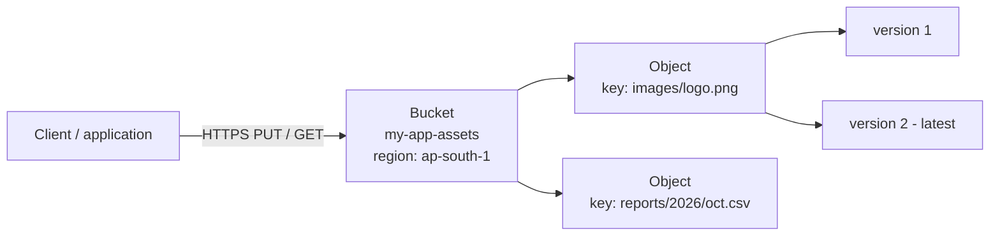

# 03. S3 - Storage

## What is S3?

Amazon Simple Storage Service (S3) is **object storage**. You store files (objects) in containers (buckets) and access them through an HTTPS API.

- S3 has no limit on the total amount of data.
- S3 is designed for 99.999999999% (11 nines) durability. Most storage classes copy each object to at least three Availability Zones.
- S3 has **strong read-after-write consistency** for all operations (since December 2020). After a successful write, every read returns the new data.
- You pay for the storage (GB per month), the requests, and the data that leaves AWS.

Object storage is different from block storage (EBS) and file storage (EFS). You cannot change one part of an object. You upload a new version of the whole object.



## Buckets

A **bucket** is a container for objects.

- A general purpose bucket name must be **globally unique** across all AWS accounts. The name has 3-63 characters: lowercase letters, numbers, dots and hyphens.
- You create a bucket in **one region**. The data stays in that region unless you copy it (for example with Cross-Region Replication).
- An account can have up to 10,000 general purpose buckets by default. You can ask for a higher quota.
- Bucket-level settings: versioning, encryption, Block Public Access, Object Ownership, lifecycle rules, bucket policy, logging, replication, tags, and event notifications.

Bucket types:

| Type | Use |
|------|-----|
| General purpose bucket | The normal S3 bucket. Most use cases. |
| Directory bucket | For the S3 Express One Zone storage class. Very low latency in one AZ. |
| Table bucket (S3 Tables) | Stores tabular data in Apache Iceberg format for analytics. |
| Vector bucket (S3 Vectors) | Stores and queries vector embeddings for semantic search. |

## Objects

An **object** is a file plus its metadata.

| Part | Description |
|------|-------------|
| Key | The full name of the object, for example `reports/2026/oct.csv`. S3 has a flat structure. The `/` only looks like folders (prefixes). |
| Value | The data. 0 bytes to 5 TB. |
| Version ID | Present when versioning is on. |
| Metadata | System metadata (`Content-Type`, `Last-Modified`, `ETag`) and your own `x-amz-meta-*` values. |
| Tags | Up to 10 key-value pairs. Lifecycle rules and IAM policies can use them. |

Upload limits:

- One `PUT` request can upload up to 5 GB.
- Use **multipart upload** for objects larger than 100 MB. It is necessary for objects larger than 5 GB. Each part is uploaded separately and can be retried.
- A **pre-signed URL** gives temporary access to one object without AWS credentials.

## Storage classes

| Storage class | AZs | Minimum storage duration | Retrieval | Use |
|---------------|-----|--------------------------|-----------|-----|
| S3 Standard | ≥ 3 | none | milliseconds | data that you use often |
| S3 Intelligent-Tiering | ≥ 3 | none | milliseconds (optional archive tiers are slower) | unknown or changing access patterns. S3 moves objects between tiers automatically. |
| S3 Standard-IA (Infrequent Access) | ≥ 3 | 30 days | milliseconds, retrieval fee | backups, data that you read about once a month |
| S3 One Zone-IA | 1 | 30 days | milliseconds, retrieval fee | data that you can create again; lost if the AZ is lost |
| S3 Glacier Instant Retrieval | ≥ 3 | 90 days | milliseconds | archives that you read about once a quarter |
| S3 Glacier Flexible Retrieval | ≥ 3 | 90 days | minutes to 12 hours | archives, disaster recovery copies |
| S3 Glacier Deep Archive | ≥ 3 | 180 days | 12 to 48 hours | data that you must keep for 7-10 years (compliance) |
| S3 Express One Zone | 1 | none | single-digit milliseconds | very fast access for ML and analytics, in directory buckets |

Lower storage cost means higher retrieval cost or slower retrieval. You select the class for each object at upload, or a lifecycle rule moves the object later.

## Versioning

**Versioning** keeps every version of every object in the bucket.

- A bucket has one of three states: **unversioned** (default), **enabled**, or **suspended**. After you enable versioning, you cannot go back to unversioned. You can only suspend it.
- Each `PUT` to an existing key creates a new version with a new version ID.
- A `DELETE` without a version ID does not remove data. S3 adds a **delete marker**, and the object looks deleted. Remove the delete marker to restore the object.
- To delete a version permanently, send `DELETE` with its version ID.
- Every version costs storage. Use lifecycle rules to expire old (noncurrent) versions.
- **MFA Delete** can require MFA to delete versions or to change the versioning state.
- Versioning is necessary for replication and for S3 Object Lock (WORM storage).

## Lifecycle policies

A **lifecycle configuration** is a set of rules that S3 applies to objects automatically. A rule can apply to the whole bucket, to a prefix, to tags, or to an object size.

Actions:

- **Transition:** move objects to a cheaper storage class after N days.
- **Expiration:** delete objects after N days.
- **Noncurrent version transition and expiration:** move or delete old versions.
- **Abort incomplete multipart uploads:** remove the parts of uploads that did not finish.
- **Expired object delete marker:** remove delete markers that have no versions behind them.

Example: logs move to Standard-IA after 30 days, to Glacier Flexible Retrieval after 90 days, and S3 deletes them after 365 days.

```json
{
  "Rules": [
    {
      "ID": "logs-retention",
      "Filter": { "Prefix": "logs/" },
      "Status": "Enabled",
      "Transitions": [
        { "Days": 30, "StorageClass": "STANDARD_IA" },
        { "Days": 90, "StorageClass": "GLACIER" }
      ],
      "Expiration": { "Days": 365 },
      "NoncurrentVersionExpiration": { "NoncurrentDays": 30 },
      "AbortIncompleteMultipartUpload": { "DaysAfterInitiation": 7 }
    }
  ]
}
```

## Encryption

**In transit:** S3 endpoints support HTTPS (TLS). A bucket policy can deny requests without TLS (`aws:SecureTransport = false`).

**At rest:** since January 5, 2023, S3 encrypts **all new objects** automatically with SSE-S3. You cannot disable encryption at rest. You can select a different method.

| Method | Who manages the key | Notes |
|--------|---------------------|-------|
| SSE-S3 | S3 | AES-256. Default. No extra cost. |
| SSE-KMS | AWS KMS (AWS managed key or your customer managed key) | CloudTrail logs every use of the key. Key policies control access. Use an **S3 Bucket Key** to reduce the KMS request cost. |
| DSSE-KMS | AWS KMS | Two layers of encryption, for strict compliance rules. |
| SSE-C | You | You send the key with every request. S3 does not store the key. |
| Client-side encryption | You | You encrypt the data before you upload it. |

The [terraform-s3-demo](../../terraform-s3-demo/) project sets SSE-S3 (`AES256`) explicitly with `aws_s3_bucket_server_side_encryption_configuration`.

## Bucket policies

A **bucket policy** is a resource-based IAM policy (JSON) that is attached to a bucket. It has a `Principal` element, so it can give access to other AWS accounts, to AWS services, or to the public. It can also deny access.

Example: deny all requests that do not use HTTPS.

```json
{
  "Version": "2012-10-17",
  "Statement": [
    {
      "Sid": "DenyInsecureTransport",
      "Effect": "Deny",
      "Principal": "*",
      "Action": "s3:*",
      "Resource": [
        "arn:aws:s3:::my-app-assets",
        "arn:aws:s3:::my-app-assets/*"
      ],
      "Condition": { "Bool": { "aws:SecureTransport": "false" } }
    }
  ]
}
```

Other common bucket policies:

- Let a CloudFront distribution read the bucket through Origin Access Control (OAC). The bucket stays private.
- Let another account write logs into the bucket.
- Allow access only from one VPC endpoint (`aws:SourceVpce`).

Related access controls:

- **Block Public Access:** four settings that override any policy or ACL that makes data public. AWS turns them on by default for all new buckets (since April 2023). Keep them on unless the bucket must be public.
- **Object Ownership = Bucket owner enforced:** turns off ACLs. This is the default for new buckets. Use policies, not ACLs.
- **IAM identity policies:** control what users and roles in your own account can do.
- **S3 Access Points:** named endpoints, each with its own policy, for shared datasets.

## Common use cases

- Static website hosting (often behind CloudFront).
- Storage for application files: user uploads, images, videos.
- Backup and restore, and disaster recovery copies.
- Long-term archive and compliance storage (Glacier classes, Object Lock).
- Data lake for analytics with Athena, EMR, Redshift Spectrum or S3 Tables.
- Log storage (CloudTrail, ALB, VPC Flow Logs).
- Software artifacts and build outputs for CI/CD pipelines.
- **Terraform remote state** with versioning and encryption. Terraform 1.10 and later can lock the state with an S3 lock file (`use_lockfile = true`), without a DynamoDB table.

## Hands-on

The [terraform-s3-demo](../../terraform-s3-demo/README.md) project creates a bucket with versioning, SSE-S3 encryption, Block Public Access and tags. It also tests versioning with two uploads of the same key.

## References

- [Amazon S3 User Guide](https://docs.aws.amazon.com/AmazonS3/latest/userguide/Welcome.html)
- [Amazon S3 storage classes](https://aws.amazon.com/s3/storage-classes/)
- [Default encryption for S3 buckets](https://docs.aws.amazon.com/AmazonS3/latest/userguide/default-bucket-encryption.html)
- [Managing the lifecycle of objects](https://docs.aws.amazon.com/AmazonS3/latest/userguide/object-lifecycle-mgmt.html)
