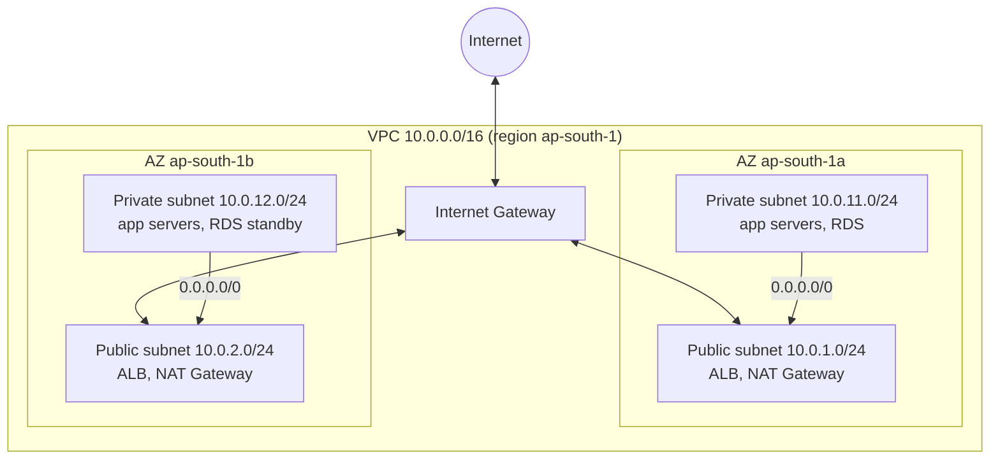

# 04. VPC - Networking

## What is VPC?

Amazon Virtual Private Cloud (VPC) is a logically isolated private network in an AWS region. You control the IP address range, the subnets, the route tables, the gateways and the firewalls. EC2 instances, RDS databases, load balancers and EKS nodes run inside a VPC.

- A VPC belongs to **one region** and covers all Availability Zones (AZs) of that region.
- Each region has a **default VPC** (`172.31.0.0/16`) with one public subnet in each AZ. For real projects, create your own VPC.
- A VPC has no cost. Some parts cost money: NAT Gateways, public IPv4 addresses, VPC endpoints (interface type), and data transfer.

Typical layout: a VPC with public and private subnets in two AZs.

## CIDR

**CIDR (Classless Inter-Domain Routing)** notation writes an IP range as `address/prefix`. The prefix is the number of fixed network bits. The other bits are for hosts.

| CIDR | Host bits | IP addresses |
|------|-----------|--------------|
| `10.0.0.0/16` | 16 | 65,536 |
| `10.0.1.0/24` | 8 | 256 |
| `10.0.1.0/26` | 6 | 64 |
| `10.0.1.0/28` | 4 | 16 |

Formula: number of addresses = 2^(32 - prefix).

VPC rules:

- The primary IPv4 CIDR of a VPC must be from `/16` (65,536 addresses) to `/28` (16 addresses).
- Use private ranges from RFC 1918: `10.0.0.0/8`, `172.16.0.0/12`, `192.168.0.0/16`.
- Do not use a range that overlaps with your office network or with other VPCs. Overlapping ranges block VPC peering, Transit Gateway and VPN connections.
- You can add secondary CIDR blocks later. You can also add an IPv6 `/56` block.

Terraform can calculate subnets: `cidrsubnet("10.0.0.0/16", 8, 1)` returns `10.0.1.0/24`.

## Subnets

A **subnet** is a range of IP addresses inside the VPC CIDR.

- A subnet is in **exactly one Availability Zone**. For high availability, create subnets in at least two AZs.
- Subnet CIDR blocks in one VPC must not overlap.
- AWS reserves **5 addresses** in every subnet. In `10.0.1.0/24`, these are:
  - `10.0.1.0`: network address
  - `10.0.1.1`: VPC router
  - `10.0.1.2`: DNS server (Amazon Route 53 Resolver)
  - `10.0.1.3`: reserved for future use
  - `10.0.1.255`: broadcast address (AWS does not support broadcast)
- So a `/24` subnet has 251 usable addresses.
- The setting `map_public_ip_on_launch` gives a public IPv4 address to new instances in the subnet.

## Route tables

A **route table** contains rules (routes) that decide where network traffic from a subnet goes.

- Each route has a **destination** (a CIDR) and a **target** (for example `local`, an Internet Gateway, a NAT Gateway, a peering connection, a Transit Gateway, or a VPC endpoint).
- Every route table has a `local` route for the VPC CIDR. You cannot remove it. All subnets in a VPC can reach each other through this route.
- AWS selects the route with the **most specific** destination (longest prefix match).
- Each VPC has a **main route table**. A subnet that has no explicit association uses the main route table.
- One subnet has exactly one route table. One route table can serve many subnets.

Public route table:

| Destination | Target |
|-------------|--------|
| `10.0.0.0/16` | `local` |
| `0.0.0.0/0` | `igw-0abc...` (Internet Gateway) |

Private route table:

| Destination | Target |
|-------------|--------|
| `10.0.0.0/16` | `local` |
| `0.0.0.0/0` | `nat-0def...` (NAT Gateway) |

## Internet Gateway

An **Internet Gateway (IGW)** connects a VPC to the internet.

- It is horizontally scaled, redundant and highly available. It has no bandwidth limit that you must manage.
- One VPC can have only one IGW attached. One IGW can attach to only one VPC.
- It does 1:1 NAT between the private IPv4 address and the public IPv4 address of an instance.
- An IGW has no cost. Data transfer and public IPv4 addresses cost money.

For an instance to be reachable from the internet, all of these must be true:

1. The VPC has an attached IGW.
2. The route table of the subnet has a route `0.0.0.0/0` to the IGW.
3. The instance has a public IPv4 address or an Elastic IP.
4. The security group and the network ACL allow the traffic.

## NAT Gateway

A **NAT Gateway** lets instances in **private subnets** start connections to the internet (for example to download updates), but the internet cannot start connections to them.

- A public NAT Gateway is in a **public subnet** and uses an Elastic IP address.
- The private route table sends `0.0.0.0/0` to the NAT Gateway.
- A NAT Gateway is zonal. For high availability, create one NAT Gateway in each AZ, and route each private subnet to the NAT Gateway in its own AZ.
- AWS manages it. It scales automatically up to 100 Gbps.
- Cost: a charge per hour plus a charge per GB of data that it processes. It is often one of the largest network costs. Use VPC gateway endpoints for S3 and DynamoDB (free) to send that traffic around the NAT Gateway.
- A **private NAT Gateway** (no Elastic IP) connects private networks with overlapping or private ranges.
- For IPv6, use an **egress-only Internet Gateway** instead.

A NAT instance (an EC2 instance that does NAT) is the old method. AWS recommends the NAT Gateway.

## Security Groups

A **security group** is a stateful firewall at the **network interface (instance) level**. Refer also to [02-ec2](../02-ec2/README.md#security-groups).

- Only allow rules.
- Stateful: return traffic is allowed automatically.
- AWS evaluates all rules before it decides.
- A rule can refer to another security group as the source. This is the best way to connect tiers: "allow port 5432 from `sg-web`".

## Network ACLs

A **network ACL (NACL)** is a stateless firewall at the **subnet level**.

- It has allow **and** deny rules.
- It is **stateless**. You must allow the return traffic explicitly. The return traffic uses ephemeral ports `1024-65535`.
- AWS evaluates the rules in order of the rule number, from the lowest number. The first rule that matches decides. The last rule `*` denies everything that no other rule matched.
- The default NACL of a VPC allows all inbound and outbound traffic. A new custom NACL denies all traffic until you add rules.
- One subnet has exactly one NACL. One NACL can serve many subnets.
- Use NACLs as an extra layer, for example to block a range of bad IP addresses for a whole subnet.

Security group vs network ACL:

| | Security group | Network ACL |
|---|---|---|
| Level | network interface (instance) | subnet |
| State | stateful | stateless |
| Rules | allow only | allow and deny |
| Evaluation | all rules together | in order of rule number, first match wins |
| Default | deny all inbound, allow all outbound | default NACL: allow all |
| Applies to | only instances that use the group | all instances in the subnet |

## Public vs private subnet

AWS has no "public" setting on a subnet. The **route table** makes the difference.

| | Public subnet | Private subnet |
|---|---|---|
| Route `0.0.0.0/0` | to the Internet Gateway | to a NAT Gateway, or no internet route |
| Public IP on instances | yes (auto-assign or Elastic IP) | no |
| Reachable from the internet | yes, if the security group allows it | no |
| Outbound internet access | directly through the IGW | through the NAT Gateway (if present) |
| Typical resources | load balancers, NAT Gateways, bastion hosts | application servers, databases, caches, EKS nodes |

Best practice: put only the load balancer and the NAT Gateway in public subnets. Put the application and the database in private subnets.

## Hands-on

The [Session 19 project](../../../Cloud-&-Terraform-in-Action/README.md) creates a VPC, a public subnet, an Internet Gateway, a route table, a security group and an EC2 instance with Terraform.

## References

- [Amazon VPC User Guide](https://docs.aws.amazon.com/vpc/latest/userguide/what-is-amazon-vpc.html)
- [Subnet CIDR blocks](https://docs.aws.amazon.com/vpc/latest/userguide/subnet-sizing.html)
- [NAT gateways](https://docs.aws.amazon.com/vpc/latest/userguide/vpc-nat-gateway.html)
- [Compare security groups and network ACLs](https://docs.aws.amazon.com/vpc/latest/userguide/infrastructure-security.html)
