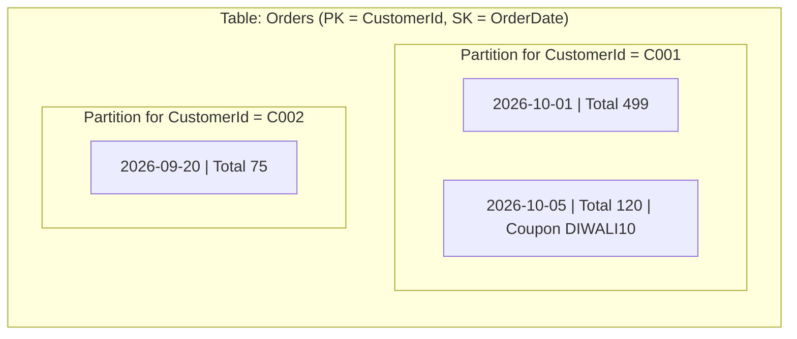

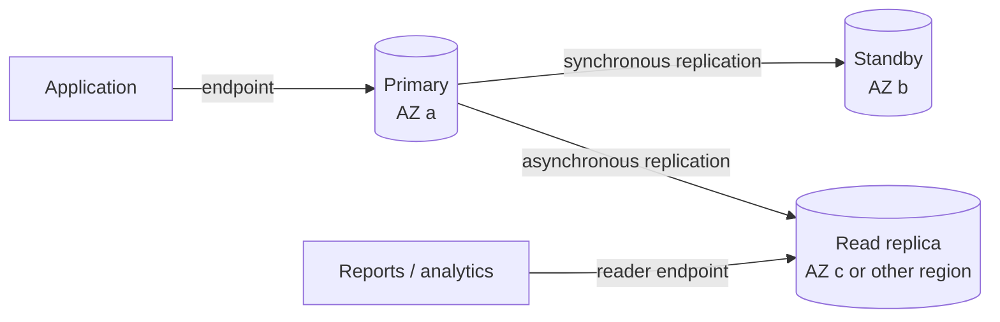

# 05. DynamoDB & RDS - Database Services

AWS has two main managed database services for applications:

| | Amazon DynamoDB | Amazon RDS |
|---|---|---|
| Model | NoSQL (key-value and document) | relational (SQL) |
| Schema | flexible, only the key is fixed | fixed tables, columns and types |
| Servers | serverless, no instances | DB instances that you select and size |
| Scale | horizontal, almost unlimited | vertical (bigger instance) plus read replicas |
| Query | by key, with indexes | any SQL query, joins, transactions |
| Typical latency | single-digit milliseconds at any scale | depends on the query and the instance |

---

# DynamoDB

## NoSQL

Amazon DynamoDB is a fully managed, serverless **NoSQL** database.

- **NoSQL** means "not only SQL". The data does not use fixed relational tables with joins. DynamoDB stores items as key-value pairs and JSON-like documents.
- There are no servers to manage, patch or size. AWS spreads the data over many partitions and copies each partition to three AZs.
- Performance stays at single-digit milliseconds when the table grows from kilobytes to petabytes.
- You design the table for the **access patterns** of the application. You must know the queries before you design the keys. Joins are not available.

Capacity modes:

| Mode | How you pay | Use |
|------|-------------|-----|
| On-demand | per read and write request | new or unpredictable traffic. This is the recommended default. |
| Provisioned | per hour for read capacity units (RCU) and write capacity units (WCU) that you set, with optional auto scaling | steady, predictable traffic |

Other features:

- DynamoDB Streams: a change log of items.
- Time to Live (TTL): automatic delete of old items.
- Global tables: multi-region, multi-active.
- Point-in-time recovery (PITR): up to 35 days.
- Transactions: ACID across up to 100 items.
- DynamoDB Accelerator (DAX): an in-memory cache.

## Tables

A **table** is a collection of items. When you create a table, you define only:

- the table name,
- the **primary key** (partition key, or partition key + sort key),
- the capacity mode.

All other attributes are free. Two items in the same table can have different attributes.

Read consistency:

- **Eventually consistent reads** (default): cheaper (half the cost), can return data that is a short time old.
- **Strongly consistent reads**: return the newest data. Not available on global secondary indexes.

Secondary indexes give more query patterns:

- **Global secondary index (GSI):** a different partition key and sort key. You can add it at any time. Up to 20 per table by default.
- **Local secondary index (LSI):** same partition key, different sort key. You must create it with the table. Up to 5 per table.

## Items

An **item** is one record in a table, like a row in a relational table.

- Each item has a unique primary key.
- The maximum item size is **400 KB**, including attribute names and values.
- Main operations: `PutItem`, `GetItem`, `UpdateItem`, `DeleteItem`, `Query` (items with one partition key), `Scan` (reads the whole table, slow and expensive), `BatchWriteItem`, `TransactWriteItems`.

Example item from an `Orders` table:

```json
{
  "CustomerId": "C001",
  "OrderDate":  "2026-10-05",
  "Total":      120,
  "Coupon":     "DIWALI10",
  "Items":      ["book", "pen"]
}
```

## Attributes

An **attribute** is one data element of an item, like a column. Each attribute has a name and a type.

| Category | Types |
|----------|-------|
| Scalar | String (`S`), Number (`N`), Binary (`B`), Boolean (`BOOL`), Null (`NULL`) |
| Document | List (`L`), Map (`M`). Up to 32 levels of nesting. |
| Set | String set (`SS`), Number set (`NS`), Binary set (`BS`) |

Key attributes (partition key and sort key) must be String, Number or Binary.

## Partition key

The **partition key** (also called the hash key) is the first part of the primary key.

- DynamoDB sends the partition key value through an internal hash function. The result selects the physical partition that stores the item.
- If the table has only a partition key (a **simple primary key**), each partition key value must be unique.
- Select a key with **many different values** and an even spread of traffic, for example `UserId` or `OrderId`. A key with few values (for example `Status`) makes "hot partitions" and throttling.
- A `Query` always needs an exact partition key value.

## Sort key

The **sort key** (also called the range key) is the optional second part of the primary key.

- Partition key + sort key make a **composite primary key**. The combination must be unique. Many items can share one partition key.
- Items with the same partition key are stored together and sorted by the sort key.
- A `Query` can use conditions on the sort key: `=`, `<`, `<=`, `>`, `>=`, `BETWEEN`, `begins_with`.
- Example: partition key `CustomerId`, sort key `OrderDate`. One query returns all orders of a customer in October 2026.



## Use cases

- Shopping carts, user profiles and session stores.
- Gaming leaderboards and player state.
- IoT and time-series data with TTL to remove old data.
- Serverless backends with AWS Lambda and API Gateway.
- Metadata stores and event logs that need very high scale.
- Ad tech and real-time bidding (very low latency).
- Terraform state locking (the older method; Terraform 1.10+ can lock with S3 only).

## CLI example on the local emulator

I ran these commands against the Moto emulator (`http://localhost:4566`), not against real AWS. They create the `Orders` table with a composite primary key, add two items, query one partition with a sort key condition, and remove the table.



```console
$ aws --endpoint-url http://localhost:4566 dynamodb create-table --table-name Orders --attribute-definitions AttributeName=CustomerId,AttributeType=S AttributeName=OrderDate,AttributeType=S --key-schema AttributeName=CustomerId,KeyType=HASH AttributeName=OrderDate,KeyType=RANGE --billing-mode PAY_PER_REQUEST --query 'TableDescription.[TableName,TableStatus]' --output text
Orders	ACTIVE

$ aws --endpoint-url http://localhost:4566 dynamodb put-item --table-name Orders --item '{"CustomerId":{"S":"C001"},"OrderDate":{"S":"2026-10-01"},"Total":{"N":"499"}}'

$ aws --endpoint-url http://localhost:4566 dynamodb put-item --table-name Orders --item '{"CustomerId":{"S":"C001"},"OrderDate":{"S":"2026-10-05"},"Total":{"N":"120"},"Coupon":{"S":"DIWALI10"}}'

$ aws --endpoint-url http://localhost:4566 dynamodb query --table-name Orders --key-condition-expression 'CustomerId = :c AND OrderDate >= :d' --expression-attribute-values '{":c":{"S":"C001"},":d":{"S":"2026-10-03"}}' --query 'Items' --output json
[
    {
        "CustomerId": {
            "S": "C001"
        },
        "OrderDate": {
            "S": "2026-10-05"
        },
        "Total": {
            "N": "120"
        },
        "Coupon": {
            "S": "DIWALI10"
        }
    }
]

$ aws --endpoint-url http://localhost:4566 dynamodb delete-table --table-name Orders --query 'TableDescription.TableName' --output text
Orders
```

The two items have different attributes: only the second item has `Coupon`. The query used the partition key (`C001`) and a sort key condition (`>= 2026-10-03`), so it returned only the order from 5 October.

---

# RDS

## Relational database

Amazon Relational Database Service (RDS) is a managed service for **relational databases**.

- A relational database stores data in **tables** with rows and columns, and a fixed **schema**.
- Tables connect with **primary keys** and **foreign keys**. You use **SQL** to query and join them.
- Transactions follow **ACID**: atomicity, consistency, isolation, durability.

What AWS manages and what you manage:

| AWS manages | You manage |
|-------------|------------|
| hardware, OS, database software installation | schema, indexes, queries |
| patches (in a maintenance window you select) | DB instance class and storage size |
| automated backups and point-in-time recovery | security groups, users and grants |
| Multi-AZ failover, monitoring metrics | parameter groups (database settings) |

You do not get SSH access to the server. (RDS Custom for Oracle and SQL Server gives OS access for special cases.)

## Supported engines

| Engine | Notes |
|--------|-------|
| Amazon Aurora MySQL-Compatible Edition | AWS cloud-native engine. Shared storage over 3 AZs (6 copies). Up to 15 Aurora Replicas. Aurora Serverless v2 scales capacity automatically. |
| Amazon Aurora PostgreSQL-Compatible Edition | Same Aurora architecture, PostgreSQL-compatible. |
| PostgreSQL | Open source. |
| MySQL | Open source. |
| MariaDB | Open source fork of MySQL. |
| Oracle | Commercial. License Included or Bring Your Own License. |
| Microsoft SQL Server | Commercial. Express, Web, Standard and Enterprise editions. |
| IBM Db2 | Commercial (added in November 2023). |

Aurora is part of the RDS family. AWS also has Aurora DSQL, a serverless distributed SQL database, for multi-region active-active workloads.

## DB instances

A **DB instance** is an isolated database environment in the cloud. It can contain one or more databases (depending on the engine).

- **DB instance class:** CPU and memory, for example `db.t4g.micro` (burstable, free tier), `db.m7g.large` (general purpose), `db.r7g.xlarge` (memory optimized). Classes with `g` use AWS Graviton.
- **Storage:** General Purpose SSD (`gp2`, `gp3`) or Provisioned IOPS SSD (`io1`, `io2`). **Storage autoscaling** increases the size automatically when free space is low.
- **Endpoint:** a DNS name such as `mydb.abc123.ap-south-1.rds.amazonaws.com`. Applications connect to it on the engine port (5432 for PostgreSQL, 3306 for MySQL). After a failover, the endpoint points to the new primary.
- **DB subnet group:** the list of subnets (in at least two AZs) where RDS can put the instance.
- **Parameter group:** database engine settings. **Option group:** extra engine features (Oracle, SQL Server, MySQL).
- **Maintenance window:** a weekly time when AWS applies patches.

## Security

- **Network:** put the DB instance in **private subnets**. Set `publicly_accessible = false`.
- **Security groups:** allow the database port only from the security group of the application servers.
- **Encryption at rest:** AWS KMS encrypts the storage, automated backups, snapshots and read replicas. Turn it on when you create the instance. You cannot encrypt an existing unencrypted instance directly. You must restore it from an encrypted copy of a snapshot.
- **Encryption in transit:** SSL/TLS connections. You can force TLS with a parameter (for example `rds.force_ssl = 1` for PostgreSQL).
- **Authentication:** database users and passwords, **IAM database authentication** (a short-lived token instead of a password, for MySQL, MariaDB and PostgreSQL), or Kerberos.
- **Secrets:** let RDS manage the master password in **AWS Secrets Manager** (`manage_master_user_password = true`). Secrets Manager rotates it automatically.
- **Monitoring and audit:** CloudWatch metrics, Enhanced Monitoring, CloudWatch Database Insights (the successor to Performance Insights), database logs, and CloudTrail for API calls.
- **Deletion protection:** turn it on for production instances.

## Backups

| | Automated backups | Manual snapshots |
|---|---|---|
| Created by | RDS, every day in the backup window, plus transaction logs | you |
| Retention | 0-35 days (0 turns off automated backups) | until you delete them |
| Restore | **point-in-time recovery** to any second in the retention period (usually up to about the last 5 minutes) | to the time of the snapshot |
| On instance delete | deleted (unless you keep them) | kept |

- A restore always creates a **new** DB instance with a new endpoint.
- You can copy snapshots to another region or share them with another account.
- **AWS Backup** can manage RDS backups with central policies.

## Multi-AZ

**Multi-AZ** gives high availability. It protects against the failure of an instance, a disk or a whole AZ.

| Deployment | How it works | Readable standby? | Failover time |
|------------|--------------|-------------------|---------------|
| Multi-AZ DB instance | one primary and one standby in another AZ, **synchronous** replication | no | usually 60-120 seconds |
| Multi-AZ DB cluster (MySQL, PostgreSQL) | one writer and two reader instances in three AZs, semi-synchronous replication | yes | usually under 35 seconds |
| Aurora | shared storage over 3 AZs; an Aurora Replica becomes the writer | yes | usually about 30 seconds or less |

- RDS does the failover automatically. The DNS endpoint moves to the new primary. The application must reconnect.
- Multi-AZ is for **availability**, not for read scale (except the cluster types).
- Maintenance and backups have less impact, because RDS can use the standby.



## Read replicas

A **read replica** is a read-only copy of the database. It helps to scale **read** traffic.

- Replication is **asynchronous**. A replica can be a little behind the primary (replica lag).
- Up to 15 read replicas for MySQL, MariaDB and PostgreSQL. Oracle and SQL Server have lower limits.
- A replica can be in the same AZ, in another AZ, or in **another region** (cross-region read replica) for disaster recovery and lower latency for users far away.
- A replica has its own endpoint. The application must send read queries to it.
- You can **promote** a replica to a standalone DB instance, for example in a disaster recovery event. Promotion is manual and stops the replication.
- A read replica can itself be Multi-AZ.

Multi-AZ vs read replicas:

| | Multi-AZ (instance) | Read replica |
|---|---|---|
| Purpose | high availability | read scale, disaster recovery |
| Replication | synchronous | asynchronous |
| Readable | no | yes |
| Failover | automatic | manual promotion |
| Region | same region | same or another region |

## Use cases

- Web and mobile applications that need transactions and joins (users, orders, payments).
- E-commerce, banking and ERP systems where data consistency matters.
- Content management systems such as WordPress (MySQL).
- Move existing on-premises Oracle, SQL Server, MySQL or PostgreSQL databases to AWS with less operations work.
- Reporting with read replicas, so that reports do not slow down the primary.
- SaaS products that need a separate schema or database for each customer.

## When to select which

- Select **DynamoDB** if the access patterns are known and simple (by key), the scale is very large or unpredictable, and you want no servers.
- Select **RDS or Aurora** if you need SQL, joins, complex queries, strict relational integrity, or an application already uses a relational database.

## References

- [Amazon DynamoDB Developer Guide](https://docs.aws.amazon.com/amazondynamodb/latest/developerguide/Introduction.html)
- [DynamoDB core components](https://docs.aws.amazon.com/amazondynamodb/latest/developerguide/HowItWorks.CoreComponents.html)
- [Amazon RDS User Guide](https://docs.aws.amazon.com/AmazonRDS/latest/UserGuide/Welcome.html)
- [Multi-AZ deployments](https://docs.aws.amazon.com/AmazonRDS/latest/UserGuide/Concepts.MultiAZ.html)
- [Working with read replicas](https://docs.aws.amazon.com/AmazonRDS/latest/UserGuide/USER_ReadRepl.html)
